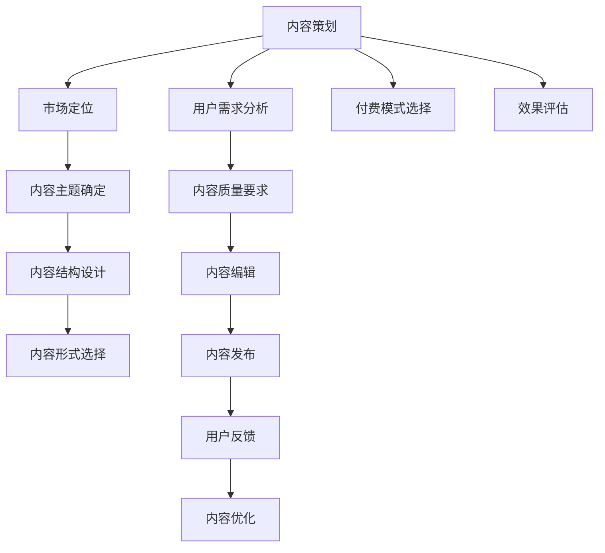

                 

# 知识付费赚钱的内容策划与编辑技巧

## 1. 背景介绍

在知识爆炸的互联网时代，用户渴望获得有深度、有价值的内容。而知识付费作为知识传播的一种新型模式，正吸引着越来越多用户。内容质量和策划技巧的提升，将直接决定知识付费平台的成败。本文将从内容策划与编辑技巧两个角度出发，探讨如何高效、精准、吸引用户的内容生产，实现知识付费的商业价值。

## 2. 核心概念与联系

### 2.1 核心概念概述

- **内容策划**：指确定内容定位、主题、结构、形式、发布计划等，是内容生产的前期工作。
- **内容编辑**：指对已生产的内容进行加工、润色、校对等，保证内容质量。
- **用户需求**：指用户对知识的渴求和对内容形式的偏好，是内容策划和编辑的出发点和归宿。
- **市场定位**：指知识付费平台的目标用户群和内容类型，指导内容生产方向。
- **付费模式**：指知识付费平台采用的收费方式，如单次付费、订阅、按需付费等。

### 2.2 核心概念原理和架构的 Mermaid 流程图



## 3. 核心算法原理 & 具体操作步骤

### 3.1 算法原理概述

内容策划与编辑的过程，本质上是信息检索、分类、聚类、推荐等算法在内容生成中的应用。

- **信息检索**：根据用户需求，检索相关主题和内容。
- **分类**：将内容按照主题、难度、深度等标准进行分类。
- **聚类**：将相似内容进行聚合，便于用户发现相关知识。
- **推荐**：基于用户行为和偏好，推荐最相关的内容。

### 3.2 算法步骤详解

#### 3.2.1 确定主题和内容结构

1. **用户需求分析**：通过问卷调查、用户反馈等方式，了解用户对知识的需求和偏好。
2. **市场定位**：分析目标用户群的特点，确定内容定位和类型。
3. **主题选择**：根据市场定位和用户需求，选择合适的主题。
4. **内容结构设计**：设计内容的大纲和结构，确保逻辑性和连贯性。

#### 3.2.2 内容创作与编辑

1. **内容创作**：根据结构大纲，创作具体内容，包括文字、图片、视频、音频等。
2. **内容编辑**：润色文字，调整格式，确保内容易读易懂，吸引用户。
3. **内容校对**：检查语法、拼写、引用等错误，保证内容质量。

#### 3.2.3 内容发布与反馈

1. **内容发布**：选择合适的渠道和时间发布内容。
2. **用户反馈收集**：收集用户对内容的评价和建议。
3. **内容优化**：根据反馈调整内容，提升用户满意度和留存率。

### 3.3 算法优缺点

#### 优点

- **精准定位**：通过数据分析，精准把握用户需求，确保内容具有高相关性和吸引力。
- **提高效率**：算法辅助内容策划和编辑，减少人工劳动，加快内容生产速度。
- **质量保证**：通过质量监控和用户反馈，持续提升内容质量，保证用户满意度。

#### 缺点

- **算法局限**：算法无法完全替代人工判断，部分内容创作和编辑仍需依赖人工经验。
- **用户习惯变化**：用户需求和偏好不断变化，算法需要不断迭代优化。
- **内容差异化**：算法可能导致内容同质化，缺乏个性化和特色化内容。

### 3.4 算法应用领域

知识付费内容策划与编辑技术，广泛应用于多个领域：

- **教育培训**：针对不同学科和职业，提供定制化的课程和培训资料。
- **职场技能**：提供管理、销售、技术等领域的实用技能和经验分享。
- **健康生活**：提供营养、运动、心理健康等健康知识。
- **文化娱乐**：提供影视、音乐、艺术等领域的深入解读和分享。

## 4. 数学模型和公式 & 详细讲解 & 举例说明

### 4.1 数学模型构建

内容策划与编辑的技术模型包括用户需求分析、内容分类、内容聚类、内容推荐等。以内容推荐为例，其模型可以表示为：

$$ P_{user,content} = f(user\ preference, content\ features, context\ factors) $$

其中，$P_{user,content}$表示用户对内容的相关度，$f$为一个推荐函数。$user\ preference$表示用户的兴趣偏好，$content\ features$表示内容的特征，$context\ factors$表示上下文因素。

### 4.2 公式推导过程

以协同过滤推荐算法为例，其基本思路是通过相似度计算，找到与目标用户兴趣相似的其他用户，推荐其对内容的评分较高的内容。假设用户-内容评分矩阵为$R$，用户-用户相似度矩阵为$S$，推荐公式可以表示为：

$$ P_{user,content} = \sum_{other\ user} \frac{R_{user,content}}{\sum_{other\ content} R_{user,content}} \cdot \frac{S_{user,other\ user}}{\sum_{all\ users} S_{user,other\ user}} $$

其中，$S$矩阵可以使用余弦相似度等方法计算。

### 4.3 案例分析与讲解

假设我们运营一个职场技能知识付费平台，用户对内容的相关度可以通过以下方式计算：

- **用户兴趣偏好**：通过问卷调查和用户行为数据，建立用户兴趣模型。
- **内容特征**：提取内容的关键词、作者、发布时间等特征。
- **上下文因素**：考虑内容的热度和趋势，以及用户的时空位置等。

结合上述模型和公式，我们可以利用协同过滤算法，为用户推荐最相关的内容。例如，用户A对“Python编程”类内容评分较高，而内容B和C也获得了较高评分，且用户A与用户B和C在兴趣偏好上有较高相似度，那么平台可以推荐内容B和C给用户A。

## 5. 项目实践：代码实例和详细解释说明

### 5.1 开发环境搭建

开发内容策划与编辑工具，需要选择适合的开发环境。以下是Python开发环境搭建流程：

1. 安装Python：下载并安装Python 3.x版本。
2. 安装Pip：从官网下载安装包，运行`pip install`命令，安装Pip包管理器。
3. 安装相关库：使用`pip install`命令安装必要的第三方库，如numpy、pandas、scikit-learn等。
4. 创建虚拟环境：使用`virtualenv`或`conda`创建虚拟环境，避免不同项目间的库冲突。

### 5.2 源代码详细实现

以下是使用Python实现内容推荐系统的示例代码：

```python
import numpy as np
from sklearn.metrics.pairwise import cosine_similarity

# 假设用户-内容评分矩阵R和用户-用户相似度矩阵S
R = np.array([[4, 3, 1], [2, 4, 2], [2, 1, 5]])
S = np.array([[0.7, 0.6, 0.5], [0.8, 0.9, 0.7], [0.6, 0.5, 0.4]])

def content_recommendation(R, S, user_id=0, top_n=5):
    # 计算用户兴趣向量
    user_preference = R[user_id]
    user_similarity = np.mean(S[user_id])
    
    # 计算内容权重向量
    content_weight = np.dot(S, user_preference) / np.sum(S * user_preference)
    
    # 计算内容推荐列表
    recommendations = np.argsort(content_weight)[-top_n:]
    
    return [R[user_id, idx] for idx in recommendations]

# 示例输出
print(content_recommendation(R, S))
```

### 5.3 代码解读与分析

**用户兴趣偏好**：
- 通过问卷调查、用户行为数据等方式，获取用户对不同内容的评分。
- 计算每个用户的兴趣偏好向量，表示用户对内容的综合评价。

**内容特征**：
- 提取内容的关键词、作者、发布时间等特征，构建内容向量。
- 通过余弦相似度等方法，计算内容向量之间的相似度。

**上下文因素**：
- 考虑内容的热度和趋势，以及用户的时空位置等，调整推荐权重。
- 使用协同过滤算法，计算每个内容的权重向量。

**内容推荐**：
- 结合用户兴趣偏好和内容权重向量，计算每个内容的推荐分数。
- 根据分数排序，选择最相关的内容进行推荐。

## 6. 实际应用场景

### 6.1 教育培训

教育培训类平台可以通过内容策划与编辑技术，针对不同学科和职业，提供定制化的课程和培训资料。例如，对于IT从业者，可以提供Java、Python、数据分析等技能培训内容。

### 6.2 职场技能

职场技能类平台可以提供管理、销售、技术等领域的实用技能和经验分享。例如，提供销售谈判技巧、项目管理方法、技术面试经验等内容。

### 6.3 健康生活

健康生活类平台可以提供营养、运动、心理健康等健康知识。例如，提供饮食搭配建议、运动计划、心理健康自我调节方法等内容。

### 6.4 文化娱乐

文化娱乐类平台可以提供影视、音乐、艺术等领域的深入解读和分享。例如，提供经典电影的解析、音乐作品的赏析、艺术作品的鉴赏等内容。

## 7. 工具和资源推荐

### 7.1 学习资源推荐

- **Python数据分析**：《Python数据科学手册》、《利用Python进行数据分析》
- **机器学习算法**：《机器学习实战》、《Python机器学习》
- **内容推荐系统**：《推荐系统实践》、《内容推荐算法》

### 7.2 开发工具推荐

- **数据分析工具**：Pandas、NumPy、Scikit-learn
- **机器学习库**：TensorFlow、PyTorch、Scikit-learn
- **内容推荐系统框架**：LightFM、Surprise、MlD3

### 7.3 相关论文推荐

- **协同过滤推荐算法**：“A Survey of Recommender Systems”，Maria、Mohanshi、Karol
- **内容表示学习**：“Distributed Representation of Words and Phrases and Their Compositionality”，Mikolov、Sutskever、Chen、Le等
- **深度学习在内容推荐中的应用**：“Deep Collaborative Filtering for Recommender Systems”，Wang、He、Hoi

## 8. 总结：未来发展趋势与挑战

### 8.1 研究成果总结

本文对知识付费内容策划与编辑技术进行了系统介绍，涵盖用户需求分析、内容分类、内容聚类、内容推荐等关键环节。通过算法与人工协同，提升内容生产效率和质量，满足用户多样化需求。

### 8.2 未来发展趋势

1. **个性化推荐**：利用用户行为数据和机器学习算法，实现更加精准和个性化的内容推荐。
2. **跨媒体融合**：结合视频、音频等多媒体形式，丰富内容表现形式，提升用户体验。
3. **智能内容创作**：利用自然语言处理、图像处理等技术，自动生成内容，减少人工劳动。
4. **社交网络融合**：结合社交网络数据，推荐用户生成内容，提升平台活跃度和粘性。

### 8.3 面临的挑战

1. **数据隐私和安全**：用户行为数据的收集和使用需要符合隐私保护法规，避免数据泄露。
2. **内容版权问题**：内容创作中涉及的版权问题需要妥善处理，避免侵权风险。
3. **算法偏见**：算法可能存在偏见，影响推荐结果的公平性。需要采取措施减少算法偏见。
4. **用户体验**：过度推荐可能引发用户反感，需要平衡推荐频率和质量。

### 8.4 研究展望

1. **跨平台内容推荐**：通过多平台数据融合，提升推荐效果，实现跨平台无缝体验。
2. **社交网络挖掘**：利用社交网络数据，挖掘用户潜在需求和兴趣，提升推荐精准度。
3. **用户交互优化**：通过用户反馈和交互数据，不断优化推荐算法，提高用户满意度。

## 9. 附录：常见问题与解答

**Q1：如何确定内容的主题和结构？**

A: 通过用户需求分析和市场定位，确定内容的主题和结构。使用问卷调查、用户反馈等方法，了解用户对内容的需求和偏好，从而确定内容的主题。使用思维导图、大纲模板等工具，设计内容的大纲和结构，确保内容的逻辑性和连贯性。

**Q2：如何提升内容推荐的精准度？**

A: 利用用户行为数据和机器学习算法，实现更加精准和个性化的内容推荐。使用协同过滤、基于内容的推荐、矩阵分解等算法，计算用户对内容的兴趣度和内容之间的相似度，推荐最相关的内容。

**Q3：如何保证内容的原创性和版权？**

A: 确保内容创作和编辑的原创性，避免抄袭和侵权。采用版权保护措施，如数字水印、版权声明等，保护内容的知识产权。与版权方合作，获得授权使用已发表内容。

**Q4：如何处理推荐算法中的偏见？**

A: 引入公平性指标，评估推荐算法的偏见程度。使用算法去偏技术，如数据去偏、算法去偏等，减少算法的偏见。结合人工干预和反馈机制，调整推荐算法，提升公平性。

**Q5：如何优化用户体验？**

A: 平衡推荐频率和质量，避免过度推荐引起用户反感。通过A/B测试等方法，不断优化推荐算法和推荐策略，提升用户满意度。关注用户反馈和行为数据，及时调整内容策略，满足用户需求。

---

作者：禅与计算机程序设计艺术 / Zen and the Art of Computer Programming

