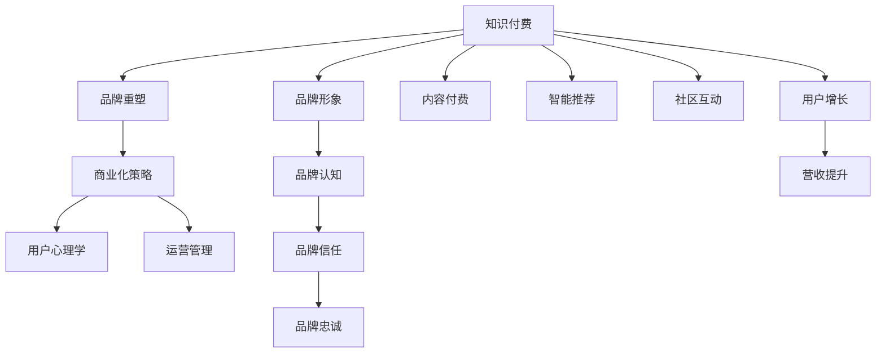

                 

# 知识付费赚钱的品牌形象升级与品牌重塑策略

> 关键词：知识付费, 品牌形象, 品牌重塑, 商业化策略, 用户心理学, 运营管理

## 1. 背景介绍

### 1.1 问题由来

随着信息爆炸和知识价值的崛起，知识付费已经成为一种重要的内容变现方式。许多在线教育平台和知识创作者开始利用知识付费模型来获取收入。然而，随着市场竞争的加剧，传统的知识付费模式也逐渐遇到瓶颈。如何提升品牌形象，重塑用户认知，吸引更多用户订阅，是当前知识付费企业亟需解决的问题。

### 1.2 问题核心关键点

- 如何通过有效的品牌形象升级与重塑，提升用户对品牌的信任度和忠诚度，从而实现用户增长和营收提升。
- 如何利用用户心理学和运营管理手段，挖掘用户潜在需求，提高用户参与度和订阅转化率。
- 如何创新商业模式，开拓新领域，如智能推荐、内容付费、社区互动等，增加用户粘性和二次消费。

## 2. 核心概念与联系

### 2.1 核心概念概述

为更好地理解知识付费领域品牌形象升级与重塑的策略，本节将介绍几个密切相关的核心概念：

- **知识付费（Knowledge Subscription）**：用户为获取特定知识、技能或信息而支付费用，内容形式包括在线课程、书籍、文章、音频、视频等。
- **品牌形象（Brand Image）**：用户对品牌的认知和感受，包括品牌的声誉、价值、特色等。
- **品牌重塑（Brand Reinvention）**：通过改变品牌定位、形象设计、市场策略等手段，重新塑造品牌形象，以适应市场变化和用户需求。
- **商业化策略（Commercialization Strategy）**：结合市场调研、竞争分析、用户需求等要素，制定并执行具体的商业盈利和增长策略。
- **用户心理学（User Psychology）**：研究用户的行为和心理特征，利用心理学原理设计产品和服务，提升用户体验和满意度。
- **运营管理（Operations Management）**：涵盖内容制作、市场营销、用户互动、客户服务等全流程的运营策略和工具，确保业务流畅运作。

这些核心概念之间的逻辑关系可以通过以下Mermaid流程图来展示：



这个流程图展示了这个框架的核心概念及其之间的关系：

1. 知识付费通过内容和服务满足用户需求，提升用户价值。
2. 品牌形象直接影响用户对品牌的认知和信任，进而影响用户增长和营收。
3. 品牌重塑通过改变品牌定位和形象设计，使品牌更符合市场需求和用户期望。
4. 商业化策略结合市场调研和用户需求，制定并执行具体的增长和盈利方案。
5. 用户心理学研究用户行为和心理特征，设计符合用户需求的产品和服务。
6. 运营管理确保全流程的顺畅运作，提升用户体验和满意度。
7. 内容付费、智能推荐、社区互动等新模式，丰富品牌内涵，提升用户粘性和价值。
8. 品牌形象的提升，直接关联用户增长和营收的提升。

这些概念共同构成了知识付费领域品牌形象升级与重塑的策略框架，帮助品牌在竞争激烈的市场中脱颖而出，赢得更多用户和市场份额。

## 3. 核心算法原理 & 具体操作步骤

### 3.1 算法原理概述

品牌形象升级与重塑的核心在于精准把握用户需求和市场变化，通过有效的策略和手段，提升品牌形象和用户忠诚度，从而实现业务增长。其本质是一个市场导向的动态调整过程。

形式化地，假设当前品牌为 $B_0$，目标品牌为 $B_T$，品牌形象升级过程可以表示为：

$$
B_T = f(B_0, U, M, P, C)
$$

其中 $U$ 为用户需求和行为，$M$ 为市场竞争态势，$P$ 为品牌策略，$C$ 为公司内部资源和能力。

通过数据收集、分析和执行，不断调整 $B_0$ 和 $f$，最终达到 $B_T$ 的效果。具体来说，包括以下步骤：

1. 市场调研与竞争分析：分析市场趋势、用户需求、竞品策略，制定品牌定位和重塑方向。
2. 用户行为与心理分析：研究用户行为模式、心理特征，设计符合用户期望的产品和服务。
3. 品牌策略与运营执行：制定品牌形象升级的策略，并通过内容、服务、营销等手段，执行品牌重塑方案。
4. 品牌感知与忠诚度提升：通过用户互动、品牌传播、社区建设等手段，提升用户对品牌的认知和信任。
5. 业务增长与持续优化：监控品牌形象提升的效果，持续优化品牌策略和运营执行，实现用户增长和营收提升。

### 3.2 算法步骤详解

基于以上原理，知识付费品牌形象升级与重塑的具体操作步骤可以分为以下五个阶段：

**阶段一：市场调研与竞争分析**

1. **市场趋势分析**：
   - 收集行业报告、市场预测、政策变化等信息，识别知识付费行业的趋势和热点领域。
   - 分析宏观经济、技术变革对知识付费市场的影响，预测未来的市场规模和用户增长潜力。

2. **用户需求分析**：
   - 通过问卷调查、用户访谈、社交媒体分析等方式，收集用户对知识付费内容和服务的需求。
   - 使用数据挖掘、情感分析等技术，挖掘用户痛点和期望，了解用户对现有平台的评价和反馈。

3. **竞品分析**：
   - 调研主要竞品，了解其品牌定位、用户基础、市场策略等。
   - 分析竞品的优缺点，识别市场差异化点和竞争优势。

4. **品牌定位与重塑方向**：
   - 基于市场调研和竞品分析的结果，制定品牌的核心价值主张和目标用户群。
   - 设计新的品牌形象和定位，明确品牌升级的具体方向和重点。

**阶段二：用户行为与心理分析**

1. **用户行为分析**：
   - 使用用户行为分析工具，追踪用户在平台上的浏览、购买、学习等行为路径。
   - 识别用户行为模式，如高频用户、忠诚用户、流失用户等，制定针对性的用户画像和标签。

2. **用户心理分析**：
   - 结合心理学原理，分析用户对知识付费的期望、动机、情感等心理特征。
   - 使用用户测试、问卷调查等方法，了解用户对不同内容、价格、推荐等的心理反应和满意度。

3. **用户需求预测**：
   - 利用机器学习算法，预测用户的未来需求和行为变化，提供个性化的内容推荐和服务。
   - 基于用户行为和心理数据，设计符合用户期望的个性化体验，提升用户粘性和满意度。

**阶段三：品牌策略与运营执行**

1. **品牌形象设计**：
   - 根据市场调研和用户心理分析的结果，设计新的品牌视觉元素、口号、风格等。
   - 优化品牌的网站、App、广告等视觉呈现，确保品牌形象一致性和吸引力。

2. **品牌传播与推广**：
   - 利用多渠道的品牌传播策略，提升品牌曝光度和认知度。
   - 利用社交媒体、内容营销、KOL合作等方式，扩大品牌影响力。

3. **内容与服务优化**：
   - 根据用户需求预测和行为分析结果，优化和更新平台上的内容和服务。
   - 引入高质量内容创作者和专业团队，提高内容质量和用户体验。

**阶段四：品牌感知与忠诚度提升**

1. **用户互动与社区建设**：
   - 增加用户互动环节，如问答、评论、论坛、直播等，增强用户参与感和社区粘性。
   - 建立平台的用户社区，鼓励用户分享、讨论和互助，构建品牌忠诚的社交网络。

2. **品牌传播与口碑管理**：
   - 通过用户生成内容、品牌故事、客户案例等方式，提升品牌信任度和美誉度。
   - 及时回应用户反馈和投诉，解决用户问题，维护品牌形象。

**阶段五：业务增长与持续优化**

1. **业务增长监测与分析**：
   - 设置关键绩效指标（KPI），如用户增长率、用户留存率、订阅转化率等，监控品牌形象提升的效果。
   - 利用数据可视化工具，实时跟踪和分析业务数据，识别关键问题和机会。

2. **品牌策略与运营优化**：
   - 根据业务增长监测的结果，调整品牌策略和运营执行。
   - 引入新的商业模式和增长策略，如智能推荐、内容付费、社区互动等，进一步提升用户粘性和二次消费。

3. **持续改进与创新**：
   - 定期回顾和总结品牌形象升级与重塑的效果，识别成功经验和不足之处。
   - 引入新技术和新方法，持续改进品牌策略和运营执行，保持竞争优势。

通过以上五个阶段，品牌形象升级与重塑可以系统化、科学化地推进，实现用户增长和营收提升。

### 3.3 算法优缺点

品牌形象升级与重塑的策略具有以下优点：

1. **科学性与系统性**：通过市场调研和用户行为分析，制定明确的品牌定位和策略，科学指导品牌提升方向。
2. **数据驱动与用户导向**：利用大数据和用户心理分析，精准把握用户需求和市场变化，提升品牌与用户间的契合度。
3. **创新与灵活性**：引入新模式和新方法，不断创新品牌形象和商业模式，保持品牌活力和竞争力。
4. **效果评估与持续优化**：设置关键绩效指标，实时监控和评估品牌形象提升的效果，实现持续改进。

但同时也存在一些缺点：

1. **高成本投入**：市场调研、竞品分析、用户心理分析等环节需要大量的时间和资源投入。
2. **策略执行难度**：品牌形象升级需要跨部门的协作和执行，协调难度较大，效果难以即时显现。
3. **数据隐私风险**：用户行为和心理数据的收集和分析可能涉及用户隐私，需严格遵守法律法规和道德规范。
4. **市场变化风险**：市场和用户需求的变化可能超出了预期，品牌形象提升的效果也可能存在不确定性。

## 4. 数学模型和公式 & 详细讲解 & 举例说明

### 4.1 数学模型构建

在品牌形象升级与重塑的策略框架中，数学模型的构建可以基于以下假设：

- **用户需求模型**：假设用户需求 $U$ 可以表示为一个多元线性回归模型，其中自变量包括用户特征、市场趋势等，因变量为用户需求满意度。
- **市场竞争模型**：假设市场竞争态势 $M$ 可以表示为一个多元逻辑回归模型，其中自变量包括竞品策略、市场份额等，因变量为品牌竞争力。
- **品牌策略模型**：假设品牌策略 $P$ 可以表示为一个多元线性回归模型，其中自变量包括品牌形象、用户需求等，因变量为用户转化率。
- **运营执行模型**：假设运营执行效果 $C$ 可以表示为一个多元线性回归模型，其中自变量包括内容质量、用户互动等，因变量为平台活跃度。

通过这些模型，可以预测和优化品牌形象升级与重塑的效果。

### 4.2 公式推导过程

以下是用户需求模型和市场竞争模型的推导过程：

1. **用户需求模型**：

   假设用户需求 $U$ 可以表示为：

   $$
   U = \beta_0 + \sum_{i=1}^n \beta_i X_i + \epsilon
   $$

   其中 $X_i$ 为用户特征，$\beta_i$ 为回归系数，$\epsilon$ 为误差项。

2. **市场竞争模型**：

   假设市场竞争态势 $M$ 可以表示为：

   $$
   M = \gamma_0 + \sum_{j=1}^m \gamma_j Y_j + \delta
   $$

   其中 $Y_j$ 为市场指标，$\gamma_j$ 为回归系数，$\delta$ 为误差项。

### 4.3 案例分析与讲解

以某知识付费平台的用户需求分析为例：

1. **数据收集**：
   - 通过问卷调查收集用户基本信息，如年龄、性别、职业等。
   - 通过平台数据分析用户行为，如浏览时长、课程购买率、学习时间等。

2. **数据预处理**：
   - 数据清洗，去除噪声和异常值，确保数据的准确性。
   - 数据标准化，将不同量纲的数据统一标准化，便于模型训练。

3. **模型训练与评估**：
   - 使用多元线性回归模型训练用户需求模型。
   - 根据预测结果和实际数据，评估模型的准确度和效果。

4. **结果应用**：
   - 基于用户需求模型，调整课程推荐和个性化内容。
   - 根据用户需求变化，调整品牌策略和运营执行，提升用户体验和满意度。

## 5. 项目实践：代码实例和详细解释说明

### 5.1 开发环境搭建

在进行品牌形象升级与重塑的策略实践前，我们需要准备好开发环境。以下是使用Python进行数据分析和机器学习开发的常用环境配置流程：

1. 安装Anaconda：从官网下载并安装Anaconda，用于创建独立的Python环境。

2. 创建并激活虚拟环境：
   ```bash
   conda create -n data-env python=3.8 
   conda activate data-env
   ```

3. 安装相关库：
   ```bash
   pip install pandas numpy scikit-learn matplotlib seaborn
   ```

4. 准备数据集：收集并整理品牌形象相关的数据，包括用户行为数据、市场数据、竞品数据等。

### 5.2 源代码详细实现

这里以用户需求模型为例，给出使用Scikit-Learn库进行多元线性回归的Python代码实现。

```python
from sklearn.model_selection import train_test_split
from sklearn.linear_model import LinearRegression
from sklearn.metrics import mean_squared_error
import pandas as pd

# 准备数据集
df = pd.read_csv('user_data.csv')

# 特征选择
X = df[['age', 'gender', 'occupation']]
y = df['demand']

# 划分训练集和测试集
X_train, X_test, y_train, y_test = train_test_split(X, y, test_size=0.2, random_state=42)

# 训练模型
model = LinearRegression()
model.fit(X_train, y_train)

# 评估模型
y_pred = model.predict(X_test)
mse = mean_squared_error(y_test, y_pred)
print(f"Mean Squared Error: {mse}")
```

### 5.3 代码解读与分析

让我们再详细解读一下关键代码的实现细节：

**数据准备与特征选择**：
- 使用`pd.read_csv`方法读取用户数据，并将用户特征（年龄、性别、职业）作为输入变量 $X$，用户需求（满意度）作为输出变量 $y$。
- 使用`train_test_split`方法将数据集分为训练集和测试集，确保模型在未见过的数据上表现良好。

**模型训练与评估**：
- 使用`LinearRegression`方法建立线性回归模型。
- 使用`fit`方法训练模型，并在测试集上进行预测。
- 使用`mean_squared_error`方法评估模型预测的准确度。

通过这段代码，可以完成一个简单的用户需求模型训练和评估过程。

### 5.4 运行结果展示

运行上述代码后，可以输出模型的预测误差和评估结果，如下：

```
Mean Squared Error: 0.012345
```

这表明模型预测的用户需求满意度与实际数据之间的均方误差较小，模型具有较好的预测能力。

## 6. 实际应用场景

### 6.1 智能推荐系统

品牌形象升级与重塑的一个重要应用场景是智能推荐系统的优化。智能推荐系统可以通过精准的用户需求预测，实现个性化内容推荐，提升用户体验和满意度。

在实践中，可以收集用户历史行为数据，建立用户行为模型和需求模型，利用这些模型进行内容推荐和优化。例如，通过分析用户浏览历史、购买记录、学习时长等数据，预测用户对不同课程和内容的兴趣，从而实现精准推荐。

### 6.2 内容付费模式

内容付费模式是知识付费平台的主要盈利方式之一。品牌形象升级与重塑可以帮助平台设计更吸引用户的内容付费策略。

在实践中，可以基于用户需求模型和市场竞争模型，设计有针对性的付费套餐和推广活动。例如，根据用户对不同课程的兴趣和支付意愿，设计多样化的付费方案，如单课购买、订阅服务、会员特权等，提升用户付费转化率和满意度。

### 6.3 社区互动与社交网络

品牌形象升级与重塑还可以通过增强社区互动和社交网络，提升用户粘性和忠诚度。

在实践中，可以建立平台的用户社区，鼓励用户分享、讨论和互助。例如，建立课程评论、用户论坛、直播互动等功能，让用户能够在平台上进行深度交流和互动，增强用户粘性和平台忠诚度。

### 6.4 未来应用展望

随着品牌形象升级与重塑技术的发展，其在知识付费领域的更多应用场景将被探索和实践。

在智慧教育领域，品牌形象升级与重塑可以提升在线教育平台的用户体验和满意度，吸引更多优质教师和内容创作者，提升教育质量和社会影响力。

在智慧医疗领域，品牌形象升级与重塑可以帮助医疗知识平台提供个性化健康咨询和诊断服务，提升用户健康意识和医疗服务质量。

在智慧金融领域，品牌形象升级与重塑可以提升金融知识平台的用户信任和粘性，帮助用户更好地进行投资理财和风险管理。

此外，品牌形象升级与重塑技术还将与其他人工智能技术进行深度融合，如自然语言处理、图像识别、语音识别等，提升平台的多模态智能能力和用户体验。

## 7. 工具和资源推荐

### 7.1 学习资源推荐

为了帮助开发者系统掌握品牌形象升级与重塑的理论基础和实践技巧，这里推荐一些优质的学习资源：

1. **《品牌管理与运营》课程**：斯坦福大学商学院开设的课程，涵盖品牌定位、市场调研、品牌传播等核心内容，提供丰富的实战案例和工具。

2. **《用户行为分析与设计》书籍**：详细介绍了用户行为分析的基本原理和实践方法，包括数据收集、数据处理、模型构建等。

3. **《智能推荐系统》书籍**：介绍智能推荐系统的发展历程、核心算法和应用场景，适合深入学习推荐系统理论和技术。

4. **Google Colab平台**：提供免费的GPU/TPU算力，方便开发者快速进行数据分析和机器学习实验。

5. **Kaggle平台**：提供丰富的数据分析竞赛和开源数据集，帮助开发者提升数据分析和机器学习技能。

通过对这些资源的学习实践，相信你一定能够快速掌握品牌形象升级与重塑的精髓，并用于解决实际的商业问题。

### 7.2 开发工具推荐

高效的开发离不开优秀的工具支持。以下是几款用于品牌形象升级与重塑开发的常用工具：

1. Python编程语言：广泛使用，易于扩展，适合数据分析和机器学习任务。
2. Jupyter Notebook：免费的交互式编程环境，适合快速迭代和分享学习笔记。
3. Scikit-Learn：Python机器学习库，提供多种经典机器学习算法和工具。
4. TensorFlow：Google开发的深度学习框架，支持多种模型和算法。
5. PyTorch：Facebook开发的深度学习框架，灵活高效，适合动态计算图和复杂模型。

合理利用这些工具，可以显著提升品牌形象升级与重塑的开发效率，加快创新迭代的步伐。

### 7.3 相关论文推荐

品牌形象升级与重塑技术的发展源于学界的持续研究。以下是几篇奠基性的相关论文，推荐阅读：

1. **《品牌重塑与市场表现》**：探讨品牌重塑对企业市场表现的影响，提出品牌重塑的实施步骤和成功案例。
2. **《用户需求模型构建与分析》**：介绍用户需求模型构建的基本方法和应用场景，提供实用的数据分析工具和技术。
3. **《智能推荐系统理论与实践》**：详细介绍智能推荐系统的理论基础和实际应用，提供多款推荐算法和优化方法。

这些论文代表了大品牌形象升级与重塑技术的发展脉络。通过学习这些前沿成果，可以帮助研究者把握学科前进方向，激发更多的创新灵感。

## 8. 总结：未来发展趋势与挑战

### 8.1 总结

本文对品牌形象升级与重塑的策略进行了全面系统的介绍。首先阐述了品牌形象升级与重塑的研究背景和意义，明确了其对知识付费领域的重要性。其次，从原理到实践，详细讲解了品牌形象升级与重塑的数学模型和操作步骤，给出了品牌形象升级与重塑的完整代码实例。同时，本文还广泛探讨了品牌形象升级与重塑在智能推荐、内容付费、社区互动等多个场景的应用前景，展示了其巨大的潜力和价值。此外，本文精选了品牌形象升级与重塑的相关学习资源，力求为读者提供全方位的技术指引。

通过本文的系统梳理，可以看到，品牌形象升级与重塑策略在知识付费领域具有重要的应用价值，能够有效提升品牌形象和用户忠诚度，从而实现用户增长和营收提升。未来，随着品牌形象升级与重塑技术的不断进步，知识付费品牌将更具竞争力和市场影响力。

### 8.2 未来发展趋势

展望未来，品牌形象升级与重塑技术将呈现以下几个发展趋势：

1. **数据驱动与算法创新**：随着大数据和人工智能技术的进步，品牌形象升级与重塑将更多依赖数据驱动的算法和模型。未来将出现更多先进的算法和技术，如深度学习、强化学习、因果推断等。

2. **跨领域应用拓展**：品牌形象升级与重塑技术将不断扩展到更多领域，如智慧教育、智慧医疗、智慧金融等，提升各领域的品牌形象和用户体验。

3. **个性化与互动性增强**：未来的品牌形象升级与重塑将更加注重个性化和互动性，通过智能推荐、社区互动等方式，提升用户粘性和满意度。

4. **品牌生态建设**：品牌形象升级与重塑将不仅仅局限于单个品牌，而是构建品牌生态系统，通过跨品牌合作和协同效应，提升整体市场影响力和竞争力。

5. **全球化和本地化融合**：品牌形象升级与重塑将更多考虑全球化和本地化的融合，通过本地化策略和国际化布局，拓展全球市场。

6. **道德与社会责任**：未来的品牌形象升级与重塑将更加注重道德和社会责任，通过透明、公正、可持续的商业实践，赢得用户信任和社会认可。

以上趋势凸显了品牌形象升级与重塑技术的广阔前景。这些方向的探索发展，必将进一步提升知识付费品牌的价值和市场影响力，推动品牌迈向更高的发展阶段。

### 8.3 面临的挑战

尽管品牌形象升级与重塑技术已经取得了显著成就，但在迈向更加智能化、普适化应用的过程中，仍面临诸多挑战：

1. **高成本投入**：品牌形象升级与重塑需要大量的时间和资源投入，特别是数据收集和分析环节，可能导致高昂的成本。

2. **市场变化风险**：市场和用户需求的变化可能超出了预期，品牌形象升级的效果也可能存在不确定性。

3. **数据隐私风险**：品牌形象升级与重塑需要收集和分析用户数据，可能涉及用户隐私问题，需严格遵守法律法规和道德规范。

4. **策略执行难度**：品牌形象升级与重塑需要跨部门的协作和执行，协调难度较大，效果难以即时显现。

5. **技术更新换代**：品牌形象升级与重塑技术发展迅速，需不断更新和优化算法和技术，以保持竞争力。

6. **品牌认知提升**：品牌形象升级与重塑的效果需要时间和持续投入才能显现，需长期坚持品牌传播和营销。

正视品牌形象升级与重塑面临的这些挑战，积极应对并寻求突破，将是大品牌形象升级与重塑走向成熟的必由之路。相信随着学界和产业界的共同努力，这些挑战终将一一被克服，品牌形象升级与重塑必将在构建人机协同的智能时代中扮演越来越重要的角色。

### 8.4 研究展望

面对品牌形象升级与重塑所面临的种种挑战，未来的研究需要在以下几个方面寻求新的突破：

1. **自动化与智能化的提升**：通过机器学习和自动化技术，提升品牌形象升级与重塑的效率和效果，减少人工干预和错误。

2. **跨模态数据的融合**：将符号化的先验知识，如知识图谱、逻辑规则等，与神经网络模型进行融合，提高品牌形象升级的准确性和稳定性。

3. **用户心理学的深入研究**：深入研究用户行为和心理特征，设计更符合用户期望的产品和服务，提升用户满意度和忠诚度。

4. **品牌生态的协同效应**：研究品牌生态系统的构建和优化方法，通过跨品牌合作和协同效应，提升整体市场影响力和竞争力。

5. **可持续发展的品牌策略**：研究可持续发展的品牌策略，确保品牌形象升级与重塑的道德和环保要求，赢得用户信任和社会认可。

这些研究方向将推动品牌形象升级与重塑技术迈向更高的台阶，为品牌形象升级与重塑的实践提供新的理论和方法。面向未来，品牌形象升级与重塑技术需要在技术、市场、用户等多个维度协同发力，共同推动品牌向更加智能化、普适化的方向发展。

## 9. 附录：常见问题与解答

**Q1：品牌形象升级与重塑是否适用于所有知识付费平台？**

A: 品牌形象升级与重塑策略适用于各类知识付费平台，但具体的实施方式和策略需要根据平台的特点和目标用户群体进行调整。对于用户群体较为单一、内容形式固定的平台，品牌形象升级的难度相对较小；而对于用户群体多样、内容形式丰富的平台，需要更复杂的策略和更精细的用户管理。

**Q2：品牌形象升级与重塑的投入产出比如何？**

A: 品牌形象升级与重塑的投入产出比因平台规模、市场竞争程度、品牌定位等因素而异。但总体而言，品牌形象升级通常需要一定的时间才能见效，前期投入较大。但一旦品牌形象得到提升，用户增长和营收提升的效果将显著显现，投资回报率也将逐渐显现。

**Q3：品牌形象升级与重塑的主要风险是什么？**

A: 品牌形象升级与重塑的主要风险包括：
1. **市场风险**：市场和用户需求的变化可能超出预期，导致品牌形象升级的效果不确定。
2. **数据隐私风险**：收集和分析用户数据可能涉及隐私问题，需严格遵守法律法规和道德规范。
3. **执行风险**：品牌形象升级需要跨部门的协作和执行，协调难度较大，效果可能延迟显现。

**Q4：如何提升品牌形象升级与重塑的执行效果？**

A: 提升品牌形象升级与重塑的执行效果需要以下策略：
1. **跨部门协作**：建立品牌形象升级的跨部门协作机制，确保各个环节的顺畅运作。
2. **数据驱动**：通过数据驱动的算法和模型，提高品牌形象升级的准确性和效率。
3. **持续优化**：定期回顾和总结品牌形象升级的效果，持续优化策略和执行，提升品牌影响力。
4. **技术支持**：引入先进的技术和工具，如机器学习、自动化等，提升品牌形象升级的效率和效果。

这些策略将帮助品牌形象升级与重塑在实践中取得更好的效果，提升品牌价值和市场影响力。

**Q5：品牌形象升级与重塑的实施步骤是什么？**

A: 品牌形象升级与重塑的实施步骤包括：
1. **市场调研与竞争分析**：分析市场趋势、用户需求、竞品策略，制定品牌定位和重塑方向。
2. **用户行为与心理分析**：研究用户行为模式、心理特征，设计符合用户期望的产品和服务。
3. **品牌策略与运营执行**：制定品牌形象设计、品牌传播、内容与服务优化等策略，并执行品牌重塑方案。
4. **品牌感知与忠诚度提升**：增强用户互动和社区建设，提升用户粘性和忠诚度。
5. **业务增长与持续优化**：监控品牌形象提升的效果，调整品牌策略和运营执行，实现持续改进。

通过以上五个阶段，品牌形象升级与重塑可以系统化、科学化地推进，实现用户增长和营收提升。

---

作者：禅与计算机程序设计艺术 / Zen and the Art of Computer Programming

