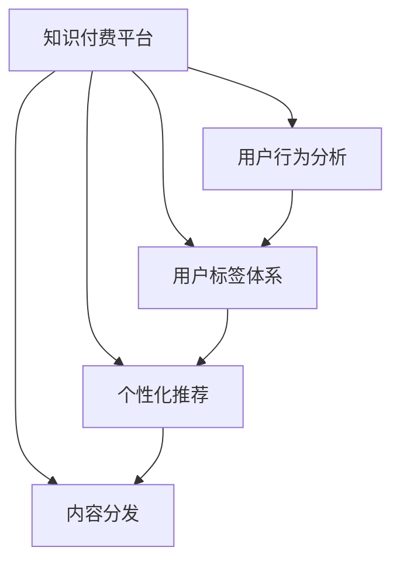

                 

# 知识付费赚钱的用户标签体系与个性化推荐策略

> 关键词：知识付费,用户标签,个性化推荐,内容分发,用户行为分析

## 1. 背景介绍

在知识经济时代，内容付费成为一种快速且高效的获取知识的方式，知识付费平台的崛起预示着内容变现的巨大潜力。然而，知识付费平台面临的挑战依然存在：用户留存率较低、内容转化率不高、个性化推荐不够精准等。通过构建用户标签体系，结合个性化推荐算法，知识付费平台可以更好地理解用户需求，提升用户体验和内容转化率，从而实现高效的知识付费变现。

## 2. 核心概念与联系

### 2.1 核心概念概述

为更好地理解知识付费平台的用户标签体系与个性化推荐策略，本节将介绍几个密切相关的核心概念：

- 知识付费：指用户为获取专业内容或服务而支付费用的在线平台，如得到、知乎live等。
- 用户标签：通过用户行为分析，对用户进行分类和打标签，以便更好地进行个性化推荐和精准营销。
- 个性化推荐：利用算法，根据用户的历史行为、兴趣偏好等信息，推荐其可能感兴趣的内容。
- 内容分发：将内容推荐给用户，包括视频、音频、文章、图书等。
- 用户行为分析：通过日志记录、用户反馈、点击率、购买行为等数据，分析用户的行为特征，以指导个性化推荐和内容优化。

这些核心概念之间的逻辑关系可以通过以下Mermaid流程图来展示：



这个流程图展示出知识付费平台的核心概念及其之间的联系：

1. 知识付费平台通过用户标签体系来理解用户需求，从而实现个性化推荐。
2. 个性化推荐策略根据用户标签推荐内容，进一步提升内容分发效率。
3. 用户行为分析提供数据支撑，帮助优化用户标签体系，提高个性化推荐的精准性。

## 3. 核心算法原理 & 具体操作步骤
### 3.1 算法原理概述

个性化推荐的核心是用户行为分析，通过构建用户标签体系，了解用户行为特征和兴趣偏好，从而实现高效的内容分发。其核心算法包括协同过滤、基于内容的推荐、深度学习推荐等。

协同过滤算法利用用户与物品之间的相似性，推荐用户可能感兴趣的内容。基于内容的推荐算法根据内容的特征与用户的兴趣匹配度，推荐相关内容。深度学习推荐则通过构建用户和内容的表示向量，利用神经网络模型预测用户对内容的评分，实现推荐。

### 3.2 算法步骤详解

基于协同过滤的个性化推荐算法步骤主要包括：

1. 数据预处理：收集用户行为数据，包括点击、收藏、购买、评分等，生成用户-物品评分矩阵。
2. 计算用户相似度：通过余弦相似度、皮尔逊相关系数等方法，计算用户之间的相似度。
3. 计算物品相似度：通过余弦相似度、皮尔逊相关系数等方法，计算物品之间的相似度。
4. 用户相似度加权：根据用户相似度加权，计算用户对物品的评分预测值。
5. 推荐物品：根据评分预测值，推荐给用户可能感兴趣的内容。

以下是基于协同过滤的推荐算法伪代码实现：

```python
def collaborative_filtering(user_item_matrix):
    user_count = user_item_matrix.shape[0]
    item_count = user_item_matrix.shape[1]
    user_item_similarity = np.zeros((user_count, user_count))
    item_item_similarity = np.zeros((item_count, item_count))
    user_item_predict = np.zeros((user_count, item_count))
    
    for i in range(user_count):
        for j in range(item_count):
            if user_item_matrix[i][j] != 0:
                user_item_similarity[i][j] = 1.0
                item_item_similarity[j][j] = 1.0
                
    for i in range(user_count):
        for j in range(item_count):
            user_item_predict[i][j] = np.dot(user_item_similarity[i], item_item_similarity[j])
    
    return user_item_predict
```

### 3.3 算法优缺点

基于协同过滤的个性化推荐算法具有以下优点：

1. 简单高效：协同过滤算法不需要大量特征，计算复杂度较低。
2. 鲁棒性强：推荐结果不受数据噪声影响，能够更好地处理冷启动问题。
3. 可扩展性高：能够处理大规模用户和物品数据，适用于用户基数较大的平台。

同时，该算法也存在一定的局限性：

1. 稀疏性问题：用户-物品评分矩阵通常较为稀疏，推荐效果可能受到数据稀疏性的影响。
2. 冷启动问题：对于新用户和未评分物品，难以进行有效推荐。
3. 隐式反馈问题：协同过滤算法无法处理用户没有评分的情况，可能存在数据丢失问题。

### 3.4 算法应用领域

基于协同过滤的个性化推荐算法在知识付费平台上具有广泛应用，如视频课程、图书、音频课程、文章等内容的推荐。通过构建用户标签体系，可以有效提升内容分发效率和用户满意度，从而提高知识付费平台的变现能力。

## 4. 数学模型和公式 & 详细讲解
### 4.1 数学模型构建

基于协同过滤的个性化推荐算法，可以建立用户-物品评分矩阵 $R$，其形式为：

$$
R_{ij}=
\begin{cases}
1 & \text{if user } i \text{ rated item } j \\
0 & \text{otherwise}
\end{cases}
$$

其中，$R_{ij}$ 表示用户 $i$ 对物品 $j$ 的评分。$R$ 矩阵的大小为 $m \times n$，$m$ 表示用户数，$n$ 表示物品数。

基于协同过滤的推荐算法可以通过计算用户相似度 $S_u$ 和物品相似度 $S_i$，计算用户对物品的评分预测值 $p_{ij}$，具体公式为：

$$
S_u = \alpha_u \cdot \text{similarity}(\text{user}_u, \text{user}_v) + (1-\alpha_u) \cdot \text{similarity}(\text{item}_i, \text{item}_j)
$$

$$
p_{ij} = \frac{\sum_{u} S_u \cdot R_{uj}}{\sum_{u} S_u}
$$

其中，$\alpha_u$ 为平衡因子，$similarity(\cdot, \cdot)$ 为相似度计算方法，如余弦相似度、皮尔逊相关系数等。

### 4.2 公式推导过程

假设用户 $i$ 对物品 $j$ 的实际评分 $r_{ij}$ 和预测评分 $p_{ij}$ 存在如下关系：

$$
p_{ij} = r_{ij} + \epsilon_{ij}
$$

其中，$\epsilon_{ij}$ 为误差项，满足期望 $E[\epsilon_{ij}] = 0$ 和方差 $Var[\epsilon_{ij}] = \sigma^2$。

对于新用户和未评分物品，可以使用基于内容的推荐算法。基于内容的推荐算法利用物品的特征向量 $V_j$ 和用户的兴趣向量 $U_i$ 进行推荐，具体公式为：

$$
p_{ij} = \text{dot}(V_j, U_i) + b_i
$$

其中，$\text{dot}(\cdot, \cdot)$ 表示向量内积，$b_i$ 为常数项。

### 4.3 案例分析与讲解

以下是一个简单的基于协同过滤的个性化推荐案例：

假设有两个用户 $u_1$ 和 $u_2$，他们分别对三个物品 $i_1$、$i_2$、$i_3$ 进行了评分，其评分矩阵 $R$ 为：

$$
R = \begin{bmatrix}
1 & 0 & 1 \\
0 & 1 & 1
\end{bmatrix}
$$

计算用户相似度 $S_{u1}$ 和 $S_{u2}$：

$$
S_{u1} = \alpha_u \cdot \text{similarity}(u_1, u_2) + (1-\alpha_u) \cdot \text{similarity}(i_1, i_2)
$$

$$
S_{u2} = \alpha_u \cdot \text{similarity}(u_1, u_2) + (1-\alpha_u) \cdot \text{similarity}(i_2, i_3)
$$

假设 $\alpha_u = 0.5$，使用余弦相似度计算用户相似度：

$$
S_{u1} = 0.5 \cdot 1 + 0.5 \cdot 0.5 = 0.75
$$

$$
S_{u2} = 0.5 \cdot 0.5 + 0.5 \cdot 0.5 = 0.5
$$

计算用户对物品的评分预测值 $p_{i2j}$：

$$
p_{i2j} = \frac{\sum_{u} S_u \cdot R_{uj}}{\sum_{u} S_u} = \frac{0.75 \cdot 1 + 0.5 \cdot 1}{0.75 + 0.5} = 0.66
$$

因此，系统推荐用户 $u_2$ 可能感兴趣的内容 $i_2$。

## 5. 项目实践：代码实例和详细解释说明
### 5.1 开发环境搭建

在进行个性化推荐系统开发前，我们需要准备好开发环境。以下是使用Python进行PyTorch开发的环境配置流程：

1. 安装Anaconda：从官网下载并安装Anaconda，用于创建独立的Python环境。

2. 创建并激活虚拟环境：
```bash
conda create -n pytorch-env python=3.8 
conda activate pytorch-env
```

3. 安装PyTorch：根据CUDA版本，从官网获取对应的安装命令。例如：
```bash
conda install pytorch torchvision torchaudio cudatoolkit=11.1 -c pytorch -c conda-forge
```

4. 安装相关库：
```bash
pip install numpy pandas sklearn scipy matplotlib scikit-learn joblib
```

完成上述步骤后，即可在`pytorch-env`环境中开始个性化推荐系统的开发。

### 5.2 源代码详细实现

以下是基于协同过滤的个性化推荐系统的代码实现。首先，构建用户-物品评分矩阵，然后计算用户相似度和物品相似度，最后计算评分预测值：

```python
import numpy as np
from sklearn.metrics.pairwise import cosine_similarity

def collaborative_filtering(user_item_matrix, alpha=0.5):
    user_count = user_item_matrix.shape[0]
    item_count = user_item_matrix.shape[1]
    user_item_similarity = np.zeros((user_count, user_count))
    item_item_similarity = np.zeros((item_count, item_count))
    user_item_predict = np.zeros((user_count, item_count))
    
    for i in range(user_count):
        for j in range(item_count):
            if user_item_matrix[i][j] != 0:
                user_item_similarity[i][j] = 1.0
                item_item_similarity[j][j] = 1.0
                
    for i in range(user_count):
        for j in range(item_count):
            user_item_predict[i][j] = np.dot(user_item_similarity[i], item_item_similarity[j])
    
    return user_item_predict

def calculate_user_similarity(user_item_matrix, alpha=0.5):
    user_count = user_item_matrix.shape[0]
    item_count = user_item_matrix.shape[1]
    user_similarity = np.zeros((user_count, user_count))
    
    for i in range(user_count):
        for j in range(user_count):
            user_similarity[i][j] = cosine_similarity(user_item_matrix[i], user_item_matrix[j])
    
    user_similarity = np.multiply(user_similarity, alpha) + np.multiply(1-alpha, cosine_similarity(user_item_matrix, user_item_matrix))
    
    return user_similarity

def calculate_item_similarity(user_item_matrix):
    item_count = user_item_matrix.shape[1]
    item_similarity = np.zeros((item_count, item_count))
    
    for i in range(item_count):
        for j in range(item_count):
            item_similarity[i][j] = cosine_similarity(user_item_matrix[:, i], user_item_matrix[:, j])
    
    return item_similarity
```

### 5.3 代码解读与分析

让我们再详细解读一下关键代码的实现细节：

**collaborative_filtering函数**：
- 输入用户-物品评分矩阵 `user_item_matrix`，输出评分预测矩阵 `user_item_predict`。
- 计算用户相似度 `user_item_similarity` 和物品相似度 `item_item_similarity`。
- 计算评分预测值 `user_item_predict`，具体公式为：

$$
p_{ij} = \frac{\sum_{u} S_u \cdot R_{uj}}{\sum_{u} S_u}
$$

**calculate_user_similarity函数**：
- 输入用户-物品评分矩阵 `user_item_matrix`，输出用户相似度矩阵 `user_similarity`。
- 使用余弦相似度计算用户相似度。

**calculate_item_similarity函数**：
- 输入用户-物品评分矩阵 `user_item_matrix`，输出物品相似度矩阵 `item_similarity`。
- 使用余弦相似度计算物品相似度。

这些函数将协同过滤算法中的计算过程进行了封装，可以方便地进行调用。

## 6. 实际应用场景
### 6.1 知识付费平台推荐系统

基于个性化推荐系统的知识付费平台推荐系统，可以为用户提供高质量的内容推荐，从而提升用户满意度和留存率。

在知识付费平台上，用户可以通过搜索、浏览、收藏、购买等行为进行内容交互。通过收集用户的行为数据，利用协同过滤算法，系统能够为用户提供精准的内容推荐，帮助用户发现感兴趣的内容。

例如，用户搜索某个主题课程时，系统可以根据用户之前浏览的课程内容，推荐相关的课程和文章，提高用户的学习效率。当用户对某个课程进行试听后，系统可以推荐类似课程，满足用户的持续学习需求。

### 6.2 电商平台个性化推荐

个性化推荐系统在电商平台中同样具有广泛应用，帮助用户发现感兴趣的商品，提升购买转化率。

在电商平台中，用户通过搜索、浏览、收藏、购买等行为进行商品交互。通过收集用户的行为数据，利用协同过滤算法，系统能够为用户提供精准的商品推荐，提高用户的购买决策效率。

例如，用户搜索某个品牌商品时，系统可以根据用户之前浏览的商品信息，推荐相关商品和搭配商品，提高用户的购买体验。当用户对某个商品进行收藏时，系统可以推荐类似商品，满足用户的购物需求。

### 6.3 新闻推荐系统

新闻推荐系统可以根据用户的历史阅读行为，推荐用户感兴趣的新闻内容，提高用户的新闻阅读体验。

在新闻推荐系统中，用户通过点击、点赞、评论等行为进行新闻内容交互。通过收集用户的行为数据，利用协同过滤算法，系统能够为用户提供精准的新闻推荐，提高用户的新闻阅读粘性。

例如，用户阅读某篇新闻后，系统可以推荐相关的深度报道、专题文章和热点新闻，提高用户的新闻阅读量。当用户对某篇新闻进行点赞时，系统可以推荐类似新闻，满足用户的新闻阅读偏好。

## 7. 工具和资源推荐
### 7.1 学习资源推荐

为了帮助开发者系统掌握个性化推荐算法，这里推荐一些优质的学习资源：

1. 《推荐系统实战》书籍：陈霄峰著，全面介绍了推荐系统的工作原理和实战方法。

2. 《Python推荐系统》课程：由北京邮电大学开设，详细讲解了协同过滤、基于内容的推荐等经典推荐算法。

3. 《Deep Learning for Recommendation Systems》论文：DeepMind团队发表的深度推荐系统论文，介绍了深度神经网络在推荐系统中的应用。

4. Kaggle推荐系统竞赛：Kaggle平台提供了多个推荐系统竞赛项目，可以实践和验证推荐算法效果。

5. 《推荐系统理论与算法》课程：由清华大学开设，讲解了推荐系统的理论基础和算法实现。

通过对这些资源的学习实践，相信你一定能够快速掌握个性化推荐算法的精髓，并用于解决实际的推荐问题。

### 7.2 开发工具推荐

高效的开发离不开优秀的工具支持。以下是几款用于个性化推荐系统开发的常用工具：

1. PyTorch：基于Python的开源深度学习框架，灵活动态的计算图，适合快速迭代研究。

2. TensorFlow：由Google主导开发的开源深度学习框架，生产部署方便，适合大规模工程应用。

3. Scikit-learn：Python机器学习库，包含多种推荐算法和评估指标，方便快速实现推荐系统。

4. Apache Mahout：Apache基金会开源的推荐系统库，提供多种推荐算法实现和优化方案。

5. LightFM：由Facebook开发的推荐系统框架，支持深度学习和协同过滤等多种推荐方法。

合理利用这些工具，可以显著提升个性化推荐系统的开发效率，加快创新迭代的步伐。

### 7.3 相关论文推荐

个性化推荐技术的发展源于学界的持续研究。以下是几篇奠基性的相关论文，推荐阅读：

1. Factorization Machines for Learning User-Item Scores in Recommendation Systems（ICDM 2010）：提出因子分解机（FM）算法，通过用户和物品的隐向量表示用户-物品评分。

2. A New Matrix Factorization Method for Recommendation System（ICML 2008）：提出矩阵分解算法，通过矩阵分解得到用户和物品的隐向量，用于推荐系统。

3. An Iterative Recommendation Algorithm for Large-scale Recommender Systems（SIGIR 2004）：提出基于协同过滤的推荐算法，通过用户相似度和物品相似度计算评分预测值。

4. PCDL: Pre-computed Dot-products for Learning to Rank in Recommendation Systems（ECIR 2016）：提出预计算点积（PCDL）方法，利用点积矩阵提升推荐效果。

5. Deep Collaborative Filtering via Nonlinear Matrix Factorization（SIGIR 2020）：提出深度协作过滤算法，利用神经网络模型进行推荐。

这些论文代表了个性化推荐技术的发展脉络。通过学习这些前沿成果，可以帮助研究者把握学科前进方向，激发更多的创新灵感。

## 8. 总结：未来发展趋势与挑战
### 8.1 总结

本文对基于协同过滤的个性化推荐算法进行了全面系统的介绍。首先阐述了知识付费平台和个性化推荐系统的背景，明确了推荐系统在提升用户体验和内容转化率方面的独特价值。其次，从原理到实践，详细讲解了协同过滤算法的数学模型和操作步骤，给出了推荐系统开发的完整代码实例。同时，本文还广泛探讨了推荐系统在知识付费、电商平台、新闻推荐等多个行业领域的应用前景，展示了个性化推荐范式的巨大潜力。此外，本文精选了推荐系统的各类学习资源，力求为读者提供全方位的技术指引。

通过本文的系统梳理，可以看到，基于协同过滤的个性化推荐算法正在成为推荐系统的重要范式，极大地拓展了推荐系统的应用边界，催生了更多的落地场景。得益于大规模用户数据的积累，推荐系统能够更好地理解用户需求，提升内容分发效率和用户体验。未来，伴随协同过滤算法和深度学习算法的持续演进，推荐系统必将在更多领域大放异彩，为知识付费、电商、新闻等领域的智能化发展提供新的技术支持。

### 8.2 未来发展趋势

展望未来，个性化推荐系统将呈现以下几个发展趋势：

1. 融合深度学习与协同过滤：深度学习算法能够更好地捕捉数据的复杂关系，结合协同过滤算法，推荐系统能够提供更加精准的推荐结果。

2. 多模态推荐：结合文本、图像、语音等多种模态数据，利用多模态深度学习算法进行推荐，提升推荐系统的智能化水平。

3. 实时推荐系统：利用实时数据流，通过流计算技术实现动态推荐，满足用户的即时需求。

4. 个性化推荐引擎：构建基于AI的个性化推荐引擎，实现更加高效、灵活的推荐。

5. 用户隐私保护：加强用户隐私保护，利用差分隐私、联邦学习等技术，保护用户隐私信息。

6. 推荐系统的可解释性：提升推荐系统的可解释性，帮助用户理解推荐结果的来源和依据。

以上趋势凸显了个性化推荐系统的广阔前景。这些方向的探索发展，必将进一步提升推荐系统的性能和应用范围，为知识付费、电商、新闻等领域的智能化发展提供新的技术支持。

### 8.3 面临的挑战

尽管个性化推荐系统已经取得了瞩目成就，但在迈向更加智能化、普适化应用的过程中，它仍面临着诸多挑战：

1. 数据稀疏性问题：推荐系统面临大量用户和物品的评分数据较为稀疏，推荐效果可能受到数据稀疏性的影响。

2. 冷启动问题：对于新用户和未评分物品，难以进行有效推荐。

3. 模型鲁棒性问题：推荐系统容易受到噪声数据的影响，导致推荐结果不稳定。

4. 计算效率问题：推荐系统需要处理大量数据，计算复杂度较高，系统性能可能受到限制。

5. 用户隐私问题：推荐系统需要处理大量的用户数据，如何保护用户隐私信息成为重要课题。

6. 推荐结果可解释性问题：推荐系统的黑盒模型难以解释推荐结果的来源和依据，影响用户信任和满意度。

7. 推荐系统可扩展性问题：随着用户和物品数量的增加，推荐系统的可扩展性受到挑战。

这些挑战需要研究者不断探索和创新，在数据、模型、算法、工程等方面进行全面优化，才能实现个性化推荐系统的高效、可解释、安全运行。

### 8.4 研究展望

未来，推荐系统需要在以下几个方面寻求新的突破：

1. 融合多种推荐算法：结合协同过滤、基于内容的推荐、深度学习等多种推荐算法，综合优化推荐结果。

2. 利用多模态数据：结合文本、图像、语音等多种模态数据，利用多模态深度学习算法进行推荐，提升推荐系统的智能化水平。

3. 引入先验知识：将知识图谱、逻辑规则等专家知识引入推荐系统，提升推荐结果的准确性和可信度。

4. 结合推荐系统与搜索系统：结合推荐系统与搜索系统，利用搜索结果进行推荐，提升推荐效果和用户体验。

5. 利用用户行为数据进行推荐：通过分析用户行为数据，利用机器学习算法进行推荐，提升推荐系统的个性化水平。

这些研究方向将推动推荐系统在更多领域大放异彩，为知识付费、电商、新闻等领域的智能化发展提供新的技术支持。只有不断探索和创新，才能实现推荐系统的智能化、个性化、高效运行，为用户提供更加精准、满意的服务。

## 9. 附录：常见问题与解答

**Q1：推荐系统的核心算法是什么？**

A: 推荐系统的核心算法主要包括协同过滤、基于内容的推荐和深度学习推荐。协同过滤算法利用用户与物品之间的相似性，推荐用户可能感兴趣的内容。基于内容的推荐算法根据内容的特征与用户的兴趣匹配度，推荐相关内容。深度学习推荐则通过构建用户和内容的表示向量，利用神经网络模型预测用户对内容的评分，实现推荐。

**Q2：推荐系统的评估指标有哪些？**

A: 推荐系统的评估指标主要包括准确率、召回率、F1-score、均方根误差（RMSE）等。准确率表示推荐结果中用户感兴趣的物品占比，召回率表示推荐结果中真实感兴趣的物品占比，F1-score综合考虑准确率和召回率。RMSE用于评估推荐结果的误差，越小表示推荐效果越好。

**Q3：推荐系统如何处理冷启动问题？**

A: 推荐系统通常采用基于内容的推荐算法处理冷启动问题。利用物品的特征向量 $V_j$ 和用户的兴趣向量 $U_i$ 进行推荐。当用户未进行过评分时，系统可以通过物品的特征向量和用户的历史行为向量进行推荐。此外，还可以利用用户行为数据进行推荐，如点击、浏览、购买等行为，帮助系统更好地理解用户需求。

**Q4：推荐系统如何处理数据稀疏性问题？**

A: 推荐系统通常采用矩阵分解、低秩逼近等方法处理数据稀疏性问题。矩阵分解算法将用户-物品评分矩阵分解为两个低维矩阵，利用矩阵乘法计算推荐结果。低秩逼近方法利用奇异值分解（SVD）等技术，将评分矩阵进行低秩逼近，降低计算复杂度。此外，还可以利用协同过滤算法处理数据稀疏性问题，利用用户之间的相似性进行推荐。

**Q5：推荐系统的推荐结果如何优化？**

A: 推荐系统的推荐结果优化可以通过以下几个步骤进行：

1. 数据预处理：收集用户行为数据，构建用户-物品评分矩阵。

2. 模型训练：利用协同过滤、基于内容的推荐、深度学习等多种算法进行模型训练，优化推荐结果。

3. 评估指标：利用准确率、召回率、F1-score、RMSE等指标评估推荐结果，优化模型性能。

4. 反馈机制：根据用户反馈调整推荐算法，优化推荐结果。

5. 实时调整：利用实时数据流，通过流计算技术实现动态推荐，满足用户的即时需求。

这些步骤可以相互配合，实现推荐系统的优化和升级，提升推荐效果和用户体验。

---

作者：禅与计算机程序设计艺术 / Zen and the Art of Computer Programming

