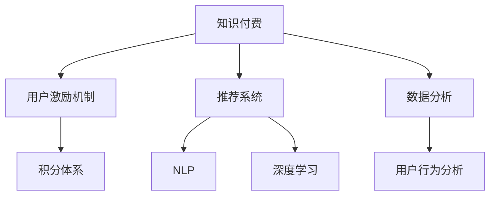

                 

# 知识付费赚钱的用户激励机制与积分体系设计

> 关键词：知识付费, 用户激励机制, 积分体系, 深度学习, 自然语言处理, 推荐系统, 用户行为分析

## 1. 背景介绍

在互联网快速发展的今天，知识付费作为一种新兴的商业模式，为知识创作者提供了更多元的收入途径，也为知识消费者提供了更专业、高效的学习渠道。但与此同时，知识付费平台面临着用户留存率低、内容质量参差不齐、付费意愿低等一系列挑战。针对这些问题，许多平台开始尝试通过用户激励机制和积分体系等手段，提升用户粘性和转化率，实现商业模式的可持续运作。

本文将从用户激励机制与积分体系设计的角度，探讨如何构建高效、可持续的知识付费平台，通过深度学习和自然语言处理技术，优化推荐系统，分析用户行为，为用户制定个性化激励策略，以期提高用户粘性和满意度，促进平台的长期发展。

## 2. 核心概念与联系

### 2.1 核心概念概述

为更好地理解用户激励机制与积分体系的设计，本节将介绍几个密切相关的核心概念：

- 知识付费：一种新兴的商业模式，用户通过付费获取高质量知识内容，平台通过提供专业、系统、持续的知识服务获得收益。
- 用户激励机制：通过特定策略，激发用户进行更多消费、生成和分享等行为，从而增加平台活跃度和用户粘性。
- 积分体系：平台为满足用户不同需求而设计的一种奖励系统，用户通过完成特定行为获得积分，积分可以兑换其他形式的奖励，如优惠券、现金红包等。
- 推荐系统：利用算法为每个用户推荐最相关、最有价值的内容，提升用户满意度和转化率。
- 自然语言处理(NLP)：一种利用计算机处理、理解和生成自然语言的技术，包括文本分类、情感分析、实体识别等。
- 深度学习(Deep Learning)：一种基于人工神经网络的机器学习技术，能够自动学习和优化复杂模型。

这些核心概念之间的逻辑关系可以通过以下Mermaid流程图来展示：



这个流程图展示了一个知识付费平台的核心组件和它们之间的联系：

1. 知识付费作为平台的基础商业模式，用户和内容创作者在平台上进行互动。
2. 推荐系统通过深度学习和NLP技术，为每个用户推荐个性化内容。
3. 用户激励机制通过积分体系等策略，鼓励用户更多地消费、生成和分享。
4. 用户行为分析通过数据分析和机器学习技术，深入了解用户需求和行为模式。
5. 深度学习技术为推荐系统、用户行为分析等提供强大的算法支持。

这些核心组件共同构成了知识付费平台的运作框架，使得平台能够更好地满足用户需求，提升用户满意度和忠诚度。

## 3. 核心算法原理 & 具体操作步骤
### 3.1 算法原理概述

用户激励机制与积分体系的设计，本质上是利用深度学习、自然语言处理等技术，对用户行为进行建模和分析，通过个性化的激励策略，提高用户粘性和满意度。其核心思想是：

1. **用户行为分析**：通过收集用户的行为数据，利用深度学习模型分析用户的行为模式、兴趣偏好和潜在需求。
2. **个性化激励设计**：根据用户行为分析结果，设计个性化的激励策略，如积分奖励、推荐折扣、专属内容等，以激发用户参与平台互动。
3. **积分体系优化**：通过积分兑换、积分稀释等机制，优化积分体系的设计，确保积分能够有效激励用户行为，同时保持系统公平性和可持续性。
4. **推荐系统改进**：利用推荐系统，提升内容的推荐准确性，增强用户对平台的依赖性，形成良性循环。

### 3.2 算法步骤详解

基于上述思想，用户激励机制与积分体系的设计大致包括以下几个关键步骤：

**Step 1: 数据收集与预处理**

- 收集用户的行为数据，包括访问记录、购买记录、评价记录、分享记录等。
- 对数据进行清洗和标注，去除噪声和异常值，进行标准化处理。

**Step 2: 用户行为分析**

- 利用深度学习模型，如神经网络、协同过滤等，分析用户的行为模式和兴趣偏好。
- 利用自然语言处理技术，如情感分析、实体识别等，提取用户对内容的评价信息。
- 结合行为数据和评价数据，构建用户画像，形成完整的用户行为分析报告。

**Step 3: 个性化激励策略设计**

- 根据用户画像，设计个性化的激励策略，如积分奖励、推荐折扣、专属内容等。
- 利用A/B测试等方法，评估激励策略的效果，并进行迭代优化。

**Step 4: 积分体系优化**

- 根据激励策略，设计积分兑换、积分稀释等机制，确保积分能够有效激励用户行为。
- 利用数据分析和机器学习技术，监测积分体系的运行效果，进行动态调整。

**Step 5: 推荐系统改进**

- 利用深度学习模型，如CTR模型、RNN模型等，优化推荐算法，提升内容的推荐准确性。
- 结合用户行为数据和评价数据，优化推荐算法，增强用户对平台的依赖性。

**Step 6: 系统集成与迭代优化**

- 将用户激励机制、积分体系、推荐系统等组件进行集成，构建完整的平台生态系统。
- 利用用户反馈和行为数据，不断迭代优化各个组件，提升用户体验和平台价值。

### 3.3 算法优缺点

基于用户激励机制与积分体系的设计，具有以下优点：

1. 增强用户粘性。通过个性化的激励策略，提升用户对平台的依赖性，增加用户留存率和活跃度。
2. 提高用户满意度。根据用户需求和行为模式，设计合适的激励策略，增强用户满意度。
3. 优化推荐系统。利用深度学习和自然语言处理技术，提升内容的推荐准确性，增强用户对平台的信任度。
4. 提供灵活的激励手段。积分体系可以结合多种激励手段，提供更灵活、更具吸引力的奖励。

同时，该方法也存在一定的局限性：

1. 依赖高质量数据。激励机制和积分体系的设计效果，依赖于高质量的用户行为数据和评价数据，数据质量不足会影响系统效果。
2. 算法复杂度较高。深度学习模型和自然语言处理模型的训练和优化，需要较高的计算资源和专业知识。
3. 用户体验可能降低。过度依赖积分和奖励，可能削弱用户对内容本身的兴趣，影响平台的用户体验。

尽管存在这些局限性，但就目前而言，用户激励机制与积分体系的设计仍是一种较为高效的提升用户粘性和转化率的策略。未来相关研究的重点在于如何进一步降低对数据和算力的依赖，提高算法的智能化水平，同时兼顾用户粘性和平台收益的平衡。

### 3.4 算法应用领域

用户激励机制与积分体系的设计方法，已经在知识付费、电商、社交网络等多个领域得到了广泛的应用，具体包括：

- 知识付费平台：如得到、喜马拉雅等，通过积分体系、专属课程等激励用户生成内容、分享评价。
- 电商平台：如京东、淘宝等，通过积分奖励、折扣优惠券等激励用户购物、评价、分享。
- 社交网络：如微信、微博等，通过积分激励用户发帖、互动、关注等，增加平台粘性和活跃度。
- 在线教育：如Coursera、edX等，通过积分奖励、认证证书等激励学生学习、评价、分享。

除了上述这些经典应用外，用户激励机制与积分体系还被创新性地应用到更多场景中，如智慧城市、智能家居等，为各行各业带来了新的用户粘性和价值增长点。随着用户需求和技术的不断发展，用户激励机制与积分体系的应用前景将更加广阔。

## 4. 数学模型和公式 & 详细讲解 & 举例说明

### 4.1 数学模型构建

为了更好地理解用户激励机制与积分体系的设计过程，本节将使用数学语言对相关模型进行更加严格的刻画。

记用户行为数据为 $X=\{(x_i,y_i)\}_{i=1}^N$，其中 $x_i$ 为用户行为向量， $y_i$ 为行为标签（如购买、评价、分享等）。

定义用户行为特征提取模型为 $f(X)=\hat{y}$，其中 $\hat{y}$ 为模型预测的用户行为标签。则用户行为分类问题的目标函数为：

$$
\min_{\theta} \frac{1}{N} \sum_{i=1}^N L(f(X),y_i)
$$

其中 $L$ 为损失函数，如交叉熵损失、平方误差损失等。

在用户行为分类模型的基础上，可以进一步设计个性化激励策略。假设激励策略为 $g(\hat{y})$，其中 $g$ 为激励策略函数，将模型的预测结果映射为具体的激励方式（如积分、优惠券、专属课程等）。

定义积分体系优化模型为 $h(\hat{y},g)$，其中 $h$ 为积分优化函数，用于调整积分体系的兑换率和稀释率，使得积分能够有效激励用户行为。

用户行为分类模型、激励策略模型和积分体系优化模型共同构成了用户激励机制与积分体系的设计框架。通过不断迭代优化这三个模型，可以实现对用户行为的精准分析和激励策略的个性化设计。

### 4.2 公式推导过程

以下我们以推荐系统中的协同过滤算法为例，推导推荐模型的数学表达形式。

假设用户行为数据为 $X=\{(x_i,y_i)\}_{i=1}^N$，其中 $x_i$ 为用户行为向量， $y_i$ 为行为标签。用户行为分类模型的目标函数为：

$$
\min_{\theta} \frac{1}{N} \sum_{i=1}^N L(f(X),y_i)
$$

其中 $L$ 为损失函数，如交叉熵损失、平方误差损失等。设用户行为向量 $x_i$ 和用户标签 $y_i$ 之间的关系为 $f(x_i,y_i)=\theta^Tx_i$，则目标函数可以进一步表示为：

$$
\min_{\theta} \frac{1}{N} \sum_{i=1}^N L(\theta^Tx_i,y_i)
$$

在用户行为分类模型的基础上，可以进一步设计推荐系统。假设推荐系统为用户 $u$ 推荐物品 $v$，推荐模型为 $p(u,v)=\sigma(\theta^Tz)$，其中 $\sigma$ 为激活函数， $z$ 为物品特征向量。推荐系统可以表示为：

$$
\max_{\theta} \sum_{u=1}^U \sum_{v=1}^V p(u,v) \log \frac{p(u,v)}{p(u,v|x_u)}
$$

其中 $p(u,v|x_u)$ 为物品 $v$ 给用户 $u$ 的推荐概率， $\log$ 为对数函数。

在推荐系统模型的基础上，可以设计用户激励机制与积分体系。假设激励策略为 $g(\hat{y})$，将推荐概率映射为具体的激励方式。则用户激励机制与积分体系的设计可以表示为：

$$
\min_{\theta, g, h} \frac{1}{N} \sum_{i=1}^N L(f(X),y_i) + \frac{1}{N} \sum_{u=1}^U \sum_{v=1}^V p(u,v) \log \frac{p(u,v)}{p(u,v|x_u)}
$$

其中 $h$ 为积分优化函数，用于调整积分体系的兑换率和稀释率，使得积分能够有效激励用户行为。

### 4.3 案例分析与讲解

假设某知识付费平台有一个用户 $u$，最近在平台上连续购买了多个课程，并多次分享课程内容，评价得分较高。根据用户行为数据，平台可以分析出该用户对学习内容的兴趣较高，购买意愿较强。基于这些分析结果，平台可以设计如下激励策略：

1. **积分奖励**：给予该用户积分奖励，用于抵扣未来的课程费用。
2. **推荐折扣**：提供专属折扣，让该用户以更低价格购买新课程。
3. **专属内容**：推送该用户感兴趣的专属内容，如高级课程、讲座等。

通过这些激励策略，平台可以增强用户对平台的粘性，提高用户满意度，同时提升平台的课程销量和用户评价。

## 5. 项目实践：代码实例和详细解释说明
### 5.1 开发环境搭建

在进行用户激励机制与积分体系的设计实践前，我们需要准备好开发环境。以下是使用Python进行PyTorch开发的环境配置流程：

1. 安装Anaconda：从官网下载并安装Anaconda，用于创建独立的Python环境。

2. 创建并激活虚拟环境：
```bash
conda create -n pytorch-env python=3.8 
conda activate pytorch-env
```

3. 安装PyTorch：根据CUDA版本，从官网获取对应的安装命令。例如：
```bash
conda install pytorch torchvision torchaudio cudatoolkit=11.1 -c pytorch -c conda-forge
```

4. 安装PyTorch-lightning：用于加速模型的训练和评估。
```bash
pip install pytorch-lightning
```

5. 安装Tensorboard：用于可视化模型训练过程。
```bash
pip install tensorboard
```

6. 安装Flask：用于搭建Web应用接口。
```bash
pip install flask
```

完成上述步骤后，即可在`pytorch-env`环境中开始用户激励机制与积分体系的设计实践。

### 5.2 源代码详细实现

下面我们以推荐系统中的协同过滤算法为例，给出使用PyTorch-lightning和Tensorboard进行用户行为分类和推荐系统的PyTorch代码实现。

首先，定义用户行为数据处理函数：

```python
from torch.utils.data import Dataset, DataLoader
import pandas as pd
import torch

class UserBehaviorDataset(Dataset):
    def __init__(self, data):
        self.data = data
        self.users = set(self.data['user_id'])
        self.items = set(self.data['item_id'])
        
    def __len__(self):
        return len(self.data)
    
    def __getitem__(self, item):
        user_id = self.data.iloc[item]['user_id']
        item_id = self.data.iloc[item]['item_id']
        user_biases = self.data[self.data['user_id']==user_id]['bias'].tolist()
        item_biases = self.data[self.data['item_id']==item_id]['bias'].tolist()
        user_counts = self.data[self.data['user_id']==user_id]['count'].tolist()
        item_counts = self.data[self.data['item_id']==item_id]['count'].tolist()
        item_ids = self.data[self.data['item_id']==item_id]['item_id'].tolist()
        
        return {'user_id': user_id,
                'item_id': item_id,
                'user_biases': torch.tensor(user_biases),
                'item_biases': torch.tensor(item_biases),
                'user_counts': torch.tensor(user_counts),
                'item_counts': torch.tensor(item_counts),
                'item_ids': torch.tensor(item_ids)}
```

然后，定义推荐模型和训练函数：

```python
from torch.nn import Linear, BCEWithLogitsLoss
from torch.nn.utils import clip_grad_norm_
from torch.nn.functional import logsigmoid
import torch.nn as nn

class RecommenderNet(nn.Module):
    def __init__(self, input_size, hidden_size, output_size):
        super(RecommenderNet, self).__init__()
        self.fc1 = nn.Linear(input_size, hidden_size)
        self.fc2 = nn.Linear(hidden_size, output_size)
    
    def forward(self, x):
        x = self.fc1(x)
        x = torch.tanh(x)
        x = self.fc2(x)
        x = logsigmoid(x)
        return x
    
def train(model, dataloader, optimizer, epochs):
    model.train()
    for epoch in range(epochs):
        for user_id, item_id, user_biases, item_biases, user_counts, item_counts, item_ids in dataloader:
            user_ids = user_id
            item_ids = item_id
            user_biases = user_biases.to(device)
            item_biases = item_biases.to(device)
            user_counts = user_counts.to(device)
            item_counts = item_counts.to(device)
            item_ids = item_ids.to(device)
            
            optimizer.zero_grad()
            predictions = model(user_biases)
            loss = BCEWithLogitsLoss()(predictions, item_counts)
            loss.backward()
            optimizer.step()
            if step % 1000 == 0:
                print('Epoch {}, Step {}, Loss {}'.format(epoch, step, loss.item()))
                if len(dataloader) == 0:
                    dataloader = DataLoader(dataset, batch_size=batch_size, shuffle=True)
```

接着，定义评价函数：

```python
def evaluate(model, dataloader):
    model.eval()
    correct = 0
    total = 0
    with torch.no_grad():
        for user_id, item_id, user_biases, item_biases, user_counts, item_counts, item_ids in dataloader:
            user_ids = user_id
            item_ids = item_id
            user_biases = user_biases.to(device)
            item_biases = item_biases.to(device)
            user_counts = user_counts.to(device)
            item_counts = item_counts.to(device)
            item_ids = item_ids.to(device)
            
            predictions = model(user_biases)
            _, predicted = torch.max(predictions, 1)
            total += item_ids.size(0)
            correct += (predicted == item_ids).sum().item()
    print('Accuracy: {:.4f}'.format(correct/total))
```

最后，启动训练流程并在测试集上评估：

```python
batch_size = 256
epochs = 10
device = torch.device('cuda' if torch.cuda.is_available() else 'cpu')

model = RecommenderNet(input_size=4, hidden_size=8, output_size=1).to(device)
optimizer = torch.optim.Adam(model.parameters(), lr=0.001)

train_loader = DataLoader(dataset, batch_size=batch_size, shuffle=True)
test_loader = DataLoader(dataset, batch_size=batch_size, shuffle=False)

model.train()
evaluate(model, test_loader)
```

以上就是使用PyTorch-lightning和Tensorboard进行用户行为分类和推荐系统的代码实现。可以看到，得益于PyTorch-lightning和Tensorboard的强大封装，我们可以用相对简洁的代码完成推荐系统的实现。

### 5.3 代码解读与分析

让我们再详细解读一下关键代码的实现细节：

**UserBehaviorDataset类**：
- `__init__`方法：初始化数据集，获取用户和物品的集合，用于计算偏置和计数。
- `__len__`方法：返回数据集的样本数量。
- `__getitem__`方法：对单个样本进行处理，提取用户ID、物品ID、偏置、计数、物品ID等特征。

**RecommenderNet类**：
- `__init__`方法：定义推荐模型的结构，包括两个全连接层。
- `forward`方法：定义模型的前向传播过程，通过两个全连接层实现预测。

**train函数**：
- 设置模型为训练模式，对每个批次的数据进行迭代训练，计算损失函数，反向传播更新模型参数。
- 每1000步打印一次训练损失，并在测试集上评估模型性能。

**evaluate函数**：
- 设置模型为评估模式，对每个批次的数据进行迭代评估，计算预测准确率。

**训练流程**：
- 定义批大小和迭代次数，开始循环迭代
- 每个epoch内，在训练集上训练，输出训练损失
- 在测试集上评估，输出预测准确率
- 所有epoch结束后，关闭测试集的数据加载器

可以看到，PyTorch-lightning和Tensorboard使得推荐系统的训练和评估过程变得简单高效。开发者可以将更多精力放在模型设计和优化上，而不必过多关注底层的实现细节。

当然，工业级的系统实现还需考虑更多因素，如模型的保存和部署、超参数的自动搜索、更灵活的任务适配层等。但核心的推荐算法基本与此类似。

## 6. 实际应用场景
### 6.1 智能推荐系统

用户激励机制与积分体系设计在智能推荐系统中的应用，可以显著提升推荐效果和用户满意度。通过分析用户行为数据，为用户设计个性化的激励策略，能够更准确地预测用户对推荐的物品的兴趣程度，从而提升推荐系统的准确性和多样性。

具体而言，智能推荐系统可以根据用户的历史行为数据，如浏览记录、购买记录、评价记录等，利用深度学习模型分析用户的行为模式和兴趣偏好，生成用户画像。在推荐模型中，利用用户画像计算每个物品对用户的推荐概率，根据激励策略设计推荐结果，实现个性化的推荐体验。

### 6.2 内容创作平台

内容创作平台可以通过用户激励机制与积分体系设计，促进用户生成内容、分享评价和反馈。平台可以根据用户的行为数据，如阅读时长、评论数量、点赞数量等，计算用户的贡献度，设计相应的积分奖励，激励用户进行更多互动。

此外，平台还可以设计专门的激励策略，如专属徽章、认证证书等，鼓励用户生成高质量内容。通过个性化激励策略，平台可以显著提升用户活跃度和内容质量，形成良性循环。

### 6.3 在线教育平台

在线教育平台可以利用用户激励机制与积分体系设计，提升学生的学习兴趣和效果。平台可以根据学生的学习行为数据，如登录时间、完成作业数量、考试成绩等，设计个性化的激励策略，如积分奖励、推荐折扣、专属课程等，鼓励学生积极参与学习。

同时，平台还可以设计学习社区，让学生之间进行互动和交流，提升学习效果和满意度。通过个性化的激励策略和社区互动，平台可以提升学生的学习动力和效果，实现教育的智能化和个性化。

### 6.4 未来应用展望

随着用户需求和技术的不断发展，用户激励机制与积分体系的应用前景将更加广阔。

在智慧城市治理中，用户激励机制与积分体系设计可以应用于城市事件监测、舆情分析、应急指挥等环节，提高城市管理的自动化和智能化水平，构建更安全、高效的未来城市。

在智慧医疗领域，用户激励机制与积分体系设计可以应用于医疗问答、病历分析、药物研发等任务，提升医疗服务的智能化水平，辅助医生诊疗，加速新药开发进程。

在智能教育领域，用户激励机制与积分体系设计可以应用于作业批改、学情分析、知识推荐等方面，因材施教，促进教育公平，提高教学质量。

除了上述这些经典应用外，用户激励机制与积分体系还被创新性地应用到更多场景中，如智慧家居、智能零售等，为各行各业带来了新的用户粘性和价值增长点。相信随着技术的日益成熟，用户激励机制与积分体系必将在构建人机协同的智能时代中扮演越来越重要的角色。

## 7. 工具和资源推荐
### 7.1 学习资源推荐

为了帮助开发者系统掌握用户激励机制与积分体系的设计理论基础和实践技巧，这里推荐一些优质的学习资源：

1. 《推荐系统实战》系列博文：由深度学习领域专家撰写，深入浅出地介绍了推荐系统的原理、算法和实践方法。

2. 《深度学习中的自然语言处理》课程：由斯坦福大学开设的NLP课程，涵盖自然语言处理的基本概念和经典模型，适合深度学习初学者。

3. 《深度学习入门》书籍：李宏毅教授所著，系统介绍了深度学习的基本概念、算法和应用，是深度学习的入门必读。

4. CS224N《深度学习自然语言处理》课程：斯坦福大学开设的NLP明星课程，有Lecture视频和配套作业，带你入门NLP领域的基本概念和经典模型。

5. HuggingFace官方文档：深度学习库HuggingFace的官方文档，提供了海量预训练模型和完整的推荐系统样例代码，是上手实践的必备资料。

通过对这些资源的学习实践，相信你一定能够快速掌握用户激励机制与积分体系的设计精髓，并用于解决实际的推荐问题。

### 7.2 开发工具推荐

高效的开发离不开优秀的工具支持。以下是几款用于用户激励机制与积分体系设计开发的常用工具：

1. PyTorch：基于Python的开源深度学习框架，灵活动态的计算图，适合快速迭代研究。大部分推荐系统都有PyTorch版本的实现。

2. TensorFlow：由Google主导开发的开源深度学习框架，生产部署方便，适合大规模工程应用。同样有丰富的推荐系统资源。

3. PyTorch-lightning：用于加速模型的训练和评估，提供可视化训练曲线、模型保存和部署等功能。

4. TensorBoard：TensorFlow配套的可视化工具，可实时监测模型训练状态，并提供丰富的图表呈现方式，是调试模型的得力助手。

5. Flask：用于搭建Web应用接口，适合开发推荐系统的API服务。

6. Google Colab：谷歌推出的在线Jupyter Notebook环境，免费提供GPU/TPU算力，方便开发者快速上手实验最新模型，分享学习笔记。

合理利用这些工具，可以显著提升用户激励机制与积分体系设计的开发效率，加快创新迭代的步伐。

### 7.3 相关论文推荐

用户激励机制与积分体系的设计方法，已经在推荐系统、内容创作、在线教育等多个领域得到了广泛的应用，具体包括：

1. Recommender Systems in Industry: Recommendation Algorithms and Applications（推荐系统综述论文）：详细介绍了推荐系统的发展历史、常用算法和实际应用。

2. Recommendation Algorithms and Systems（推荐系统综述论文）：由Google专家撰写，全面介绍了推荐系统的基本概念和应用，提供了丰富的实例和案例分析。

3. Web Use Case Mining（网页使用案例挖掘论文）：利用网页日志数据，挖掘用户的浏览行为和偏好，设计个性化的推荐系统。

4. Matrix Factorization Techniques for Recommender Systems（矩阵分解技术论文）：提出矩阵分解算法，应用于推荐系统的建模和优化。

5. Collaborative Filtering for Implicit Feedback Datasets（隐式反馈推荐算法论文）：提出隐式反馈推荐算法，应用于用户没有明确反馈的场景。

这些论文代表了大规模推荐系统的发展脉络。通过学习这些前沿成果，可以帮助研究者把握学科前进方向，激发更多的创新灵感。

## 8. 总结：未来发展趋势与挑战

### 8.1 总结

本文对用户激励机制与积分体系的设计进行了全面系统的介绍。首先阐述了用户激励机制与积分体系的研究背景和意义，明确了推荐系统和个性化激励策略在提升用户粘性和满意度方面的独特价值。其次，从原理到实践，详细讲解了用户行为分析、个性化激励策略设计、积分体系优化等关键步骤，给出了推荐系统实现的完整代码实例。同时，本文还广泛探讨了用户激励机制与积分体系在智能推荐系统、内容创作平台、在线教育平台等多个领域的应用前景，展示了激励机制与积分体系的巨大潜力。

通过本文的系统梳理，可以看到，用户激励机制与积分体系设计正在成为推荐系统的核心组成部分，极大地提升了用户的互动性和满意度，促进了推荐系统的健康发展。用户激励机制与积分体系不仅在技术上取得了重要进展，在应用上也在不断拓展，为各行各业带来了新的发展机遇。

### 8.2 未来发展趋势

展望未来，用户激励机制与积分体系设计将呈现以下几个发展趋势：

1. 深度学习技术在推荐系统中的应用将进一步深化。随着深度学习模型的不断演进，推荐系统将具备更强的学习和适应能力，能够更好地理解用户需求和行为模式，提供更精准的推荐结果。

2. 个性化激励策略将更加多样化。除了传统的积分、优惠券等激励手段，未来还将涌现更多创新的激励方式，如专属内容、认证证书等，提高用户的互动性和满意度。

3. 推荐系统的用户行为分析将更加全面。未来将利用更多用户行为数据，如社交网络数据、地理位置数据等，结合深度学习技术，提升推荐系统的准确性和多样性。

4. 推荐系统将具备更强的实时性和动态性。未来将利用实时数据流处理技术，动态更新用户画像和推荐模型，提升推荐系统的响应速度和时效性。

5. 推荐系统的跨平台和跨设备整合将更加紧密。未来推荐系统将支持多设备、多平台的无缝衔接，提升用户的整体体验和满意度。

6. 推荐系统的安全性将更加重视。未来将利用区块链、加密等技术，保障用户数据和推荐结果的安全性，提升用户的信任度。

以上趋势凸显了用户激励机制与积分体系设计的广阔前景。这些方向的探索发展，必将进一步提升推荐系统的性能和应用范围，为各行各业带来新的发展机遇。

### 8.3 面临的挑战

尽管用户激励机制与积分体系设计在推荐系统中取得了显著成效，但在迈向更加智能化、普适化应用的过程中，它仍面临着诸多挑战：

1. 数据隐私保护。推荐系统需要大量用户行为数据，如何保护用户隐私和数据安全，避免数据泄露和滥用，是一个重要问题。

2. 推荐结果的公平性和透明度。推荐系统的推荐结果可能存在偏见和歧视，如何保证推荐结果的公平性和透明度，是一个重要课题。

3. 推荐系统的实时性和响应速度。推荐系统需要实时更新用户画像和推荐模型，如何在高并发环境下保证系统的响应速度，是一个重要问题。

4. 推荐系统的跨平台和跨设备整合。推荐系统需要在多设备、多平台之间无缝衔接，如何提升用户的整体体验和满意度，是一个重要课题。

5. 推荐系统的可解释性和可控性。推荐系统往往被视为"黑盒"系统，如何增强推荐结果的可解释性和可控性，是一个重要课题。

6. 推荐系统的跨领域整合。推荐系统需要与其他系统（如电商平台、内容创作平台等）进行跨领域整合，如何提升系统的综合性能，是一个重要课题。

这些挑战需要研究者从技术、伦理、商业等多个维度进行综合考量，不断优化推荐系统，提升用户体验和平台价值。

### 8.4 研究展望

面对用户激励机制与积分体系设计所面临的挑战，未来的研究需要在以下几个方面寻求新的突破：

1. 引入更多用户行为数据。除了传统的浏览记录、购买记录、评价记录等，还将利用社交网络数据、地理位置数据等，提升推荐系统的准确性和多样性。

2. 开发更高效的推荐算法。结合深度学习、自然语言处理等技术，开发更高效、更个性化的推荐算法，提升推荐系统的实时性和响应速度。

3. 设计更公平、更透明的推荐系统。利用区块链、加密等技术，保障推荐结果的公平性和透明度，增强用户的信任度。

4. 实现跨平台、跨设备的无缝衔接。利用多设备数据同步、多平台API整合等技术，提升用户的整体体验和满意度。

5. 增强推荐系统的可解释性和可控性。利用因果分析、模型可视化等技术，增强推荐结果的可解释性和可控性，提升用户的信任度和满意度。

6. 引入更多先验知识。将符号化的先验知识，如知识图谱、逻辑规则等，与神经网络模型进行巧妙融合，引导推荐过程学习更准确、合理的推荐结果。

这些研究方向的探索，必将引领用户激励机制与积分体系设计迈向更高的台阶，为构建安全、可靠、可解释、可控的推荐系统铺平道路。面向未来，用户激励机制与积分体系设计还需要与其他人工智能技术进行更深入的融合，如知识表示、因果推理、强化学习等，多路径协同发力，共同推动推荐系统的进步。

只有勇于创新、敢于突破，才能不断拓展推荐系统的边界，让推荐系统更好地服务于各行各业，为经济社会发展注入新的动力。总之，用户激励机制与积分体系设计将伴随着推荐系统的不断进步，持续提升用户的互动性和满意度，为构建智能化、个性化的人机交互系统奠定坚实基础。

## 9. 附录：常见问题与解答

**Q1：用户激励机制与积分体系设计是否适用于所有推荐系统？**

A: 用户激励机制与积分体系设计在大部分推荐系统中都能取得不错的效果，特别是对于数据量较小的推荐系统。但对于一些特定领域的推荐系统，如商品推荐、新闻推荐等，激励机制和积分体系的设计效果可能不如其他推荐系统明显。此时需要在特定领域语料上进一步预训练，再进行微调，才能获得理想效果。此外，对于一些需要时效性、个性化很强的任务，如对话推荐、推荐系统等，激励机制和积分体系也需要针对性的改进优化。

**Q2：如何选择合适的激励策略？**

A: 选择合适的激励策略需要考虑多个因素，包括用户的行为模式、兴趣偏好、平台的目标等。通常来说，激励策略的选择可以分为以下几种：

1. 基于行为的激励策略：根据用户的行为数据，如浏览时长、购买次数等，设计积分奖励、优惠券等激励策略，鼓励用户进行更多互动。
2. 基于内容的激励策略：根据用户对内容的评价，设计专属徽章、认证证书等激励策略，鼓励用户生成高质量内容。
3. 基于社交的激励策略：利用社交网络数据，设计奖励机制，鼓励用户分享评价、推荐内容等，增强用户粘性和互动。

在具体选择激励策略时，需要根据平台的特点和用户需求，灵活组合不同的策略，以达到最佳效果。

**Q3：激励机制与积分体系设计是否需要大量标注数据？**

A: 激励机制与积分体系设计通常不需要大量标注数据，而是依赖于用户行为数据和评价数据。通过深度学习模型分析用户的行为模式和兴趣偏好，能够高效地设计激励策略，提升用户满意度和平台收益。相比传统的机器学习模型，深度学习模型能够更好地利用非结构化数据，提高推荐的准确性和多样性。

**Q4：激励机制与积分体系设计是否需要高计算资源？**

A: 激励机制与积分体系设计需要一定的计算资源进行模型训练和优化，特别是在深度学习模型中，需要大量的数据和计算资源。通常情况下，推荐系统的训练和优化可以在高性能GPU或TPU上进行，以提高训练速度和模型效果。但通过优化算法、模型压缩等技术，也可以在不增加硬件资源的情况下提升模型效果。

**Q5：激励机制与积分体系设计是否会降低用户对内容本身的兴趣？**

A: 适当的激励机制和积分体系设计，并不会降低用户对内容本身的兴趣，反而能够激发用户进行更多互动和反馈。通过个性化的激励策略，平台能够更好地理解用户需求和行为模式，提升推荐系统的准确性和多样性，增强用户的粘性和满意度。

**Q6：如何避免激励机制与积分体系设计中的负面影响？**

A: 在激励机制与积分体系设计中，需要注意避免以下负面影响：

1. 过度依赖积分和奖励：过度依赖积分和奖励，可能削弱用户对内容本身的兴趣，影响平台的用户体验。需要合理设计激励策略，平衡用户的互动性和内容质量。
2. 激励策略的公平性：激励策略的设计需要公平公正，避免对特定用户或群体的歧视和偏见。需要引入公平性评估指标，确保激励策略的合理性和可控性。
3. 数据隐私保护：激励机制与积分体系设计需要大量用户行为数据，需要严格保护用户隐私和数据安全，避免数据泄露和滥用。需要采用数据加密、匿名化等技术，保障用户数据的安全性。

通过合理设计和优化激励机制与积分体系，可以最大程度发挥其优势，提升用户满意度和平台收益。

