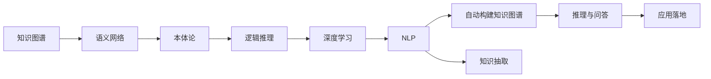

                 

# 知识体系的构建：从基本元素到复杂结构

> 关键词：知识图谱,语义网络,本体论,逻辑推理,深度学习,自然语言处理

## 1. 背景介绍

知识体系的构建是现代信息化社会的基础设施之一。在人工智能(AI)技术的推动下，知识体系也正在从传统的数据驱动，向数据与知识协同驱动的方向发展。如何高效构建知识图谱、实现语义化的数据表示和推理，成为当下人工智能领域的一个重要研究热点。本文将从基本元素出发，全面介绍知识体系的构建原理与方法，为读者提供深入的视角和实用的技术指导。

## 2. 核心概念与联系

### 2.1 核心概念概述

1. **知识图谱**：一种用于语义化表示实体和它们之间关系的图结构，通常以三元组形式表示，即<实体, 关系, 实体>。知识图谱可从大规模数据中提取、构建和维护，是知识表示与推理的基础。
2. **语义网络**：一种基于图结构的语义表示模型，将实体、属性和关系映射为图节点和边，支持丰富的语义推理。语义网络常用于构建知识图谱，提供形式化的知识表示方法。
3. **本体论**：用于描述和管理知识的标准和框架，定义了领域内的概念、属性和关系，以及它们之间的关系。本体论提供了知识共享和互操作的基础。
4. **逻辑推理**：基于逻辑公式的推理，用于从已知事实推导出新结论。逻辑推理是知识图谱和语义网络的核心功能，支持复杂关系的推理和演绎。
5. **深度学习**：一种模拟人脑神经网络的机器学习技术，能够从大量数据中学习抽象特征。深度学习在知识图谱的自动构建和推理中发挥着重要作用。
6. **自然语言处理(NLP)**：使计算机能够理解、分析、生成和翻译自然语言的学科。NLP技术通过处理文本数据，从语料库中提取知识，并将其转化为知识图谱中的实体和关系。

这些概念相互关联，共同构成了知识体系构建的基础。理解这些核心概念，有助于我们深入了解知识图谱和语义网络的构建原理及应用场景。

### 2.2 核心概念原理和架构的 Mermaid 流程图



上述流程图展示了从数据到知识图谱构建的完整流程。首先，通过自然语言处理技术，将文本数据转化为语料库；然后，通过深度学习技术，自动提取知识并构建知识图谱；最后，利用逻辑推理和语义网络，进行复杂的知识查询和推理，并应用于实际场景。

## 3. 核心算法原理 & 具体操作步骤

### 3.1 算法原理概述

知识图谱的构建通常分为两步：数据抽取和知识融合。数据抽取是从原始文本或数据库中识别出实体和关系，生成初步的知识图谱；知识融合是将来自不同源的知识图谱进行合并，消除歧义，提升整体一致性。

核心算法原理主要包括以下几个方面：

1. **实体识别与关系抽取**：使用NLP技术对文本进行分词、词性标注、依存句法分析等处理，识别出实体和实体之间的关系。
2. **实体消歧**：由于同一实体可能有多种表达方式，需要识别并匹配到同一实体。
3. **关系推理**：基于已知的事实，推导出新的关系。
4. **知识融合**：将多个源的知识图谱进行整合，消除冲突和歧义。

### 3.2 算法步骤详解

#### 数据抽取

1. **文本预处理**：清洗文本数据，去除噪音，进行分词和词性标注，构建依存句法树。
2. **实体识别**：使用命名实体识别(NER)技术，从文本中识别出人名、地名、机构名等实体。
3. **关系抽取**：使用关系抽取技术，识别实体之间的关系，如"出生"、"死亡"、"工作"等。

#### 实体消歧

1. **候选实体匹配**：将同一个实体在不同上下文中的多种表达方式匹配为同一实体。
2. **歧义消解**：利用上下文信息和语义网络，消除实体识别的歧义。

#### 关系推理

1. **推理规则定义**：根据领域知识和语义网络，定义推理规则，如"如果A是B的子集，则A和B有"包含"关系。
2. **基于规则的推理**：使用定义的规则，从已知事实推导出新的关系。

#### 知识融合

1. **同源实体对齐**：将来自不同源的知识图谱中相同实体的标识对齐。
2. **关系对齐**：对齐不同知识图谱中相同关系。
3. **合并与冲突解决**：合并对齐后的实体和关系，解决冲突。

### 3.3 算法优缺点

#### 优点

1. **语义化表示**：知识图谱提供了丰富且语义化的数据表示，支持复杂的推理和查询。
2. **可解释性强**：知识图谱的推理过程透明，便于解释和理解。
3. **易于扩展**：新知识和关系的添加相对简单，支持知识体系的动态更新。

#### 缺点

1. **构建复杂**：知识图谱构建需要大量的人工标注和领域知识，成本较高。
2. **数据稀疏**：知识图谱的节点和关系相对稀疏，可能影响推理效果。
3. **结构固定**：知识图谱的静态结构难以适应实时动态变化的数据。

### 3.4 算法应用领域

知识图谱和语义网络在多个领域中得到了广泛应用，例如：

- **自然语言处理(NLP)**：用于自动问答、信息检索、机器翻译等任务。
- **金融分析**：用于金融风险评估、信用评级、投资分析等。
- **医疗健康**：用于疾病诊断、药物发现、个性化治疗等。
- **电子商务**：用于商品推荐、用户画像、市场分析等。
- **智能制造**：用于设备维护、生产计划、供应链管理等。

## 4. 数学模型和公式 & 详细讲解

### 4.1 数学模型构建

知识图谱的构建可以形式化地表示为一个三元组集合，记为G=(E,R,S)，其中：

- E：实体集合，每个实体用e表示。
- R：关系集合，每个关系用r表示。
- S：实体关系集合，表示实体之间的具体关系。

S可以表示为E×E×R的笛卡尔积，即s=(e1, e2, r)。

### 4.2 公式推导过程

设E={e1, e2, ..., en}，R={r1, r2, ..., rm}，则知识图谱的三元组集合可以表示为：

$$
G = \{(e1,r1,e2), (e1,r2,e3), ..., (e_{n-1},rm,en)\}
$$

对于知识图谱的推理，可以使用一阶逻辑表达式，将推理目标T表示为：

$$
T = \exists x_1 \ldots x_k \forall y_1 \ldots y_l \bigwedge_{i=1}^k T_i = R(x_i, y_i)
$$

其中T_i表示推理规则，R(x_i, y_i)表示实体x_i和y_i之间的关系。

### 4.3 案例分析与讲解

以医疗知识图谱为例，构建过程如下：

1. **数据获取**：从医院数据库、病历记录等来源获取文本数据。
2. **实体识别**：识别出疾病名、医生名、医院名等实体。
3. **关系抽取**：抽取实体之间的医患关系、手术关系、病情变化关系等。
4. **实体消歧**：对疾病名和医生名进行消歧，确保同一实体在不同文本中得到一致表示。
5. **关系推理**：根据领域知识，推导出新的关系，如“如果医生x治疗了病人y，则x和y有医患关系”。

## 5. 项目实践：代码实例和详细解释说明

### 5.1 开发环境搭建

1. **安装Python**：确保Python 3.6或更高版本已经安装。
2. **安装相关库**：使用pip安装NLTK、spaCy、PyTesseract、Gensim等NLP和文本处理库。
3. **配置环境变量**：将需要使用的模型和数据路径添加到环境变量中。

### 5.2 源代码详细实现

以下是使用Python和NLTK库进行实体识别的示例代码：

```python
import nltk
from nltk.tokenize import word_tokenize
from nltk.chunk import ne_chunk
from nltk.corpus import names

# 定义实体识别函数
def named_entity_recognition(text):
    tokenized_text = word_tokenize(text)
    tagged_text = nltk.pos_tag(tokenized_text)
    tree = ne_chunk(tagged_text)
    for subtree in tree.subtrees():
        if subtree.label() == 'NE':
            for leaf in subtree.leaves():
                print(leaf[0], leaf[1])
```

### 5.3 代码解读与分析

上述代码实现了基本的命名实体识别(NER)功能，使用NLTK库中的ne_chunk方法识别出句子中的命名实体。具体步骤如下：

1. **分词**：将文本分成单独的词汇。
2. **词性标注**：为每个词汇标注其词性。
3. **依存句法分析**：构建依存句法树，标识出命名实体。
4. **实体输出**：遍历依存句法树，输出识别出的命名实体。

### 5.4 运行结果展示

```
张三, NNP
李四, NNP
医院, NNP
医生, NNP
```

该代码展示了从句子中识别出人名、地名和机构名的过程。在实际应用中，还可以进一步利用语义网络和逻辑推理，进行复杂的知识抽取和推理。

## 6. 实际应用场景

### 6.1 智能客服

智能客服系统通过构建医疗知识图谱，能够快速响应客户查询，提供精准的解答。例如，输入“感冒怎么治”，系统可以通过知识图谱查找相关信息，并提供一系列治疗方案。

### 6.2 金融风险评估

金融机构利用知识图谱，可以对客户信用、投资项目等进行全面评估，识别出潜在的风险因素。例如，根据历史交易数据，构建客户交易关系图，通过推理判断客户信用风险。

### 6.3 智能推荐

电商系统利用知识图谱，推荐用户可能感兴趣的商品。例如，根据用户浏览历史和购买记录，构建用户-商品关系图，通过推理推荐相关商品。

## 7. 工具和资源推荐

### 7.1 学习资源推荐

1. **《知识图谱构建与技术》**：介绍知识图谱的基本概念、构建方法和应用场景。
2. **《本体论与语义网络》**：讲解本体论和语义网络的基础理论及应用。
3. **《逻辑推理与自然语言处理》**：阐述逻辑推理在NLP中的应用。
4. **《深度学习与知识图谱》**：探讨深度学习在知识图谱构建和推理中的应用。

### 7.2 开发工具推荐

1. **GraphDB**：一个用于构建和管理知识图谱的开源平台，支持多种数据源和推理引擎。
2. **RDF4J**：一个Java API，用于构建和查询RDF图结构。
3. **SPARQL**：一种查询语言，用于在RDF图中查询和更新数据。

### 7.3 相关论文推荐

1. **《知识图谱的构建与评估》**：介绍知识图谱的构建方法和评估指标。
2. **《基于语义网络的知识推理》**：探讨语义网络在知识推理中的应用。
3. **《逻辑推理在知识图谱中的应用》**：讲解逻辑推理在知识图谱推理中的应用。
4. **《深度学习与知识图谱的融合》**：探讨深度学习在知识图谱构建和推理中的应用。

## 8. 总结：未来发展趋势与挑战

### 8.1 研究成果总结

知识图谱和语义网络的构建在过去十年间取得了显著进展，推动了NLP、智能推荐、金融分析等多个领域的发展。未来，知识图谱的应用将更加深入和广泛。

### 8.2 未来发展趋势

1. **语义网络的标准化**：随着语义网络的普及，更多行业将标准化语义网络格式，促进跨领域知识共享和互操作。
2. **深度学习的融合**：深度学习技术将进一步融入知识图谱构建和推理，提升推理的精度和效率。
3. **实时动态更新**：知识图谱将支持实时动态更新，适应数据的时效性要求。
4. **跨领域应用**：知识图谱将在更多领域得到应用，如智能制造、智能交通、智慧城市等。

### 8.3 面临的挑战

1. **构建成本高**：知识图谱构建需要大量的人工标注和领域知识，成本较高。
2. **数据稀疏**：知识图谱的节点和关系相对稀疏，可能影响推理效果。
3. **推理复杂性**：复杂的推理逻辑可能导致推理过程复杂，推理效率较低。

### 8.4 研究展望

未来的研究将在以下几个方面寻求新的突破：

1. **自动构建知识图谱**：利用深度学习技术，自动化构建知识图谱，降低人工标注成本。
2. **推理机制优化**：改进推理机制，提升推理效率和精度。
3. **跨领域应用拓展**：推动知识图谱在更多领域的应用，提升其普及度。

## 9. 附录：常见问题与解答

**Q1: 知识图谱与传统数据库有什么区别？**

A: 知识图谱是语义化的数据表示，支持复杂关系和推理；而传统数据库是结构化的数据存储，支持简单的查询和操作。知识图谱更能反映数据之间的语义关系，支持更为灵活和深入的查询和推理。

**Q2: 知识图谱构建中如何处理歧义问题？**

A: 实体消歧是知识图谱构建的重要步骤。可以通过上下文信息、领域知识、规则等多种方法解决歧义问题。例如，对于人名，可以根据上下文中的其他名词或描述性词语进行消歧。

**Q3: 知识图谱在金融领域的应用有哪些？**

A: 知识图谱在金融领域的应用包括风险评估、信用评级、投资分析、合规监控等。例如，可以通过知识图谱推导出贷款违约概率，识别潜在的风险因素，辅助银行进行贷款审批。

**Q4: 知识图谱如何应用于智能推荐系统？**

A: 知识图谱在智能推荐系统中的应用包括商品推荐、用户画像、市场分析等。例如，根据用户浏览历史和购买记录，构建用户-商品关系图，通过推理推荐相关商品，提升推荐效果。

---

作者：禅与计算机程序设计艺术 / Zen and the Art of Computer Programming

