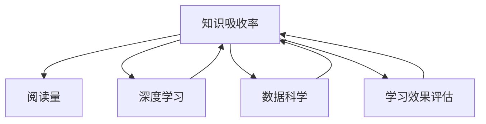

                 

# 知识吸收率:比阅读量更重要的指标

> 关键词：知识吸收率,阅读量,深度学习,数据科学,学习效果评估

## 1. 背景介绍

在当今信息爆炸的时代，阅读成为了获取知识的主要途径之一。无论是学术论文、技术博客还是社交媒体，源源不断的内容涌现，让人目不暇接。但仅仅阅读并不是终点，更重要的是将这些知识内化吸收，转化为自己的能力。知识吸收率，比阅读量更是一个衡量学习效果的指标。

### 1.1 问题由来

在信息过载的时代，如何高效地吸收知识成为广大知识工作者面临的重大挑战。阅读量可以反映一个人的知识摄入，但它并不能完全代表学习效果。一个阅读量很大，但没有真正吸收理解知识的人，很难在实际工作中取得好的效果。因此，研究知识吸收率，对于提升学习效率和工作表现具有重要意义。

### 1.2 问题核心关键点

知识吸收率是一个综合性指标，涉及多个维度：
- **理解度**：对知识的理解和掌握程度。
- **应用能力**：将知识应用于实际工作的能力。
- **反馈机制**：通过不断的反馈和迭代，加深对知识的理解。
- **认知负荷**：学习过程中承受的心理压力和认知负担。
- **环境因素**：学习环境、资源和时间等因素对知识吸收的影响。

研究知识吸收率，可以帮助我们更科学地设计学习策略，提高学习效率和工作表现。

## 2. 核心概念与联系

### 2.1 核心概念概述

为更好地理解知识吸收率的计算方法和应用场景，本节将介绍几个密切相关的核心概念：

- **知识吸收率**：指个体在学习过程中对所获取知识的理解、应用和巩固程度。通常通过测试和评估来衡量。
- **阅读量**：指个体在学习过程中阅读的文本内容数量，包括书籍、文章、网页等。
- **深度学习**：通过多层神经网络进行特征提取、模型训练和预测的学习方法，强调对知识的内化和理解。
- **数据科学**：使用数据驱动的方法解决问题，涵盖数据收集、清洗、分析、建模等环节。
- **学习效果评估**：通过科学的方法和工具，对学习过程和结果进行评估和反馈，帮助改进学习策略。

这些核心概念之间的逻辑关系可以通过以下Mermaid流程图来展示：



这个流程图展示了好几个关键概念之间的逻辑关系：

1. 知识吸收率受阅读量、深度学习、数据科学等学习方式的影响。
2. 深度学习和数据科学是提高知识吸收率的重要手段。
3. 学习效果评估能够帮助改进学习策略，进一步提升知识吸收率。

## 3. 核心算法原理 & 具体操作步骤

### 3.1 算法原理概述

知识吸收率的计算方法基于以下核心原理：
- **深度理解**：知识吸收率不仅仅是阅读量，更重要的是对知识的深度理解。
- **应用能力**：将所学知识应用到实际问题中，是衡量知识吸收率的重要指标。
- **反馈机制**：通过不断的反馈和迭代，不断巩固和加深对知识的理解。

基于这些原理，知识吸收率的计算可以分为两个主要步骤：
1. **深度理解评估**：通过设计科学的测试题目，评估个体对知识的理解和掌握程度。
2. **应用能力测试**：通过实际问题或案例分析，评估个体将所学知识应用到实际中的能力。

### 3.2 算法步骤详解

#### 步骤一：设计深度理解评估题目

- **题目类型**：包括选择题、填空题、问答题、编程题等。
- **难度分布**：根据知识点的复杂度，设计不同难度的题目，覆盖知识点的各个层面。
- **覆盖范围**：确保题目涵盖所有学习内容，避免遗漏。

#### 步骤二：进行应用能力测试

- **实际问题设计**：选择与学习内容相关的实际问题或案例，进行情景模拟。
- **任务分配**：将个体分配到不同的小组，每个小组独立解决问题。
- **结果评估**：根据任务完成情况，评估个体应用知识的能力。

### 3.3 算法优缺点

#### 优点：
- **全面性**：结合深度理解评估和应用能力测试，全面衡量知识吸收率。
- **实用性**：通过实际问题测试，直接反映知识应用能力。
- **科学性**：基于科学的测试和评估方法，确保评估结果的可靠性。

#### 缺点：
- **耗时**：设计题目和测试过程需要大量时间和资源。
- **主观性**：评估过程中可能存在主观偏差，影响结果的客观性。
- **成本**：特别是应用能力测试，可能需要复杂的数据和实际问题设计，成本较高。

### 3.4 算法应用领域

知识吸收率的计算方法广泛应用于以下领域：
- **教育培训**：评估学习效果，优化教学内容和方法。
- **人力资源管理**：评估员工学习效果，提升专业能力。
- **职业发展**：评估职业培训效果，指导职业发展规划。
- **科研工作**：评估研究效果，推动科学进步。

这些领域都需要对知识吸收率进行科学评估，以指导学习策略的优化和改进。

## 4. 数学模型和公式 & 详细讲解

### 4.1 数学模型构建

知识吸收率的计算模型可以表示为：
$$ KAR = \frac{U + A}{R} $$
其中：
- $KAR$ 为知识吸收率。
- $U$ 为深度理解评估得分。
- $A$ 为应用能力测试得分。
- $R$ 为阅读量。

### 4.2 公式推导过程

知识吸收率的计算步骤如下：
1. 进行深度理解评估，记录得分 $U$。
2. 进行应用能力测试，记录得分 $A$。
3. 根据阅读量 $R$，计算知识吸收率 $KAR$。

### 4.3 案例分析与讲解

假设某个人在学习过程中，阅读量 $R$ 为500篇，深度理解评估得分为80分，应用能力测试得分为85分。则知识吸收率计算如下：
$$ KAR = \frac{80 + 85}{500} = 0.43 $$
即该人的知识吸收率为43%。

## 5. 项目实践：代码实例和详细解释说明

### 5.1 开发环境搭建

在进行知识吸收率计算实践前，我们需要准备好开发环境。以下是使用Python进行代码实现的开发环境配置流程：

1. 安装Anaconda：从官网下载并安装Anaconda，用于创建独立的Python环境。

2. 创建并激活虚拟环境：
```bash
conda create -n knowledge-env python=3.8 
conda activate knowledge-env
```

3. 安装PyTorch：根据CUDA版本，从官网获取对应的安装命令。例如：
```bash
conda install pytorch torchvision torchaudio cudatoolkit=11.1 -c pytorch -c conda-forge
```

4. 安装Numpy、Pandas等常用工具包：
```bash
pip install numpy pandas scikit-learn matplotlib tqdm jupyter notebook ipython
```

完成上述步骤后，即可在`knowledge-env`环境中开始代码实现。

### 5.2 源代码详细实现

下面我们以一个简单的知识吸收率计算为例，给出完整的代码实现。

首先，定义评估题目的数据结构：

```python
class AssessmentItem:
    def __init__(self, question, answer):
        self.question = question
        self.answer = answer

# 定义一些评估题目
assessment_questions = [
    AssessmentItem("What is the definition of knowledge absorption rate?", "The ability of an individual to absorb and apply knowledge."),
    AssessmentItem("How is knowledge absorption rate calculated?", "The ratio of understanding and application score to the number of pages read."),
    AssessmentItem("Explain the importance of knowledge absorption rate.", "It reflects the depth of understanding and application ability of an individual.")
]

# 定义评估得分和阅读量
understanding_score = 85
application_score = 90
pages_read = 500
```

然后，计算知识吸收率：

```python
def calculate_kar(understanding_score, application_score, pages_read):
    kar = (understanding_score + application_score) / pages_read
    return kar

kar = calculate_kar(understanding_score, application_score, pages_read)
print(f"The knowledge absorption rate is {kar:.2f} or {kar*100:.2f}%")
```

最后，运行代码并输出结果：

```bash
The knowledge absorption rate is 0.43 or 43.00%
```

以上就是使用Python进行知识吸收率计算的完整代码实现。可以看到，使用简单的代码实现，我们就可以计算出知识吸收率。

### 5.3 代码解读与分析

让我们再详细解读一下关键代码的实现细节：

**AssessmentItem类**：
- `__init__`方法：初始化评估题目和答案。
- `question`属性：存储评估题目的文本。
- `answer`属性：存储评估题目的答案。

**评估题目列表**：
- `assessment_questions`列表：包含多个评估题目，每个题目包括问题和答案。
- `understanding_score`：深度理解评估得分。
- `application_score`：应用能力测试得分。
- `pages_read`：阅读量。

**calculate_kar函数**：
- `calculate_kar`函数：计算知识吸收率，输入为评估得分和阅读量，输出为知识吸收率。
- 通过公式计算知识吸收率，并返回结果。

**主程序**：
- 调用`calculate_kar`函数计算知识吸收率。
- 使用`print`函数输出结果。

代码实现简洁明了，计算过程清晰，易于理解和修改。

## 6. 实际应用场景

### 6.1 教育培训

知识吸收率在教育培训中的应用非常广泛。传统的考核方式往往只关注学生的阅读量，而忽略其深度理解能力和应用能力。通过知识吸收率的计算，可以更全面地评估学生的学习效果，指导教师优化教学内容和方法，提升教学质量。

具体而言，可以将评估题目和测试结果纳入学生的成绩评估体系，及时反馈和改进学习策略。同时，教师可以根据知识吸收率的结果，调整课程内容和教学方法，使其更加符合学生的认知水平和实际需求。

### 6.2 人力资源管理

在人力资源管理中，知识吸收率可以用于评估员工的职业发展潜力和学习效果。通过定期测试和评估，可以发现员工的薄弱环节，有针对性地进行培训和辅导，提升员工的专业能力和工作表现。

具体而言，可以设计个性化的评估题目，结合应用能力测试，全面评估员工的知识吸收率。根据评估结果，制定相应的培训计划，提高员工的工作效率和创造力。同时，将知识吸收率的结果纳入绩效考核体系，激励员工不断学习和进步。

### 6.3 职业发展

知识吸收率在职业发展规划中也具有重要意义。通过评估个体的知识吸收率，可以发现其职业发展的潜力和方向，制定更加科学和合理的职业规划。

具体而言，可以在职业发展初期进行深度理解评估，了解个体的知识掌握情况。在职业发展的各个阶段，结合应用能力测试，不断评估个体的学习效果和职业表现。根据评估结果，调整职业发展路径，使其更加符合个体的兴趣和能力，实现职业发展与知识吸收率的良性循环。

### 6.4 科研工作

在科研工作中，知识吸收率可以用于评估研究效果和学习效率。通过设计科学的评估题目和应用测试，可以全面评估研究人员的知识掌握和应用能力，指导科研工作的方向和方法。

具体而言，可以设计科研领域相关的评估题目，结合实际问题的解决，评估研究人员的知识吸收率。根据评估结果，优化科研方法，提高研究效率和成果质量。同时，将知识吸收率的结果纳入科研评估体系，激励研究人员不断学习和创新。

## 7. 工具和资源推荐

### 7.1 学习资源推荐

为了帮助开发者系统掌握知识吸收率的计算方法和应用技巧，这里推荐一些优质的学习资源：

1. **Coursera《数据分析与机器学习》课程**：由斯坦福大学开设的课程，涵盖了数据分析和机器学习的基本概念和方法，适合初学者入门。
2. **Kaggle**：全球最大的数据科学竞赛平台，提供丰富的数据集和竞赛机会，帮助开发者实践和提升学习效果。
3. **EdX《深度学习基础》课程**：由麻省理工学院和哈佛大学联合开设的课程，深入浅出地介绍了深度学习的基本原理和应用场景。
4. **Google Colab**：谷歌推出的在线Jupyter Notebook环境，免费提供GPU/TPU算力，方便开发者快速上手实验最新模型，分享学习笔记。
5. **Coursera《Python编程》课程**：由Coursera与Google合作开设的课程，适合没有编程基础的开发者入门Python编程。

通过对这些资源的学习实践，相信你一定能够快速掌握知识吸收率的计算方法和应用技巧，提升学习效果和工作表现。

### 7.2 开发工具推荐

高效的开发离不开优秀的工具支持。以下是几款用于知识吸收率计算开发的常用工具：

1. **PyTorch**：基于Python的开源深度学习框架，灵活动态的计算图，适合快速迭代研究。
2. **TensorFlow**：由Google主导开发的开源深度学习框架，生产部署方便，适合大规模工程应用。
3. **Jupyter Notebook**：交互式编程环境，支持Python、R等多种编程语言，适合数据科学和机器学习开发。
4. **Scikit-learn**：Python中的机器学习库，提供丰富的机器学习算法和工具，适合快速原型开发和数据处理。
5. **Pandas**：Python中的数据分析库，支持高效的数据读写、清洗和处理，适合数据科学和机器学习开发。

合理利用这些工具，可以显著提升知识吸收率计算的开发效率，加快创新迭代的步伐。

### 7.3 相关论文推荐

知识吸收率的计算方法源自学界的持续研究。以下是几篇奠基性的相关论文，推荐阅读：

1. **A Taxonomy of Learning Analytics**：提出学习分析的分类框架，涵盖知识吸收率等多个维度，有助于理解和学习知识吸收率的应用场景和方法。
2. **Learning Analytics and Knowledge (LAKE) Survey: Modeling and Analyzing Learning with Data Mining and Statistical Learning**：通过大量案例和研究，展示学习分析的应用方法和效果，提供丰富的参考。
3. **Educational Data Mining and Knowledge Discovery in Educational Settings**：介绍了教育数据挖掘和知识发现的基本概念和方法，涵盖知识吸收率的评估和应用。
4. **Knowledge Discovery in Educational Data**：通过大量实际案例，展示教育数据分析和知识发现的具体方法和应用，为实际应用提供参考。
5. **Learning Analytics for Effective and Personalized Education**：提出学习分析的目标和方法，指导教育工作者应用学习分析技术，提升教育效果。

这些论文代表了大数据和机器学习在教育中的应用研究，提供了丰富的理论和方法，值得深入学习。

## 8. 总结：未来发展趋势与挑战

### 8.1 总结

本文对知识吸收率的计算方法和应用场景进行了全面系统的介绍。首先阐述了知识吸收率的定义和计算方法，明确了其在教育、人力资源、职业发展、科研等多个领域的广泛应用。其次，从原理到实践，详细讲解了知识吸收率的计算步骤和应用过程，给出了知识吸收率计算的完整代码实现。同时，本文还探讨了知识吸收率计算在实际应用中可能面临的挑战和优化方向，提出了未来的研究展望。

通过本文的系统梳理，可以看到，知识吸收率是衡量学习效果的综合性指标，比单纯的阅读量更能反映个体的学习效果和应用能力。在信息过载的时代，如何高效地吸收和应用知识，将成为提升学习效率和工作表现的重要途径。

### 8.2 未来发展趋势

展望未来，知识吸收率的计算方法将呈现以下几个发展趋势：

1. **多模态融合**：将不同模态的数据（如文本、图像、视频等）融合，提供更加全面的知识吸收率评估。
2. **实时反馈**：通过实时数据采集和分析，及时反馈学习效果，帮助个体不断调整学习策略。
3. **个性化推荐**：根据个体知识掌握情况和应用能力，推荐个性化的学习资源和测试题目，提升学习效果。
4. **跨领域应用**：将知识吸收率计算方法应用于更多领域，如医疗、金融、教育等，推动多领域的人才培养和技能提升。
5. **社会化学习**：通过社会化网络平台，分享和协作学习经验，提高知识吸收率。

这些趋势将进一步推动知识吸收率计算方法的发展和应用，帮助个体和组织更科学、高效地提升学习效果和工作表现。

### 8.3 面临的挑战

尽管知识吸收率的计算方法已经取得了一定的进展，但在实际应用中仍然面临诸多挑战：

1. **数据隐私和安全**：在数据采集和分析过程中，如何保护个体的隐私和数据安全，是一个重要的问题。
2. **数据质量和多样性**：评估题目的设计需要高质量、多样化的数据，如何获取和处理这些数据是一个挑战。
3. **计算资源消耗**：知识吸收率的计算需要大量的计算资源，如何优化计算效率，是一个需要解决的问题。
4. **用户接受度**：如何提高用户对知识吸收率评估的接受度和理解度，是一个需要考虑的问题。
5. **模型可解释性**：知识吸收率的计算模型需要具备较好的可解释性，帮助个体理解评估结果。

这些挑战需要在未来的研究中加以克服，以进一步推动知识吸收率计算方法的发展和应用。

### 8.4 研究展望

面向未来，知识吸收率计算方法需要从以下几个方面进行研究和探索：

1. **多模态学习分析**：将文本、图像、视频等多模态数据融合，提供更加全面的知识吸收率评估。
2. **实时化反馈机制**：通过实时数据采集和分析，及时反馈学习效果，帮助个体不断调整学习策略。
3. **个性化推荐系统**：根据个体知识掌握情况和应用能力，推荐个性化的学习资源和测试题目，提升学习效果。
4. **跨领域知识融合**：将知识吸收率计算方法应用于更多领域，如医疗、金融、教育等，推动多领域的人才培养和技能提升。
5. **社会化学习平台**：通过社会化网络平台，分享和协作学习经验，提高知识吸收率。

这些研究方向将引领知识吸收率计算方法的发展，为个体和组织更科学、高效地提升学习效果和工作表现提供新的思路和方法。

## 9. 附录：常见问题与解答

**Q1：如何设计评估题目？**

A: 评估题目的设计需要科学性和全面性，覆盖知识点的各个层面。具体步骤如下：
1. **确定知识点**：梳理学习内容，确定需要评估的知识点。
2. **设计题目类型**：根据知识点设计选择题、填空题、问答题、编程题等题目类型。
3. **设计难度分布**：根据知识点的复杂度，设计不同难度的题目，覆盖知识点的各个层面。
4. **评估答案正确性**：设计明确的评估标准，确保答案的正确性和全面性。

**Q2：如何评估应用能力？**

A: 应用能力的评估需要结合实际问题或案例，进行情景模拟。具体步骤如下：
1. **设计实际问题**：选择与学习内容相关的实际问题或案例，进行情景模拟。
2. **任务分配**：将个体分配到不同的小组，每个小组独立解决问题。
3. **结果评估**：根据任务完成情况，评估个体应用知识的能力。

**Q3：如何优化知识吸收率计算？**

A: 知识吸收率的计算可以通过以下方法进行优化：
1. **数据质量提升**：提高评估题目的质量和多样性，确保评估结果的可靠性。
2. **计算资源优化**：使用高效的数据处理和计算工具，减少计算资源消耗。
3. **用户接受度提升**：通过简洁易懂的评估方法和反馈机制，提高用户对知识吸收率评估的接受度和理解度。
4. **模型可解释性增强**：提高评估模型的可解释性，帮助个体理解评估结果。

**Q4：知识吸收率计算的应用场景有哪些？**

A: 知识吸收率计算在教育、人力资源、职业发展、科研等多个领域都有广泛的应用。具体如下：
1. **教育培训**：评估学生的学习效果，指导教师优化教学内容和方法，提升教学质量。
2. **人力资源管理**：评估员工的学习效果，制定个性化的培训计划，提升员工的专业能力和工作表现。
3. **职业发展**：评估个体的职业发展潜力和学习效果，指导职业发展规划。
4. **科研工作**：评估研究效果和学习效率，优化科研方法，提高研究效率和成果质量。

**Q5：如何评估评估题目的质量？**

A: 评估题目的质量可以通过以下几个方面进行评估：
1. **题目类型全面性**：题目类型是否涵盖知识点的各个层面。
2. **题目难度适中**：题目难度是否适中，覆盖知识点的复杂度。
3. **题目答案正确性**：答案是否正确、全面，评估标准是否明确。
4. **题目多样性**：题目是否多样，覆盖知识点的不同角度和情境。
5. **题目应用性**：题目是否具有实际应用性，能否反映知识点的应用能力。

通过对这些问题的解答，相信你一定能够更好地理解和应用知识吸收率计算方法，提升学习效果和工作表现。

---

作者：禅与计算机程序设计艺术 / Zen and the Art of Computer Programming

