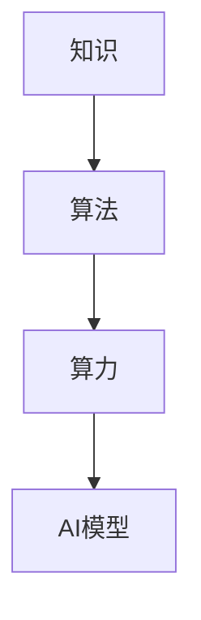

                 

# 知识、算法、算力在第一代AI中的作用

## 1. 背景介绍

### 1.1 问题由来

随着人工智能技术的快速发展，人工智能领域进入了快速迭代和高度密集的新时代。无论是在计算机视觉、语音识别，还是在自然语言处理(NLP)、推荐系统等众多领域，AI技术都在以迅猛的速度不断突破。然而，无论是学术界还是工业界，AI技术的发展依旧离不开三个核心要素：知识、算法和算力。尽管这三者各自扮演着不同的角色，但缺一不可，共同构成了AI系统的核心竞争力。

本文将深入探讨知识、算法和算力在第一代AI中的作用，分析它们对AI技术演进的重要影响，以及在未来发展中的潜力和挑战。通过对这三者的系统性考察，希望能够为AI领域的研究者和开发者提供更全面的技术视角和实践指导。

### 1.2 问题核心关键点

为了更清晰地认识和理解知识、算法和算力对AI技术的作用，本文将从定义、应用、优缺点、发展趋势等多个角度进行分析。具体包括以下几个核心关键点：

- **知识的作用**：指人工智能系统所依赖的领域知识和专家经验，以及通过数据挖掘和机器学习获得的知识表示。
- **算法的作用**：指人工智能系统中用于数据处理、模型训练和推理计算的数学和计算方法。
- **算力的作用**：指支持AI模型训练和推理计算的硬件资源，包括CPU、GPU、TPU等高性能计算设备。

## 2. 核心概念与联系

### 2.1 核心概念概述

为更好地理解知识、算法和算力在AI中的作用，本节将详细介绍这些核心概念：

- **知识**：是指AI系统所依赖的领域知识、数据和模型。知识可以通过数据挖掘、知识图谱、领域专家经验等方式获得，是AI系统智能决策的基础。

- **算法**：是指用于处理、分析和应用数据的数学和计算方法。算法分为数据预处理、模型训练和推理计算等不同阶段，是实现AI智能的关键工具。

- **算力**：是指支持AI模型训练和推理计算的硬件资源。算力包括计算能力、存储能力和数据传输能力，是实现高效、准确AI模型的必要保障。

这些概念之间的逻辑关系可以通过以下Mermaid流程图来展示：



这个流程图展示出知识、算法和算力在AI模型构建中的相互依赖关系：

1. 知识为算法提供数据和背景信息，指导算法设计。
2. 算法通过计算处理知识，生成模型，并最终支持AI模型的推理和决策。
3. 算力提供高性能计算能力，支持算法的训练和推理过程，确保AI模型高效运行。

## 3. 核心算法原理 & 具体操作步骤
### 3.1 算法原理概述

在AI系统中，算法的作用是对知识进行处理、抽象和应用，以实现智能决策和高效计算。核心算法包括但不限于：

- **数据预处理算法**：如特征提取、数据清洗、归一化等，用于提升数据质量和可用性。
- **模型训练算法**：如梯度下降、随机梯度下降、Adam等，用于优化模型参数，提高模型性能。
- **推理计算算法**：如前向传播、反向传播、推理引擎等，用于高效计算模型输出，满足实时性需求。

这些算法的核心原理在于通过计算和优化，实现对知识的高效应用和转化。

### 3.2 算法步骤详解

基于知识、算法和算力的AI系统构建，通常包括以下几个关键步骤：

**Step 1: 知识获取和表示**
- 收集领域知识和经验数据，构建知识图谱或领域知识库。
- 通过数据挖掘和机器学习技术，从大规模数据中提取知识表示，如特征、向量、嵌入等。

**Step 2: 算法设计和实现**
- 根据知识表示和应用需求，选择或设计合适的算法，如监督学习、强化学习、生成模型等。
- 实现算法，包括数据预处理、模型训练和推理计算等环节。

**Step 3: 算力资源配置**
- 根据模型规模和计算需求，选择合适的算力资源，如CPU、GPU、TPU等高性能计算设备。
- 配置算力资源，进行分布式计算和并行计算，优化计算效率。

**Step 4: 模型训练和优化**
- 在知识驱动的算法支持下，使用大规模数据进行模型训练，调整模型参数。
- 应用正则化、Dropout等技术，避免过拟合，提升模型泛化能力。

**Step 5: 模型推理和应用**
- 在算力支持下，进行模型推理计算，生成推理结果。
- 将推理结果应用于实际应用场景，实现智能决策和业务功能。

### 3.3 算法优缺点

知识、算法和算力各有优缺点，需要根据具体场景进行选择和优化：

**知识的优点**：
- 知识提供了领域背景和领域规则，指导算法设计和模型训练。
- 知识可以通过专家经验积累，提升AI系统的可解释性和可信度。

**知识的缺点**：
- 知识获取和表示过程复杂，需要大量时间和资源。
- 知识可能存在偏差或不足，影响AI系统的全面性和准确性。

**算法的优点**：
- 算法提供了高效的数据处理和模型优化能力，提升AI系统性能。
- 算法通过优化计算，实现了对知识的高效应用和转化。

**算法的缺点**：
- 算法设计和实现过程复杂，需要高水平的研究和工程能力。
- 算法可能存在局部最优解，影响模型泛化能力。

**算力的优点**：
- 算力提供了高效的计算能力，支持大规模模型训练和推理。
- 算力通过分布式计算和并行计算，提升了计算效率和系统性能。

**算力的缺点**：
- 算力成本高，需要大量硬件资源和基础设施投资。
- 算力设备有限，可能限制模型的规模和复杂度。

### 3.4 算法应用领域

知识、算法和算力在AI领域的应用非常广泛，覆盖了几乎所有主要应用场景，例如：

- **计算机视觉**：图像分类、目标检测、图像生成等。
- **语音识别**：语音转文本、语音合成、语音情感分析等。
- **自然语言处理**：语言模型、机器翻译、问答系统等。
- **推荐系统**：个性化推荐、商品推荐、广告推荐等。
- **自动驾驶**：环境感知、路径规划、决策推理等。

此外，知识、算法和算力也在智慧医疗、智慧城市、智能制造等众多领域得到了广泛应用，为各行业的智能化转型提供了强大的技术支持。

## 4. 数学模型和公式 & 详细讲解  
### 4.1 数学模型构建

为了更系统地理解知识、算法和算力在AI中的应用，本节将通过数学模型来详细阐述这一过程。

设AI系统接收的输入数据为 $x$，领域知识为 $K$，算法为 $A$，算力为 $C$，AI模型的输出为 $y$。则知识、算法和算力的作用可以表示为：

$$
y = A(K, x, C)
$$

其中 $K$ 是领域知识和经验数据，$x$ 是输入数据，$C$ 是算力资源，$A$ 是算法。

以自然语言处理中的文本分类任务为例，数学模型可以表示为：

$$
y = \max_{c \in C} \sum_{i=1}^n w_i \cdot \log P(c|x, K, C)
$$

其中 $P(c|x, K, C)$ 表示在给定输入数据 $x$、领域知识 $K$ 和算力 $C$ 的条件下，输出为类别 $c$ 的概率。$w_i$ 是每个类别 $c$ 的权重。

### 4.2 公式推导过程

以下是自然语言处理中文本分类任务的公式推导过程：

**Step 1: 特征提取**
- 将输入文本 $x$ 转换为向量表示 $x^v$。
- 应用领域知识 $K$ 和特征提取算法 $F$，生成特征向量 $f(x^v, K)$。

**Step 2: 模型训练**
- 将特征向量 $f(x^v, K)$ 输入到模型 $M$，得到预测结果 $p(y|x, K, C)$。
- 应用训练算法 $T$，优化模型参数 $\theta$，最小化损失函数 $\mathcal{L}$。
- 得到训练后的模型 $M^*$。

**Step 3: 推理计算**
- 将新的输入文本 $x'$ 转换为向量表示 $x'^v$。
- 应用特征提取算法 $F$ 和领域知识 $K$，生成特征向量 $f(x'^v, K)$。
- 将特征向量输入到训练好的模型 $M^*$，得到推理结果 $y'$。

### 4.3 案例分析与讲解

以AlphaGo为例，探讨知识、算法和算力在AI中的具体应用：

**知识**：
- AlphaGo的知识来源包括围棋规则、战术、策略和专家经验。
- 通过深度强化学习算法，AlphaGo从大量围棋对局中学习到最优策略。

**算法**：
- AlphaGo使用了卷积神经网络(CNN)和残差网络(RNN)等算法，处理围棋棋盘数据。
- 应用蒙特卡洛树搜索(MCTS)算法，在搜索树中寻找最优策略。

**算力**：
- AlphaGo在Google的TPU集群上进行训练和推理计算，每秒可处理数百万步。
- 强大的算力支持了AlphaGo在训练和推理过程中的高效计算，使其能够迅速提升棋力。

AlphaGo的成功充分展示了知识、算法和算力在AI中的应用和重要性。

## 5. 项目实践：代码实例和详细解释说明
### 5.1 开发环境搭建

在进行知识、算法和算力在AI中的应用实践前，我们需要准备好开发环境。以下是使用Python进行TensorFlow开发的环境配置流程：

1. 安装Anaconda：从官网下载并安装Anaconda，用于创建独立的Python环境。

2. 创建并激活虚拟环境：
```bash
conda create -n tf-env python=3.8 
conda activate tf-env
```

3. 安装TensorFlow：根据CUDA版本，从官网获取对应的安装命令。例如：
```bash
conda install tensorflow -c conda-forge -c pypi
```

4. 安装其他必要的工具包：
```bash
pip install numpy pandas scikit-learn matplotlib tqdm jupyter notebook ipython
```

完成上述步骤后，即可在`tf-env`环境中开始项目实践。

### 5.2 源代码详细实现

下面我们以自然语言处理中的文本分类任务为例，给出使用TensorFlow进行模型训练和推理的PyTorch代码实现。

首先，定义模型和损失函数：

```python
import tensorflow as tf
from tensorflow.keras.layers import Embedding, Dense, Flatten, Dropout
from tensorflow.keras.models import Sequential

def create_model(input_dim, output_dim):
    model = Sequential([
        Embedding(input_dim, 128, input_length=100),
        Flatten(),
        Dense(64, activation='relu'),
        Dropout(0.5),
        Dense(output_dim, activation='softmax')
    ])
    return model

def create_loss():
    return tf.keras.losses.CategoricalCrossentropy()

def compile_model(model, loss, optimizer):
    model.compile(optimizer=optimizer, loss=loss)
```

然后，准备训练和测试数据集：

```python
from tensorflow.keras.datasets import imdb
from tensorflow.keras.preprocessing import sequence

(x_train, y_train), (x_test, y_test) = imdb.load_data(num_words=10000)
x_train = sequence.pad_sequences(x_train, maxlen=100)
x_test = sequence.pad_sequences(x_test, maxlen=100)

# 将标签转换为独热编码
y_train = tf.keras.utils.to_categorical(y_train)
y_test = tf.keras.utils.to_categorical(y_test)

# 定义模型和损失函数
model = create_model(input_dim=10000, output_dim=2)
loss = create_loss()

# 选择优化器和学习率
optimizer = tf.keras.optimizers.Adam(lr=0.001)
```

接着，进行模型训练和评估：

```python
epochs = 10

for epoch in range(epochs):
    model.fit(x_train, y_train, epochs=1, validation_data=(x_test, y_test))
    print('Epoch %d: Loss: %f, Accuracy: %f' % (epoch+1, loss_value, accuracy_value))

# 在测试集上评估模型
model.evaluate(x_test, y_test)
```

以上就是使用TensorFlow对文本分类任务进行模型训练和评估的完整代码实现。可以看到，TensorFlow提供了丰富的API和工具，使得模型构建和训练过程更加高效便捷。

### 5.3 代码解读与分析

让我们再详细解读一下关键代码的实现细节：

**create_model函数**：
- 定义了一个简单的卷积神经网络模型，包括嵌入层、全连接层、Dropout层和输出层。
- 嵌入层将输入文本转换为向量表示，全连接层进行特征提取，Dropout层防止过拟合，输出层进行分类。

**create_loss函数**：
- 定义了交叉熵损失函数，用于衡量模型输出与真实标签之间的差异。

**compile_model函数**：
- 将模型、损失函数和优化器组装成可训练的模型。

**训练和评估过程**：
- 使用`model.fit`方法进行模型训练，`epochs`参数指定训练轮数，`validation_data`参数指定验证集。
- 在每个epoch结束时，打印当前epoch的损失值和准确率。
- 使用`model.evaluate`方法在测试集上评估模型性能。

通过这些关键代码的实现，我们可以清晰地理解TensorFlow在构建和训练模型中的核心作用，以及如何通过代码来实现知识、算法和算力在AI系统中的具体应用。

## 6. 实际应用场景

### 6.1 智能推荐系统

基于知识、算法和算力的智能推荐系统，已经在电商、内容推荐、广告投放等多个领域得到了广泛应用。推荐系统的核心是利用用户行为数据和商品特征数据，构建知识图谱，设计推荐算法，并通过强大的算力进行实时计算和动态调整。

在实际应用中，推荐系统通常采用协同过滤、内容推荐、基于兴趣的推荐等多种算法，构建用户-商品关联矩阵，通过矩阵分解、因子分解等方法，提取用户和商品的特征向量，计算相似度，生成推荐结果。整个推荐过程，从知识获取到算法设计，再到算力支持，每个环节都需精心设计和优化，以提升推荐效果和用户满意度。

### 6.2 医疗诊断系统

在医疗领域，基于知识、算法和算力的AI诊断系统，已经在疾病诊断、影像分析、基因组学等领域取得了显著成果。医疗诊断系统的核心是利用医疗知识和医学影像数据，构建知识图谱，设计诊断算法，并通过强大的算力进行实时分析。

以癌症影像分析为例，AI系统通过预训练模型提取影像特征，结合领域知识构建分类器，通过多层次的卷积神经网络进行图像分割和病变检测。整个系统通过高效的分布式计算，支持大规模医疗影像的实时分析和快速诊断，显著提升了医疗诊断的准确性和效率。

### 6.3 自动驾驶

自动驾驶系统是知识、算法和算力集大成者，涵盖了感知、决策、控制等多个环节。自动驾驶的核心是利用环境感知数据、路线规划和车辆控制知识，设计感知算法、决策算法和控制算法，并通过强大的算力进行实时处理和决策。

自动驾驶系统通过摄像头、雷达等传感器获取环境数据，利用深度学习算法提取特征，构建环境感知模型。通过路径规划算法和决策树算法，进行目标识别和决策推理。通过高效的分布式计算，支持自动驾驶系统在复杂道路环境中的实时决策和精准控制。

## 7. 工具和资源推荐
### 7.1 学习资源推荐

为了帮助开发者系统掌握知识、算法和算力在AI中的应用，这里推荐一些优质的学习资源：

1. 《深度学习》系列书籍：由深度学习领域的权威专家撰写，系统介绍了深度学习的基本原理和核心算法。

2. 《TensorFlow实战Google深度学习框架》：Google官方发布的TensorFlow教程，提供了丰富的实战案例和代码示例。

3. 《TensorFlow中文文档》：官方中文文档，详细介绍了TensorFlow的各个组件和API，提供了大量的学习资源。

4. 《PyTorch深度学习框架》：PyTorch官方教程，提供了丰富的实战案例和代码示例。

5. 《自然语言处理综述》：斯坦福大学的自然语言处理课程，涵盖NLP领域的核心概念和前沿技术。

6. 《知识图谱与信息检索》：清华大学课程，介绍了知识图谱的基本概念和应用场景。

通过对这些资源的学习实践，相信你一定能够快速掌握知识、算法和算力在AI中的应用，并用于解决实际的AI问题。

### 7.2 开发工具推荐

高效的开发离不开优秀的工具支持。以下是几款用于AI系统开发的常用工具：

1. TensorFlow：Google开发的深度学习框架，提供了丰富的API和工具支持，适合大规模工程应用。

2. PyTorch：Facebook开发的深度学习框架，具有动态计算图的特点，适合快速迭代研究。

3. Keras：高层次的深度学习API，支持多种深度学习框架，易于上手。

4. Jupyter Notebook：开源的交互式编程环境，支持多语言的代码编写和实时展示。

5. Visual Studio Code：功能强大的代码编辑器，支持各种编程语言和扩展。

合理利用这些工具，可以显著提升AI系统开发的效率和质量，加快创新迭代的步伐。

### 7.3 相关论文推荐

知识、算法和算力在AI领域的发展源于学界的持续研究。以下是几篇奠基性的相关论文，推荐阅读：

1. Deep Residual Learning for Image Recognition（即ResNet论文）：提出了残差网络结构，提升了深度神经网络的训练和泛化能力。

2. Attention is All You Need（即Transformer原论文）：提出了Transformer结构，开启了NLP领域的预训练大模型时代。

3. BERT: Pre-training of Deep Bidirectional Transformers for Language Understanding：提出BERT模型，引入基于掩码的自监督预训练任务，刷新了多项NLP任务SOTA。

4. GANs Trained by a Two Time-Scale Update Rule Converge to the Fixed-Point of Their Update Rule（即WGAN论文）：提出了WGAN生成对抗网络，提高了生成模型的质量和多样性。

5. SimCLR: A Simple Framework for Contrastive Learning of Visual Representations：提出SimCLR算法，实现了大规模无监督图像特征学习。

这些论文代表了大规模AI技术的发展脉络。通过学习这些前沿成果，可以帮助研究者把握学科前进方向，激发更多的创新灵感。

## 8. 总结：未来发展趋势与挑战

### 8.1 总结

本文对知识、算法和算力在AI中的作用进行了全面系统的介绍。首先阐述了知识、算法和算力对AI技术演进的重要影响，明确了它们在AI系统构建中的相互依赖关系。其次，从原理到实践，详细讲解了知识、算法和算力的数学模型和实现方法，给出了具体的代码实例。同时，本文还探讨了知识、算法和算力在多个AI应用场景中的应用，展示了它们在AI系统中的广泛应用。

通过本文的系统梳理，可以看到，知识、算法和算力是AI系统构建的核心要素，相互依赖，共同支撑AI系统的智能决策和高效计算。在未来AI技术的演进中，它们将继续发挥重要作用，推动AI技术向更高层次发展。

### 8.2 未来发展趋势

展望未来，知识、算法和算力在AI领域的发展呈现以下几个趋势：

1. 知识图谱和大规模知识库的构建：知识图谱的构建和大规模知识库的建立，将进一步提升AI系统的智能决策能力，支持更加复杂的推理和分析。

2. 深度学习和迁移学习的结合：深度学习和大规模迁移学习的结合，将使得AI系统能够更好地迁移和泛化到新的领域和任务。

3. 多模态学习技术的普及：多模态学习技术的普及，将使得AI系统能够更好地处理和融合视觉、语音、文本等多种数据，提升系统的感知能力和泛化能力。

4. 自动化和自监督学习的应用：自动化和自监督学习技术的应用，将使得AI系统能够更加高效地进行知识获取和模型训练，减少对人工干预的依赖。

5. 分布式计算和联邦学习的应用：分布式计算和联邦学习的应用，将使得AI系统能够在大规模数据集上进行高效训练和实时推理，支持边缘计算和云计算。

6. 自适应和在线学习的普及：自适应和在线学习技术的应用，将使得AI系统能够更加灵活地适应数据分布的变化，提升系统的动态性和适应性。

以上趋势凸显了知识、算法和算力在AI技术中的重要作用，展示了AI技术在未来发展的广阔前景。这些方向的探索发展，必将进一步提升AI系统的性能和应用范围，为人工智能技术的发展注入新的动力。

### 8.3 面临的挑战

尽管知识、算法和算力在AI技术中的应用已经取得了显著进展，但在迈向更加智能化、普适化应用的过程中，它们仍面临诸多挑战：

1. 数据质量和多样性瓶颈：高质量、大规模数据集的获取和处理是知识、算法和算力高效应用的前提。当前，数据质量和多样性仍是制约AI技术发展的瓶颈。

2. 模型复杂度和训练成本问题：大型深度神经网络模型虽然能够处理复杂任务，但训练成本高，硬件资源需求大，限制了其在大规模应用中的推广。

3. 知识表示和理解问题：当前知识图谱和大规模知识库的构建，仍然依赖于人工标注和专家经验，自动化程度有待提高。

4. 算力成本和资源管理问题：大规模算力资源的获取和管理成本高，如何高效利用算力资源，优化资源配置，将是未来的一大挑战。

5. 模型解释性和透明性问题：AI模型的决策过程缺乏可解释性，难以理解和调试，影响其在高风险领域的应用。

6. 模型公平性和安全性问题：AI模型可能存在偏见和歧视，影响模型的公平性和安全性，如何避免有害输出，确保模型安全，是未来的重要课题。

7. 算法鲁棒性和泛化性问题：当前AI模型在面对对抗样本和数据分布变化时，鲁棒性和泛化能力仍有限，如何提高模型的鲁棒性和泛化能力，将是未来的重要研究方向。

以上挑战展示了知识、算法和算力在AI技术中的应用和发展面临的诸多问题，需要我们共同努力，积极应对并寻求突破。

### 8.4 研究展望

未来，知识、算法和算力在AI技术中的应用还需要在以下几个方面进行深入研究和探索：

1. 自动化知识获取和表示：如何自动构建大规模知识图谱，高效提取和表示知识，提升AI系统的智能决策能力。

2. 跨模态学习和多模态融合：如何更好地处理和融合视觉、语音、文本等多种数据，提升AI系统的感知能力和泛化能力。

3. 自适应和自监督学习：如何设计自适应和自监督学习算法，减少对人工干预的依赖，提升AI系统的动态性和适应性。

4. 分布式计算和联邦学习：如何高效利用分布式计算和联邦学习技术，支持大规模数据集上的高效训练和实时推理，提升AI系统的实时性和可靠性。

5. 模型解释性和透明性：如何提升AI模型的可解释性和透明性，增强模型的可信度和可用性，支持高风险领域的应用。

6. 模型公平性和安全性：如何设计公平和安全的AI模型，避免偏见和歧视，确保模型的公平性和安全性。

7. 鲁棒性和泛化能力提升：如何设计鲁棒性和泛化能力更强的算法，提升AI模型在不同场景下的稳定性和可靠性。

这些方向的研究将推动知识、算法和算力在AI技术中的应用和发展，进一步提升AI系统的性能和应用范围，为人工智能技术的发展注入新的动力。

## 9. 附录：常见问题与解答

**Q1：如何理解知识、算法和算力在AI中的作用？**

A: 知识、算法和算力是AI系统构建的核心要素，相互依赖，共同支撑AI系统的智能决策和高效计算。知识提供背景和规则，算法提供计算和优化手段，算力提供计算资源支持。在AI系统中，三者缺一不可，共同构成了系统的智能决策和性能表现。

**Q2：知识、算法和算力在AI中的应用有哪些？**

A: 知识、算法和算力在AI中的应用非常广泛，涵盖了视觉、语音、文本、推荐、医疗、自动驾驶等多个领域。它们在各领域的应用，不仅提升了系统的智能决策能力，还提高了系统的实时性和可靠性。

**Q3：如何设计高效的AI系统？**

A: 设计高效的AI系统，需要系统性地考虑知识、算法和算力的结合。具体步骤如下：
1. 收集和构建领域知识，建立知识图谱或知识库。
2. 选择或设计合适的算法，进行数据预处理、模型训练和推理计算。
3. 配置合适的算力资源，进行分布式计算和并行计算。

通过系统性地考虑这三者的结合，可以设计出高效、智能的AI系统。

**Q4：AI系统面临哪些挑战？**

A: AI系统面临的挑战主要包括数据质量、模型复杂度、知识表示、算力成本、模型解释性、公平性和鲁棒性等问题。这些问题需要通过自动化知识获取、跨模态学习、自适应学习、分布式计算、模型解释性增强、公平性设计、鲁棒性提升等方法进行应对。

通过系统地解决这些问题，可以推动AI技术的进一步发展，提升AI系统的性能和应用范围。

**Q5：未来AI技术的发展方向是什么？**

A: 未来AI技术的发展方向包括知识图谱构建、多模态学习、自动化和自监督学习、分布式计算、自适应学习、模型解释性增强、公平性设计、鲁棒性提升等。这些方向的研究将推动AI技术的进一步发展，提升AI系统的性能和应用范围，为人工智能技术的发展注入新的动力。

总之，知识、算法和算力是AI系统构建的核心要素，相互依赖，共同支撑AI系统的智能决策和高效计算。在未来AI技术的演进中，它们将继续发挥重要作用，推动AI技术向更高层次发展。同时，面对知识、算法和算力在AI技术中的应用和发展面临的诸多问题，需要我们共同努力，积极应对并寻求突破，推动AI技术向更加智能化、普适化方向迈进。

