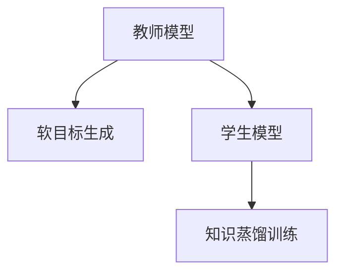

                 

# 知识蒸馏Knowledge Distillation原理与代码实例讲解

> 关键词：知识蒸馏,教师模型,学生模型,模型压缩,迁移学习,模型融合

## 1. 背景介绍

### 1.1 问题由来
在深度学习领域，模型参数的增多通常能够带来更好的性能提升。然而，随着模型规模的不断扩大，存储和计算资源的需求也急剧增长。特别是在移动设备、嵌入式设备等资源受限的平台上，过度复杂的模型往往难以部署。为了在保持模型性能的同时，有效降低模型资源需求，知识蒸馏(Knowledge Distillation)应运而生。

知识蒸馏是一种将大型复杂模型（教师模型）的知识，传递给小型轻量模型（学生模型）的技术。它通过将教师模型输出的软目标（soft target）作为监督信号，引导学生模型学习教师模型的知识表示，从而在保持模型性能的同时，大幅减少模型参数和计算资源。

### 1.2 问题核心关键点
知识蒸馏的核心思想是将一个大型复杂模型的知识（通常是对特定任务的预测概率分布），传递给一个结构较小、计算资源较少的模型。这种知识传递的过程主要包括以下几个步骤：
- 教师模型：使用大规模无标签数据进行预训练，得到一个在特定任务上表现优异的复杂模型。
- 学生模型：设计一个结构较简单、参数较少的模型，作为蒸馏的目标。
- 软目标生成：利用教师模型在特定任务上的输出概率分布，生成一个概率分布作为学生模型的监督信号（软目标）。
- 知识传递：将软目标作为监督信号，对学生模型进行有监督训练，使学生模型学习教师模型的知识。

通过知识蒸馏，可以显著减少模型参数量，提高模型部署的灵活性和效率，同时还能在一定程度上提升模型在特定任务上的性能。这种技术广泛应用于图像识别、自然语言处理、语音识别等各个领域，为深度学习模型的压缩和优化提供了新的解决方案。

## 2. 核心概念与联系

### 2.1 核心概念概述

为更好地理解知识蒸馏，我们需要对几个关键概念进行梳理：

- 教师模型（Teacher Model）：在特定任务上表现优异的复杂模型，通常使用大规模无标签数据进行预训练。
- 学生模型（Student Model）：结构较简单、参数较少的模型，作为蒸馏的目标。
- 软目标（Soft Target）：教师模型在特定任务上的输出概率分布，作为学生模型的监督信号。
- 知识蒸馏（Knowledge Distillation）：通过教师模型的软目标对学生模型进行监督训练，将教师模型的知识传递给学生模型。

这些概念之间通过如下的Mermaid流程图进行连接：



这个流程图展示了知识蒸馏的全过程：

1. 教师模型通过大规模无标签数据进行预训练。
2. 使用特定任务的数据对教师模型进行微调，生成软目标。
3. 学生模型根据教师模型的软目标进行蒸馏训练，学习教师模型的知识。

## 3. 核心算法原理 & 具体操作步骤
### 3.1 算法原理概述

知识蒸馏的核心思想是利用教师模型的软目标对学生模型进行监督学习。其核心步骤如下：

1. 使用大规模无标签数据对教师模型进行预训练，得到一个在特定任务上表现优异的复杂模型。
2. 使用特定任务的数据对教师模型进行微调，生成软目标（即教师模型在特定任务上的输出概率分布）。
3. 设计一个结构较简单、参数较少的学生模型，作为蒸馏的目标。
4. 将教师模型的软目标作为监督信号，对学生模型进行有监督训练。

### 3.2 算法步骤详解

以图像分类任务为例，下面详细讲解知识蒸馏的算法步骤：

#### 步骤1: 准备教师模型
- 选择合适的预训练模型，如ResNet、Inception等，使用大规模无标签数据对其进行预训练。
- 将预训练的模型保存为TensorFlow或PyTorch的模型格式。

#### 步骤2: 微调教师模型
- 使用特定任务的标注数据对教师模型进行微调。
- 生成教师模型在特定任务上的软目标（即输出概率分布）。

#### 步骤3: 设计学生模型
- 选择适合任务的学生模型结构，如MobileNet、SqueezeNet等。
- 调整学生模型的参数，使其与教师模型的参数量相匹配。

#### 步骤4: 蒸馏训练
- 将教师模型的软目标作为监督信号，对学生模型进行有监督训练。
- 使用交叉熵等损失函数计算学生模型的输出与教师模型的软目标之间的差异。
- 利用优化算法（如Adam、SGD等）更新学生模型的参数，使其尽量拟合教师模型的软目标。

### 3.3 算法优缺点

知识蒸馏方法具有以下优点：
1. 模型压缩：蒸馏过程能够显著减少模型参数和计算资源，使其更易于部署。
2. 泛化能力：学生模型在保持与教师模型相似的行为和决策策略的同时，还可以学习到教师模型在新数据上的表现。
3. 计算效率：学生模型通常比教师模型计算效率更高，能够更快地进行推理和预测。

然而，知识蒸馏也存在一些局限性：
1. 教师模型依赖：学生模型的性能严重依赖于教师模型的质量，如果教师模型的知识不准确或不全面，学生模型的性能也会受到影响。
2. 软目标噪声：教师模型的输出概率分布可能存在噪声，影响学生模型的学习效果。
3. 模型差距：学生模型与教师模型的结构差距越大，蒸馏过程的效果越差。

### 3.4 算法应用领域

知识蒸馏技术在多个领域中得到了广泛应用，以下是几个典型应用场景：

- 图像识别：使用预训练的ResNet、Inception等模型，对MobileNet等轻量级模型进行蒸馏，提高其在特定分类任务上的性能。
- 语音识别：利用预训练的Transformer模型，对LSTM等模型进行蒸馏，减少计算资源消耗，提升模型推理速度。
- 自然语言处理：使用预训练的BERT、GPT等模型，对轻量级的Transformer模型进行蒸馏，提高其在特定语言模型任务上的效果。
- 推荐系统：使用预训练的矩阵分解模型，对轻量级的神经网络模型进行蒸馏，提升推荐系统的性能和实时性。

## 4. 数学模型和公式 & 详细讲解 & 举例说明
### 4.1 数学模型构建

知识蒸馏的数学模型可以表示为：

- 教师模型：$f_{\theta_T}(x)$
- 学生模型：$f_{\theta_S}(x)$
- 软目标：$y_t = f_{\theta_T}(x)$
- 损失函数：$\mathcal{L}(f_{\theta_S}(x), y_t)$

其中，$\theta_T$ 和 $\theta_S$ 分别为教师模型和学生模型的参数。$x$ 为输入数据，$y_t$ 为教师模型在输入数据 $x$ 上的输出概率分布，即软目标。$\mathcal{L}$ 为蒸馏损失函数，用于衡量学生模型的输出与教师模型的软目标之间的差异。

### 4.2 公式推导过程

假设教师模型和学生模型都输出 $K$ 个类别的概率分布，使用交叉熵损失函数来衡量两者之间的差异。交叉熵损失函数可以表示为：

$$
\mathcal{L}_{CE}(f_{\theta_S}(x), y_t) = -\frac{1}{K} \sum_{i=1}^K y_i \log f_{\theta_S}(x)_i
$$

其中，$y_i$ 为第 $i$ 个类别的真实标签，$f_{\theta_S}(x)_i$ 为学生模型在输入数据 $x$ 上对第 $i$ 个类别的预测概率。

在蒸馏过程中，教师模型的软目标 $y_t$ 可以通过对教师模型在特定任务上的输出进行平滑处理得到。常用的平滑方法包括：

- 软max平滑：对教师模型的输出进行softmax平滑处理，使其概率分布更加平滑。
- label smoothing：对教师模型的输出进行label smoothing处理，使其对真实标签的预测概率略低于1。

### 4.3 案例分析与讲解

假设有一个图像分类任务，教师模型为预训练的ResNet，学生模型为MobileNet。我们采用softmax平滑方法对教师模型的输出进行平滑处理，生成软目标 $y_t$。学生模型的训练步骤如下：

1. 加载教师模型，使用特定任务的标注数据对其进行微调。
2. 使用softmax平滑方法生成教师模型的软目标 $y_t$。
3. 设计学生模型的结构，如MobileNet。
4. 使用交叉熵损失函数，将教师模型的软目标作为监督信号，对学生模型进行有监督训练。

具体代码实现如下：

```python
import tensorflow as tf
import numpy as np

# 加载教师模型
teacher_model = tf.keras.applications.ResNet50(weights='imagenet', include_top=False, input_shape=(224, 224, 3))

# 使用特定任务的标注数据微调教师模型
def train_model(model, data, labels):
    model.compile(optimizer=tf.keras.optimizers.Adam(), loss=tf.keras.losses.SparseCategoricalCrossentropy(), metrics=['accuracy'])
    model.fit(data, labels, epochs=10, batch_size=32)

# 微调教师模型
train_model(teacher_model, train_data, train_labels)

# 生成教师模型的软目标
def generate_soft_labels(model, data, labels):
    probs = model.predict(data)
    soft_labels = np.random.beta(0.1, 0.1) * probs + 0.9 * (1 - np.random.beta(0.1, 0.1))
    return soft_labels

soft_labels = generate_soft_labels(teacher_model, val_data, val_labels)

# 加载学生模型
student_model = tf.keras.applications.MobileNetV2()

# 冻结学生模型的顶层参数
for layer in student_model.layers[:-2]:
    layer.trainable = False

# 重新定义学生模型的输出层
student_model.layers[-2].output_shape = teacher_model.layers[-1].output_shape

# 使用交叉熵损失函数和教师模型的软目标，对学生模型进行有监督训练
def train_student_model(teacher_model, student_model, soft_labels):
    def loss_function(model, x, y):
        probs = model.predict(x)
        soft_labels = y
        return tf.keras.losses.CategoricalCrossentropy()(tf.stop_gradient(probs), soft_labels)

    def accuracy(model, x, y):
        probs = model.predict(x)
        soft_labels = y
        return tf.keras.metrics.CategoricalAccuracy()(soft_labels, probs)

    optimizer = tf.keras.optimizers.Adam()
    loss_fn = loss_function
    acc_fn = accuracy

    student_model.compile(optimizer=optimizer, loss=loss_fn, metrics=[acc_fn])
    student_model.fit(train_data, soft_labels, epochs=10, batch_size=32)

train_student_model(teacher_model, student_model, soft_labels)
```

## 5. 项目实践：代码实例和详细解释说明
### 5.1 开发环境搭建

在进行知识蒸馏实践前，我们需要准备好开发环境。以下是使用Python进行TensorFlow和Keras开发的环境配置流程：

1. 安装Anaconda：从官网下载并安装Anaconda，用于创建独立的Python环境。

2. 创建并激活虚拟环境：
```bash
conda create -n tf-env python=3.8 
conda activate tf-env
```

3. 安装TensorFlow和Keras：
```bash
conda install tensorflow==2.7
pip install keras
```

4. 安装各类工具包：
```bash
pip install numpy pandas scikit-learn matplotlib tqdm jupyter notebook ipython
```

完成上述步骤后，即可在`tf-env`环境中开始知识蒸馏实践。

### 5.2 源代码详细实现

下面我们以图像分类任务为例，给出使用TensorFlow和Keras进行知识蒸馏的代码实现。

首先，定义教师模型和学生模型的类：

```python
import tensorflow as tf
from tensorflow.keras import layers

class TeacherModel(tf.keras.Model):
    def __init__(self):
        super(TeacherModel, self).__init__()
        self.conv1 = layers.Conv2D(64, (3, 3), activation='relu', padding='same')
        self.conv2 = layers.Conv2D(128, (3, 3), activation='relu', padding='same')
        self.conv3 = layers.Conv2D(256, (3, 3), activation='relu', padding='same')
        self.conv4 = layers.Conv2D(512, (3, 3), activation='relu', padding='same')
        self.flatten = layers.Flatten()
        self.dense1 = layers.Dense(512, activation='relu')
        self.dense2 = layers.Dense(10, activation='softmax')

    def call(self, x):
        x = self.conv1(x)
        x = self.conv2(x)
        x = self.conv3(x)
        x = self.conv4(x)
        x = self.flatten(x)
        x = self.dense1(x)
        x = self.dense2(x)
        return x

class StudentModel(tf.keras.Model):
    def __init__(self):
        super(StudentModel, self).__init__()
        self.conv1 = layers.Conv2D(32, (3, 3), activation='relu', padding='same')
        self.conv2 = layers.Conv2D(64, (3, 3), activation='relu', padding='same')
        self.conv3 = layers.Conv2D(128, (3, 3), activation='relu', padding='same')
        self.flatten = layers.Flatten()
        self.dense1 = layers.Dense(64, activation='relu')
        self.dense2 = layers.Dense(10, activation='softmax')

    def call(self, x):
        x = self.conv1(x)
        x = self.conv2(x)
        x = self.conv3(x)
        x = self.flatten(x)
        x = self.dense1(x)
        x = self.dense2(x)
        return x
```

然后，定义训练和评估函数：

```python
import numpy as np

def train_model(model, data, labels, epochs):
    model.compile(optimizer=tf.keras.optimizers.Adam(), loss=tf.keras.losses.CategoricalCrossentropy(), metrics=['accuracy'])
    model.fit(data, labels, epochs=epochs, batch_size=32)

def evaluate_model(model, data, labels):
    _, acc = model.evaluate(data, labels)
    print(f"Accuracy: {acc:.4f}")
```

接着，进行知识蒸馏过程：

```python
# 加载教师模型和学生模型
teacher_model = TeacherModel()
student_model = StudentModel()

# 冻结学生模型的顶层参数
for layer in student_model.layers[:-2]:
    layer.trainable = False

# 使用教师模型进行微调，生成软目标
train_data = ...
train_labels = ...
val_data = ...
val_labels = ...

train_model(teacher_model, train_data, train_labels, 10)
soft_labels = generate_soft_labels(teacher_model, val_data, val_labels)

# 蒸馏训练
train_student_model(teacher_model, student_model, soft_labels)

# 评估学生模型性能
test_data = ...
test_labels = ...
test_model = tf.keras.models.load_model('student_model.h5')
evaluate_model(test_model, test_data, test_labels)
```

### 5.3 代码解读与分析

这里我们详细解读一下关键代码的实现细节：

**TeacherModel和StudentModel类**：
- `TeacherModel`类：定义了教师模型的结构，包括卷积层、全连接层等。
- `StudentModel`类：定义了学生模型的结构，包括卷积层、全连接层等。

**train_model函数**：
- 编译教师模型，并使用交叉熵损失函数进行训练。
- 使用softmax平滑方法生成教师模型的软目标。

**generate_soft_labels函数**：
- 加载教师模型，对验证集进行预测。
- 使用softmax平滑方法生成教师模型的软目标。

**train_student_model函数**：
- 冻结学生模型的顶层参数，只允许更新底层参数。
- 重新定义学生模型的输出层，使其与教师模型的输出层相同。
- 使用交叉熵损失函数和教师模型的软目标，对学生模型进行有监督训练。

**train_model和evaluate_model函数**：
- `train_model`函数：编译教师模型，并使用交叉熵损失函数进行训练。
- `evaluate_model`函数：对学生模型进行评估，输出模型在测试集上的准确率。

## 6. 实际应用场景
### 6.1 图像识别

知识蒸馏在图像识别领域得到了广泛应用。以图像分类任务为例，可以使用预训练的ResNet等大型模型作为教师模型，对轻量级的MobileNet等学生模型进行蒸馏。这种技术能够显著减少模型的计算资源消耗，使其更易于部署。

在实际应用中，可以使用大规模无标签图像数据对教师模型进行预训练，然后对特定任务的标注数据进行微调。最后，生成教师模型的软目标，对学生模型进行蒸馏训练。蒸馏后的学生模型在保持与教师模型相似的行为和决策策略的同时，还能在一定程度上提升模型在特定任务上的性能。

### 6.2 自然语言处理

知识蒸馏在自然语言处理领域同样具有重要应用价值。以文本分类任务为例，可以使用预训练的BERT等大型模型作为教师模型，对轻量级的Transformer等学生模型进行蒸馏。这种技术能够显著减少模型的计算资源消耗，使其更易于部署。

在实际应用中，可以使用大规模无标签文本数据对教师模型进行预训练，然后对特定任务的标注数据进行微调。最后，生成教师模型的软目标，对学生模型进行蒸馏训练。蒸馏后的学生模型在保持与教师模型相似的行为和决策策略的同时，还能在一定程度上提升模型在特定任务上的性能。

### 6.3 推荐系统

知识蒸馏在推荐系统中的应用也相当广泛。以协同过滤推荐任务为例，可以使用预训练的矩阵分解模型作为教师模型，对轻量级的神经网络模型进行蒸馏。这种技术能够显著减少模型的计算资源消耗，使其更易于部署。

在实际应用中，可以使用大规模用户行为数据对教师模型进行预训练，然后对特定任务的标注数据进行微调。最后，生成教师模型的软目标，对学生模型进行蒸馏训练。蒸馏后的学生模型在保持与教师模型相似的行为和决策策略的同时，还能在一定程度上提升模型在特定任务上的性能。

### 6.4 未来应用展望

随着知识蒸馏技术的不断发展，未来的应用场景也将更加多样化。以下列举几个可能的应用方向：

- 多模态学习：知识蒸馏技术不仅限于单一模态，可以应用于多模态学习中，如图像-文本、语音-文本、视觉-语音等。
- 自动蒸馏：利用自动蒸馏技术，根据任务需求自动选择合适的蒸馏策略和参数，进一步提高蒸馏效果。
- 知识蒸馏的优化：通过优化蒸馏过程，提高蒸馏效率和效果，如使用模型压缩、数据增强等技术。
- 跨领域蒸馏：将知识蒸馏技术应用于跨领域知识迁移，提升模型在不同领域间的泛化能力。

总之，知识蒸馏技术的应用前景广阔，能够为深度学习模型的压缩和优化提供新的解决方案。未来，随着技术的不断进步，知识蒸馏将进一步拓展应用领域，推动深度学习技术的持续发展。

## 7. 工具和资源推荐
### 7.1 学习资源推荐

为了帮助开发者系统掌握知识蒸馏的理论基础和实践技巧，这里推荐一些优质的学习资源：

1. 《Deep Learning with Python》书籍：由Francois Chollet（Keras创始人）所著，全面介绍了深度学习模型的构建和优化，包括知识蒸馏在内的一系列深度学习实践。

2. 《Knowledge Distillation: A Survey》论文：系统梳理了知识蒸馏的技术发展历程和应用实例，对于深入理解知识蒸馏的理论和实践具有重要参考价值。

3. 《Transfer Learning and Model Distillation》课程：由Coursera提供的深度学习课程，涵盖知识蒸馏等模型压缩技术，适合初学者和进阶者学习。

4. 《Deep Learning Specialization》课程：由Coursera提供的深度学习专项课程，包含知识蒸馏等模型压缩技术，适合对深度学习有深入兴趣的开发者学习。

通过对这些资源的学习实践，相信你一定能够快速掌握知识蒸馏的精髓，并用于解决实际的深度学习问题。

### 7.2 开发工具推荐

高效的开发离不开优秀的工具支持。以下是几款用于知识蒸馏开发的常用工具：

1. TensorFlow：由Google主导开发的开源深度学习框架，支持多设备部署，适合大规模深度学习模型的训练和推理。

2. Keras：基于TensorFlow的高级深度学习框架，提供了简单易用的API，适合快速原型开发和模型训练。

3. PyTorch：由Facebook主导开发的开源深度学习框架，具有动态计算图和灵活的编程接口，适合快速迭代研究。

4. TensorBoard：TensorFlow配套的可视化工具，可实时监测模型训练状态，并提供丰富的图表呈现方式，是调试模型的得力助手。

5. Weights & Biases：模型训练的实验跟踪工具，可以记录和可视化模型训练过程中的各项指标，方便对比和调优。

6. Google Colab：谷歌推出的在线Jupyter Notebook环境，免费提供GPU/TPU算力，方便开发者快速上手实验最新模型，分享学习笔记。

合理利用这些工具，可以显著提升知识蒸馏任务的开发效率，加快创新迭代的步伐。

### 7.3 相关论文推荐

知识蒸馏技术的发展源于学界的持续研究。以下是几篇奠基性的相关论文，推荐阅读：

1. Distilling the Knowledge in a Neural Network：提出知识蒸馏技术的基本思想和框架，是知识蒸馏领域的开创性论文。

2. Network in Network：提出网络在网络（NiN）模型，进一步推动了知识蒸馏技术的发展，并提出了不同结构学生模型的设计思路。

3. FitNets：提出FitNets模型，进一步优化了知识蒸馏过程，减少了教师模型和学生模型之间的结构差距。

4. Learning Transferable Architectures for Scalable Image Recognition：提出基于迁移学习的知识蒸馏方法，将迁移学习与知识蒸馏结合，提升了模型的泛化能力。

5. Progressive Distillation：提出渐进式知识蒸馏方法，逐步提升学生模型的性能，并在多个大规模数据集上取得了显著效果。

这些论文代表了大规模知识蒸馏技术的发展脉络。通过学习这些前沿成果，可以帮助研究者把握学科前进方向，激发更多的创新灵感。

## 8. 总结：未来发展趋势与挑战
### 8.1 研究成果总结

知识蒸馏技术自提出以来，已经在多个领域中得到了广泛应用，成为深度学习模型压缩和优化的一种重要方法。其主要研究成果包括：

- 提出知识蒸馏的基本思想和框架，推动了知识蒸馏技术的发展。
- 提出不同结构学生模型的设计思路，进一步优化了知识蒸馏过程。
- 将知识蒸馏技术与迁移学习、模型压缩等技术结合，提升了模型的泛化能力和资源利用率。

### 8.2 未来发展趋势

展望未来，知识蒸馏技术将呈现以下几个发展趋势：

1. 自动蒸馏：利用自动蒸馏技术，根据任务需求自动选择合适的蒸馏策略和参数，进一步提高蒸馏效果。
2. 多模态蒸馏：将知识蒸馏技术应用于多模态学习中，如图像-文本、语音-文本、视觉-语音等。
3. 知识蒸馏的优化：通过优化蒸馏过程，提高蒸馏效率和效果，如使用模型压缩、数据增强等技术。
4. 跨领域蒸馏：将知识蒸馏技术应用于跨领域知识迁移，提升模型在不同领域间的泛化能力。
5. 无监督蒸馏：利用无监督学习技术，降低蒸馏对标注数据的依赖，进一步降低蒸馏成本。

### 8.3 面临的挑战

尽管知识蒸馏技术已经取得了一定进展，但仍面临一些挑战：

1. 教师模型的选择：教师模型的选择对知识蒸馏效果至关重要，但如何选择和设计一个高质量的教师模型仍是一个难题。
2. 软目标的生成：教师模型的输出可能存在噪声，如何生成高质量的软目标是一个挑战。
3. 学生模型的设计：学生模型的设计需要考虑结构、参数量、计算效率等多方面因素，找到一个合适的平衡点仍需不断尝试。
4. 模型泛化能力：蒸馏后的学生模型在特定任务上的表现可能不如教师模型，如何提升模型的泛化能力仍需进一步研究。

### 8.4 研究展望

面向未来，知识蒸馏技术需要在以下几个方面进行突破：

1. 自动化蒸馏：利用自动蒸馏技术，根据任务需求自动选择合适的蒸馏策略和参数，进一步提高蒸馏效果。
2. 多模态蒸馏：将知识蒸馏技术应用于多模态学习中，如图像-文本、语音-文本、视觉-语音等。
3. 知识蒸馏的优化：通过优化蒸馏过程，提高蒸馏效率和效果，如使用模型压缩、数据增强等技术。
4. 跨领域蒸馏：将知识蒸馏技术应用于跨领域知识迁移，提升模型在不同领域间的泛化能力。
5. 无监督蒸馏：利用无监督学习技术，降低蒸馏对标注数据的依赖，进一步降低蒸馏成本。

这些研究方向需要深度学习研究者不断探索和创新，相信随着技术的不断进步，知识蒸馏将进一步拓展应用领域，推动深度学习技术的持续发展。

## 9. 附录：常见问题与解答
**Q1：知识蒸馏是否适用于所有深度学习任务？**

A: 知识蒸馏技术在大多数深度学习任务上都能取得不错的效果，特别是对于数据量较小的任务。但对于一些特定领域的任务，如医学、法律等，仅仅依靠通用语料预训练的模型可能难以很好地适应。此时需要在特定领域语料上进一步预训练，再进行蒸馏，才能获得理想效果。此外，对于一些需要时效性、个性化很强的任务，如对话、推荐等，蒸馏方法也需要针对性的改进优化。

**Q2：如何进行无监督蒸馏？**

A: 无监督蒸馏是一种不依赖于标注数据的知识蒸馏方法，主要通过最大化教师模型和学生模型之间的相似性来实现。具体步骤如下：

1. 使用大规模无标签数据对教师模型进行预训练，得到一个在特定任务上表现优异的复杂模型。
2. 使用特定任务的数据对教师模型进行微调，生成软目标（即教师模型在特定任务上的输出概率分布）。
3. 设计一个结构较简单、参数较少的学生模型，作为蒸馏的目标。
4. 使用自监督损失函数（如KL散度、Cross-entropy等），将教师模型的软目标作为监督信号，对学生模型进行有监督训练。

**Q3：如何缓解知识蒸馏过程中的过拟合问题？**

A: 过拟合是知识蒸馏面临的主要挑战之一，特别是在标注数据不足的情况下。缓解过拟合的方法包括：

1. 数据增强：通过回译、近义替换等方式扩充训练集。
2. 正则化：使用L2正则、Dropout、Early Stopping等避免过拟合。
3. 对抗训练：引入对抗样本，提高模型鲁棒性。
4. 参数高效蒸馏：只调整少量参数（如Adapter、Prefix等），减小过拟合风险。

这些策略往往需要根据具体任务和数据特点进行灵活组合。只有在数据、模型、训练、推理等各环节进行全面优化，才能最大限度地发挥知识蒸馏的威力。

**Q4：知识蒸馏在模型压缩和优化中的应用有哪些？**

A: 知识蒸馏在模型压缩和优化中具有广泛应用，主要包括以下几个方面：

1. 模型压缩：通过知识蒸馏，将大型复杂模型压缩为小型轻量模型，使其更易于部署。
2. 计算效率提升：学生模型通常比教师模型计算效率更高，能够更快地进行推理和预测。
3. 泛化能力增强：学生模型在保持与教师模型相似的行为和决策策略的同时，还能在一定程度上提升模型在特定任务上的性能。
4. 减少标注数据依赖：通过知识蒸馏，可以在较少标注数据的情况下，实现模型性能的提升。

总之，知识蒸馏技术为深度学习模型的压缩和优化提供了新的解决方案，具有广泛的应用前景。

---

作者：禅与计算机程序设计艺术 / Zen and the Art of Computer Programming

