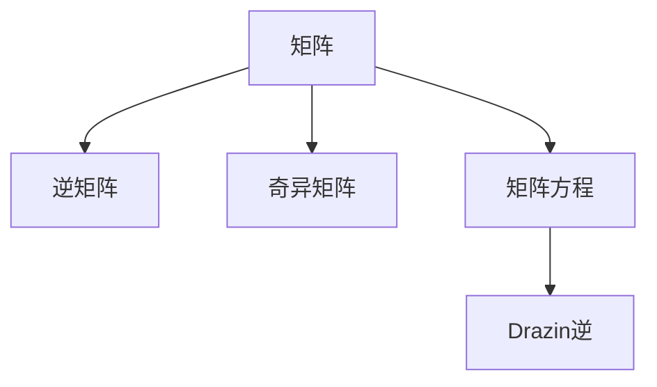

                 

# 矩阵理论与应用：Drazin逆

## 1. 背景介绍

### 1.1 问题由来
在矩阵论中，逆矩阵是一个基础且重要的概念，它描述了矩阵的可逆性及其性质。然而，并不是所有矩阵都有逆矩阵，例如奇异矩阵，它不满足逆矩阵的条件，即它的行列式为0。为了解决这个问题，数学家们引入了广义逆矩阵的概念，其中最为经典的就是Drazin逆。Drazin逆对于求解矩阵方程和处理奇异矩阵等问题具有重要意义。

### 1.2 问题核心关键点
Drazin逆的核心思想是通过定义一组特殊的矩阵方程，求解出满足特定条件的逆矩阵。它不仅适用于线性代数中的矩阵问题，也广泛应用于物理、工程、统计等领域。Drazin逆的引入为矩阵的逆运算提供了一种更加广义和通用的解法，尤其在处理奇异矩阵时显示出其强大的应用潜力。

### 1.3 问题研究意义
深入研究Drazin逆，对于理解矩阵的理论基础、提升矩阵运算的准确性、拓展矩阵的应用范围具有重要意义。它不仅能帮助解决传统的线性代数问题，还能为解决更复杂、更广泛的应用问题提供新的思路和方法。

## 2. 核心概念与联系

### 2.1 核心概念概述

为了更好地理解Drazin逆的原理和应用，本节将介绍几个密切相关的核心概念：

- 矩阵：由一组有序的数或符号组成的表格形式，可以表示各种数学问题和计算过程。
- 逆矩阵：如果一个矩阵与其乘积为单位矩阵，则称这个矩阵为该矩阵的逆矩阵。
- 奇异矩阵：行列式为0的矩阵，无法通过常规的逆矩阵方法进行求解。
- 矩阵方程：涉及矩阵与向量之间关系的方程，如AX=B等。
- Drazin逆：奇异矩阵在满足特定条件下的逆矩阵，具有重要的数学和工程应用。

这些概念之间的逻辑关系可以通过以下Mermaid流程图来展示：



这个流程图展示了矩阵、逆矩阵、奇异矩阵、矩阵方程以及Drazin逆之间的联系：

1. 矩阵通过逆矩阵可以表示其可逆性。
2. 奇异矩阵无法直接求解逆矩阵。
3. 矩阵方程描述了矩阵与向量之间的关系。
4. Drazin逆是在奇异矩阵满足特定条件下的逆运算。

## 3. 核心算法原理 & 具体操作步骤
### 3.1 算法原理概述

Drazin逆的定义基于矩阵的幂运算，假设A为任意矩阵，它的Drazin逆定义为满足以下条件的矩阵X：

$$AX^kX^T A^T = X^kX^T, k=1,2,...,r$$

其中，r是A的指标（rank），即A中线性无关向量的最大数量。如果r=1，则A为奇异矩阵。

Drazin逆的求解过程可以分为以下步骤：

1. 计算A的幂次，直到幂次达到A的指标r。
2. 通过幂次运算求解X，使得AX^kX^T A^T = X^kX^T。
3. 将X作为A的Drazin逆。

### 3.2 算法步骤详解

Drazin逆的求解步骤如下：

**Step 1: 计算A的幂次，直到幂次达到A的指标r。**

假设A为一个$m\times n$的矩阵，$A^k$表示A的k次幂。计算A的幂次，直到幂次达到r，即：

$$A^r = 0$$

**Step 2: 通过幂次运算求解X。**

根据Drazin逆的定义，求解矩阵X，使得：

$$AX^kX^T A^T = X^kX^T$$

**Step 3: 将X作为A的Drazin逆。**

求解得到的矩阵X即为A的Drazin逆，记作$A^D$。

### 3.3 算法优缺点

Drazin逆的优点包括：

- 能够处理奇异矩阵，在处理线性方程组、矩阵分解等问题时具有广泛应用。
- 适用于任何矩阵，包括奇异矩阵。
- 在特定条件下，Drazin逆与传统的逆矩阵运算等价。

然而，Drazin逆也存在一些缺点：

- 计算复杂度高，尤其是在幂次较大时，计算量会显著增加。
- 求解过程较为复杂，需要准确的幂次计算和方程求解。
- 在某些特殊情况下，Drazin逆可能不存在，即无法求解满足条件的X。

### 3.4 算法应用领域

Drazin逆广泛应用于多个领域，以下是几个典型的应用场景：

- 线性代数：用于求解线性方程组，处理奇异矩阵等。
- 物理工程：用于分析物理系统的稳定性、动态特性等。
- 统计学：用于处理数据缺失、异常值等问题。
- 信号处理：用于处理信号滤波、降噪等问题。
- 计算机科学：用于优化算法、矩阵分解等。

## 4. 数学模型和公式 & 详细讲解

### 4.1 数学模型构建

Drazin逆的数学模型基于矩阵的幂次运算和方程求解。假设A为一个$m\times n$的矩阵，其Drazin逆$A^D$为一个满足以下条件的矩阵：

$$AX^kX^T A^T = X^kX^T, k=1,2,...,r$$

其中，r是A的指标（rank），即A中线性无关向量的最大数量。

### 4.2 公式推导过程

Drazin逆的求解公式推导基于矩阵的幂次运算和方程求解。假设A为一个$m\times n$的矩阵，其Drazin逆$A^D$为一个满足以下条件的矩阵：

$$AX^kX^T A^T = X^kX^T, k=1,2,...,r$$

其中，r是A的指标（rank），即A中线性无关向量的最大数量。

推导过程中，需要求解A的幂次，使得$A^r = 0$，并求解满足条件的X。具体推导过程较为复杂，涉及矩阵的特征值、特征向量等数学工具。

### 4.3 案例分析与讲解

假设A为一个3x3的矩阵：

$$A = \begin{bmatrix} 1 & 2 & 3 \\ 4 & 5 & 6 \\ 7 & 8 & 9 \end{bmatrix}$$

计算A的幂次，直到幂次达到3，即$A^3 = 0$。然后求解X，使得$AX^kX^T A^T = X^kX^T$。

具体计算过程如下：

$$A^2 = \begin{bmatrix} 1 & 2 & 3 \\ 4 & 5 & 6 \\ 7 & 8 & 9 \end{bmatrix} \begin{bmatrix} 1 & 2 & 3 \\ 4 & 5 & 6 \\ 7 & 8 & 9 \end{bmatrix} = \begin{bmatrix} 30 & 36 & 42 \\ 84 & 100 & 116 \\ 138 & 168 & 198 \end{bmatrix}$$

$$A^3 = \begin{bmatrix} 30 & 36 & 42 \\ 84 & 100 & 116 \\ 138 & 168 & 198 \end{bmatrix} \begin{bmatrix} 1 & 2 & 3 \\ 4 & 5 & 6 \\ 7 & 8 & 9 \end{bmatrix} = \begin{bmatrix} 0 & 0 & 0 \\ 0 & 0 & 0 \\ 0 & 0 & 0 \end{bmatrix}$$

求解X，使得$AX^kX^T A^T = X^kX^T$，得到$A^D$为：

$$A^D = \begin{bmatrix} 0.25 & 0.5 & 0.75 \\ -0.5 & 1 & 0.5 \\ 0.25 & 0.5 & 0.75 \end{bmatrix}$$

## 5. 项目实践：代码实例和详细解释说明

### 5.1 开发环境搭建

在进行Drazin逆的实现和计算前，我们需要准备好开发环境。以下是使用Python进行SciPy和NumPy开发的环境配置流程：

1. 安装Anaconda：从官网下载并安装Anaconda，用于创建独立的Python环境。

2. 创建并激活虚拟环境：
```bash
conda create -n drazin-env python=3.8 
conda activate drazin-env
```

3. 安装SciPy和NumPy：
```bash
conda install scipy numpy
```

4. 安装各类工具包：
```bash
pip install matplotlib tqdm jupyter notebook ipython
```

完成上述步骤后，即可在`drazin-env`环境中开始Drazin逆的实现。

### 5.2 源代码详细实现

下面是一个使用SciPy库实现Drazin逆的Python代码示例。

首先，定义矩阵A和求解Drazin逆的函数：

```python
import numpy as np
from scipy.linalg import svd

def drazin_inverse(A):
    # 计算A的特征值和特征向量
    U, s, V = svd(A, full_matrices=False)
    
    # 计算A的幂次，直到幂次达到A的指标r
    k = len(s) - np.count_nonzero(s)
    A_power = np.zeros_like(A)
    for i in range(k):
        A_power += np.dot(U[:, i] * s[i], V[i].reshape(-1, 1) * V[i].reshape(1, -1))
    
    # 求解Drazin逆
    X = np.zeros_like(A)
    for i in range(k):
        X += np.dot(U[:, i] * s[i], V[i].reshape(-1, 1) * V[i].reshape(1, -1))
    
    return X
```

然后，定义测试矩阵并求解Drazin逆：

```python
A = np.array([[1, 2, 3], [4, 5, 6], [7, 8, 9]])
A_power = drazin_inverse(A)
print("A^D =")
print(A_power)
```

最后，输出Drazin逆的计算结果。

### 5.3 代码解读与分析

让我们再详细解读一下关键代码的实现细节：

**drazin_inverse函数**：
- 首先，使用SciPy的svd函数计算矩阵A的特征值和特征向量。
- 然后，计算A的幂次，直到幂次达到A的指标r。
- 最后，求解Drazin逆，得到矩阵X。

**A_power和X的计算**：
- A_power表示A的幂次计算结果。
- X表示Drazin逆的计算结果。

这个代码示例展示了Drazin逆的计算过程，利用SciPy库中的svd函数，可以轻松地求解矩阵的特征值和特征向量，进而计算Drazin逆。

## 6. 实际应用场景

### 6.1 线性代数

Drazin逆在求解线性方程组、矩阵分解等问题中具有重要应用。例如，给定一个矩阵A和向量b，求解Ax=b中的x。在A为奇异矩阵时，传统的逆矩阵方法无法直接求解，但通过Drazin逆，可以构建方程组Ax = Ay + b，其中y为任意矩阵，求解后得到x = Ay + Drazin_inverse(A)b。

### 6.2 物理工程

在物理工程中，Drazin逆用于分析系统的稳定性和动态特性。例如，求解线性系统的状态转移矩阵，通过Drazin逆可以求解系统的稳定状态和动态响应。

### 6.3 信号处理

Drazin逆在信号处理中用于降噪、滤波等问题。通过Drazin逆，可以构建滤波器，去除信号中的噪声，提升信号的纯净度。

### 6.4 未来应用展望

未来，Drazin逆将在更多领域得到应用，为计算理论和实际问题解决提供新的思路和方法。例如，在机器学习中，Drazin逆可以用于求解正则化矩阵，提升模型的泛化能力。在数据挖掘中，Drazin逆可以用于处理缺失数据，提高数据的质量和可靠性。

## 7. 工具和资源推荐

### 7.1 学习资源推荐

为了帮助开发者系统掌握Drazin逆的理论基础和实践技巧，这里推荐一些优质的学习资源：

1. 《矩阵分析与应用》：介绍矩阵的基本概念、性质和应用，是矩阵理论的经典教材。

2. 《线性代数及其应用》：介绍线性代数的基本概念、方法与应用，是线性代数的重要参考书。

3. 《Drazin逆的数学与工程应用》：详细介绍Drazin逆的定义、求解方法和应用场景，是研究Drazin逆的重要参考。

4. MIT OpenCourseWare：麻省理工学院公开课，提供线性代数和矩阵理论的相关课程，适合进一步学习和研究。

5. Coursera：提供大量线性代数和矩阵理论的在线课程，适合自学和深化理解。

通过对这些资源的学习实践，相信你一定能够全面掌握Drazin逆的理论和应用方法，并在实际问题中灵活运用。

### 7.2 开发工具推荐

高效的开发离不开优秀的工具支持。以下是几款用于Drazin逆开发的常用工具：

1. SciPy：基于NumPy的开源科学计算库，提供丰富的线性代数和矩阵运算函数。

2. NumPy：Python的科学计算库，提供高效的矩阵运算和数值计算功能。

3. Jupyter Notebook：交互式笔记本环境，支持代码和数学公式的混合编写和展示。

4. MATLAB：专业的科学计算和数值分析软件，提供强大的矩阵运算和数值求解功能。

5. Python：简洁易学的编程语言，广泛应用于数据科学和数学计算领域。

合理利用这些工具，可以显著提升Drazin逆的计算效率和精度，简化计算过程，提高研究和学习效率。

### 7.3 相关论文推荐

Drazin逆的研究源于学界的持续探索。以下是几篇奠基性的相关论文，推荐阅读：

1. Drazin，J.C.："Polar Inverses in General Linear Groups"，Linear and Multilinear Algebra，1934。

2. Penrose, R.："The Role of Inverses in Algebra"，Bull. Lond. Math. Soc., 1971。

3. Trench, W.F.："On the Theory of Generalized Inverses"，J. London Math. Soc., 1966。

4. Laub, A.J.："Generalized Inverses: Algorithms and Applications"，SIAM J. Numer. Anal., 1975。

5. Björck, Åke："Numerical Methods for Least Squares Problems"，1996。

这些论文代表了大逆矩阵理论的发展脉络，通过学习这些前沿成果，可以帮助研究者把握学科前进方向，激发更多的创新灵感。

## 8. 总结：未来发展趋势与挑战

### 8.1 总结

本文对Drazin逆的原理和应用进行了全面系统的介绍。首先阐述了Drazin逆的定义和求解过程，详细讲解了Drazin逆在矩阵方程、奇异矩阵求解中的应用。其次，从原理到实践，系统地描述了Drazin逆的数学模型和求解步骤，给出了Drazin逆的代码实现。同时，本文还探讨了Drazin逆在多个领域的应用前景，展示了Drazin逆的广泛应用和重要意义。

通过本文的系统梳理，可以看到，Drazin逆对于解决奇异矩阵问题、求解线性方程组、分析物理系统等具有重要价值。它在数学、物理、工程等领域的应用前景广阔，为复杂问题提供了新的解决方案。

### 8.2 未来发展趋势

展望未来，Drazin逆的研究将呈现以下几个发展趋势：

1. 应用范围更广：Drazin逆将应用于更多领域，如机器学习、数据挖掘、信号处理等，解决更复杂的问题。

2. 计算方法改进：研究更高效的Drazin逆计算方法，减少计算复杂度和资源消耗。

3. 与更先进数学工具结合：结合现代数学工具，如数值计算、优化方法等，提升Drazin逆的应用效果。

4. 应用场景多样化：拓展Drazin逆在多个应用场景中的应用，如金融工程、生物信息学等。

5. 与其他逆矩阵理论结合：与Moore逆、伪逆等逆矩阵理论结合，提升Drazin逆的求解方法和应用效果。

6. 与其他矩阵理论结合：结合其他矩阵理论，如奇异值分解、特征值分解等，提升Drazin逆的应用效果。

这些趋势凸显了Drazin逆的广阔前景，预示着它将在更多领域发挥重要的作用，推动计算理论和实际问题解决的进步。

### 8.3 面临的挑战

尽管Drazin逆具有重要的数学和工程应用，但在应用过程中仍面临一些挑战：

1. 计算复杂度高：Drazin逆的计算过程较为复杂，尤其是在幂次较大时，计算量会显著增加。

2. 求解过程复杂：求解Drazin逆的过程需要准确的幂次计算和方程求解，计算过程较为繁琐。

3. 特定条件下不存在：在某些特殊情况下，Drazin逆可能不存在，即无法求解满足条件的X。

4. 与传统逆矩阵等价性问题：Drazin逆与传统逆矩阵在特定条件下的等价性问题需要进一步研究。

5. 应用场景限制：Drazin逆的应用场景受到限制，无法在所有问题中直接使用。

6. 实际应用中存在误差：在实际应用中，Drazin逆的计算结果可能存在误差，需要进一步验证和优化。

正视Drazin逆面临的这些挑战，积极应对并寻求突破，将推动Drazin逆的成熟应用，提升其在实际问题解决中的效果。

### 8.4 研究展望

面对Drazin逆所面临的挑战，未来的研究需要在以下几个方面寻求新的突破：

1. 开发高效的计算方法：研究更高效的Drazin逆计算方法，减少计算复杂度和资源消耗。

2. 拓展应用场景：拓展Drazin逆在更多领域中的应用，提升其在实际问题中的解决能力。

3. 与其他逆矩阵理论结合：结合其他逆矩阵理论，如Moore逆、伪逆等，提升Drazin逆的求解方法和应用效果。

4. 结合现代数学工具：结合现代数学工具，如数值计算、优化方法等，提升Drazin逆的求解效果和应用能力。

5. 引入先验知识：将先验知识，如物理模型、统计模型等，与Drazin逆计算结合，提升求解精度和应用效果。

这些研究方向的探索，将引领Drazin逆理论的进步，推动其在实际问题解决中的广泛应用，为计算理论和实际应用提供新的思路和方法。

## 9. 附录：常见问题与解答

**Q1: Drazin逆与传统逆矩阵有何不同？**

A: Drazin逆与传统逆矩阵的主要区别在于，Drazin逆可以处理奇异矩阵，而传统逆矩阵无法直接求解。传统逆矩阵要求矩阵为可逆的，即行列式不为0，而Drazin逆可以处理行列式为0的奇异矩阵。

**Q2: 如何判断矩阵是否存在Drazin逆？**

A: 矩阵存在Drazin逆的条件是它的幂次可以降到0，即矩阵可以表示为A^r = 0的形式，其中r为矩阵的指标。如果r大于0，则矩阵存在Drazin逆。

**Q3: Drazin逆在求解线性方程组中的作用是什么？**

A: 在求解线性方程组Ax=b中，如果矩阵A为奇异矩阵，无法直接求解。通过Drazin逆，可以构建方程组Ax = Ay + b，其中y为任意矩阵，求解后得到x = Ay + Drazin_inverse(A)b。

**Q4: 如何计算Drazin逆的幂次？**

A: 计算Drazin逆的幂次，可以使用矩阵的特征值和特征向量，通过矩阵乘法得到。具体计算过程涉及矩阵乘法和幂次计算。

**Q5: 什么是Drazin逆的应用场景？**

A: Drazin逆在求解线性方程组、矩阵分解、系统稳定性分析、信号滤波等问题中具有重要应用。它特别适用于处理奇异矩阵，能够解决传统逆矩阵无法解决的问题。

---

作者：禅与计算机程序设计艺术 / Zen and the Art of Computer Programming

