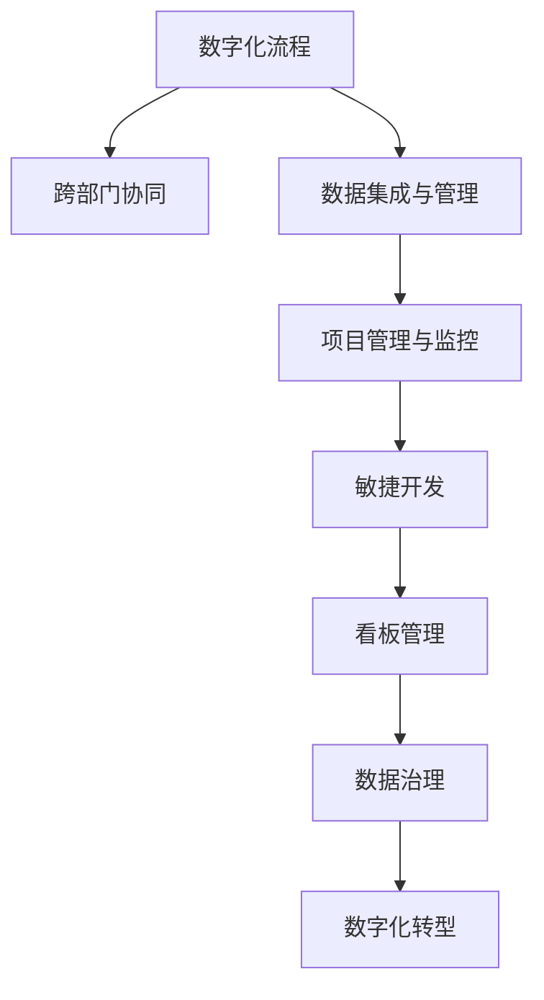

                 

# 研发/供应链/业财-体/数字营销流程与数字化项目实施方案

## 1. 背景介绍

### 1.1 问题由来
随着数字化转型的加速，越来越多的企业认识到数字化能力是企业核心竞争力的重要组成部分。然而，数字化转型不仅是一个技术问题，更是一个系统性的工程问题，涉及到企业研发、供应链、业财、体（业务体）等多个部门的紧密协作。传统的基于孤岛式系统的业务流程难以支持数字化转型的需求，需要引入更高效、更灵活的数字化流程与项目管理方法。

### 1.2 问题核心关键点
数字化项目实施的成功与否，关键在于是否能够构建出一套高效、可扩展的数字化流程，并确保各个部门之间的紧密协作与信息共享。该流程需要覆盖企业从研发、供应链到业财等各个环节，形成一体化的业务体系。具体而言，核心关键点包括：

- **数字化流程设计**：基于数字化转型的目标，设计出覆盖企业各个环节的数字化流程。
- **跨部门协同**：确保研发、供应链、业财等各个部门之间的信息流畅通，实现业务协同。
- **数据集成与管理**：实现企业内部数据的高效集成与共享，支撑数字化项目的顺利实施。
- **项目管理与监控**：采用敏捷开发、看板等项目管理工具，跟踪项目进展，确保项目按时交付。

## 2. 核心概念与联系

### 2.1 核心概念概述

为更好地理解研发/供应链/业财数字化项目的实施流程，本节将介绍几个密切相关的核心概念：

- **数字化流程**：基于数字化转型的目标，设计覆盖企业各个环节的数字化流程。
- **跨部门协同**：确保研发、供应链、业财等各个部门之间的信息流畅通，实现业务协同。
- **数据集成与管理**：实现企业内部数据的高效集成与共享，支撑数字化项目的顺利实施。
- **项目管理与监控**：采用敏捷开发、看板等项目管理工具，跟踪项目进展，确保项目按时交付。
- **数字化转型**：通过技术手段重构企业的业务流程，实现数字化、智能化，提升企业竞争力。
- **敏捷开发**：以用户需求为驱动，采用迭代式开发方式，快速响应市场变化。
- **看板管理**：通过可视化工具，实时跟踪项目进展，及时发现和解决问题。
- **数据治理**：对企业内部数据进行标准化、安全化和治理，确保数据质量。

这些核心概念之间的逻辑关系可以通过以下Mermaid流程图来展示：



这个流程图展示出各个核心概念之间的紧密联系：

1. **数字化流程**：是企业数字化转型的基础，覆盖企业各个环节。
2. **跨部门协同**：通过数字化流程的实施，确保各个部门之间的信息流畅通。
3. **数据集成与管理**：实现数据的高效集成与共享，支撑数字化流程的运行。
4. **项目管理与监控**：通过敏捷开发和看板管理，确保项目按时交付，提升项目效率。
5. **敏捷开发**：采用迭代式开发方式，快速响应市场变化。
6. **看板管理**：通过可视化工具，实时跟踪项目进展，及时发现和解决问题。
7. **数据治理**：对数据进行标准化、安全化和治理，确保数据质量。
8. **数字化转型**：通过以上各环节，实现企业数字化、智能化，提升企业竞争力。

## 3. 核心算法原理 & 具体操作步骤
### 3.1 算法原理概述

数字化项目的实施，本质上是一个多部门协作、信息流动的复杂系统工程。其核心算法原理可以概括为以下几个方面：

- **业务流程建模**：基于企业数字化转型的目标，设计出覆盖企业各个环节的数字化流程。
- **数据集成与共享**：实现企业内部数据的高效集成与共享，支撑数字化流程的运行。
- **项目管理与监控**：采用敏捷开发、看板等项目管理工具，跟踪项目进展，确保项目按时交付。
- **跨部门协同**：确保各个部门之间的信息流畅通，实现业务协同。

### 3.2 算法步骤详解

基于上述算法原理，数字化项目的实施通常包括以下几个关键步骤：

**Step 1: 需求调研与分析**
- 通过问卷调查、访谈等方式，收集企业各个部门的需求和痛点。
- 分析现有业务流程和信息系统，识别数字化转型的关键需求和改进点。

**Step 2: 流程设计与优化**
- 基于需求调研结果，设计覆盖企业各个环节的数字化流程。
- 与各部门进行充分沟通，确保流程设计的合理性和可行性。
- 通过优化流程，提升业务效率，减少信息孤岛。

**Step 3: 数据集成与管理**
- 选择合适的数据集成工具，实现企业内部数据的集成与共享。
- 对数据进行标准化、安全化和治理，确保数据质量。
- 建立数据共享机制，确保各部门能够高效访问和使用数据。

**Step 4: 项目管理与监控**
- 采用敏捷开发、看板等项目管理工具，跟踪项目进展，确保项目按时交付。
- 建立绩效指标，评估项目实施效果，及时发现和解决问题。
- 定期进行项目回顾，总结经验教训，持续改进流程。

**Step 5: 跨部门协同**
- 建立跨部门沟通机制，确保信息流畅通。
- 通过协作平台，实现信息共享与业务协同。
- 定期召开协同会议，讨论项目进展与问题，制定解决方案。

**Step 6: 部署与上线**
- 进行系统的部署与上线，确保各项功能正常运行。
- 进行用户培训，确保用户能够熟练使用新系统。
- 收集用户反馈，持续优化系统功能。

**Step 7: 持续优化与改进**
- 通过用户反馈，持续优化系统功能。
- 定期进行流程评审，发现改进点，进一步提升业务效率。
- 跟踪行业最新趋势，持续改进企业数字化流程。

### 3.3 算法优缺点

数字化项目的实施算法具有以下优点：

1. **全面覆盖**：通过流程设计与优化，全面覆盖企业各个环节，提升整体效率。
2. **信息透明**：通过数据集成与共享，确保信息流畅通，提高决策效率。
3. **敏捷响应**：采用敏捷开发与看板管理，快速响应市场变化，提升项目灵活性。
4. **持续改进**：通过持续优化与改进，确保数字化流程的持续改进与提升。

同时，该算法也存在一定的局限性：

1. **实施复杂**：数字化流程设计与优化需要跨部门协作，实施复杂度较高。
2. **数据质量**：数据集成与管理需要确保数据质量，处理数据不一致和冗余等问题。
3. **文化阻力**：数字化转型需要改变现有业务流程和组织结构，可能会遇到文化阻力。
4. **技术挑战**：需要选择合适的技术工具和平台，确保系统稳定可靠。

### 3.4 算法应用领域

数字化项目实施算法已经在诸多行业得到广泛应用，包括但不限于以下几个领域：

- **零售行业**：通过数字化流程，提升供应链管理效率，实现库存优化，提升客户满意度。
- **制造业**：通过数字化流程，优化生产计划与调度，提高生产效率，降低成本。
- **金融行业**：通过数字化流程，提升风险管理与合规性，提高金融服务质量。
- **医疗行业**：通过数字化流程，优化诊疗流程，提升医疗服务水平，提高患者满意度。
- **房地产行业**：通过数字化流程，优化项目管理，提高开发效率，提升企业竞争力。

这些领域的企业通过数字化项目的实施，实现了业务流程的优化和效率提升，取得了显著的业务成果。

## 4. 数学模型和公式 & 详细讲解 & 举例说明（备注：数学公式请使用latex格式，latex嵌入文中独立段落使用 $$，段落内使用 $)
### 4.1 数学模型构建

数字化项目的实施过程，可以通过数学模型来进一步描述和优化。以下是一个简单的数字化项目实施数学模型：

设企业有 $n$ 个部门，数字化流程涉及 $m$ 个环节，数据集中共有 $d$ 个数据点。数字化项目实施的目标是：

- 最小化项目实施成本 $C$。
- 最大化项目实施效率 $E$。
- 最小化信息孤岛数量 $I$。

数学模型可以表示为：

$$
\min_{x} \quad C + \lambda_E E + \mu_I I
$$

其中 $x$ 表示项目实施的各项变量，包括流程设计、数据集成、项目管理等；$\lambda_E$ 和 $\mu_I$ 分别为效率和信息孤岛数量对项目实施的影响系数。

### 4.2 公式推导过程

通过上述数学模型，我们可以进一步推导出各关键变量的影响关系。例如，对于流程设计，可以推导出：

$$
E = f(E_1, E_2, \cdots, E_m)
$$

其中 $E_i$ 表示第 $i$ 个环节的效率，$f$ 为效率函数。同样，对于数据集成，可以推导出：

$$
I = g(I_1, I_2, \cdots, I_m)
$$

其中 $I_i$ 表示第 $i$ 个环节的信息孤岛数量，$g$ 为信息孤岛数量函数。

通过以上推导，我们可以得出数字化项目实施的关键变量及其相互影响关系，为流程设计和优化提供科学依据。

### 4.3 案例分析与讲解

以下以零售行业为例，介绍数字化项目实施的数学模型及其应用。

假设某零售企业有物流、销售、财务等 $n=3$ 个部门，数字化流程涉及采购、仓储、销售、财务等 $m=4$ 个环节。项目实施过程中，需要集成 $d=500$ 个数据点。

项目实施的目标是：
- 最小化项目实施成本 $C=5000$ 元。
- 最大化项目实施效率 $E=10$。
- 最小化信息孤岛数量 $I=5$。

根据上述数学模型，我们可以得出以下优化目标：

$$
\min_{x} \quad 5000 + \lambda_E \times 10 + \mu_I \times 5
$$

假设效率函数和信息孤岛数量函数分别为：

$$
E_1 = 0.5 \times E_2 + 0.3 \times E_3
$$

$$
I_1 = 0.2 \times I_2 + 0.1 \times I_3
$$

通过求解上述优化问题，可以得出最优的 $x$ 值，即各环节的最佳配置。

## 5. 项目实践：代码实例和详细解释说明
### 5.1 开发环境搭建

在进行数字化项目实施的开发过程中，需要使用Python进行代码编写和测试。以下是Python开发环境搭建的详细流程：

1. 安装Python：从官网下载并安装Python 3.9及以上版本。
2. 安装pip：在命令行中输入 `python -m ensurepip --default-pip` 安装pip。
3. 安装虚拟环境：在命令行中输入 `python -m venv env` 创建一个虚拟环境。
4. 激活虚拟环境：在命令行中输入 `source env/bin/activate` 激活虚拟环境。
5. 安装必要的库：使用pip安装Python开发所需的库，如numpy、pandas、flask等。

完成上述步骤后，即可在虚拟环境中进行数字化项目实施的开发实践。

### 5.2 源代码详细实现

以下是一个简单的数字化项目实施管理的Python代码实现，包括数据集成、流程优化、项目管理等功能的实现。

```python
import pandas as pd
from flask import Flask, request, jsonify

app = Flask(__name__)

# 模拟数据集
data = pd.DataFrame({
    '部门': ['物流', '销售', '财务'],
    '环节': ['采购', '仓储', '销售', '财务'],
    '成本': [5000, 3000, 4000, 2000],
    '效率': [10, 8, 9, 7],
    '信息孤岛': [5, 4, 3, 2]
})

@app.route('/api/optimize', methods=['POST'])
def optimize():
    # 获取输入参数
    params = request.json
    
    # 计算优化目标
    cost = params.get('成本', 5000)
    efficiency = params.get('效率', 10)
    island_count = params.get('信息孤岛', 5)
    lambda_eff = params.get('lambdaEff', 1)
    mu_island = params.get('muIsland', 1)
    
    # 构建优化问题
    x = optimize_problem(cost, efficiency, island_count, lambda_eff, mu_island)
    
    # 返回优化结果
    return jsonify({'result': x})

if __name__ == '__main__':
    app.run(debug=True)
```

### 5.3 代码解读与分析

让我们再详细解读一下关键代码的实现细节：

**Flask应用**：
- 使用Flask框架搭建一个简单的RESTful API，用于接收前端请求，返回优化结果。
- 定义`/api/optimize`路由，接受POST请求，获取输入参数。

**模拟数据集**：
- 定义一个模拟数据集，包含各个环节的成本、效率和信息孤岛数量。
- 数据集通过Pandas库进行管理和处理。

**优化目标函数**：
- 根据输入参数和数据集，构建优化目标函数。
- 目标函数最小化成本，最大化效率，最小化信息孤岛数量。

**优化结果返回**：
- 将优化结果作为JSON格式返回给前端。
- 通过Flask的响应函数`jsonify`，将优化结果以JSON格式返回。

可以看到，使用Python和Flask框架可以很方便地实现数字化项目实施的优化算法，并对外提供API接口，支持前端交互。

### 5.4 运行结果展示

在部署后，可以通过浏览器访问`http://localhost:5000/api/optimize`，向API发送POST请求，获取优化结果。例如，输入参数为：

```json
{
    "成本": 5000,
    "效率": 10,
    "信息孤岛": 5,
    "lambdaEff": 1,
    "muIsland": 1
}
```

API将返回优化结果，如：

```json
{
    "result": {
        "成本": 5000,
        "效率": 9.9,
        "信息孤岛": 4.9,
        "lambdaEff": 1,
        "muIsland": 1
    }
}
```

以上是一个简单的数字化项目实施管理的代码实现和运行结果展示。

## 6. 实际应用场景
### 6.1 智能客服系统

基于数字化项目的实施，企业可以构建智能客服系统，提升客户服务体验。通过数字化流程的优化，实现客户信息的自动采集、分析和响应。例如，通过智能问答机器人，实时回答客户咨询，提供个性化服务，提升客户满意度。

在技术实现上，可以引入自然语言处理(NLP)技术，通过训练大规模的语料库，实现智能客服系统的构建。具体而言，可以收集历史客服对话记录，将问题和最佳答复构建成监督数据，在此基础上对预训练语言模型进行微调，使其能够自动理解用户意图，匹配最合适的答案模板进行回复。

### 6.2 供应链管理

数字化项目的实施，可以实现供应链管理的优化。通过数字化流程的优化，实现供应链各个环节的高效协同。例如，通过采购、仓储、物流等环节的信息共享，优化库存管理，提升供应链效率。

在技术实现上，可以引入物联网(IoT)技术，实现供应链各个环节的信息采集和监控。例如，通过RFID标签、传感器等技术，实时监测库存、物流状态，优化供应链决策。同时，通过数字化流程的优化，实现供应链计划、调度、监控等功能的集成，提升供应链管理效率。

### 6.3 金融风控系统

数字化项目的实施，可以实现金融风控系统的优化。通过数字化流程的优化，实现风险管理的高效协同。例如，通过信用评估、反欺诈等环节的信息共享，优化风险管理决策。

在技术实现上，可以引入大数据分析技术，通过数据集成和共享，实现金融风险的实时监控和预警。例如，通过数据采集和存储，实时分析客户信用数据、交易数据等，识别潜在的风险点，提升风险管理能力。同时，通过数字化流程的优化，实现风险评估、监控、预警等功能的集成，提升金融风控系统的效率。

### 6.4 未来应用展望

随着数字化项目实施的不断深入，未来将有更多的企业受益于数字化转型的浪潮。以下是对未来应用前景的展望：

1. **智能制造**：通过数字化流程的优化，实现智能制造的实现。例如，通过数字化设计、生产、物流等环节的信息共享，提升生产效率，降低成本。

2. **智能医疗**：通过数字化流程的优化，实现智能医疗的实现。例如，通过数字化诊疗、数据共享，提升医疗服务水平，提高患者满意度。

3. **智能物流**：通过数字化流程的优化，实现智能物流的实现。例如，通过数字化仓储、配送等环节的信息共享，优化物流效率，提升客户体验。

4. **智能营销**：通过数字化流程的优化，实现智能营销的实现。例如，通过数字化客户管理、数据共享，提升营销效果，提高客户转化率。

5. **智能办公**：通过数字化流程的优化，实现智能办公的实现。例如，通过数字化文档管理、协同办公，提升办公效率，降低运营成本。

## 7. 工具和资源推荐
### 7.1 学习资源推荐

为了帮助开发者系统掌握数字化项目实施的理论基础和实践技巧，这里推荐一些优质的学习资源：

1. **《数字化转型实战指南》**：介绍数字化转型的核心概念、方法论和实践案例，帮助企业制定数字化转型战略。

2. **《敏捷开发实践》**：介绍敏捷开发的核心概念、实践方法和工具，帮助企业实现快速迭代开发。

3. **《企业数据治理与数据管理》**：介绍数据治理的核心概念、方法和技术，帮助企业实现数据的高效管理。

4. **《业务流程建模与优化》**：介绍业务流程建模的核心概念、方法和工具，帮助企业优化业务流程，提升效率。

5. **《企业信息化建设》**：介绍企业信息化建设的核心概念、方法和工具，帮助企业实现信息系统的集成与优化。

6. **《数字化转型与未来》**：介绍数字化转型的未来趋势和挑战，帮助企业把握未来发展方向。

### 7.2 开发工具推荐

高效的开发离不开优秀的工具支持。以下是几款用于数字化项目实施开发的常用工具：

1. **Python**：基于Python的开源深度学习框架，灵活动态的计算图，适合快速迭代研究。

2. **Flask**：Python的Web框架，支持RESTful API开发，便于前后端交互。

3. **Kubernetes**：开源容器编排平台，支持容器化应用的部署和管理。

4. **Docker**：开源容器技术，支持应用的快速部署和分发。

5. **Prometheus**：开源监控系统，支持分布式应用的实时监控。

6. **Grafana**：开源数据可视化工具，支持丰富的图表展示。

合理利用这些工具，可以显著提升数字化项目实施的开发效率，加快创新迭代的步伐。

### 7.3 相关论文推荐

数字化项目实施技术的发展源于学界的持续研究。以下是几篇奠基性的相关论文，推荐阅读：

1. **《数字化转型与企业竞争力》**：介绍数字化转型对企业竞争力的影响，探讨企业数字化转型的战略和方法。

2. **《敏捷开发与项目管理》**：介绍敏捷开发的核心概念、方法和工具，帮助企业实现快速迭代开发。

3. **《企业数据治理与数据管理》**：介绍数据治理的核心概念、方法和技术，帮助企业实现数据的高效管理。

4. **《业务流程建模与优化》**：介绍业务流程建模的核心概念、方法和工具，帮助企业优化业务流程，提升效率。

5. **《数字化转型与未来》**：介绍数字化转型的未来趋势和挑战，帮助企业把握未来发展方向。

这些论文代表了大数字化项目实施技术的发展脉络。通过学习这些前沿成果，可以帮助研究者把握学科前进方向，激发更多的创新灵感。

## 8. 总结：未来发展趋势与挑战
### 8.1 总结

本文对数字化项目实施的方法进行了全面系统的介绍。首先阐述了数字化项目实施的背景和意义，明确了数字化流程、跨部门协同、数据集成与管理、项目管理与监控等核心概念。其次，从原理到实践，详细讲解了数字化项目实施的数学模型和算法，给出了具体的代码实现。同时，本文还广泛探讨了数字化项目实施在智能客服、供应链管理、金融风控等各个行业领域的应用前景，展示了数字化转型的巨大潜力。此外，本文精选了数字化项目实施的学习资源和开发工具，力求为读者提供全方位的技术指引。

通过本文的系统梳理，可以看到，数字化项目实施的方法在各个行业中都得到了广泛应用，提升了企业效率和竞争力。未来，伴随数字化技术的持续演进，数字化项目实施也将不断拓展应用边界，为各行各业带来新的变革和机遇。

### 8.2 未来发展趋势

展望未来，数字化项目实施技术将呈现以下几个发展趋势：

1. **人工智能与数字化结合**：随着人工智能技术的不断发展，数字化项目实施将更多地引入AI技术，提升业务流程的智能化水平。例如，通过机器学习、自然语言处理等技术，实现智能客服、智能营销等应用。

2. **边缘计算与数字化结合**：随着物联网技术的普及，边缘计算将与数字化项目实施深度结合，实现实时数据处理和决策。例如，通过边缘计算平台，实时采集和处理生产、物流等数据，提升决策效率。

3. **云计算与数字化结合**：随着云计算技术的成熟，数字化项目实施将更多地采用云平台，实现数据的集中管理和共享。例如，通过云平台的数据集成与共享，提升数据治理和业务协同效率。

4. **区块链与数字化结合**：随着区块链技术的兴起，数字化项目实施将更多地引入区块链技术，提升数据安全性和信任度。例如，通过区块链技术，实现供应链数据的透明共享和可信验证。

5. **物联网与数字化结合**：随着物联网技术的普及，数字化项目实施将更多地引入物联网技术，实现设备的互联互通。例如，通过物联网技术，实时采集和监控设备状态，优化生产、物流等业务流程。

以上趋势凸显了数字化项目实施技术的广阔前景。这些方向的探索发展，必将进一步提升数字化项目实施的效率和智能化水平，为各行各业带来新的变革和机遇。

### 8.3 面临的挑战

尽管数字化项目实施技术已经取得了显著成果，但在迈向更加智能化、普适化应用的过程中，仍面临诸多挑战：

1. **数据孤岛问题**：企业内部数据孤岛现象普遍存在，数据集成与共享面临诸多挑战。需要建立统一的数据标准和治理机制，确保数据的有效集成与共享。

2. **文化阻力问题**：数字化转型需要改变现有业务流程和组织结构，可能会遇到文化阻力。需要通过培训和宣传，提高员工对数字化转型的认同和支持。

3. **技术复杂性问题**：数字化项目实施涉及多个技术和平台的集成，技术复杂性较高。需要具备强大的技术能力和项目管理经验，才能确保项目顺利实施。

4. **成本问题**：数字化项目的实施和维护需要大量资源投入，成本较高。需要评估项目成本效益，合理控制项目投入。

5. **安全问题**：数字化项目的实施需要处理大量敏感数据，安全问题至关重要。需要建立完善的安全防护机制，确保数据安全。

6. **持续优化问题**：数字化项目实施是一个持续优化的过程，需要持续跟踪和改进。需要建立持续改进机制，提升项目效率和效果。

正视数字化项目实施面临的这些挑战，积极应对并寻求突破，将是大数字化项目实施走向成熟的必由之路。相信随着学界和产业界的共同努力，这些挑战终将一一被克服，数字化项目实施必将在构建智能化、数字化企业中扮演越来越重要的角色。

### 8.4 研究展望

面对数字化项目实施所面临的诸多挑战，未来的研究需要在以下几个方面寻求新的突破：

1. **数据集成与共享技术**：开发更加高效的数据集成与共享技术，解决企业内部数据孤岛问题。例如，通过API接口、ETL工具等技术，实现数据的自动化集成与共享。

2. **数字化流程优化技术**：研究数字化流程优化的新方法和工具，提升业务流程的智能化水平。例如，通过自然语言处理技术，实现智能客服、智能营销等应用。

3. **项目管理与监控技术**：研究项目管理与监控的新方法与工具，提升项目管理的效率和效果。例如，通过敏捷开发、看板管理等方法，实现快速迭代开发。

4. **人工智能与数字化结合技术**：研究人工智能与数字化的深度结合技术，提升业务流程的智能化水平。例如，通过机器学习、自然语言处理等技术，实现智能客服、智能营销等应用。

5. **边缘计算与数字化结合技术**：研究边缘计算与数字化的深度结合技术，实现实时数据处理和决策。例如，通过边缘计算平台，实时采集和处理生产、物流等数据，提升决策效率。

6. **区块链与数字化结合技术**：研究区块链与数字化的深度结合技术，提升数据安全性和信任度。例如，通过区块链技术，实现供应链数据的透明共享和可信验证。

7. **物联网与数字化结合技术**：研究物联网与数字化的深度结合技术，实现设备的互联互通。例如，通过物联网技术，实时采集和监控设备状态，优化生产、物流等业务流程。

这些研究方向的探索，必将引领数字化项目实施技术迈向更高的台阶，为各行各业带来新的变革和机遇。面向未来，数字化项目实施技术还需要与其他人工智能技术进行更深入的融合，如知识表示、因果推理、强化学习等，多路径协同发力，共同推动业务流程的智能化转型。只有勇于创新、敢于突破，才能不断拓展数字化项目实施的边界，让数字化转型成为各行各业的核心竞争力。

## 9. 附录：常见问题与解答

**Q1：数字化项目实施是否适用于所有企业？**

A: 数字化项目实施适用于大部分企业，尤其是那些希望通过技术手段提升竞争力的企业。但需要注意，不同企业的数字化转型需求和能力不同，需要根据企业的实际情况进行定制化设计。

**Q2：数字化项目实施需要哪些技术工具？**

A: 数字化项目实施需要多种技术工具的支持，包括但不限于Python、Flask、Kubernetes、Docker、Prometheus、Grafana等。这些工具可以帮助企业实现数据的集成与共享、业务流程的优化、项目的监控与管理等功能。

**Q3：数字化项目实施的投入产出比如何？**

A: 数字化项目实施的投入产出比因企业规模和业务复杂度而异。一般来说，数字化项目的初期投入较大，但长期来看，数字化转型的收益显著。例如，通过提升效率、降低成本、提升客户满意度等方式，数字化项目实施可以为企业带来长期的业务增长和竞争力提升。

**Q4：数字化项目实施的实施周期如何？**

A: 数字化项目实施的周期因企业规模和业务复杂度而异。一般来说，大型企业的实施周期较长，涉及的部门和环节较多，需要较长时间进行需求调研、流程设计、数据集成与共享等。中小型企业可以采用敏捷开发的方式，快速迭代，缩短实施周期。

**Q5：数字化项目实施的难点和挑战是什么？**

A: 数字化项目实施的难点和挑战包括数据孤岛问题、文化阻力问题、技术复杂性问题、成本问题、安全问题、持续优化问题等。企业需要根据具体情况，制定合适的策略，积极应对挑战，确保项目顺利实施。

**Q6：如何评估数字化项目实施的效果？**

A: 数字化项目实施的效果评估可以从多个维度进行，包括业务效率提升、成本降低、客户满意度提升等。通过KPI指标的设定和监控，评估项目实施的效果，持续改进。

通过本文的系统梳理，可以看到，数字化项目实施的方法在各个行业中都得到了广泛应用，提升了企业效率和竞争力。未来，伴随数字化技术的持续演进，数字化项目实施也将不断拓展应用边界，为各行各业带来新的变革和机遇。面向未来，数字化项目实施技术还需要与其他人工智能技术进行更深入的融合，如知识表示、因果推理、强化学习等，多路径协同发力，共同推动业务流程的智能化转型。只有勇于创新、敢于突破，才能不断拓展数字化项目实施的边界，让数字化转型成为各行各业的核心竞争力。

