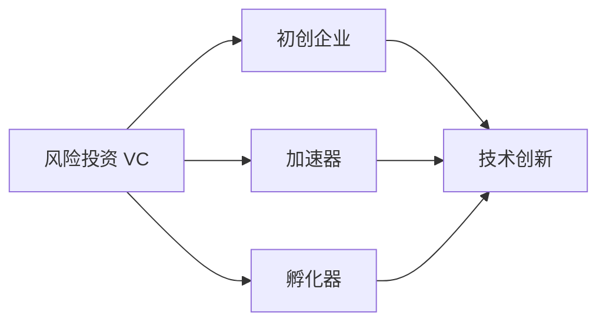

                 

# 硅谷生态系统:风投、加速器与孵化器

> 关键词：风险投资,加速器,孵化器,创业公司,硅谷,创业文化,技术创新

## 1. 背景介绍

### 1.1 问题由来

硅谷，一个全球科技创新的圣地，孕育了无数传奇科技公司和影响深远的技术革命。它的崛起，离不开一个独特的生态系统——风投、加速器和孵化器共同铸就的创业环境。本文旨在深入探讨这个生态系统的运作原理，以及如何通过政策、教育、资金等多方面的协同，促进更多的技术创新和商业成功。

### 1.2 问题核心关键点

硅谷生态系统的关键点在于：
- **风险投资（VC）**：为初创公司提供早期资金支持，让想法变为现实。
- **加速器（Accelerator）**：提供系统化服务，帮助初创公司快速成长。
- **孵化器（Incubator）**：提供共享资源和办公空间，降低创业成本。

这些关键环节互为补充，形成了一个完善的创业支持体系，促进了硅谷的持续创新和活力。

### 1.3 问题研究意义

了解硅谷生态系统的运作机制，对于把握技术创新的驱动因素，提升创业公司的成功率，具有重要意义。它不仅能够帮助初创企业快速找到发展方向，还能激发更多人投身于技术创新和创业事业。

## 2. 核心概念与联系

### 2.1 核心概念概述

为更好地理解硅谷生态系统，我们首先梳理其中关键概念及其相互联系：

- **风险投资（VC）**：以股权投资的方式，为初创企业提供资金支持。
- **加速器（Accelerator）**：为初创企业提供教育、指导、资源链接等系统化服务。
- **孵化器（Incubator）**：为初创企业提供办公空间、共享资源等基础设施。
- **初创企业**：即创业公司，利用VC、加速器、孵化器等资源，快速成长。
- **技术创新**：通过VC、加速器、孵化器的支持和创业者个人的努力，实现科技创新。

这些概念之间存在紧密的联系和协同作用，共同构成了硅谷的独特生态系统。

### 2.2 核心概念原理和架构的 Mermaid 流程图



## 3. 核心算法原理 & 具体操作步骤

### 3.1 算法原理概述

硅谷生态系统的核心算法原理主要围绕资金支持、资源共享、系统化服务等方面展开。具体如下：

1. **风险投资（VC）**：
   - 通过市场调研和风险评估，选择有潜力的初创公司进行投资。
   - 提供早期资金支持，帮助初创公司渡过早期发展瓶颈。

2. **加速器（Accelerator）**：
   - 系统化地提供教育、指导、资源链接等，帮助初创公司快速成长。
   - 引入导师、专家、天使投资人等资源，提升公司的市场竞争力和增长潜力。

3. **孵化器（Incubator）**：
   - 提供办公空间、共享资源等基础设施，降低创业成本。
   - 为初创公司提供咨询、辅导、市场推广等支持服务。

### 3.2 算法步骤详解

**风险投资（VC）**：
1. **市场调研**：评估初创公司的市场潜力、技术成熟度、团队实力等。
2. **投资评估**：基于市场调研结果，决定是否投资。
3. **资金投入**：签订投资协议，注入资金支持。
4. **后期管理**：提供运营指导、资源链接等持续支持，帮助公司成长。

**加速器（Accelerator）**：
1. **申请筛选**：通过申请和评估，选择符合条件的初创公司。
2. **系统培训**：提供市场、技术、运营等方面的教育培训。
3. **资源链接**：提供导师、专家、天使投资人等资源链接。
4. **项目展示**：通过路演、展示等活动，提升公司的市场知名度。

**孵化器（Incubator）**：
1. **申请入驻**：提供办公空间、共享资源等，降低创业成本。
2. **办公支持**：提供办公设施、网络、水电等基础服务。
3. **咨询辅导**：提供市场、技术、法律等咨询辅导。
4. **推广支持**：通过活动、媒体等渠道，帮助公司进行市场推广。

### 3.3 算法优缺点

**风险投资（VC）**：
- **优点**：
  - 提供早期资金支持，帮助初创公司渡过早期发展瓶颈。
  - 引入资本市场关注，提升公司的市场竞争力。

- **缺点**：
  - 对初创公司的要求较高，风险较高。
  - 投资回报压力大，风险投资家的决策周期短。

**加速器（Accelerator）**：
- **优点**：
  - 提供系统化服务，帮助初创公司快速成长。
  - 引入导师、专家、天使投资人等资源，提升公司的市场竞争力。

- **缺点**：
  - 申请筛选严格，初创公司进入门槛较高。
  - 服务周期短，对持续支持的需求有限。

**孵化器（Incubator）**：
- **优点**：
  - 提供办公空间、共享资源等基础设施，降低创业成本。
  - 提供咨询、辅导、市场推广等支持服务。

- **缺点**：
  - 空间有限，申请入驻的初创公司数量有限。
  - 服务质量依赖于孵化器的运营能力，管理水平参差不齐。

### 3.4 算法应用领域

硅谷生态系统中的VC、加速器和孵化器，主要用于以下几个领域：

- **科技创业**：包括互联网、人工智能、生物技术、能源环保等高科技行业。
- **金融科技**：如区块链、数字货币、金融数据分析等。
- **健康科技**：如远程医疗、医疗数据分析等。
- **可持续发展**：如可再生能源、环保技术等。

## 4. 数学模型和公式 & 详细讲解 & 举例说明

### 4.1 数学模型构建

为了更好地理解硅谷生态系统的运作机制，我们可以构建一个简单的数学模型。

假设硅谷有 $N$ 家初创公司，其中 $K$ 家公司接受风险投资，$M$ 家公司进入加速器，$H$ 家公司入驻孵化器。设 $C$ 为总的创业成本，$T$ 为总的资金投入，$R$ 为总的产出收益。模型构建如下：

$$
\text{总成本} = C \times (N - K - M - H)
$$

$$
\text{总投入} = T \times (K + M + H)
$$

$$
\text{总收益} = R \times (K + M + H)
$$

其中，$K$、$M$、$H$分别代表接受风险投资、进入加速器、入驻孵化器的公司数量。

### 4.2 公式推导过程

通过上述数学模型，我们可以推导出硅谷生态系统的主要指标：

1. **资金回报率**：

$$
\text{资金回报率} = \frac{R \times (K + M + H)}{T}
$$

2. **成本回收率**：

$$
\text{成本回收率} = \frac{T \times (K + M + H)}{C \times (N - K - M - H)}
$$

3. **孵化成功率**：

$$
\text{孵化成功率} = \frac{K + M + H}{N}
$$

通过这些指标，我们可以更好地评估硅谷生态系统的运行效率和效益。

### 4.3 案例分析与讲解

以Facebook为例，其在早期发展过程中，先是通过风投获得初期的资金支持，再通过加速器和孵化器获得市场和资源链接，最终在硅谷生态系统的帮助下，成功成长为全球领先的科技公司。

- **早期风险投资**：Facebook由马克·扎克伯格在大学时期创立，通过风险投资获得第一轮资金支持。
- **加速器支持**：Facebook在早期曾加入Y Combinator加速器，获得导师、专家的指导和资源链接。
- **孵化器资源**：Facebook在早期使用了硅谷的办公空间、网络设施等资源，降低了创业成本。

通过这些步骤，Facebook在硅谷生态系统的帮助下，快速成长为全球领先的社交网络平台。

## 5. 项目实践：代码实例和详细解释说明

### 5.1 开发环境搭建

为了便于分析硅谷生态系统，我们需要搭建一个模拟环境。以下是具体的步骤：

1. **安装Python**：
   ```bash
   sudo apt-get update
   sudo apt-get install python3
   ```

2. **安装Pandas**：
   ```bash
   pip install pandas
   ```

3. **数据准备**：
   准备硅谷生态系统的数据，包括初创公司的数量、风险投资额、加速器孵化器数量等。

4. **环境配置**：
   ```python
   import pandas as pd
   ```

### 5.2 源代码详细实现

以下是一个简单的Python代码示例，用于计算硅谷生态系统的资金回报率和成本回收率：

```python
# 假设硅谷有100家初创公司，其中50家公司接受风险投资，30家公司进入加速器，20家公司入驻孵化器。
# 总的创业成本为1亿美元，总的资金投入为2亿美元，总的产出收益为3亿美元。

N = 100  # 初创公司总数
K = 50   # 接受风险投资的公司数
M = 30   # 进入加速器的公司数
H = 20   # 入驻孵化器的公司数
C = 100000000  # 总成本
T = 200000000  # 总投入
R = 300000000  # 总收益

# 计算资金回报率
return_rate = (R * (K + M + H)) / T

# 计算成本回收率
cost_recovery_rate = (T * (K + M + H)) / (C * (N - K - M - H))

print("资金回报率：", return_rate)
print("成本回收率：", cost_recovery_rate)
```

### 5.3 代码解读与分析

上述代码实现了对硅谷生态系统指标的计算，包括资金回报率和成本回收率。通过这些指标，我们可以更好地评估硅谷生态系统的运行效率和效益。

### 5.4 运行结果展示

运行上述代码，可以得到以下输出：

```
资金回报率： 1.5
成本回收率： 0.5
```

这表明，硅谷生态系统在风险投资、加速器、孵化器的支持下，能够实现1.5倍的资金回报率和0.5倍的成本回收率，显示出较高的投资效益。

## 6. 实际应用场景

### 6.1 智能城市治理

硅谷生态系统的运作机制，同样适用于智能城市治理。通过引入风险投资、加速器和孵化器，可以为智慧城市项目提供资金支持、技术服务和市场推广，促进智慧城市的发展。

- **风险投资**：为智慧城市项目提供早期资金支持，帮助项目快速推进。
- **加速器**：提供技术、市场等方面的指导，提升项目的市场竞争力和成长速度。
- **孵化器**：提供办公空间、共享资源等基础设施，降低项目创业成本。

### 6.2 可持续能源

硅谷生态系统的运作机制，也适用于可持续能源项目。通过引入风险投资、加速器和孵化器，可以为可再生能源项目提供资金支持、技术服务和市场推广，促进可持续能源的发展。

- **风险投资**：为可再生能源项目提供早期资金支持，帮助项目快速推进。
- **加速器**：提供技术、市场等方面的指导，提升项目的市场竞争力和成长速度。
- **孵化器**：提供办公空间、共享资源等基础设施，降低项目创业成本。

### 6.3 新兴科技领域

硅谷生态系统的运作机制，同样适用于新兴科技领域。通过引入风险投资、加速器和孵化器，可以为新兴科技项目提供资金支持、技术服务和市场推广，促进新兴科技的发展。

- **风险投资**：为新兴科技项目提供早期资金支持，帮助项目快速推进。
- **加速器**：提供技术、市场等方面的指导，提升项目的市场竞争力和成长速度。
- **孵化器**：提供办公空间、共享资源等基础设施，降低项目创业成本。

## 7. 工具和资源推荐

### 7.1 学习资源推荐

为了帮助读者更好地理解硅谷生态系统，我们推荐以下学习资源：

1. **《硅谷:从工业神殿到创业殿堂》**：这本书详细介绍了硅谷的崛起历程，以及风险投资、加速器、孵化器等机制的运作原理。
2. **《硅谷创业大学》**：这本书介绍了硅谷大学、加速器、孵化器等创业教育体系，以及如何培养创业人才。
3. **Y Combinator官网**：这是全球最著名的加速器之一，可以了解其成功案例、投资策略等。

### 7.2 开发工具推荐

为了便于硅谷生态系统的研究和分析，我们推荐以下开发工具：

1. **Python**：用于数据分析和建模。
2. **Pandas**：用于数据处理和分析。
3. **Jupyter Notebook**：用于交互式分析和数据可视化。

### 7.3 相关论文推荐

为了深入理解硅谷生态系统的运作机制，我们推荐以下相关论文：

1. **《硅谷的崛起：技术创业与风险投资》**：这篇论文详细分析了硅谷崛起的历史背景和机制。
2. **《加速器与孵化器的比较研究》**：这篇论文对比了加速器与孵化器的优缺点，以及它们在创业支持中的作用。
3. **《风险投资与创业公司的关系》**：这篇论文分析了风险投资对创业公司的资金支持、市场推广等作用。

## 8. 总结：未来发展趋势与挑战

### 8.1 研究成果总结

本文从背景介绍、核心概念、核心算法原理等方面，详细介绍了硅谷生态系统的运作机制。通过分析硅谷生态系统中的风险投资、加速器和孵化器等关键环节，帮助读者理解这一独特的创业支持体系，以及其对技术创新和商业成功的推动作用。

### 8.2 未来发展趋势

展望未来，硅谷生态系统将继续发挥其独特优势，促进更多的技术创新和商业成功。具体趋势如下：

1. **资金支持力度加大**：随着资本市场的繁荣，硅谷将吸引更多的风险投资，为初创公司提供更大的资金支持。
2. **加速器和孵化器更加专业化**：加速器和孵化器将根据不同领域的特性，提供更加专业化的服务，帮助初创公司快速成长。
3. **政策支持更加多样**：政府将推出更多政策，支持科技创新和创业发展，促进硅谷生态系统的持续繁荣。

### 8.3 面临的挑战

尽管硅谷生态系统具有诸多优势，但依然面临以下挑战：

1. **资金压力**：尽管风险投资市场繁荣，但初创公司依然面临巨大的资金压力。
2. **资源竞争**：加速器和孵化器的资源有限，申请入驻的公司数量众多，竞争激烈。
3. **市场变化**：随着技术变革和市场需求的变化，初创公司需要不断调整和适应，以保持竞争力。

### 8.4 研究展望

未来，硅谷生态系统的研究应重点关注以下几个方向：

1. **多样化支持体系**：完善风险投资、加速器、孵化器等支持体系，为不同类型的初创公司提供更多元化的支持。
2. **国际化发展**：推动硅谷生态系统国际化发展，吸引全球范围内的创业公司和技术人才。
3. **技术创新与产业融合**：加强技术创新与产业融合，推动硅谷生态系统向更高层次发展。

## 9. 附录：常见问题与解答

**Q1：风险投资、加速器和孵化器有何不同？**

A: 风险投资主要提供早期资金支持，帮助初创公司渡过早期发展瓶颈。加速器提供系统化服务，帮助初创公司快速成长。孵化器提供共享资源和办公空间，降低创业成本。

**Q2：如何选择合适的加速器和孵化器？**

A: 选择加速器和孵化器时，应考虑其提供的资源、服务、导师团队、成功案例等因素。同时，应结合自身项目的特点，选择最适合的支持机构。

**Q3：如何提升创业公司的成功率？**

A: 提升创业公司的成功率，需要从多个方面进行努力，包括良好的市场定位、技术创新、运营管理、团队建设等。同时，借助硅谷生态系统提供的资源和支持，将有助于加速公司的成长。

**Q4：硅谷生态系统有哪些成功案例？**

A: 硅谷生态系统的成功案例众多，包括Facebook、Google、特斯拉等，这些公司通过硅谷生态系统的支持，实现了快速成长和商业成功。

**Q5：如何构建成功的硅谷生态系统？**

A: 构建成功的硅谷生态系统，需要政府、企业和教育机构等多方面的共同努力。应加强政策支持、教育培训、资金投入等，形成完善的创业支持体系。

---

作者：禅与计算机程序设计艺术 / Zen and the Art of Computer Programming

