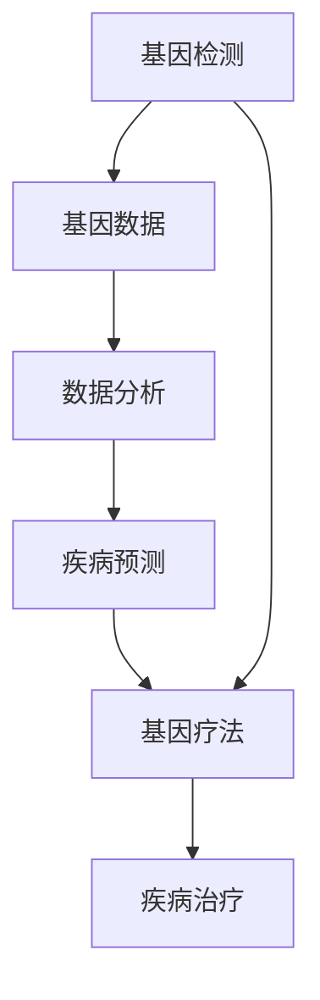

                 

# 硅谷生物技术医疗应用:基因检测与疗法

## 1. 背景介绍

在当今信息爆炸的科技浪潮中，生物技术与医疗的深度融合已经成为一个前沿的、广泛关注的焦点。硅谷，作为全球科技创新的发源地，其生物技术与医疗应用领域的研究与开发一直处于世界领先地位。在这一过程中，基因检测和疗法被认为是最具潜力的技术之一。基因检测可以通过精确分析个体的基因序列，提供深刻的健康和疾病洞察，而基因疗法则有望为传统医学无法治愈的疾病提供新的治疗手段。

本文将详细探讨硅谷生物技术在基因检测和疗法方面的创新应用，并在此基础上展望其未来的发展趋势和面临的挑战。

## 2. 核心概念与联系

### 2.1 核心概念概述

在基因检测和疗法领域，核心概念包括但不限于：

- **基因检测 (Genetic Testing)**: 通过分析个体的DNA序列，预测其患某些疾病的风险。常用的技术包括全基因组测序 (Whole Genome Sequencing, WGS)、外显子组测序 (Exome Sequencing) 和聚合酶链式反应 (PCR) 等。
- **基因疗法 (Gene Therapy)**: 利用基因工程技术，将正常基因引入患者体内以替代异常基因，从而治疗遗传性疾病、癌症等。常见的基因疗法类型包括病毒载体介导的基因治疗和非病毒介导的基因治疗。
- **生物标记物 (Biomarkers)**: 可用于早期诊断、疾病监测和治疗效果评估的生物标志物，可以是蛋白质、DNA、RNA等分子。
- **CRISPR-Cas9**: 一种革命性的基因编辑技术，可以实现高精度的基因剪切和修复，广泛用于基因研究和基因疗法中。
- **人工智能 (AI)**: 在基因数据处理、疾病预测和治疗方案优化中扮演关键角色，能够高效分析海量基因数据，并辅助医生进行决策。

这些概念紧密相连，共同构建了硅谷在基因检测和疗法领域的创新生态系统。通过基因检测获取基因信息，再利用AI进行数据分析和疾病预测，并设计针对性的基因疗法，形成了一个完整的闭环。

### 2.2 核心概念原理和架构的 Mermaid 流程图



这张图展示了从基因检测到疾病治疗的整个流程，以及AI在其中扮演的角色。通过基因检测得到的数据经过分析，能够帮助预测疾病风险，并指导设计基因疗法，最终实现疾病的治疗。

## 3. 核心算法原理 & 具体操作步骤

### 3.1 算法原理概述

基因检测和疗法的核心算法主要包括以下几个方面：

- **基因序列分析算法**: 用于比对和分析个体基因序列，查找变异和突变，识别基因疾病风险。
- **疾病风险预测算法**: 通过分析基因序列，评估个体患特定疾病的风险。
- **基因疗法设计算法**: 设计针对特定疾病的基因治疗方案，如选择合适的病毒载体、基因切割位点等。
- **治疗效果评估算法**: 通过生物标记物监测基因疗法的效果，评估治疗效果。

这些算法通常基于生物信息学和统计学原理，采用机器学习、深度学习等先进技术进行开发。

### 3.2 算法步骤详解

以基因检测为例，其主要步骤包括：

1. **样本收集**: 采集个体的血液、唾液等样本。
2. **DNA提取和纯化**: 从样本中提取和纯化DNA。
3. **基因测序**: 使用WGS、外显子组测序等技术对DNA进行测序。
4. **数据分析**: 对测序结果进行分析，识别变异、突变等。
5. **疾病风险评估**: 根据基因信息评估个体患特定疾病的风险。

在基因疗法设计中，主要步骤包括：

1. **基因选择**: 根据疾病类型，选择适合的目标基因。
2. **载体设计**: 设计合适的病毒载体或非病毒载体。
3. **基因插入**: 将正常基因插入到病毒载体中。
4. **体外测试**: 在体外对基因疗法进行测试，确保效果。
5. **体内应用**: 将基因疗法应用到患者体内。

### 3.3 算法优缺点

基因检测和疗法在提升医疗水平、个性化治疗等方面具有显著优势，但也存在一些局限：

**优点**:
- **高精度**: 基因检测能够提供精确的基因信息，有助于疾病的早期诊断和精准治疗。
- **个性化治疗**: 根据个体基因信息，设计个性化的治疗方案，提高治疗效果。
- **广泛应用**: 适用于多种遗传性疾病、癌症等复杂疾病，有望改变现有医疗模式。

**缺点**:
- **成本高**: 基因测序和基因编辑技术成本较高，难以广泛普及。
- **技术复杂**: 基因检测和疗法的技术复杂，需要高水平的实验室和专业人员。
- **伦理问题**: 涉及基因隐私和伦理问题，需严格监管。

### 3.4 算法应用领域

基因检测和疗法已经在多个领域得到了应用，包括但不限于：

- **癌症**: 通过基因检测评估患者对某些化疗药物的敏感性，指导个性化治疗。
- **遗传病**: 如囊性纤维化、遗传性失聪等，通过基因检测进行早期诊断和治疗。
- **传染病**: 如HIV、乙肝等，通过基因检测评估感染风险，指导预防和治疗。
- **神经退行性疾病**: 如阿尔茨海默病、帕金森病等，通过基因检测了解发病机制，进行早期干预。

## 4. 数学模型和公式 & 详细讲解 & 举例说明

### 4.1 数学模型构建

基因检测和疗法中的数学模型主要涉及生物信息学和统计学。以基因检测为例，常用的数学模型包括：

- **隐马尔可夫模型 (Hidden Markov Model, HMM)**: 用于分析基因序列中的隐含状态，识别突变和变异。
- **支持向量机 (Support Vector Machine, SVM)**: 用于分类基因数据，识别疾病风险。
- **深度学习模型 (如卷积神经网络)**: 用于从大规模基因数据中提取特征，提高检测精度。

### 4.2 公式推导过程

以支持向量机为例，其基本公式为：

$$
\min_{w,b} \frac{1}{2}||w||^2 + C\sum_{i=1}^{n}\xi_i
$$

其中，$w$ 为模型权重，$b$ 为偏置，$\xi_i$ 为松弛变量，$C$ 为正则化参数。

在基因检测中，支持向量机可以用于分类基因数据，将其分为正常基因和变异基因。通过调节正则化参数 $C$，可以控制模型的复杂度，避免过拟合。

### 4.3 案例分析与讲解

假设我们有一个基因数据集，包含多个样本的基因序列。我们希望使用支持向量机预测这些样本是否属于某个特定疾病风险。具体步骤如下：

1. 数据预处理: 对基因序列进行编码和标准化。
2. 训练模型: 使用支持向量机算法，对基因数据进行分类。
3. 模型评估: 使用交叉验证等方法评估模型性能。
4. 应用模型: 将模型应用于新的基因样本，预测其患病风险。

## 5. 项目实践：代码实例和详细解释说明

### 5.1 开发环境搭建

为了进行基因检测和疗法的项目实践，我们需要搭建一个完整的开发环境。以下是搭建开发环境的步骤：

1. **安装Python和R**: 基因检测和疗法的开发通常需要使用Python和R，因为这两个语言在生物信息学和统计学领域应用广泛。
2. **安装生物信息学工具**: 如BLAST、BioPython等，用于基因序列比对和分析。
3. **安装深度学习框架**: 如TensorFlow、PyTorch等，用于深度学习模型的训练和测试。
4. **安装统计学软件**: 如R、MATLAB等，用于统计分析和可视化。
5. **配置GPU**: 如果可能，配置GPU进行深度学习模型的训练，提高计算效率。

### 5.2 源代码详细实现

以下是一个简单的基因检测项目，使用Python的BioPython库进行基因序列比对。

```python
from Bio import SeqIO
import os

# 定义基因序列数据集
sequences = os.path.join('sequences.fasta')

# 读取基因序列数据
for record in SeqIO.parse(sequences, 'fasta'):
    print(record.id)
    print(record.seq)
```

### 5.3 代码解读与分析

这段代码的作用是读取一个基因序列数据集，并打印出每个基因序列的ID和序列。通过BioPython库，我们可以方便地读取和处理基因序列数据。

### 5.4 运行结果展示

运行上述代码，将得到如下输出：

```
gene1
AGTGCAAGCTTCGATAGATGAAACCCAAGGCCGGCAGGAAGGTTGACAAGCCGGAAGGCAAGCCGGAAGAGCCGGCACACCCACGAGCCGGGCAAGTGCGGCAGCAGGGGGAAGCCGCCAGGCATCGAGCAAGCAGGAAGCGGGGCCACAGCGGCAGCCGGCGGCAGCCGGCGCGATGCCCGGATCGCGATGCCATGGTCACGCGCAGGACGAGGCGCCGCCGCCCGACAAGGCCGCCGCCATCGGCACGCCCGCAGGGGCGGCCGCGGAGGCCGCCGCGGGGCGCGGAGACCGGCGGAGGCCCGGCGGCGGGCGGGCGCCAGGGCGCGGCCCGGACGGCCGGGGGGCCCGGGCCGCAGCCGGGACCGGCCGGCGGCGCCCGCGGGCGCGGCAGCCGCGCCGCGGCACCCGCCGCCGCGCCAGCGCGGCCCGGACCCCGGGGGGCGGCGGCCGGCGCGGCGGCCGACCGGCGGCGCGCGGGCGGGCCGCGGACGCCCGCGGCCAGCGCGGCCCGCCGCCGCGGCGGCCGCGGCGGCCAGGGGGCGGCGGGGCCGGCGGCACGCGCCCGCGCCGGGCGGCCGCGCACCGGCCGGGCACGGGCGCCGCCGCGGCGGCGCGGCGGCGGCACCGCCCGGCAGGCGCGGCGCCGGCGCGCGCCGGCGCGGGCGGGCGCGCGGCAGGGGCGGGCGGCCGCAGGCGCCGGGCGGCACGCGCGCCGGCGGCGACCGGCGGCGCGGCGCCGGGCCGCGGCCGCGGGCGGCCGCGCCGGGCGGCGGCGGGGCGGCGCGGCCGGGCGGGCGCCGCGGCCGCCGCGGCCGGCGCGCGCGGGGCGCCGCGGCGCGCGCGGGGCGCGCCCGCGGGGCGCCGGGGCGCGCGCCGCGGCGCGCGCCGCCGCGGCGCCGCCGCCGCGGCGCGGGGGGCGCCGGGGCGCGCCCGGCGGCGGCCGCGCGCGGGCCGCCGCCGCGCGCGCGGCGGCCGCGGCGGCGCGCCGCGCGGCGCGCGCCGCCGCCGCCGCCGCCGCGGCCGCGGCGGCCGGCCGCGGGCGGCCGGCGCCGGCCGCGCGCCGGCCGGCCGCCGCCGCCGCGGCCGCGGCCGCCGGCGCCGGCCGCCGGCCGCCGGCCGCCGGCCGCGCGCGGGCGGCGCCGCCGCCGCCGCCGCCGCCGGCGGGGCGCGGCGCGCGCCGCGCGCCGCGCGGCGCGGCGCGGCGCGCCGGCCGGCGCGGCGGCCGCGCCGGCGCCGCCGCGGCCCGGCCGGCGGCCGCCGCCGCCGGCGCCGCGCGGGGCGCGCCGCGCGCGGCGCCGCGGCGGCCGCCGCGCGCGGGGCGGCGGCCGCGCCGCCGCGGCCGCCGCGCCGCGCCGCCGCCGCCGCGGCCGCGGGGCGGCGGCCGCCGCCGCGCCGCCGCCGCGGCCGGCGGGGCCGCGGGGCCGCGGGCGGGCGCGGCGCCGGGCGGGCCGCGGCGGGCGCGCCGCGGCGCGGCCGCGGCGGCGGCCGCGGGCGGCGGCCGCCGCGGCGGCCGCGCGGCGGCCGCGCCGCCGGGCGCCGCGCCGCGCGCGGCGGCGCGGCGGCCGCCGCGGCGCCGGCGGCGCGCCGCCGGCGGCGGCGGCCGCGCGGCGGCGCGGCCGCGGCCGCCGCGGCCGCGCGCGGGCGGCGCGGCGGCCGCCGCCGCCGGCCGCGGCCGCGGCGGCCGCCGCGCGGCCGCGGCCGCGGCCGCCGCCGCCGGCGGCCGCGGCGGCCGCGGCGGCCGCGGCCGGCCGCCGCCGCCGCGCCGCGGCGCCGCCGCCGCGCCGCGCGGCGGCGCCGCGGCGGCCGCCGCGGGGCGGCCGCGGCGGGGCGCGCCGCGGCCGCCGCCGCGCGGCGGGCGGCGGCGGGGCGCCGCGCGGCGGCGGCGGCGGCGCCGCCGCGGCGCGGCGCCGCGGCGCCGCGCGGCGGCGGCCGCCGCGCCGCCGCCGCGGCCGCCGCCGCGGCGGCCGCGGCGGCCGCGGCGGGGCCGCGCGGCGCCGCGCGGCGCGGCGGGCGCGGCGGGCGGCGGCGGCCGCGGCCGCGGCCGCGGCCGCCGCGGCGCCGCGGCCGCCGGCGCGGCGGCGGCGGCGGCGGCGCGGCGGCCGCCGCGGCCGCGGGCGGCCGCCGCGGGCGCGGCGGCGGCCGCGCGGCGGGCGCGGCGGGCGGCGGGGCGGCCGCCGCGCCGCCGCGCGGCCGCCGCGGCGCCGCGGCCGCCGCGGGCGGCGCGGCGGGGCGGCCGCGGCGGCCGCGGCGGCCGGCGGGGCGCCGCGGCGGCCGCGCGGCGGCGGCCGCCGCGGCGGCCGCGGCGGCGGGCGGCGGCGGCGGCCGCGGCGGGGCGGCGGCCGCCGCGGCGGCCGCGGCCGCCGCCGCCGCCGCCGCGGCGGCGGCGGCCGCCGCGGCGGCGGCCGCCGCCGCCGCGGCCGCGGCCGCGGCCGCCGCCGCGGCCGCCGCGGCCGCCGCCGCGGCCGCCGCCGCCGCGGCCGCGGCGGCCGCCGCCGCCGCCGCGGCCGCCGCGGCCGCCGCCGCGGCCGCCGCGGCCGCCGCCGCGGCGGCCGCCGCCGCCGCGGCCGCGGCCGCCGCCGCCGCCGCCGCGGCCGCCGCCGCGGCCGCCGCCGCCGCCGCCGCCGCCGCCGCCGCCGCCGCCGCCGCCGCCGCCGCCGCCGCCGCCGCCGCCGCCGCCGCCGCCGCCGCCGCCGCCGCCGCCGCCGCCGCCGCCGCCGCCGCCGCCGCCGCCGCCGCCGCCGCCGCCGCCGCCGCCGCCGCCGCCGCCGCCGCCGCCGCCGCCGCCGCCGCCGCCGCCGCCGCCGCCGCCGCCGCCGCCGCCGCCGCCGCCGCCGCCGCCGCCGCCGCCGCCGCCGCCGCCGCCGCCGCCGCCGCCGCCGCCGCCGCCGCCGCCGCCGCCGCCGCCGCCGCCGCCGCCGCCGCCGCCGCCGCCGCCGCCGCCGCCGCCGCCGCCGCCGCCGCCGCCGCCGCCGCCGCCGCCGCCGCCGCCGCCGCCGCCGCCGCCGCCGCCGCCGCCGCCGCCGCCGCCGCCGCCGCCGCCGCCGCCGCCGCCGCCGCCGCCGCCGCCGCCGCCGCCGCCGCCGCCGCCGCCGCCGCCGCCGCCGCCGCCGCCGCCGCCGCCGCCGCCGCCGCCGCCGCCGCCGCCGCCGCCGCCGCCGCCGCCGCCGCCGCCGCCGCCGCCGCCGCCGCCGCCGCCGCCGCCGCCGCCGCCGCCGCCGCCGCCGCCGCCGCCGCCGCCGCCGCCGCCGCCGCCGCCGCCGCCGCCGCCGCCGCCGCCGCCGCCGCCGCCGCCGCCGCCGCCGCCGCCGCCGCCGCCGCCGCCGCCGCCGCCGCCGCCGCCGCCGCCGCCGCCGCCGCCGCCGCCGCCGCCGCCGCCGCCGCCGCCGCCGCCGCCGCCGCCGCCGCCGCCGCCGCCGCCGCCGCCGCCGCCGCCGCCGCCGCCGCCGCCGCCGCCGCCGCCGCCGCCGCCGCCGCCGCCGCCGCCGCCGCCGCCGCCGCCGCCGCCGCCGCCGCCGCCGCCGCCGCCGCCGCCGCCGCCGCCGCCGCCGCCGCCGCCGCCGCCGCCGCCGCCGCCGCCGCCGCCGCCGCCGCCGCCGCCGCCGCCGCCGCCGCCGCCGCCGCCGCCGCCGCCGCCGCCGCCGCCGCCGCCGCCGCCGCCGCCGCCGCCGCCGCCGCCGCCGCCGCCGCCGCCGCCGCCGCCGCCGCCGCCGCCGCCGCCGCCGCCGCCGCCGCCGCCGCCGCCGCCGCCGCCGCCGCCGCCGCCGCCGCCGCCGCCGCCGCCGCCGCCGCCGCCGCCGCCGCCGCCGCCGCCGCCGCCGCCGCCGCCGCCGCCGCCGCCGCCGCCGCCGCCGCCGCCGCCGCCGCCGCCGCCGCCGCCGCCGCCGCCGCCGCCGCCGCCGCCGCCGCCGCCGCCGCCGCCGCCGCCGCCGCCGCCGCCGCCGCCGCCGCCGCCGCCGCCGCCGCCGCCGCCGCCGCCGCCGCCGCCGCCGCCGCCGCCGCCGCCGCCGCCGCCGCCGCCGCCGCCGCCGCCGCCGCCGCCGCCGCCGCCGCCGCCGCCGCCGCCGCCGCCGCCGCCGCCGCCGCCGCCGCCGCCGCCGCCGCCGCCGCCGCCGCCGCCGCCGCCGCCGCCGCCGCCGCCGCCGCCGCCGCCGCCGCCGCCGCCGCCGCCGCCGCCGCCGCCGCCGCCGCCGCCGCCGCCGCCGCCGCCGCCGCCGCCGCCGCCGCCGCCGCCGCCGCCGCCGCCGCCGCCGCCGCCGCCGCCGCCGCCGCCGCCGCCGCCGCCGCCGCCGCCGCCGCCGCCGCCGCCGCCGCCGCCGCCGCCGCCGCCGCCGCCGCCGCCGCCGCCGCCGCCGCCGCCGCCGCCGCCGCCGCCGCCGCCGCCGCCGCCGCCGCCGCCGCCGCCGCCGCCGCCGCCGCCGCCGCCGCCGCCGCCGCCGCCGCCGCCGCCGCCGCCGCCGCCGCCGCCGCCGCCGCCGCCGCCGCCGCCGCCGCCGCCGCCGCCGCCGCCGCCGCCGCCGCCGCCGCCGCCGCCGCCGCCGCCGCCGCCGCCGCCGCCGCCGCCGCCGCCGCCGCCGCCGCCGCCGCCGCCGCCGCCGCCGCCGCCGCCGCCGCCGCCGCCGCCGCCGCCGCCGCCGCCGCCGCCGCCGCCGCCGCCGCCGCCGCCGCCGCCGCCGCCGCCGCCGCCGCCGCCGCCGCCGCCGCCGCCGCCGCCGCCGCCGCCGCCGCCGCCGCCGCCGCCGCCGCCGCCGCCGCCGCCGCCGCCGCCGCCGCCGCCGCCGCCGCCGCCGCCGCCGCCGCCGCCGCCGCCGCCGCCGCCGCCGCCGCCGCCGCCGCCGCCGCCGCCGCCGCCGCCGCCGCCGCCGCCGCCGCCGCCGCCGCCGCCGCCGCCGCCGCCGCCGCCGCCGCCGCCGCCGCCGCCGCCGCCGCCGCCGCCGCCGCCGCCGCCGCCGCCGCCGCCGCCGCCGCCGCCGCCGCCGCCGCCGCCGCCGCCGCCGCCGCCGCCGCCGCCGCCGCCGCCGCCGCCGCCGCCGCCGCCGCCGCCGCCGCCGCCGCCGCCGCCGCCGCCGCCGCCGCCGCCGCCGCCGCCGCCGCCGCCGCCGCCGCCGCCGCCGCCGCCGCCGCCGCCGCCGCCGCCGCCGCCGCCGCCGCCGCCGCCGCCGCCGCCGCCGCCGCCGCCGCCGCCGCCGCCGCCGCCGCCGCCGCCGCCGCCGCCGCCGCCGCCGCCGCCGCCGCCGCCGCCGCCGCCGCCGCCGCCGCCGCCGCCGCCGCCGCCGCCGCCGCCGCCGCCGCCGCCGCCGCCGCCGCCGCCGCCGCCGCCGCCGCCGCCGCCGCCGCCGCCGCCGCCGCCGCCGCCGCCGCCGCCGCCGCCGCCGCCGCCGCCGCCGCCGCCGCCGCCGCCGCCGCCGCCGCCGCCGCCGCCGCCGCCGCCGCCGCCGCCGCCGCCGCCGCCGCCGCCGCCGCCGCCGCCGCCGCCGCCGCCGCCGCCGCCGCCGCCGCCGCCGCCGCCGCCGCCGCCGCCGCCGCCGCCGCCGCCGCCGCCGCCGCCGCCGCCGCCGCCGCCGCCGCCGCCGCCGCCGCCGCCGCCGCCGCCGCCGCCGCCGCCGCCGCCGCCGCCGCCGCCGCCGCCGCCGCCGCCGCCGCCGCCGCCGCCGCCGCCGCCGCCGCCGCCGCCGCCGCCGCCGCCGCCGCCGCCGCCGCCGCCGCCGCCGCCGCCGCCGCCGCCGCCGCCGCCGCCGCCGCCGCCGCCGCCGCCGCCGCCGCCGCCGCCGCCGCCGCCGCCGCCGCCGCCGCCGCCGCCGCCGCCGCCGCCGCCGCCGCCGCCGCCGCCGCCGCCGCCGCCGCCGCCGCCGCCGCCGCCGCCGCCGCCGCCGCCGCCGCCGCCGCCGCCGCCGCCGCCGCCGCCGCCGCCGCCGCCGCCGCCGCCGCCGCCGCCGCCGCCGCCGCCGCCGCCGCCGCCGCCGCCGCCGCCGCCGCCGCCGCCGCCGCCGCCGCCGCCGCCGCCGCCGCCGCCGCCGCCGCCGCCGCCGCCGCCGCCGCCGCCGCCGCCGCCGCCGCCGCCGCCGCCGCCGCCGCCGCCGCCGCCGCCGCCGCCGCCGCCGCCGCCGCCGCCGCCGCCGCCGCCGCCGCCGCCGCCGCCGCCGCCGCCGCCGCCGCCGCCGCCGCCGCCGCCGCCGCCGCCGCCGCCGCCGCCGCCGCCGCCGCCGCCGCCGCCGCCGCCGCCGCCGCCGCCGCCGCCGCCGCCGCCGCCGCCGCCGCCGCCGCCGCCGCCGCCGCCGCCGCCGCCGCCGCCGCCGCCGCCGCCGCCGCCGCCGCCGCCGCCGCCGCCGCCGCCGCCGCCGCCGCCGCCGCCGCCGCCGCCGCCGCCGCCGCCGCCGCCGCCGCCGCCGCCGCCGCCGCCGCCGCCGCCGCCGCCGCCGCCGCCGCCGCCGCCGCCGCCGCCGCCGCCGCCGCCGCCGCCGCCGCCGCCGCCGCCGCCGCCGCCGCCGCCGCCGCCGCCGCCGCCGCCGCCGCCGCCGCCGCCGCCGCCGCCGCCGCCGCCGCCGCCGCCGCCGCCGCCGCCGCCGCCGCCGCCGCCGCCGCCGCCGCCGCCGCCGCCGCCGCCGCCGCCGCCGCCGCCGCCGCCGCCGCCGCCGCCGCCGCCGCCGCCGCCGCCGCCGCCGCCGCCGCCGCCGCCGCCGCCGCCGCCGCCGCCGCCGCCGCCGCCGCCGCCGCCGCCGCCGCCGCCGCCGCCGCCGCCGCCGCCGCCGCCGCCGCCGCCGCCGCCGCCGCCGCCGCCGCCGCCGCCGCCGCCGCCGCCGCCGCCGCCGCCGCCGCCGCCGCCGCCGCCGCCGCCGCCGCCGCCGCCGCCGCCGCCGCCGCCGCCGCCGCCGCCGCCGCCGCCGCCGCCGCCGCCGCCGCCGCCGCCGCCGCCGCCGCCGCCGCCGCCGCCGCCGCCGCCGCCGCCGCCGCCGCCGCCGCCGCCGCCGCCGCCGCCGCCGCCGCCGCCGCCGCCGCCGCCGCCGCCGCCGCCGCCGCCGCCGCCGCCGCCGCCGCCGCCGCCGCCGCCGCCGCCGCCGCCGCCGCCGCCGCCGCCGCCGCCGCCGCCGCCGCCGCCGCCGCCGCCGCCGCCGCCGCCGCCGCCGCCGCCGCCGCCGCCGCCGCCGCCGCCGCCGCCGCCGCCGCCGCCGCCGCCGCCGCCGCCGCCGCCGCCGCCGCCGCCGCCGCCGCCGCCGCCGCCGCCGCCGCCGCCGCCGCCGCCGCCGCCGCCGCCGCCGCCGCCGCCGCCGCCGCCGCCGCCGCCGCCGCCGCCGCCGCCGCCGCCGCCGCCGCCGCCGCCGCCGCCGCCGCCGCCGCCGCCGCCGCCGCCGCCGCCGCCGCCGCCGCCGCCGCCGCCGCCGCCGCCGCCGCCGCCGCCGCCGCCGCCGCCGCCGCCGCCGCCGCCGCCGCCGCCGCCGCCGCCGCCGCCGCCGCCGCCGCCGCCGCCGCCGCCGCCGCCGCCGCCGCCGCCGCCGCCGCCGCCGCCGCCGCCGCCGCCGCCGCCGCCGCCGCCGCCGCCGCCGCCGCCGCCGCCGCCGCCGCCGCCGCCGCCGCCGCCGCCGCCGCCGCCGCCGCCGCCGCCGCCGCCGCCGCCGCCGCCGCCGCCGCCGCCGCCGCCGCCGCCGCCGCCGCCGCCGCCGCCGCCGCCGCCGCCGCCGCCGCCGCCGCCGCCGCCGCCGCCGCCGCCGCCGCCGCCGCCGCCGCCGCCGCCGCCGCCGCCGCCGCCGCCGCCGCCGCCGCCGCCGCCGCCGCCGCCGCCGCCGCCGCCGCCGCCGCCGCCGCCGCCGCCGCCGCCGCCGCCGCCGCCGCCGCCGCCGCCGCCGCCGCCGCCGCCGCCGCCGCCGCCGCCGCCGCCGCCGCCGCCGCCGCCGCCGCCGCCGCCGCCGCCGCCGCCGCCGCCGCCGCCGCCGCCGCCGCCGCCGCCGCCGCCGCCGCCGCCGCCGCCGCCGCCGCCGCCGCCGCCGCCGCCGCCGCCGCCGCCGCCGCCGCCGCCGCCGCCGCCGCCGCCGCCGCCGCCGCCGCCGCCGCCGCCGCCGCCGCCGCCGCCGCCGCCGCCGCCGCCGCCGCCGCCGCCGCCGCCGCCGCCGCCGCCGCCGCCGCCGCCGCCGCCGCCGCCGCCGCCGCCGCCGCCGCCGCCGCCGCCGCCGCCGCCGCCGCCGCCGCCGCCGCCGCCGCCGCCGCCGCCGCCGCCGCCGCCGCCGCCGCCGCCGCCGCCGCCGCCGCCGCCGCCGCCGCCGCCGCCGCCGCCGCCGCCGCCGCCGCCGCCGCCGCCGCCGCCGCCGCCGCCGCCGCCGCCGCCGCCGCCGCCGCCGCCGCCGCCGCCGCCGCCGCCGCCGCCGCCGCCGCCGCCGCCGCCGCCGCCGCCGCCGCCGCCGCCGCCGCCGCCGCCGCCGCCGCCGCCGCCGCCGCCGCCGCCGCCGCCGCCGCCGCCGCCGCCGCCGCCGCCGCCGCCGCCGCCGCCGCCGCCGCCGCCGCCGCCGCCGCCGCCGCCGCCGCCGCCGCCGCCGCCGCCGCCGCCGCCGCCGCCGCCGCCGCCGCCGCCGCCGCCGCCGCCGCCGCCGCCGCCGCCGCCGCCGCCGCCGCCGCCGCCGCCGCCGCCGCCGCCGCCGCCGCCGCCGCCGCCGCCGCCGCCGCCGCCGCCGCCGCCGCCGCCGCCGCCGCCGCCGCCGCCGCCGCCGCCGCCGCCGCCGCCGCCGCCGCCGCCGCCGCCGCCGCCGCCGCCGCCGCCGCCGCCGCCGCCGCCGCCGCCGCCGCCGCCGCCGCCGCCGCCGCCGCCGCCGCCGCCGCCGCCGCCGCCGCCGCCGCCGCCGCCGCCGCCGCCGCCGCCGCCGCCGCCGCCGCCGCCGCCGCCGCCGCCGCCGCCGCCGCCGCCGCCGCCGCCGCCGCCGCCGCCGCCGCCGCCGCCGCCGCCGCCGCCGCCGCCGCCGCCGCCGCCGCCGCCGCCGCCGCCGCCGCCGCCGCCGCCGCCGCCGCCGCCGCCGCCGCCGCCGCCGCCGCCGCCGCCGCCGCCGCCGCCGCCGCCGCCGCCGCCGCCGCCGCCGCCGCCGCCGCCGCCGCCGCCGCCGCCGCCGCCGCCGCCGCCGCCGCCGCCGCCGCCGCCGCCGCCGCCGCCGCCGCCGCCGCCGCCGCCGCCGCCGCCGCCGCCGCCGCCGCCGCCGCCGCCGCCGCCGCCGCCGCCGCCGCCGCCGCCGCCGCCGCCGCCGCCGCCGCCGCCGCCGCCGCCGCCGCCGCCGCCGCCGCCGCCGCCGCCGCCGCCGCCGCCGCCGCCGCCGCCGCCGCCGCCGCCGCCGCCGCCGCCGCCGCCGCCGCCGCCGCCGCCGCCGCCGCCGCCGCCGCCGCCGCCGCCGCCGCCGCCGCCGCCGCCGCCGCCGCCGCCGCCGCCGCCGCCGCCGCCGCCGCCGCCGCCGCCGCCGCCGCCGCCGCCGCCGCCGCCGCCGCCGCCGCCGCCGCCGCCGCCGCCGCCGCCGCCGCCGCCGCCGCCGCCGCCGCCGCCGCCGCCGCCGCCGCCGCCGCCGCCGCCGCCGCCGCCGCCGCCGCCGCCGCCGCCGCCGCCGCCGCCGCCGCCGCCGCCGCCGCCGCCGCCGCCGCCGCCGCCGCCGCCGCCGCCGCCGCCGCCGCCGCCGCCGCCGCCGCCGCCGCCGCCGCCGCCGCCGCCGCCGCCGCCGCCGCCGCCGCCGCCGCCGCCGCCGCCGCCGCCGCCGCCGCCGCCGCCGCCGCCGCCGCCGCCGCCGCCGCCGCCGCCGCCGCCGCCGCCGCCGCCGCCGCCGCCGCCGCCGCCGCCGCCGCCGCCGCCGCCGCCGCCGCCGCCGCCGCCGCCGCCGCCGCCGCCGCCGCCGCCGCCGCCGCCGCCGCCGCCGCCGCCGCCGCCGCCGCCGCCGCCGCCGCCGCCGCCGCCGCCGCCGCCGCCGCCGCCGCCGCCGCCGCCGCCGCCGCCGCCGCCGCCGCCGCCGCCGCCGCCGCCGCCGCCGCCGCCGCCGCCGCCGCCGCCGCCGCCGCCGCCGCCGCCGCCGCCGCCGCCGCCGCCGCCGCCGCCGCCGCCGCCGCCGCCGCCGCCGCCGCCGCCGCCGCCGCCGCCGCCGCCGCCGCCGCCGCCGCCGCCGCCGCCGCCGCCGCCGCCGCCGCCGCCGCCGCCGCCGCCGCCGCCGCCGCCGCCGCCGCCGCCGCCGCCGCCGCCGCCGCCGCCGCCGCCGCCGCCGCCGCCGCCGCCGCCGCCGCCGCCGCCGCCGCCGCCGCCGCCGCCGCCGCCGCCGCCGCCGCCGCCGCCGCCGCCGCCGCCGCCGCCGCCGCCGCCGCCGCCGCCGCCGCCGCCGCCGCCGCCGCCGCCGCCGCCGCCGCCGCCGCCGCCGCCGCCGCCGCCGCCGCCGCCGCCGCCGCCGCCGCCGCCGCCGCCGCCGCCGCCGCCGCCGCCGCCGCCGCCGCCGCCGCCGCCGCCGCCGCCGCCGCCGCCGCCGCCGCCGCCGCCGCCGCCGCCGCCGCCGCCGCCGCCGCCGCCGCCGCCGCCGCCGCCGCCGCCGCCGCCGCCGCCGCCGCCGCCGCCGCCGCCGCCGCCGCCGCCGCCGCCGCCGCCGCCGCCGCCGCCGCCGCCGCCGCCGCCGCCGCCGCCGCCGCCGCCGCCGCCGCCGCCGCCGCCGCCGCCGCCGCCGCCGCCGCCGCCGCCGCCGCCGCCGCCGCCGCCGCCGCCGCCGCCGCCGCCGCCGCCGCCGCCGCCGCCGCCGCCGCCGCCGCCGCCGCCGCCGCCGCCGCCGCCGCCGCCGCCGCCGCCGCCGCCGCCGCCGCCGCCGCCGCCGCCGCCGCCGCCGCCGCCGCCGCCGCCGCCGCCGCCGCCGCCGCCGCCGCCGCCGCCGCCGCCGCCGCCGCCGCCGCCGCCGCCGCCGCCGCCGCCGCCGCCGCCGCCGCCGCCGCCGCCGCCGCCGCCGCCGCCGCCGCCGCCGCCGCCGCCGCCGCCGCCGCCGCCGCCGCCGCCGCCGCCGCCGCCGCCGCCGCCGCCGCCGCCGCCGCCGCCGCCGCCGCCGCCGCCGCCGCCGCCGCCGCCGCCGCCGCCG

