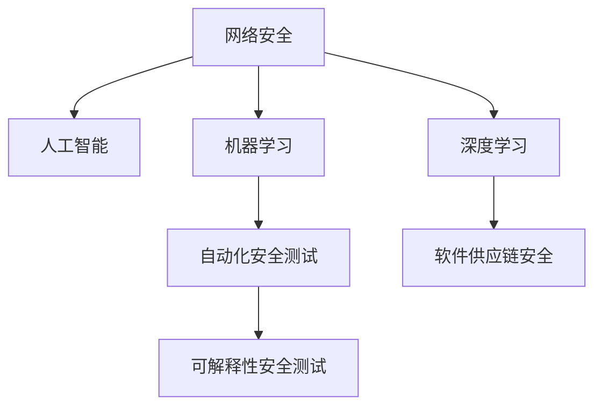

                 

# 硅谷网络安全新技术的发展方向

> 关键词：网络安全,新技术,人工智能,机器学习,深度学习,自动化安全测试,可解释性安全测试,软件供应链安全

## 1. 背景介绍

### 1.1 问题由来
网络安全是当今全球信息化社会的核心议题。近年来，随着互联网技术的飞速发展和数字经济模式的崛起，网络安全威胁日益严峻，从数据泄露到网络攻击，从供应链漏洞到恶意软件，无不考验着企业和组织的信息安全防线。硅谷作为全球技术创新的中心，在网络安全领域持续推出新技术，以期应对不断变化的安全威胁。

### 1.2 问题核心关键点
硅谷网络安全技术的发展主要围绕以下几个关键点展开：
- 数据隐私和用户保护：如何确保用户数据的安全性，防止数据泄露和滥用。
- 人工智能在网络安全中的应用：如何利用AI技术提高网络安全检测和防御能力。
- 自动化安全测试和应急响应：如何通过自动化工具快速发现和响应网络安全威胁。
- 供应链安全：如何保护软件供应链免受恶意攻击和漏洞影响。
- 可解释性安全测试：如何让安全检测和防御过程更加透明和可解释。

这些核心关键点共同构成了硅谷网络安全技术的发展框架，推动了行业内各种新技术的不断涌现，为全球网络安全提供了新的解决方案。

### 1.3 问题研究意义
硅谷网络安全技术的研究和发展，对于提升全球网络安全防御能力，保护个人和企业数据安全，防止网络犯罪，具有重要意义：

1. 提升网络安全水平：新技术的应用有助于提升安全检测和防御能力，保护各类数字资产免受攻击。
2. 促进数据隐私保护：通过技术手段加强数据加密、匿名化处理，提升数据隐私保护的成效。
3. 推动自动化和智能化：利用AI和机器学习等技术，提高安全检测的自动化水平，降低人工干预的复杂度。
4. 促进供应链安全：建立和完善供应链安全管理机制，防止供应链攻击。
5. 增强可解释性：使得安全检测和防御过程更加透明，增强用户信任和合规性。

## 2. 核心概念与联系

### 2.1 核心概念概述

为了更好地理解硅谷网络安全新技术的发展方向，本节将介绍几个密切相关的核心概念：

- **网络安全（Cyber Security）**：指保护信息系统免受未经授权的访问、破坏、更改或泄露的技术和流程。

- **人工智能（AI）**：使用算法和计算技术来模拟人类智能，包括机器学习、深度学习等子领域。

- **机器学习（Machine Learning）**：一种人工智能的分支，使计算机能够通过数据和算法学习，从而进行预测和决策。

- **深度学习（Deep Learning）**：一种特殊的机器学习方法，模拟人脑神经网络结构，处理高度复杂的数据集。

- **自动化安全测试（Automated Security Testing）**：使用工具和算法自动检测软件系统中的漏洞和缺陷。

- **可解释性安全测试（Explainable Security Testing）**：使安全检测过程和结果具有透明性，便于理解和解释。

- **软件供应链安全（Software Supply Chain Security）**：保护软件供应链免受恶意攻击和漏洞的影响。

这些核心概念之间的逻辑关系可以通过以下Mermaid流程图来展示：



这个流程图展示了大语言模型的核心概念及其之间的关系：

1. 网络安全通过使用人工智能和机器学习技术，实现自动化安全测试和可解释性安全测试。
2. 深度学习技术在网络安全中应用广泛，尤其是在数据分析和预测方面。
3. 软件供应链安全是网络安全的重要组成部分，通过自动化和智能化手段加强保护。

## 3. 核心算法原理 & 具体操作步骤
### 3.1 算法原理概述

硅谷网络安全新技术的发展，主要围绕以下几个关键算法原理展开：

- **基于AI和ML的异常检测**：利用机器学习模型，训练出能够识别网络流量或行为中的异常数据的算法，从而发现潜在的威胁。

- **深度学习在安全预测中的应用**：使用深度神经网络模型，对历史数据进行学习，预测未来的安全威胁，提升预警能力。

- **自动化漏洞检测和修复**：通过构建自动化工具，自动识别系统中的漏洞，并自动生成修复方案。

- **可解释性模型构建**：开发能够提供决策和检测过程解释的模型，提升用户信任和可操作性。

- **供应链安全监控**：通过构建供应链安全监控系统，及时发现和响应供应链中的潜在威胁。

这些算法原理是硅谷网络安全技术发展的基石，推动了众多新型技术的诞生和应用。

### 3.2 算法步骤详解

基于AI和ML的异常检测算法步骤：
1. **数据收集**：收集网络流量数据或行为数据，作为训练样本。
2. **特征提取**：对数据进行预处理和特征提取，生成可用于模型训练的特征向量。
3. **模型训练**：选择适合的机器学习模型，如决策树、随机森林、神经网络等，进行模型训练。
4. **模型评估**：使用测试集对模型进行评估，选择合适的超参数，优化模型性能。
5. **实时检测**：将训练好的模型应用于实时数据，检测异常行为或流量。

深度学习在安全预测中的算法步骤：
1. **数据准备**：收集历史安全事件数据，标注事件类型。
2. **模型构建**：设计深度神经网络模型，确定网络结构、损失函数等。
3. **模型训练**：使用标注数据训练深度模型，优化模型参数。
4. **模型评估**：在测试集上评估模型性能，验证模型的泛化能力。
5. **预测应用**：将训练好的模型应用于新数据，预测安全事件。

自动化漏洞检测和修复的算法步骤：
1. **漏洞扫描**：使用自动化工具扫描系统中的已知漏洞。
2. **威胁评估**：对扫描结果进行威胁评估，确定漏洞的风险级别。
3. **修复生成**：根据漏洞类型和严重程度，自动生成修复方案。
4. **修复执行**：执行修复方案，修复系统中的漏洞。

可解释性模型构建的算法步骤：
1. **模型选择**：选择能够提供可解释性的机器学习模型，如决策树、LIME、SHAP等。
2. **数据预处理**：对数据进行标准化处理，去除噪声。
3. **模型训练**：对模型进行训练，生成模型参数。
4. **结果解释**：对模型预测结果进行解释，生成易于理解的解释文本或图表。

供应链安全监控的算法步骤：
1. **数据收集**：收集供应链中的各种数据，如软件代码、依赖库、部署信息等。
2. **漏洞检测**：使用自动化工具检测供应链中的潜在漏洞。
3. **威胁分析**：对检测到的威胁进行分析和评估，确定潜在风险。
4. **响应处理**：根据威胁级别，采取相应的应对措施，如隔离、修复等。

### 3.3 算法优缺点

硅谷网络安全新技术的优点包括：
1. 自动化和智能化程度高，能够快速发现和应对安全威胁。
2. 深度学习和AI技术的引入，提高了安全检测和预测的准确性和及时性。
3. 可解释性安全测试增强了用户信任和透明度。

其缺点则包括：
1. 对数据质量要求高，需要大量高质量的标注数据。
2. 技术复杂度高，对开发者的技术水平和资源投入要求较高。
3. 对现有系统的影响较大，可能需要进行较大规模的改造。

### 3.4 算法应用领域

硅谷网络安全新技术在多个领域中得到广泛应用：

- **云安全**：通过自动化和智能化手段，提升云服务的安全防护能力。
- **物联网安全**：在物联网设备中引入AI和ML技术，提高设备的安全性和可靠性。
- **应用安全**：使用AI和ML技术，提升Web、移动应用等关键应用的安全防护。
- **工业互联网安全**：保护工业控制系统和工业物联网的安全性。
- **智能交通安全**：利用AI技术，提升交通系统的安全性和效率。

## 4. 数学模型和公式 & 详细讲解  
### 4.1 数学模型构建

本节将使用数学语言对基于AI和ML的网络安全新技术进行更加严格的刻画。

假设网络流量数据为 $x$，异常行为数据为 $y$，其中 $y=1$ 表示异常，$y=0$ 表示正常。我们希望训练一个分类模型 $M$，使得 $M(x)$ 能够预测 $y$ 的值。

定义模型的损失函数为：
$$
\mathcal{L}(M) = -\frac{1}{N}\sum_{i=1}^N [y_i\log M(x_i)+(1-y_i)\log(1-M(x_i))]
$$

其中 $N$ 为样本数量。

模型的参数更新公式为：
$$
\theta \leftarrow \theta - \eta \nabla_{\theta}\mathcal{L}(\theta)
$$

其中 $\eta$ 为学习率，$\nabla_{\theta}\mathcal{L}(\theta)$ 为损失函数对模型参数 $\theta$ 的梯度。

### 4.2 公式推导过程

以下是深度学习在安全预测中的公式推导过程。

假设我们有一个深度神经网络模型 $M(x)=W_nh_{n-1}+W_n+b_n$，其中 $W_n$ 和 $b_n$ 为模型参数，$h_{n-1}$ 为前一层的输出。

定义损失函数为均方误差：
$$
\mathcal{L}(M) = \frac{1}{N}\sum_{i=1}^N (M(x_i)-y_i)^2
$$

对 $M(x)$ 求导，得：
$$
\nabla_{\theta}\mathcal{L}(\theta) = \frac{2}{N}\sum_{i=1}^N [(M(x_i)-y_i)h_{n-1}^TW_n]
$$

将导数代入参数更新公式：
$$
\theta \leftarrow \theta - \eta\nabla_{\theta}\mathcal{L}(\theta)
$$

迭代多次后，模型将收敛到最优参数 $\theta^*$。

## 5. 项目实践：代码实例和详细解释说明
### 5.1 开发环境搭建

在进行网络安全新技术的开发实践前，我们需要准备好开发环境。以下是使用Python进行PyTorch开发的环境配置流程：

1. 安装Anaconda：从官网下载并安装Anaconda，用于创建独立的Python环境。

2. 创建并激活虚拟环境：
```bash
conda create -n pytorch-env python=3.8 
conda activate pytorch-env
```

3. 安装PyTorch：根据CUDA版本，从官网获取对应的安装命令。例如：
```bash
conda install pytorch torchvision torchaudio cudatoolkit=11.1 -c pytorch -c conda-forge
```

4. 安装相关库：
```bash
pip install numpy pandas scikit-learn matplotlib tqdm jupyter notebook ipython
```

完成上述步骤后，即可在`pytorch-env`环境中开始开发实践。

### 5.2 源代码详细实现

下面我们以深度学习在安全预测中的应用为例，给出使用PyTorch的代码实现。

首先，定义模型和优化器：

```python
import torch
import torch.nn as nn
from torch import optim

class DeepLearningModel(nn.Module):
    def __init__(self):
        super(DeepLearningModel, self).__init__()
        self.fc1 = nn.Linear(100, 50)
        self.fc2 = nn.Linear(50, 1)
        self.relu = nn.ReLU()
        
    def forward(self, x):
        x = self.fc1(x)
        x = self.relu(x)
        x = self.fc2(x)
        return x

model = DeepLearningModel()
optimizer = optim.Adam(model.parameters(), lr=0.001)
```

接着，定义训练和评估函数：

```python
from torch.utils.data import DataLoader
from sklearn.model_selection import train_test_split
from sklearn.metrics import accuracy_score

def train_model(model, data_loader, optimizer, num_epochs):
    model.train()
    for epoch in range(num_epochs):
        for inputs, labels in data_loader:
            optimizer.zero_grad()
            outputs = model(inputs)
            loss = nn.BCELoss()(outputs, labels)
            loss.backward()
            optimizer.step()
            print(f"Epoch {epoch+1}, Loss: {loss.item()}")
    
def evaluate_model(model, test_loader):
    model.eval()
    correct = 0
    total = 0
    with torch.no_grad():
        for inputs, labels in test_loader:
            outputs = model(inputs)
            _, predicted = torch.max(outputs, 1)
            total += labels.size(0)
            correct += (predicted == labels).sum().item()
        print(f"Accuracy: {correct/total}")
```

最后，启动训练流程并在测试集上评估：

```python
from sklearn.datasets import load_breast_cancer
from sklearn.preprocessing import StandardScaler

# 加载数据
data = load_breast_cancer()
X = data.data
y = data.target

# 数据标准化
scaler = StandardScaler()
X_scaled = scaler.fit_transform(X)

# 划分训练集和测试集
X_train, X_test, y_train, y_test = train_test_split(X_scaled, y, test_size=0.2, random_state=42)

# 构建数据集
train_dataset = torch.utils.data.TensorDataset(torch.tensor(X_train), torch.tensor(y_train))
test_dataset = torch.utils.data.TensorDataset(torch.tensor(X_test), torch.tensor(y_test))

# 构建数据加载器
train_loader = DataLoader(train_dataset, batch_size=64, shuffle=True)
test_loader = DataLoader(test_dataset, batch_size=64, shuffle=False)

# 训练模型
train_model(model, train_loader, optimizer, num_epochs=10)

# 评估模型
evaluate_model(model, test_loader)
```

以上就是使用PyTorch进行深度学习在安全预测中应用的完整代码实现。可以看到，利用PyTorch的高效计算能力和丰富的API，我们可以迅速搭建深度学习模型，完成训练和评估。

### 5.3 代码解读与分析

让我们再详细解读一下关键代码的实现细节：

**DeepLearningModel类**：
- `__init__`方法：定义模型结构，包含两个全连接层和一个ReLU激活函数。
- `forward`方法：定义模型的前向传播过程，从输入层经过两层的线性变换和激活函数，得到输出结果。

**train_model函数**：
- 在每个epoch内，对数据集进行迭代，前向传播计算损失函数，反向传播更新模型参数，输出每个epoch的平均loss。

**evaluate_model函数**：
- 对模型进行评估，统计在测试集上的准确率，并输出结果。

**主流程**：
- 加载数据集，对数据进行标准化处理。
- 划分训练集和测试集。
- 构建数据集和数据加载器。
- 训练模型，并在测试集上评估模型性能。

可以看到，使用PyTorch进行深度学习在安全预测的代码实现非常简洁，开发者可以专注于算法设计和数据处理，而无需过多关注底层计算细节。

## 6. 实际应用场景
### 6.1 云安全

云安全是网络安全的一个重要领域，利用AI和ML技术，可以显著提升云服务的安全防护能力。云平台可以通过自动化安全检测工具，对所有云服务进行实时监控，及时发现和应对安全威胁。

具体而言，可以构建一个云安全监控平台，利用深度学习模型对云服务日志进行分析，检测异常行为，自动生成告警信息。对于检测到的威胁，系统自动触发应急响应机制，阻止恶意攻击。

### 6.2 物联网安全

物联网设备的普及带来了新的安全挑战。传统的安全防护措施难以覆盖众多分散、多样的物联网设备。利用AI和ML技术，可以在物联网设备中引入安全检测和防御功能。

具体做法包括：
- 对设备固件进行安全扫描，检测已知漏洞。
- 使用异常检测算法，识别设备行为中的异常行为。
- 对检测到的威胁进行分析和响应，提升设备的安全性。

### 6.3 应用安全

Web和移动应用是用户与数字世界交互的主要接口，也是网络攻击的主要目标。利用AI和ML技术，可以构建更加安全的应用平台。

具体措施包括：
- 对Web应用进行漏洞扫描和安全评估，生成修复建议。
- 使用异常检测算法，识别Web和移动应用的异常行为。
- 对检测到的威胁进行自动响应，阻止恶意攻击。

### 6.4 工业互联网安全

工业互联网是连接制造业和信息技术的桥梁，其安全问题关系到国计民生。利用AI和ML技术，可以在工业互联网中构建全方位的安全防护体系。

具体措施包括：
- 对工业控制系统和设备进行安全扫描和检测，发现潜在漏洞。
- 使用深度学习模型对工业互联网数据进行分析，预测异常行为。
- 对检测到的威胁进行快速响应，阻止攻击行为。

## 7. 工具和资源推荐
### 7.1 学习资源推荐

为了帮助开发者系统掌握网络安全新技术的理论基础和实践技巧，这里推荐一些优质的学习资源：

1. **《网络安全与人工智能》系列博文**：由网络安全领域专家撰写，深入浅出地介绍了AI在网络安全中的应用。

2. **Udacity《网络安全基础》课程**：Udacity提供的网络安全入门课程，包括网络攻防、加密技术等内容。

3. **Coursera《网络安全技术》课程**：Coursera联合多所大学开设的网络安全课程，涵盖网络攻防、加密技术、安全测试等内容。

4. **《网络安全实战》书籍**：讲解了实际网络安全攻防技术，适合动手实践的网络安全爱好者。

5. **Kaggle安全竞赛**：Kaggle举办的网络安全竞赛，通过实际数据和挑战，提升数据分析和处理能力。

通过对这些资源的学习实践，相信你一定能够快速掌握网络安全新技术的精髓，并用于解决实际的安全问题。

### 7.2 开发工具推荐

高效的开发离不开优秀的工具支持。以下是几款用于网络安全新技术开发的常用工具：

1. **Wireshark**：网络数据包分析工具，可以实时监测网络流量，提取异常数据。

2. **Nmap**：网络扫描工具，可以检测目标网络的开放端口和服务。

3. **Nessus**：安全漏洞扫描工具，可以扫描系统中的已知漏洞。

4. **Burp Suite**：Web应用渗透测试工具，可以模拟攻击行为，发现Web应用的漏洞。

5. **OWASP ZAP**：Web应用渗透测试工具，可以自动化发现和修复Web应用中的安全漏洞。

6. **Ansible**：自动化配置管理工具，可以快速部署和管理大规模网络设备。

7. **TensorFlow**：Google开发的深度学习框架，支持高效的深度学习模型训练和部署。

8. **PyTorch**：Facebook开发的深度学习框架，支持灵活的模型设计和高效计算。

合理利用这些工具，可以显著提升网络安全新技术的开发效率，加快创新迭代的步伐。

### 7.3 相关论文推荐

网络安全技术的发展源于学界的持续研究。以下是几篇奠基性的相关论文，推荐阅读：

1. **Adversarial Machine Learning: An overview**：Great discuss the concept of adversarial machine learning and its applications in network security.

2. **Deep Learning for Cyber Threats Detection**：介绍深度学习在网络威胁检测中的应用。

3. **AI-driven Cyber Threat Analysis**：探讨AI在网络威胁分析中的应用。

4. **Automated Cybersecurity Testing**：介绍自动化安全测试技术的发展和应用。

5. **Explainable AI for Cybersecurity**：讨论可解释性AI技术在网络安全中的应用。

6. **Software Supply Chain Security**：探讨软件供应链安全的防护技术和方法。

这些论文代表了大语言模型微调技术的发展脉络。通过学习这些前沿成果，可以帮助研究者把握学科前进方向，激发更多的创新灵感。

## 8. 总结：未来发展趋势与挑战
### 8.1 总结

本文对硅谷网络安全新技术的发展方向进行了全面系统的介绍。首先阐述了网络安全技术的研究背景和意义，明确了AI和ML技术在网络安全中的重要地位。其次，从原理到实践，详细讲解了基于AI和ML的网络安全新技术的数学模型和实现步骤，给出了网络安全新技术的代码实现示例。同时，本文还广泛探讨了网络安全新技术在云安全、物联网安全、应用安全和工业互联网安全等多个领域的应用前景，展示了AI和ML技术在网络安全中的广泛应用。

通过本文的系统梳理，可以看到，基于AI和ML的网络安全技术正在成为网络安全防护的重要范式，极大地提升了网络安全检测和防御的效率和精度。未来，伴随AI和ML技术的不断演进，网络安全防护将更加智能化和自动化，更好地保障企业和个人的数据安全。

### 8.2 未来发展趋势

展望未来，基于AI和ML的网络安全技术将呈现以下几个发展趋势：

1. **自动化和智能化程度不断提升**：利用AI和ML技术，网络安全检测和防御将更加自动化和智能化，能够快速发现和应对新型的安全威胁。

2. **深度学习在安全检测中的应用将更加广泛**：深度学习模型将用于分析更复杂的数据，提高安全检测的准确性和实时性。

3. **多模态安全检测技术将逐步成熟**：结合文本、图像、视频等多模态数据，提升安全检测的全面性和可靠性。

4. **供应链安全将得到更加广泛的应用**：在软件开发和部署过程中，利用AI和ML技术，加强供应链管理，防范供应链攻击。

5. **可解释性安全测试将更加重要**：使得安全检测过程透明可解释，增强用户信任和合规性。

6. **分布式安全检测将更加普及**：在分布式环境中，利用AI和ML技术，实现更高效、更可靠的安全检测。

以上趋势凸显了基于AI和ML的网络安全技术的广阔前景。这些方向的探索发展，必将进一步提升网络安全防护能力，保障全球数字经济的安全稳定。

### 8.3 面临的挑战

尽管基于AI和ML的网络安全技术已经取得了瞩目成就，但在迈向更加智能化、普适化应用的过程中，它仍面临着诸多挑战：

1. **数据隐私和用户保护**：如何保护用户数据隐私，防止数据泄露和滥用，是网络安全技术面临的重要挑战。

2. **技术复杂度高**：网络安全技术的实现需要高水平的技术能力和资源投入，对开发者的技术水平要求较高。

3. **现有系统的改造难度大**：现有网络系统的改造需要较高的技术门槛和成本投入，难以快速普及。

4. **恶意攻击和对抗攻击**：攻击者不断研发新的攻击手法，网络安全技术需要不断升级以应对新的挑战。

5. **资源消耗大**：AI和ML技术的应用需要大量的计算资源，难以在资源受限的环境中大规模部署。

6. **模型的可解释性不足**：网络安全模型往往较为复杂，难以解释其内部工作机制和决策逻辑。

正视网络安全技术面临的这些挑战，积极应对并寻求突破，将是大语言模型微调走向成熟的必由之路。相信随着学界和产业界的共同努力，这些挑战终将一一被克服，网络安全技术必将在构建安全、可靠、可解释、可控的智能系统中扮演越来越重要的角色。

### 8.4 研究展望

面对网络安全技术面临的种种挑战，未来的研究需要在以下几个方面寻求新的突破：

1. **开发更多可解释性模型**：构建能够提供透明可解释的模型，提升用户信任和可操作性。

2. **引入对抗攻击检测**：开发能够检测对抗攻击的算法，保障模型的鲁棒性和安全性。

3. **加强多模态数据融合**：结合文本、图像、视频等多模态数据，提升安全检测的全面性和可靠性。

4. **优化模型资源消耗**：开发高效低成本的模型，提高网络安全技术的可部署性和可扩展性。

5. **建立完整的安全框架**：构建包括数据收集、模型训练、检测响应等环节的网络安全防护体系，提升整体安全防护能力。

6. **推动法规和标准制定**：制定网络安全相关的法规和标准，推动网络安全技术的规范化和标准化。

这些研究方向和探索，必将引领基于AI和ML的网络安全技术迈向更高的台阶，为构建安全、可靠、可解释、可控的智能系统铺平道路。面向未来，网络安全技术还需要与其他人工智能技术进行更深入的融合，如知识表示、因果推理、强化学习等，多路径协同发力，共同推动网络安全技术的进步。只有勇于创新、敢于突破，才能不断拓展网络安全技术的边界，让智能技术更好地造福人类社会。

## 9. 附录：常见问题与解答

**Q1：AI和ML技术在网络安全中的应用有哪些？**

A: AI和ML技术在网络安全中的应用非常广泛，包括但不限于：

- **异常检测**：利用机器学习模型，识别网络流量或行为中的异常数据，发现潜在的威胁。

- **威胁预测**：使用深度学习模型，对历史数据进行学习，预测未来的安全威胁，提升预警能力。

- **漏洞扫描和修复**：构建自动化工具，自动识别系统中的漏洞，并自动生成修复方案。

- **智能监控和响应**：利用AI和ML技术，构建智能监控系统，及时发现和响应安全威胁。

- **可解释性检测**：开发能够提供透明可解释的模型，提升用户信任和可操作性。

这些应用展示了AI和ML技术在网络安全中的强大潜力，为网络安全防护提供了新的解决方案。

**Q2：AI和ML技术在网络安全中如何防止数据泄露和滥用？**

A: AI和ML技术在网络安全中防止数据泄露和滥用的主要方法包括：

- **数据加密**：对敏感数据进行加密处理，确保数据在传输和存储过程中的安全性。

- **数据匿名化**：对数据进行去标识化处理，防止数据泄露用户身份信息。

- **访问控制**：对数据进行严格的访问控制，确保只有授权用户才能访问敏感数据。

- **数据审计**：对数据访问和使用进行审计，发现并处理不当访问行为。

- **差分隐私**：在数据分析中引入差分隐私技术，防止攻击者通过数据分析发现用户隐私信息。

这些方法能够有效保护用户数据隐私，防止数据泄露和滥用。

**Q3：AI和ML技术在网络安全中如何提升检测准确性和实时性？**

A: AI和ML技术在网络安全中提升检测准确性和实时性的主要方法包括：

- **深度学习模型**：使用深度神经网络模型，对复杂数据进行学习，提升检测准确性。

- **实时数据处理**：对网络流量进行实时处理，快速检测异常行为。

- **异常检测算法**：利用机器学习算法，识别网络流量或行为中的异常数据，提高检测效率。

- **异常预警系统**：构建异常预警系统，及时发现和响应安全威胁。

这些方法能够显著提升网络安全检测的准确性和实时性，保障网络安全。

**Q4：AI和ML技术在网络安全中如何提升模型可解释性？**

A: AI和ML技术在网络安全中提升模型可解释性的主要方法包括：

- **可解释性模型**：选择能够提供透明可解释的模型，如决策树、LIME、SHAP等。

- **结果可视化**：对模型预测结果进行可视化，生成易于理解的解释图表。

- **用户接口设计**：设计友好的用户接口，帮助用户理解模型的输出和决策逻辑。

- **多模态数据融合**：结合文本、图像、视频等多模态数据，提升模型的全面性和可解释性。

这些方法能够使得网络安全模型更加透明和可解释，增强用户信任和可操作性。

**Q5：AI和ML技术在网络安全中如何应对恶意攻击和对抗攻击？**

A: AI和ML技术在网络安全中应对恶意攻击和对抗攻击的主要方法包括：

- **对抗攻击检测**：开发能够检测对抗攻击的算法，防止攻击者通过对抗攻击手段篡改模型输出。

- **鲁棒性训练**：使用对抗样本训练模型，提升模型的鲁棒性和抗干扰能力。

- **差分隐私保护**：在数据处理中引入差分隐私技术，防止攻击者通过数据分析发现模型参数和训练数据。

- **模型重训练**：定期重训练模型，保持模型的最新状态，防止模型参数泄露。

这些方法能够增强网络安全模型的鲁棒性和安全性，防止恶意攻击和对抗攻击。

---

作者：禅与计算机程序设计艺术 / Zen and the Art of Computer Programming

