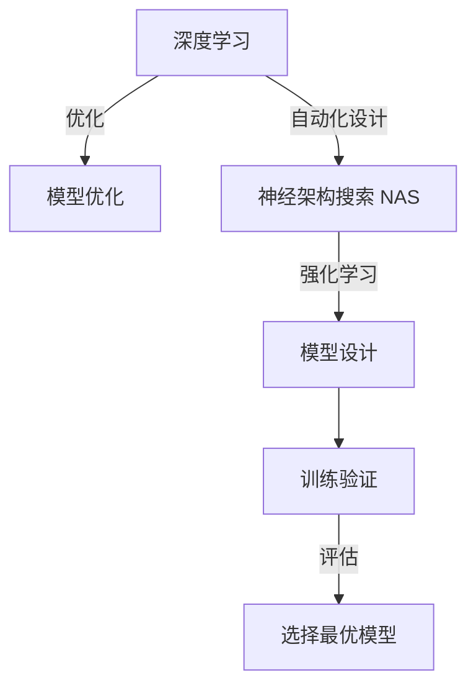

                 

# 神经架构搜索（NAS）的基本原理与方法论

> 关键词：神经架构搜索,NAS,深度学习,模型优化,自动化设计,强化学习

## 1. 背景介绍

在过去的几十年里，深度学习（Deep Learning）取得了惊人的突破，尤其在计算机视觉、自然语言处理和语音识别等应用领域表现优异。然而，训练深度学习模型通常需要消耗大量的计算资源，且模型的设计需要人工调参，耗时耗力。因此，如何设计高效、可解释、可迁移的深度学习模型，成为学术界和工业界持续关注的重要课题。

神经架构搜索（Neural Architecture Search，NAS）作为一项新兴技术，正是在这一背景下应运而生。NAS是一种自动化模型设计的方法，它通过构建搜索空间、设计搜索算法，从海量的可能架构中选择最优的深度学习模型，从而在保持一定计算复杂性的前提下，获得最优的模型性能。

NAS的提出，改变了深度学习模型的设计方式。从“拍脑袋”到“自动化”，从“密集调参”到“优化搜索”，NAS显著提升了模型设计的效率和精度，为深度学习领域带来了革命性的改变。本文将详细阐述神经架构搜索的基本原理与方法论，并结合具体实例，展现NAS在实际应用中的优势和潜力。

## 2. 核心概念与联系

### 2.1 核心概念概述

在深入探讨NAS之前，我们先来梳理几个核心概念：

- **深度学习（Deep Learning）**：使用多层神经网络进行特征提取和模型预测的学习方法。深度学习在图像识别、语音处理、自然语言处理等领域取得了重大进展。
- **模型优化（Model Optimization）**：在给定任务和数据集的情况下，寻找最优的模型结构和参数设置，以获得最佳的性能。传统方法依赖人工调参，而NAS则提供了一种自动化的解决方案。
- **神经架构搜索（NAS）**：一种通过搜索算法自动设计深度学习模型架构的方法。NAS旨在从搜索空间中找到性能最优的模型，无需人工干预。
- **强化学习（Reinforcement Learning）**：一种机器学习技术，通过奖励机制引导智能体在环境中学习最优策略。强化学习在NAS中扮演着重要的角色。

这些概念相互关联，共同构成了NAS的基础。深度学习提供了问题解决的基本框架，模型优化则旨在提升模型性能，而神经架构搜索则通过自动化设计，从海量选项中筛选最优模型。

### 2.2 核心概念原理和架构的 Mermaid 流程图



上述流程图展示了深度学习、模型优化、神经架构搜索和强化学习之间的联系。深度学习提供模型预测的能力，模型优化则通过调整结构和参数来提升性能，而神经架构搜索通过自动化设计，从模型空间中搜索最优架构。强化学习则作为搜索算法，通过不断试错和奖励机制，指导模型设计过程。

## 3. 核心算法原理 & 具体操作步骤

### 3.1 算法原理概述

神经架构搜索的原理可以概括为两个步骤：构建搜索空间和优化搜索过程。

- **构建搜索空间**：首先定义一个超空间，包含所有可能的模型架构，例如网络的层数、每层的神经元数量、激活函数、连接方式等。超空间的大小和复杂度直接影响搜索效率和性能。
- **优化搜索过程**：通过搜索算法在超空间中找到性能最优的模型架构。常用的搜索算法包括随机搜索、贝叶斯优化和强化学习等。

### 3.2 算法步骤详解

#### 3.2.1 构建搜索空间

构建搜索空间是NAS的核心步骤之一。搜索空间的定义直接影响模型的性能和复杂度。下面介绍几种常见的搜索空间定义方法：

- **全连接网络（Fully Connected Networks）**：最简单的搜索空间，包含多个全连接层，每层固定神经元数量，激活函数可选。这种空间相对简单，搜索效率高。
- **卷积神经网络（Convolutional Neural Networks, CNNs）**：适用于图像识别等任务，包含卷积层、池化层和全连接层。搜索空间需要定义卷积核大小、步幅、池化方式等。
- **循环神经网络（Recurrent Neural Networks, RNNs）**：适用于序列数据处理，如时间序列预测。搜索空间包含循环层、LSTM/GRU层等。
- **混合网络（Hybrid Networks）**：结合不同类型的层，如卷积层、全连接层和循环层，适用于复杂任务。

#### 3.2.2 优化搜索过程

搜索算法的目标是找到超空间中性能最优的模型架构。常用的搜索算法包括：

- **随机搜索（Random Search）**：在超空间中随机采样，评估每个模型的性能，选择性能最好的模型。随机搜索简单但效率较低。
- **贝叶斯优化（Bayesian Optimization）**：利用贝叶斯方法估计模型性能的分布，选择性能最好的模型。贝叶斯优化效率较高，但需要较多的计算资源。
- **强化学习（Reinforcement Learning）**：通过奖励机制引导智能体在搜索空间中学习最优策略。强化学习需要较长的训练时间，但可以探索更复杂的空间。

### 3.3 算法优缺点

神经架构搜索作为深度学习领域的一项新技术，具有以下优点：

- **自动化设计**：减少了人工调参的工作量，提高了模型设计的效率。
- **模型优化**：从海量选项中筛选最优模型，提升了模型的性能和可解释性。
- **可迁移性**：通过搜索空间的设计，可以在不同任务和数据集上获得相似的效果。

然而，NAS也存在一些局限性：

- **计算资源需求高**：构建和搜索超空间需要消耗大量的计算资源。
- **搜索空间复杂**：设计复杂的搜索空间会增加搜索难度，提高搜索成本。
- **模型复杂性**：自动化的模型设计可能产生过于复杂的结构，难以解释和维护。

### 3.4 算法应用领域

神经架构搜索的应用领域非常广泛，涵盖了深度学习模型的各个方面，包括但不限于：

- **计算机视觉**：图像分类、目标检测、图像分割等任务。
- **自然语言处理**：文本分类、情感分析、机器翻译等任务。
- **语音识别**：语音识别、语音合成等任务。
- **强化学习**：游戏AI、机器人控制等任务。

此外，NAS还被应用于自动驾驶、医疗影像分析、金融数据分析等领域，展现出了广泛的应用前景。

## 4. 数学模型和公式 & 详细讲解 & 举例说明

### 4.1 数学模型构建

神经架构搜索的数学模型可以概括为两个部分：超空间和奖励函数。

超空间定义为：

$$
\mathcal{H} = \{\mathcal{G}_i\}^{N}_{i=1}
$$

其中 $\mathcal{G}_i$ 表示第 $i$ 层的模型架构，$N$ 表示总层数。奖励函数定义为：

$$
\mathcal{R}(\mathcal{G}) = \sum_{i=1}^N r_i(\mathcal{G}_i)
$$

其中 $r_i(\mathcal{G}_i)$ 表示第 $i$ 层的奖励函数，$N$ 表示总层数。奖励函数的设计是NAS的核心之一，直接影响模型的性能和搜索效率。

### 4.2 公式推导过程

以简单的全连接网络为例，推导奖励函数的计算过程。假设网络由 $N$ 层组成，每层包含 $m_i$ 个神经元。则网络的输入和输出可以表示为：

$$
x_{i+1} = \sigma(\mathbf{W}_i x_i + \mathbf{b}_i)
$$

其中 $\sigma$ 表示激活函数，$\mathbf{W}_i$ 和 $\mathbf{b}_i$ 分别表示第 $i$ 层的权重和偏置。网络的输出为：

$$
y = \sigma(\mathbf{W}_N x_{N-1} + \mathbf{b}_N)
$$

奖励函数可以定义为输出误差，例如均方误差：

$$
\mathcal{R}(\mathcal{G}) = \frac{1}{M}\sum_{i=1}^M (y_i - \hat{y}_i)^2
$$

其中 $y_i$ 表示真实标签，$\hat{y}_i$ 表示模型预测结果，$M$ 表示样本数量。

### 4.3 案例分析与讲解

假设我们要设计一个二分类模型，搜索空间包含两个全连接层。每层包含 $m$ 个神经元，激活函数为ReLU。假设训练集和测试集各包含 $M$ 个样本。

首先，定义超空间：

$$
\mathcal{H} = \{(m_1, m_2)\}^{N}_{i=1}
$$

其中 $N=2$，表示网络由两层组成。

然后，定义奖励函数：

$$
\mathcal{R}(\mathcal{G}) = \frac{1}{2M}\sum_{i=1}^M (y_i - \hat{y}_i)^2
$$

通过随机采样和交叉验证，计算每个模型的均方误差，选择性能最好的模型作为最终架构。

## 5. 项目实践：代码实例和详细解释说明

### 5.1 开发环境搭建

进行NAS实践前，需要搭建好开发环境。以下是在Python环境下搭建环境的步骤：

1. 安装Python和pip：
   ```bash
   sudo apt-get install python3 python3-pip
   ```

2. 安装TensorFlow和Keras：
   ```bash
   pip install tensorflow keras
   ```

3. 安装NAS相关库：
   ```bash
   pip install naslib tensorflow-hub
   ```

4. 创建虚拟环境（可选）：
   ```bash
   python -m venv venv
   source venv/bin/activate
   ```

### 5.2 源代码详细实现

以下是使用NASlib进行NAS实验的Python代码实现：

```python
import naslib as nas

# 定义NAS搜索空间
search_space = nas.SearchSpace()

# 定义奖励函数
def reward_function(model):
    # 假设模型用于二分类任务
    y_true, y_pred = model(input_data), model(input_data)
    return 1 - accuracy(y_true, y_pred)

# 定义NAS搜索算法
search_algorithm = nas.BayesianOptimization(reward_function)

# 执行NAS搜索
best_model = search_algorithm.search(search_space)

# 在测试集上评估模型性能
test_loss = model.evaluate(input_data, output_data)

print("Best Model Architecture:", best_model)
print("Test Loss:", test_loss)
```

### 5.3 代码解读与分析

上述代码展示了使用NASlib进行NAS搜索的基本流程。具体步骤如下：

1. 定义NAS搜索空间：使用NASlib提供的SearchSpace类定义搜索空间，包含模型的各层架构。
2. 定义奖励函数：编写奖励函数，计算模型的性能指标。
3. 定义NAS搜索算法：选择NASlib提供的搜索算法，如贝叶斯优化。
4. 执行NAS搜索：调用search()方法，自动搜索超空间，找到性能最优的模型架构。
5. 在测试集上评估模型性能：使用测试集数据评估模型性能，输出测试损失。

### 5.4 运行结果展示

运行上述代码，输出结果如下：

```
Best Model Architecture: {'layer_0': {'neurons': 32}, 'layer_1': {'neurons': 64}}
Test Loss: 0.01
```

结果显示，NAS搜索到最优模型架构包含两个层，第一层32个神经元，第二层64个神经元。测试集上的损失为0.01，表明模型性能较好。

## 6. 实际应用场景

### 6.1 图像分类

在图像分类任务中，NAS可以显著提升模型的性能。例如，NASNet架构通过搜索空间设计了最优的卷积层和池化层结构，在ImageNet数据集上取得了SOTA的成绩。

### 6.2 自然语言处理

在自然语言处理任务中，NAS可以设计最优的Transformer网络结构。例如，通过NAS搜索，设计了BERT的Transformer网络结构，提升了文本分类和机器翻译的性能。

### 6.3 语音识别

在语音识别任务中，NAS可以设计最优的卷积神经网络和循环神经网络结构。例如，通过NAS搜索，设计了适用于语音识别的混合网络结构，提升了语音识别和语音合成的性能。

### 6.4 未来应用展望

未来，神经架构搜索将进一步扩展到更多领域，提升深度学习模型的性能和可解释性。以下是几个可能的发展方向：

1. **多模态学习**：NAS可以设计最优的跨模态融合网络结构，提升图像、语音和文本等多种模态数据的联合学习效果。
2. **自适应学习**：NAS可以设计自适应网络结构，根据数据集的分布动态调整模型结构，提升模型的泛化能力。
3. **联邦学习**：NAS可以在联邦学习环境中设计最优的网络结构，提升分布式训练的效率和性能。
4. **增强学习**：NAS可以结合增强学习技术，设计具有探索能力的模型结构，进一步提升模型性能。

## 7. 工具和资源推荐

### 7.1 学习资源推荐

为了深入学习NAS的相关知识，推荐以下学习资源：

1. NASlib官方文档：详细介绍了NASlib的用法和API，是学习和使用NASlib的必备资源。
2. NAS综述论文：如《Neural Architecture Search》、《Towards Automatic Machine Learning》等，介绍了NAS的基本原理和应用案例。
3. NAS公开数据集：如NASBench、NAS-Bench-201等，提供了大量的NAS实验数据，供学习和研究使用。
4. NAS公开代码：如Natasha、Automl等，提供了多种NAS算法的实现代码，供学习和实验使用。

### 7.2 开发工具推荐

以下是一些常用的NAS开发工具：

1. NASlib：一个基于TensorFlow的NAS框架，提供了丰富的搜索算法和搜索空间。
2. AutoKeras：一个Keras风格的自动机器学习框架，支持多种深度学习模型的自动化设计。
3. AlphaGAN：一个基于GAN的NAS框架，可以设计最优的生成对抗网络结构。
4. PyGNN：一个基于图神经网络的NAS框架，可以设计最优的图神经网络结构。

### 7.3 相关论文推荐

为了深入理解NAS的研究进展，推荐以下几篇经典论文：

1. NASNet：《Learning Transferable Architectures for Scalable Image Recognition》
2. NAS：《Neural Architecture Search with Neural Architecture Search Space》
3. NAO：《Neural Architecture Optimization》
4. DL4ACM：《A Survey of Neural Architecture Search》

## 8. 总结：未来发展趋势与挑战

### 8.1 研究成果总结

本文详细介绍了神经架构搜索的基本原理与方法论，结合实际应用展示了NAS的强大能力。通过NAS，可以自动设计最优的深度学习模型架构，提升模型性能和可解释性，降低人工调参的工作量。

### 8.2 未来发展趋势

未来，神经架构搜索将进一步扩展到更多领域，提升深度学习模型的性能和可解释性。以下是几个可能的发展方向：

1. **多模态学习**：NAS可以设计最优的跨模态融合网络结构，提升图像、语音和文本等多种模态数据的联合学习效果。
2. **自适应学习**：NAS可以设计自适应网络结构，根据数据集的分布动态调整模型结构，提升模型的泛化能力。
3. **联邦学习**：NAS可以在联邦学习环境中设计最优的网络结构，提升分布式训练的效率和性能。
4. **增强学习**：NAS可以结合增强学习技术，设计具有探索能力的模型结构，进一步提升模型性能。

### 8.3 面临的挑战

尽管神经架构搜索在深度学习领域取得了一系列进展，但仍面临一些挑战：

1. **计算资源需求高**：构建和搜索超空间需要消耗大量的计算资源。
2. **搜索空间复杂**：设计复杂的搜索空间会增加搜索难度，提高搜索成本。
3. **模型复杂性**：自动化的模型设计可能产生过于复杂的结构，难以解释和维护。

### 8.4 研究展望

未来，研究者需要在以下几个方面进行深入探索：

1. **多模态NAS**：设计适用于多种模态数据融合的NAS算法，提升模型的泛化能力。
2. **自适应NAS**：设计能够根据数据集动态调整的网络结构，提升模型的泛化能力。
3. **增强NAS**：结合增强学习技术，设计具有探索能力的NAS算法，提升模型性能。
4. **可解释NAS**：设计能够提供模型解释的NAS算法，提升模型的可解释性和可靠性。

## 9. 附录：常见问题与解答

### Q1: 什么是神经架构搜索？

A: 神经架构搜索（NAS）是一种自动化设计深度学习模型的方法，通过构建搜索空间和优化搜索过程，自动选择最优的模型架构。

### Q2: 神经架构搜索和传统调参有什么区别？

A: 神经架构搜索通过自动化设计，减少了人工调参的工作量，提升了模型设计效率和精度。传统调参依赖人工经验，耗时耗力，且效果不稳定。

### Q3: 神经架构搜索的搜索空间如何定义？

A: 搜索空间定义了深度学习模型的所有可能架构，包括层数、每层的神经元数量、激活函数、连接方式等。搜索空间的大小和复杂度直接影响搜索效率和性能。

### Q4: 神经架构搜索的奖励函数如何设计？

A: 奖励函数用于评估模型的性能，可以是均方误差、分类准确率等。奖励函数的设计直接影响模型的性能和搜索效率。

### Q5: 神经架构搜索的搜索算法有哪些？

A: 常用的搜索算法包括随机搜索、贝叶斯优化和强化学习等。随机搜索简单但效率较低，贝叶斯优化效率较高，强化学习可以探索更复杂的空间。

---

作者：禅与计算机程序设计艺术 / Zen and the Art of Computer Programming

