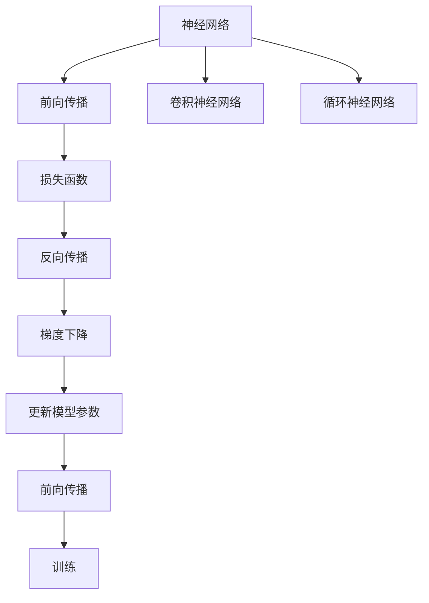

                 

# 神经网络(Neural Networks) - 原理与代码实例讲解

> 关键词：神经网络, 前向传播, 反向传播, 损失函数, 梯度下降, 卷积神经网络(CNN), 循环神经网络(RNN), 深度学习框架

## 1. 背景介绍

### 1.1 问题由来

随着深度学习技术的快速发展，神经网络（Neural Networks）成为了解决各类复杂问题的有力工具。自1940年代神经网络概念首次被提出以来，经过了多次起伏，逐渐成为了现代人工智能的核心技术之一。神经网络基于生物神经元的工作原理，通过模拟人脑的计算模式，能够自动地从数据中学习到复杂的特征和模式，具有极高的泛化能力。

神经网络在图像识别、语音识别、自然语言处理、推荐系统等诸多领域取得了巨大的成功，被广泛应用于工业界的各项任务中。例如，在计算机视觉领域，卷积神经网络（Convolutional Neural Networks, CNNs）被广泛应用于图像分类、目标检测等任务；在自然语言处理领域，循环神经网络（Recurrent Neural Networks, RNNs）及其变种如长短时记忆网络（Long Short-Term Memory, LSTM）、门控循环单元（Gated Recurrent Unit, GRU）等被用于文本生成、语言建模、机器翻译等任务。

尽管神经网络在诸多领域取得了显著的成果，但由于其复杂性，学习起来往往需要较深的数学背景和较强的编程能力。本文旨在通过系统介绍神经网络的基本原理、核心算法和代码实现，帮助读者快速上手神经网络，掌握其实际应用。

### 1.2 问题核心关键点

神经网络的核心问题可以归结为以下几个关键点：

1. **网络结构设计**：如何选择合适的网络结构，使其能够有效地捕捉数据中的特征，是神经网络构建的基础。
2. **损失函数**：如何定义损失函数，以衡量模型预测与真实标签之间的差距。
3. **前向传播和反向传播**：理解前向传播和反向传播的计算流程，是神经网络训练的核心。
4. **优化算法**：如何通过优化算法最小化损失函数，更新网络参数，是神经网络训练的保障。
5. **深度学习框架**：熟悉深度学习框架，如TensorFlow、PyTorch等，能够大大提高开发效率。

本文将从这些核心问题出发，系统介绍神经网络的基本原理、算法实现和实际应用，并辅以代码实例，帮助读者深入理解神经网络的工作机制。

## 2. 核心概念与联系

### 2.1 核心概念概述

为更好地理解神经网络，本节将介绍几个密切相关的核心概念：

- **神经网络(Neural Network)**：由大量人工神经元（即节点）组成的网络，能够模拟人脑的计算和信息处理能力。神经网络包括输入层、隐藏层和输出层，每层之间通过权值和偏置进行连接。
- **前向传播(Forward Propagation)**：将输入数据通过网络，从输入层到输出层的计算过程。
- **反向传播(Backward Propagation)**：根据输出误差，通过链式法则计算各层权重和偏置的梯度，以调整模型参数的过程。
- **损失函数(Loss Function)**：衡量模型预测与真实标签之间差异的函数。损失函数越小，模型的预测效果越好。
- **梯度下降(Gradient Descent)**：通过不断调整模型参数，最小化损失函数的过程。梯度下降是神经网络训练的核心算法。
- **卷积神经网络(Convolutional Neural Network, CNN)**：针对图像等二维数据设计的神经网络，通过卷积、池化等操作提取局部特征。
- **循环神经网络(Recurrent Neural Network, RNN)**：针对序列数据设计的神经网络，能够捕捉时间序列的依赖关系。

这些概念之间的逻辑关系可以通过以下Mermaid流程图来展示：



这个流程图展示了大语言模型的核心概念及其之间的关系：

1. 神经网络通过前向传播计算输出，利用损失函数衡量预测与真实标签之间的差异。
2. 反向传播根据输出误差，计算各层参数的梯度，梯度下降调整模型参数。
3. 卷积神经网络和循环神经网络是神经网络中的特定类型，分别用于处理图像和序列数据。

这些概念共同构成了神经网络的学习框架，使得神经网络能够自动地从数据中学习，生成高度复杂的预测模型。

## 3. 核心算法原理 & 具体操作步骤
### 3.1 算法原理概述

神经网络的基本工作流程包括前向传播和反向传播两个步骤。在训练过程中，神经网络通过前向传播计算输出，根据损失函数衡量预测与真实标签之间的差异，然后使用反向传播计算梯度，使用梯度下降等优化算法更新模型参数。具体来说，神经网络的训练过程如下：

1. **前向传播(Forward Propagation)**：将输入数据输入网络，从输入层到输出层进行逐层计算。每个节点计算其输入的加权和加上偏置，通过激活函数计算输出。

2. **损失函数(Loss Function)**：计算模型输出与真实标签之间的差异，一般使用交叉熵损失、均方误差等。

3. **反向传播(Backward Propagation)**：根据损失函数计算每个节点的梯度，使用链式法则逐层反向传播，更新所有参数。

4. **梯度下降(Gradient Descent)**：使用梯度下降等优化算法，最小化损失函数，更新模型参数。

### 3.2 算法步骤详解

#### 3.2.1 神经网络结构设计

神经网络的结构设计是网络构建的基础。一个典型的神经网络包括输入层、隐藏层和输出层。其中，隐藏层可以是多个，每个隐藏层包含多个节点。每个节点计算其输入的加权和加上偏置，通过激活函数计算输出。以下是一个简单的神经网络结构设计示例：

```
输入层：X = [x1, x2, ..., xn]
隐藏层1：Z1 = W1 * X + b1
隐藏层2：Z2 = W2 * Z1 + b2
输出层：Y = W3 * Z2 + b3
```

其中，$W$ 为权重矩阵，$b$ 为偏置向量。激活函数一般使用Sigmoid、ReLU等。

#### 3.2.2 前向传播计算

前向传播计算是神经网络的核心过程。以下是一个简单的前向传播计算示例：

```
x = X / (X.sum(1) + 1e-7)
h1 = sigmoid(W1 * x + b1)
h2 = sigmoid(W2 * h1 + b2)
y = sigmoid(W3 * h2 + b3)
```

其中，$x$ 为归一化后的输入数据，$h1$ 和 $h2$ 分别为两个隐藏层的输出，$y$ 为输出层的输出。

#### 3.2.3 反向传播计算

反向传播计算是神经网络训练的核心过程。以下是一个简单的反向传播计算示例：

```
dL_dy = -(y - t) * y * (1 - y)
dL_dh2 = W3.T * dL_dy * h2 * (1 - h2)
dL_dh1 = W2.T * dL_dh2 * h1 * (1 - h1)
dL_dW3 = h2.T * dL_dh2
dL_db3 = dL_dh2.sum(0)
dL_dW2 = h1.T * dL_dh2
dL_db2 = dL_dh2.sum(0)
dL_dW1 = x.T * dL_dh1
dL_db1 = dL_dh1.sum(0)
```

其中，$t$ 为真实标签，$dL_dy$ 为输出层的误差梯度，$dL_dh2$ 为第二隐藏层的误差梯度，以此类推。

#### 3.2.4 梯度下降优化

梯度下降是神经网络训练的核心算法。以下是一个简单的梯度下降优化示例：

```
W3 -= alpha * dL_dW3
b3 -= alpha * dL_db3
W2 -= alpha * dL_dW2
b2 -= alpha * dL_db2
W1 -= alpha * dL_dW1
b1 -= alpha * dL_db1
```

其中，$\alpha$ 为学习率，控制每次参数更新的幅度。

### 3.3 算法优缺点

神经网络具有以下优点：

1. **自适应性**：神经网络能够自动地从数据中学习，适应性强。
2. **泛化能力**：神经网络能够学习到复杂的特征和模式，泛化能力强。
3. **鲁棒性**：神经网络对数据的噪声和异常值有一定的鲁棒性。

同时，神经网络也存在以下缺点：

1. **计算复杂度**：神经网络的计算复杂度较高，需要大量计算资源。
2. **过拟合**：神经网络容易出现过拟合现象，特别是在数据量较少的情况下。
3. **可解释性差**：神经网络的决策过程缺乏可解释性，难以理解其内部工作机制。

尽管存在这些缺点，神经网络仍是大数据时代下处理复杂问题的有力工具。

### 3.4 算法应用领域

神经网络在诸多领域取得了显著的成果，包括但不限于：

1. **计算机视觉**：卷积神经网络（CNN）被广泛应用于图像分类、目标检测等任务。
2. **自然语言处理**：循环神经网络（RNN）及其变种如长短时记忆网络（LSTM）、门控循环单元（GRU）等被用于文本生成、语言建模、机器翻译等任务。
3. **推荐系统**：神经网络被用于推荐系统中，通过学习用户的历史行为和兴趣，生成个性化的推荐结果。
4. **语音识别**：卷积神经网络（CNN）和循环神经网络（RNN）被用于语音识别和语音合成。
5. **医疗诊断**：神经网络被用于医疗图像的诊断，如X光、CT等。
6. **金融预测**：神经网络被用于金融市场的预测，如股票价格预测、风险评估等。

这些领域的应用展示了神经网络的强大潜力，未来也将随着技术的不断发展，拓展到更多的领域。

## 4. 数学模型和公式 & 详细讲解  
### 4.1 数学模型构建

神经网络的数学模型可以形式化为：

$$
y = f(x; \theta)
$$

其中，$y$ 为输出，$x$ 为输入，$\theta$ 为模型参数。

### 4.2 公式推导过程

以简单的全连接神经网络为例，其前向传播和反向传播的计算过程如下：

#### 4.2.1 前向传播

设输入为 $x$，权重矩阵为 $W$，偏置向量为 $b$，激活函数为 $f$。则前向传播的计算过程为：

$$
z = Wx + b
$$

$$
y = f(z)
$$

其中，$z$ 为加权和加上偏置，$y$ 为输出。

#### 4.2.2 反向传播

设输出误差为 $dL_dy$，则反向传播的计算过程为：

$$
dL_dy = -\frac{\partial L}{\partial y}
$$

$$
dL_dz = \frac{\partial L}{\partial z}
$$

$$
dL_dW = \frac{\partial L}{\partial W}
$$

$$
dL_db = \frac{\partial L}{\partial b}
$$

其中，$L$ 为损失函数，$dL_dy$ 为输出误差，$dL_dz$ 为加权和误差，$dL_dW$ 和 $dL_db$ 分别为权重和偏置的误差。

### 4.3 案例分析与讲解

以手写数字识别为例，以下是一个简单的神经网络模型：

```
输入层：28x28像素
隐藏层：100个节点
输出层：10个节点

定义权重矩阵和偏置向量：

W1 = np.random.randn(100, 28*28)
b1 = np.zeros(100)
W2 = np.random.randn(10, 100)
b2 = np.zeros(10)

定义激活函数：

def sigmoid(z):
    return 1 / (1 + np.exp(-z))

定义前向传播函数：

def forward(x):
    z1 = np.dot(W1, x.reshape(1, 28*28)) + b1
    h1 = sigmoid(z1)
    z2 = np.dot(W2, h1) + b2
    y = sigmoid(z2)
    return y

定义反向传播函数：

def backward(x, t):
    y = forward(x)
    dL_dy = -(t - y) * y * (1 - y)
    dL_dz2 = dL_dy * y * (1 - y)
    dL_dh1 = dL_dz2.dot(W2.T)
    dL_dz1 = dL_dh1.dot(W1.T)
    dL_dW1 = dL_dz1.T
    dL_db1 = dL_dz1.sum()
    dL_dW2 = dL_dz2.T
    dL_db2 = dL_dz2.sum()
    return dL_dW1, dL_db1, dL_dW2, dL_db2
```

其中，$x$ 为输入数据，$t$ 为真实标签，$dL_dW1$、$dL_db1$、$dL_dW2$、$dL_db2$ 分别为权重和偏置的误差。

## 5. 项目实践：代码实例和详细解释说明
### 5.1 开发环境搭建

在进行神经网络实践前，我们需要准备好开发环境。以下是使用Python进行TensorFlow开发的环境配置流程：

1. 安装Anaconda：从官网下载并安装Anaconda，用于创建独立的Python环境。

2. 创建并激活虚拟环境：
```bash
conda create -n tf-env python=3.7 
conda activate tf-env
```

3. 安装TensorFlow：从官网获取对应的安装命令，如：
```bash
pip install tensorflow==2.5
```

4. 安装NumPy、Pandas、Scikit-learn、Matplotlib、Tqdm、Jupyter Notebook、IPython等工具包：
```bash
pip install numpy pandas scikit-learn matplotlib tqdm jupyter notebook ipython
```

完成上述步骤后，即可在`tf-env`环境中开始神经网络实践。

### 5.2 源代码详细实现

下面我们以手写数字识别为例，给出使用TensorFlow进行神经网络的代码实现。

首先，定义神经网络模型：

```python
import tensorflow as tf

def build_model(input_dim, hidden_dim, output_dim):
    model = tf.keras.Sequential([
        tf.keras.layers.Dense(hidden_dim, activation='sigmoid', input_shape=(input_dim,)),
        tf.keras.layers.Dense(output_dim, activation='sigmoid')
    ])
    return model
```

然后，准备训练数据：

```python
import numpy as np
import matplotlib.pyplot as plt

from tensorflow.keras.datasets import mnist

(x_train, y_train), (x_test, y_test) = mnist.load_data()

x_train = x_train / 255.0
x_test = x_test / 255.0

plt.imshow(x_train[0], cmap='gray')
plt.show()
```

接着，训练模型：

```python
model = build_model(input_dim=28*28, hidden_dim=100, output_dim=10)

model.compile(optimizer='adam', loss='binary_crossentropy', metrics=['accuracy'])

history = model.fit(x_train.reshape(-1, 28*28), y_train, epochs=10, batch_size=32, validation_data=(x_test.reshape(-1, 28*28), y_test))
```

最后，评估模型：

```python
test_loss, test_acc = model.evaluate(x_test.reshape(-1, 28*28), y_test, verbose=2)

print(f'Test accuracy: {test_acc * 100:.2f}%')
```

以上就是使用TensorFlow进行手写数字识别的完整代码实现。可以看到，使用TensorFlow可以非常方便地构建、训练和评估神经网络。

### 5.3 代码解读与分析

让我们再详细解读一下关键代码的实现细节：

**build_model函数**：
- `Sequential`：定义一个线性堆叠的神经网络模型。
- `Dense`：定义一个全连接层。
- `activation`：指定激活函数，如Sigmoid。
- `input_shape`：指定输入数据的形状。

**train_model函数**：
- `compile`：编译模型，指定优化器、损失函数和评估指标。
- `fit`：训练模型，指定训练数据、批次大小、训练轮数等参数。
- `validation_data`：指定验证数据。

**evaluate_model函数**：
- `evaluate`：评估模型，指定测试数据。
- `verbose`：控制输出详细程度。

**神经网络实践**：
- 首先定义神经网络模型，指定输入维度、隐藏层节点数和输出维度。
- 准备训练数据，将像素值归一化到[0,1]。
- 训练模型，指定优化器、损失函数和评估指标。
- 评估模型，输出测试准确率。

可以看到，TensorFlow提供了强大的API，使得神经网络的构建、训练和评估变得简洁高效。开发者可以将更多精力放在模型设计和实验验证上，而不必过多关注底层的实现细节。

当然，工业级的系统实现还需考虑更多因素，如模型保存和部署、超参数的自动搜索、更灵活的任务适配层等。但核心的神经网络训练过程基本与此类似。

## 6. 实际应用场景
### 6.1 智能推荐系统

智能推荐系统已经成为电商、新闻、社交网络等平台的核心功能之一。神经网络在推荐系统中的应用，主要通过学习用户的历史行为和兴趣，生成个性化的推荐结果。

在实践中，神经网络可以通过多维嵌入向量表示用户和物品，捕捉它们之间的相似性。例如，可以构建用户-物品二元组序列，使用RNN或CNN进行序列建模，生成用户对物品的兴趣预测。通过优化损失函数，如均方误差、交叉熵等，最小化预测误差，生成个性化的推荐结果。

### 6.2 自然语言处理

自然语言处理（NLP）是人工智能的重要应用领域，包括文本分类、机器翻译、情感分析等。神经网络在NLP中的应用主要通过学习语言模型，捕捉语言的结构和语义信息。

在文本分类任务中，神经网络可以通过全连接层、卷积层和池化层对文本进行特征提取，然后通过Softmax层生成分类预测。通过优化损失函数，如交叉熵，最小化分类误差，生成文本分类的结果。

在机器翻译任务中，神经网络可以通过序列到序列（Seq2Seq）架构，生成目标语言的翻译结果。通过优化损失函数，如BLEU、ROUGE等，评估翻译质量。

在情感分析任务中，神经网络可以通过情感分类器，对文本进行情感极性判断。通过优化损失函数，如二分类交叉熵，最小化情感分类误差，生成情感分析的结果。

### 6.3 计算机视觉

计算机视觉是深度学习的重要应用领域，包括图像分类、目标检测、物体分割等。神经网络在计算机视觉中的应用主要通过卷积神经网络（CNN）进行特征提取和分类。

在图像分类任务中，CNN可以通过卷积层、池化层和全连接层对图像进行特征提取和分类。通过优化损失函数，如交叉熵，最小化分类误差，生成图像分类的结果。

在目标检测任务中，CNN可以通过区域候选框（RoI）池化层和分类器生成目标的位置和类别。通过优化损失函数，如IoU（Intersection over Union）、均方误差等，评估目标检测的准确率。

在物体分割任务中，CNN可以通过像素级别的分类器对图像进行像素级别的分割。通过优化损失函数，如像素级的交叉熵、Dice系数等，评估物体分割的准确率。

### 6.4 未来应用展望

随着神经网络技术的不断进步，其应用场景将会更加广泛。以下是一些未来可能的应用方向：

1. **自监督学习**：神经网络可以通过自监督学习，利用大规模无标签数据进行预训练，学习通用的语言和图像表示，从而提升模型的泛化能力。

2. **联邦学习**：神经网络可以通过联邦学习，在不同设备上分布式训练，保护数据隐私，提升模型的公平性和透明性。

3. **强化学习**：神经网络可以通过强化学习，学习最优的决策策略，应用于自动驾驶、机器人控制等领域。

4. **迁移学习**：神经网络可以通过迁移学习，将知识从一个大任务迁移到另一个相关的小任务上，提升模型在新任务上的性能。

5. **神经网络压缩**：神经网络可以通过剪枝、量化等方法，压缩模型的参数和计算量，提升模型的实时性和效率。

6. **混合智能**：神经网络可以通过混合智能，与符号逻辑、知识图谱等结合，提升模型的解释性和可控性。

这些应用方向将进一步拓展神经网络的应用边界，为人工智能技术的发展带来新的机遇和挑战。

## 7. 工具和资源推荐
### 7.1 学习资源推荐

为了帮助开发者系统掌握神经网络的理论基础和实践技巧，这里推荐一些优质的学习资源：

1. 《Deep Learning》（Ian Goodfellow、Yoshua Bengio和Aaron Courville著）：深度学习领域的经典教材，系统介绍了深度学习的基本原理和算法。

2. 《Neural Networks and Deep Learning》（Michael Nielsen著）：讲解神经网络和深度学习基本概念的入门书籍，通俗易懂。

3. 《Hands-On Machine Learning with Scikit-Learn and TensorFlow》（Aurélien Géron著）：实战导向的机器学习教材，详细介绍了TensorFlow等深度学习框架的使用。

4. CS231n《Convolutional Neural Networks for Visual Recognition》课程：斯坦福大学开设的计算机视觉课程，有Lecture视频和配套作业，是学习CNN的好材料。

5. CS224n《Natural Language Processing with Deep Learning》课程：斯坦福大学开设的NLP课程，有Lecture视频和配套作业，是学习RNN的好材料。

通过对这些资源的学习实践，相信你一定能够快速掌握神经网络的工作机制，并用于解决实际的NLP问题。

### 7.2 开发工具推荐

高效的开发离不开优秀的工具支持。以下是几款用于神经网络开发的常用工具：

1. TensorFlow：由Google主导开发的深度学习框架，支持分布式计算，适合大规模工程应用。

2. PyTorch：Facebook开源的深度学习框架，灵活性高，适合研究和实验。

3. Keras：高层API，基于TensorFlow和Theano等后端，支持快速原型设计。

4. Caffe：由Berkeley Vision and Learning Center开发的深度学习框架，适用于计算机视觉任务。

5. MXNet：由Amazon开发的深度学习框架，支持多种编程语言，适用于分布式计算。

6. Microsoft Cognitive Toolkit：微软开源的深度学习框架，支持GPU加速，适用于生产环境。

合理利用这些工具，可以显著提升神经网络开发效率，加快创新迭代的步伐。

### 7.3 相关论文推荐

神经网络研究已经取得了丰硕的成果，以下是几篇奠基性的相关论文，推荐阅读：

1. AlexNet：ImageNet Large Scale Visual Recognition Challenge 2012年度冠军，标志着深度学习在图像识别任务上的突破。

2. VGGNet：ImageNet Large Scale Visual Recognition Challenge 2014年度冠军，提出了VGG结构，对深度网络的结构设计进行了深入探讨。

3. ResNet：ImageNet Large Scale Visual Recognition Challenge 2015年度冠军，提出了残差网络结构，解决了深层网络训练问题。

4. LSTM：ICML 1997年度论文，提出了长短时记忆网络，解决了循环神经网络中的梯度消失问题。

5. Transformer：ICLR 2017年度论文，提出了Transformer结构，解决了序列到序列任务中的注意力机制。

这些论文代表了大神经网络的发展脉络。通过学习这些前沿成果，可以帮助研究者把握学科前进方向，激发更多的创新灵感。

## 8. 总结：未来发展趋势与挑战

### 8.1 总结

本文对神经网络的基本原理、核心算法和代码实现进行了系统介绍。首先阐述了神经网络的基本概念和核心算法，通过前向传播、反向传播和梯度下降等关键步骤，展示了神经网络的训练过程。其次，通过手写数字识别的代码实现，展示了神经网络的实际应用。同时，本文还广泛探讨了神经网络在推荐系统、NLP、计算机视觉等领域的应用前景，展示了神经网络的强大潜力。最后，本文精选了神经网络学习的各类资源，力求为读者提供全方位的技术指引。

通过本文的系统梳理，可以看到，神经网络在大数据时代下处理复杂问题的潜力无穷，已成为人工智能领域的重要技术之一。未来，神经网络将在更多领域得到应用，为各行各业带来深刻的变革。

### 8.2 未来发展趋势

展望未来，神经网络的发展将呈现以下几个趋势：

1. **自监督学习**：神经网络可以通过自监督学习，利用大规模无标签数据进行预训练，学习通用的语言和图像表示，从而提升模型的泛化能力。

2. **联邦学习**：神经网络可以通过联邦学习，在不同设备上分布式训练，保护数据隐私，提升模型的公平性和透明性。

3. **强化学习**：神经网络可以通过强化学习，学习最优的决策策略，应用于自动驾驶、机器人控制等领域。

4. **迁移学习**：神经网络可以通过迁移学习，将知识从一个大任务迁移到另一个相关的小任务上，提升模型在新任务上的性能。

5. **神经网络压缩**：神经网络可以通过剪枝、量化等方法，压缩模型的参数和计算量，提升模型的实时性和效率。

6. **混合智能**：神经网络可以通过混合智能，与符号逻辑、知识图谱等结合，提升模型的解释性和可控性。

这些趋势展示了神经网络技术的不断进步，必将为人工智能技术的发展带来新的机遇和挑战。

### 8.3 面临的挑战

尽管神经网络在诸多领域取得了显著的成果，但在迈向更加智能化、普适化应用的过程中，它仍面临着诸多挑战：

1. **计算资源需求高**：神经网络需要大量的计算资源，对于小型企业和个人开发者来说，资源获取难度较大。

2. **过拟合问题**：神经网络容易出现过拟合现象，特别是在数据量较少的情况下。如何减少过拟合，提升模型的泛化能力，是一个重要的问题。

3. **可解释性差**：神经网络的决策过程缺乏可解释性，难以理解其内部工作机制。如何提升模型的可解释性，是神经网络应用中面临的难题。

4. **数据隐私问题**：神经网络在训练和应用过程中，涉及到大量的数据，如何保护数据隐私，防止数据泄露，是一个亟待解决的问题。

5. **模型鲁棒性不足**：神经网络面对噪声和异常值时，鲁棒性较差。如何提高模型的鲁棒性，是一个重要的研究方向。

6. **模型部署复杂**：神经网络在大规模应用中，需要高效的模型部署和优化，如何简化模型部署，提升模型效率，是一个重要的研究方向。

这些挑战需要研究者持续努力，通过理论创新和算法优化，不断提升神经网络的应用效果。

### 8.4 研究展望

面对神经网络所面临的挑战，未来的研究需要在以下几个方向寻求新的突破：

1. **自监督学习**：开发更高效的自监督学习算法，利用大规模无标签数据进行预训练，提升模型的泛化能力。

2. **联邦学习**：开发更高效的联邦学习算法，保护数据隐私，提升模型的公平性和透明性。

3. **强化学习**：开发更高效的强化学习算法，学习最优的决策策略，应用于自动驾驶、机器人控制等领域。

4. **混合智能**：开发更高效的混合智能算法，将神经网络与符号逻辑、知识图谱等结合，提升模型的解释性和可控性。

5. **神经网络压缩**：开发更高效的神经网络压缩算法，通过剪枝、量化等方法，压缩模型的参数和计算量，提升模型的实时性和效率。

6. **数据隐私保护**：开发更高效的数据隐私保护算法，保护数据隐私，防止数据泄露。

这些研究方向将进一步拓展神经网络的应用边界，为人工智能技术的发展带来新的机遇和挑战。面向未来，神经网络的研究需要更多的理论创新和算法优化，才能在实际应用中发挥更大的作用。

## 9. 附录：常见问题与解答

**Q1：神经网络是否适用于所有数据类型？**

A: 神经网络主要适用于序列数据和结构化数据，如图像、文本等。但对于非结构化数据，如音频、视频等，通常需要先进行预处理，转化为结构化数据，再使用神经网络进行处理。

**Q2：神经网络是否容易过拟合？**

A: 神经网络容易出现过拟合现象，特别是在数据量较少的情况下。可以通过数据增强、正则化、早停等方法缓解过拟合。

**Q3：神经网络是否可以用于实时应用？**

A: 神经网络可以在硬件加速（如GPU、TPU）下进行实时应用，但对于大规模数据和复杂模型，仍需优化模型结构和算法，提升实时性。

**Q4：神经网络是否可以应用于推荐系统？**

A: 神经网络可以用于推荐系统，通过学习用户和物品的特征向量，生成个性化的推荐结果。

**Q5：神经网络是否可以应用于自然语言处理？**

A: 神经网络可以用于自然语言处理，通过学习语言模型，生成文本分类、机器翻译、情感分析等结果。

通过本文的系统梳理，可以看到，神经网络在大数据时代下处理复杂问题的潜力无穷，已成为人工智能领域的重要技术之一。未来，神经网络将在更多领域得到应用，为各行各业带来深刻的变革。

---

作者：禅与计算机程序设计艺术 / Zen and the Art of Computer Programming

