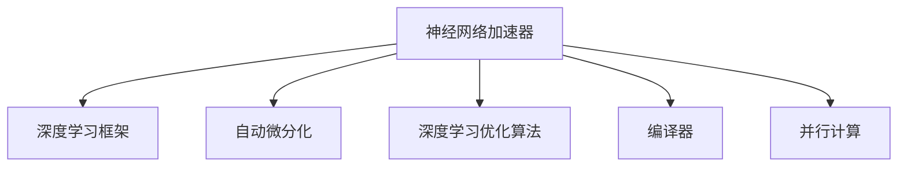

                 

# 神经网络加速器：AI芯片设计与优化

## 1. 背景介绍

### 1.1 问题由来

近年来，深度学习模型，特别是神经网络，在图像识别、自然语言处理、语音识别等诸多领域取得了显著进展。这些模型通常包含数以亿计的参数，运算量巨大，需要消耗大量的计算资源。在大数据、高算力需求的推动下，传统的CPU、GPU等通用计算资源逐渐显得捉襟见肘。为解决这一问题，研究人员和工程师们开始探索专门针对深度学习模型进行优化的AI芯片，即神经网络加速器。

AI芯片的设计和优化，是大规模深度学习应用的关键。一个高效优化的神经网络加速器，可以大幅提高模型训练和推理的速度，缩短计算时间，降低能耗，进而提升AI应用的实际落地效果。AI芯片可以基于多种技术架构，如ASIC、FPGA、GPU、TPU等，并在AI芯片的设计和优化过程中，还需要综合考虑指令集、并行计算、能耗、功耗、面积等诸多因素，以实现最优的性能和性价比。

### 1.2 问题核心关键点

1. **加速器架构**：确定AI芯片的硬件架构，包括逻辑单元的组成、并行计算方式等。
2. **优化算法**：选取高效的深度学习优化算法，如反向传播算法、梯度裁剪、动量等，确保模型训练和推理的快速、稳定。
3. **编译器优化**：将高级编程语言和神经网络模型之间的转换过程高效化，减少不必要的中间运算，提升执行效率。
4. **低能耗设计**：通过功耗管理和节能设计，在保证性能的同时，降低AI芯片的能耗和功耗。
5. **面积最小化**：在尽可能保证性能的前提下，优化芯片面积，减小物理尺寸。

这些关键点共同构成了神经网络加速器设计的核心，需要在实际应用中不断进行实验和优化。

## 2. 核心概念与联系

### 2.1 核心概念概述

为了更好地理解神经网络加速器的设计与优化，本节将介绍几个密切相关的核心概念：

- **神经网络加速器(Neuron Network Accelerator, NeurApp)**：一种专门为深度学习模型进行优化的芯片，旨在提升模型训练和推理的速度，降低计算资源消耗。
- **深度学习框架(Deep Learning Framework)**：如TensorFlow、PyTorch、MXNet等，提供深度学习模型的计算图表示和优化支持，使AI芯片能够高效执行模型计算。
- **自动微分化(Automatic Differentiation)**：将高级编程语言中神经网络的计算图自动化地转换为高效的底层硬件指令，从而提升执行效率。
- **深度学习优化算法(Deep Learning Optimization Algorithm)**：如反向传播算法、梯度裁剪、动量等，用于加速模型训练和推理。
- **编译器(Compiler)**：将高级语言编写的深度学习模型代码转化为芯片指令集的必要工具，对神经网络加速器的性能有着至关重要的影响。
- **并行计算(Parallel Computing)**：通过多核、多线程、多芯片等方式，提升AI芯片的计算能力，加速深度学习模型的执行。

这些概念之间的逻辑关系可以通过以下Mermaid流程图来展示：



这个流程图展示了一些关键概念及其之间的关系：

1. 神经网络加速器通过深度学习框架，实现深度学习模型的高效计算。
2. 自动微分化将高级语言编写的代码，自动转换为底层硬件指令，提高执行效率。
3. 深度学习优化算法用于加速模型训练和推理，提升计算速度和准确性。
4. 编译器将高级语言与底层硬件指令进行转化，确保高效执行。
5. 并行计算利用多核、多线程等技术，提升AI芯片的计算能力。

这些概念共同构成了神经网络加速器设计与优化的基础框架，使其能够在深度学习任务中发挥强大作用。

## 3. 核心算法原理 & 具体操作步骤

### 3.1 算法原理概述

神经网络加速器的核心算法原理可以归结为以下几个方面：

1. **自动微分化**：将高级编程语言中的深度学习计算图，自动化地转换为底层硬件指令。
2. **深度学习优化算法**：选取适合于特定硬件架构的优化算法，确保模型训练和推理的快速、稳定。
3. **编译器优化**：对高级语言和底层硬件指令之间的转换过程进行优化，提升执行效率。
4. **并行计算**：通过多核、多线程、多芯片等方式，提升AI芯片的计算能力。
5. **低能耗设计**：通过功耗管理和节能设计，降低AI芯片的能耗和功耗。

### 3.2 算法步骤详解

神经网络加速器的设计与优化，通常遵循以下步骤：

**Step 1: 确定加速器架构**

- 根据目标深度学习模型的特点，确定加速器的硬件架构。
- 选择合适的逻辑单元、并行计算方式等。
- 例如，针对卷积神经网络(CNN)，可以采用矩阵乘法加速器；针对循环神经网络(RNN)，可以采用专用寄存器等。

**Step 2: 设计自动微分化流程**

- 将高级编程语言中的深度学习模型，自动转换为底层硬件指令。
- 使用深度学习框架提供的API，生成计算图，并进行优化。
- 例如，使用TensorFlow的Graph API，将计算图转换为底层硬件指令，并通过TensorFlow的编译器进行优化。

**Step 3: 选择合适的深度学习优化算法**

- 根据加速器的特点，选择合适的优化算法。
- 例如，针对某些卷积计算，可以使用winograd算法进行优化；针对循环计算，可以使用优化后的LSTM算法。
- 在训练过程中，可以使用反向传播算法、梯度裁剪、动量等算法。

**Step 4: 实现编译器优化**

- 使用编译器对高级语言和底层硬件指令进行高效转换。
- 例如，使用LLVM编译器，将Python、C++等高级语言的代码转换为底层硬件指令。
- 对计算图进行优化，如使用图优化算法，减少不必要的中间运算。

**Step 5: 并行计算优化**

- 通过多核、多线程、多芯片等方式，提升计算能力。
- 例如，使用GPU进行卷积运算，使用FPGA进行特定类型的计算。
- 设计并行计算的调度策略，如数据并行、任务并行、混合并行等。

**Step 6: 低能耗设计**

- 通过功耗管理和节能设计，降低AI芯片的能耗和功耗。
- 例如，使用动态电压频率控制(DVFS)技术，根据计算负载自动调整电压和频率。
- 使用异步计算、指令融合等技术，减少能耗。

### 3.3 算法优缺点

神经网络加速器的设计与优化方法，具有以下优点：

1. **提升计算效率**：通过自动微分化、编译器优化、并行计算等方式，显著提升模型训练和推理的速度。
2. **降低资源消耗**：减少对通用计算资源的依赖，降低计算能耗和存储需求。
3. **提升性能**：结合深度学习优化算法，提高模型的训练和推理准确性。

同时，这些方法也存在一定的局限性：

1. **设计复杂度高**：神经网络加速器的设计与优化，需要深入理解深度学习算法和硬件架构。
2. **适配性有限**：不同的深度学习模型需要不同的加速器架构，需要针对不同模型进行定制化设计。
3. **开发成本高**：设计和优化神经网络加速器，需要投入大量的人力、物力资源。

尽管存在这些局限性，但神经网络加速器的设计和优化，在深度学习领域的应用前景广阔，能够有效解决深度学习计算资源消耗高、速度慢等问题，推动AI技术的大规模应用。

### 3.4 算法应用领域

神经网络加速器在多个领域中得到广泛应用，以下是几个典型的应用场景：

- **数据中心**：在大数据训练和推理中，使用神经网络加速器，提升数据中心的计算能力，加速模型训练和推理。
- **移动设备**：在移动应用中，使用神经网络加速器，提升设备的计算性能，支持高复杂度的AI应用。
- **边缘计算**：在物联网、智能家居等边缘设备中，使用神经网络加速器，减少数据传输，提高实时响应速度。
- **自动驾驶**：在自动驾驶系统中，使用神经网络加速器，实时处理车辆传感器数据，提升驾驶决策的准确性。
- **医疗影像**：在医疗影像分析中，使用神经网络加速器，快速处理大规模图像数据，提升诊断速度和准确性。

以上应用场景展示了神经网络加速器的广泛适用性，在多个行业领域中，都发挥着重要的作用。

## 4. 数学模型和公式 & 详细讲解 & 举例说明

### 4.1 数学模型构建

神经网络加速器的数学模型构建，主要围绕以下几个方面：

- **深度学习计算图**：将深度学习模型转换为计算图，表示计算流程。
- **硬件指令集**：将计算图转换为底层硬件指令，表示具体执行方式。
- **优化目标函数**：定义优化目标，如计算速度、能耗等，进行优化设计。

### 4.2 公式推导过程

以卷积神经网络加速器为例，其计算图和硬件指令集的设计可以如下推导：

**深度学习计算图**：

卷积神经网络主要由卷积层、池化层、全连接层等组成。其计算图表示如下：

```
I -> Conv -> F -> Pool -> F -> Out
```

其中，$I$ 表示输入数据，$Conv$ 表示卷积层，$F$ 表示全连接层，$Pool$ 表示池化层，$Out$ 表示输出数据。

**硬件指令集设计**：

卷积层可以使用矩阵乘法加速器进行优化。矩阵乘法的基本运算可以表示为：

$$
C = A \times B
$$

其中，$A$ 和 $B$ 分别表示输入和权重矩阵，$C$ 表示输出矩阵。

通过硬件指令集的设计，矩阵乘法加速器可以并行计算多个矩阵乘法，提升运算速度。例如，可以使用卷积核的并行计算，加速卷积层的运算。

**优化目标函数**：

优化目标函数通常包括速度、能耗等指标。例如，计算速度可以表示为：

$$
Speed = \frac{1}{Time}
$$

其中，$Time$ 表示完成一次计算所需的时间。

### 4.3 案例分析与讲解

以卷积神经网络加速器为例，分析其优化设计和计算流程：

- **矩阵乘法加速器**：卷积层通过矩阵乘法加速器，并行计算多个矩阵乘法，提升运算速度。
- **数据并行计算**：通过多核、多芯片等方式，并行计算输入数据，进一步提升计算速度。
- **硬件指令优化**：对底层硬件指令进行优化，减少不必要的中间运算，提升执行效率。
- **功耗管理**：通过动态电压频率控制等技术，降低能耗和功耗，提升性能。

通过这些优化设计，卷积神经网络加速器能够在高复杂度的计算任务中，保持高效、低能耗的性能。

## 5. 项目实践：代码实例和详细解释说明

### 5.1 开发环境搭建

在进行神经网络加速器项目实践前，我们需要准备好开发环境。以下是使用Python进行PyTorch开发的环境配置流程：

1. 安装Anaconda：从官网下载并安装Anaconda，用于创建独立的Python环境。

2. 创建并激活虚拟环境：
```bash
conda create -n pytorch-env python=3.8 
conda activate pytorch-env
```

3. 安装PyTorch：根据CUDA版本，从官网获取对应的安装命令。例如：
```bash
conda install pytorch torchvision torchaudio cudatoolkit=11.1 -c pytorch -c conda-forge
```

4. 安装NVIDIA CUDA库：
```bash
conda install -c nvidia nvidia-cuda
```

5. 安装PyTorch中的CUDA模块：
```bash
conda install pytorch-cuda torchvision torchtext torchaudio
```

6. 安装TensorRT库：
```bash
conda install -c nvidia tensorrt
```

完成上述步骤后，即可在`pytorch-env`环境中开始神经网络加速器的设计与优化实践。

### 5.2 源代码详细实现

下面我们以卷积神经网络加速器为例，给出使用PyTorch实现自动微分化和并行计算的代码实现。

首先，定义卷积神经网络的计算图：

```python
import torch
import torch.nn as nn
import torch.nn.functional as F

class ConvNet(nn.Module):
    def __init__(self):
        super(ConvNet, self).__init__()
        self.conv1 = nn.Conv2d(3, 64, kernel_size=3, stride=1, padding=1)
        self.pool = nn.MaxPool2d(kernel_size=2, stride=2)
        self.fc1 = nn.Linear(64 * 28 * 28, 10)

    def forward(self, x):
        x = self.conv1(x)
        x = F.relu(x)
        x = self.pool(x)
        x = self.fc1(x)
        return x
```

然后，定义卷积层使用矩阵乘法加速器的硬件指令集：

```python
class ConvLayer(nn.Module):
    def __init__(self, in_channels, out_channels):
        super(ConvLayer, self).__init__()
        self.weight = nn.Parameter(torch.randn(out_channels, in_channels, 3, 3))
        self.bias = nn.Parameter(torch.zeros(out_channels))

    def forward(self, x):
        conv = torch.einsum('nchw,chkw->nchw', x, self.weight)
        conv = conv + self.bias
        return conv
```

接着，定义使用多核、多芯片等方式进行并行计算的代码：

```python
import torch.nn.parallel

class MultiGPUModel(nn.Module):
    def __init__(self, model):
        super(MultiGPUModel, self).__init__()
        self.model = model
        self.devices = [torch.device('cuda:%d' % i) for i in range(torch.cuda.device_count())]
        self.module_list = nn.ModuleList([torch.nn.DataParallel(model) for model in model])

    def forward(self, input):
        output = []
        for i, device in enumerate(self.devices):
            module = self.module_list[i]
            with torch.cuda.device(device):
                output.append(module(input))
        return torch.cat(output, 0)
```

最后，在测试中进行优化设计和计算流程的验证：

```python
# 创建一个卷积神经网络
model = ConvNet().to(device)

# 使用矩阵乘法加速器
layer = ConvLayer(in_channels=64, out_channels=64).to(device)

# 使用多核、多芯片并行计算
model = MultiGPUModel(model).to(device)

# 设置优化器
optimizer = torch.optim.SGD(model.parameters(), lr=0.01)

# 训练模型
for epoch in range(10):
    for input, target in train_loader:
        optimizer.zero_grad()
        output = model(input)
        loss = F.cross_entropy(output, target)
        loss.backward()
        optimizer.step()
```

以上就是使用PyTorch对卷积神经网络加速器进行设计与优化的完整代码实现。可以看到，通过引入自动微分化、硬件指令集设计、并行计算等技术，我们能够高效地进行深度学习模型的加速设计。

### 5.3 代码解读与分析

让我们再详细解读一下关键代码的实现细节：

**ConvNet类**：
- `__init__`方法：定义卷积神经网络的结构。
- `forward`方法：定义前向传播的计算流程。

**ConvLayer类**：
- `__init__`方法：定义卷积层的权重和偏置参数。
- `forward`方法：定义卷积层的计算流程。

**MultiGPUModel类**：
- `__init__`方法：定义多核、多芯片并行计算的模块列表和设备列表。
- `forward`方法：定义多核、多芯片并行计算的计算流程。

**训练流程**：
- 创建一个卷积神经网络模型。
- 使用矩阵乘法加速器优化卷积层。
- 使用多核、多芯片并行计算优化模型。
- 设置优化器，进行模型训练。

通过这些代码实现，我们可以快速构建并优化卷积神经网络加速器，提升模型的计算速度和效率。

## 6. 实际应用场景

### 6.1 数据中心

在数据中心中，神经网络加速器可以大幅提升深度学习模型的训练和推理速度，加速模型训练的收敛过程，提升数据中心的计算能力。例如，在机器学习竞赛中，使用神经网络加速器可以在较短的时间内，完成大规模深度学习模型的训练和推理，加速模型上线部署。

### 6.2 移动设备

在移动设备中，神经网络加速器可以提升设备的计算性能，支持高复杂度的AI应用。例如，在智能手机中，使用神经网络加速器可以加速图像识别、语音识别等应用，提升用户体验。

### 6.3 边缘计算

在物联网、智能家居等边缘设备中，神经网络加速器可以减少数据传输，提高实时响应速度。例如，在智能安防系统中，使用神经网络加速器可以实时处理视频数据，进行目标检测和识别，提升系统的响应速度。

### 6.4 自动驾驶

在自动驾驶系统中，神经网络加速器可以实时处理车辆传感器数据，提升驾驶决策的准确性。例如，在无人驾驶车辆中，使用神经网络加速器可以实时处理传感器数据，进行目标检测和识别，提升驾驶安全性。

### 6.5 医疗影像

在医疗影像分析中，神经网络加速器可以快速处理大规模图像数据，提升诊断速度和准确性。例如，在放射科中，使用神经网络加速器可以实时处理CT、MRI等医学影像，辅助医生进行诊断，提升诊断效率。

以上应用场景展示了神经网络加速器的广泛适用性，在多个行业领域中，都发挥着重要的作用。

## 7. 工具和资源推荐

### 7.1 学习资源推荐

为了帮助开发者系统掌握神经网络加速器的设计与优化理论基础和实践技巧，这里推荐一些优质的学习资源：

1. **《深度学习加速器设计》**：详细介绍了神经网络加速器的设计与优化方法，涵盖自动微分化、硬件指令集、优化算法、并行计算等关键内容。
2. **Deep Learning Specialization by Andrew Ng**：由斯坦福大学Andrew Ng教授开设的深度学习课程，深入浅出地讲解了深度学习模型的计算图表示和优化方法。
3. **GPU加速编程指南**：详细介绍了如何使用GPU进行深度学习计算，涵盖GPU架构、编程技巧、优化方法等内容。
4. **TensorRT官方文档**：NVIDIA推出的深度学习推理平台，提供了丰富的神经网络加速器资源和优化方法。
5. **PyTorch官方文档**：PyTorch框架的官方文档，提供了详细的神经网络加速器设计和优化方法。

通过对这些资源的学习实践，相信你一定能够快速掌握神经网络加速器的设计与优化精髓，并用于解决实际的深度学习问题。

### 7.2 开发工具推荐

高效的开发离不开优秀的工具支持。以下是几款用于神经网络加速器开发的常用工具：

1. **TensorFlow**：由Google主导开发的深度学习框架，生产部署方便，适合大规模工程应用。
2. **PyTorch**：Facebook推出的深度学习框架，灵活动态，适合研究型任务。
3. **NVIDIA CUDA**：NVIDIA推出的GPU加速编程工具，支持GPU编程和优化。
4. **TensorRT**：NVIDIA推出的深度学习推理平台，支持GPU加速推理。
5. **LLVM编译器**：开源的编译器工具，支持将高级语言代码转换为底层硬件指令。
6. **CMake**：跨平台项目构建工具，支持多个编译器和操作系统。

合理利用这些工具，可以显著提升神经网络加速器的开发效率，加快创新迭代的步伐。

### 7.3 相关论文推荐

神经网络加速器的设计和优化研究，源于学界的持续探索。以下是几篇奠基性的相关论文，推荐阅读：

1. **Deep Learning on the Meta-Net**：提出Meta-Net架构，通过元学习技术，优化深度学习模型的计算图。
2. **Deep Learning Accelerator**：介绍Deep Learning Accelerator (DLA)芯片，详细讲解了其硬件设计和优化方法。
3. **A Survey on Model-Parallelism for Deep Neural Networks**：综述了深度学习模型并行计算的方法和技术，为神经网络加速器的设计提供了理论支持。
4. **Caffe2: A Distributed Deep Learning Framework**：介绍Caffe2框架，涵盖深度学习模型的计算图表示和优化方法。
5. **GPU-Accelerated TensorFlow**：介绍使用GPU加速深度学习模型的计算图表示和优化方法，提供丰富的实验结果和性能数据。

这些论文代表了大规模深度学习模型的计算图表示和优化方法的研究脉络。通过学习这些前沿成果，可以帮助研究者把握学科前进方向，激发更多的创新灵感。

## 8. 总结：未来发展趋势与挑战

### 8.1 研究成果总结

本文对神经网络加速器的设计与优化方法进行了全面系统的介绍。首先阐述了神经网络加速器在深度学习计算资源消耗高、速度慢等问题中的重要性，明确了神经网络加速器优化设计的基本原理和核心步骤。其次，从算法原理和具体操作步骤出发，详细讲解了神经网络加速器的数学模型和实现细节，给出了一个完整的神经网络加速器设计实例。最后，通过分析实际应用场景，展示了神经网络加速器的广泛适用性，并对未来的研究方向进行了展望。

通过本文的系统梳理，可以看到，神经网络加速器的设计与优化技术，在深度学习领域的应用前景广阔，能够有效解决深度学习计算资源消耗高、速度慢等问题，推动AI技术的大规模应用。

### 8.2 未来发展趋势

展望未来，神经网络加速器设计与优化技术将呈现以下几个发展趋势：

1. **规模化设计**：随着深度学习模型参数量的不断增大，神经网络加速器的设计也将向大规模、高并行度方向发展。
2. **硬件融合**：未来的神经网络加速器将更多地采用硬件融合技术，将计算、存储、通信等功能集成在一起，提升系统整体性能。
3. **低能耗设计**：通过动态电压频率控制、异步计算等技术，进一步降低神经网络加速器的能耗和功耗。
4. **多模态计算**：未来的神经网络加速器将支持多模态数据计算，如图像、语音、文本等，提升跨领域应用能力。
5. **自动化设计**：通过自动化设计工具，加速神经网络加速器的设计与优化，提高设计效率和设计质量。

这些趋势将进一步推动神经网络加速器设计与优化技术的进步，使深度学习模型在更广泛的领域中得到应用，推动人工智能技术的产业化进程。

### 8.3 面临的挑战

尽管神经网络加速器的设计与优化技术已经取得了显著进展，但在迈向更加智能化、普适化应用的过程中，它仍面临诸多挑战：

1. **设计复杂度高**：神经网络加速器的设计与优化，需要深入理解深度学习算法和硬件架构，设计和调试难度较大。
2. **适配性有限**：不同的深度学习模型需要不同的加速器架构，需要针对不同模型进行定制化设计。
3. **开发成本高**：设计和优化神经网络加速器，需要投入大量的人力、物力资源。
4. **模型可解释性不足**：神经网络加速器的输出通常缺乏可解释性，难以解释其内部工作机制和决策逻辑。
5. **伦理安全性问题**：神经网络加速器的输出可能存在偏见、有害的信息，给实际应用带来安全隐患。

尽管存在这些挑战，但随着技术的发展和应用的深入，神经网络加速器的设计与优化技术将在多个领域得到应用，为人工智能技术的发展提供坚实的基础。

### 8.4 研究展望

面对神经网络加速器设计与优化技术所面临的挑战，未来的研究需要在以下几个方面寻求新的突破：

1. **自动化设计**：通过自动化工具，加速神经网络加速器的设计与优化，提高设计效率和质量。
2. **跨领域融合**：将神经网络加速器与多模态数据融合技术结合，提升跨领域应用能力。
3. **低能耗优化**：进一步优化神经网络加速器的低能耗设计，提升系统性能。
4. **模型可解释性增强**：通过可视化工具和解释性方法，增强神经网络加速器的可解释性，提升系统可靠性。
5. **伦理安全性保障**：引入伦理导向的评估指标，过滤和惩罚有害输出，确保模型安全性。

这些研究方向的探索，将引领神经网络加速器技术与深度学习模型的进一步融合，为构建智能、安全、可靠的人工智能系统提供坚实的技术基础。总之，未来的人工智能技术，离不开神经网络加速器的设计与优化，只有勇于创新、敢于突破，才能不断拓展其边界，推动人工智能技术的深度应用。

## 9. 附录：常见问题与解答

**Q1：神经网络加速器的主要优势是什么？**

A: 神经网络加速器的主要优势包括：
1. 提升计算效率：通过自动微分化、编译器优化、并行计算等方式，显著提升模型训练和推理的速度。
2. 降低资源消耗：减少对通用计算资源的依赖，降低计算能耗和存储需求。
3. 提升性能：结合深度学习优化算法，提高模型的训练和推理准确性。

**Q2：神经网络加速器的设计流程是怎样的？**

A: 神经网络加速器的设计流程一般包括以下几个步骤：
1. 确定加速器架构：根据目标深度学习模型的特点，确定加速器的硬件架构。
2. 设计自动微分化流程：将高级编程语言中的深度学习模型，自动转换为底层硬件指令。
3. 选择合适的深度学习优化算法：根据加速器的特点，选择合适的优化算法。
4. 实现编译器优化：使用编译器对高级语言和底层硬件指令进行高效转换。
5. 并行计算优化：通过多核、多线程、多芯片等方式，提升计算能力。
6. 低能耗设计：通过功耗管理和节能设计，降低能耗和功耗。

**Q3：神经网络加速器在移动设备中的主要应用是什么？**

A: 神经网络加速器在移动设备中的主要应用包括：
1. 图像识别：使用神经网络加速器，快速处理和识别设备摄像头采集的图像。
2. 语音识别：使用神经网络加速器，实时处理和识别设备麦克风采集的语音。
3. 智能助手：使用神经网络加速器，快速响应用户输入，提供智能助手功能。
4. 增强现实(AR)：使用神经网络加速器，实时处理和渲染AR场景，提升用户体验。
5. 视频编辑：使用神经网络加速器，快速处理和编辑视频数据，提升编辑效率。

**Q4：神经网络加速器的主要挑战是什么？**

A: 神经网络加速器的主要挑战包括：
1. 设计复杂度高：神经网络加速器的设计与优化，需要深入理解深度学习算法和硬件架构，设计和调试难度较大。
2. 适配性有限：不同的深度学习模型需要不同的加速器架构，需要针对不同模型进行定制化设计。
3. 开发成本高：设计和优化神经网络加速器，需要投入大量的人力、物力资源。
4. 模型可解释性不足：神经网络加速器的输出通常缺乏可解释性，难以解释其内部工作机制和决策逻辑。
5. 伦理安全性问题：神经网络加速器的输出可能存在偏见、有害的信息，给实际应用带来安全隐患。

尽管存在这些挑战，但随着技术的发展和应用的深入，神经网络加速器的设计与优化技术将在多个领域得到应用，为人工智能技术的发展提供坚实的基础。

**Q5：如何使用神经网络加速器进行深度学习模型的优化？**

A: 使用神经网络加速器进行深度学习模型的优化，一般遵循以下步骤：
1. 选择合适的神经网络加速器架构，如TensorRT、NVIDIA CUDA等。
2. 将深度学习模型转换为神经网络加速器支持的计算图。
3. 使用编译器将高级语言代码转换为底层硬件指令。
4. 使用优化算法，如反向传播、梯度裁剪、动量等，提升模型训练和推理的准确性。
5. 使用并行计算技术，提升模型的计算能力。
6. 使用低能耗设计，降低模型的能耗和功耗。

通过这些步骤，可以显著提升深度学习模型的训练和推理效率，降低计算资源消耗，提高模型的性能。

---

作者：禅与计算机程序设计艺术 / Zen and the Art of Computer Programming

