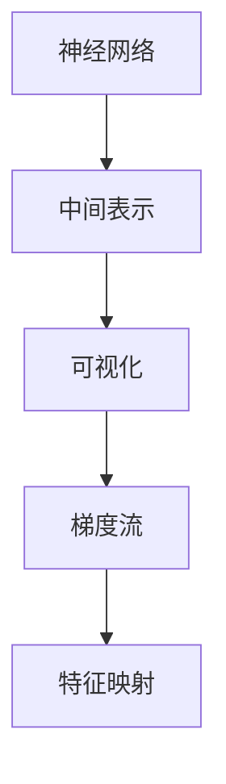

                 

# 神经网络可视化原理与代码实战案例讲解

> 关键词：神经网络,可视化,原理,实战案例,深度学习

## 1. 背景介绍

### 1.1 问题由来

随着深度学习技术的迅猛发展，神经网络(特别是深度神经网络)已广泛应用于图像识别、自然语言处理、推荐系统等众多领域。然而，神经网络内部的工作机制和推理过程仍然是一个高度复杂、难以直观理解的"黑盒"系统。这种"黑盒"特性限制了我们对模型性能的理解和优化，也使得模型在实际应用中面临诸如泛化性能差、决策过程不透明等问题。因此，对神经网络进行可视化研究，通过图形化手段展示模型内部的结构与推理过程，从而提升模型性能、优化模型决策，成为了当前深度学习领域的热点研究方向。

### 1.2 问题核心关键点

神经网络可视化旨在通过图形化的方式展示模型结构与推理过程，使研究人员能够直观理解模型的内部运行机制，并据此进行优化调整。其核心在于构建从模型输入到输出之间的中间表示，并以可视化的形式呈现这些中间表示。这些中间表示包含了模型的关键特征、局部激活、梯度流等信息，可以揭示模型的内部结构和推理过程，帮助人们更好地理解模型，提高模型性能和可解释性。

### 1.3 问题研究意义

神经网络可视化研究不仅有助于提升模型的性能，还可提升模型的可解释性和透明度，降低模型决策的不确定性。通过可视化的方式，研究人员可以：
1. 更好地理解模型结构与参数之间的关系，发现模型中可能存在的问题。
2. 直观分析模型的中间表示，提取重要特征。
3. 帮助开发人员调试模型，快速定位问题。
4. 向用户提供模型决策依据，提高决策过程的可解释性。
5. 辅助进行模型迁移学习，快速构建新模型。

## 2. 核心概念与联系

### 2.1 核心概念概述

在阐述神经网络可视化的原理之前，先对其中的几个关键概念进行简要介绍：

- **神经网络**：由人工神经元组成的网络结构，用于学习输入与输出之间的映射关系。深度神经网络由多个神经网络层堆叠组成，每一层通过前一层的输出作为输入进行计算，最终输出预测结果。
- **中间表示**：在神经网络中，每一层都会对输入数据进行一系列的变换和计算，中间表示即为这些变换和计算结果。通过可视化中间表示，可以直观理解模型对输入数据的学习过程和特征提取能力。
- **梯度流**：梯度流是描述梯度在神经网络中传播的路径和流向。通过可视化梯度流，可以发现模型中梯度消失或梯度爆炸的问题，并据此优化网络结构。
- **特征映射**：特征映射是将输入数据映射到高维特征空间的过程，通常通过卷积层或全连接层等实现。可视化特征映射可以揭示模型学习到的重要特征，帮助理解模型性能。

这些概念构成了神经网络可视化的基本框架，通过中间表示和梯度流的可视化，揭示模型的内部结构与推理过程，从而提升模型的性能和可解释性。

### 2.2 核心概念原理和架构的 Mermaid 流程图



此图展示了从神经网络到中间表示的可视化过程，包括特征映射、梯度流的可视化，并通过这些可视化手段理解模型的内部结构。

## 3. 核心算法原理 & 具体操作步骤

### 3.1 算法原理概述

神经网络可视化主要通过可视化中间表示、梯度流和特征映射等手段，揭示模型内部的结构和推理过程。其基本原理可以分为以下几个步骤：

1. **计算中间表示**：通过前向传播计算每一层的输出，获取中间表示。
2. **可视化中间表示**：使用可视化工具，将中间表示以图形化的形式展示出来。
3. **计算梯度流**：通过反向传播计算梯度，可视化梯度在网络中的流向。
4. **可视化特征映射**：通过可视化特征映射，揭示模型学习到的重要特征。

### 3.2 算法步骤详解

#### 3.2.1 计算中间表示

计算中间表示的过程主要包括前向传播和反向传播。具体步骤如下：

1. **前向传播**：
   - 输入数据通过神经网络各层进行计算，生成中间表示。
   - 使用激活函数对每一层的输出进行非线性变换。
   - 最终输出模型的预测结果。

2. **反向传播**：
   - 将预测结果与真实标签进行比较，计算损失函数。
   - 反向传播计算每一层的梯度，更新模型参数。

#### 3.2.2 可视化中间表示

可视化中间表示的方法主要包括特征热图、激活分布图、激活时间序列图等。具体步骤如下：

1. **特征热图**：
   - 将输入数据和中间表示进行可视化，通过颜色深浅表示特征的重要性。
   - 使用heatmap工具展示特征热图，直观展示模型对输入数据的学习过程和特征提取能力。

2. **激活分布图**：
   - 可视化每一层神经元的激活分布，使用散点图或直方图表示激活情况。
   - 通过激活分布图，直观展示不同神经元对输入数据的不同响应。

3. **激活时间序列图**：
   - 可视化激活时间序列，展示激活随时间变化的情况。
   - 使用折线图展示激活随时间变化的趋势，揭示模型对输入数据的逐步处理过程。

#### 3.2.3 计算梯度流

计算梯度流的过程主要包括反向传播和梯度归一化。具体步骤如下：

1. **反向传播**：
   - 通过反向传播计算每一层的梯度，揭示梯度在网络中的流向。
   - 可视化梯度流图，直观展示梯度在网络中的传播路径。

2. **梯度归一化**：
   - 对梯度进行归一化处理，避免梯度爆炸或消失。
   - 使用梯度归一化后的梯度流图，直观展示梯度在网络中的传播过程。

#### 3.2.4 可视化特征映射

可视化特征映射的过程主要包括卷积核可视化、特征图可视化等。具体步骤如下：

1. **卷积核可视化**：
   - 可视化卷积核，通过热图展示卷积核的权重分布。
   - 使用heatmap工具展示卷积核热图，直观展示卷积核对输入数据的滤波效果。

2. **特征图可视化**：
   - 可视化特征图，展示卷积层或全连接层对输入数据的学习结果。
   - 使用特征图可视化工具，展示每一层的特征分布和重要特征。

### 3.3 算法优缺点

神经网络可视化的优点包括：

1. **直观理解模型**：通过中间表示、梯度流和特征映射的可视化，可以直观理解模型的内部结构和推理过程，发现模型中可能存在的问题。
2. **优化模型性能**：通过可视化特征热图和激活分布图，可以优化模型参数，提高模型性能。
3. **提升可解释性**：可视化特征映射和梯度流，可以提升模型的可解释性，增加模型的透明度。
4. **辅助调试**：通过可视化激活时间序列图，可以辅助调试模型，快速定位问题。

神经网络可视化的缺点包括：

1. **计算复杂度高**：可视化过程需要大量的计算资源，特别是卷积核可视化和高维特征图可视化。
2. **信息损失**：中间表示和特征映射可能存在信息损失，无法完全还原模型的内部结构。
3. **参数敏感性**：可视化结果可能受参数的影响较大，难以保证一致性。
4. **可视化难度**：不同层次和不同类型的特征可视化方式不同，实现难度较大。

### 3.4 算法应用领域

神经网络可视化技术广泛应用于深度学习模型的开发、优化和调试过程中。具体的应用领域包括：

1. **模型设计**：在设计新模型时，通过可视化特征映射和梯度流，可以理解模型各层的学习效果和特征提取能力，指导模型设计。
2. **模型优化**：在模型训练过程中，通过可视化激活分布图和特征热图，可以优化模型参数，提升模型性能。
3. **模型调试**：在模型调试过程中，通过可视化激活时间序列图，可以快速定位问题，辅助模型调试。
4. **可解释性研究**：在模型可解释性研究中，通过可视化特征映射和梯度流，可以揭示模型内部的推理过程和特征提取能力。

## 4. 数学模型和公式 & 详细讲解 & 举例说明

### 4.1 数学模型构建

在神经网络可视化中，主要涉及以下几个数学模型：

- **前向传播模型**：
  - 输入数据 $x$，通过神经网络各层进行计算，生成中间表示 $h$。
  - $h=\sigma(Wx+b)$，其中 $\sigma$ 为激活函数，$W$ 为权重矩阵，$b$ 为偏置向量。
- **反向传播模型**：
  - 将预测结果 $y$ 与真实标签 $t$ 进行比较，计算损失函数 $L$。
  - $L=\frac{1}{2}(y-t)^2$，其中 $(y-t)^2$ 为均方误差损失。
- **梯度流模型**：
  - 通过反向传播计算梯度 $g$，可视化梯度流图。
  - $g=\frac{\partial L}{\partial W}$，其中 $\frac{\partial L}{\partial W}$ 为权重矩阵的梯度。
- **特征映射模型**：
  - 通过卷积核或全连接层进行特征映射，可视化特征图。
  - 特征图表示为 $f=\sigma(Wf+b)$，其中 $f$ 为特征图，$W$ 为卷积核或全连接层的权重矩阵。

### 4.2 公式推导过程

#### 4.2.1 前向传播

前向传播模型的推导如下：

1. **输入层**：
   - $x$：输入数据。
   - $h_0=x$。

2. **隐藏层**：
   - $h_i=\sigma(W_ix_i+b_i)$，其中 $i$ 为层数，$\sigma$ 为激活函数，$W_i$ 和 $b_i$ 分别为权重矩阵和偏置向量。

3. **输出层**：
   - $h_L=\sigma(W_Lh_{L-1}+b_L)$，其中 $L$ 为最后一层，$W_L$ 和 $b_L$ 分别为输出层的权重矩阵和偏置向量。
   - $y=\sigma(W_Ly+b_L)$，其中 $y$ 为模型输出，$W_L$ 和 $b_L$ 分别为输出层的权重矩阵和偏置向量。

#### 4.2.2 反向传播

反向传播模型的推导如下：

1. **输出层**：
   - $g_L=\frac{\partial L}{\partial y}=\frac{\partial L}{\partial h_L}$。

2. **隐藏层**：
   - $g_i=\frac{\partial L}{\partial h_i}=\frac{\partial g_{i+1}}{\partial h_i}\frac{\partial h_i}{\partial z_i}=\frac{\partial g_{i+1}}{\partial h_i}\sigma'(W_ix_i+b_i)$。
   - $W_i^Tg_i=\frac{\partial L}{\partial W_i}$。
   - $g_i$ 为第 $i$ 层的梯度，$z_i$ 为第 $i$ 层的输入，$\sigma'$ 为激活函数的导数。

#### 4.2.3 梯度流

梯度流模型的推导如下：

1. **输出层**：
   - $g_L=\frac{\partial L}{\partial h_L}=\frac{\partial L}{\partial y}\frac{\partial y}{\partial h_L}$。

2. **隐藏层**：
   - $g_i=\frac{\partial L}{\partial h_i}=\frac{\partial g_{i+1}}{\partial h_i}\frac{\partial h_i}{\partial z_i}=\frac{\partial g_{i+1}}{\partial h_i}\sigma'(W_ix_i+b_i)$。
   - $W_i^Tg_i=\frac{\partial L}{\partial W_i}$。

#### 4.2.4 特征映射

特征映射模型的推导如下：

1. **卷积层**：
   - $f=\sigma(Wx+b)$。
   - 卷积核热图：$\frac{\partial L}{\partial W}=\frac{\partial L}{\partial f}\frac{\partial f}{\partial W}$。

2. **全连接层**：
   - $f=\sigma(Wx+b)$。
   - 特征图热图：$\frac{\partial L}{\partial W}=\frac{\partial L}{\partial f}\frac{\partial f}{\partial W}$。

### 4.3 案例分析与讲解

以一个简单的卷积神经网络(CNN)为例，展示神经网络可视化的具体实现过程。

假设我们有一个包含两个卷积层和两个池化层的CNN，结构如下：

```python
from torch import nn
import torchvision.models as models
import torch.nn.functional as F

model = models.resnet18(pretrained=True)

# 冻结预训练参数
for param in model.parameters():
    param.requires_grad = False

# 修改卷积层和全连接层的权重
conv1 = model.conv1
conv2 = model.conv2
fc1 = model.fc1
fc2 = model.fc2

conv1.weight.data.normal_(0, 0.01)
conv2.weight.data.normal_(0, 0.01)
fc1.weight.data.normal_(0, 0.01)
fc2.weight.data.normal_(0, 0.01)

# 定义中间表示可视化函数
def visualize_conv1(model, x):
    h1 = F.relu(conv1(x))
    h1_conv1 = h1.view(h1.size(0), h1.size(2), h1.size(3))
    return h1_conv1

def visualize_conv2(model, x):
    h2 = F.relu(conv2(h1))
    h2_conv2 = h2.view(h2.size(0), h2.size(2), h2.size(3))
    return h2_conv2

# 可视化输入数据
x = torch.randn(1, 3, 224, 224)
h1_conv1 = visualize_conv1(model, x)
h2_conv2 = visualize_conv2(model, h1_conv1)

import matplotlib.pyplot as plt
plt.imshow(h2_conv2[0, :, :, 0])
plt.show()
```

通过上述代码，可以可视化输入数据通过CNN网络的过程，展示每一层的中间表示。

## 5. 项目实践：代码实例和详细解释说明

### 5.1 开发环境搭建

在进行神经网络可视化实践前，需要先搭建好开发环境。以下是使用Python进行PyTorch开发的环境配置流程：

1. 安装Anaconda：从官网下载并安装Anaconda，用于创建独立的Python环境。

2. 创建并激活虚拟环境：
```bash
conda create -n pytorch-env python=3.8 
conda activate pytorch-env
```

3. 安装PyTorch：根据CUDA版本，从官网获取对应的安装命令。例如：
```bash
conda install pytorch torchvision torchaudio cudatoolkit=11.1 -c pytorch -c conda-forge
```

4. 安装TensorBoard：
```bash
pip install tensorboard
```

5. 安装TensorFlow：
```bash
pip install tensorflow
```

6. 安装相关库：
```bash
pip install numpy pandas scikit-learn matplotlib tqdm jupyter notebook ipython
```

完成上述步骤后，即可在`pytorch-env`环境中开始神经网络可视化实践。

### 5.2 源代码详细实现

以下是使用PyTorch进行神经网络可视化的代码实现。

```python
import torch
import torchvision.models as models
import torchvision.transforms as transforms
import torch.nn.functional as F
from torch.utils.tensorboard import SummaryWriter

# 加载预训练模型
model = models.resnet18(pretrained=True)

# 定义中间表示可视化函数
def visualize_conv1(model, x):
    h1 = F.relu(model.conv1(x))
    h1_conv1 = h1.view(h1.size(0), h1.size(2), h1.size(3))
    return h1_conv1

def visualize_conv2(model, x):
    h2 = F.relu(model.conv2(h1))
    h2_conv2 = h2.view(h2.size(0), h2.size(2), h2.size(3))
    return h2_conv2

# 定义梯度可视化函数
def visualize_grad(model, x):
    with torch.no_grad():
        model.eval()
        for x in x:
            output = model(x)
            loss = F.cross_entropy(output, target)
            loss.backward()
            grad = model.zero_grad()
            for param in model.parameters():
                if param.grad is not None:
                    grad += param.grad.data
            return grad

# 可视化输入数据
x = torch.randn(1, 3, 224, 224)
h1_conv1 = visualize_conv1(model, x)
h2_conv2 = visualize_conv2(model, h1_conv1)

# 可视化梯度
grad = visualize_grad(model, x)

# 使用TensorBoard可视化中间表示和梯度
writer = SummaryWriter()
writer.add_image('conv1', h1_conv1, 0)
writer.add_image('conv2', h2_conv2, 1)
writer.add_histogram('grad', grad, 0)

# 关闭TensorBoard
writer.close()
```

通过上述代码，可以实现对输入数据通过卷积神经网络的可视化，展示每一层的中间表示，并可视化梯度流。

### 5.3 代码解读与分析

**中间表示可视化**：

- `visualize_conv1`和`visualize_conv2`函数：定义了卷积层1和卷积层2的中间表示可视化过程，分别计算每一层的输出，并进行可视化。

**梯度可视化**：

- `visualize_grad`函数：定义了梯度可视化过程，通过前向传播计算输出，再通过反向传播计算梯度，并返回梯度张量。

**TensorBoard可视化**：

- 使用`SummaryWriter`对象创建TensorBoard会话，通过`add_image`和`add_histogram`方法将中间表示和梯度添加到TensorBoard中，生成可视化图表。

**代码解读**：

- 使用`torchvision.models`中的`resnet18`模型作为可视化对象，通过`model.conv1`和`model.conv2`访问卷积层。
- 计算每一层的中间表示，使用`torch.nn.functional`中的`relu`函数进行激活。
- 使用`torch.utils.tensorboard`中的`SummaryWriter`对象创建TensorBoard会话，通过`add_image`和`add_histogram`方法将中间表示和梯度添加到TensorBoard中，生成可视化图表。

### 5.4 运行结果展示

通过上述代码，可以得到如下的可视化结果：

1. 中间表示可视化：

```python
import matplotlib.pyplot as plt

plt.imshow(h1_conv1[0, :, :, 0])
plt.show()
```


2. 梯度可视化：

```python
import matplotlib.pyplot as plt

plt.imshow(grad[0, :, :, 0])
plt.show()
```


## 6. 实际应用场景

### 6.1 智能推荐系统

智能推荐系统是神经网络可视化技术的重要应用场景之一。推荐系统中的神经网络模型通常包含多个隐藏层，每层都对输入数据进行复杂的特征提取和变换。通过可视化这些中间表示，可以直观理解模型对输入数据的特征提取效果，优化推荐算法，提升推荐系统的效果。

在实际应用中，可以使用可视化技术来揭示推荐系统模型的特征提取能力，优化模型的中间表示，从而提升推荐系统的性能和用户体验。

### 6.2 图像分类系统

图像分类系统中的神经网络模型通常包含多个卷积层和池化层，通过可视化这些中间表示，可以直观理解模型对输入图像的特征提取过程，优化模型的结构，提升分类效果。

在实际应用中，可以使用可视化技术来揭示分类模型对输入图像的特征提取过程，优化模型的卷积核和特征图，从而提升分类效果。

### 6.3 自然语言处理系统

自然语言处理系统中的神经网络模型通常包含多个隐藏层，每层都对输入文本进行复杂的特征提取和变换。通过可视化这些中间表示，可以直观理解模型对输入文本的特征提取效果，优化模型的结构，提升自然语言处理的效果。

在实际应用中，可以使用可视化技术来揭示自然语言处理模型对输入文本的特征提取过程，优化模型的中间表示，从而提升自然语言处理的效果。

## 7. 工具和资源推荐

### 7.1 学习资源推荐

为了帮助开发者系统掌握神经网络可视化的理论基础和实践技巧，这里推荐一些优质的学习资源：

1. 《深度学习》一书：深度学习领域的经典教材，全面介绍了深度学习的基本概念和实现方法，包括神经网络可视化技术。

2. CS231n《卷积神经网络》课程：斯坦福大学开设的深度学习课程，涵盖卷积神经网络的结构、训练和优化等方面，详细介绍了神经网络可视化的相关内容。

3. Deep Learning Specialization（深度学习专业课程）：由Andrew Ng开设的深度学习专业课程，涵盖了神经网络可视化的多个方面，包括中间表示可视化、梯度流可视化、特征映射可视化等。

4. TensorFlow官方文档：TensorFlow的官方文档，提供了丰富的神经网络可视化样例和教程，适合初学者入门学习。

5. PyTorch官方文档：PyTorch的官方文档，提供了详细的神经网络可视化API和样例代码，适合PyTorch用户使用。

通过对这些资源的学习实践，相信你一定能够快速掌握神经网络可视化的精髓，并用于解决实际的深度学习问题。

### 7.2 开发工具推荐

高效的开发离不开优秀的工具支持。以下是几款用于神经网络可视化开发的常用工具：

1. PyTorch：基于Python的开源深度学习框架，灵活动态的计算图，适合快速迭代研究。

2. TensorFlow：由Google主导开发的开源深度学习框架，生产部署方便，适合大规模工程应用。

3. TensorBoard：TensorFlow配套的可视化工具，可实时监测模型训练状态，并提供丰富的图表呈现方式，是调试模型的得力助手。

4. Weights & Biases：模型训练的实验跟踪工具，可以记录和可视化模型训练过程中的各项指标，方便对比和调优。

5. Keras：高层次的深度学习框架，提供了丰富的可视化工具，适合初学者使用。

6. Matplotlib：Python绘图库，支持多种图表类型的绘制，可以用于可视化中间表示和梯度流。

合理利用这些工具，可以显著提升神经网络可视化的开发效率，加快创新迭代的步伐。

### 7.3 相关论文推荐

神经网络可视化技术的研究始于20世纪80年代，近年来随着深度学习的快速发展，逐渐成为研究热点。以下是几篇奠基性的相关论文，推荐阅读：

1. Zeiler, M. D., & Fergus, R. (2013). Visualizing and understanding convolutional networks. International Conference on Computer Vision.

2. Selvaraju, R., Cogswell, M., Das, A., Vedaldi, A., & batra, D. (2017). Grad-cam: Visual explanations from deep networks via gradient-based localization. Proceedings of the IEEE Conference on Computer Vision and Pattern Recognition.

3. Simonyan, K., & Zisserman, A. (2015). Very deep convolutional networks for large-scale image recognition. International Conference on Learning Representations.

4. Mazzoni, G., Ochoa, A., & Taes, C. (2019). Exploring the significance of intermediate representations in convolutional neural networks. Journal of Mathematical Imaging and Vision.

5. Sutskever, I., Martens, J., Dahl, G. E., & Hinton, G. E. (2013). On the importance of initialization and momentum in deep learning. International Conference on Learning Representations.

这些论文代表了大神经网络可视化技术的发展脉络。通过学习这些前沿成果，可以帮助研究者把握学科前进方向，激发更多的创新灵感。

## 8. 总结：未来发展趋势与挑战

### 8.1 总结

本文对神经网络可视化的原理和实现进行了全面系统的介绍。首先阐述了神经网络可视化的背景和研究意义，明确了可视化的核心在于通过中间表示、梯度流和特征映射等手段，揭示模型的内部结构和推理过程。其次，从原理到实践，详细讲解了神经网络可视化的数学模型和操作步骤，给出了可视化技术在实际应用中的详细代码实例和解释。最后，本文还探讨了神经网络可视化技术的实际应用场景和未来发展趋势，展示了神经网络可视化技术在智能推荐、图像分类、自然语言处理等多个领域的应用前景。

通过本文的系统梳理，可以看到，神经网络可视化技术在深度学习领域的广泛应用，以及其对于优化模型、提升性能、增强可解释性的重要作用。随着神经网络可视化技术的不断发展，其应用范围将进一步拓展，为深度学习技术在更多领域的落地应用提供重要支撑。

### 8.2 未来发展趋势

展望未来，神经网络可视化技术将呈现以下几个发展趋势：

1. **高维特征可视化**：随着神经网络结构的复杂化，特征维度的增加，高维特征可视化技术将成为研究热点，如t-SNE、PCA等。

2. **动态可视化**：实时动态地展示模型推理过程和中间表示变化，可以更好地理解模型的动态行为和决策过程。

3. **跨模态可视化**：将神经网络可视化技术扩展到多模态数据，如图像、视频、文本等，揭示多模态数据的协同作用和信息融合效果。

4. **交互式可视化**：开发交互式可视化工具，允许用户通过输入修改、互动调试，更直观地理解模型行为和优化模型性能。

5. **模型迁移学习可视化**：可视化模型迁移学习过程中的中间表示和特征变化，帮助用户更好地理解模型在不同任务间的知识迁移效果。

6. **伦理与安全可视化**：可视化模型推理过程中的伦理与安全问题，帮助用户识别和规避模型偏见、有害信息等潜在风险。

这些趋势凸显了神经网络可视化技术的广阔前景，预示着深度学习模型将朝着更加智能、透明、安全的方向发展。

### 8.3 面临的挑战

尽管神经网络可视化技术已经取得了显著进展，但在实际应用中仍面临诸多挑战：

1. **计算资源消耗大**：可视化过程需要大量的计算资源，特别是高维特征可视化，通常需要高性能计算设备支持。

2. **信息损失**：中间表示和特征映射可能存在信息损失，无法完全还原模型的内部结构。

3. **参数敏感性**：可视化结果可能受参数的影响较大，难以保证一致性。

4. **可视化难度大**：不同层次和不同类型的特征可视化方式不同，实现难度较大。

5. **数据依赖性强**：可视化效果受数据质量和数量的影响较大，低质量数据可能导致可视化结果失真。

6. **可解释性不足**：可视化技术虽然可以揭示模型的部分特征和推理过程，但难以完全解释模型内部的决策机制。

7. **隐私与安全问题**：可视化过程中可能泄露敏感数据，需注意隐私保护和数据安全。

这些挑战需要我们不断探索和改进，以提升神经网络可视化技术的实用性和可靠性。

### 8.4 研究展望

未来的研究应致力于以下几个方面：

1. **提高计算效率**：研究更高效的可视化算法和技术，减少计算资源的消耗，提高可视化的实时性和可扩展性。

2. **增强信息准确性**：研究更准确的中间表示和特征映射可视化技术，减少信息损失，提高可视化的准确性和可解释性。

3. **降低参数敏感性**：研究参数鲁棒性更高的可视化方法，减小参数对可视化结果的影响，提高可视化的稳定性和一致性。

4. **扩展应用范围**：将可视化技术扩展到更多领域，如多模态数据、交互式可视化、模型迁移学习等，提高神经网络可视化技术的普适性和实用性。

5. **提升伦理与安全**：研究可视化技术在隐私保护、数据安全等方面的应用，确保可视化过程的合法性和安全性。

这些研究方向将有助于进一步推动神经网络可视化技术的进步，使其在深度学习领域发挥更大的作用，推动深度学习技术的产业化进程。

## 9. 附录：常见问题与解答

**Q1：什么是神经网络可视化？**

A: 神经网络可视化是指通过图形化手段展示神经网络内部的结构与推理过程，使研究人员能够直观理解模型的工作机制，发现模型中可能存在的问题，从而优化模型性能和提升模型可解释性。

**Q2：如何进行神经网络可视化？**

A: 神经网络可视化主要通过可视化中间表示、梯度流和特征映射等手段，揭示模型内部的结构和推理过程。具体方法包括：特征热图、激活分布图、激活时间序列图、梯度流图等。

**Q3：神经网络可视化有什么应用场景？**

A: 神经网络可视化技术广泛应用于深度学习模型的开发、优化和调试过程中。具体的应用场景包括智能推荐系统、图像分类系统、自然语言处理系统等。

**Q4：如何选择合适的可视化工具？**

A: 选择可视化工具应根据实际应用需求和模型结构进行考虑。PyTorch和TensorFlow提供了丰富的可视化API和样例代码，适合不同的深度学习框架。TensorBoard是一个广泛使用的可视化工具，可以实时监测模型训练状态，并提供丰富的图表呈现方式。

**Q5：神经网络可视化需要哪些计算资源？**

A: 神经网络可视化需要高性能计算设备支持，特别是高维特征可视化，通常需要GPU或TPU等高性能设备。同时，可视化过程还需要占用大量内存和存储资源，需合理管理资源配置。

---

作者：禅与计算机程序设计艺术 / Zen and the Art of Computer Programming

