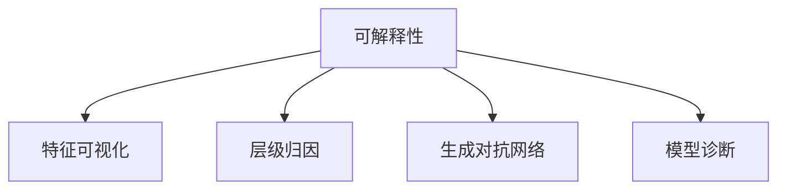

                 

# 神经网络模型的可解释性技术

## 1. 背景介绍

### 1.1 问题由来

近年来，深度学习技术的快速发展，使得神经网络模型在各种领域取得了显著的成果。然而，尽管这些模型在性能上取得了巨大进展，它们的内在机制仍显得相当“黑盒”，难以解释。这种“黑盒”现象，使得人们对模型的可信度产生怀疑，限制了神经网络技术的应用范围，尤其是在金融、医疗、司法等对模型解释性要求较高的领域。因此，如何提升神经网络模型的可解释性，成为当前深度学习研究的热点之一。

### 1.2 问题核心关键点

提高神经网络模型的可解释性，核心在于揭示模型内部的决策机制。这不仅有助于提升模型的可信度，还能帮助开发者更好地理解和改进模型，促进深度学习的理论研究与应用实践。

为了提升模型的可解释性，研究者提出了多种方法和技术，如特征可视化、层级归因、生成对抗网络等。这些方法通常会通过不同角度和手段，解释模型的决策过程，揭示模型所学到的知识，为模型诊断和改进提供新的视角。

## 2. 核心概念与联系

### 2.1 核心概念概述

为更好地理解神经网络模型的可解释性技术，本节将介绍几个密切相关的核心概念：

- **可解释性(Explainability)**：指对模型输出进行解释和理解，揭示模型内部的决策机制和逻辑，帮助人们理解模型的行为和性能。
- **特征可视化(Feature Visualization)**：通过可视化技术展示模型输入-输出关系，揭示模型学习到的特征。
- **层级归因(Layer-wise Attribution)**：从模型的不同层次对模型输出的影响进行解释，理解模型在哪些方面最依赖输入特征。
- **生成对抗网络(GAN)**：通过训练对抗性生成器与判别器，生成与真实数据相似但不同的数据，用于模拟和解释模型行为。
- **模型诊断(Model Diagnosis)**：通过分析模型性能和行为，找出模型的弱点和改进方向。

这些核心概念之间的逻辑关系可以通过以下Mermaid流程图来展示：



这个流程图展示了一组紧密相关的概念及其关系：

1. 可解释性是所有这些技术的目的。
2. 特征可视化通过展示模型学习到的特征，帮助理解模型的行为。
3. 层级归因从模型不同层次解释模型输出，揭示其依赖的特征。
4. 生成对抗网络通过生成虚假数据，揭示模型决策的边界和偏好。
5. 模型诊断通过分析模型性能和行为，寻找模型改进的方向。

这些概念共同构成了神经网络模型可解释性的技术框架，旨在揭示和解释模型决策过程，提升模型可信度。

## 3. 核心算法原理 & 具体操作步骤
### 3.1 算法原理概述

神经网络模型的可解释性技术，本质上是一种模型诊断和解释方法。其核心思想是通过各种技术手段，从模型输入到输出，逐步揭示模型学习到的知识，以及模型在哪些方面最依赖输入特征。具体方法包括特征可视化、层级归因、生成对抗网络等。

### 3.2 算法步骤详解

#### 3.2.1 特征可视化

特征可视化技术通过展示模型学习到的特征，揭示模型对输入数据的敏感度和重要性。主要步骤包括：

1. 数据预处理：对输入数据进行标准化或归一化，使其符合模型输入的要求。
2. 可视化技术：选择适合的可视化方法，如图像颜色、梯度热图、类激活图等，展示模型对不同特征的响应。
3. 结果解释：结合业务知识和数据理解，解释可视化结果，揭示模型学习到的特征。

#### 3.2.2 层级归因

层级归因技术通过从模型的不同层次解释模型输出的变化，帮助理解模型对输入数据的依赖关系。主要步骤包括：

1. 模型输入：将输入数据按照层次划分，提取不同层次的特征。
2. 模型输出：通过反向传播计算每个层次对模型输出的贡献，生成归因权重。
3. 结果解释：结合层次特征和业务知识，解释归因权重，揭示模型依赖的特征。

#### 3.2.3 生成对抗网络

生成对抗网络技术通过训练生成器和判别器，生成与真实数据相似但不同的数据，用于模拟和解释模型行为。主要步骤包括：

1. 生成器训练：训练生成器生成与真实数据相似但不相同的伪造数据。
2. 判别器训练：训练判别器区分真实数据和伪造数据。
3. 解释生成：使用生成器生成假数据，输入模型进行推理，解释模型的行为。

#### 3.2.4 模型诊断

模型诊断技术通过分析模型的性能和行为，找出模型的弱点和改进方向。主要步骤包括：

1. 性能评估：评估模型在不同数据集上的性能，找出模型的优势和不足。
2. 行为分析：分析模型在训练和推理过程中的行为，找出异常现象。
3. 改进建议：结合性能评估和行为分析，提出改进模型的方法和策略。

### 3.3 算法优缺点

特征可视化、层级归因、生成对抗网络和模型诊断等技术，各自具有独特的优点和局限性：

#### 优点：
1. 特征可视化：直观展示模型学习到的特征，有助于理解模型对输入数据的敏感度。
2. 层级归因：揭示模型对输入数据的依赖关系，有助于诊断模型的弱点。
3. 生成对抗网络：生成与真实数据相似但不同的数据，用于模拟和解释模型行为。
4. 模型诊断：综合性能评估和行为分析，提出改进模型的方法和策略。

#### 局限性：
1. 特征可视化：依赖于选择的可视化方法，可能揭示的特征有限，难以全面理解模型行为。
2. 层级归因：仅适用于已训练好的模型，难以解释模型内部的决策过程。
3. 生成对抗网络：生成的数据可能质量不高，难以完全模拟模型行为。
4. 模型诊断：依赖于模型性能和行为的数据，难以找到模型改进的方向。

尽管存在这些局限性，但这些技术在揭示和解释神经网络模型行为方面仍具有重要价值。研究者不断探索新的解释方法，如因果推断、对抗性推理等，以进一步提升模型的可解释性。

### 3.4 算法应用领域

神经网络模型的可解释性技术，已经在金融、医疗、司法等对模型解释性要求较高的领域得到了广泛应用。具体而言，主要应用包括：

- **金融风险评估**：通过特征可视化技术，揭示模型对不同金融指标的依赖关系，帮助评估金融风险。
- **医疗诊断**：通过层级归因技术，理解模型对医学影像特征的依赖关系，辅助医疗诊断。
- **司法判决**：通过生成对抗网络技术，生成类似真实案例的伪造数据，模拟和解释模型的判决行为。
- **安全防御**：通过模型诊断技术，找出模型的弱点和改进方向，提高模型的鲁棒性和安全性。

此外，在自动驾驶、推荐系统、智能客服等众多领域，基于可解释性的神经网络技术也在不断涌现，为人工智能应用提供了新的视角。

## 4. 数学模型和公式 & 详细讲解 & 举例说明

### 4.1 数学模型构建

本节将使用数学语言对神经网络模型的可解释性技术进行更加严格的刻画。

记神经网络模型为 $f: \mathcal{X} \rightarrow \mathcal{Y}$，其中 $\mathcal{X}$ 为输入空间，$\mathcal{Y}$ 为输出空间。假设模型 $f$ 由若干层组成，每层为线性变换和激活函数组合。

定义模型 $f$ 在输入 $x$ 上的输出为 $y=f(x)$。模型的可解释性技术旨在揭示模型对输入 $x$ 的依赖关系，通过特征可视化、层级归因、生成对抗网络等方法，解释模型的行为和决策过程。

### 4.2 公式推导过程

以下是几个关键公式的推导过程：

#### 特征可视化

特征可视化技术通常使用梯度热图或类激活图等方法，展示模型对不同特征的响应。以梯度热图为例，其推导过程如下：

$$
g_x \rightarrow f \rightarrow y
$$

其中 $g_x$ 为输入 $x$ 对模型输出的梯度，$f$ 为神经网络模型，$y$ 为模型输出。梯度热图表示模型在输入 $x$ 上的梯度分布，可以揭示模型对输入数据的敏感度。

#### 层级归因

层级归因技术通过反向传播计算模型输出对输入特征的贡献。以线性回归模型为例，假设模型 $f(\theta) = \theta^T x$，其中 $x$ 为输入向量，$\theta$ 为权重向量。

定义模型 $f$ 在输入 $x$ 上的输出为 $y=f(x)$，则模型对输入特征 $i$ 的贡献为：

$$
\frac{\partial y}{\partial x_i} = \frac{\partial f(x)}{\partial x_i} = \frac{\partial (\theta^T x)}{\partial x_i} = \theta_i
$$

其中 $\theta_i$ 为权重向量 $\theta$ 的第 $i$ 个元素。

通过计算每个输入特征对模型输出的贡献，可以生成归因权重向量 $\phi$，表示模型对每个输入特征的依赖程度。

#### 生成对抗网络

生成对抗网络技术通过训练生成器和判别器，生成与真实数据相似但不同的数据，用于模拟和解释模型行为。以生成器和判别器的训练过程为例：

1. 生成器训练：
$$
G: \mathcal{Z} \rightarrow \mathcal{X}
$$

其中 $\mathcal{Z}$ 为生成器输入空间，$\mathcal{X}$ 为生成器输出空间。生成器的目标是最小化判别器无法正确分类生成数据的概率。

2. 判别器训练：
$$
D: \mathcal{X} \rightarrow [0,1]
$$

判别器的目标是最小化生成数据被正确分类和真实数据被错误分类的概率。

3. 解释生成：
$$
x^* = G(z)
$$

其中 $z$ 为生成器输入噪声，$x^*$ 为生成器生成的伪造数据。将 $x^*$ 输入模型 $f$，输出结果用于解释模型行为。

### 4.3 案例分析与讲解

**案例1：金融风险评估**

以银行业为例，可以使用神经网络模型评估借款人的信用风险。通过特征可视化技术，展示模型对不同金融指标的依赖关系，揭示模型学习到的特征。

1. 数据预处理：对借款人信息、信用记录等数据进行标准化处理。
2. 可视化技术：使用梯度热图展示模型对不同金融指标的响应。
3. 结果解释：结合业务知识，解释梯度热图，揭示模型学习到的重要特征，如收入、信用评分等。

**案例2：医疗诊断**

在医学影像分析中，可以使用神经网络模型辅助医生诊断。通过层级归因技术，理解模型对医学影像特征的依赖关系，帮助医生做出准确诊断。

1. 模型输入：将医学影像按层次划分，提取不同层次的特征。
2. 模型输出：通过反向传播计算每个层次对模型输出的贡献，生成归因权重。
3. 结果解释：结合层次特征和业务知识，解释归因权重，揭示模型依赖的特征，如肿瘤位置、大小等。

## 5. 项目实践：代码实例和详细解释说明
### 5.1 开发环境搭建

在进行可解释性技术实践前，我们需要准备好开发环境。以下是使用Python进行TensorFlow开发的的环境配置流程：

1. 安装Anaconda：从官网下载并安装Anaconda，用于创建独立的Python环境。

2. 创建并激活虚拟环境：
```bash
conda create -n tf-env python=3.8 
conda activate tf-env
```

3. 安装TensorFlow：根据CUDA版本，从官网获取对应的安装命令。例如：
```bash
conda install tensorflow==2.7.0
```

4. 安装Keras：
```bash
pip install keras
```

5. 安装TensorBoard：
```bash
pip install tensorboard
```

6. 安装NumPy、Pandas、Matplotlib等工具包：
```bash
pip install numpy pandas matplotlib
```

完成上述步骤后，即可在`tf-env`环境中开始可解释性技术实践。

### 5.2 源代码详细实现

这里我们以梯度热图为例，使用TensorFlow实现神经网络模型的特征可视化。

首先，定义一个简单的全连接神经网络模型：

```python
import tensorflow as tf
from tensorflow.keras.models import Sequential
from tensorflow.keras.layers import Dense, Flatten

# 定义模型
model = Sequential([
    Dense(64, input_dim=784, activation='relu'),
    Flatten(),
    Dense(10, activation='softmax')
])

# 编译模型
model.compile(optimizer='adam', loss='sparse_categorical_crossentropy', metrics=['accuracy'])
```

然后，使用梯度热图展示模型对输入数据的敏感度：

```python
import matplotlib.pyplot as plt
from tensorflow.keras import backend as K
from tensorflow.keras.models import Model

# 定义输入和输出
input_img = tf.keras.Input(shape=(784,))
output = model(input_img)

# 定义梯度热图
def gradient_hotmap(input_img, output):
    img = K.placeholder(shape=(None, 784))
    grads = K.gradients(output, img)[0]
    return grads

# 计算梯度热图
grads = gradient_hotmap(input_img, output)
grads = tf.reduce_mean(grads, axis=0)

# 可视化梯度热图
plt.imshow(grads.numpy(), interpolation='nearest')
plt.show()
```

以上就是使用TensorFlow实现神经网络模型特征可视化的完整代码实现。可以看到，通过简单的代码实现，就可以展示模型对输入数据的敏感度，揭示模型学习到的特征。

### 5.3 代码解读与分析

让我们再详细解读一下关键代码的实现细节：

**模型定义**：
- 使用Keras定义一个简单的全连接神经网络模型，包括输入层、隐藏层和输出层。
- 使用`compile`方法编译模型，设置优化器和损失函数。

**梯度热图计算**：
- 定义输入和输出，使用`Model`类创建模型。
- 定义梯度热图函数`gradient_hotmap`，计算输入对输出的梯度。
- 使用`reduce_mean`函数计算梯度热图的平均值，方便可视化。

**可视化展示**：
- 使用Matplotlib展示梯度热图，使用`imshow`函数将梯度热图显示在屏幕上。

通过上述代码，我们展示了一个简单的神经网络模型，并使用梯度热图方法可视化模型对输入数据的敏感度。这仅是神经网络可解释性技术的一小部分，更多高级技术如层级归因、生成对抗网络等，需要更加复杂的实现和分析。

## 6. 实际应用场景
### 6.1 智能客服系统

在智能客服系统中，基于可解释性的神经网络技术可以显著提升系统的可信度和用户满意度。智能客服系统通常包含多个模块，如自然语言理解、对话生成、意图识别等。通过特征可视化技术，揭示模型在各个模块上的表现，帮助开发者优化系统性能。

1. 数据预处理：收集用户对话记录，提取关键信息。
2. 可视化技术：使用梯度热图展示模型在自然语言理解、对话生成等模块上的表现。
3. 结果解释：结合业务知识，解释梯度热图，找出模型的弱点和改进方向，如在对话生成中提高对用户情感的敏感度。

**案例2：金融风险评估**

金融风险评估中，基于可解释性的神经网络技术可以辅助银行评估借款人的信用风险。通过特征可视化技术，展示模型对不同金融指标的依赖关系，帮助银行做出准确的信用评估。

1. 数据预处理：收集借款人信息、信用记录等数据，提取关键特征。
2. 可视化技术：使用梯度热图展示模型对不同金融指标的响应。
3. 结果解释：结合业务知识，解释梯度热图，找出模型学习到的重要特征，如收入、信用评分等。

## 7. 工具和资源推荐
### 7.1 学习资源推荐

为了帮助开发者系统掌握神经网络模型的可解释性技术，这里推荐一些优质的学习资源：

1. 《Deep Learning Specialization》系列课程：由Andrew Ng教授开设的深度学习课程，涵盖了深度学习的基础和高级主题，包括神经网络的可解释性。

2. 《Hands-On Machine Learning with Scikit-Learn, Keras, and TensorFlow》书籍：Python深度学习实战书籍，详细介绍了神经网络的可解释性技术，包括梯度热图、类激活图等方法。

3. 《Neural Networks and Deep Learning》书籍：由Michael Nielsen编写，深入浅出地介绍了神经网络的可解释性技术，适合初学者阅读。

4. 《Towards Explainable Artificial Intelligence: Model Interpretability for Black Box Models》论文：介绍了多种神经网络的可解释性技术，包括梯度热图、层级归因等方法。

通过对这些资源的学习实践，相信你一定能够快速掌握神经网络模型的可解释性技术，并用于解决实际的深度学习问题。
###  7.2 开发工具推荐

高效的开发离不开优秀的工具支持。以下是几款用于神经网络可解释性开发的常用工具：

1. TensorFlow：由Google主导开发的开源深度学习框架，生产部署方便，适合大规模工程应用。
2. Keras：基于TensorFlow、Theano等后端的高级神经网络库，易用性强，适合快速开发。
3. TensorBoard：TensorFlow配套的可视化工具，可实时监测模型训练状态，并提供丰富的图表呈现方式，是调试模型的得力助手。
4. SHAP：用于模型解释和可解释性分析的Python库，支持多种机器学习算法，提供多种可解释性指标。
5. LIME：用于模型解释和可解释性分析的Python库，提供多种可解释性技术，如局部线性逼近、SHAP值等。

合理利用这些工具，可以显著提升神经网络可解释性技术的开发效率，加快创新迭代的步伐。

### 7.3 相关论文推荐

神经网络模型的可解释性技术的发展源于学界的持续研究。以下是几篇奠基性的相关论文，推荐阅读：

1. 《Understanding Neural Networks: An Intuitive Introduction》论文：介绍了神经网络的基本原理和可解释性技术，适合初学者阅读。
2. 《Visualizing and Understanding the Deep Learning Models》论文：详细介绍了多种神经网络的可视化技术，包括梯度热图、类激活图等方法。
3. 《A Taxonomy of Explainable Machine Learning Algorithms》论文：总结了多种可解释性算法，提供了对各种算法的应用场景和优缺点的分析。
4. 《Explaining Machine Learning Models and Predictions》书籍：系统介绍了多种可解释性技术，包括梯度热图、层级归因、生成对抗网络等方法。
5. 《Explainable Artificial Intelligence》书籍：全面介绍了可解释性技术在深度学习中的应用，包括模型诊断、特征可视化等方法。

这些论文代表了大模型可解释性技术的发展脉络。通过学习这些前沿成果，可以帮助研究者把握学科前进方向，激发更多的创新灵感。

## 8. 总结：未来发展趋势与挑战

### 8.1 总结

本文对神经网络模型的可解释性技术进行了全面系统的介绍。首先阐述了神经网络模型可解释性的研究背景和意义，明确了可解释性在提升模型可信度、促进理论研究和应用实践中的重要作用。其次，从原理到实践，详细讲解了特征可视化、层级归因、生成对抗网络等关键技术，给出了可解释性技术开发的完整代码实例。同时，本文还广泛探讨了可解释性技术在智能客服、金融风险评估等多个行业领域的应用前景，展示了其广泛的应用价值。最后，本文精选了可解释性技术的各类学习资源，力求为读者提供全方位的技术指引。

通过本文的系统梳理，可以看到，神经网络模型的可解释性技术已经成为深度学习的重要组成部分，极大地提升了模型的可信度和应用范围，为人工智能技术的应用提供了新的视角。未来，伴随可解释性技术的不断演进，神经网络模型将更加透明、可靠，为人工智能技术的发展注入新的活力。

### 8.2 未来发展趋势

展望未来，神经网络模型的可解释性技术将呈现以下几个发展趋势：

1. 技术多样化：随着深度学习的不断发展，新的可解释性技术不断涌现，如因果推断、对抗性推理等，将为模型诊断和解释提供更多手段。
2. 应用普适化：可解释性技术将广泛应用于各个领域，从金融、医疗到自动驾驶、推荐系统等，帮助开发者更好地理解模型行为，优化系统性能。
3. 数据驱动化：更多的可解释性技术将依赖于数据的分布和特性，如分布式数据可视化、基于大数据的特征分析等，提升模型的可解释性。
4. 跨学科化：可解释性技术将与心理学、认知科学等学科相结合，提供更加全面和科学的模型解释方法。
5. 自动化：可解释性技术将与自动化算法结合，实现模型的自动诊断和优化，提升模型的鲁棒性和可靠性。

以上趋势凸显了神经网络模型可解释性技术的广阔前景。这些方向的探索发展，必将进一步提升深度学习的可信度，促进人工智能技术的广泛应用。

### 8.3 面临的挑战

尽管神经网络模型的可解释性技术已经取得了瞩目成就，但在迈向更加智能化、普适化应用的过程中，仍面临诸多挑战：

1. 数据质量瓶颈：可解释性技术依赖于高质量的数据，但数据收集和标注往往成本高、周期长。如何在数据量不足的情况下，仍能保证模型的可解释性，是一个重要挑战。
2. 模型复杂性：神经网络模型的复杂性使得可解释性技术难以全面揭示模型的行为。如何在模型复杂性不断增加的情况下，仍能保持可解释性，是一大难题。
3. 业务适配性：可解释性技术需要结合业务知识和领域特性，才能提供有意义的解释。如何在不同的应用场景中，灵活应用可解释性技术，是一大挑战。
4. 技术成熟度：可解释性技术还处于不断发展中，如何评估和比较不同技术的效果，是一大挑战。

尽管存在这些挑战，但研究者不断探索新的解释方法，如因果推断、对抗性推理等，以进一步提升模型的可解释性。相信随着学界和产业界的共同努力，这些挑战终将一一被克服，神经网络模型将更加透明、可信，为人工智能技术的发展提供坚实基础。

### 8.4 研究展望

面对神经网络模型可解释性所面临的种种挑战，未来的研究需要在以下几个方面寻求新的突破：

1. 探索新的可解释性方法：结合心理学、认知科学等学科知识，提出更加全面和科学的模型解释方法，如因果推断、对抗性推理等。
2. 开发智能解释系统：开发智能化的解释系统，自动诊断模型问题，生成可解释性报告，提升模型诊断的效率和准确性。
3. 引入外部知识：将外部知识库、规则库等与神经网络模型结合，提高模型的鲁棒性和泛化能力。
4. 提高数据驱动性：结合大数据分析技术，从数据分布和特性中，提取和解释模型的行为。
5. 增强自动化程度：结合自动化算法，实现模型的自动诊断和优化，提升模型的鲁棒性和可靠性。

这些研究方向凸显了神经网络模型可解释性技术的广阔前景。这些方向的探索发展，必将进一步提升深度学习的可信度，促进人工智能技术的广泛应用。

## 9. 附录：常见问题与解答

**Q1：神经网络模型的可解释性技术是否只适用于特定领域？**

A: 神经网络模型的可解释性技术并不仅仅适用于特定领域，其应用范围非常广泛。在金融、医疗、司法、自动驾驶等多个领域，基于可解释性的神经网络技术已经在实际应用中得到了验证。尽管不同领域对模型的解释需求有所不同，但可解释性技术的基本原理和方法可以通用。

**Q2：神经网络模型的可解释性技术是否会影响模型性能？**

A: 神经网络模型的可解释性技术并不会直接影响到模型的性能。可解释性技术的实现通常是通过对模型进行额外的计算和可视化操作，不会改变模型本身的预测能力和优化目标。然而，在实际应用中，解释模型的行为可能会带来一些计算和存储成本，需要权衡模型的解释需求和性能需求。

**Q3：神经网络模型的可解释性技术是否需要大量的标注数据？**

A: 神经网络模型的可解释性技术通常需要高质量的标注数据来揭示模型的行为。标注数据的质量和数量会直接影响到解释结果的准确性和可靠性。然而，对于一些特殊的应用场景，也可以通过非标注数据、部分标注数据等方法来提升模型的可解释性。

**Q4：如何平衡模型的可解释性和性能？**

A: 在实际应用中，模型的可解释性和性能是相互矛盾的。为了平衡这两者，可以采取以下策略：
1. 数据驱动：结合大数据分析技术，从数据分布和特性中，提取和解释模型的行为。
2. 特征重要性：通过特征重要性分析，选择对模型预测贡献最大的特征进行解释。
3. 多模型融合：结合多种可解释性技术，生成多层次的解释结果，提供更加全面的模型分析。
4. 解释模型：开发智能化的解释系统，自动诊断模型问题，生成可解释性报告，提升模型诊断的效率和准确性。

这些策略可以有效地平衡模型的可解释性和性能，帮助开发者更好地理解模型行为，优化系统性能。

**Q5：神经网络模型的可解释性技术是否可以应用于人工智能伦理审查？**

A: 神经网络模型的可解释性技术可以应用于人工智能伦理审查，帮助审查人员理解模型的行为和决策过程。通过可解释性技术，可以揭示模型在哪些方面最依赖输入特征，找出模型的弱点和改进方向，帮助审查人员判断模型的公平性、透明性和安全性。此外，可解释性技术还可以帮助审查人员发现模型的偏见和歧视，提升模型的可信度和伦理水平。

通过本文的系统梳理，可以看到，神经网络模型的可解释性技术已经成为深度学习的重要组成部分，极大地提升了模型的可信度和应用范围，为人工智能技术的应用提供了新的视角。未来，伴随可解释性技术的不断演进，神经网络模型将更加透明、可靠，为人工智能技术的发展注入新的活力。

---

作者：禅与计算机程序设计艺术 / Zen and the Art of Computer Programming

