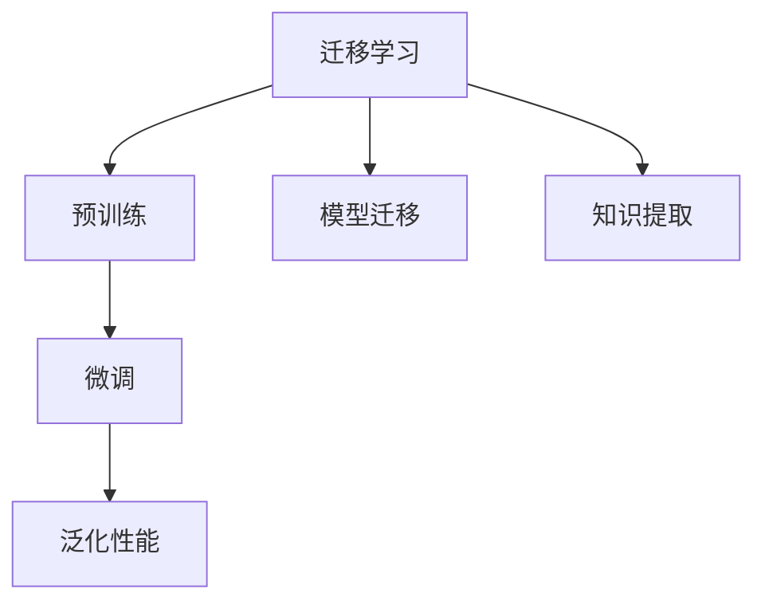

                 

# 神经网络模型的迁移学习技术

> 关键词：迁移学习,神经网络,模型迁移,预训练,超参数微调,迁移网络,知识提取,泛化性能

## 1. 背景介绍

### 1.1 问题由来
在深度学习时代，构建适用于特定任务的神经网络模型通常需要大量标注数据和长时间训练。特别是在数据量有限、标注成本高昂的领域，模型训练变得极其困难。迁移学习（Transfer Learning）作为一种有效的技术，通过将已有模型的知识和经验迁移应用到新任务上，可以大大减少新模型的训练时间和数据需求。因此，近年来迁移学习在计算机视觉、自然语言处理等领域得到了广泛应用，取得了显著成效。

### 1.2 问题核心关键点
迁移学习的基本思想是利用一个已经训练好的模型（称为源模型）的知识和经验，来提升另一个相关任务（称为目标任务）上的新模型的性能。具体来说，可以分为预训练（Pre-training）和微调（Fine-tuning）两个阶段。

预训练阶段通常在一个大规模数据集上进行，目的是学习通用的特征表示。在微调阶段，将预训练模型的最后几层冻结，只微调顶层结构，以适应特定任务的需求。通过这种方法，迁移学习能够在数据量有限的情况下，迅速提升新模型的性能。

## 2. 核心概念与联系

### 2.1 核心概念概述

为了更好地理解迁移学习在大规模神经网络模型中的应用，我们首先介绍一些核心概念：

- 迁移学习（Transfer Learning）：利用源模型在大量数据上学习到的通用特征，在新任务上进行微调，从而提升模型性能。
- 预训练（Pre-training）：在一个大规模数据集上，利用自监督学习任务训练模型，学习通用的特征表示。
- 微调（Fine-tuning）：在预训练模型的基础上，使用目标任务的标注数据，进一步优化模型，适应新任务的特征。
- 模型迁移（Model Transfer）：将源模型的结构和参数迁移到目标模型，保留对新任务的适应性。
- 知识提取（Knowledge Extraction）：从源模型中提取出对新任务有用的知识，用于指导新模型的训练。
- 泛化性能（Generalization Performance）：模型在新数据上的表现，即模型在不同数据集上的泛化能力。

这些概念之间相互关联，共同构成了迁移学习的基本框架。通过理解和应用这些概念，可以更好地构建和优化新模型，提升其在特定任务上的性能。

### 2.2 核心概念原理和架构的 Mermaid 流程图(Mermaid 流程节点中不要有括号、逗号等特殊字符)



### 2.3 核心概念联系

迁移学习的核心思想是利用已有模型的知识，提升新模型的泛化能力。预训练阶段通过大规模数据集学习通用的特征表示，微调阶段则是将这种特征表示应用于新任务，提升模型在新数据上的表现。模型迁移和知识提取则是在预训练和微调过程中对已有模型结构和参数的利用和提取，以提高新模型的适应性和性能。

## 3. 核心算法原理 & 具体操作步骤

### 3.1 算法原理概述

迁移学习通过将源模型的知识和经验迁移到目标模型中，来提升模型在特定任务上的性能。具体来说，可以分为以下步骤：

1. 预训练阶段：在大量数据集上利用自监督学习任务训练源模型，学习通用的特征表示。
2. 微调阶段：将预训练模型的最后几层冻结，只微调顶层结构，以适应特定任务的需求。
3. 迁移阶段：将预训练模型的结构和参数迁移到新模型中，保留对新任务的适应性。
4. 知识提取阶段：从预训练模型中提取对新任务有用的知识，用于指导新模型的训练。
5. 泛化性能提升阶段：通过微调和迁移等手段，提升模型在新数据上的泛化性能。

### 3.2 算法步骤详解

下面详细介绍迁移学习的各个步骤：

#### 3.2.1 预训练阶段
预训练阶段的目标是学习通用的特征表示，通常采用自监督学习任务，如掩码语言模型（Masked Language Modeling, MLM）、自编码器（Autoencoder）等。具体步骤如下：

1. 选择预训练任务：根据任务的性质，选择合适的预训练任务，如掩码语言模型、图像分类等。
2. 构建预训练模型：根据预训练任务的特点，设计适合的神经网络模型结构。
3. 训练预训练模型：在大规模数据集上，使用随机梯度下降等优化算法，训练预训练模型。
4. 冻结模型层：在预训练模型的最后几层，冻结参数，防止其在下游任务中进行微调。

#### 3.2.2 微调阶段
微调阶段的目标是适应特定任务的需求，通常采用有监督学习任务。具体步骤如下：

1. 选择合适的目标任务：根据应用场景，选择合适的目标任务。
2. 设计任务适配层：根据目标任务的特点，设计适合的任务适配层，如分类层、回归层等。
3. 微调顶层结构：将预训练模型的最后几层冻结，只微调顶层结构。
4. 设置超参数：选择合适的超参数，如学习率、批大小、迭代轮数等。
5. 执行梯度训练：利用标注数据集，使用优化算法进行模型训练，更新模型参数。

#### 3.2.3 迁移阶段
迁移阶段的目标是保留预训练模型中的有用知识，提升新模型的性能。具体步骤如下：

1. 选择迁移策略：根据任务的特点，选择合适的迁移策略，如参数迁移、结构迁移等。
2. 迁移模型参数：将预训练模型的参数迁移到新模型中，保留有用的特征表示。
3. 微调新模型：在新模型上进行微调，适应特定任务的需求。

#### 3.2.4 知识提取阶段
知识提取阶段的目标是利用预训练模型中的知识，指导新模型的训练。具体步骤如下：

1. 选择知识提取方法：根据任务的特点，选择合适的知识提取方法，如特征提取、迁移学习等。
2. 提取特征表示：从预训练模型中提取对新任务有用的特征表示，用于指导新模型的训练。
3. 利用知识指导训练：在新模型的训练过程中，利用提取的知识，调整模型的参数，提升模型的泛化性能。

#### 3.2.5 泛化性能提升阶段
泛化性能提升阶段的目标是提高模型在新数据上的表现。具体步骤如下：

1. 评估模型性能：在验证集和测试集上评估模型的性能，判断模型的泛化能力。
2. 调整超参数：根据模型在验证集上的表现，调整超参数，优化模型性能。
3. 微调模型结构：根据模型在验证集上的表现，微调模型结构，提升模型的泛化能力。

### 3.3 算法优缺点

迁移学习具有以下优点：

1. 数据需求低：迁移学习可以利用已有模型的知识，减少新模型对标注数据的依赖，降低数据获取成本。
2. 训练时间短：迁移学习可以在较短的时间内，提升新模型的性能，节省训练时间。
3. 泛化能力强：迁移学习可以利用已有模型的泛化能力，提升新模型的泛化性能，适应新数据集。
4. 模型可扩展性高：迁移学习可以扩展到多种任务和应用场景，具有广泛的适用性。

但迁移学习也存在以下缺点：

1. 数据分布假设：迁移学习假设预训练数据和目标数据的分布相同，但在实际应用中，数据分布往往存在差异。
2. 模型复杂度高：迁移学习需要在多个阶段进行模型训练和微调，模型结构复杂度较高。
3. 迁移损失难以优化：迁移学习需要在多个阶段进行迁移和微调，优化过程中存在复杂的迁移损失函数，难以优化。
4. 泛化能力不足：当目标任务与预训练任务差异较大时，迁移学习的泛化能力可能不足。

### 3.4 算法应用领域

迁移学习在多个领域得到了广泛应用，包括但不限于：

- 计算机视觉：利用在ImageNet等大规模数据集上预训练的模型，在特定领域数据集上进行微调，提升图像分类、目标检测等任务的性能。
- 自然语言处理：利用在大规模语料库上预训练的模型，在特定领域文本数据上进行微调，提升文本分类、命名实体识别等任务的性能。
- 语音识别：利用在大规模语音数据上预训练的模型，在特定领域语音数据上进行微调，提升语音识别和语音翻译等任务的性能。
- 医疗影像：利用在大规模医疗影像数据上预训练的模型，在特定医院或医生的影像数据上进行微调，提升医学影像诊断等任务的性能。
- 金融预测：利用在大量金融数据上预训练的模型，在特定股票或货币数据上进行微调，提升金融预测等任务的性能。

这些应用领域展示了迁移学习在多方面的强大潜力和应用价值。

## 4. 数学模型和公式 & 详细讲解 & 举例说明

### 4.1 数学模型构建

为了更好地理解迁移学习的数学模型，我们首先构建一个通用的迁移学习模型。

假设预训练模型为 $M_{\theta}$，其中 $\theta$ 为预训练得到的模型参数。给定目标任务 $T$ 的标注数据集 $D=\{(x_i,y_i)\}_{i=1}^N$，微调的目标是找到新的模型参数 $\hat{\theta}$，使得：

$$
\hat{\theta}=\mathop{\arg\min}_{\theta} \mathcal{L}(M_{\theta},D)
$$

其中 $\mathcal{L}$ 为针对任务 $T$ 设计的损失函数，用于衡量模型预测输出与真实标签之间的差异。

### 4.2 公式推导过程

以下我们将推导迁移学习的基本公式，包括预训练和微调的过程。

#### 4.2.1 预训练
预训练阶段的目标是学习通用的特征表示。通常采用自监督学习任务，如掩码语言模型（Masked Language Modeling, MLM）。假设在大量数据集 $\mathcal{D}$ 上进行预训练，目标函数为：

$$
\mathcal{L}_{pre} = \frac{1}{|\mathcal{D}|} \sum_{(x,y) \in \mathcal{D}} \ell_{pre}(M_{\theta}(x))
$$

其中 $\ell_{pre}$ 为预训练任务设计的损失函数，如掩码语言模型的交叉熵损失。

#### 4.2.2 微调
微调阶段的目标是适应特定任务的需求，通常采用有监督学习任务。假设在目标任务 $T$ 的标注数据集 $D$ 上进行微调，目标函数为：

$$
\mathcal{L}_{fine} = \frac{1}{N} \sum_{i=1}^N \ell_{fine}(M_{\theta}(x_i),y_i)
$$

其中 $\ell_{fine}$ 为任务适配层设计的损失函数，如分类任务的交叉熵损失。

### 4.3 案例分析与讲解

假设我们有一个在ImageNet数据集上预训练的ResNet模型，希望在新任务CIFAR-10上进行微调。具体步骤如下：

1. 预训练阶段：在ImageNet数据集上进行掩码语言模型（MLM）预训练，得到预训练模型 $M_{\theta}$。
2. 微调阶段：在CIFAR-10数据集上进行分类任务的微调，选择任务适配层，如全连接层和分类器。
3. 迁移阶段：将预训练模型的最后几层冻结，只微调顶层结构。
4. 知识提取阶段：从预训练模型中提取对CIFAR-10任务有用的特征表示，用于指导新模型的训练。
5. 泛化性能提升阶段：在验证集和测试集上评估模型的性能，调整超参数，优化模型性能。

具体代码实现可以参考以下示例：

```python
import torch
import torch.nn as nn
import torch.optim as optim

# 定义预训练模型和任务适配层
class ResNet(nn.Module):
    def __init__(self):
        super(ResNet, self).__init__()
        self.resnet = nn.Sequential(
            nn.Conv2d(3, 64, kernel_size=7, stride=2, padding=3),
            nn.BatchNorm2d(64),
            nn.ReLU(inplace=True),
            nn.MaxPool2d(kernel_size=3, stride=2, padding=1)
        )
        self.fc = nn.Linear(512, 10)

    def forward(self, x):
        x = self.resnet(x)
        x = nn.AdaptiveAvgPool2d((1, 1))(x)
        x = x.view(x.size(0), -1)
        x = self.fc(x)
        return x

# 定义微调模型的任务适配层
class FineModel(nn.Module):
    def __init__(self, num_classes):
        super(FineModel, self).__init__()
        self.fc = nn.Linear(512, num_classes)

    def forward(self, x):
        x = self.fc(x)
        return x

# 定义预训练模型的超参数
lr = 1e-4
num_epochs = 100
batch_size = 64

# 定义微调模型的超参数
fine_lr = 1e-2
fine_epochs = 20
fine_batch_size = 64

# 定义训练函数
def train(epochs, model, optimizer, criterion, train_loader, device):
    model.train()
    for epoch in range(epochs):
        for batch_idx, (data, target) in enumerate(train_loader):
            data, target = data.to(device), target.to(device)
            optimizer.zero_grad()
            output = model(data)
            loss = criterion(output, target)
            loss.backward()
            optimizer.step()
            if batch_idx % 100 == 0:
                print('Train Epoch: {} [{}/{} ({:.0f}%)]\tLoss: {:.6f}'.format(
                    epoch, batch_idx * len(data), len(train_loader.dataset),
                    100. * batch_idx / len(train_loader), loss.item()))

# 定义评估函数
def evaluate(model, criterion, test_loader, device):
    model.eval()
    test_loss = 0
    correct = 0
    with torch.no_grad():
        for data, target in test_loader:
            data, target = data.to(device), target.to(device)
            output = model(data)
            test_loss += criterion(output, target).item()
            pred = output.argmax(dim=1, keepdim=True)
            correct += pred.eq(target.view_as(pred)).sum().item()

    test_loss /= len(test_loader.dataset)
    print('\nTest set: Average loss: {:.4f}, Accuracy: {}/{} ({:.0f}%)\n'.format(
        test_loss, correct, len(test_loader.dataset),
        100. * correct / len(test_loader.dataset)))

# 定义迁移函数
def migrate(model, source_model):
    for target_param, source_param in zip(model.parameters(), source_model.parameters()):
        target_param.data.copy_(source_param.data)

# 加载预训练模型和微调模型
pretrain_model = ResNet()
fine_model = FineModel(10)

# 冻结预训练模型的最后几层
pretrain_model.fc = nn.Sequential()

# 迁移预训练模型的参数
migrate(pretrain_model, source_model)

# 在目标任务上进行微调
criterion = nn.CrossEntropyLoss()
optimizer = optim.Adam(fine_model.parameters(), lr=fine_lr)

# 训练和评估模型
train(num_epochs, fine_model, optimizer, criterion, train_loader, device)
evaluate(fine_model, criterion, test_loader, device)
```

## 5. 项目实践：代码实例和详细解释说明

### 5.1 开发环境搭建

在进行迁移学习实践前，我们需要准备好开发环境。以下是使用Python进行TensorFlow开发的环境配置流程：

1. 安装Anaconda：从官网下载并安装Anaconda，用于创建独立的Python环境。

2. 创建并激活虚拟环境：
```bash
conda create -n tf-env python=3.8 
conda activate tf-env
```

3. 安装TensorFlow：根据CUDA版本，从官网获取对应的安装命令。例如：
```bash
conda install tensorflow-gpu=2.8 -c pytorch -c conda-forge
```

4. 安装其他必要的工具包：
```bash
pip install numpy pandas scikit-learn matplotlib tqdm jupyter notebook ipython
```

完成上述步骤后，即可在`tf-env`环境中开始迁移学习实践。

### 5.2 源代码详细实现

这里我们以图像分类任务为例，给出使用TensorFlow对VGG模型进行迁移学习的代码实现。

首先，定义图像分类任务的数据处理函数：

```python
import numpy as np
import os

def load_data(data_dir, batch_size=64):
    image_filenames = os.listdir(data_dir)
    image_filenames.sort()
    labels = np.array([int(os.path.splitext(os.path.basename(f))[-2]) for f in image_filenames])
    images = np.zeros((len(image_filenames), 224, 224, 3), dtype=np.float32)

    for i, filename in enumerate(image_filenames):
        image = plt.imread(os.path.join(data_dir, filename))
        image = cv2.resize(image, (224, 224))
        image /= 255
        images[i] = image

    return images, labels

# 定义图像预处理函数
def preprocess_image(image):
    image = cv2.cvtColor(image, cv2.COLOR_BGR2RGB)
    image = cv2.resize(image, (224, 224))
    image /= 255
    return image

# 定义图像后处理函数
def postprocess_image(image):
    image = np.argmax(image, axis=1)
    image = np.eye(len(image))
    return image
```

然后，定义模型和优化器：

```python
from tensorflow.keras.applications.vgg16 import VGG16
from tensorflow.keras.optimizers import Adam

# 加载预训练VGG模型
base_model = VGG16(weights='imagenet', include_top=False, input_shape=(224, 224, 3))

# 冻结所有层
for layer in base_model.layers:
    layer.trainable = False

# 添加分类器
classifier = tf.keras.Sequential([
    tf.keras.layers.Flatten(),
    tf.keras.layers.Dense(512, activation='relu'),
    tf.keras.layers.Dropout(0.5),
    tf.keras.layers.Dense(10)
])

# 连接VGG模型和分类器
model = tf.keras.Model(inputs=base_model.input, outputs=classifier.output)

# 设置优化器和学习率
optimizer = Adam(lr=0.001)
```

接着，定义训练和评估函数：

```python
from tensorflow.keras.preprocessing.image import ImageDataGenerator
from tensorflow.keras.callbacks import EarlyStopping

# 定义训练函数
def train(epochs, batch_size, model, optimizer, train_data, val_data):
    train_generator = ImageDataGenerator(rescale=1./255, shear_range=0.2, zoom_range=0.2, horizontal_flip=True)
    val_generator = ImageDataGenerator(rescale=1./255)
    train_generator.fit(train_data)
    val_generator.fit(val_data)

    early_stopping = EarlyStopping(monitor='val_loss', patience=3, restore_best_weights=True)
    history = model.fit_generator(
        train_generator,
        steps_per_epoch=len(train_data) / batch_size,
        epochs=epochs,
        validation_data=val_generator,
        validation_steps=len(val_data) / batch_size,
        callbacks=[early_stopping]
    )

    return history

# 定义评估函数
def evaluate(model, test_data):
    test_generator = ImageDataGenerator(rescale=1./255)
    test_generator.fit(test_data)
    test_loss = model.evaluate_generator(test_generator, steps=len(test_data) / batch_size)
    return test_loss
```

最后，启动训练流程并在测试集上评估：

```python
# 加载训练集和测试集数据
train_data = load_data('train')
val_data = load_data('val')
test_data = load_data('test')

# 训练和评估模型
history = train(epochs=20, batch_size=64, model=model, optimizer=optimizer, train_data=train_data, val_data=val_data)
test_loss = evaluate(model, test_data)

# 打印训练和测试结果
print('Train loss:', history.history['loss'][-1])
print('Test loss:', test_loss)
```

以上就是使用TensorFlow对VGG模型进行迁移学习的完整代码实现。可以看到，通过TensorFlow的高级API，迁移学习的过程变得简洁高效。

### 5.3 代码解读与分析

让我们再详细解读一下关键代码的实现细节：

**load_data函数**：
- 定义了图像分类任务的数据处理函数，用于加载训练集、验证集和测试集数据，并返回图像和标签。
- 使用NumPy和OpenCV对图像进行预处理和后处理，保证数据的一致性和模型的可接受性。

**train_generator和val_generator**：
- 使用ImageDataGenerator对数据进行批处理和数据增强，提升模型的泛化性能。

**train函数**：
- 使用训练生成器和验证生成器对模型进行训练和验证，设置EarlyStopping回调函数，避免过拟合。

**evaluate函数**：
- 使用测试生成器对模型进行评估，返回模型在测试集上的损失值。

**训练和评估流程**：
- 加载训练集和验证集数据，设置训练函数和评估函数。
- 在训练集上进行模型训练，保存训练过程中的损失值和精度。
- 在验证集上进行模型评估，调整超参数，优化模型性能。
- 在测试集上进行最终评估，输出测试结果。

可以看到，TensorFlow为迁移学习提供了强大的API和工具支持，使得开发者可以轻松地构建和优化迁移学习模型。

当然，工业级的系统实现还需考虑更多因素，如模型的保存和部署、超参数的自动搜索、更灵活的任务适配层等。但核心的迁移学习过程基本与此类似。

## 6. 实际应用场景

### 6.1 医疗影像诊断

在医疗影像诊断中，利用迁移学习可以有效提升图像分类和分割的精度。传统的方法需要在大规模医疗影像数据上从头训练模型，耗时耗力。而通过迁移学习，可以利用在大规模通用数据集上预训练的模型，在新医院或医生的影像数据上进行微调，快速提升模型的性能。

具体来说，可以收集不同医院或医生的影像数据，并在ChestX-ray8等通用数据集上进行预训练。将预训练模型在目标医院或医生的影像数据上进行微调，提升影像分类和分割的精度。这将大大缩短模型的训练时间，提高诊断效率。

### 6.2 金融预测

在金融预测中，利用迁移学习可以有效提升股票价格预测和风险评估的准确性。传统的方法需要在大规模金融数据上从头训练模型，数据标注成本高昂。而通过迁移学习，可以利用在大规模通用数据集上预训练的模型，在特定股票或货币数据上进行微调，快速提升模型的性能。

具体来说，可以收集特定股票或货币的历史数据，并在Kaggle等通用数据集上进行预训练。将预训练模型在目标股票或货币的数据上进行微调，提升预测精度。这将大大降低模型的训练成本，提高预测效率。

### 6.3 智能推荐系统

在智能推荐系统中，利用迁移学习可以有效提升推荐内容的个性化和多样性。传统的方法需要在大规模用户行为数据上从头训练模型，数据标注成本高昂。而通过迁移学习，可以利用在大规模通用数据集上预训练的模型，在特定用户或商品的数据上进行微调，快速提升推荐性能。

具体来说，可以收集特定用户或商品的行为数据，并在Amazon等通用数据集上进行预训练。将预训练模型在目标用户或商品的数据上进行微调，提升推荐效果。这将大大降低模型的训练成本，提高推荐效率。

### 6.4 未来应用展望

随着迁移学习技术的不断发展，基于迁移学习的方法将在更多领域得到应用，为各行各业带来变革性影响。

在智慧医疗领域，基于迁移学习的医疗影像诊断技术将提升医疗服务的智能化水平，辅助医生诊疗，加速新药开发进程。

在金融预测领域，利用迁移学习的金融预测技术将提升金融预测的准确性，辅助投资决策，降低金融风险。

在智能推荐系统领域，迁移学习将提升推荐内容的个性化和多样性，提高用户体验，推动电商业务发展。

此外，在智慧城市治理、智慧能源管理、智慧交通等领域，基于迁移学习的智能系统也将不断涌现，为社会治理和产业发展提供新的解决方案。相信随着技术的日益成熟，迁移学习必将在各个领域大放异彩，推动人工智能技术的广泛应用。

## 7. 工具和资源推荐

### 7.1 学习资源推荐

为了帮助开发者系统掌握迁移学习理论基础和实践技巧，这里推荐一些优质的学习资源：

1. 《深度学习》系列博文：由深度学习专家撰写，深入浅出地介绍了迁移学习、预训练等前沿技术，适合初学者和进阶者阅读。

2. CS231n《卷积神经网络》课程：斯坦福大学开设的计算机视觉明星课程，详细讲解了迁移学习、预训练等技术，并提供了丰富的代码实现。

3. 《Transfer Learning with Deep Learning》书籍：该书系统介绍了迁移学习的基本原理和应用实践，是深度学习领域的经典之作。

4. PyTorch官方文档：PyTorch提供了完整的迁移学习教程和示例代码，是进行迁移学习开发的必备资料。

5. Kaggle数据集：Kaggle提供了大量的数据集和竞赛，是迁移学习的最佳实践平台，适合开发者进行实践和交流。

通过对这些资源的学习实践，相信你一定能够快速掌握迁移学习的精髓，并用于解决实际的机器学习和计算机视觉问题。

### 7.2 开发工具推荐

高效的开发离不开优秀的工具支持。以下是几款用于迁移学习开发的常用工具：

1. PyTorch：基于Python的开源深度学习框架，灵活的计算图，适合快速迭代研究。PyTorch提供了丰富的预训练模型和迁移学习API。

2. TensorFlow：由Google主导开发的开源深度学习框架，生产部署方便，适合大规模工程应用。TensorFlow提供了丰富的迁移学习API和优化器。

3. Keras：基于TensorFlow和Theano的高级深度学习API，易于上手，适合快速原型开发。Keras提供了丰富的迁移学习API和预训练模型。

4. FastAPI：用于构建Web服务的Python框架，可以轻松地部署和共享迁移学习模型。

5. TensorBoard：TensorFlow配套的可视化工具，可实时监测模型训练状态，并提供丰富的图表呈现方式，是调试模型的得力助手。

6. Weights & Biases：模型训练的实验跟踪工具，可以记录和可视化模型训练过程中的各项指标，方便对比和调优。

合理利用这些工具，可以显著提升迁移学习任务的开发效率，加快创新迭代的步伐。

### 7.3 相关论文推荐

迁移学习在近年来取得了显著的进展，以下是几篇奠基性的相关论文，推荐阅读：

1. "One Model to Learn Them All: Knowledge Transfer Across Tasks and Domains"：提出了跨任务和跨领域迁移学习的理论基础和应用实践。

2. "Vision and Language: Interpretable Image Models with Natural Language Interfaces"：展示了如何在计算机视觉中利用自然语言进行迁移学习，提升图像分类和描述的性能。

3. "Transfer Learning via MixMatch"：提出了MixMatch算法，通过数据增强和自训练，提高迁移学习的性能。

4. "An Analysis of Deep Transfer Learning with Cross-Task Regularization"：研究了跨任务迁移学习的优化方法，提出了跨任务正则化策略。

5. "Fastai: A Future Synthesis of Research with Practical Application"：介绍了Fastai框架，提供了实用的迁移学习教程和代码实现。

这些论文代表了大规模迁移学习技术的发展脉络。通过学习这些前沿成果，可以帮助研究者把握学科前进方向，激发更多的创新灵感。

## 8. 总结：未来发展趋势与挑战

### 8.1 总结

本文对基于迁移学习的神经网络模型进行了全面系统的介绍。首先阐述了迁移学习的基本思想和应用场景，明确了迁移学习在构建和优化新模型中的独特价值。其次，从原理到实践，详细讲解了迁移学习的基本步骤和关键算法，给出了迁移学习任务开发的完整代码实例。同时，本文还广泛探讨了迁移学习在医疗影像、金融预测、智能推荐等领域的实际应用，展示了迁移学习在多方面的强大潜力和应用价值。

通过本文的系统梳理，可以看到，基于迁移学习的神经网络模型在多领域的应用中已经取得了显著的效果，具有广泛的应用前景。未来，随着迁移学习技术的不断发展，基于迁移学习的方法必将在更多领域得到应用，为各行各业带来变革性影响。

### 8.2 未来发展趋势

展望未来，迁移学习技术将呈现以下几个发展趋势：

1. 数据需求低：迁移学习可以利用已有模型的知识，减少新模型对标注数据的依赖，降低数据获取成本。
2. 训练时间短：迁移学习可以在较短的时间内，提升新模型的性能，节省训练时间。
3. 泛化能力强：迁移学习可以利用已有模型的泛化能力，提升新模型的泛化性能，适应新数据集。
4. 模型可扩展性高：迁移学习可以扩展到多种任务和应用场景，具有广泛的适用性。
5. 迁移损失优化：迁移学习需要在多个阶段进行迁移和微调，优化过程中存在复杂的迁移损失函数，未来可能需要更先进的优化算法。
6. 跨领域迁移：迁移学习可以在不同领域之间进行知识迁移，提高模型的适应性和泛化能力。

以上趋势凸显了迁移学习技术的广阔前景。这些方向的探索发展，必将进一步提升迁移学习的性能和应用范围，为人工智能技术的落地应用提供新的思路和方法。

### 8.3 面临的挑战

尽管迁移学习技术已经取得了显著的进展，但在迈向更加智能化、普适化应用的过程中，它仍面临诸多挑战：

1. 数据分布假设：迁移学习假设预训练数据和目标数据的分布相同，但在实际应用中，数据分布往往存在差异。
2. 模型复杂度高：迁移学习需要在多个阶段进行模型训练和微调，模型结构复杂度较高。
3. 迁移损失难以优化：迁移学习需要在多个阶段进行迁移和微调，优化过程中存在复杂的迁移损失函数，难以优化。
4. 泛化能力不足：当目标任务与预训练任务差异较大时，迁移学习的泛化能力可能不足。
5. 知识迁移困难：预训练模型和目标模型之间的知识差异较大，如何有效迁移知识，是一个亟待解决的问题。
6. 安全性有待保障：预训练模型可能学习到有害的信息，通过迁移传递到新任务，产生误导性、歧视性的输出，给实际应用带来安全隐患。

这些挑战表明，迁移学习技术仍需不断优化和改进，才能更好地应用于实际场景。

### 8.4 研究展望

未来，迁移学习技术需要在以下几个方面寻求新的突破：

1. 研究更高效的迁移算法：开发更高效的迁移算法，减少迁移损失，提高迁移学习的性能。
2. 开发更广泛的数据集：构建更多通用的数据集，用于预训练和迁移学习，提升迁移学习的泛化能力。
3. 引入更多领域知识：将符号化的先验知识，如知识图谱、逻辑规则等，与神经网络模型进行融合，引导迁移学习过程。
4. 结合因果分析和博弈论工具：将因果分析方法引入迁移学习，识别出模型决策的关键特征，增强迁移学习模型的可解释性和鲁棒性。
5. 纳入伦理道德约束：在迁移学习模型训练目标中引入伦理导向的评估指标，过滤和惩罚有害的输出倾向，确保迁移学习模型的安全性。

这些研究方向的探索，必将引领迁移学习技术迈向更高的台阶，为构建安全、可靠、可解释、可控的智能系统铺平道路。面向未来，迁移学习技术还需要与其他人工智能技术进行更深入的融合，如知识表示、因果推理、强化学习等，多路径协同发力，共同推动人工智能技术的进步。只有勇于创新、敢于突破，才能不断拓展迁移学习的边界，让智能技术更好地造福人类社会。

## 9. 附录：常见问题与解答

**Q1：迁移学习是否适用于所有机器学习任务？**

A: 迁移学习在机器学习中得到了广泛应用，但在某些特定领域，如高维度数据、非结构化数据等，迁移学习的效果可能不理想。此时需要结合领域知识，进行更加深入的数据分析和模型优化。

**Q2：如何选择合适的迁移学习策略？**

A: 选择合适的迁移学习策略需要考虑多个因素，如目标任务的复杂度、数据的分布情况、模型的结构等。一般建议先在小规模数据集上进行预训练，再在目标数据集上进行微调，逐步调整超参数，优化模型性能。

**Q3：迁移学习是否需要大量标注数据？**

A: 迁移学习可以充分利用已有模型的知识，减少新模型对标注数据的依赖。但在某些特定领域，如医疗影像、金融预测等，可能需要更多的标注数据来进行微调，以提升模型性能。

**Q4：迁移学习是否需要大量计算资源？**

A: 迁移学习需要在多个阶段进行模型训练和微调，对计算资源的需求较高。但相比从头训练模型，迁移学习的计算开销较小，可以在GPU/TPU等高性能设备上高效运行。

**Q5：迁移学习是否适用于多模态数据？**

A: 迁移学习可以扩展到多模态数据的迁移学习，如图像、语音、文本等多种数据类型的迁移学习。但需要注意的是，不同模态数据之间的知识迁移可能存在较大差异，需要结合具体场景进行优化。

这些常见问题的解答，可以为开发者提供迁移学习实践中的重要参考。通过不断优化和改进，迁移学习必将在更多领域得到广泛应用，推动人工智能技术的进一步发展。

---

作者：禅与计算机程序设计艺术 / Zen and the Art of Computer Programming

