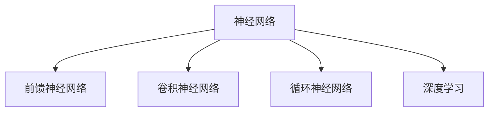

                 

## 1. 背景介绍

### 1.1 问题由来

在人工智能的发展历程中，神经网络作为机器学习的重要工具，日益成为推动社会进步的关键技术。从最初的感知器到复杂的深度学习模型，神经网络的应用已经渗透到图像处理、自然语言处理、语音识别、自动驾驶等众多领域。其核心原理是对生物神经网络的学习和模仿，通过层级结构，模拟信息传递和处理机制，实现复杂模式识别和预测。

然而，随着神经网络技术的发展，关于其与人类大脑的相似性、本质、乃至道德伦理问题的讨论也不断升温。神经网络是否能够真正“理解”世界的本质，还是仅仅作为黑盒模型在数据驱动下进行预测？神经网络的决策过程是否透明，其输出是否可信，如何保障其安全性、公平性、可解释性？这些问题逐渐成为人工智能领域的重要议题。

本文旨在通过深入分析神经网络的原理与架构，探讨其与人类认知的关系，并展望未来神经网络在各行业的应用与挑战。通过系统全面的介绍，希望能够为读者提供清晰的认知框架，激发对于人类与机器共存的深度思考。

### 1.2 问题核心关键点

神经网络的核心问题主要集中在以下几个方面：

- **原理与架构**：神经网络如何通过层级结构模拟生物神经网络，实现复杂模式的识别和预测？
- **可解释性与透明性**：神经网络如何赋予其“理解”世界的能力？其决策过程如何解释？
- **安全性与公平性**：神经网络的输出结果是否可信？如何保证其在决策过程中不产生偏见？
- **实际应用**：神经网络在现实世界中的应用场景有哪些？未来有哪些新的发展方向？

本研究将针对这些问题，从理论到实践，系统阐述神经网络的基本原理、核心算法、实际应用以及面临的挑战。

## 2. 核心概念与联系

### 2.1 核心概念概述

为了更好地理解神经网络的基本原理和架构，本节将介绍几个密切相关的核心概念：

- **神经网络**：由多个层级组成的计算模型，通过模拟生物神经网络的结构和功能，实现数据驱动的预测和决策。
- **前馈神经网络**：输入数据通过网络逐层传递，最终输出预测结果。这是最常见的神经网络结构。
- **卷积神经网络**：针对图像等网格状数据的处理，通过卷积和池化操作，提取局部特征。
- **循环神经网络**：针对时间序列数据的处理，通过循环结构捕捉数据的时序信息。
- **深度学习**：通过多层次的神经网络，学习数据的复杂模式，提升预测精度。

这些核心概念之间的逻辑关系可以通过以下Mermaid流程图来展示：



这个流程图展示神经网络的核心概念及其之间的关系：

1. 神经网络通过前馈、卷积、循环等不同结构，处理不同类型的数据。
2. 前馈神经网络是最基本的神经网络结构。
3. 卷积神经网络专门用于处理图像数据。
4. 循环神经网络用于处理时间序列数据。
5. 深度学习则通过多层次的神经网络，提升模型的复杂性和预测精度。

这些核心概念共同构成了神经网络的认知框架，使得其在众多应用领域中发挥重要作用。

## 3. 核心算法原理 & 具体操作步骤

### 3.1 算法原理概述

神经网络通过多层级结构，模拟生物神经网络的传递和处理机制，实现复杂模式的识别和预测。其核心思想是通过网络中的参数调整，最小化预测误差，从而学习数据的特征表示。

形式化地，假设输入数据为 $x \in \mathcal{X}$，输出数据为 $y \in \mathcal{Y}$，神经网络由多个隐藏层 $H_1, H_2, \ldots, H_L$ 组成，其中 $L$ 为层数。每个隐藏层 $H_i$ 由多个神经元 $n_i$ 组成，每个神经元接收来自上一层的所有神经元输出 $h_{i-1}$，并通过权重 $w_{i,j}$ 和偏置 $b_i$ 进行加权求和，再通过激活函数 $g_i$ 进行非线性变换。最终输出层 $H_L$ 直接映射到输出空间 $\mathcal{Y}$，输出预测结果 $y$。

神经网络的训练过程通常使用反向传播算法，通过计算预测误差 $E$ 对网络参数的梯度，并利用梯度下降等优化算法更新参数，以最小化误差 $E$。训练流程如下：

1. 初始化网络参数 $w, b$。
2. 前向传播：将输入数据 $x$ 输入网络，通过隐藏层传递，输出预测结果 $y'$。
3. 计算误差 $E = y' - y$。
4. 反向传播：通过链式法则，计算误差 $E$ 对参数的梯度，并更新参数 $w, b$。
5. 重复步骤2至4，直至误差 $E$ 收敛或达到预设的迭代轮数。

### 3.2 算法步骤详解

神经网络的训练过程可以分为以下几个关键步骤：

**Step 1: 准备数据集**
- 收集数据集 $D=\{(x_i, y_i)\}_{i=1}^N$，其中 $x_i$ 为输入，$y_i$ 为标签。
- 将数据集划分为训练集、验证集和测试集。

**Step 2: 定义网络结构**
- 确定神经网络的结构，包括层数、每层的神经元数量、激活函数等。
- 定义损失函数，如均方误差、交叉熵等。

**Step 3: 初始化模型参数**
- 随机初始化模型参数 $w, b$，通常使用高斯分布等随机分布方法。

**Step 4: 前向传播**
- 将输入数据 $x$ 输入网络，通过隐藏层传递，得到预测结果 $y'$。

**Step 5: 计算误差**
- 计算预测结果 $y'$ 与真实标签 $y$ 之间的误差 $E$。

**Step 6: 反向传播**
- 通过链式法则计算误差 $E$ 对参数的梯度，并使用优化算法如梯度下降更新模型参数。

**Step 7: 评估模型性能**
- 在验证集上评估模型性能，调整超参数如学习率、批大小等。
- 在测试集上最终评估模型性能，输出最终的预测结果。

### 3.3 算法优缺点

神经网络在处理复杂模式识别和预测时具有以下优点：

1. 高精度：通过多层次的模型结构，神经网络能够学习数据的深层特征表示，提升预测精度。
2. 泛化能力强：神经网络在大规模数据集上进行预训练，能够适应不同的数据分布。
3. 可扩展性强：通过增加网络层数和神经元数量，神经网络能够处理更加复杂的模式。

同时，神经网络也存在一些局限性：

1. 计算资源消耗大：神经网络需要大量的计算资源进行训练和推理。
2. 训练过程复杂：神经网络训练需要大量的样本数据和迭代次数，且存在过拟合风险。
3. 黑盒模型：神经网络决策过程复杂，难以解释其内部工作机制。

尽管存在这些局限性，神经网络在许多领域中依然取得了显著的成就。

### 3.4 算法应用领域

神经网络在以下领域中得到了广泛的应用：

1. **计算机视觉**：通过卷积神经网络（CNN），神经网络在图像分类、目标检测、人脸识别等方面取得了突破性进展。
2. **自然语言处理**：通过循环神经网络（RNN）和Transformer结构，神经网络在文本生成、情感分析、机器翻译等方面表现优异。
3. **语音识别**：通过递归神经网络（RNN）和长短时记忆网络（LSTM），神经网络在语音识别、情感识别等方面表现出色。
4. **自动驾驶**：通过多层次神经网络，神经网络在环境感知、路径规划、决策控制等方面发挥关键作用。
5. **推荐系统**：通过协同过滤和深度学习模型，神经网络在电商推荐、内容推荐等方面提升了用户体验。
6. **医疗诊断**：通过神经网络在医学图像处理、疾病预测等方面，提高了医疗诊断的准确性和效率。

## 4. 数学模型和公式 & 详细讲解

### 4.1 数学模型构建

神经网络的数学模型可以通过以下公式来定义：

假设神经网络由 $L$ 个隐藏层组成，每个隐藏层 $H_i$ 包含 $n_i$ 个神经元，激活函数为 $g_i$。输入数据 $x$ 经过 $L$ 个隐藏层传递后，输出结果 $y'$ 可以表示为：

$$
y' = g_L(W_Lg_{L-1}(... g_2(W_2g_1(W_1x + b_1) + b_2) + ... + b_L)
$$

其中 $W_i$ 为权重矩阵，$b_i$ 为偏置向量。

### 4.2 公式推导过程

以下我们将通过一个简单的三层前馈神经网络为例，推导其预测公式和误差公式。

假设输入数据 $x$ 经过第一层神经元，得到输出 $h_1$，第二层神经元得到输出 $h_2$，最终输出层得到预测结果 $y'$：

$$
h_1 = g_1(W_{1x}x + b_1)
$$

$$
h_2 = g_2(W_{2h}h_1 + b_2)
$$

$$
y' = g_L(W_Lh_2 + b_L)
$$

其中 $g_i$ 为激活函数，通常采用ReLU、Sigmoid等。

设神经网络的预测结果与真实标签之间的误差为 $E$，则误差公式为：

$$
E = \frac{1}{N}\sum_{i=1}^N (y_i - y'_i)^2
$$

其中 $y_i$ 为真实标签，$y'_i$ 为预测结果。

### 4.3 案例分析与讲解

以图像分类为例，卷积神经网络（CNN）在处理图像数据时具有独特优势。其核心结构包括卷积层、池化层、全连接层等。

假设输入图像 $x$ 大小为 $m \times n \times c$，卷积核大小为 $k \times k$，输出特征图大小为 $m' \times n' \times o$。卷积操作可以表示为：

$$
X_{ij} = \sum_{p=0}^{k-1}\sum_{q=0}^{k-1}W_{pq}X_{ij-pq} + b
$$

其中 $X_{ij}$ 为输出特征图，$W_{pq}$ 为卷积核，$b$ 为偏置。

通过多层的卷积和池化操作，神经网络可以逐步提取出图像的局部特征，并最终通过全连接层得到预测结果。

## 5. 项目实践：代码实例和详细解释说明

### 5.1 开发环境搭建

在进行神经网络项目实践前，我们需要准备好开发环境。以下是使用Python进行TensorFlow开发的环境配置流程：

1. 安装Anaconda：从官网下载并安装Anaconda，用于创建独立的Python环境。

2. 创建并激活虚拟环境：
```bash
conda create -n tf-env python=3.8 
conda activate tf-env
```

3. 安装TensorFlow：根据CUDA版本，从官网获取对应的安装命令。例如：
```bash
conda install tensorflow -c pytorch -c conda-forge
```

4. 安装各类工具包：
```bash
pip install numpy pandas scikit-learn matplotlib tqdm jupyter notebook ipython
```

完成上述步骤后，即可在`tf-env`环境中开始神经网络实践。

### 5.2 源代码详细实现

下面我们以图像分类任务为例，给出使用TensorFlow对卷积神经网络进行开发的PyTorch代码实现。

首先，定义神经网络的结构：

```python
import tensorflow as tf
from tensorflow.keras import layers

model = tf.keras.Sequential([
    layers.Conv2D(32, (3, 3), activation='relu', input_shape=(28, 28, 1)),
    layers.MaxPooling2D((2, 2)),
    layers.Conv2D(64, (3, 3), activation='relu'),
    layers.MaxPooling2D((2, 2)),
    layers.Flatten(),
    layers.Dense(64, activation='relu'),
    layers.Dense(10, activation='softmax')
])
```

然后，定义训练和评估函数：

```python
from tensorflow.keras import datasets, optimizers, losses

# 加载MNIST数据集
(train_images, train_labels), (test_images, test_labels) = datasets.mnist.load_data()

# 数据预处理
train_images = train_images.reshape((60000, 28, 28, 1)) / 255.0
test_images = test_images.reshape((10000, 28, 28, 1)) / 255.0

# 数据增强
train_generator = tf.data.Dataset.from_tensor_slices((train_images, train_labels)).shuffle(60000).batch(128)
test_generator = tf.data.Dataset.from_tensor_slices((test_images, test_labels)).batch(128)

# 定义损失函数和优化器
loss_fn = losses.SparseCategoricalCrossentropy()
optimizer = optimizers.Adam()

# 训练函数
@tf.function
def train_step(images, labels):
    with tf.GradientTape() as tape:
        logits = model(images, training=True)
        loss_value = loss_fn(labels, logits)
    grads = tape.gradient(loss_value, model.trainable_variables)
    optimizer.apply_gradients(zip(grads, model.trainable_variables))

# 评估函数
@tf.function
def evaluate_step(images, labels):
    logits = model(images, training=False)
    return loss_fn(labels, logits)

# 训练流程
epochs = 10
batch_size = 128

for epoch in range(epochs):
    for images, labels in train_generator:
        train_step(images, labels)
    
    # 在验证集上评估模型性能
    for images, labels in test_generator:
        loss_value = evaluate_step(images, labels)
        print(f'Epoch {epoch+1}, test loss: {loss_value:.3f}')

print(f'Model trained for {epochs} epochs.')
```

以上就是使用TensorFlow对卷积神经网络进行图像分类任务开发的完整代码实现。可以看到，得益于TensorFlow的便捷封装，我们只需通过简洁的代码即可实现神经网络的构建和训练。

### 5.3 代码解读与分析

让我们再详细解读一下关键代码的实现细节：

**Sequential模型**：
- `Sequential` 类用于创建顺序神经网络模型，便于添加多个连续层。

**Conv2D层**：
- `Conv2D` 层用于卷积操作，`(3,3)` 表示卷积核大小，`32` 表示输出通道数。

**MaxPooling2D层**：
- `MaxPooling2D` 层用于池化操作，`(2,2)` 表示池化核大小。

**Flatten层**：
- `Flatten` 层用于将多维数据展开为向量。

**Dense层**：
- `Dense` 层用于全连接操作，`64` 表示神经元数量。

**softmax激活函数**：
- `softmax` 激活函数用于多分类任务的输出。

**数据增强**：
- 使用 `tf.data.Dataset` 和 `batch()` 方法，对数据进行批处理，提升训练效率。

**损失函数**：
- `SparseCategoricalCrossentropy` 用于多分类任务的损失计算。

**优化器**：
- `Adam` 优化器用于网络参数的更新。

**训练函数**：
- `tf.function` 装饰器用于定义计算图，提升模型训练速度。

**评估函数**：
- `evaluate_step` 函数用于评估模型在测试集上的性能。

在实际应用中，还需要根据具体任务进行更多的细节优化，如学习率调度、正则化技术、模型裁剪等，以进一步提升模型性能和训练效率。

## 6. 实际应用场景

### 6.1 自动驾驶

神经网络在自动驾驶领域具有广泛的应用前景。通过多层次的深度学习模型，神经网络能够实现环境感知、路径规划、决策控制等核心功能。

在环境感知方面，神经网络可以通过摄像头、雷达等传感器采集数据，进行实时处理，提取道路、车辆、行人等关键信息。例如，基于卷积神经网络（CNN）的图像识别技术，能够实现交通标志识别、车道线检测等任务。

在路径规划方面，神经网络可以通过历史数据和实时数据，学习最优的路径选择策略，避免障碍物和风险点。例如，通过深度强化学习模型，实现智能车辆在复杂交通环境中的自主驾驶。

在决策控制方面，神经网络可以通过多传感器融合技术，实现对环境动态变化的快速响应，做出安全、高效的决策。例如，通过循环神经网络（RNN）和长短时记忆网络（LSTM），实现交通流量预测、车辆避障等任务。

### 6.2 医疗诊断

神经网络在医疗诊断中具有重要的应用价值。通过深度学习模型，神经网络能够处理大量的医疗影像数据，提取疾病特征，辅助医生进行诊断。

在图像识别方面，神经网络可以通过卷积神经网络（CNN），实现肺部X光片中的病灶检测、乳腺癌检测等任务。例如，基于卷积神经网络（CNN）的病理图像识别技术，能够快速识别和定位肿瘤、病灶等异常区域。

在疾病预测方面，神经网络可以通过循环神经网络（RNN）和长短时记忆网络（LSTM），实现疾病预测和诊断。例如，通过循环神经网络（RNN）的序列建模技术，实现对患者病历数据的时序分析，预测疾病发展趋势和风险。

在治疗方案推荐方面，神经网络可以通过多层次深度学习模型，学习患者的历史数据和当前状态，推荐个性化的治疗方案。例如，通过协同过滤和深度学习模型，推荐最合适的药物、手术方案等。

### 6.3 金融风控

神经网络在金融风控领域具有广泛的应用。通过深度学习模型，神经网络能够处理大量的金融数据，识别异常行为和风险，降低金融风险。

在欺诈检测方面，神经网络可以通过循环神经网络（RNN）和长短时记忆网络（LSTM），实现对用户行为的时序分析，识别异常交易和欺诈行为。例如，通过循环神经网络（RNN）的序列建模技术，实现对用户交易数据的分析，预测欺诈行为的发生概率。

在信用评估方面，神经网络可以通过卷积神经网络（CNN）和多层次深度学习模型，实现对用户信用记录和行为数据的建模，预测用户的信用风险。例如，通过卷积神经网络（CNN）的图像识别技术，识别用户的社交网络关系和行为特征，评估其信用风险。

在投资决策方面，神经网络可以通过深度学习模型，学习历史市场数据和当前市场动态，辅助投资者进行投资决策。例如，通过深度学习模型的预测功能，预测股票市场的趋势和波动，提供投资建议。

### 6.4 未来应用展望

神经网络在各行业的应用前景广阔，未来将在以下方向继续深化和扩展：

1. **多模态融合**：神经网络将进一步融合多模态数据，提升综合分析能力。例如，将文本、图像、语音等多模态数据进行联合建模，实现更全面的信息理解。

2. **联邦学习**：神经网络将采用联邦学习技术，保护用户隐私的同时，实现模型的协同优化。例如，通过分布式计算，联合多个机构的私有数据，提升模型性能。

3. **模型压缩**：神经网络将采用模型压缩技术，减少计算资源消耗，提高部署效率。例如，通过剪枝、量化、压缩等方法，提升模型的计算速度和存储效率。

4. **自适应学习**：神经网络将采用自适应学习技术，动态调整模型结构和参数，提升模型的适应性和鲁棒性。例如，通过自适应学习算法，实时调整模型参数，适应数据分布的变化。

5. **模型解释**：神经网络将采用模型解释技术，提升模型的可解释性和透明性。例如，通过可解释性算法，可视化模型的决策过程，提供更可靠的解释和支持。

6. **伦理道德**：神经网络将加强伦理道德约束，确保模型的公平性、安全性。例如，引入伦理导向的评估指标，过滤和惩罚有偏见、有害的输出倾向。

这些技术趋势将进一步推动神经网络在各行业的应用，提升模型的性能和安全性，为人类与机器的共存提供更多可能性。

## 7. 工具和资源推荐

### 7.1 学习资源推荐

为了帮助开发者系统掌握神经网络的基本原理和实践技巧，这里推荐一些优质的学习资源：

1. 《深度学习》课程（Coursera）：斯坦福大学Andrew Ng教授的深度学习课程，系统讲解深度学习的基本概念和前沿技术。

2. 《神经网络与深度学习》书籍（Goodfellow et al.）：深度学习领域的经典教材，详细介绍了神经网络的结构和算法。

3. 《TensorFlow官方文档》：TensorFlow的官方文档，提供了丰富的示例和API参考，适合初学者和开发者使用。

4. 《Keras官方文档》：Keras的官方文档，提供了便捷的API接口和示例代码，适合快速原型开发。

5. 《PyTorch官方文档》：PyTorch的官方文档，提供了灵活的计算图和API接口，适合深度学习和研究。

6. 《Nature机器学习杂志》：Nature机器学习杂志，涵盖前沿研究和技术进展，适合研究者和开发者关注。

通过对这些资源的学习实践，相信你一定能够快速掌握神经网络的基本原理和实践技巧，并用于解决实际的工程问题。

### 7.2 开发工具推荐

高效的开发离不开优秀的工具支持。以下是几款用于神经网络开发的常用工具：

1. TensorFlow：由Google主导开发的开源深度学习框架，生产部署方便，适合大规模工程应用。

2. PyTorch：由Facebook主导开发的深度学习框架，灵活动态，适合研究性开发和教学。

3. Keras：高层次的神经网络API，易于上手，适合快速原型开发和模型部署。

4. MXNet：由亚马逊主导开发的深度学习框架，支持多语言编程，适合分布式计算。

5. Caffe：由伯克利大学主导开发的深度学习框架，适合图像处理和计算机视觉任务。

6. Torch：由Lua语言开发的深度学习框架，灵活高效，适合研究性开发。

合理利用这些工具，可以显著提升神经网络项目的开发效率，加快创新迭代的步伐。

### 7.3 相关论文推荐

神经网络的发展离不开学界的持续研究。以下是几篇奠基性的相关论文，推荐阅读：

1. AlexNet：ImageNet Large Scale Visual Recognition Challenge比赛冠军模型，引入了卷积神经网络（CNN）结构。

2. ResNet：提出了残差连接（Residual Connection），解决了深层网络训练中的梯度消失问题。

3. Inception：引入了多分支卷积和并行计算，提升了卷积神经网络（CNN）的性能和效率。

4. LSTM：提出了长短时记忆网络（LSTM），用于处理时间序列数据的序列建模。

5. RNN：引入了循环神经网络（RNN），用于处理序列数据的建模。

6. Transformer：提出了自注意力机制，提升了神经网络在自然语言处理（NLP）任务中的表现。

这些论文代表了大规模深度学习技术的发展脉络。通过学习这些前沿成果，可以帮助研究者把握学科前进方向，激发更多的创新灵感。

## 8. 总结：未来发展趋势与挑战

### 8.1 总结

本文对神经网络的原理与架构进行了全面系统的介绍。首先阐述了神经网络的基本概念和结构，明确了其在图像处理、自然语言处理、语音识别等领域的应用价值。其次，从原理到实践，详细讲解了神经网络的训练过程，给出了神经网络在图像分类、图像识别、自然语言处理等任务中的具体实现方法。最后，探讨了神经网络在各行业的应用前景，并展望了未来发展的方向和面临的挑战。

通过本文的系统梳理，可以看到，神经网络通过多层级结构，模拟生物神经网络的传递和处理机制，在处理复杂模式识别和预测时具有高精度和泛化能力。尽管其计算资源消耗大、训练复杂等局限性存在，但神经网络在各行业的应用已经取得了显著的成就。未来，随着技术的发展，神经网络将朝着多模态融合、联邦学习、模型压缩等方向继续演进，进一步提升模型的性能和效率，为人机共存带来更多可能性。

### 8.2 未来发展趋势

展望未来，神经网络的发展趋势将主要体现在以下几个方面：

1. **多模态融合**：神经网络将融合多模态数据，提升综合分析能力。例如，将文本、图像、语音等多模态数据进行联合建模，实现更全面的信息理解。

2. **联邦学习**：神经网络将采用联邦学习技术，保护用户隐私的同时，实现模型的协同优化。例如，通过分布式计算，联合多个机构的私有数据，提升模型性能。

3. **模型压缩**：神经网络将采用模型压缩技术，减少计算资源消耗，提高部署效率。例如，通过剪枝、量化、压缩等方法，提升模型的计算速度和存储效率。

4. **自适应学习**：神经网络将采用自适应学习技术，动态调整模型结构和参数，提升模型的适应性和鲁棒性。例如，通过自适应学习算法，实时调整模型参数，适应数据分布的变化。

5. **模型解释**：神经网络将采用模型解释技术，提升模型的可解释性和透明性。例如，通过可解释性算法，可视化模型的决策过程，提供更可靠的解释和支持。

6. **伦理道德**：神经网络将加强伦理道德约束，确保模型的公平性、安全性。例如，引入伦理导向的评估指标，过滤和惩罚有偏见、有害的输出倾向。

### 8.3 面临的挑战

尽管神经网络在各领域的应用已经取得了显著成就，但未来仍面临诸多挑战：

1. **计算资源消耗大**：神经网络需要大量的计算资源进行训练和推理。如何进一步降低计算成本，提升模型效率，是未来的重要研究方向。

2. **数据隐私保护**：神经网络在处理大量用户数据时，如何保护用户隐私，防止数据泄露，也是亟需解决的问题。

3. **模型可解释性**：神经网络作为黑盒模型，难以解释其内部工作机制和决策逻辑。如何赋予模型更强的可解释性，提升用户信任度，是未来的重要研究方向。

4. **模型公平性**：神经网络在处理不同类型数据时，可能存在偏见和歧视。如何提升模型的公平性，避免有害输出，是未来的重要研究方向。

5. **模型安全性**：神经网络在处理敏感数据时，可能存在安全漏洞，如何保障模型安全性，防止恶意攻击，是未来的重要研究方向。

6. **跨领域应用**：神经网络在处理不同领域的数据时，可能存在知识迁移障碍。如何提升模型的跨领域适应能力，拓展应用场景，是未来的重要研究方向。

### 8.4 研究展望

面对神经网络所面临的诸多挑战，未来的研究需要在以下几个方面寻求新的突破：

1. **探索无监督和半监督学习**：摆脱对大规模标注数据的依赖，利用自监督学习、主动学习等无监督和半监督范式，最大限度利用非结构化数据，实现更加灵活高效的神经网络。

2. **研究参数高效和计算高效的神经网络**：开发更加参数高效的神经网络，在固定大部分预训练参数的情况下，只更新极少量的任务相关参数。同时优化神经网络的计算图，减少前向传播和反向传播的资源消耗，实现更加轻量级、实时性的部署。

3. **融合因果推断和对比学习**：通过引入因果推断和对比学习思想，增强神经网络建立稳定因果关系的能力，学习更加普适、鲁棒的语言表征，从而提升模型泛化性和抗干扰能力。

4. **引入更多先验知识**：将符号化的先验知识，如知识图谱、逻辑规则等，与神经网络模型进行巧妙融合，引导神经网络学习更准确、合理的语言模型。同时加强不同模态数据的整合，实现视觉、语音等多模态信息与文本信息的协同建模。

5. **结合因果分析和博弈论工具**：将因果分析方法引入神经网络，识别出模型决策的关键特征，增强输出解释的因果性和逻辑性。借助博弈论工具刻画人机交互过程，主动探索并规避模型的脆弱点，提高系统稳定性。

6. **纳入伦理道德约束**：在神经网络训练目标中引入伦理导向的评估指标，过滤和惩罚有偏见、有害的输出倾向。同时加强人工干预和审核，建立模型行为的监管机制，确保输出符合人类价值观和伦理道德。

这些研究方向将进一步推动神经网络在各行业的应用，提升模型的性能和安全性，为人类与机器的共存提供更多可能性。

## 9. 附录：常见问题与解答

**Q1：神经网络如何理解复杂模式？**

A: 神经网络通过多层级结构，模拟生物神经网络的传递和处理机制，实现复杂模式的识别和预测。其核心思想是通过网络中的参数调整，最小化预测误差，从而学习数据的特征表示。在训练过程中，神经网络逐步调整权重和偏置，使其能够更好地适应训练数据，并泛化到测试数据中。

**Q2：神经网络的可解释性如何提升？**

A: 提升神经网络的可解释性是当前研究的热点方向。一种常见的方法是使用可解释性算法，如LIME、SHAP等，可视化神经网络的决策过程，提供更可靠的解释和支持。此外，也可以引入更透明的模型架构，如决策树、线性模型等，提升模型的透明性和可解释性。

**Q3：神经网络在处理大规模数据时如何优化？**

A: 神经网络在处理大规模数据时，面临计算资源消耗大、训练时间长的挑战。为了提升模型的效率，可以采用以下方法：

1. 数据增强：通过对数据进行扩充和变换，提高模型的泛化能力。

2. 分布式训练：通过分布式计算，加速模型的训练过程。

3. 模型压缩：通过剪枝、量化、压缩等方法，减小模型的参数量和计算资源消耗。

4. 自适应学习：通过自适应学习算法，动态调整模型参数，适应数据分布的变化。

5. 联邦学习：通过分布式计算，联合多个机构的私有数据，提升模型性能。

**Q4：神经网络在处理多模态数据时如何建模？**

A: 神经网络在处理多模态数据时，可以通过融合多模态数据，提升综合分析能力。例如，将文本、图像、语音等多模态数据进行联合建模，实现更全面的信息理解。具体方法包括：

1. 特征融合：将不同模态的数据进行特征提取，再进行融合。

2. 共享表示：通过共享表示学习，实现多模态数据的联合建模。

3. 多模态网络：使用多模态网络，处理不同模态的数据。

**Q5：神经网络在处理实时数据时如何优化？**

A: 神经网络在处理实时数据时，面临计算资源消耗大、推理速度慢的问题。为了提升模型的实时性，可以采用以下方法：

1. 模型裁剪：去除不必要的层和参数，减小模型尺寸，加快推理速度。

2. 量化加速：将浮点模型转为定点模型，压缩存储空间，提高计算效率。

3. 模型压缩：通过剪枝、量化、压缩等方法，减小模型的参数量和计算资源消耗。

4. 模型并行：通过模型并行，实现高效的分布式计算。

通过这些优化方法，可以显著提升神经网络在实时数据处理中的应用效果。

---

作者：禅与计算机程序设计艺术 / Zen and the Art of Computer Programming

