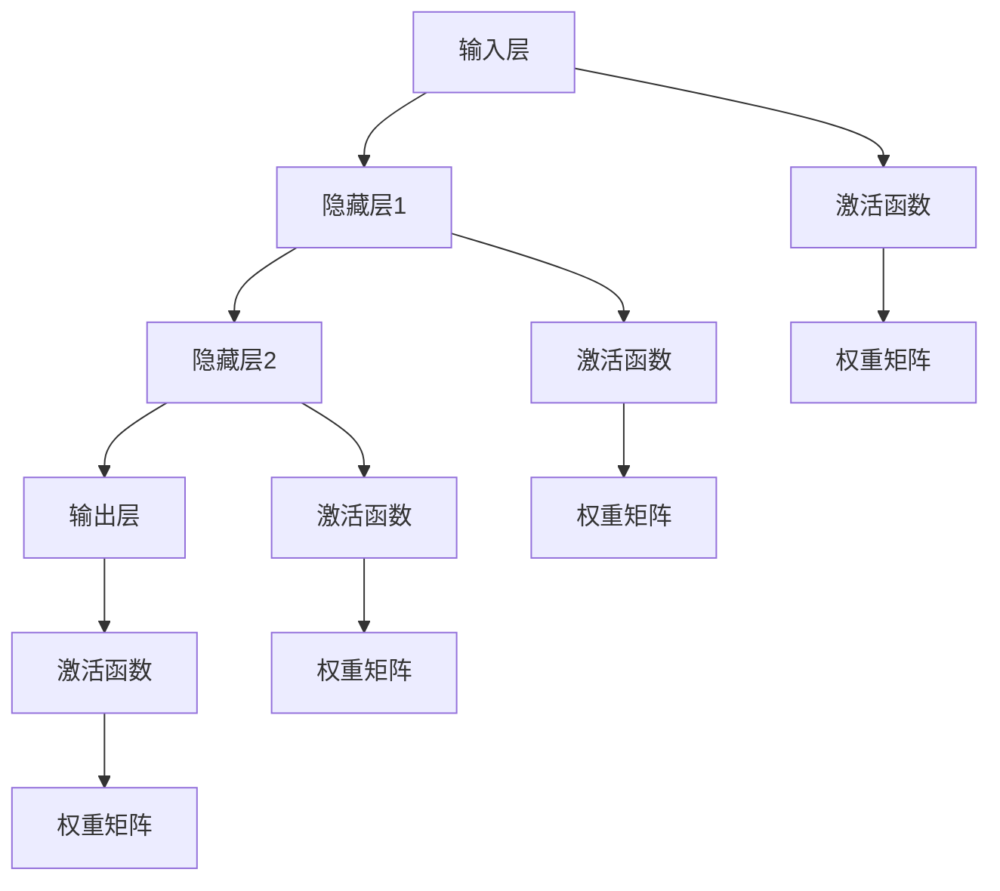

                 

## 1. 背景介绍

### 1.1 问题由来

随着计算技术、数据技术的迅速发展，人工智能(AI)的应用领域不断扩展，从简单的图像识别、语音识别扩展到复杂的自然语言处理、智能决策等领域。其中，神经网络作为AI的核心技术之一，在深度学习领域表现尤为突出，从简单的多层感知机(MLP)发展到今天复杂的卷积神经网络(CNN)、循环神经网络(RNN)和Transformer等模型，已广泛应用于计算机视觉、自然语言处理、语音识别、游戏AI等多个领域，并取得了显著成果。

然而，尽管神经网络在诸多领域表现出色，但其背后的数学原理和计算过程仍然令人困惑。神经网络如何实现从输入到输出的映射？为什么要使用反向传播算法来更新权重？神经网络为何能进行泛化学习？本文将深入探讨这些问题，带领读者更好地理解神经网络的工作原理和应用实践。

### 1.2 问题核心关键点

神经网络通过大量数据的输入，经过一系列非线性变换，实现对输入数据的深度学习和特征提取。其核心原理包括：

- **前向传播**：将输入数据通过一系列变换传递到输出层，得到模型预测结果。
- **损失函数**：衡量预测结果与真实标签之间的差异，通过最小化损失函数，优化模型参数。
- **反向传播**：利用链式法则，计算损失函数对模型参数的梯度，通过梯度下降等优化算法，更新模型参数，使预测结果更接近真实标签。
- **权重初始化**：初始化模型的权重参数，避免梯度消失或爆炸，保证模型能够收敛。
- **激活函数**：通过引入非线性变换，增强模型的表达能力，保证模型具有非线性特性。

这些核心概念构成了神经网络的学习机制，并使得其能够实现从数据到模型的自动学习，大大降低了模型设计、调参等任务的复杂度。

## 2. 核心概念与联系

### 2.1 核心概念概述

神经网络是一类模拟人脑神经元之间连接关系的计算模型，通过层层叠加，实现对输入数据的深度学习和特征提取。其核心组件包括输入层、隐藏层和输出层。

- **输入层**：接收原始输入数据。
- **隐藏层**：包含若干神经元，通过非线性变换提取输入数据特征。
- **输出层**：根据隐藏层的输出，计算最终的预测结果。

神经网络的学习过程由前向传播和反向传播两部分组成。前向传播通过一系列变换将输入数据传递到输出层，反向传播则通过梯度下降等算法更新模型参数，最小化损失函数，提高模型性能。

### 2.2 核心概念原理和架构的 Mermaid 流程图(Mermaid 流程节点中不要有括号、逗号等特殊字符)



## 3. 核心算法原理 & 具体操作步骤

### 3.1 算法原理概述

神经网络的核心算法是反向传播算法，通过梯度下降等优化算法更新模型参数，实现模型的深度学习和特征提取。其核心思想是通过链式法则计算损失函数对模型参数的梯度，利用梯度下降等优化算法，更新模型参数，最小化损失函数。

### 3.2 算法步骤详解

#### 3.2.1 前向传播

前向传播是神经网络计算过程的第一步，将输入数据通过一系列非线性变换传递到输出层，得到模型预测结果。具体步骤如下：

1. 输入数据 $x$ 输入到输入层，进行线性变换，得到向量 $h_0 = W_0x + b_0$，其中 $W_0$ 为输入层的权重矩阵，$b_0$ 为偏置向量。
2. 通过激活函数 $f$，得到隐藏层 $h_1 = f(h_0)$。
3. 重复上述步骤，将隐藏层 $h_1$ 通过隐藏层 $h_2$ 传递到下一个隐藏层，直至输出层。
4. 输出层通过线性变换得到预测结果 $y = W_Lh_{L-1} + b_L$，其中 $W_L$ 为输出层的权重矩阵，$b_L$ 为偏置向量。

#### 3.2.2 损失函数

损失函数是衡量模型预测结果与真实标签之间差异的函数，通过最小化损失函数，优化模型参数。常用的损失函数包括：

- **均方误差损失函数**：适用于回归问题，计算预测值与真实值之间的平均误差。
- **交叉熵损失函数**：适用于分类问题，计算预测结果与真实标签之间的交叉熵。

#### 3.2.3 反向传播

反向传播是神经网络学习的关键步骤，通过链式法则计算损失函数对模型参数的梯度，利用梯度下降等算法更新模型参数。具体步骤如下：

1. 计算输出层的预测结果 $y$ 与真实标签 $y'$ 之间的差异 $l$，得到损失函数 $\mathcal{L}(y, y')$。
2. 反向传播计算损失函数对输出层的权重矩阵 $W_L$ 和偏置向量 $b_L$ 的梯度 $\nabla \mathcal{L} / \nabla W_L, \nabla \mathcal{L} / \nabla b_L$。
3. 通过链式法则计算损失函数对隐藏层的权重矩阵 $W_{l-1}$ 和偏置向量 $b_{l-1}$ 的梯度 $\nabla \mathcal{L} / \nabla W_{l-1}, \nabla \mathcal{L} / \nabla b_{l-1}$。
4. 重复上述步骤，直至输入层，得到损失函数对输入层的梯度 $\nabla \mathcal{L} / \nabla x$。
5. 利用梯度下降等优化算法，更新模型参数 $W_L, b_L, W_{l-1}, b_{l-1}, \cdots, W_0, b_0$。

### 3.3 算法优缺点

神经网络的优点包括：

- **自动学习**：能够自动从大量数据中学习特征和模式，无需手动设计特征提取过程。
- **非线性映射**：通过引入非线性激活函数，增强模型的表达能力，适应复杂非线性问题。
- **可扩展性**：通过增加隐藏层和神经元数量，可以提升模型的复杂度和表达能力。

然而，神经网络也存在一些缺点：

- **过拟合风险**：模型参数数量庞大，容易过拟合训练数据，需要引入正则化等方法。
- **计算复杂度高**：神经网络结构复杂，计算复杂度较高，需要高性能计算设备。
- **权重初始化问题**：权重初始化不当可能导致梯度消失或爆炸，影响模型收敛。
- **模型解释性差**：神经网络是黑盒模型，难以解释模型内部决策过程。

## 4. 数学模型和公式 & 详细讲解

### 4.1 数学模型构建

神经网络的数学模型可以通过以下几个数学公式表示：

1. 前向传播公式：

   $$
   h_0 = W_0x + b_0 \\
   h_l = f(h_{l-1}) \quad (l=1,\cdots,L-1) \\
   y = W_Lh_{L-1} + b_L
   $$

   其中 $x$ 为输入数据，$h_0$ 为输入层的输出，$f$ 为激活函数，$h_l$ 为隐藏层的输出，$y$ 为输出层的输出。

2. 均方误差损失函数：

   $$
   \mathcal{L}(y, y') = \frac{1}{2}(y - y')^2
   $$

   其中 $y'$ 为真实标签。

3. 反向传播公式：

   $$
   \frac{\partial \mathcal{L}}{\partial y} = -(y - y') \\
   \frac{\partial \mathcal{L}}{\partial h_{L-1}} = W_L^T \frac{\partial \mathcal{L}}{\partial y} \\
   \frac{\partial \mathcal{L}}{\partial h_l} = \frac{\partial \mathcal{L}}{\partial h_{l+1}} \frac{\partial h_{l+1}}{\partial h_l} \quad (l=L-2,\cdots,0) \\
   \frac{\partial \mathcal{L}}{\partial W_L} = h_{L-1}^T \frac{\partial \mathcal{L}}{\partial y} \\
   \frac{\partial \mathcal{L}}{\partial b_L} = \frac{\partial \mathcal{L}}{\partial y} \\
   \frac{\partial \mathcal{L}}{\partial h_l} = \frac{\partial \mathcal{L}}{\partial W_{l+1}} W_{l+1}^T \frac{\partial f}{\partial h_{l+1}} + \frac{\partial \mathcal{L}}{\partial h_{l+2}} \frac{\partial h_{l+2}}{\partial h_l} \\
   \frac{\partial \mathcal{L}}{\partial W_l} = \frac{\partial \mathcal{L}}{\partial h_l} h_l^T \\
   \frac{\partial \mathcal{L}}{\partial b_l} = \frac{\partial \mathcal{L}}{\partial h_l}
   $$

### 4.2 公式推导过程

以均方误差损失函数为例，推导神经网络反向传播的公式。假设输出层的预测结果为 $y$，真实标签为 $y'$，则损失函数为：

$$
\mathcal{L}(y, y') = \frac{1}{2}(y - y')^2
$$

对损失函数求梯度，得到：

$$
\frac{\partial \mathcal{L}}{\partial y} = (y - y') \\
\frac{\partial \mathcal{L}}{\partial h_{L-1}} = W_L^T \frac{\partial \mathcal{L}}{\partial y} \\
\frac{\partial \mathcal{L}}{\partial h_l} = \frac{\partial \mathcal{L}}{\partial h_{l+1}} \frac{\partial h_{l+1}}{\partial h_l} \quad (l=L-2,\cdots,0) \\
\frac{\partial \mathcal{L}}{\partial W_L} = h_{L-1}^T \frac{\partial \mathcal{L}}{\partial y} \\
\frac{\partial \mathcal{L}}{\partial b_L} = \frac{\partial \mathcal{L}}{\partial y} \\
\frac{\partial \mathcal{L}}{\partial h_l} = \frac{\partial \mathcal{L}}{\partial W_{l+1}} W_{l+1}^T \frac{\partial f}{\partial h_{l+1}} + \frac{\partial \mathcal{L}}{\partial h_{l+2}} \frac{\partial h_{l+2}}{\partial h_l} \\
\frac{\partial \mathcal{L}}{\partial W_l} = \frac{\partial \mathcal{L}}{\partial h_l} h_l^T \\
\frac{\partial \mathcal{L}}{\partial b_l} = \frac{\partial \mathcal{L}}{\partial h_l}
$$

### 4.3 案例分析与讲解

以手写数字识别为例，分析神经网络的学习过程。假设输入数据为手写数字的灰度图像，输出层为10个神经元，表示0到9的数字。

1. **输入层**：接收手写数字图像，进行线性变换，得到向量 $h_0 = W_0x + b_0$。
2. **隐藏层**：将向量 $h_0$ 输入到激活函数中，得到隐藏层的输出 $h_1 = f(h_0)$。
3. **输出层**：将隐藏层的输出 $h_1$ 输入到线性变换中，得到预测结果 $y = W_Lh_{L-1} + b_L$。
4. **损失函数**：计算预测结果 $y$ 与真实标签 $y'$ 之间的均方误差损失函数 $\mathcal{L}(y, y')$。
5. **反向传播**：利用反向传播算法计算损失函数对模型参数的梯度，更新模型参数 $W_L, b_L, W_{l-1}, b_{l-1}, \cdots, W_0, b_0$。

通过反向传播算法，神经网络能够自动学习从输入数据到输出标签的映射关系，实现手写数字识别。在实际应用中，通过对大量手写数字样本进行训练，神经网络能够学习到数字的特征和模式，实现高效的识别。

## 5. 项目实践：代码实例和详细解释说明

### 5.1 开发环境搭建

在开始神经网络的实践之前，需要准备以下开发环境：

1. Python 3.x：作为主要编程语言，Python 3.x 支持各种第三方库和框架。
2. PyTorch：一个开源深度学习框架，支持动态图和静态图，方便模型的构建和训练。
3. Jupyter Notebook：一个交互式编程环境，方便代码的编写和调试。

### 5.2 源代码详细实现

以下是一个简单的神经网络代码实现，用于手写数字识别。

```python
import torch
import torch.nn as nn
import torch.optim as optim
from torchvision import datasets, transforms

# 定义神经网络模型
class Net(nn.Module):
    def __init__(self):
        super(Net, self).__init__()
        self.fc1 = nn.Linear(784, 256)
        self.fc2 = nn.Linear(256, 64)
        self.fc3 = nn.Linear(64, 10)

    def forward(self, x):
        x = x.view(-1, 784)
        x = torch.relu(self.fc1(x))
        x = torch.relu(self.fc2(x))
        x = self.fc3(x)
        return x

# 加载数据集
train_dataset = datasets.MNIST(root='data', train=True, transform=transforms.ToTensor(), download=True)
test_dataset = datasets.MNIST(root='data', train=False, transform=transforms.ToTensor())

# 数据批处理
train_loader = torch.utils.data.DataLoader(train_dataset, batch_size=64, shuffle=True)
test_loader = torch.utils.data.DataLoader(test_dataset, batch_size=64, shuffle=False)

# 定义模型和优化器
model = Net()
criterion = nn.CrossEntropyLoss()
optimizer = optim.SGD(model.parameters(), lr=0.01, momentum=0.5)

# 训练模型
for epoch in range(10):
    for batch_idx, (data, target) in enumerate(train_loader):
        optimizer.zero_grad()
        output = model(data)
        loss = criterion(output, target)
        loss.backward()
        optimizer.step()
        if batch_idx % 100 == 0:
            print('Train Epoch: {} [{}/{} ({:.0f}%)]\tLoss: {:.6f}'.format(
                epoch, batch_idx * len(data), len(train_loader.dataset),
                100. * batch_idx / len(train_loader), loss.item()))

# 测试模型
correct = 0
total = 0
with torch.no_grad():
    for data, target in test_loader:
        output = model(data)
        _, predicted = torch.max(output.data, 1)
        total += target.size(0)
        correct += (predicted == target).sum().item()
print('Accuracy of the network on the 10000 test images: {} %'.format(100 * correct / total))
```

### 5.3 代码解读与分析

在代码实现中，我们使用了PyTorch框架来构建和训练神经网络模型。具体步骤如下：

1. **模型定义**：定义了一个包含两个隐藏层和三个全连接层的神经网络模型。
2. **数据加载**：使用torchvision库加载手写数字数据集，并进行批处理。
3. **模型训练**：通过SGD优化器进行模型训练，计算损失函数，并利用反向传播算法更新模型参数。
4. **模型测试**：对测试集进行测试，计算模型在测试集上的准确率。

在训练过程中，我们使用了交叉熵损失函数和随机梯度下降优化器。通过前向传播和反向传播，神经网络能够自动学习输入数据到输出标签的映射关系，实现手写数字识别。在测试过程中，我们计算模型在测试集上的准确率，以评估模型的性能。

## 6. 实际应用场景

### 6.1 计算机视觉

神经网络在计算机视觉领域的应用非常广泛，如图像分类、目标检测、图像生成等。以图像分类为例，神经网络可以通过大量的图片数据进行训练，学习到图片的特征和模式，实现对图片的自动分类。常见的神经网络模型包括卷积神经网络(CNN)、残差网络(ResNet)等。

在实际应用中，神经网络被广泛应用于图像识别、医学影像分析、自动驾驶等领域。例如，谷歌的Inception网络被用于图像分类和目标检测，百度的深度学习平台PaddlePaddle被用于医学影像分析和自动驾驶。

### 6.2 自然语言处理

神经网络在自然语言处理领域也有广泛的应用，如机器翻译、文本分类、情感分析等。以机器翻译为例，神经网络可以通过大量的双语数据进行训练，学习到语言之间的映射关系，实现自动翻译。常见的神经网络模型包括序列到序列(Seq2Seq)模型、注意力机制(Attention)模型等。

在实际应用中，神经网络被广泛应用于自动翻译、智能客服、问答系统等领域。例如，谷歌的神经机器翻译(NMT)模型被用于谷歌翻译，微软的Seq2Seq模型被用于微软智能客服。

### 6.3 游戏AI

神经网络在游戏AI领域的应用也非常广泛，如游戏策略优化、路径规划等。以围棋为例，神经网络可以通过大量的围棋对局数据进行训练，学习到围棋的策略和技巧，实现自动下棋。常见的神经网络模型包括深度强化学习模型等。

在实际应用中，神经网络被广泛应用于围棋、星际争霸、俄罗斯方块等游戏。例如，AlphaGo网络被用于围棋，OpenAI的Dota2 AI被用于星际争霸。

### 6.4 未来应用展望

未来，神经网络将在更多领域得到应用，为人类社会带来更多的便利和变革。例如：

1. **医疗健康**：神经网络可以通过医疗影像数据进行训练，辅助医生进行疾病诊断和治疗决策，提高医疗服务的智能化水平。
2. **金融行业**：神经网络可以通过金融数据进行训练，实现风险评估、投资策略优化等应用，提升金融服务的智能化水平。
3. **智能家居**：神经网络可以通过家庭数据进行训练，实现智能家电控制、环境监测等应用，提升家庭生活的智能化水平。
4. **无人驾驶**：神经网络可以通过道路数据进行训练，实现自动驾驶技术，提升交通安全和效率。
5. **教育行业**：神经网络可以通过学习行为数据进行训练，实现个性化教育推荐、智能答疑等应用，提升教育服务的智能化水平。

## 7. 工具和资源推荐

### 7.1 学习资源推荐

1. **《深度学习》课程**：由斯坦福大学Andrew Ng教授开设的深度学习课程，介绍了深度学习的基本概念和原理。
2. **《神经网络与深度学习》书籍**：由Michael Nielsen撰写，介绍了神经网络的基本原理和应用。
3. **《TensorFlow实战》书籍**：由赵俊林撰写，介绍了TensorFlow框架的使用方法和应用案例。
4. **PyTorch官方文档**：详细介绍了PyTorch框架的使用方法和API接口。
5. **Kaggle竞赛平台**：提供了大量的数据集和模型，可以用于练习和比赛。

### 7.2 开发工具推荐

1. **PyTorch**：一个开源深度学习框架，支持动态图和静态图，方便模型的构建和训练。
2. **TensorFlow**：一个开源深度学习框架，支持分布式训练和推理。
3. **Jupyter Notebook**：一个交互式编程环境，方便代码的编写和调试。
4. **Google Colab**：谷歌提供的免费GPU环境，方便进行深度学习实验。

### 7.3 相关论文推荐

1. **AlexNet**：ImageNet大挑战赛的冠军模型，介绍了卷积神经网络的结构和应用。
2. **ResNet**：深度残差网络，解决了深度神经网络梯度消失的问题。
3. **Inception**：卷积神经网络架构设计，提高了模型的效率和性能。
4. **Seq2Seq**：序列到序列模型，解决了机器翻译中的对齐问题。
5. **Transformer**：自注意力机制模型，提高了模型的训练速度和效果。

## 8. 总结：未来发展趋势与挑战

### 8.1 研究成果总结

本文详细介绍了神经网络的原理和应用，探讨了神经网络的前向传播、反向传播、损失函数和优化算法等核心概念，并通过代码实例进行了详细解释。

### 8.2 未来发展趋势

未来，神经网络将在更多领域得到应用，为人类社会带来更多的便利和变革。例如，在医疗健康、金融行业、智能家居、无人驾驶和教育行业等众多领域，神经网络的应用将不断扩展，为各行各业带来颠覆性的创新。

### 8.3 面临的挑战

尽管神经网络在众多领域取得了显著成果，但仍面临诸多挑战：

1. **过拟合风险**：神经网络模型参数数量庞大，容易过拟合训练数据，需要引入正则化等方法。
2. **计算复杂度高**：神经网络结构复杂，计算复杂度较高，需要高性能计算设备。
3. **权重初始化问题**：权重初始化不当可能导致梯度消失或爆炸，影响模型收敛。
4. **模型解释性差**：神经网络是黑盒模型，难以解释模型内部决策过程。

### 8.4 研究展望

未来，神经网络的研究方向包括：

1. **参数高效模型**：开发更加参数高效的神经网络模型，在固定参数数量的情况下提升模型的性能。
2. **轻量化模型**：开发轻量化神经网络模型，优化模型结构和参数数量，提升模型的实时性和资源利用率。
3. **自监督学习**：利用无监督数据进行神经网络的预训练，提升模型的泛化能力和自适应能力。
4. **联邦学习**：通过分布式训练，保护用户隐私，提升模型的安全性和可靠性。
5. **对抗攻击**：研究对抗攻击技术，提升模型的鲁棒性和安全性。
6. **混合智能**：将神经网络与其他智能技术结合，实现更高效的智能应用。

总之，神经网络的应用前景广阔，但也面临诸多挑战。只有不断探索和创新，才能推动神经网络技术的不断进步，为人类社会带来更多的便利和变革。

## 9. 附录：常见问题与解答

### Q1: 神经网络的结构有哪些？

A: 神经网络的结构包括输入层、隐藏层和输出层。输入层接收原始数据，隐藏层通过非线性变换提取特征，输出层计算最终的预测结果。

### Q2: 什么是前向传播？

A: 前向传播是神经网络计算过程的第一步，将输入数据通过一系列非线性变换传递到输出层，得到模型预测结果。

### Q3: 什么是反向传播？

A: 反向传播是神经网络学习的关键步骤，通过链式法则计算损失函数对模型参数的梯度，利用梯度下降等算法更新模型参数，最小化损失函数。

### Q4: 什么是权重初始化？

A: 权重初始化是神经网络训练的重要环节，通过合理初始化权重参数，避免梯度消失或爆炸，保证模型能够收敛。

### Q5: 什么是激活函数？

A: 激活函数是神经网络中的非线性变换，通过引入非线性变换，增强模型的表达能力，保证模型具有非线性特性。

### Q6: 什么是正则化？

A: 正则化是通过引入惩罚项，避免神经网络过拟合训练数据的技术。常见的正则化方法包括L1正则、L2正则、Dropout等。

### Q7: 什么是模型解释性？

A: 模型解释性是指模型的决策过程可以被人理解和解释。神经网络由于其黑盒性质，难以解释模型内部决策过程。

### Q8: 什么是参数高效模型？

A: 参数高效模型是开发更加参数高效的神经网络模型，在固定参数数量的情况下提升模型的性能。

### Q9: 什么是联邦学习？

A: 联邦学习是通过分布式训练，保护用户隐私，提升模型的安全性和可靠性的技术。

### Q10: 什么是对抗攻击？

A: 对抗攻击是指通过特定的输入数据扰动，使得神经网络输出错误的结果。

通过这些常见问题的解答，读者可以更全面地理解神经网络的基本概念和技术细节。希望本文能帮助读者更好地掌握神经网络的原理和应用，推动神经网络技术的不断进步。

---

作者：禅与计算机程序设计艺术 / Zen and the Art of Computer Programming

