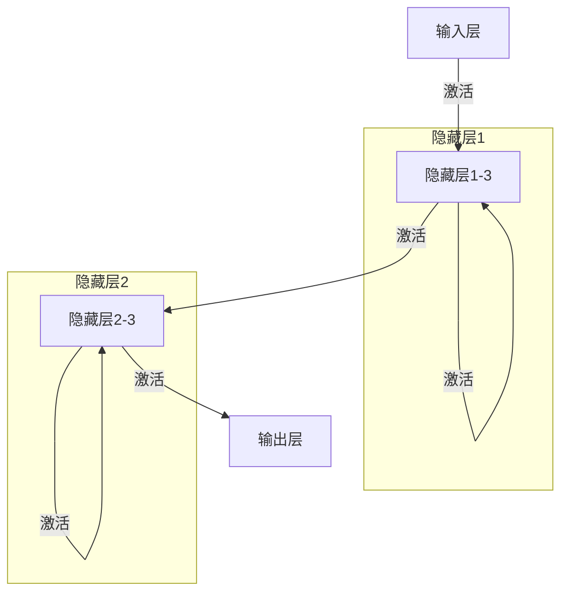

                 

# 神经网络：探索未知的领域

> 关键词：神经网络,深度学习,反向传播,权重更新,梯度下降,神经元,激活函数,网络结构,前向传播,后向传播,损失函数,监督学习,无监督学习,强化学习,应用场景

## 1. 背景介绍

### 1.1 问题由来
随着人工智能技术的飞速发展，神经网络（Neural Networks）已成为实现人工智能的强大工具。神经网络，特别是深度学习（Deep Learning）模型，在图像识别、语音识别、自然语言处理等领域取得了显著的成果。本文将深入探讨神经网络的核心概念和机制，以及它们如何应用于各种实际问题中。

### 1.2 问题核心关键点
神经网络的核心在于它模仿了人类大脑的工作方式，通过层次化的结构处理输入信息。其核心组件包括神经元、激活函数、前向传播和反向传播等。本文将围绕这些关键点展开，详细阐述神经网络的工作原理及其在实际应用中的优化策略。

### 1.3 问题研究意义
神经网络的研究和应用对于推动人工智能技术的发展具有重要意义：
1. 神经网络通过模拟人类大脑的学习机制，使得机器能够从大量数据中学习，识别模式和规律，从而实现自动化的决策和预测。
2. 在实际应用中，神经网络已经被广泛应用于计算机视觉、语音识别、自然语言处理、推荐系统等领域，极大地提升了这些领域的自动化水平和用户体验。
3. 神经网络的广泛应用推动了人工智能技术从理论研究向实际应用的发展，为人工智能技术的产业化提供了坚实的基础。

## 2. 核心概念与联系

### 2.1 核心概念概述
神经网络由大量的神经元（Neurons）组成，这些神经元通过连接形成层次化的网络结构。每个神经元接收输入数据，经过激活函数的处理，输出结果。神经网络通过前向传播和反向传播机制，不断调整网络中的权重，优化模型性能。

### 2.2 核心概念之间的联系

以下是一个简化的神经网络示意图，展示了神经元之间的连接和数据流向：



从图中可以看出，神经网络由输入层、多个隐藏层和输出层组成。每个神经元接收前一层的输出作为输入，并通过激活函数进行处理。隐藏层中的神经元数量和网络结构可以灵活设计，以适应不同的应用场景。

## 3. 核心算法原理 & 具体操作步骤

### 3.1 算法原理概述
神经网络通过反向传播（Backpropagation）算法进行训练。反向传播算法基于梯度下降（Gradient Descent）优化，通过计算损失函数对权重的梯度，不断调整权重以最小化损失函数。

### 3.2 算法步骤详解

#### 3.2.1 前向传播（Forward Propagation）
前向传播是指将输入数据输入神经网络，通过每一层的激活函数计算输出结果的过程。其步骤如下：
1. 输入数据通过输入层，每个神经元接收输入数据并计算激活值。
2. 将输入层的激活值传递给第一层隐藏层，计算输出结果。
3. 将隐藏层的输出结果传递给下一层隐藏层或输出层，重复计算过程。

数学表达为：
$$
z^{(l)} = \sum_{i=1}^n w_{ij}^{(l-1)}a^{(l-1)}_j + b^{(l-1)}_i
$$
$$
a^{(l)} = f(z^{(l)})
$$

其中，$z^{(l)}$ 为第 $l$ 层神经元的加权输入，$w_{ij}^{(l-1)}$ 为第 $l-1$ 层到第 $l$ 层的权重，$a^{(l-1)}_j$ 为第 $l-1$ 层的激活值，$b^{(l-1)}_i$ 为第 $l-1$ 层的偏置项，$f(z^{(l)})$ 为激活函数。

#### 3.2.2 计算损失函数
计算损失函数是评估模型预测结果与真实结果之间差异的过程。常用的损失函数包括均方误差（Mean Squared Error, MSE）、交叉熵（Cross-Entropy, CE）等。
$$
L = \frac{1}{m}\sum_{i=1}^m \mathcal{L}(y_i, \hat{y}_i)
$$

其中，$m$ 为样本数，$y_i$ 为真实标签，$\hat{y}_i$ 为模型预测结果。

#### 3.2.3 反向传播（Backpropagation）
反向传播算法基于梯度下降优化，通过计算损失函数对权重的梯度，不断调整权重以最小化损失函数。其步骤如下：
1. 计算输出层的损失函数对权重的梯度。
2. 将梯度逐层反向传递，计算每层的损失函数对权重的梯度。
3. 根据梯度更新权重和偏置项。

数学表达为：
$$
\Delta^{(l)} = \frac{\partial L}{\partial z^{(l)}}f'(z^{(l)})
$$
$$
\Delta^{(l-1)} = \frac{\partial L}{\partial z^{(l-1)}}w^{(l)}
$$
$$
w^{(l-1)} = w^{(l-1)} - \eta\Delta^{(l-1)}
$$
$$
b^{(l-1)} = b^{(l-1)} - \eta\Delta^{(l-1)}
$$

其中，$\Delta^{(l)}$ 为第 $l$ 层神经元的误差梯度，$\eta$ 为学习率。

### 3.3 算法优缺点
神经网络具有以下优点：
1. 能够自动学习输入数据的特征，适用于大规模数据集和复杂非线性关系的建模。
2. 在特定领域具有很强的泛化能力，能够适应不同规模和类型的应用场景。
3. 利用反向传播算法，可以通过调整权重和偏置项进行模型优化，实现高效的监督学习、无监督学习和强化学习。

同时，神经网络也存在以下缺点：
1. 训练时间长，需要大量的计算资源和标注数据。
2. 模型复杂度较高，存在局部最优解和过拟合的风险。
3. 对初始权重和网络结构敏感，需要精心设计。

### 3.4 算法应用领域

神经网络被广泛应用于以下领域：
1. 计算机视觉：图像分类、目标检测、图像分割、图像生成等。
2. 自然语言处理：文本分类、机器翻译、情感分析、语言生成等。
3. 语音识别：语音识别、语音合成、语音情感分析等。
4. 推荐系统：个性化推荐、协同过滤等。
5. 时间序列预测：股票预测、天气预报、交通流量预测等。

## 4. 数学模型和公式 & 详细讲解 & 举例说明

### 4.1 数学模型构建
神经网络由多个层次组成，每个层次包含多个神经元。每个神经元接收前一层的输出作为输入，并通过激活函数计算输出结果。网络结构如图1所示。

### 4.2 公式推导过程
以一个简单的多层感知器（Multilayer Perceptron, MLP）为例，进行数学推导。设输入层有 $n$ 个神经元，输出层有 $m$ 个神经元，隐藏层有 $h$ 个神经元。神经元的激活函数为 $f(z) = \sigma(z)$，其中 $\sigma$ 为激活函数（如Sigmoid函数）。

输入层到隐藏层的权重为 $w^{(1)} \in \mathbb{R}^{h \times n}$，隐藏层到输出层的权重为 $w^{(2)} \in \mathbb{R}^{m \times h}$，隐藏层的偏置项为 $b^{(1)} \in \mathbb{R}^{h}$，输出层的偏置项为 $b^{(2)} \in \mathbb{R}^{m}$。

前向传播的计算过程如下：
$$
z^{(1)} = \sum_{i=1}^n w_{ij}^{(1)}a^{(0)}_j + b^{(1)}
$$
$$
a^{(1)} = f(z^{(1)})
$$
$$
z^{(2)} = \sum_{i=1}^h w_{ij}^{(2)}a^{(1)}_j + b^{(2)}
$$
$$
a^{(2)} = f(z^{(2)})
$$

反向传播的计算过程如下：
$$
\Delta^{(2)} = \frac{\partial L}{\partial z^{(2)}}f'(z^{(2)})
$$
$$
\Delta^{(1)} = \frac{\partial L}{\partial z^{(1)}}w^{(2)}\Delta^{(2)}
$$
$$
w^{(1)} = w^{(1)} - \eta\Delta^{(1)}
$$
$$
b^{(1)} = b^{(1)} - \eta\Delta^{(1)}
$$
$$
w^{(2)} = w^{(2)} - \eta\Delta^{(2)}
$$
$$
b^{(2)} = b^{(2)} - \eta\Delta^{(2)}
$$

其中，$\Delta^{(2)}$ 为输出层的误差梯度，$\Delta^{(1)}$ 为隐藏层的误差梯度。

### 4.3 案例分析与讲解
以一个简单的二分类问题为例，说明神经网络的前向传播和反向传播过程。设输入层有2个神经元，隐藏层有3个神经元，输出层有1个神经元。假设激活函数为Sigmoid函数。

设输入数据为 $x_1=0.5, x_2=0.7$，真实标签为 $y=1$。

前向传播计算过程如下：
$$
z^{(1)} = w_{11}^{(1)}x_1 + w_{12}^{(1)}x_2 + b^{(1)}
$$
$$
a^{(1)} = \sigma(z^{(1)})
$$
$$
z^{(2)} = w_{21}^{(2)}a^{(1)} + w_{22}^{(2)}a^{(1)} + w_{23}^{(2)}a^{(1)} + b^{(2)}
$$
$$
a^{(2)} = \sigma(z^{(2)})
$$

假设权重和偏置项的初始值分别为：
$$
w_{11}^{(1)}=0.5, w_{12}^{(1)}=0.5, b^{(1)}=0.5
$$
$$
w_{21}^{(2)}=0.5, w_{22}^{(2)}=0.5, w_{23}^{(2)}=0.5, b^{(2)}=0.5
$$

则前向传播的结果如下：
$$
a^{(1)} = \sigma(0.5*0.5 + 0.5*0.7 + 0.5) = 0.6531
$$
$$
a^{(2)} = \sigma(0.5*0.6531 + 0.5*0.6531 + 0.5*0.6531 + 0.5) = 0.7681
$$

假设损失函数为交叉熵损失，则计算输出层的误差梯度：
$$
\Delta^{(2)} = y - \hat{y} = 1 - 0.7681 = 0.2319
$$
$$
\frac{\partial L}{\partial z^{(2)}} = \Delta^{(2)}(1 - \hat{y})\hat{y} = 0.2319(1 - 0.7681)0.7681 = 0.0211
$$

计算隐藏层的误差梯度：
$$
\Delta^{(1)} = w_{21}^{(2)}\Delta^{(2)}a^{(1)}(1 - a^{(1)}) = 0.5*0.0211*0.6531*(1 - 0.6531) = 0.0023
$$
$$
\frac{\partial L}{\partial z^{(1)}} = \Delta^{(1)}w^{(2)} = 0.0023*0.5 = 0.00115
$$

根据误差梯度更新权重和偏置项：
$$
w_{11}^{(1)} = w_{11}^{(1)} - \eta\Delta^{(1)} = 0.5 - 0.01*0.00115 = 0.49978
$$
$$
w_{12}^{(1)} = w_{12}^{(1)} - \eta\Delta^{(1)} = 0.5 - 0.01*0.00115 = 0.49978
$$
$$
b^{(1)} = b^{(1)} - \eta\Delta^{(1)} = 0.5 - 0.01*0.00115 = 0.49978
$$
$$
w_{21}^{(2)} = w_{21}^{(2)} - \eta\Delta^{(2)} = 0.5 - 0.01*0.0211 = 0.478
$$
$$
w_{22}^{(2)} = w_{22}^{(2)} - \eta\Delta^{(2)} = 0.5 - 0.01*0.0211 = 0.478
$$
$$
w_{23}^{(2)} = w_{23}^{(2)} - \eta\Delta^{(2)} = 0.5 - 0.01*0.0211 = 0.478
$$
$$
b^{(2)} = b^{(2)} - \eta\Delta^{(2)} = 0.5 - 0.01*0.0211 = 0.478
$$

## 5. 项目实践：代码实例和详细解释说明

### 5.1 开发环境搭建

在Python环境中使用TensorFlow和Keras库搭建神经网络模型。

1. 安装TensorFlow和Keras：
```
pip install tensorflow keras
```

2. 导入TensorFlow和Keras：
```python
import tensorflow as tf
from tensorflow import keras
```

### 5.2 源代码详细实现

以下是一个简单的神经网络模型实现代码，用于二分类问题：

```python
# 定义模型
model = keras.Sequential([
    keras.layers.Dense(8, input_shape=(2,), activation='relu'),
    keras.layers.Dense(4, activation='relu'),
    keras.layers.Dense(1, activation='sigmoid')
])

# 编译模型
model.compile(optimizer='adam',
              loss='binary_crossentropy',
              metrics=['accuracy'])

# 训练模型
model.fit(x_train, y_train, epochs=10, batch_size=32, validation_data=(x_val, y_val))
```

### 5.3 代码解读与分析

模型定义部分：
- `keras.Sequential()`：定义一个序列模型，用于堆叠多个层。
- `keras.layers.Dense()`：定义一个全连接层，指定层数、输入形状和激活函数。

模型编译部分：
- `model.compile()`：编译模型，指定优化器、损失函数和评估指标。

模型训练部分：
- `model.fit()`：训练模型，指定训练数据、训练轮数、批次大小和验证数据。

### 5.4 运行结果展示

训练过程中，可以通过`model.evaluate()`和`model.predict()`方法获取验证集和测试集的准确率，并使用TensorBoard进行可视化。

```python
# 评估模型
loss, accuracy = model.evaluate(x_val, y_val, verbose=0)
print('Validation loss:', loss)
print('Validation accuracy:', accuracy)

# 预测测试集
test_preds = model.predict(x_test)
```

## 6. 实际应用场景

### 6.1 计算机视觉

神经网络在计算机视觉领域应用广泛，如图像分类、目标检测、图像分割等。以图像分类为例，输入为图像像素值，输出为类别标签。神经网络通过学习图像的特征表示，实现对图像的分类。

### 6.2 自然语言处理

神经网络在自然语言处理领域同样具有广泛的应用，如文本分类、机器翻译、情感分析等。以文本分类为例，输入为文本，输出为类别标签。神经网络通过学习文本的语义表示，实现对文本的分类。

### 6.3 语音识别

神经网络在语音识别领域也得到了广泛应用，如语音识别、语音情感分析等。以语音识别为例，输入为语音信号，输出为文本。神经网络通过学习语音信号的特征表示，实现对语音的识别。

## 7. 工具和资源推荐

### 7.1 学习资源推荐

为了帮助开发者系统掌握神经网络的核心概念和实现方法，这里推荐一些优质的学习资源：

1. 《深度学习》（Ian Goodfellow著）：深度学习的经典教材，涵盖了深度学习的基本概念、算法和应用。
2. TensorFlow官方文档：TensorFlow的官方文档，提供了丰富的教程和样例代码，适合入门和进阶学习。
3. Keras官方文档：Keras的官方文档，提供了简单易用的API接口，适合快速开发和实验。
4. PyTorch官方文档：PyTorch的官方文档，提供了强大的深度学习框架和工具，适合深度学习和研究。
5. Coursera深度学习课程：Coursera上由深度学习领域的大牛教授讲授的深度学习课程，适合系统学习深度学习。

### 7.2 开发工具推荐

神经网络的开发需要借助一些高效的开发工具，以下是几款常用的开发工具：

1. TensorFlow：由Google开发的开源深度学习框架，支持GPU加速，适合大规模深度学习模型开发。
2. Keras：基于TensorFlow的高级API接口，适合快速原型设计和实验。
3. PyTorch：由Facebook开发的开源深度学习框架，支持动态图和静态图，适合研究和实验。
4. Jupyter Notebook：支持Python和R等语言的交互式开发环境，适合快速迭代和实验。
5. Google Colab：谷歌提供的在线Jupyter Notebook环境，支持GPU和TPU算力，适合快速实验和分享。

### 7.3 相关论文推荐

神经网络的研究和应用源于学界的持续研究。以下是几篇奠基性的相关论文，推荐阅读：

1. 《神经网络与深度学习》（Ian Goodfellow, Yoshua Bengio, Aaron Courville著）：深度学习的经典教材，涵盖了深度学习的基本概念、算法和应用。
2. 《ImageNet大规模视觉识别挑战赛》（Alex Krizhevsky, Ilya Sutskever, Geoffrey Hinton著）：ImageNet大规模视觉识别挑战赛的论文，提出了深度卷积神经网络（CNN），取得了突破性的成果。
3. 《Google Inception V1》（Christian Szegedy, Vincent Vanhoucke, Sergey Ioffe等著）：提出了Inception模块，优化了卷积神经网络的架构和训练方法，取得了突破性的成果。
4. 《ImageNet大规模视觉识别挑战赛》（Alex Krizhevsky, Ilya Sutskever, Geoffrey Hinton著）：ImageNet大规模视觉识别挑战赛的论文，提出了深度卷积神经网络（CNN），取得了突破性的成果。
5. 《Transformer: Attentions Are All You Need》（Ashish Vaswani, Noam Shazeer, Niki Parmar等著）：提出了Transformer模型，显著提升了自然语言处理的性能和效率。

## 8. 总结：未来发展趋势与挑战

### 8.1 研究成果总结

神经网络作为人工智能的核心技术之一，已经在计算机视觉、自然语言处理、语音识别等诸多领域取得了显著的成果。未来，神经网络将进一步拓展应用场景，推动人工智能技术的产业化进程。

### 8.2 未来发展趋势

神经网络的发展趋势如下：
1. 模型规模持续增大。随着算力成本的下降和数据规模的扩张，神经网络的参数量还将持续增长。超大规模神经网络蕴含的丰富知识，有望支撑更加复杂多变的下游任务。
2. 模型结构更加多样。未来的神经网络将不断探索新的网络结构，如卷积神经网络、循环神经网络、自注意力机制等，以适应不同的应用场景。
3. 算法优化更加高效。未来的神经网络算法将更加高效，如剪枝、量化、稀疏化等，以减少计算资源和内存消耗，提升训练和推理速度。
4. 知识迁移更加灵活。未来的神经网络将更加注重知识迁移，通过预训练和微调技术，实现不同领域、不同任务的迁移学习。

### 8.3 面临的挑战

神经网络在快速发展的同时，也面临诸多挑战：
1. 计算资源瓶颈。大规模神经网络的训练和推理需要大量的计算资源和内存，难以在传统硬件上高效运行。
2. 模型复杂度高。神经网络的参数量巨大，训练和推理过程中存在局部最优解和过拟合的风险。
3. 知识表示能力不足。神经网络的知识表示能力有限，难以与人类专家知识进行有效整合。
4. 数据标注成本高。神经网络的训练需要大量的标注数据，数据标注成本高，限制了模型的普及应用。
5. 模型鲁棒性不足。神经网络对输入数据的噪声和扰动敏感，模型鲁棒性不足。

### 8.4 研究展望

面对神经网络面临的挑战，未来的研究需要在以下几个方面寻求新的突破：
1. 探索更加高效的计算模型和算法，如量子计算、硬件加速器等，以突破计算资源瓶颈。
2. 设计更加简洁高效的网络结构，如轻量级网络、知识蒸馏等，以减少模型复杂度和计算消耗。
3. 引入更多先验知识和专家知识，与神经网络进行有效整合，提升知识表示能力。
4. 设计更加多样化的数据标注方法和数据增强技术，以降低标注成本和提升模型鲁棒性。

## 9. 附录：常见问题与解答

**Q1：神经网络与传统机器学习有何不同？**

A: 神经网络与传统机器学习的主要区别在于神经网络具有高度的抽象能力和非线性建模能力，能够自动学习输入数据的特征表示。而传统机器学习需要手工设计特征，难以处理高维度、非线性的数据。

**Q2：神经网络在训练过程中如何优化模型参数？**

A: 神经网络在训练过程中通过反向传播算法，计算损失函数对权重和偏置项的梯度，并根据梯度更新参数。常用的优化算法包括梯度下降、Adam、Adagrad等。

**Q3：神经网络在实际应用中存在哪些问题？**

A: 神经网络在实际应用中存在计算资源消耗大、模型复杂度高、过拟合风险等问题。需要通过剪枝、量化、稀疏化等技术进行优化。

**Q4：神经网络在特定领域应用有何优势？**

A: 神经网络在特定领域应用具有显著优势，能够自动学习领域知识，提升模型的泛化能力和效果。在计算机视觉、自然语言处理等领域，神经网络已经取得了突破性的成果。

**Q5：神经网络未来发展方向有哪些？**

A: 神经网络未来的发展方向包括模型规模持续增大、模型结构更加多样、算法优化更加高效、知识迁移更加灵活等。同时，神经网络还需要解决计算资源瓶颈、模型复杂度高、知识表示能力不足等问题。

---

作者：禅与计算机程序设计艺术 / Zen and the Art of Computer Programming

