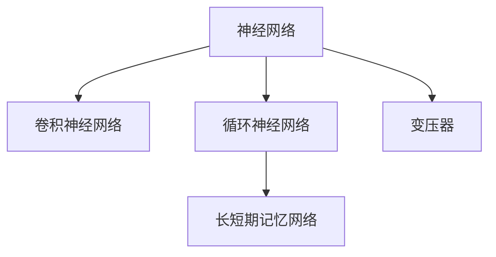

                 

## 1. 背景介绍

### 1.1 问题由来

随着科学技术的飞速发展，人工智能(AI)已经逐渐渗透到社会生活的各个方面，成为推动社会进步的重要力量。其中，神经网络作为深度学习领域的基础性技术，发挥着至关重要的作用。神经网络不仅在图像识别、语音识别、自然语言处理等传统领域展现了强大的能力，也在医疗、金融、教育等新兴领域展现了广阔的应用前景。

### 1.2 问题核心关键点

神经网络的核心思想是通过模拟人类大脑的神经元结构，构建多个层次的神经元网络，用于处理和分析复杂的数据。神经网络分为卷积神经网络(CNN)、循环神经网络(RNN)、长短期记忆网络(LSTM)、变压器(Transformer)等多种类型，每种网络结构都具有独特的优势和应用场景。

神经网络的研究经历了多次变革，从浅层前馈网络到深度多层感知器(DNN)，再到卷积神经网络、循环神经网络和变压器，每一次变革都带来了革命性的进步。当前，神经网络在图像识别、自然语言处理等领域已经取得了非常优秀的成果，被广泛应用于无人驾驶、智能家居、工业自动化、医学影像分析等多个领域。

## 2. 核心概念与联系

### 2.1 核心概念概述

为了更好地理解神经网络的工作原理和应用场景，本节将介绍几个密切相关的核心概念：

- 神经网络(Neural Network)：由多个层次的神经元构成的网络结构，用于处理和分析数据。
- 卷积神经网络(CNN)：用于处理具有网格结构的数据，如图像和视频，能够提取局部特征并进行模式识别。
- 循环神经网络(RNN)：用于处理序列数据，如文本和音频，能够捕捉序列中的时间依赖关系。
- 长短期记忆网络(LSTM)：一种特殊的RNN，用于处理长期依赖的序列数据，具有记忆单元和门控机制，可以避免梯度消失和爆炸问题。
- 变压器(Transformer)：用于处理序列数据的深度神经网络，通过自注意力机制实现了对序列中各个位置信息的并行处理。

这些核心概念之间的逻辑关系可以通过以下Mermaid流程图来展示：



这个流程图展示了神经网络家族的主要成员及其关系：

1. 神经网络是基础，包含了多个不同层次的神经元网络。
2. CNN用于处理网格结构的数据，提取局部特征。
3. RNN和LSTM用于处理序列数据，能够捕捉序列中的时间依赖关系。
4. Transformer是序列数据的深度神经网络，利用自注意力机制进行序列建模。

## 3. 核心算法原理 & 具体操作步骤

### 3.1 算法原理概述

神经网络的训练和推理过程，本质上是参数优化和特征提取的过程。训练过程通过反向传播算法不断调整网络参数，使得模型在给定任务上的性能最大化。推理过程则是在模型参数固定的情况下，将输入数据转化为输出结果。

神经网络的训练通常包括前向传播、损失计算和反向传播三个步骤：

1. 前向传播：将输入数据通过网络，计算每个神经元的输出。
2. 损失计算：将网络输出与目标输出进行比较，计算损失函数。
3. 反向传播：利用链式法则，计算损失函数对每个神经元参数的梯度，更新参数。

神经网络的应用非常广泛，如图像识别、语音识别、自然语言处理、机器翻译、推荐系统等。神经网络的训练和推理过程，不仅依赖于算法和模型，还需要高质量的训练数据和优化算法。

### 3.2 算法步骤详解

#### 3.2.1 训练过程

1. 准备数据：收集和处理训练数据，并将其分为训练集和验证集。
2. 定义模型：选择适当的神经网络架构，并初始化参数。
3. 前向传播：将训练数据通过网络，计算每个神经元的输出。
4. 损失计算：将网络输出与目标输出进行比较，计算损失函数。
5. 反向传播：利用链式法则，计算损失函数对每个神经元参数的梯度，更新参数。
6. 验证集评估：在验证集上评估模型性能，调整模型参数。
7. 重复训练：重复上述步骤，直到模型性能达到预设标准。

#### 3.2.2 推理过程

1. 准备数据：将推理数据输入到模型中。
2. 前向传播：将推理数据通过网络，计算每个神经元的输出。
3. 解码输出：将神经网络的输出转化为最终的结果。

### 3.3 算法优缺点

神经网络的优点：

1. 强大的表示能力：神经网络能够自动学习输入数据的复杂特征，具有高度的灵活性和可塑性。
2. 广泛的应用场景：神经网络在图像识别、语音识别、自然语言处理等领域具有出色的性能。
3. 自主学习能力：神经网络能够通过大量的数据进行自主学习，减少人工干预。
4. 多样化的架构：神经网络有多种不同的架构，适用于不同的应用场景。

神经网络的缺点：

1. 数据依赖性强：神经网络需要大量的标注数据进行训练，数据量不足会导致模型性能下降。
2. 计算资源消耗大：神经网络的训练和推理过程需要大量的计算资源，存在一定的计算瓶颈。
3. 黑箱特性：神经网络的结构复杂，难以解释其内部的计算过程，缺乏可解释性。
4. 过拟合风险：神经网络在训练过程中容易出现过拟合现象，需要额外的正则化技术进行控制。

### 3.4 算法应用领域

神经网络在各个领域都有广泛的应用，主要包括以下几个方面：

- 图像识别：神经网络能够处理图像数据，进行物体识别、人脸识别等任务。
- 语音识别：神经网络能够处理音频数据，进行语音识别、语音合成等任务。
- 自然语言处理：神经网络能够处理文本数据，进行语言翻译、文本生成等任务。
- 机器翻译：神经网络能够将一种语言的文本转化为另一种语言的文本。
- 推荐系统：神经网络能够根据用户的历史行为和偏好，推荐符合用户需求的商品或内容。
- 医疗诊断：神经网络能够处理医疗数据，进行疾病诊断和治疗方案推荐等任务。
- 金融预测：神经网络能够处理金融数据，进行股票预测、风险评估等任务。

## 4. 数学模型和公式 & 详细讲解

### 4.1 数学模型构建

神经网络的数学模型通常由输入层、隐藏层和输出层组成。其中，输入层接收输入数据，输出层输出结果，隐藏层进行特征提取和转换。

神经网络的数学模型可以表示为：

$$
y=f(Wx+b)
$$

其中，$x$为输入数据，$W$为权重矩阵，$b$为偏置向量，$f$为激活函数。

### 4.2 公式推导过程

以一个简单的多层感知器(MLP)为例，其数学模型可以表示为：

$$
y=f(W_Lf(W_{L-1}...f(W_1x+b_1)+b_{L-1})+...b_L)
$$

其中，$W_i$为第$i$层的权重矩阵，$b_i$为第$i$层的偏置向量，$f$为激活函数。

### 4.3 案例分析与讲解

以一个手写数字识别为例，神经网络可以将其表示为以下数学模型：

$$
y=f(W_Lf(W_{L-1}...f(W_1x+b_1)+b_{L-1})+...b_L)
$$

其中，输入$x$为手写数字的像素值，输出$y$为数字标签。

神经网络的训练过程包括前向传播和反向传播两个步骤：

1. 前向传播：将输入数据$x$通过网络，计算每个神经元的输出，并计算最终的输出$y$。
2. 反向传播：利用链式法则，计算损失函数$L$对每个神经元参数的梯度，并更新参数。

## 5. 项目实践：代码实例和详细解释说明

### 5.1 开发环境搭建

在进行神经网络实践前，我们需要准备好开发环境。以下是使用Python进行TensorFlow开发的环境配置流程：

1. 安装Anaconda：从官网下载并安装Anaconda，用于创建独立的Python环境。

2. 创建并激活虚拟环境：
```bash
conda create -n tensorflow-env python=3.8 
conda activate tensorflow-env
```

3. 安装TensorFlow：根据CUDA版本，从官网获取对应的安装命令。例如：
```bash
conda install tensorflow -c conda-forge -c pytorch
```

4. 安装各类工具包：
```bash
pip install numpy pandas scikit-learn matplotlib tqdm jupyter notebook ipython
```

完成上述步骤后，即可在`tensorflow-env`环境中开始神经网络开发。

### 5.2 源代码详细实现

下面以手写数字识别为例，给出使用TensorFlow进行神经网络的PyTorch代码实现。

首先，定义神经网络模型：

```python
import tensorflow as tf

class NeuralNetwork(tf.keras.Model):
    def __init__(self, input_size, hidden_size, output_size):
        super(NeuralNetwork, self).__init__()
        self.dense1 = tf.keras.layers.Dense(hidden_size, activation='relu')
        self.dense2 = tf.keras.layers.Dense(output_size, activation='softmax')
        
    def call(self, inputs):
        x = self.dense1(inputs)
        x = self.dense2(x)
        return x
```

然后，定义数据集和数据增强操作：

```python
import tensorflow as tf
from tensorflow.keras.preprocessing.image import ImageDataGenerator

train_datagen = ImageDataGenerator(
    rescale=1./255,
    rotation_range=20,
    width_shift_range=0.2,
    height_shift_range=0.2,
    horizontal_flip=True,
    fill_mode='nearest')

train_generator = train_datagen.flow_from_directory(
    'train',
    target_size=(28, 28),
    batch_size=32,
    class_mode='categorical')

test_datagen = ImageDataGenerator(rescale=1./255)

test_generator = test_datagen.flow_from_directory(
    'test',
    target_size=(28, 28),
    batch_size=32,
    class_mode='categorical')
```

接着，定义训练和评估函数：

```python
import tensorflow as tf

def train(model, train_generator, epochs):
    model.compile(optimizer='adam',
                  loss='categorical_crossentropy',
                  metrics=['accuracy'])

    model.fit(train_generator,
              epochs=epochs,
              validation_data=test_generator)

def evaluate(model, test_generator):
    model.evaluate(test_generator)
```

最后，启动训练流程并在测试集上评估：

```python
epochs = 10

model = NeuralNetwork(input_size=784, hidden_size=256, output_size=10)
model.summary()

train(model, train_generator, epochs)
evaluate(model, test_generator)
```

以上就是使用TensorFlow进行手写数字识别的完整代码实现。可以看到，得益于TensorFlow的强大封装，我们可以用相对简洁的代码完成神经网络的搭建和训练。

### 5.3 代码解读与分析

让我们再详细解读一下关键代码的实现细节：

**NeuralNetwork类**：
- `__init__`方法：初始化网络层，包括一个隐藏层和一个输出层。
- `call`方法：定义神经网络的计算过程，依次通过每个网络层，并输出最终结果。

**ImageDataGenerator**：
- `train_datagen`：定义训练集的数据增强操作，包括缩放、旋转、翻转等。
- `test_datagen`：定义测试集的数据增强操作，仅进行缩放。

**训练和评估函数**：
- 使用`model.compile`方法定义模型的优化器、损失函数和评估指标。
- 使用`model.fit`方法进行模型训练，指定训练数据生成器、迭代轮数和验证数据生成器。
- 使用`model.evaluate`方法在测试集上评估模型性能。

**训练流程**：
- 定义总迭代轮数。
- 初始化神经网络模型，并打印模型结构。
- 调用训练函数进行模型训练。
- 调用评估函数在测试集上评估模型性能。

可以看到，TensorFlow的高级API使得神经网络的开发和训练过程变得简洁高效。开发者可以将更多精力放在数据处理、模型改进等高层逻辑上，而不必过多关注底层的实现细节。

当然，工业级的系统实现还需考虑更多因素，如模型的保存和部署、超参数的自动搜索、更灵活的任务适配层等。但核心的神经网络训练和推理过程基本与此类似。

## 6. 实际应用场景

### 6.1 医疗诊断

神经网络在医疗领域具有广泛的应用，如医学影像分析、疾病诊断、治疗方案推荐等。例如，通过神经网络可以对X光片、CT扫描等医学影像进行分析和诊断，帮助医生发现疾病并制定治疗方案。

在技术实现上，可以收集大量的医学影像数据，标注相应的疾病信息，并在此基础上对预训练神经网络进行微调。微调后的神经网络能够自动识别医学影像中的病灶位置和类型，并给出相应的诊断和治疗建议。

### 6.2 金融预测

神经网络在金融领域也有广泛的应用，如股票预测、风险评估、信用评分等。例如，通过神经网络可以对历史交易数据进行分析，预测股票价格的走势和风险。

在技术实现上，可以收集大量的历史交易数据，标注相应的交易结果和风险等级，并在此基础上对预训练神经网络进行微调。微调后的神经网络能够根据当前的市场信息和历史交易数据，预测未来的交易结果和风险等级，为投资者提供参考。

### 6.3 智能客服

神经网络在智能客服领域也有广泛的应用，如智能问答、自动回复、情感分析等。例如，通过神经网络可以对用户的输入进行分析和理解，自动生成回复并处理用户的情感。

在技术实现上，可以收集大量的客户服务对话数据，标注相应的回答和情感，并在此基础上对预训练神经网络进行微调。微调后的神经网络能够根据用户的输入，自动生成相应的回复，并分析用户的情感状态，提供更好的服务体验。

### 6.4 未来应用展望

随着神经网络技术的不断发展，未来的应用场景将更加广阔：

- 自动驾驶：神经网络可以处理和分析摄像头和传感器数据，辅助车辆进行自动驾驶。
- 智能家居：神经网络可以处理和分析家庭环境数据，智能控制家居设备。
- 工业自动化：神经网络可以处理和分析生产过程中的数据，优化生产流程。
- 智慧城市：神经网络可以处理和分析城市运行数据，优化城市管理。
- 金融智能：神经网络可以处理和分析金融市场数据，进行智能投资和风险控制。
- 医疗健康：神经网络可以处理和分析医疗数据，提供个性化的健康建议和治疗方案。

## 7. 工具和资源推荐

### 7.1 学习资源推荐

为了帮助开发者系统掌握神经网络的技术基础和实践技巧，这里推荐一些优质的学习资源：

1. 《深度学习》系列博文：由大模型技术专家撰写，深入浅出地介绍了深度学习的原理和应用。
2. Coursera《深度学习》课程：由Andrew Ng教授讲授的深度学习课程，系统全面地介绍了深度学习的理论基础和实践技术。
3. 《TensorFlow实战Google深度学习》书籍：TensorFlow的官方文档，提供了丰富的实例和样例代码，是新手入门的必读之作。
4. GitHub上的开源项目：如TensorFlow、PyTorch、Keras等，提供了大量的神经网络模型和代码实现，是学习的重要资源。

通过对这些资源的学习实践，相信你一定能够快速掌握神经网络的精髓，并用于解决实际的NLP问题。

### 7.2 开发工具推荐

高效的开发离不开优秀的工具支持。以下是几款用于神经网络开发的常用工具：

1. TensorFlow：由Google主导开发的开源深度学习框架，生产部署方便，适合大规模工程应用。
2. PyTorch：基于Python的开源深度学习框架，灵活动态的计算图，适合快速迭代研究。
3. Keras：TensorFlow和Theano的高级API，简洁易用，适合快速原型开发。
4. Jupyter Notebook：交互式的开发环境，支持多种编程语言和库，便于快速调试和验证代码。
5. Visual Studio Code：轻量级的开发工具，支持多种编程语言和库，集成丰富的插件和工具。

合理利用这些工具，可以显著提升神经网络开发的效率，加快创新迭代的步伐。

### 7.3 相关论文推荐

神经网络的研究涉及领域广泛，以下是几篇奠基性的相关论文，推荐阅读：

1. A Few Useful Things to Know About Deep Learning：Alex Krizhevsky等人总结的深度学习实践指南，涵盖了深度学习的各个方面。
2. ImageNet Classification with Deep Convolutional Neural Networks：AlexNet论文，提出了卷积神经网络在图像分类任务中的应用。
3. Long Short-Term Memory：Hochreiter等人提出的长短期记忆网络，解决了传统RNN的梯度消失和爆炸问题。
4. Attention Is All You Need：Vaswani等人提出的Transformer模型，基于自注意力机制实现了序列建模。

这些论文代表了大神经网络技术的发展脉络。通过学习这些前沿成果，可以帮助研究者把握学科前进方向，激发更多的创新灵感。

## 8. 总结：未来发展趋势与挑战

### 8.1 总结

本文对神经网络的工作原理和应用场景进行了全面系统的介绍。首先阐述了神经网络的起源和发展历程，明确了神经网络在各个领域的应用前景。其次，从原理到实践，详细讲解了神经网络的数学模型和训练过程，给出了神经网络任务开发的完整代码实例。同时，本文还广泛探讨了神经网络在医疗、金融、智能客服等各个领域的应用前景，展示了神经网络技术的巨大潜力。最后，本文精选了神经网络技术的各类学习资源，力求为读者提供全方位的技术指引。

通过本文的系统梳理，可以看到，神经网络技术正在成为推动社会进步的重要力量，其应用范围不断扩大，应用效果不断提升。神经网络不仅在图像识别、语音识别、自然语言处理等领域展现了出色的性能，也在医疗、金融、智能客服等新兴领域展现了广阔的应用前景。未来，伴随神经网络技术的不断发展，其在各个领域的创新应用将更加广泛，为人类社会的进步和发展提供更加坚实的技术支撑。

### 8.2 未来发展趋势

展望未来，神经网络技术将呈现以下几个发展趋势：

1. 计算资源不断提升：随着计算资源和算法的不断进步，神经网络的计算速度和处理能力将大幅提升。
2. 模型规模不断增大：随着预训练技术的不断进步，神经网络的模型规模将持续增大，能够处理更复杂的数据。
3. 训练效率不断提升：随着训练算法和硬件设备的不断改进，神经网络的训练速度将大幅提升。
4. 应用领域不断拓展：随着技术的不断进步，神经网络将在更多领域得到应用，如自动驾驶、智能家居、工业自动化等。
5. 数据依赖性不断降低：随着自监督学习、少样本学习等技术的发展，神经网络将更加依赖数据量而非数据质量。
6. 可解释性不断增强：随着可解释性技术的不断进步，神经网络将具备更强的可解释性和可理解性。
7. 安全和隐私保护不断加强：随着数据安全和隐私保护技术的不断进步，神经网络将更加注重数据的安全和隐私保护。

以上趋势凸显了神经网络技术的发展前景，相信未来神经网络将在更多领域得到应用，为人类社会的进步和发展提供更加坚实的技术支撑。

### 8.3 面临的挑战

尽管神经网络技术已经取得了瞩目成就，但在迈向更加智能化、普适化应用的过程中，它仍面临着诸多挑战：

1. 数据依赖性强：神经网络需要大量的标注数据进行训练，数据量不足会导致模型性能下降。
2. 计算资源消耗大：神经网络的训练和推理过程需要大量的计算资源，存在一定的计算瓶颈。
3. 可解释性不足：神经网络的结构复杂，难以解释其内部的计算过程，缺乏可解释性。
4. 过拟合风险：神经网络在训练过程中容易出现过拟合现象，需要额外的正则化技术进行控制。
5. 数据安全和隐私保护：神经网络在处理敏感数据时，需要注重数据安全和隐私保护。
6. 泛化能力不足：神经网络在处理新数据时，泛化能力往往不足，需要进一步提高模型的泛化能力。
7. 模型鲁棒性不足：神经网络面对域外数据时，泛化性能往往大打折扣，需要提高模型的鲁棒性。

### 8.4 研究展望

面对神经网络面临的种种挑战，未来的研究需要在以下几个方面寻求新的突破：

1. 探索无监督和半监督学习技术：摆脱对大规模标注数据的依赖，利用自监督学习、主动学习等无监督和半监督范式，最大限度利用非结构化数据，实现更加灵活高效的微调。
2. 研究参数高效和计算高效的微调范式：开发更加参数高效的微调方法，在固定大部分预训练参数的同时，只更新极少量的任务相关参数。同时优化微调模型的计算图，减少前向传播和反向传播的资源消耗，实现更加轻量级、实时性的部署。
3. 引入因果分析和博弈论工具：将因果分析方法引入神经网络，识别出模型决策的关键特征，增强输出解释的因果性和逻辑性。借助博弈论工具刻画人机交互过程，主动探索并规避模型的脆弱点，提高系统稳定性。
4. 纳入伦理道德约束：在模型训练目标中引入伦理导向的评估指标，过滤和惩罚有偏见、有害的输出倾向。同时加强人工干预和审核，建立模型行为的监管机制，确保输出符合人类价值观和伦理道德。
5. 探索新的网络架构：研究新的神经网络架构，如Transformer的变体、混合网络架构等，以适应不同的应用场景和需求。

这些研究方向的发展，将引领神经网络技术迈向更高的台阶，为构建安全、可靠、可解释、可控的智能系统铺平道路。面向未来，神经网络技术还需要与其他人工智能技术进行更深入的融合，如知识表示、因果推理、强化学习等，多路径协同发力，共同推动自然语言理解和智能交互系统的进步。只有勇于创新、敢于突破，才能不断拓展神经网络的边界，让智能技术更好地造福人类社会。

## 9. 附录：常见问题与解答

**Q1：神经网络是否适用于所有NLP任务？**

A: 神经网络在大多数NLP任务上都能取得不错的效果，特别是对于数据量较小的任务。但对于一些特定领域的任务，如医学、法律等，仅仅依靠通用语料预训练的模型可能难以很好地适应。此时需要在特定领域语料上进一步预训练，再进行微调，才能获得理想效果。

**Q2：如何选择合适的神经网络架构？**

A: 选择合适的神经网络架构需要考虑多个因素，如任务类型、数据特征、计算资源等。一般来说，图像识别任务适合使用卷积神经网络(CNN)，序列任务适合使用循环神经网络(RNN)和长短期记忆网络(LSTM)，序列建模任务适合使用变压器(Transformer)。

**Q3：神经网络训练过程中如何进行数据增强？**

A: 数据增强可以通过多种方式实现，如旋转、平移、缩放、裁剪、翻转、随机失真等。在图像识别任务中，通常使用ImageDataGenerator库进行数据增强。在自然语言处理任务中，可以使用语言模型进行数据增强，如回译、改写、拼接等。

**Q4：神经网络在医疗领域的应用前景如何？**

A: 神经网络在医疗领域具有广泛的应用前景，如医学影像分析、疾病诊断、治疗方案推荐等。通过神经网络可以对X光片、CT扫描等医学影像进行分析和诊断，帮助医生发现疾病并制定治疗方案。

**Q5：神经网络在金融领域的应用前景如何？**

A: 神经网络在金融领域也有广泛的应用前景，如股票预测、风险评估、信用评分等。通过神经网络可以对历史交易数据进行分析，预测股票价格的走势和风险，为投资者提供参考。

综上所述，神经网络作为深度学习的基础性技术，正在成为推动社会进步的重要力量。随着技术的不断进步，神经网络将在更多领域得到应用，为人类社会的进步和发展提供更加坚实的技术支撑。相信未来神经网络将在更多领域得到应用，为人类社会的进步和发展提供更加坚实的技术支撑。

