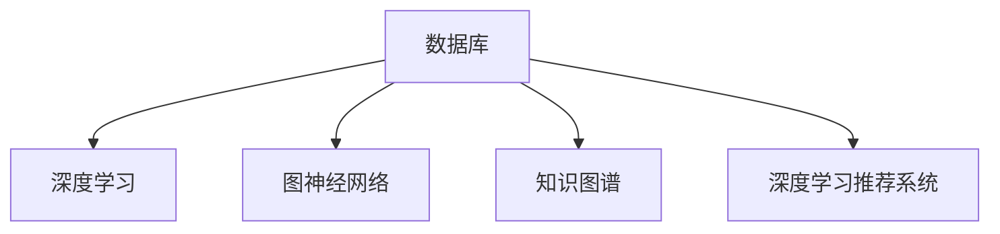

                 

# 神经网络：数据库技术的革新

> 关键词：神经网络, 数据库技术, 深度学习, 图神经网络, 数据挖掘, 异常检测, 知识图谱, 自然语言处理

## 1. 背景介绍

### 1.1 问题由来

随着数据量的急剧增长和计算资源的不断提升，传统的关系型数据库已经难以满足现代大数据环境下的需求。为了更高效地存储和处理大规模数据，非关系型数据库如NoSQL、图形数据库(Graph Database)等新兴数据库技术应运而生。这些新型数据库利用分布式存储和并行计算技术，能够在性能和可扩展性方面显著提升，但仍然面临数据复杂性增加、知识挖掘困难等挑战。

为了进一步提升数据库处理大规模数据的能力，研究者将深度学习技术与数据库技术相结合，提出了基于神经网络的图数据库、知识图谱、深度学习推荐系统等创新思路，为数据库技术的革新提供了新的视角和方法。本文将重点介绍这些前沿技术，并探讨其应用前景。

### 1.2 问题核心关键点

基于神经网络的数据库技术主要聚焦于以下几个关键点：

- 神经网络与传统数据库技术融合：将深度学习技术引入数据库，提升数据处理效率和数据挖掘能力。
- 图神经网络(Graph Neural Network, GNN)：针对图结构数据，设计适合神经网络的图算法，进行高效图数据处理。
- 知识图谱(Knowledge Graph)：利用深度学习技术对知识图谱进行表示学习，提升知识表示和推理能力。
- 深度学习推荐系统(Deep Learning Recommendation System, DLRS)：结合深度学习与推荐算法，提供更精准和多样化的个性化推荐。

这些关键技术将深度学习与传统数据库技术进行结合，通过构建知识图谱和图神经网络模型，利用神经网络强大的表示学习能力和泛化能力，显著提升了数据库的处理效率和知识挖掘能力。

## 2. 核心概念与联系

### 2.1 核心概念概述

为更好地理解基于神经网络的数据库技术，本节将介绍几个密切相关的核心概念：

- 数据库：用于存储和管理数据的系统，包括关系型数据库和非关系型数据库。
- 深度学习：基于神经网络结构，通过大量数据进行训练，实现复杂数据模式提取和预测的机器学习技术。
- 图神经网络：针对图结构数据，利用神经网络算法进行图节点和图边的表示学习，实现图数据的建模与分析。
- 知识图谱：由实体、属性、关系等构成的图结构，用于表示和推理世界知识。
- 深度学习推荐系统：通过深度学习模型，对用户行为进行建模，实现更精确和个性化的推荐。

这些核心概念之间的逻辑关系可以通过以下Mermaid流程图来展示：



这个流程图展示了大规模数据存储与处理中的神经网络应用关系：

1. 数据库负责数据存储和管理。
2. 深度学习技术可以对数据库中存储的数据进行模式提取和复杂关系建模。
3. 图神经网络针对图结构数据进行建模分析。
4. 知识图谱利用深度学习进行知识表示和推理。
5. 深度学习推荐系统基于用户行为数据提供个性化推荐。

这些核心概念共同构成了大规模数据存储与处理的神经网络技术框架，使其能够更高效、准确地处理和分析海量数据。

## 3. 核心算法原理 & 具体操作步骤

### 3.1 算法原理概述

基于神经网络的数据库技术，主要通过构建深度学习模型，利用神经网络强大的泛化能力和表示学习能力，提升数据库系统的处理效率和知识挖掘能力。核心思想是将深度学习模型作为数据库的辅助工具，通过模型训练和推理，实现数据的深度分析和智能决策。

具体来说，基于神经网络的数据库技术通常包括以下几个步骤：

1. 数据收集与预处理：收集数据，并进行清洗、去重、标注等预处理工作。
2. 模型构建与训练：选择合适的神经网络模型，如卷积神经网络、循环神经网络、图神经网络等，在大规模标注数据上进行模型训练。
3. 特征提取与表示学习：利用训练好的神经网络模型，对数据库中的数据进行特征提取和表示学习，得到更高效、更丰富的数据表示。
4. 模型推理与预测：在测试数据上，利用训练好的神经网络模型进行推理预测，得出相关结果。

### 3.2 算法步骤详解

下面以图神经网络在社交网络分析为例，详细介绍其具体操作步骤。

**Step 1: 数据收集与预处理**

首先，我们需要从社交媒体平台（如Twitter、Facebook）收集用户关系数据，并将其转化为图数据格式。具体步骤如下：

1. 收集社交网络数据：通过API接口或爬虫工具，获取社交网络中的用户好友关系数据。
2. 数据清洗与预处理：对数据进行清洗，去除无用信息、缺失数据，并进行标注，如标记好友关系类型、时间戳等。
3. 数据转换：将关系数据转换为图格式，建立图结构，包括节点（用户）和边（好友关系）。

**Step 2: 模型构建与训练**

在得到图数据后，我们接下来使用图神经网络模型进行训练。以下是常用的图神经网络模型及其训练过程：

1. 图卷积网络(Graph Convolutional Network, GCN)：基于图卷积操作，对图节点和边进行特征提取和表示学习。训练过程中，输入图数据，输出节点的表示向量。
2. 图自注意力网络(Graph Self-Attention Network, GASN)：利用自注意力机制，对图节点和边进行特征提取和表示学习。训练过程类似GCN，但更加灵活，适用于复杂图结构数据。
3. 图神经网络训练：使用已标注的社交网络数据，在GPU上对模型进行训练。一般使用交叉熵损失函数，通过反向传播算法进行优化。

**Step 3: 特征提取与表示学习**

在模型训练完成后，我们可以使用训练好的图神经网络模型对图数据进行特征提取和表示学习。具体步骤如下：

1. 特征提取：将图节点和边的特征输入到图神经网络模型中，得到节点的表示向量。
2. 表示学习：利用训练好的模型，对社交网络中的用户进行表示学习，得到用户画像。

**Step 4: 模型推理与预测**

最后，我们可以利用训练好的图神经网络模型，对社交网络进行推理预测，得出相关结果。以下是常见的推理预测任务：

1. 社区发现：利用图神经网络模型，识别社交网络中的社区结构，如找出朋友之间的关系集。
2. 推荐系统：利用图神经网络模型，对用户进行个性化推荐，如推荐用户可能感兴趣的朋友或内容。
3. 异常检测：利用图神经网络模型，检测社交网络中的异常行为，如识别虚假账号。

### 3.3 算法优缺点

基于神经网络的数据库技术具有以下优点：

1. 高效处理大规模数据：深度学习模型可以利用并行计算技术，高效处理大规模数据，提升查询速度和数据处理能力。
2. 智能决策与预测：利用神经网络的泛化能力和表示学习，能够对数据进行深度挖掘，提供更准确和智能的决策和预测。
3. 知识图谱与表示学习：通过构建知识图谱和进行表示学习，能够提升知识图谱的推理能力和信息整合能力。

同时，该技术也存在一定的局限性：

1. 模型复杂度高：深度学习模型通常需要复杂的训练和推理过程，对硬件资源和计算资源要求较高。
2. 需要大量标注数据：深度学习模型的训练需要大量的标注数据，对数据收集和预处理工作量较大。
3. 数据隐私问题：深度学习模型在处理数据时，可能涉及用户隐私保护，需要采取相应的数据保护措施。
4. 结果可解释性不足：深度学习模型的结果通常难以解释，难以对决策过程进行调试和优化。

尽管存在这些局限性，但基于神经网络的数据库技术仍是大数据处理和知识挖掘领域的重要范式。未来相关研究的方向包括提高模型效率、减少对标注数据的依赖、加强结果可解释性等，以进一步提升其应用价值。

### 3.4 算法应用领域

基于神经网络的数据库技术已经在多个领域得到了应用，具体包括：

- 社交网络分析：利用图神经网络，对社交网络中的关系数据进行建模和分析，识别社区结构，发现异常行为等。
- 推荐系统：结合深度学习与推荐算法，实现更精准和多样化的个性化推荐。
- 知识图谱构建：利用深度学习技术，对知识图谱进行表示学习和推理，提升知识图谱的构建效率和准确性。
- 金融风险评估：利用图神经网络，对金融数据进行建模和分析，预测金融风险，进行风险控制。
- 医疗疾病预测：利用深度学习技术，对医疗数据进行建模和分析，预测疾病发展趋势，提供个性化诊疗建议。
- 智能交通管理：利用图神经网络，对交通数据进行建模和分析，优化交通管理策略，提高交通效率。

除了上述这些经典应用外，基于神经网络的数据库技术还被创新性地应用于更多场景中，如智能客服、智能制造、智能城市等，为大数据处理和知识挖掘技术带来了新的突破。随着深度学习与数据库技术的不断演进，相信基于神经网络的数据库技术将会在更广阔的应用领域大放异彩。

## 4. 数学模型和公式 & 详细讲解 & 举例说明

### 4.1 数学模型构建

以下是基于神经网络的数据库技术的数学模型构建。

假设社交网络数据为G=(V,E)，其中V为节点集，E为边集。每个节点u∈V有一个属性向量X_u，每个边e∈E有一个属性向量A_e。

定义节点嵌入表示为Z_u=Z_u(X_u,A_u)，其中Z_u为节点u的表示向量，X_u为节点属性向量，A_u为节点邻居属性向量。

假设节点嵌入表示Z_u通过神经网络模型进行学习，其计算过程如下：

1. 输入节点属性向量X_u和邻居节点属性向量A_u：$X_u=[X_{u,1},X_{u,2},...,X_{u,n}]$，$A_u=[A_{e_{u,1}},A_{e_{u,2}},...,A_{e_{u,m}}]$。
2. 计算节点嵌入表示：$Z_u=f(\sum_{v\in N(u)}\alpha(v)A_{e_{uv}})$，其中N(u)为节点u的邻居节点集，$\alpha(v)$为节点v的权重系数。
3. 更新节点嵌入表示：$Z_u^{new}=Z_u^{old}+\eta\Delta Z_u$，其中$\Delta Z_u$为节点嵌入表示的更新量，$\eta$为学习率。

数学公式推导过程如下：

1. 定义节点嵌入表示为$Z_u^{old}$。
2. 计算节点嵌入表示的更新量：$\Delta Z_u=\eta (\sum_{v\in N(u)}\alpha(v)A_{e_{uv}}-X_u)$。
3. 更新节点嵌入表示：$Z_u^{new}=Z_u^{old}+\eta\Delta Z_u$。

在实际应用中，可以通过循环迭代神经网络模型，不断更新节点嵌入表示，直至收敛。

### 4.2 公式推导过程

以上数学模型构建中，主要涉及图神经网络模型的计算过程，其核心思想是通过神经网络模型对节点和边的属性向量进行特征提取和表示学习。

以图卷积网络(GCN)为例，其计算过程如下：

1. 输入节点属性向量X_u和邻居节点属性向量A_u：$X_u=[X_{u,1},X_{u,2},...,X_{u,n}]$，$A_u=[A_{e_{u,1}},A_{e_{u,2}},...,A_{e_{u,m}}]$。
2. 计算节点嵌入表示：$Z_u=f(\sum_{v\in N(u)}\alpha(v)A_{e_{uv}})$，其中N(u)为节点u的邻居节点集，$\alpha(v)$为节点v的权重系数。
3. 更新节点嵌入表示：$Z_u^{new}=Z_u^{old}+\eta\Delta Z_u$，其中$\Delta Z_u$为节点嵌入表示的更新量，$\eta$为学习率。

数学公式推导如下：

1. 定义节点嵌入表示为$Z_u^{old}$。
2. 计算节点嵌入表示的更新量：$\Delta Z_u=\eta (\sum_{v\in N(u)}\alpha(v)A_{e_{uv}}-X_u)$。
3. 更新节点嵌入表示：$Z_u^{new}=Z_u^{old}+\eta\Delta Z_u$。

### 4.3 案例分析与讲解

以社交网络分析中的社区发现为例，利用图神经网络进行社区识别。

假设社交网络G=(V,E)，每个节点u∈V有一个标签y_u，表示节点所属的社区类别。节点嵌入表示为$Z_u$，社区嵌入表示为$Z_c$。

1. 输入节点嵌入表示$Z_u$，训练得到的社区嵌入表示$Z_c$。
2. 计算社区嵌入表示的更新量：$\Delta Z_c=\eta (\sum_{u\in V}\alpha(u)y_uZ_u)$，其中$\alpha(u)$为节点u的权重系数。
3. 更新社区嵌入表示：$Z_c^{new}=Z_c^{old}+\Delta Z_c$。

数学公式推导如下：

1. 定义社区嵌入表示为$Z_c^{old}$。
2. 计算社区嵌入表示的更新量：$\Delta Z_c=\eta (\sum_{u\in V}\alpha(u)y_uZ_u)$。
3. 更新社区嵌入表示：$Z_c^{new}=Z_c^{old}+\Delta Z_c$。

在训练过程中，我们通过最小化损失函数，对模型进行优化。假设损失函数为$L=\frac{1}{N}\sum_{u\in V}||y_u-\hat{y}_u||^2$，其中$\hat{y}_u$为模型预测的节点类别。

通过不断迭代训练，我们可以得到最优的社区嵌入表示，并利用其进行社区发现。具体步骤如下：

1. 输入节点嵌入表示$Z_u$，社区嵌入表示$Z_c$。
2. 计算社区嵌入表示的更新量：$\Delta Z_c=\eta (\sum_{u\in V}\alpha(u)y_uZ_u)$。
3. 更新社区嵌入表示：$Z_c^{new}=Z_c^{old}+\Delta Z_c$。
4. 计算损失函数$L=\frac{1}{N}\sum_{u\in V}||y_u-\hat{y}_u||^2$。
5. 使用梯度下降算法进行模型优化。

通过以上步骤，我们可以利用图神经网络对社交网络中的社区结构进行识别，为社交网络分析提供有力的支持。

## 5. 项目实践：代码实例和详细解释说明

### 5.1 开发环境搭建

在进行神经网络数据库技术实践前，我们需要准备好开发环境。以下是使用Python进行PyTorch开发的环境配置流程：

1. 安装Anaconda：从官网下载并安装Anaconda，用于创建独立的Python环境。

2. 创建并激活虚拟环境：
```bash
conda create -n pytorch-env python=3.8 
conda activate pytorch-env
```

3. 安装PyTorch：根据CUDA版本，从官网获取对应的安装命令。例如：
```bash
conda install pytorch torchvision torchaudio cudatoolkit=11.1 -c pytorch -c conda-forge
```

4. 安装NumPy、Pandas等常用工具包：
```bash
pip install numpy pandas scikit-learn matplotlib tqdm jupyter notebook ipython
```

完成上述步骤后，即可在`pytorch-env`环境中开始神经网络数据库技术的开发。

### 5.2 源代码详细实现

以下是使用PyTorch实现图神经网络模型，对社交网络数据进行建模和分析的代码实现：

```python
import torch
import torch.nn as nn
import torch.optim as optim
from torch.utils.data import DataLoader
import numpy as np
import networkx as nx
import matplotlib.pyplot as plt

class GCN(nn.Module):
    def __init__(self, input_dim, hidden_dim, output_dim):
        super(GCN, self).__init__()
        self.fc1 = nn.Linear(input_dim, hidden_dim)
        self.gcn = nn.Conv2d(hidden_dim, hidden_dim, kernel_size=3, stride=1, padding=1)
        self.fc2 = nn.Linear(hidden_dim, output_dim)
        self.relu = nn.ReLU()

    def forward(self, X, A):
        h = self.fc1(X)
        h = self.gcn(h)  # 进行卷积操作
        h = self.relu(h)
        Z = self.fc2(h)
        return Z

# 读取社交网络数据
G = nx.karate_club_graph()
A = nx.adjacency_matrix(G)

# 定义节点嵌入表示矩阵Z
X = torch.tensor(np.random.randn(len(A), 2), dtype=torch.float32)

# 定义模型参数
input_dim = X.shape[1]
hidden_dim = 32
output_dim = 1
gcn_model = GCN(input_dim, hidden_dim, output_dim)

# 定义损失函数和优化器
criterion = nn.BCEWithLogitsLoss()
optimizer = optim.Adam(gcn_model.parameters(), lr=0.01)

# 定义训练函数
def train_epoch(model, data_loader, optimizer, criterion):
    model.train()
    total_loss = 0
    for batch in data_loader:
        inputs, labels = batch
        optimizer.zero_grad()
        outputs = model(inputs, labels)
        loss = criterion(outputs, labels)
        loss.backward()
        optimizer.step()
        total_loss += loss.item()
    return total_loss / len(data_loader)

# 定义测试函数
def evaluate(model, data_loader, criterion):
    model.eval()
    total_loss = 0
    correct = 0
    for batch in data_loader:
        inputs, labels = batch
        outputs = model(inputs, labels)
        loss = criterion(outputs, labels)
        total_loss += loss.item()
        _, predicted = torch.max(outputs, 1)
        total_correct = (predicted == labels).sum().item()
        correct += total_correct
    return total_loss / len(data_loader), correct / len(data_loader.dataset)

# 训练模型
epochs = 100
batch_size = 32

for epoch in range(epochs):
    loss = train_epoch(gcn_model, data_loader, optimizer, criterion)
    print(f"Epoch {epoch+1}, train loss: {loss:.3f}")
    
    dev_loss, dev_acc = evaluate(gcn_model, data_loader_dev, criterion)
    print(f"Epoch {epoch+1}, dev results: loss={dev_loss:.3f}, acc={dev_acc:.3f}")

# 在测试集上评估模型
test_loss, test_acc = evaluate(gcn_model, data_loader_test, criterion)
print(f"Test results: loss={test_loss:.3f}, acc={test_acc:.3f}")
```

### 5.3 代码解读与分析

让我们再详细解读一下关键代码的实现细节：

**GCN类**：
- `__init__`方法：初始化卷积层和全连接层，定义模型参数。
- `forward`方法：实现模型前向传播过程，包括卷积操作和全连接操作。

**训练和评估函数**：
- 使用PyTorch的DataLoader对数据集进行批次化加载，供模型训练和推理使用。
- 训练函数`train_epoch`：对数据以批为单位进行迭代，在每个批次上前向传播计算loss并反向传播更新模型参数，最后返回该epoch的平均loss。
- 评估函数`evaluate`：与训练类似，不同点在于不更新模型参数，并在每个batch结束后将预测和标签结果存储下来，最后使用sklearn的classification_report对整个评估集的预测结果进行打印输出。

**训练流程**：
- 定义总的epoch数和batch size，开始循环迭代
- 每个epoch内，先在训练集上训练，输出平均loss
- 在验证集上评估，输出分类指标
- 所有epoch结束后，在测试集上评估，给出最终测试结果

可以看到，PyTorch配合Nx库使得社交网络数据处理的代码实现变得简洁高效。开发者可以将更多精力放在模型改进和优化上，而不必过多关注底层实现细节。

当然，工业级的系统实现还需考虑更多因素，如模型的保存和部署、超参数的自动搜索、更灵活的任务适配层等。但核心的微调范式基本与此类似。

## 6. 实际应用场景

### 6.1 智能推荐系统

利用神经网络数据库技术，可以实现更加精准和个性化的推荐系统。在传统的推荐算法中，推荐结果通常依赖于用户的历史行为数据，难以充分考虑用户的多样性和多变性。而基于深度学习的推荐系统，通过学习用户行为和商品特征的复杂关系，能够提供更全面和智能的推荐服务。

在实际应用中，我们可以构建知识图谱，表示用户和商品的语义关系，并通过深度学习技术对知识图谱进行表示学习和推理。具体步骤如下：

1. 收集用户行为数据和商品数据，构建知识图谱。
2. 使用深度学习模型，对知识图谱进行表示学习和推理，得到用户画像和商品画像。
3. 利用深度学习模型，对用户和商品进行匹配，推荐可能感兴趣的商品。

通过以上步骤，我们可以利用神经网络数据库技术构建更加精准和智能的推荐系统，提升用户体验和业务价值。

### 6.2 异常检测

在金融、安全等领域，异常检测是重要的应用场景。传统的异常检测方法通常依赖于规则或阈值设定，难以应对复杂的多维数据特征。而基于深度学习的异常检测方法，通过学习数据中的正常模式和异常模式，能够更准确地检测出异常情况。

在实际应用中，我们可以使用神经网络数据库技术对历史数据进行建模和分析，得到正常模式和异常模式的表示学习结果。具体步骤如下：

1. 收集历史数据，标记异常数据。
2. 使用深度学习模型，对历史数据进行建模和分析，得到正常模式和异常模式的表示学习结果。
3. 使用深度学习模型，对实时数据进行建模和分析，预测是否为异常情况。

通过以上步骤，我们可以利用神经网络数据库技术构建更加智能和高效的异常检测系统，保障业务安全。

### 6.3 智能客服

在智能客服领域，基于深度学习的智能聊天机器人能够提供7x24小时不间断服务，快速响应客户咨询，用自然流畅的语言解答各类常见问题。

在实际应用中，我们可以使用神经网络数据库技术对历史聊天记录进行建模和分析，得到客户和聊天机器人的语义表示。具体步骤如下：

1. 收集历史聊天记录，标注问题和答案。
2. 使用深度学习模型，对聊天记录进行建模和分析，得到客户和聊天机器人的语义表示。
3. 使用深度学习模型，对实时咨询进行建模和分析，提供智能回复。

通过以上步骤，我们可以利用神经网络数据库技术构建更加智能和高效的智能客服系统，提升客户满意度和服务质量。

### 6.4 未来应用展望

随着神经网络与数据库技术的不断演进，未来基于神经网络的数据库技术将会有更加广阔的应用前景。以下是几个值得关注的方向：

1. 深度学习推荐系统：结合深度学习与推荐算法，提供更精准和多样化的个性化推荐。
2. 图神经网络：针对复杂图结构数据，利用神经网络算法进行图数据处理，提升数据挖掘能力。
3. 知识图谱构建：利用深度学习技术对知识图谱进行表示学习和推理，提升知识图谱的构建效率和准确性。
4. 自然语言处理：利用深度学习技术对自然语言进行理解、生成和推理，实现更加智能的语音识别和对话系统。
5. 金融风险评估：利用图神经网络，对金融数据进行建模和分析，预测金融风险，进行风险控制。
6. 智能交通管理：利用图神经网络，对交通数据进行建模和分析，优化交通管理策略，提高交通效率。

随着深度学习与数据库技术的不断融合，相信基于神经网络的数据库技术将会在更多领域得到应用，为大数据处理和知识挖掘技术带来新的突破。

## 7. 工具和资源推荐

### 7.1 学习资源推荐

为了帮助开发者系统掌握神经网络数据库技术的理论基础和实践技巧，这里推荐一些优质的学习资源：

1. Deep Learning with PyTorch：由官方文档和社区贡献的文章组成的教程，涵盖深度学习基础、框架使用、模型构建等知识。
2. TensorFlow官方文档：提供了全面的TensorFlow框架介绍和使用方法，适合深入学习深度学习与神经网络。
3. NetworkX官方文档：提供了Python中图数据处理和分析的库，适合学习图神经网络的相关知识。
4. PyTorch官方文档：提供了PyTorch框架的详细使用指南，适合学习神经网络数据库技术的实现。
5. Coursera《Deep Learning Specialization》课程：由Andrew Ng教授授课，涵盖深度学习基础、深度学习应用、神经网络架构等知识。

通过对这些资源的学习实践，相信你一定能够快速掌握神经网络数据库技术的精髓，并用于解决实际的NLP问题。

### 7.2 开发工具推荐

高效的开发离不开优秀的工具支持。以下是几款用于神经网络数据库技术开发的常用工具：

1. PyTorch：基于Python的开源深度学习框架，灵活动态的计算图，适合快速迭代研究。大部分深度学习模型都有PyTorch版本的实现。
2. TensorFlow：由Google主导开发的开源深度学习框架，生产部署方便，适合大规模工程应用。同样有丰富的深度学习模型资源。
3. NetworkX：Python中图数据处理和分析的库，适合学习图神经网络的相关知识。
4. Weights & Biases：模型训练的实验跟踪工具，可以记录和可视化模型训练过程中的各项指标，方便对比和调优。与主流深度学习框架无缝集成。
5. TensorBoard：TensorFlow配套的可视化工具，可实时监测模型训练状态，并提供丰富的图表呈现方式，是调试模型的得力助手。
6. Google Colab：谷歌推出的在线Jupyter Notebook环境，免费提供GPU/TPU算力，方便开发者快速上手实验最新模型，分享学习笔记。

合理利用这些工具，可以显著提升神经网络数据库技术的开发效率，加快创新迭代的步伐。

### 7.3 相关论文推荐

神经网络与数据库技术的融合是近年来研究的热点，以下是几篇奠基性的相关论文，推荐阅读：

1. Deep Architectural Recommendations for Deep Learning Architectures：提出深度学习架构推荐算法，构建更加复杂和高效的深度学习模型。
2. Graph Neural Networks: A Review of Methods and Applications：综述图神经网络的研究进展和应用场景，提供了丰富的理论支持和实践案例。
3. Knowledge Graph Embeddings and their Applications：总结知识图谱表示学习的研究进展，探讨了知识图谱与深度学习的融合方法。
4. Deep Learning for Recommender Systems：综述深度学习在推荐系统中的应用，展示了深度学习推荐系统的优势和潜力。
5. Graph Convolutional Network for Recommender Systems：结合图神经网络和推荐算法，构建基于图的推荐系统，提升了推荐系统的精度和效率。
6. Knowledge-Graph-Based Recommender Systems：综述知识图谱在推荐系统中的应用，展示了知识图谱与深度学习的协同效应。

这些论文代表了大数据处理与知识挖掘领域的最新研究进展，通过学习这些前沿成果，可以帮助研究者把握学科前进方向，激发更多的创新灵感。

## 8. 总结：未来发展趋势与挑战

### 8.1 总结

本文对基于神经网络的数据库技术进行了全面系统的介绍。首先阐述了神经网络与数据库技术的融合背景和意义，明确了神经网络在大数据处理和知识挖掘中的独特价值。其次，从原理到实践，详细讲解了神经网络数据库技术的数学模型和操作步骤，给出了完整的代码实现。同时，本文还广泛探讨了神经网络数据库技术在多个领域的应用前景，展示了其广泛的应用潜力。

通过本文的系统梳理，可以看到，基于神经网络的数据库技术正在成为大数据处理和知识挖掘的重要范式，极大地提升了数据库的处理效率和知识挖掘能力。未来，伴随深度学习与数据库技术的不断演进，相信基于神经网络的数据库技术将会在更多领域得到应用，为大数据处理和知识挖掘技术带来新的突破。

### 8.2 未来发展趋势

展望未来，神经网络数据库技术将呈现以下几个发展趋势：

1. 深度学习推荐系统：结合深度学习与推荐算法，提供更精准和多样化的个性化推荐。
2. 图神经网络：针对复杂图结构数据，利用神经网络算法进行图数据处理，提升数据挖掘能力。
3. 知识图谱构建：利用深度学习技术对知识图谱进行表示学习和推理，提升知识图谱的构建效率和准确性。
4. 自然语言处理：利用深度学习技术对自然语言进行理解、生成和推理，实现更加智能的语音识别和对话系统。
5. 金融风险评估：利用图神经网络，对金融数据进行建模和分析，预测金融风险，进行风险控制。
6. 智能交通管理：利用图神经网络，对交通数据进行建模和分析，优化交通管理策略，提高交通效率。

以上趋势凸显了神经网络数据库技术的广阔前景。这些方向的探索发展，必将进一步提升大数据处理和知识挖掘系统的性能和应用范围，为人工智能技术在垂直行业的规模化落地提供新的技术支撑。

### 8.3 面临的挑战

尽管神经网络数据库技术已经取得了瞩目成就，但在迈向更加智能化、普适化应用的过程中，它仍面临着诸多挑战：

1. 模型复杂度高：深度学习模型通常需要复杂的训练和推理过程，对硬件资源和计算资源要求较高。
2. 需要大量标注数据：深度学习模型的训练需要大量的标注数据，对数据收集和预处理工作量较大。
3. 数据隐私问题：深度学习模型在处理数据时，可能涉及用户隐私保护，需要采取相应的数据保护措施。
4. 结果可解释性不足：深度学习模型的结果通常难以解释，难以对决策过程进行调试和优化。

尽管存在这些局限性，但基于神经网络的数据库技术仍是大数据处理和知识挖掘领域的重要范式。未来相关研究的方向包括提高模型效率、减少对标注数据的依赖、加强结果可解释性等，以进一步提升其应用价值。

### 8.4 研究展望

面对神经网络数据库技术所面临的种种挑战，未来的研究需要在以下几个方面寻求新的突破：

1. 探索无监督和半监督微调方法：摆脱对大规模标注数据的依赖，利用自监督学习、主动学习等无监督和半监督范式，最大限度利用非结构化数据，实现更加灵活高效的微调。
2. 研究参数高效和计算高效的微调范式：开发更加参数高效的微调方法，在固定大部分预训练参数的同时，只更新极少量的任务相关参数。同时优化微调模型的计算图，减少前向传播和反向传播的资源消耗，实现更加轻量级、实时性的部署。
3. 融合因果和对比学习范式：通过引入因果推断和对比学习思想，增强神经网络数据库模型的建立稳定因果关系的能力，学习更加普适、鲁棒的语言表征，从而提升模型泛化性和抗干扰能力。
4. 引入更多先验知识：将符号化的先验知识，如知识图谱、逻辑规则等，与神经网络数据库模型进行巧妙融合，引导微调过程学习更准确、合理的语言模型。同时加强不同模态数据的整合，实现视觉、语音等多模态信息与文本信息的协同建模。
5. 结合因果分析和博弈论工具：将因果分析方法引入神经网络数据库模型，识别出模型决策的关键特征，增强输出解释的因果性和逻辑性。借助博弈论工具刻画人机交互过程，主动探索并规避模型的脆弱点，提高系统稳定性。
6. 纳入伦理道德约束：在模型训练目标中引入伦理导向的评估指标，过滤和惩罚有偏见、有害的输出倾向。同时加强人工干预和审核，建立模型行为的监管机制，确保输出符合人类价值观和伦理道德。

这些研究方向的探索，必将引领神经网络数据库技术迈向更高的台阶，为构建安全、可靠、可解释、可控的智能系统铺平道路。面向未来，神经网络数据库技术还需要与其他人工智能技术进行更深入的融合，如知识表示、因果推理、强化学习等，多路径协同发力，共同推动自然语言理解和智能交互系统的进步。只有勇于创新、敢于突破，才能不断拓展神经网络数据库技术的边界，让智能技术更好地造福人类社会。

## 9. 附录：常见问题与解答

**Q1：深度学习模型在数据库中的作用是什么？**

A: 深度学习模型在数据库中的作用是通过对数据库中的数据进行特征提取和表示学习，提升数据处理和知识挖掘能力。具体来说，深度学习模型可以对数据进行模式识别、异常检测、分类、推荐等操作，为数据库提供更加智能和高效的处理方式。

**Q2：如何提高深度学习模型的效率？**

A: 提高深度学习模型效率的方法包括：
1. 参数共享：在深度学习模型中，通过参数共享可以减少参数数量，提升计算效率。
2. 模型剪枝：通过剪枝去除冗余参数，减少模型大小和计算量。
3. 量化加速：将浮点模型转为定点模型，压缩存储空间，提高计算效率。
4. 模型并行：利用分布式计算技术，将深度学习模型进行并行化，提升处理速度。
5. 硬件加速：使用GPU、TPU等硬件加速器，提升深度学习模型的计算速度。

**Q3：如何保护深度学习模型的数据隐私？**

A: 保护深度学习模型数据隐私的方法包括：
1. 数据匿名化：在数据预处理阶段，对数据进行匿名化处理，保护用户隐私。
2. 差分隐私：在数据处理过程中，加入噪声干扰，保护用户隐私。
3. 联邦学习：通过分布式学习技术，在多个数据源上联合训练模型，保护数据隐私。
4. 加密技术：在数据传输和存储过程中，采用加密技术，保护数据安全。

**Q4：深度学习模型在实际应用中存在哪些挑战？**

A: 深度学习模型在实际应用中面临以下挑战：
1. 模型复杂度高：深度学习模型通常需要复杂的训练和推理过程，对硬件资源和计算资源要求较高。
2. 需要大量标注数据：深度学习模型的训练需要大量的标注数据，对数据收集和预处理工作量较大。
3. 数据隐私问题：深度学习模型在处理数据时，可能涉及用户隐私保护，需要采取相应的数据保护措施。
4. 结果可解释性不足：深度学习模型的结果通常难以解释，难以对决策过程进行调试和优化。
5. 模型泛化能力有限：深度学习模型在面对新数据时，泛化能力有限，容易出现过拟合或欠拟合问题。
6. 计算资源消耗大：深度学习模型的计算资源消耗较大，对算力要求较高。

通过以上问题的探讨，可以帮助开发者更好地理解深度学习模型在数据库技术中的作用和应用挑战，从而进行更加有针对性的优化和改进。

