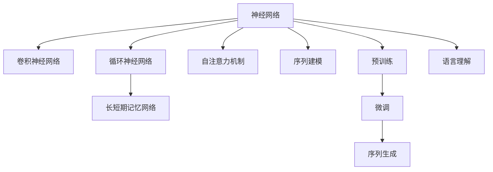

                 

# 神经网络：自然语言处理的新突破

> 关键词：神经网络,自然语言处理,NLP,深度学习,Transformer,BERT,预训练,下游任务,序列建模,序列生成,语言理解

## 1. 背景介绍

### 1.1 问题由来
近年来，深度学习技术在自然语言处理(Natural Language Processing, NLP)领域取得了长足的进步。其中，神经网络(特别是卷积神经网络CNN和循环神经网络RNN)在文本分类、命名实体识别、情感分析等任务中表现出色。然而，由于自然语言的多样性和复杂性，传统的神经网络模型在处理长序列文本时，往往存在计算量巨大、模型难以优化等缺点。

为了应对这些问题，研究者们开始探索更高效、更灵活的神经网络模型。Transformer和BERT等新型神经网络模型应运而生，推动了自然语言处理技术的跨越式发展。Transformer模型以自注意力机制为特色，可以在大规模数据集上进行高效的序列建模，逐步成为NLP领域的主流模型。BERT等预训练语言模型则通过在无标签文本数据上进行大规模预训练，学习到丰富的语言表示，再通过微调用于下游任务的特定任务表示，极大地提升了模型的性能。

### 1.2 问题核心关键点
Transformer和BERT模型在NLP任务上的突破性表现，得益于其在序列建模、自注意力机制、大规模预训练等方面的创新。其主要特点包括：

- 序列建模：通过Transformer模型，神经网络可以高效地处理长序列文本，而不必像RNN那样受到梯度消失或爆炸的限制。
- 自注意力机制：通过引入自注意力机制，模型可以自动捕捉文本中的长程依赖关系，从而更好地理解上下文信息。
- 大规模预训练：通过在大规模无标签文本数据上进行预训练，学习到语言的通用表示，提升模型在特定任务上的性能。
- 微调技术：通过在预训练模型的基础上，使用下游任务的少量标注数据进行微调，优化模型在特定任务上的表现。

这些特点使得Transformer和BERT模型在NLP任务上取得了显著的性能提升。本文将详细探讨Transformer和BERT等新型神经网络模型在NLP任务中的原理和实践，并结合项目实践，阐释其实际应用场景和未来发展趋势。

## 2. 核心概念与联系

### 2.1 核心概念概述

为更好地理解Transformer和BERT等新型神经网络模型在NLP任务中的应用，本节将介绍几个密切相关的核心概念：

- 神经网络(Neural Network)：由大量节点构成的计算图，通过链式法则进行前向传播和反向传播，用于学习和优化模型参数。
- 卷积神经网络(CNN)：通过卷积操作捕捉局部特征，适用于图像等局部结构相似的领域。
- 循环神经网络(RNN)：通过循环结构捕捉序列时间上的依赖关系，适用于文本、语音等序列数据。
- 长短期记忆网络(LSTM)：一种特殊的RNN，通过门控机制缓解梯度消失问题，适用于序列建模。
- 自注意力机制(Self-Attention)：通过自注意力机制，模型可以自动关注序列中的关键部分，用于处理长序列文本。
- 序列建模(Sequence Modeling)：通过神经网络模型处理序列数据，捕捉序列间的依赖关系。
- 预训练(Pre-training)：在大规模无标签数据上训练模型，学习到通用的语言表示，用于提升特定任务的性能。
- 微调(Fine-tuning)：在预训练模型的基础上，使用下游任务的少量标注数据进行微调，优化模型在特定任务上的性能。
- 序列生成(Sequence Generation)：通过神经网络模型生成序列文本，如机器翻译、对话系统等。
- 语言理解(Language Understanding)：通过神经网络模型理解文本的语义，如命名实体识别、情感分析等。

这些核心概念之间的逻辑关系可以通过以下Mermaid流程图来展示：



这个流程图展示了几类神经网络模型及其在NLP任务中的应用：

1. 神经网络是所有模型的基础，通过链式法则进行前向和反向传播。
2. CNN和RNN是经典的神经网络模型，分别适用于图像和序列数据的建模。
3. LSTM是RNN的一种改进，通过门控机制缓解梯度消失问题，适用于长序列数据。
4. 自注意力机制和序列建模是Transformer模型的核心特性，用于处理长序列文本。
5. 预训练和微调是大模型提升特定任务性能的重要范式，Transformer和BERT模型都是基于这一范式进行设计的。
6. 序列生成和语言理解是大模型在NLP任务上的两个主要应用方向，Transformer模型在这两个方向上都有出色的表现。

## 3. 核心算法原理 & 具体操作步骤
### 3.1 算法原理概述

Transformer和BERT等新型神经网络模型在NLP任务上的突破性表现，主要归功于其自注意力机制和预训练-微调范式。

Transformer模型的核心思想是通过自注意力机制，捕捉序列中的长程依赖关系，从而更好地理解上下文信息。具体而言，Transformer模型将序列分解为多个子序列，通过多头自注意力机制，计算每个子序列与其他子序列的注意力权重，从而得到每个子序列的上下文表示。这样，模型可以同时考虑序列中的全局信息，而不需要像RNN那样逐个节点计算。

BERT模型的核心思想是通过大规模预训练，学习到丰富的语言表示，再通过微调用于特定任务的表示。BERT模型通过在大规模无标签文本数据上进行预训练，学习到文本的语义表示，然后通过微调用于下游任务的特定任务表示。通过这种方式，BERT模型可以充分利用预训练学到的知识，提升模型在特定任务上的性能。

### 3.2 算法步骤详解

Transformer和BERT模型在NLP任务上的主要操作步骤包括：

**Step 1: 准备预训练模型和数据集**
- 选择合适的预训练模型，如BERT、GPT等，作为初始化参数。
- 准备下游任务的标注数据集，划分为训练集、验证集和测试集。

**Step 2: 添加任务适配层**
- 根据下游任务类型，设计合适的输出层和损失函数。
- 对于分类任务，通常在顶层添加线性分类器和交叉熵损失函数。
- 对于生成任务，通常使用语言模型的解码器输出概率分布，并以负对数似然为损失函数。

**Step 3: 设置微调超参数**
- 选择合适的优化算法及其参数，如AdamW、SGD等，设置学习率、批大小、迭代轮数等。
- 设置正则化技术及强度，包括权重衰减、Dropout、Early Stopping等。
- 确定冻结预训练参数的策略，如仅微调顶层，或全部参数都参与微调。

**Step 4: 执行梯度训练**
- 将训练集数据分批次输入模型，前向传播计算损失函数。
- 反向传播计算参数梯度，根据设定的优化算法和学习率更新模型参数。
- 周期性在验证集上评估模型性能，根据性能指标决定是否触发 Early Stopping。
- 重复上述步骤直到满足预设的迭代轮数或 Early Stopping 条件。

**Step 5: 测试和部署**
- 在测试集上评估微调后模型，对比微调前后的精度提升。
- 使用微调后的模型对新样本进行推理预测，集成到实际的应用系统中。
- 持续收集新的数据，定期重新微调模型，以适应数据分布的变化。

以上是Transformer和BERT模型在NLP任务上的主要操作步骤。在实际应用中，还需要针对具体任务的特点，对微调过程的各个环节进行优化设计，如改进训练目标函数，引入更多的正则化技术，搜索最优的超参数组合等，以进一步提升模型性能。

### 3.3 算法优缺点

Transformer和BERT模型在NLP任务上的突破性表现，得益于其在序列建模、自注意力机制、大规模预训练等方面的创新。其主要特点包括：

- 序列建模：通过Transformer模型，神经网络可以高效地处理长序列文本，而不必像RNN那样受到梯度消失或爆炸的限制。
- 自注意力机制：通过引入自注意力机制，模型可以自动捕捉文本中的长程依赖关系，从而更好地理解上下文信息。
- 大规模预训练：通过在大规模无标签文本数据上进行预训练，学习到丰富的语言表示，提升模型在特定任务上的性能。
- 微调技术：通过在预训练模型的基础上，使用下游任务的少量标注数据进行微调，优化模型在特定任务上的表现。

这些特点使得Transformer和BERT模型在NLP任务上取得了显著的性能提升。然而，这些模型也存在一定的局限性：

- 计算资源需求高：由于大规模预训练和大模型参数量，这些模型需要大量的计算资源进行训练和推理。
- 模型复杂度高：模型结构复杂，训练和推理过程中的超参数调优难度较大。
- 泛化能力受限：尽管在大规模数据上进行了预训练，但这些模型仍面临过拟合和泛化能力不足的问题，尤其是对小规模数据集。
- 解释性不足：由于模型结构复杂，难以解释其内部工作机制和决策逻辑，不利于模型调试和优化。

尽管存在这些局限性，但Transformer和BERT模型在NLP任务上已经取得了广泛的应用，成为NLP技术发展的重要推动力。未来相关研究的重点在于如何进一步降低模型计算资源需求，提高模型泛化能力，增强模型的可解释性，并探索更多前沿技术如多模态学习、因果推理等。

### 3.4 算法应用领域

Transformer和BERT模型在NLP领域的应用已经覆盖了几乎所有常见任务，例如：

- 文本分类：如情感分析、主题分类、意图识别等。通过微调使模型学习文本-标签映射。
- 命名实体识别：识别文本中的人名、地名、机构名等特定实体。通过微调使模型掌握实体边界和类型。
- 关系抽取：从文本中抽取实体之间的语义关系。通过微调使模型学习实体-关系三元组。
- 问答系统：对自然语言问题给出答案。将问题-答案对作为微调数据，训练模型学习匹配答案。
- 机器翻译：将源语言文本翻译成目标语言。通过微调使模型学习语言-语言映射。
- 文本摘要：将长文本压缩成简短摘要。将文章-摘要对作为微调数据，使模型学习抓取要点。
- 对话系统：使机器能够与人自然对话。将多轮对话历史作为上下文，微调模型进行回复生成。

除了上述这些经典任务外，Transformer和BERT模型还被创新性地应用到更多场景中，如可控文本生成、常识推理、代码生成、数据增强等，为NLP技术带来了全新的突破。随着预训练模型和微调方法的不断进步，相信NLP技术将在更广阔的应用领域大放异彩。

## 4. 数学模型和公式 & 详细讲解  
### 4.1 数学模型构建

本节将使用数学语言对Transformer和BERT模型的数学原理进行更加严格的刻画。

记Transformer模型为 $M_{\theta}:\mathcal{X} \rightarrow \mathcal{Y}$，其中 $\mathcal{X}$ 为输入空间，$\mathcal{Y}$ 为输出空间，$\theta$ 为模型参数。假设微调任务的训练集为 $D=\{(x_i,y_i)\}_{i=1}^N, x_i \in \mathcal{X}, y_i \in \mathcal{Y}$。

定义模型 $M_{\theta}$ 在数据样本 $(x,y)$ 上的损失函数为 $\ell(M_{\theta}(x),y)$，则在数据集 $D$ 上的经验风险为：

$$
\mathcal{L}(\theta) = \frac{1}{N} \sum_{i=1}^N \ell(M_{\theta}(x_i),y_i)
$$

Transformer模型的核心组成部分包括编码器(Encoder)和解码器(Decoder)。编码器由多层自注意力和前馈网络组成，用于将输入序列映射到高维表示。解码器由多层自注意力和前馈网络组成，用于生成输出序列。

设 $M_{\theta}$ 的编码器部分为 $E_{\theta}=\{E^i\}_{i=1}^L$，解码器部分为 $D_{\theta}=\{D^i\}_{i=1}^L$，其中 $L$ 为模型层数。则编码器的输出为：

$$
\text{EncoderOutput} = \text{LayerNorm}(\text{Softmax}(\text{Attention}(\text{Input}, \text{Self-Attention}(E^i(\text{Input})))) + \text{FFN}(E^i(\text{Input}))
$$

其中 $\text{Softmax}(\cdot)$ 表示softmax函数，$\text{LayerNorm}(\cdot)$ 表示层归一化，$\text{FFN}(\cdot)$ 表示前馈网络，$\text{Attention}(\cdot)$ 表示自注意力机制。

解码器的输出为：

$$
\text{DecoderOutput} = \text{LayerNorm}(\text{Softmax}(\text{Attention}(\text{Output}, \text{Self-Attention}(D^i(\text{Output}, \text{EncoderOutput})))) + \text{FFN}(D^i(\text{Output}, \text{EncoderOutput}))
$$

在实际微调过程中，我们通常会添加一个任务适配层在解码器的顶层，用于处理特定的下游任务。例如，对于文本分类任务，我们通常会添加一个线性分类器，输出与标签对应的概率分布。

### 4.2 公式推导过程

以下我们以文本分类任务为例，推导Transformer模型在微调过程中的损失函数及其梯度计算公式。

假设模型 $M_{\theta}$ 在输入 $x$ 上的输出为 $\hat{y}=M_{\theta}(x) \in [0,1]$，表示样本属于正类的概率。真实标签 $y \in \{0,1\}$。则二分类交叉熵损失函数定义为：

$$
\ell(M_{\theta}(x),y) = -[y\log \hat{y} + (1-y)\log (1-\hat{y})]
$$

将其代入经验风险公式，得：

$$
\mathcal{L}(\theta) = -\frac{1}{N}\sum_{i=1}^N [y_i\log M_{\theta}(x_i)+(1-y_i)\log(1-M_{\theta}(x_i))]
$$

根据链式法则，损失函数对参数 $\theta_k$ 的梯度为：

$$
\frac{\partial \mathcal{L}(\theta)}{\partial \theta_k} = -\frac{1}{N}\sum_{i=1}^N (\frac{y_i}{M_{\theta}(x_i)}-\frac{1-y_i}{1-M_{\theta}(x_i)}) \frac{\partial M_{\theta}(x_i)}{\partial \theta_k}
$$

其中 $\frac{\partial M_{\theta}(x_i)}{\partial \theta_k}$ 可进一步递归展开，利用自动微分技术完成计算。

在得到损失函数的梯度后，即可带入参数更新公式，完成模型的迭代优化。重复上述过程直至收敛，最终得到适应下游任务的最优模型参数 $\theta^*$。

## 5. 项目实践：代码实例和详细解释说明
### 5.1 开发环境搭建

在进行Transformer和BERT模型微调实践前，我们需要准备好开发环境。以下是使用Python进行PyTorch开发的环境配置流程：

1. 安装Anaconda：从官网下载并安装Anaconda，用于创建独立的Python环境。

2. 创建并激活虚拟环境：
```bash
conda create -n transformers-env python=3.8 
conda activate transformers-env
```

3. 安装PyTorch：根据CUDA版本，从官网获取对应的安装命令。例如：
```bash
conda install pytorch torchvision torchaudio cudatoolkit=11.1 -c pytorch -c conda-forge
```

4. 安装Transformers库：
```bash
pip install transformers
```

5. 安装各类工具包：
```bash
pip install numpy pandas scikit-learn matplotlib tqdm jupyter notebook ipython
```

完成上述步骤后，即可在`transformers-env`环境中开始微调实践。

### 5.2 源代码详细实现

下面我们以文本分类任务为例，给出使用Transformers库对BERT模型进行微调的PyTorch代码实现。

首先，定义文本分类任务的数据处理函数：

```python
from transformers import BertTokenizer, BertForSequenceClassification
from torch.utils.data import Dataset
import torch

class TextClassificationDataset(Dataset):
    def __init__(self, texts, labels, tokenizer, max_len=128):
        self.texts = texts
        self.labels = labels
        self.tokenizer = tokenizer
        self.max_len = max_len
        
    def __len__(self):
        return len(self.texts)
    
    def __getitem__(self, item):
        text = self.texts[item]
        label = self.labels[item]
        
        encoding = self.tokenizer(text, return_tensors='pt', max_length=self.max_len, padding='max_length', truncation=True)
        input_ids = encoding['input_ids'][0]
        attention_mask = encoding['attention_mask'][0]
        
        # 对token-wise的标签进行编码
        encoded_labels = [tag2id[label] for tag in label] 
        encoded_labels.extend([tag2id['O']] * (self.max_len - len(encoded_labels)))
        labels = torch.tensor(encoded_labels, dtype=torch.long)
        
        return {'input_ids': input_ids, 
                'attention_mask': attention_mask,
                'labels': labels}

# 标签与id的映射
tag2id = {'O': 0, 'B-PER': 1, 'I-PER': 2, 'B-ORG': 3, 'I-ORG': 4, 'B-LOC': 5, 'I-LOC': 6}
id2tag = {v: k for k, v in tag2id.items()}

# 创建dataset
tokenizer = BertTokenizer.from_pretrained('bert-base-cased')

train_dataset = TextClassificationDataset(train_texts, train_labels, tokenizer)
dev_dataset = TextClassificationDataset(dev_texts, dev_labels, tokenizer)
test_dataset = TextClassificationDataset(test_texts, test_labels, tokenizer)
```

然后，定义模型和优化器：

```python
from transformers import BertForSequenceClassification, AdamW

model = BertForSequenceClassification.from_pretrained('bert-base-cased', num_labels=len(tag2id))

optimizer = AdamW(model.parameters(), lr=2e-5)
```

接着，定义训练和评估函数：

```python
from torch.utils.data import DataLoader
from tqdm import tqdm
from sklearn.metrics import classification_report

device = torch.device('cuda') if torch.cuda.is_available() else torch.device('cpu')
model.to(device)

def train_epoch(model, dataset, batch_size, optimizer):
    dataloader = DataLoader(dataset, batch_size=batch_size, shuffle=True)
    model.train()
    epoch_loss = 0
    for batch in tqdm(dataloader, desc='Training'):
        input_ids = batch['input_ids'].to(device)
        attention_mask = batch['attention_mask'].to(device)
        labels = batch['labels'].to(device)
        model.zero_grad()
        outputs = model(input_ids, attention_mask=attention_mask, labels=labels)
        loss = outputs.loss
        epoch_loss += loss.item()
        loss.backward()
        optimizer.step()
    return epoch_loss / len(dataloader)

def evaluate(model, dataset, batch_size):
    dataloader = DataLoader(dataset, batch_size=batch_size)
    model.eval()
    preds, labels = [], []
    with torch.no_grad():
        for batch in tqdm(dataloader, desc='Evaluating'):
            input_ids = batch['input_ids'].to(device)
            attention_mask = batch['attention_mask'].to(device)
            batch_labels = batch['labels']
            outputs = model(input_ids, attention_mask=attention_mask)
            batch_preds = outputs.logits.argmax(dim=2).to('cpu').tolist()
            batch_labels = batch_labels.to('cpu').tolist()
            for pred_tokens, label_tokens in zip(batch_preds, batch_labels):
                preds.append(pred_tokens[:len(label_tokens)])
                labels.append(label_tokens)
                
    print(classification_report(labels, preds))
```

最后，启动训练流程并在测试集上评估：

```python
epochs = 5
batch_size = 16

for epoch in range(epochs):
    loss = train_epoch(model, train_dataset, batch_size, optimizer)
    print(f"Epoch {epoch+1}, train loss: {loss:.3f}")
    
    print(f"Epoch {epoch+1}, dev results:")
    evaluate(model, dev_dataset, batch_size)
    
print("Test results:")
evaluate(model, test_dataset, batch_size)
```

以上就是使用PyTorch对BERT进行文本分类任务微调的完整代码实现。可以看到，得益于Transformers库的强大封装，我们可以用相对简洁的代码完成BERT模型的加载和微调。

### 5.3 代码解读与分析

让我们再详细解读一下关键代码的实现细节：

**TextClassificationDataset类**：
- `__init__`方法：初始化文本、标签、分词器等关键组件。
- `__len__`方法：返回数据集的样本数量。
- `__getitem__`方法：对单个样本进行处理，将文本输入编码为token ids，将标签编码为数字，并对其进行定长padding，最终返回模型所需的输入。

**tag2id和id2tag字典**：
- 定义了标签与数字id之间的映射关系，用于将token-wise的预测结果解码回真实的标签。

**训练和评估函数**：
- 使用PyTorch的DataLoader对数据集进行批次化加载，供模型训练和推理使用。
- 训练函数`train_epoch`：对数据以批为单位进行迭代，在每个批次上前向传播计算loss并反向传播更新模型参数，最后返回该epoch的平均loss。
- 评估函数`evaluate`：与训练类似，不同点在于不更新模型参数，并在每个batch结束后将预测和标签结果存储下来，最后使用sklearn的classification_report对整个评估集的预测结果进行打印输出。

**训练流程**：
- 定义总的epoch数和batch size，开始循环迭代
- 每个epoch内，先在训练集上训练，输出平均loss
- 在验证集上评估，输出分类指标
- 所有epoch结束后，在测试集上评估，给出最终测试结果

可以看到，PyTorch配合Transformers库使得BERT微调的代码实现变得简洁高效。开发者可以将更多精力放在数据处理、模型改进等高层逻辑上，而不必过多关注底层的实现细节。

当然，工业级的系统实现还需考虑更多因素，如模型的保存和部署、超参数的自动搜索、更灵活的任务适配层等。但核心的微调范式基本与此类似。

## 6. 实际应用场景
### 6.1 智能客服系统

基于Transformer和BERT等新型神经网络模型的智能客服系统，可以广泛应用于智能客服系统的构建。传统客服往往需要配备大量人力，高峰期响应缓慢，且一致性和专业性难以保证。而使用微调后的智能客服模型，可以7x24小时不间断服务，快速响应客户咨询，用自然流畅的语言解答各类常见问题。

在技术实现上，可以收集企业内部的历史客服对话记录，将问题和最佳答复构建成监督数据，在此基础上对预训练智能客服模型进行微调。微调后的智能客服模型能够自动理解用户意图，匹配最合适的答案模板进行回复。对于客户提出的新问题，还可以接入检索系统实时搜索相关内容，动态组织生成回答。如此构建的智能客服系统，能大幅提升客户咨询体验和问题解决效率。

### 6.2 金融舆情监测

金融机构需要实时监测市场舆论动向，以便及时应对负面信息传播，规避金融风险。传统的人工监测方式成本高、效率低，难以应对网络时代海量信息爆发的挑战。基于Transformer和BERT等新型神经网络模型的文本分类和情感分析技术，为金融舆情监测提供了新的解决方案。

具体而言，可以收集金融领域相关的新闻、报道、评论等文本数据，并对其进行主题标注和情感标注。在此基础上对预训练语言模型进行微调，使其能够自动判断文本属于何种主题，情感倾向是正面、中性还是负面。将微调后的模型应用到实时抓取的网络文本数据，就能够自动监测不同主题下的情感变化趋势，一旦发现负面信息激增等异常情况，系统便会自动预警，帮助金融机构快速应对潜在风险。

### 6.3 个性化推荐系统

当前的推荐系统往往只依赖用户的历史行为数据进行物品推荐，无法深入理解用户的真实兴趣偏好。基于Transformer和BERT等新型神经网络模型的个性化推荐系统，可以更好地挖掘用户行为背后的语义信息，从而提供更精准、多样的推荐内容。

在实践中，可以收集用户浏览、点击、评论、分享等行为数据，提取和用户交互的物品标题、描述、标签等文本内容。将文本内容作为模型输入，用户的后续行为（如是否点击、购买等）作为监督信号，在此基础上微调预训练语言模型。微调后的模型能够从文本内容中准确把握用户的兴趣点。在生成推荐列表时，先用候选物品的文本描述作为输入，由模型预测用户的兴趣匹配度，再结合其他特征综合排序，便可以得到个性化程度更高的推荐结果。

### 6.4 未来应用展望

随着Transformer和BERT等新型神经网络模型的发展，基于微调范式将在更多领域得到应用，为传统行业带来变革性影响。

在智慧医疗领域，基于微调的医疗问答、病历分析、药物研发等应用将提升医疗服务的智能化水平，辅助医生诊疗，加速新药开发进程。

在智能教育领域，微调技术可应用于作业批改、学情分析、知识推荐等方面，因材施教，促进教育公平，提高教学质量。

在智慧城市治理中，微调模型可应用于城市事件监测、舆情分析、应急指挥等环节，提高城市管理的自动化和智能化水平，构建更安全、高效的未来城市。

此外，在企业生产、社会治理、文娱传媒等众多领域，基于Transformer和BERT等新型神经网络模型的微调应用也将不断涌现，为经济社会发展注入新的动力。相信随着技术的日益成熟，微调方法将成为人工智能落地应用的重要范式，推动人工智能技术在各行各业的普及和应用。

## 7. 工具和资源推荐
### 7.1 学习资源推荐

为了帮助开发者系统掌握Transformer和BERT等新型神经网络模型的理论基础和实践技巧，这里推荐一些优质的学习资源：

1. 《Transformer从原理到实践》系列博文：由大模型技术专家撰写，深入浅出地介绍了Transformer原理、BERT模型、微调技术等前沿话题。

2. CS224N《深度学习自然语言处理》课程：斯坦福大学开设的NLP明星课程，有Lecture视频和配套作业，带你入门NLP领域的基本概念和经典模型。

3. 《Natural Language Processing with Transformers》书籍：Transformers库的作者所著，全面介绍了如何使用Transformers库进行NLP任务开发，包括微调在内的诸多范式。

4. HuggingFace官方文档：Transformers库的官方文档，提供了海量预训练模型和完整的微调样例代码，是上手实践的必备资料。

5. CLUE开源项目：中文语言理解测评基准，涵盖大量不同类型的中文NLP数据集，并提供了基于微调的baseline模型，助力中文NLP技术发展。

通过对这些资源的学习实践，相信你一定能够快速掌握Transformer和BERT等新型神经网络模型的精髓，并用于解决实际的NLP问题。
###  7.2 开发工具推荐

高效的开发离不开优秀的工具支持。以下是几款用于Transformer和BERT模型微调开发的常用工具：

1. PyTorch：基于Python的开源深度学习框架，灵活动态的计算图，适合快速迭代研究。大部分预训练语言模型都有PyTorch版本的实现。

2. TensorFlow：由Google主导开发的开源深度学习框架，生产部署方便，适合大规模工程应用。同样有丰富的预训练语言模型资源。

3. Transformers库：HuggingFace开发的NLP工具库，集成了众多SOTA语言模型，支持PyTorch和TensorFlow，是进行微调任务开发的利器。

4. Weights & Biases：模型训练的实验跟踪工具，可以记录和可视化模型训练过程中的各项指标，方便对比和调优。与主流深度学习框架无缝集成。

5. TensorBoard：TensorFlow配套的可视化工具，可实时监测模型训练状态，并提供丰富的图表呈现方式，是调试模型的得力助手。

6. Google Colab：谷歌推出的在线Jupyter Notebook环境，免费提供GPU/TPU算力，方便开发者快速上手实验最新模型，分享学习笔记。

合理利用这些工具，可以显著提升Transformer和BERT模型微调任务的开发效率，加快创新迭代的步伐。

### 7.3 相关论文推荐

Transformer和BERT模型在NLP领域的发展源于学界的持续研究。以下是几篇奠基性的相关论文，推荐阅读：

1. Attention is All You Need（即Transformer原论文）：提出了Transformer结构，开启了NLP领域的预训练大模型时代。

2. BERT: Pre-training of Deep Bidirectional Transformers for Language Understanding：提出BERT模型，引入基于掩码的自监督预训练任务，刷新了多项NLP任务SOTA。

3. Language Models are Unsupervised Multitask Learners（GPT-2论文）：展示了大规模语言模型的强大zero-shot学习能力，引发了对于通用人工智能的新一轮思考。

4. Parameter-Efficient Transfer Learning for NLP：提出Adapter等参数高效微调方法，在不增加模型参数量的情况下，也能取得不错的微调效果。

5. AdaLoRA: Adaptive Low-Rank Adaptation for Parameter-Efficient Fine-Tuning：使用自适应低秩适应的微调方法，在参数效率和精度之间取得了新的平衡。

6. Evolved Transformer Architectures for Masked Language Modeling: A Case Study: Design and Performance Analysis：研究了不同Transformer架构在自监督预训练中的性能，提供了模型设计的新思路。

这些论文代表了大语言模型微调技术的发展脉络。通过学习这些前沿成果，可以帮助研究者把握学科前进方向，激发更多的创新灵感。

## 8. 总结：未来发展趋势与挑战

### 8.1 总结

本文对Transformer和BERT等新型神经网络模型在NLP任务中的原理和实践进行了全面系统的介绍。首先阐述了Transformer和BERT等模型在NLP任务上的突破性表现，明确了其在大规模预训练和微调范式上的重要价值。其次，从原理到实践，详细讲解了Transformer和BERT等模型在NLP任务上的数学原理和关键步骤，给出了微调任务开发的完整代码实例。同时，本文还广泛探讨了微调方法在智能客服、金融舆情、个性化推荐等多个行业领域的应用前景，展示了微调范式的巨大潜力。

通过本文的系统梳理，可以看到，Transformer和BERT等新型神经网络模型正在成为NLP领域的重要范式，极大地拓展了预训练语言模型的应用边界，催生了更多的落地场景。受益于大规模语料的预训练和微调方法的不断进步，基于这些模型的NLP技术将在更广阔的应用领域大放异彩，深刻影响人类的生产生活方式。

### 8.2 未来发展趋势

展望未来，Transformer和BERT等新型神经网络模型在NLP任务上的发展趋势将呈现以下几个方向：

1. 模型规模持续增大。随着算力成本的下降和数据规模的扩张，预训练语言模型的参数量还将持续增长。超大规模语言模型蕴含的丰富语言知识，有望支撑更加复杂多变的下游任务微调。

2. 微调方法日趋多样。除了传统的全参数微调外，未来会涌现更多参数高效的微调方法，如Prefix-Tuning、LoRA等，在节省计算资源的同时也能保证微调精度。

3. 持续学习成为常态。随着数据分布的不断变化，微调模型也需要持续学习新知识以保持性能。如何在不遗忘原有知识的同时，高效吸收新样本信息，将成为重要的研究课题。

4. 标注样本需求降低。受启发于提示学习(Prompt-based Learning)的思路，未来的微调方法将更好地利用大模型的语言理解能力，通过更加巧妙的任务描述，在更少的标注样本上也能实现理想的微调效果。

5. 标注样本需求降低。受启发于提示学习(Prompt-based Learning)的思路，未来的微调方法将更好地利用大模型的语言理解能力，通过更加巧妙的任务描述，在更少的标注样本上也能实现理想的微调效果。

6. 多模态微调崛起。当前的微调主要聚焦于纯文本数据，未来会进一步拓展到图像、视频、语音等多模态数据微调。多模态信息的融合，将显著提升语言模型对现实世界的理解和建模能力。

7. 模型通用性增强。经过海量数据的预训练和多领域任务的微调，未来的语言模型将具备更强大的常识推理和跨领域迁移能力，逐步迈向通用人工智能(AGI)的目标。

以上趋势凸显了Transformer和BERT等新型神经网络模型在NLP任务上的广阔前景。这些方向的探索发展，必将进一步提升NLP系统的性能和应用范围，为人类认知智能的进化带来深远影响。

### 8.3 面临的挑战

尽管Transformer和BERT等新型神经网络模型在NLP任务上已经取得了显著的成就，但在迈向更加智能化、普适化应用的过程中，仍面临诸多挑战：

1. 标注成本瓶颈。尽管微调大大降低了标注数据的需求，但对于长尾应用场景，难以获得充足的高质量标注数据，成为制约微调性能的瓶颈。如何进一步降低微调对标注样本的依赖，将是一大难题。

2. 模型鲁棒性不足。当前微调模型面对域外数据时，泛化性能往往大打折扣。对于测试样本的微小扰动，微调模型的预测也容易发生波动。如何提高微调模型的鲁棒性，避免灾难性遗忘，还需要更多理论和实践的积累。

3. 推理效率有待提高。大规模语言模型虽然精度高，但在实际部署时往往面临推理速度慢、内存占用大等效率问题。如何在保证性能的同时，简化模型结构，提升推理速度，优化资源占用，将是重要的优化方向。

4. 可解释性亟需加强。当前微调模型更像是"黑盒"系统，难以解释其内部工作机制和决策逻辑，不利于模型调试和优化。对于医疗、金融等高风险应用，算法的可解释性和可审计性尤为重要。如何赋予微调模型更强的可解释性，将是亟待攻克的难题。

5. 安全性有待保障。预训练语言模型难免会学习到有偏见、有害的信息，通过微调传递到下游任务，产生误导性、歧视性的输出，给实际应用带来安全隐患。如何从数据和算法层面消除模型偏见，避免恶意用途，确保输出的安全性，也将是重要的研究课题。

6. 知识整合能力不足。现有的微调模型往往局限于任务内数据，难以灵活吸收和运用更广泛的先验知识。如何让微调过程更好地与外部知识库、规则库等专家知识结合，形成更加全面、准确的信息整合能力，还有很大的想象空间。

正视微调面临的这些挑战，积极应对并寻求突破，将是大语言模型微调走向成熟的必由之路。相信随着学界和产业界的共同努力，这些挑战终将一一被克服，Transformer和BERT等新型神经网络模型必将在构建人机协同的智能时代中扮演越来越重要的角色。

### 8.4 研究展望

面向未来，大语言模型微调技术需要在以下几个方面寻求新的突破：

1. 探索无监督和半监督微调方法。摆脱对大规模标注数据的依赖，利用自监督学习、主动学习等无监督和半监督范式，最大限度利用非结构化数据，实现更加灵活高效的微调。

2. 研究参数高效和计算高效的微调范式。开发更加参数高效的微调方法，在固定大部分预训练参数的同时，只更新极少量的任务相关参数。同时优化微调模型的计算图，减少前向传播和反向传播的资源消耗，实现更加轻量级、实时性的部署。

3. 引入更多先验知识。将符号化的先验知识，如知识图谱、逻辑规则等，与神经网络模型进行巧妙融合，引导微调过程学习更准确、合理的语言模型。同时加强不同模态数据的整合，实现视觉、语音等多模态信息与文本信息的协同建模。

4. 结合因果分析和博弈论工具。将因果分析方法引入微调模型，识别出模型决策的关键特征，增强输出解释的因果性和逻辑性。借助博弈论工具刻画人机交互过程，主动探索并规避模型的脆弱点，提高系统稳定性。

5. 纳入伦理道德约束。在模型训练目标中引入伦理导向的评估指标，过滤和惩罚有偏见、有害的输出倾向。同时加强人工干预和审核，建立模型行为的监管机制，确保输出符合人类价值观和伦理道德。

这些研究方向的探索，必将引领Transformer和BERT等新型神经网络模型微调技术迈向更高的台阶，为构建安全、可靠、可解释、可控的智能系统铺平道路。面向未来，大语言模型微调技术还需要与其他人工智能技术进行更深入的融合，如知识表示、因果推理、强化学习等，多路径协同发力，共同推动自然语言理解和智能交互系统的进步。只有勇于创新、敢于突破，才能不断拓展语言模型的边界，让智能技术更好地造福人类社会。

## 9. 附录：常见问题与解答
**Q1：Transformer模型和BERT模型在序列建模上的主要区别是什么？**

A: Transformer模型和BERT模型在序列建模上的主要区别在于，Transformer模型通过自注意力机制捕捉序列中的长程依赖关系，而BERT模型则通过预训练在大规模无标签文本数据上学习到文本的语义表示，并在微调时用于特定任务的表示学习。

具体而言，Transformer模型通过多头自注意力机制，捕捉序列中的上下文信息，而BERT模型则通过掩码语言模型和下一句预测任务，学习到文本的语义表示。在微调时，Transformer模型通常通过添加一个任务适配层进行微调，而BERT模型则可以直接将预训练模型用于微调。

**Q2：Transformer模型和BERT模型在微调过程中的主要区别是什么？**

A: Transformer模型和BERT模型在微调过程中的主要区别在于，Transformer模型通常需要较大的计算资源进行微调，而BERT模型则可以通过微调后实现较低的计算需求。这是因为Transformer模型在大规模预训练过程中学习到了大量的参数，而在微调时需要将这些参数全部加载并更新，而BERT模型则在预训练过程中通过掩码语言模型和下一句预测任务学习到了文本的语义表示，微调时只需要对顶层进行微调，不需要加载和更新所有参数。

此外，Transformer模型在微调时通常需要进行更多的正则化操作，以避免过拟合，而BERT模型则可以通过预训练学到的知识，在微调时更好地适应小规模数据集。

**Q3：Transformer模型和BERT模型在应用场景上的主要区别是什么？**

A: Transformer模型和BERT模型在应用场景上的主要区别在于，Transformer模型通常用于需要捕捉长程依赖关系和上下文信息的任务，如机器翻译、对话系统等，而BERT模型则通常用于文本分类、命名实体识别、情感分析等任务，需要学习文本的语义表示。

在具体应用时，如果任务需要处理长序列文本，如机器翻译，通常会选择Transformer模型，而如果需要学习文本的语义表示，如文本分类，则BERT模型更为适合。

**Q4：Transformer模型和BERT模型在模型结构上的主要区别是什么？**

A: Transformer模型和BERT模型在模型结构上的主要区别在于，Transformer模型通常包含多头自注意力机制和前馈网络，用于处理长序列文本，而BERT模型则包含掩码语言模型和下一句预测任务，用于学习文本的语义表示。

在具体实现时，Transformer模型通常使用Transformer层堆叠形成编码器，而BERT模型则通过多个掩码语言模型和下一句预测任务进行预训练，学习到文本的语义表示，然后通过微调用于特定任务的表示学习。

**Q5：Transformer模型和BERT模型在训练和推理过程中的主要区别是什么？**

A: Transformer模型和BERT模型在训练和推理过程中的主要区别在于，Transformer模型通常需要较大的计算资源进行训练和推理，而BERT模型则可以通过微调后实现较低的计算需求。

此外，Transformer模型在训练时需要进行更多的正则化操作，以避免过拟合，而BERT模型则可以通过预训练学到的知识，在微调时更好地适应小规模数据集。在推理时，Transformer模型和BERT模型都需要进行前向传播计算，但Transformer模型需要计算更多的注意力权重，而BERT模型则可以通过预训练学到的知识，实现较低的计算需求。

总之，Transformer模型和BERT模型在序列建模、预训练和微调等方面各有优势，应根据具体任务的需求进行选择和优化。

