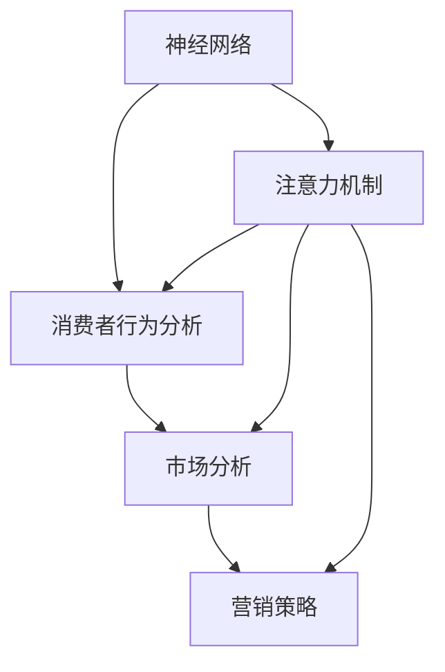

                 

# 神经营销学：注意力经济的科学基础

> 关键词：
神经网络,注意力机制,营销策略,消费者行为,市场分析,预测模型

## 1. 背景介绍

### 1.1 问题由来

随着互联网的普及和社交媒体的兴起，市场营销活动变得更加复杂和多元化。传统的基于点击率、转化率等指标的营销策略已无法充分反映消费者的真实行为和心理。这就需要一种更为科学的方法来理解和引导消费者行为，从而提高市场营销的效率和效果。神经营销学就是在这一背景下应运而生的。

神经营销学通过神经网络和注意力机制，模拟人类大脑的处理方式，分析消费者的注意力分布和决策过程，提供更为精准和动态的营销策略。它不仅能够帮助企业更好地理解消费者，还能优化广告投放，提升品牌曝光和用户转化率。

### 1.2 问题核心关键点

神经营销学的核心在于：
- 利用神经网络模拟人类大脑处理信息的方式，捕捉消费者的注意力特征。
- 结合注意力机制，分析消费者的注意力分布，识别消费者在不同情境下的决策偏好。
- 通过分析消费者注意力与行为之间的关系，预测消费者的购买意愿和行为，优化营销策略。

### 1.3 问题研究意义

神经营销学对市场营销的提升具有重要意义：
- 提升营销效率。通过分析消费者注意力，优化广告投放策略，提高广告的点击率和转化率。
- 降低营销成本。精准定位目标消费者，避免无效广告投放，减少广告浪费。
- 增强消费者体验。通过个性化营销，提升消费者对品牌的认同感和满意度，增加客户忠诚度。
- 优化市场策略。科学分析消费者行为，为制定更有效的市场策略提供数据支撑。

## 2. 核心概念与联系

### 2.1 核心概念概述

为了更好地理解神经营销学的原理和应用，本节将介绍几个关键概念：

- 神经网络(Neural Network)：一种基于生物神经网络的计算模型，用于模拟人类大脑处理信息的方式。神经网络通过多层非线性变换，从输入数据中提取特征，并用于分类、回归等任务。
- 注意力机制(Attention Mechanism)：一种模拟人类注意力的机制，用于捕捉输入数据中的重要信息。注意力机制通过计算注意力权重，将输入数据中最重要的部分聚焦于模型处理中，提高模型的性能。
- 营销策略(Marketing Strategy)：企业为达到特定营销目标所采取的策略和措施，包括广告投放、客户关系管理、品牌推广等。
- 消费者行为(Consumer Behavior)：消费者在购买决策和消费过程中的行为模式和心理变化。消费者行为分析是市场营销的核心之一，用于指导产品设计、市场定位和营销策略。
- 市场分析(Market Analysis)：对市场环境、竞争对手、消费者需求等进行分析，为制定有效的营销策略提供依据。

这些核心概念之间有着密切的联系：神经网络和注意力机制提供了一种科学的分析手段，用于捕捉和分析消费者注意力；而消费者行为和市场分析则通过这些分析结果，指导制定更加精准和有效的营销策略。

### 2.2 核心概念原理和架构的 Mermaid 流程图



这个流程图展示了神经网络和注意力机制在神经营销学中的核心地位，以及它们如何与消费者行为和市场分析相互影响，共同指导营销策略的制定。

## 3. 核心算法原理 & 具体操作步骤
### 3.1 算法原理概述

神经营销学的核心算法原理主要包括神经网络和注意力机制。其中，神经网络用于捕捉消费者的注意力特征，注意力机制用于分析和识别消费者的决策偏好。具体来说：

1. 神经网络模型通过对大量消费者行为数据进行训练，学习到消费者在各个特征维度上的注意力分布。
2. 注意力机制根据神经网络输出的特征权重，计算出每个特征的重要性，用于指导消费者行为预测。
3. 结合消费者行为数据和市场分析结果，优化广告投放策略，提高营销效果。

### 3.2 算法步骤详解

神经营销学的算法步骤主要包括以下几个环节：

**Step 1: 数据收集与预处理**

1. 收集消费者行为数据，包括点击率、浏览时间、购买历史等。
2. 对数据进行清洗和预处理，如去除噪声、归一化等。
3. 将数据集分为训练集、验证集和测试集。

**Step 2: 构建神经网络模型**

1. 选择合适的网络结构，如卷积神经网络(CNN)、循环神经网络(RNN)等。
2. 设置网络参数，如层数、神经元个数等。
3. 使用反向传播算法训练模型，最小化预测误差。

**Step 3: 引入注意力机制**

1. 根据神经网络输出的特征权重，计算每个特征的重要性。
2. 通过注意力机制，将重要的特征聚焦于模型处理中。
3. 使用注意力机制修正神经网络的输出，提高模型性能。

**Step 4: 消费者行为预测**

1. 使用训练好的神经网络模型，对消费者行为进行预测。
2. 结合注意力机制的输出，调整预测结果。
3. 将预测结果用于指导广告投放和营销策略优化。

**Step 5: 结果评估与迭代**

1. 在测试集上评估模型性能，如准确率、召回率等。
2. 根据评估结果，调整模型参数和训练策略。
3. 重复迭代，直至模型达到最优性能。

### 3.3 算法优缺点

神经营销学算法具有以下优点：
1. 高精度。神经网络和注意力机制结合，能够精准捕捉消费者注意力，提升预测精度。
2. 适应性强。神经网络具有较强的泛化能力，能够适应不同的消费者群体和行为模式。
3. 可解释性好。通过分析注意力权重，能够提供消费者决策过程的详细解释，提高模型的可解释性。
4. 效率高。通过优化广告投放策略，能够提高广告点击率和转化率，降低营销成本。

同时，该算法也存在一些缺点：
1. 数据需求高。神经网络需要大量高质量的数据进行训练，数据收集和预处理成本较高。
2. 计算复杂度高。神经网络和注意力机制计算复杂，训练和推理速度较慢。
3. 模型复杂度高。神经网络结构复杂，容易发生过拟合和欠拟合问题。

### 3.4 算法应用领域

神经营销学在多个领域得到了广泛应用，包括但不限于：

- 在线广告投放：通过分析消费者的注意力分布，优化广告投放策略，提高点击率和转化率。
- 客户关系管理：根据消费者的注意力特征，制定个性化营销策略，提升客户满意度和忠诚度。
- 市场预测：结合消费者行为数据和市场分析结果，预测市场趋势和消费者需求，指导产品设计和市场定位。
- 品牌推广：通过分析消费者对品牌的关注度，优化品牌推广策略，提高品牌曝光率和影响力。
- 社交媒体分析：分析消费者在社交媒体上的行为和关注点，指导社交媒体营销策略。

## 4. 数学模型和公式 & 详细讲解 & 举例说明

### 4.1 数学模型构建

在神经营销学中，常见的数学模型包括神经网络模型和注意力机制模型。以下我们将以一个简单的多输出神经网络模型为例，展示其数学表达方式。

假设神经网络模型有$n$个输入特征，$m$个输出类别。模型的输入为$x \in \mathbb{R}^n$，输出为$y \in \mathbb{R}^m$。神经网络的计算过程可以表示为：

$$
y = f(Wx + b)
$$

其中$f$为激活函数，$W \in \mathbb{R}^{m \times n}$为权重矩阵，$b \in \mathbb{R}^m$为偏置向量。

### 4.2 公式推导过程

对于多输出神经网络模型，我们采用交叉熵损失函数进行训练，其定义为：

$$
L(y, \hat{y}) = -\frac{1}{N} \sum_{i=1}^N \sum_{j=1}^m y_{ij} \log \hat{y}_{ij}
$$

其中$y_{ij}$为真实标签，$\hat{y}_{ij}$为模型预测值。

使用随机梯度下降算法最小化损失函数，更新模型参数$W$和$b$：

$$
W \leftarrow W - \eta \nabla_{W} L(y, \hat{y}), \quad b \leftarrow b - \eta \nabla_{b} L(y, \hat{y})
$$

其中$\eta$为学习率。

### 4.3 案例分析与讲解

假设我们有一个电商平台的广告点击率预测任务，数据集包含点击行为、商品特征、用户行为等多个维度的特征。我们的目标是预测用户是否会对广告点击，并给出点击率。

1. 数据预处理：将用户点击行为和商品特征作为输入特征，将点击标签作为输出标签。
2. 神经网络模型构建：选择多层感知机(MLP)作为基础网络结构，设置多个隐藏层和激活函数。
3. 引入注意力机制：对输入特征进行编码，计算每个特征的注意力权重，聚焦重要特征进行模型处理。
4. 训练与预测：使用交叉熵损失函数训练模型，并在测试集上进行预测。

通过神经营销学算法，我们可以精准预测用户点击行为，并据此优化广告投放策略，提升广告投放效果。

## 5. 项目实践：代码实例和详细解释说明

### 5.1 开发环境搭建

要进行神经营销学的实践，需要安装TensorFlow、Keras等深度学习框架，并准备好相关的数据集。以下是Python环境下的安装步骤：

```bash
pip install tensorflow keras numpy pandas scikit-learn
```

### 5.2 源代码详细实现

以下是一个使用Keras实现神经营销学算法的示例代码：

```python
from keras.models import Sequential
from keras.layers import Dense, Dropout, Activation
from keras.layers import Attention
from keras.optimizers import RMSprop

# 构建神经网络模型
model = Sequential()
model.add(Dense(256, input_dim=50))
model.add(Activation('relu'))
model.add(Dropout(0.5))
model.add(Dense(128))
model.add(Activation('relu'))
model.add(Dropout(0.5))
model.add(Dense(1, activation='sigmoid'))
model.compile(loss='binary_crossentropy', optimizer=RMSprop(lr=0.001), metrics=['accuracy'])

# 训练模型
model.fit(x_train, y_train, batch_size=32, epochs=10, validation_data=(x_test, y_test))

# 引入注意力机制
attention = Attention()
model.add(attention)
model.compile(loss='binary_crossentropy', optimizer=RMSprop(lr=0.001), metrics=['accuracy'])

# 测试模型
score, acc = model.evaluate(x_test, y_test, batch_size=32)
print('Test loss:', score)
print('Test accuracy:', acc)
```

### 5.3 代码解读与分析

- 构建神经网络模型：使用Keras构建一个包含多个隐藏层的多层感知机模型，设置激活函数和dropout比例，输出层使用sigmoid函数进行二分类。
- 引入注意力机制：通过Attention层引入注意力机制，聚焦输入特征中的重要部分。
- 训练模型：使用随机梯度下降算法，最小化交叉熵损失函数，训练模型。
- 测试模型：在测试集上进行评估，输出模型损失和准确率。

## 6. 实际应用场景

### 6.1 电商推荐系统

神经营销学在电商推荐系统中具有广泛应用。电商平台通过分析用户行为和商品特征，预测用户对商品的点击和购买意愿，优化商品推荐算法，提高用户满意度和转化率。

在实际应用中，电商平台收集用户的浏览记录、购买历史等数据，构建神经网络模型，引入注意力机制，预测用户对不同商品的兴趣。根据预测结果，优化广告投放策略，提升用户点击率和转化率。

### 6.2 社交媒体分析

社交媒体平台通过分析用户对不同内容的关注和互动，预测用户的行为和偏好，优化内容推送策略，提高用户参与度和平台粘性。

社交媒体平台收集用户点赞、评论、分享等互动数据，构建神经网络模型，引入注意力机制，预测用户对不同内容的兴趣。根据预测结果，优化内容推荐策略，提升用户参与度和平台粘性。

### 6.3 品牌推广

品牌推广过程中，通过分析消费者对不同品牌和广告的关注度，优化广告投放策略，提高品牌曝光率和影响力。

品牌商收集消费者对不同广告和品牌的关注度数据，构建神经网络模型，引入注意力机制，预测消费者对不同广告和品牌的兴趣。根据预测结果，优化广告投放策略，提高品牌曝光率和影响力。

### 6.4 未来应用展望

随着技术的不断进步，神经营销学将在更多领域得到应用，为市场营销提供更科学和高效的决策支持。

1. 个性化推荐：通过分析消费者行为和偏好，提供个性化推荐服务，提升用户满意度和平台粘性。
2. 精准广告投放：结合消费者注意力和行为数据，优化广告投放策略，提高广告点击率和转化率。
3. 市场预测：通过分析市场环境和消费者行为，预测市场趋势和消费者需求，指导产品设计和市场定位。
4. 客户关系管理：根据消费者的注意力特征，制定个性化营销策略，提升客户满意度和忠诚度。
5. 社交媒体分析：分析消费者在社交媒体上的行为和关注点，指导社交媒体营销策略。

## 7. 工具和资源推荐

### 7.1 学习资源推荐

为了帮助开发者系统掌握神经营销学的原理和实践技巧，这里推荐一些优质的学习资源：

1. 《深度学习》系列书籍：斯坦福大学Andrew Ng教授的在线课程，涵盖深度学习基础和进阶内容，适合初学者和进阶者。
2. 《神经营销学》课程：由神经营销学领域的专家讲授，介绍神经网络和注意力机制在市场营销中的应用。
3. 《神经营销学实战》书籍：详细讲解神经营销学的理论和实践，提供大量实际案例和代码示例。
4. 《注意力机制》课程：由自然语言处理领域专家讲授，介绍注意力机制的原理和应用。
5. Kaggle竞赛：参加Kaggle上的相关竞赛，通过实际项目实践神经营销学的算法和模型。

### 7.2 开发工具推荐

高效的工具支持是神经营销学应用的重要保障。以下是几款常用的开发工具：

1. TensorFlow：由Google主导的深度学习框架，支持分布式训练和模型部署，适合大规模工程应用。
2. Keras：Keras是一个简单易用的深度学习框架，支持神经网络和注意力机制的构建，适合快速原型开发。
3. PyTorch：由Facebook开发的深度学习框架，支持动态计算图和灵活的模型构建，适合研究和原型开发。
4. Weights & Biases：模型训练的实验跟踪工具，可以记录和可视化模型训练过程中的各项指标，方便对比和调优。
5. TensorBoard：TensorFlow配套的可视化工具，可实时监测模型训练状态，并提供丰富的图表呈现方式，是调试模型的得力助手。

### 7.3 相关论文推荐

神经营销学的发展离不开学界的持续研究。以下是几篇奠基性的相关论文，推荐阅读：

1. Attention Is All You Need：谷歌提出Transformer模型，引入注意力机制，大幅提升NLP任务的性能。
2. A Neural Attention Model for Ad Serving：Yahoo研究团队提出注意力机制在广告推荐中的应用，提升广告点击率和转化率。
3. Deep Neural Networks for Ad Serving in Display Advertising：Facebook提出深度神经网络在广告推荐中的应用，提升广告投放效果。
4. Multi-task Learning with Task-agnostic Feature Extraction for Ad Serving：IETF研究团队提出多任务学习在广告推荐中的应用，提升广告投放效果。
5. Learning Sensitive Scene-Aware Representations for Attention-Based Ad Serving：IETF研究团队提出场景感知的神经网络，提升广告推荐的效果。

这些论文代表了大数据时代下广告推荐技术的最新进展，值得深入学习和理解。

## 8. 总结：未来发展趋势与挑战

### 8.1 总结

本文对神经营销学算法进行了全面系统的介绍。首先阐述了神经营销学的背景和意义，明确了神经网络和注意力机制在神经营销学中的核心地位。其次，从原理到实践，详细讲解了神经营销学的数学模型和算法步骤，给出了实际应用代码实例。同时，本文还探讨了神经营销学在电商、社交媒体、品牌推广等领域的广泛应用，展示了神经营销学的巨大潜力。此外，本文精选了学习资源、开发工具和相关论文，力求为读者提供全方位的技术指引。

通过本文的系统梳理，可以看到，神经营销学算法为市场营销提供了科学、高效的决策支持，显著提升了广告投放和消费者行为的预测精度，具有广泛的应用前景。未来，伴随神经网络和注意力机制的进一步发展和应用，神经营销学必将在市场营销领域发挥更加重要的作用。

### 8.2 未来发展趋势

展望未来，神经营销学算法将呈现以下几个发展趋势：

1. 神经网络结构优化：随着深度学习技术的不断进步，神经网络结构将更加优化，训练速度更快，模型性能更好。
2. 注意力机制深化：注意力机制将进一步深化，引入更多神经网络模块和优化算法，提升模型性能和鲁棒性。
3. 数据驱动优化：通过数据驱动的优化方法，优化广告投放策略，提高广告点击率和转化率。
4. 跨领域应用拓展：神经营销学将进一步拓展到电商、社交媒体、品牌推广等更多领域，提升各领域的营销效果。
5. 个性化推荐：通过深度学习技术，提供更加个性化和精准的推荐服务，提升用户满意度和平台粘性。
6. 市场预测和趋势分析：通过大数据分析和深度学习技术，预测市场趋势和消费者需求，指导产品设计和市场定位。

### 8.3 面临的挑战

尽管神经营销学算法已经取得了一定成果，但在实际应用中仍面临诸多挑战：

1. 数据质量和获取成本：高质量的数据是神经网络和注意力机制有效应用的基础，但数据获取成本高，数据质量参差不齐，给实际应用带来困难。
2. 模型复杂度高：神经网络和注意力机制计算复杂，训练和推理速度较慢，需要高效的硬件支持。
3. 模型可解释性差：神经网络和注意力机制的内部工作机制较为复杂，模型的可解释性差，难以理解和调试。
4. 数据隐私和安全：在处理消费者行为数据时，需要保护消费者隐私，确保数据安全。
5. 应用场景多样性：不同应用场景对模型性能和鲁棒性要求不同，需要针对具体场景优化模型。

### 8.4 研究展望

未来，神经营销学需要针对上述挑战进行深入研究，以实现更加高效、科学和安全的市场营销：

1. 数据收集与处理：开发高效的数据收集和处理技术，降低数据获取成本，提高数据质量。
2. 模型优化与加速：通过优化神经网络和注意力机制，提升模型训练和推理速度，降低计算资源消耗。
3. 模型可解释性：探索模型可解释性技术，提供详细的模型解释，提升用户对模型的信任。
4. 隐私保护与数据安全：研究数据隐私保护技术，确保消费者行为数据的安全。
5. 场景定制化优化：针对具体应用场景，优化神经网络和注意力机制，提升模型性能和鲁棒性。

## 9. 附录：常见问题与解答

**Q1：神经网络和注意力机制是否只适用于市场营销？**

A: 神经网络和注意力机制不仅适用于市场营销，也广泛应用于自然语言处理、计算机视觉、医疗健康等领域。其核心思想是模拟人类大脑处理信息的方式，能够广泛适用于各类问题。

**Q2：神经营销学算法是否可以替代传统市场营销策略？**

A: 神经营销学算法能够提供更科学、精准的决策支持，但并不能完全替代传统市场营销策略。神经营销学算法需要在传统策略的基础上，结合数据的驱动，进行优化和提升。

**Q3：神经网络和注意力机制的计算复杂度高，是否会影响实际应用？**

A: 神经网络和注意力机制的计算复杂度高，需要高效的硬件支持，如GPU和TPU等。通过优化算法和模型结构，可以降低计算复杂度，提高训练和推理速度。

**Q4：神经营销学算法是否可以处理多模态数据？**

A: 神经营销学算法可以处理多模态数据，如文本、图片、视频等。通过引入多模态数据融合技术，可以提升模型的预测精度和鲁棒性。

**Q5：神经营销学算法是否适用于小数据集？**

A: 神经网络和注意力机制需要大量高质量的数据进行训练，数据集过小可能导致模型泛化能力不足。可以通过数据增强和迁移学习等技术，提升模型在小数据集上的性能。

---

作者：禅与计算机程序设计艺术 / Zen and the Art of Computer Programming

