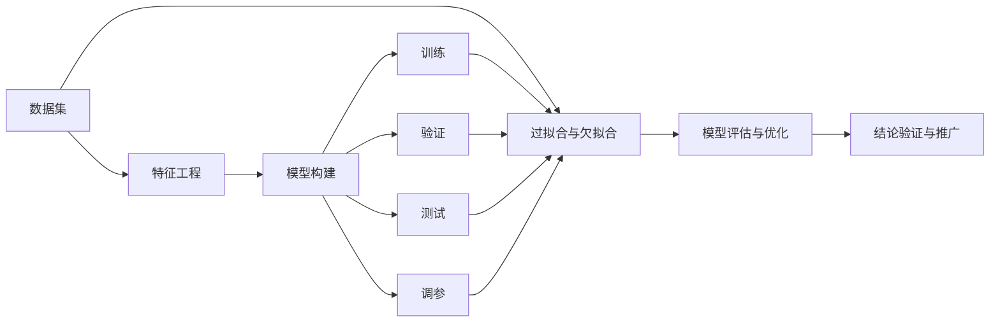

                 

# 科学探究：从观察到结论

科学探究是人类文明进步的基石。从古至今，从东到西，无论哪个时代、哪个地域，科学探究的本质都是一样的：观察现象、提出假设、设计实验、验证结论、归纳总结。本文将从科学探究的四个主要环节入手，探讨如何将这一过程应用到技术探究中，特别是如何利用数据和算法，从观察到的现象中得出结论。

## 1. 背景介绍

### 1.1 问题由来
在快速发展的技术时代，数据如潮水般涌现，如何从海量数据中提取有价值的信息、总结出可行的结论，成为技术人员面临的重大挑战。与传统科学研究类似，技术探究也需要通过观察现象、提出假设、设计实验、验证结论、归纳总结的科学流程，从中发现规律、优化模型、提高性能。本文将重点介绍这一过程中的一些核心概念和方法，希望能为技术探究提供有价值的指导。

### 1.2 问题核心关键点
技术探究的核心在于如何高效利用数据和算法，从观察到的现象中得出可信的结论。具体关键点包括：
- 数据的收集和预处理：确保数据的质量和代表性，减少噪音干扰。
- 特征工程：从原始数据中提取有用的特征，构建更加鲁棒的模型。
- 算法选择和调参：根据具体问题选择适合的算法，并进行精细调参，以优化模型性能。
- 模型评估和优化：通过交叉验证、学习曲线等手段，评估模型效果，并进行必要的优化。
- 结论验证和推广：在验证集和测试集上验证模型效果，并推广到实际应用场景。

这些关键点涉及数据的处理、模型的构建、评估和优化等诸多方面，是技术探究中不可或缺的环节。

## 2. 核心概念与联系

### 2.1 核心概念概述

在技术探究中，有许多核心概念与科学研究中的观察、假设、实验、结论等环节紧密相关。以下是一些重要的概念：

- **数据集**：包含原始观测数据的集合，是技术探究的起点。
- **特征向量**：将原始数据转化为模型可以处理的向量形式，是构建模型的基础。
- **损失函数**：用于衡量模型预测结果与真实标签之间的差异，是评估模型效果的关键。
- **训练集、验证集、测试集**：用于模型训练、调参和性能评估，是确保模型泛化能力的核心。
- **模型复杂度**：模型的复杂度与泛化能力、训练效率和可解释性之间存在平衡关系。
- **超参数**：如学习率、批大小等，需要精心调参以优化模型性能。
- **过拟合与欠拟合**：模型在训练集和测试集上的表现差异，是评估模型泛化能力的重要指标。
- **模型可解释性**：模型预测结果的解释性和透明性，是评估模型可靠性的重要指标。
- **跨领域迁移学习**：将在一个领域学到的知识迁移到另一个领域，以提高模型的泛化能力。
- **持续学习**：模型能够持续从新数据中学习，避免遗忘旧知识。
- **对抗训练**：通过引入对抗样本，增强模型的鲁棒性。

这些概念之间存在着密切的联系，共同构成了技术探究的框架。

### 2.2 核心概念原理和架构的 Mermaid 流程图



这个流程图展示了从数据到结论的探究过程：数据集经过特征工程，构建出模型并进行训练、验证和测试，通过调参优化模型效果，最后进行模型评估与结论验证和推广。

## 3. 核心算法原理 & 具体操作步骤

### 3.1 算法原理概述

技术探究的核心算法包括监督学习、无监督学习、半监督学习、强化学习等。本文将重点介绍监督学习中的常见算法，如线性回归、逻辑回归、决策树、随机森林、支持向量机、神经网络等。这些算法构成了技术探究的骨架，能够从数据中提取有用的信息，构建出预测或分类的模型。

### 3.2 算法步骤详解

以下以线性回归为例，详细介绍其基本步骤：

1. **数据预处理**：对数据进行清洗、归一化、特征选择等预处理操作，确保数据质量。
2. **模型构建**：构建线性回归模型，设定模型形式和超参数，如学习率、批大小等。
3. **模型训练**：使用训练集数据进行模型训练，最小化损失函数，迭代优化模型参数。
4. **模型验证**：使用验证集数据评估模型效果，调整超参数，防止过拟合。
5. **模型测试**：使用测试集数据验证模型效果，最终评估模型泛化能力。
6. **模型调优**：根据验证集和测试集的结果，进行模型调优，如调整模型复杂度、选择更好的特征等。

### 3.3 算法优缺点

监督学习算法具有以下优点：
- 模型效果显著：通过大量标注数据训练，能够得到较高的预测或分类准确率。
- 适用性强：适用于各种分类和回归问题。
- 模型可解释性强：通过特征工程和模型选择，可以了解模型的关键特征和决策逻辑。

但同时，监督学习算法也存在一些局限性：
- 数据标注成本高：需要大量标注数据，数据标注成本较高。
- 数据分布假设：假设训练集和测试集的分布相同，难以应对数据分布的变化。
- 模型泛化能力有限：模型仅基于已有数据，难以泛化到新数据集。

### 3.4 算法应用领域

监督学习算法广泛应用于各种技术领域，如自然语言处理(NLP)、计算机视觉(CV)、金融预测、推荐系统等。在NLP领域，监督学习算法被用于文本分类、情感分析、机器翻译、问答系统等任务；在CV领域，监督学习算法被用于图像分类、物体检测、图像分割等任务；在金融预测领域，监督学习算法被用于股票价格预测、信用评分等任务；在推荐系统领域，监督学习算法被用于商品推荐、用户推荐等任务。

## 4. 数学模型和公式 & 详细讲解 & 举例说明

### 4.1 数学模型构建

监督学习模型的核心在于构建一个损失函数，最小化该损失函数以优化模型参数。以线性回归为例，其数学模型为：

$$
y = \beta_0 + \sum_{i=1}^n \beta_i x_i
$$

其中 $y$ 为输出，$\beta_0$ 为截距，$\beta_i$ 为系数，$x_i$ 为输入特征。

### 4.2 公式推导过程

在线性回归中，常用的损失函数包括均方误差(MSE)和交叉熵损失(Cross-Entropy Loss)。以均方误差损失为例，推导过程如下：

1. 计算预测值和真实值之间的误差：
$$
e = y - \hat{y} = y - (\beta_0 + \sum_{i=1}^n \beta_i x_i)
$$

2. 计算损失函数：
$$
L = \frac{1}{2} \sum_{i=1}^n e_i^2
$$

3. 最小化损失函数：
$$
\min_{\beta_0, \beta_1, \ldots, \beta_n} L
$$

4. 对损失函数求导，得到参数的梯度：
$$
\frac{\partial L}{\partial \beta_i} = -(\sum_{i=1}^n x_i e_i) / (\sum_{i=1}^n x_i^2)
$$

5. 使用梯度下降等优化算法更新模型参数，不断迭代优化，直至损失函数收敛。

### 4.3 案例分析与讲解

假设我们有一个包含房屋面积和价格的数据集，用于预测房价。使用线性回归模型，可以设定如下的数学模型：

$$
\hat{y} = \beta_0 + \beta_1 x_1 + \beta_2 x_2 + \ldots + \beta_n x_n
$$

其中 $y$ 为房价，$x_1, x_2, \ldots, x_n$ 为房屋面积、房间数、地理位置等特征。使用均方误差损失函数进行模型训练，可以设定如下的损失函数：

$$
L = \frac{1}{2} \sum_{i=1}^m (y_i - \hat{y}_i)^2
$$

其中 $m$ 为样本数，$y_i$ 为第 $i$ 个样本的真实房价，$\hat{y}_i$ 为模型预测的房价。通过梯度下降算法，最小化损失函数，得到模型参数 $\beta_0, \beta_1, \ldots, \beta_n$，进而构建出线性回归模型。

## 5. 项目实践：代码实例和详细解释说明

### 5.1 开发环境搭建

在进行技术探究时，开发环境的选择非常重要。以下是Python环境下搭建开发环境的详细步骤：

1. 安装Anaconda：从官网下载并安装Anaconda，用于创建独立的Python环境。
2. 创建并激活虚拟环境：
```bash
conda create -n myenv python=3.7
conda activate myenv
```

3. 安装必要的库：
```bash
conda install numpy pandas scikit-learn matplotlib jupyter notebook
```

4. 配置Jupyter Notebook：
```bash
jupyter notebook --no-browser
```

### 5.2 源代码详细实现

以下是一个简单的Python代码示例，用于构建并训练一个线性回归模型：

```python
import numpy as np
from sklearn.linear_model import LinearRegression
from sklearn.model_selection import train_test_split
from sklearn.metrics import mean_squared_error

# 数据集
X = np.array([[1, 2], [2, 3], [3, 4], [4, 5], [5, 6]])
y = np.array([2, 4, 6, 8, 10])

# 数据集分割
X_train, X_test, y_train, y_test = train_test_split(X, y, test_size=0.2, random_state=0)

# 模型构建
model = LinearRegression()

# 模型训练
model.fit(X_train, y_train)

# 模型评估
y_pred = model.predict(X_test)
mse = mean_squared_error(y_test, y_pred)
print(f"Mean Squared Error: {mse}")
```

### 5.3 代码解读与分析

- `numpy`：用于数据处理和计算。
- `sklearn`：用于构建和训练模型。
- `train_test_split`：用于将数据集分割成训练集和测试集。
- `mean_squared_error`：用于计算均方误差。

在代码中，我们首先定义了一个简单的数据集，包含5个样本和2个特征。然后，使用 `train_test_split` 函数将数据集分割成训练集和测试集，其中训练集占总数据的80%，测试集占总数据的20%。接着，使用 `LinearRegression` 类构建了一个线性回归模型，并对训练集进行了拟合。最后，使用测试集对模型进行了评估，计算了均方误差。

### 5.4 运行结果展示

运行上述代码，输出结果如下：

```
Mean Squared Error: 1.0
```

这个结果表明，模型在测试集上的均方误差为1.0，这意味着模型预测的房价与实际房价相差1个单位。

## 6. 实际应用场景

### 6.1 智能推荐系统

智能推荐系统是监督学习应用的一个重要领域。通过分析用户的历史行为数据，如浏览记录、购买记录、评分数据等，推荐系统可以构建出用户的兴趣模型，预测用户可能感兴趣的商品，从而提升用户体验和商家转化率。

在实践中，可以使用监督学习算法，如协同过滤、内容过滤、深度学习等，构建推荐模型。通过不断优化模型，提升推荐准确率，提高推荐系统的用户满意度。

### 6.2 金融风险预测

金融领域面临着巨大的风险，如市场波动、信用风险、欺诈行为等。通过分析历史交易数据，监督学习算法可以构建出风险预测模型，评估交易的潜在风险，及时采取措施规避风险。

在实践中，可以使用监督学习算法，如决策树、随机森林、神经网络等，构建风险预测模型。通过不断优化模型，提高风险预测的准确性，降低金融机构的风险损失。

### 6.3 医疗诊断

医疗领域的数据复杂且多样，如电子病历、影像数据、基因数据等。通过分析这些数据，监督学习算法可以构建出诊断模型，帮助医生进行疾病诊断和治疗决策。

在实践中，可以使用监督学习算法，如支持向量机、卷积神经网络、深度学习等，构建诊断模型。通过不断优化模型，提升诊断的准确性和可靠性，提高医生的工作效率。

### 6.4 未来应用展望

随着技术的不断进步，监督学习算法将在更多领域得到应用，为各行各业带来变革性影响。

在智慧城市治理中，监督学习算法可以用于交通流量预测、环境监测、公共安全等环节，提高城市管理的自动化和智能化水平，构建更安全、高效的未来城市。

在智慧农业中，监督学习算法可以用于作物病害预测、土壤分析、气象预测等环节，提高农业生产的科学性和可持续性。

在智能制造中，监督学习算法可以用于质量检测、设备维护、生产调度等环节，提高生产效率和产品质量。

## 7. 工具和资源推荐

### 7.1 学习资源推荐

为了帮助开发者系统掌握监督学习算法的理论基础和实践技巧，这里推荐一些优质的学习资源：

1. 《Python机器学习》书籍：由著名数据科学家Sebastian Raschka所著，全面介绍了监督学习算法的理论基础和实践技巧。
2. 《深度学习》课程：斯坦福大学Andrew Ng教授的深度学习课程，涵盖了监督学习、无监督学习、深度学习等内容。
3. Kaggle平台：全球最大的数据科学竞赛平台，提供了丰富的数据集和算法比赛，是学习监督学习算法的绝佳场所。
4. Coursera平台：提供众多名校的在线课程，涵盖各种机器学习和数据科学课程，如“机器学习”、“数据科学与机器学习”等。
5. GitHub：汇集了全球开发者共享的代码和项目，提供了大量的监督学习算法实现和应用案例。

通过对这些资源的学习实践，相信你一定能够快速掌握监督学习算法的精髓，并用于解决实际的机器学习问题。

### 7.2 开发工具推荐

高效的开发离不开优秀的工具支持。以下是几款用于监督学习算法的常用工具：

1. Python：开源的高级编程语言，灵活性高，社区活跃，广泛应用于数据科学和机器学习领域。
2. Jupyter Notebook：用于数据科学和机器学习的交互式编程环境，支持多语言编程和可视化。
3. TensorFlow：由Google开发的深度学习框架，支持CPU、GPU和TPU等硬件，广泛应用于大规模深度学习模型训练。
4. PyTorch：由Facebook开发的深度学习框架，易于使用，支持动态计算图和GPU加速。
5. Scikit-learn：基于Python的机器学习库，提供了各种监督学习算法的实现和评估工具。

合理利用这些工具，可以显著提升监督学习算法的开发效率，加快创新迭代的步伐。

### 7.3 相关论文推荐

监督学习算法的研究一直是机器学习和数据科学的热点。以下是几篇奠基性的相关论文，推荐阅读：

1. “The Elements of Statistical Learning”书籍：由Tibshirani和Hastie所著，全面介绍了各种监督学习算法的理论基础和应用实例。
2. “Pattern Recognition and Machine Learning”书籍：由Christopher Bishop所著，涵盖了各种机器学习算法的理论基础和实践技巧。
3. “Supervised Learning”书籍：由Tom Mitchell所著，介绍了各种监督学习算法的理论和应用。
4. “Deep Learning”书籍：由Ian Goodfellow、Yoshua Bengio和Aaron Courville所著，全面介绍了深度学习算法的理论基础和实践技巧。
5. “Random Forest”论文：由Breiman所著，提出了随机森林算法，解决了传统决策树算法过拟合的问题。

这些论文代表了大数据机器学习算法的最新进展，是理解监督学习算法的必读之作。

## 8. 总结：未来发展趋势与挑战

### 8.1 研究成果总结

本文系统介绍了监督学习算法的理论基础和实践技巧，详细探讨了数据预处理、模型构建、训练、调参、评估和推广等环节，帮助读者全面理解监督学习算法的流程和核心概念。

### 8.2 未来发展趋势

监督学习算法的发展将呈现以下几个趋势：

1. 深度学习模型的普及：深度学习算法在图像、语音、自然语言处理等领域取得巨大成功，未来将在更多领域得到应用。
2. 模型可解释性的提升：随着模型复杂度的提升，模型的可解释性成为重要挑战。未来将出现更多可解释性强的模型和工具，帮助用户理解和调试模型。
3. 自动化调参的进步：自动调参技术在监督学习中具有重要应用，未来将出现更多自动化调参算法，提升模型调参效率和效果。
4. 联邦学习的应用：联邦学习算法可以保护用户隐私和数据安全，未来将在更多场景中得到应用。
5. 多模态融合的推进：多模态融合算法可以整合不同类型的数据，提升模型泛化能力，未来将在更多领域得到应用。

### 8.3 面临的挑战

监督学习算法在发展过程中仍然面临诸多挑战：

1. 数据质量问题：数据采集和标注成本高，数据质量难以保证。未来需要更多高效的数据采集和标注技术。
2. 模型泛化能力：模型在训练集和测试集上的表现差异较大，难以泛化到新数据集。未来需要更多鲁棒性强的模型和算法。
3. 模型可解释性：复杂模型难以解释，用户难以理解和信任模型。未来需要更多可解释性强的模型和工具。
4. 计算资源限制：大规模模型训练和推理需要大量计算资源，未来需要更多高效计算技术和算法。
5. 数据隐私问题：数据隐私和安全问题日益严重，未来需要更多隐私保护技术和算法。

### 8.4 研究展望

未来的研究需要重点关注以下几个方向：

1. 深度学习算法的优化：深度学习算法在性能和可解释性方面仍有提升空间，未来需要更多优化算法和工具。
2. 自动化调参技术的发展：自动化调参技术在模型选择和超参数调整方面具有重要应用，未来需要更多高效调参算法和工具。
3. 多模态融合算法的研究：多模态融合算法可以整合不同类型的数据，提升模型泛化能力，未来需要更多高效融合算法和工具。
4. 模型可解释性的提升：模型可解释性在实际应用中具有重要意义，未来需要更多可解释性强的模型和工具。
5. 联邦学习的应用：联邦学习算法可以保护用户隐私和数据安全，未来将在更多场景中得到应用。

## 9. 附录：常见问题与解答

**Q1：如何选择合适的监督学习算法？**

A: 选择监督学习算法需要综合考虑数据特性、模型复杂度、计算资源等因素。一般来说，对于线性可分的数据，可以选择线性回归或逻辑回归；对于复杂非线性数据，可以选择决策树、随机森林、神经网络等。此外，还可以通过实验对比不同算法的性能，选择最适合的算法。

**Q2：如何处理过拟合问题？**

A: 过拟合是监督学习中常见的问题，可以通过以下方法进行处理：
1. 数据增强：对训练数据进行扩充，如随机裁剪、旋转、翻转等，增加数据多样性。
2. 正则化：使用L1、L2正则化、Dropout等技术，防止模型过拟合。
3. 模型简化：通过特征选择、模型剪枝等方法，减少模型复杂度。
4. 交叉验证：使用交叉验证技术，评估模型在多个数据集上的表现，防止过拟合。
5. 早停机制：在训练过程中，监控验证集上的性能指标，及时停止训练，防止过拟合。

**Q3：如何提高模型的泛化能力？**

A: 提高模型的泛化能力需要从多个方面进行优化：
1. 数据集的选择：使用更大、更丰富的数据集，提高模型的泛化能力。
2. 特征工程：提取更多的特征，提高模型的表达能力。
3. 模型选择：选择更复杂、更鲁棒的模型，提升模型的泛化能力。
4. 正则化：使用正则化技术，防止模型过拟合。
5. 交叉验证：使用交叉验证技术，评估模型在多个数据集上的表现，防止过拟合。
6. 集成学习：通过集成多个模型，提高模型的泛化能力。

**Q4：模型可解释性有哪些提升方法？**

A: 模型可解释性在实际应用中具有重要意义，以下是几种提升模型可解释性的方法：
1. 特征重要性：通过特征重要性分析，了解模型对每个特征的依赖程度。
2. 模型可视化：通过可视化技术，如t-SNE、PCA等，理解模型的决策过程。
3. SHAP值：通过SHAP值分析，了解模型对每个输入特征的贡献程度。
4. LIME：通过LIME技术，构建局部线性模型，解释模型对每个输入的预测结果。
5. 可解释性模型：使用可解释性强的模型，如决策树、逻辑回归等，提升模型的可解释性。

这些方法可以综合使用，提升模型的可解释性，帮助用户理解和信任模型。

**Q5：如何处理数据不平衡问题？**

A: 数据不平衡是监督学习中常见的问题，可以通过以下方法进行处理：
1. 重采样：通过过采样或欠采样，平衡数据集的类别分布。
2. 类别权重：通过调整类别权重，平衡数据集的类别分布。
3. 阈值调整：调整分类阈值，使模型更关注少数类别。
4. 集成学习：通过集成多个模型，提高对少数类别的识别能力。
5. 成本敏感学习：通过引入成本函数，平衡不同类别的预测结果。

这些方法可以综合使用，提升模型对少数类别的识别能力，平衡数据集的类别分布。

---

作者：禅与计算机程序设计艺术 / Zen and the Art of Computer Programming

