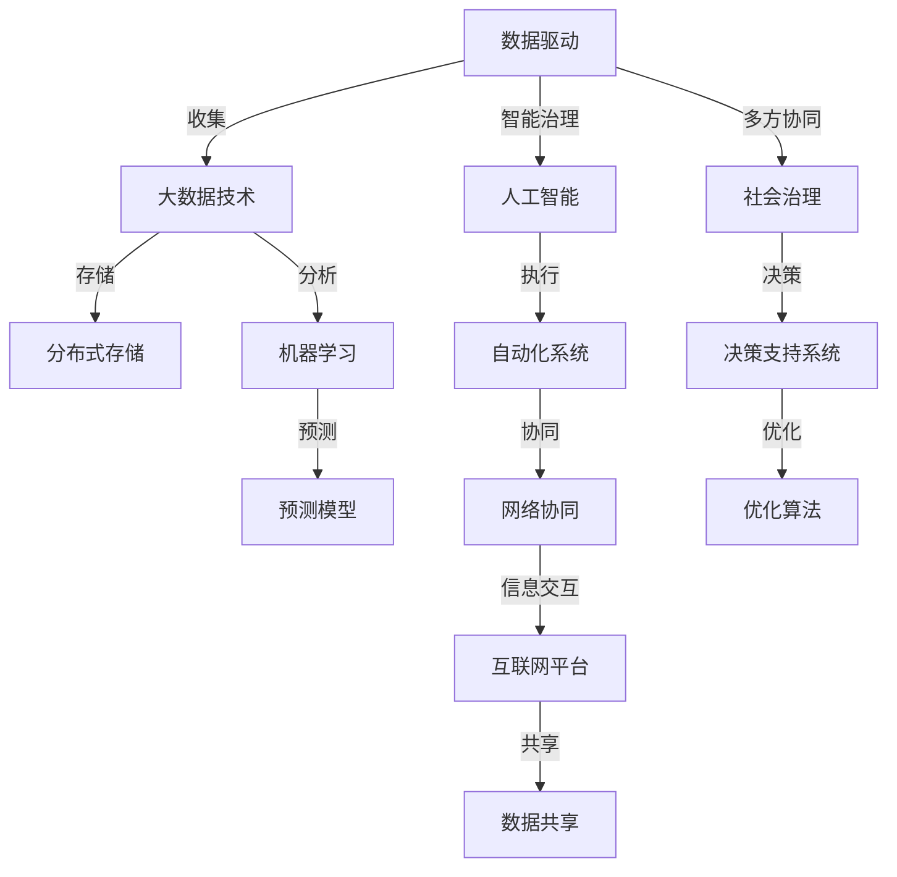

                 

# 科技创新：社会治理的新思路

在当今社会，科技创新已成为推动经济社会发展、改善民生的重要引擎。尤其在社会治理领域，科技创新不仅能够提升公共服务效率，还能为解决复杂的社会问题提供新的思路和方法。本文将深入探讨科技创新在社会治理中的应用，包括数据驱动、智能治理和网络协同等关键技术，分析其优势和挑战，展望未来的发展趋势。

## 1. 背景介绍

### 1.1 问题由来
随着信息技术的发展，数据量和处理能力的大幅提升，为社会治理带来了新的机遇。传统基于直觉和经验的社会治理方式逐渐被数据驱动和智能技术所取代。通过分析海量数据，可以揭示出社会运行中的规律和趋势，为政策制定和公共管理提供科学依据。然而，数据驱动的社会治理也面临着数据隐私、数据安全、算法偏见等问题，需要从技术和管理两方面进行全面优化。

### 1.2 问题核心关键点
科技创新在社会治理中的应用主要体现在以下几个方面：
- 数据驱动：利用大数据和机器学习技术，对社会现象进行深入分析，发现隐含规律。
- 智能治理：采用人工智能算法和模型，自动化执行公共管理任务，提升治理效率。
- 网络协同：借助互联网平台和社交媒体，实现社会主体间的信息交互和协作，促进共同治理。

这些关键技术相辅相成，共同构建了一个更加智能、高效、透明的社会治理体系。

## 2. 核心概念与联系

### 2.1 核心概念概述

社会治理（Social Governance）指的是通过政府、企业、社会组织等各方主体，运用政策、法律、技术等手段，对社会公共事务进行管理和调控，以实现社会公平、稳定和发展的过程。科技创新在社会治理中的应用，主要围绕数据驱动、智能治理和网络协同三大方向展开。

- 数据驱动（Data-Driven Governance）：利用大数据和机器学习技术，对社会现象进行深入分析，发现隐含规律，为政策制定提供依据。
- 智能治理（Intelligent Governance）：采用人工智能算法和模型，自动化执行公共管理任务，提升治理效率和精准度。
- 网络协同（Networked Collaboration）：借助互联网平台和社交媒体，实现社会主体间的信息交互和协作，促进共同治理。

这三大方向互相渗透、相互支持，共同构成了科技创新在社会治理中的核心框架。

### 2.2 核心概念原理和架构的 Mermaid 流程图



这个流程图展示了数据驱动、智能治理和网络协同在社会治理中的相互关系和实施步骤。

## 3. 核心算法原理 & 具体操作步骤

### 3.1 算法原理概述

社会治理中的科技创新主要依赖于大数据、机器学习和人工智能等技术，通过数据驱动、智能治理和网络协同等方向的应用，提升社会治理的效率和质量。

- 数据驱动：基于大规模数据分析，揭示社会运行的规律和趋势，为政策制定提供科学依据。
- 智能治理：通过人工智能算法和模型，自动化执行公共管理任务，提升治理效率和精准度。
- 网络协同：借助互联网平台和社交媒体，实现社会主体间的信息交互和协作，促进共同治理。

### 3.2 算法步骤详解

**数据驱动：**
1. 数据收集：通过传感器、互联网爬虫等手段，收集社会经济、公共服务、公共安全等方面的数据。
2. 数据存储：将收集到的数据进行分布式存储，便于高效处理。
3. 数据清洗：对数据进行去重、去噪、异常值处理等预处理操作，保证数据质量。
4. 数据挖掘：利用机器学习算法，对数据进行特征提取和模式识别，发现社会运行规律。
5. 数据可视化：将挖掘结果通过图表、仪表盘等方式展示，供政策制定者参考。

**智能治理：**
1. 任务定义：明确公共管理任务的目标和要求，如交通管理、公共健康、环境监测等。
2. 模型选择：选择合适的机器学习或深度学习模型，如分类、回归、聚类等。
3. 模型训练：使用标注数据训练模型，优化模型参数，提升预测准确率。
4. 模型评估：在测试集上评估模型性能，确保模型具有较高的泛化能力。
5. 模型应用：将训练好的模型部署到公共服务系统中，自动执行管理任务。

**网络协同：**
1. 平台建设：构建互联网平台和社交媒体，促进信息交互和共享。
2. 数据共享：制定数据共享规则，确保数据安全和隐私保护。
3. 信息交互：利用平台和工具，实现政府、企业、社会组织和公众之间的信息交流。
4. 协同决策：通过协同决策机制，整合各方观点和建议，形成科学决策。
5. 反馈机制：建立反馈和评估机制，持续优化协同治理过程。

### 3.3 算法优缺点

**数据驱动：**
- 优点：
  - 提供科学决策依据
  - 揭示隐含规律和趋势
  - 提高政策制定效率
- 缺点：
  - 数据隐私和安全问题
  - 数据质量和完整性问题
  - 数据挖掘算法的复杂性

**智能治理：**
- 优点：
  - 提升管理效率和精准度
  - 减少人工干预，降低成本
  - 动态调整和优化管理策略
- 缺点：
  - 算法偏见和模型鲁棒性问题
  - 模型训练和部署的复杂性
  - 数据驱动和模型结合的难度

**网络协同：**
- 优点：
  - 促进信息交互和协作
  - 形成共同治理机制
  - 提高治理透明度和公信力
- 缺点：
  - 数据共享和隐私保护问题
  - 信息真实性和可信度问题
  - 协同决策的复杂性和多样性

### 3.4 算法应用领域

科技创新在社会治理中的应用广泛，涵盖了公共安全、公共健康、环境保护、智慧城市等多个领域。

- 公共安全：利用大数据和人工智能技术，对犯罪、灾害等事件进行预测和防范。
- 公共健康：通过数据分析和智能监控，实现疫情监测和公共卫生管理。
- 环境保护：利用遥感技术和机器学习，对生态环境进行监测和治理。
- 智慧城市：结合物联网、大数据和人工智能，提升城市管理效率和居民生活质量。

## 4. 数学模型和公式 & 详细讲解

### 4.1 数学模型构建

科技创新在社会治理中的应用涉及多种数学模型，以下以公共安全事件预测为例，介绍相关模型的构建。

假设公共安全事件为Y，相关影响因素为X1, X2, ..., Xn。构建线性回归模型：

$$ Y = \beta_0 + \sum_{i=1}^n \beta_i X_i + \epsilon $$

其中，$\beta_0$为截距，$\beta_i$为影响因素系数，$\epsilon$为随机误差项。

### 4.2 公式推导过程

利用最小二乘法估计模型参数：

$$ \hat{\beta} = (X^T X)^{-1} X^T Y $$

其中，$\hat{\beta}$为模型参数的估计值。

在实际应用中，还需要考虑数据的质量、异常值、多变量共线性等问题，保证模型预测的准确性和鲁棒性。

### 4.3 案例分析与讲解

以交通事故预测为例，利用历史交通事故数据和相关影响因素，构建线性回归模型，预测未来交通事故的发生概率。

假设影响因素包括天气状况、道路条件、交通流量等。通过数据分析和模型训练，得到各因素对事故发生概率的影响权重，进而预测未来某个时间点的事故发生概率。

## 5. 项目实践：代码实例和详细解释说明

### 5.1 开发环境搭建

在进行科技创新项目实践时，需要搭建合适的开发环境。以下是使用Python进行PyTorch开发的环境配置流程：

1. 安装Anaconda：从官网下载并安装Anaconda，用于创建独立的Python环境。

2. 创建并激活虚拟环境：
```bash
conda create -n pytorch-env python=3.8 
conda activate pytorch-env
```

3. 安装PyTorch：根据CUDA版本，从官网获取对应的安装命令。例如：
```bash
conda install pytorch torchvision torchaudio cudatoolkit=11.1 -c pytorch -c conda-forge
```

4. 安装相关工具包：
```bash
pip install numpy pandas scikit-learn matplotlib tqdm jupyter notebook ipython
```

完成上述步骤后，即可在`pytorch-env`环境中开始科技创新项目的开发。

### 5.2 源代码详细实现

以下以公共安全事件预测为例，给出使用PyTorch进行线性回归模型开发的完整代码实现。

```python
import torch
import torch.nn as nn
import torch.optim as optim

# 定义模型
class LinearRegression(nn.Module):
    def __init__(self, input_dim):
        super(LinearRegression, self).__init__()
        self.linear = nn.Linear(input_dim, 1)

    def forward(self, x):
        return self.linear(x)

# 准备数据
def prepare_data(X, y, batch_size):
    dataset = torch.utils.data.TensorDataset(torch.tensor(X, dtype=torch.float32), torch.tensor(y, dtype=torch.float32))
    dataloader = torch.utils.data.DataLoader(dataset, batch_size=batch_size, shuffle=True)
    return dataloader

# 训练模型
def train_model(model, criterion, optimizer, dataloader, num_epochs):
    model.train()
    for epoch in range(num_epochs):
        for X, y in dataloader:
            optimizer.zero_grad()
            output = model(X)
            loss = criterion(output, y)
            loss.backward()
            optimizer.step()
    return model

# 评估模型
def evaluate_model(model, X, y):
    model.eval()
    with torch.no_grad():
        output = model(X)
        loss = criterion(output, y)
    return loss

# 加载数据
X = # 历史数据
y = # 标签数据

# 定义模型、损失函数和优化器
model = LinearRegression(input_dim=X.shape[1])
criterion = nn.MSELoss()
optimizer = optim.SGD(model.parameters(), lr=0.01)

# 准备数据和训练模型
dataloader = prepare_data(X, y, batch_size=32)
trained_model = train_model(model, criterion, optimizer, dataloader, num_epochs=100)

# 评估模型
loss = evaluate_model(trained_model, X, y)
print("模型损失：", loss.item())
```

### 5.3 代码解读与分析

让我们再详细解读一下关键代码的实现细节：

**prepare_data函数**：
- 将输入数据和标签转换为TensorDataset对象，并进行批处理。

**train_model函数**：
- 在每个epoch中，对数据集进行批处理，计算损失函数，反向传播更新模型参数，并使用优化器更新模型。

**evaluate_model函数**：
- 在测试集上评估模型性能，计算损失函数，不更新模型参数。

**代码实现**：
- 定义线性回归模型
- 准备数据集，进行批处理
- 定义损失函数和优化器
- 训练模型，并在测试集上评估性能

这个代码实现了线性回归模型的基本流程，展示了科技创新在社会治理中的应用。

## 6. 实际应用场景

### 6.1 智慧城市

智慧城市是科技创新在社会治理中的典型应用场景。通过物联网、大数据和人工智能技术，智慧城市可以实现精细化管理，提升居民生活质量。

- 交通管理：利用智能交通系统，实现实时交通流量监测和优化，减少交通拥堵。
- 公共安全：通过视频监控和数据分析，实现犯罪预测和防范，提升公共安全水平。
- 智慧医疗：利用远程监控和数据分析，实现疾病预测和健康管理，提高医疗服务质量。

### 6.2 环境保护

环境保护是科技创新在社会治理中的另一重要应用场景。利用遥感技术和机器学习，可以实现环境监测和治理，保护生态环境。

- 水质监测：利用传感器和机器学习，对水质进行实时监测，发现污染源。
- 森林火灾预测：利用遥感技术和预测模型，预测森林火灾风险，进行预防和治理。
- 垃圾分类：利用图像识别和自然语言处理技术，自动识别垃圾种类，进行分类和回收。

### 6.3 公共健康

公共健康是科技创新在社会治理中的关键领域。通过数据分析和智能监控，可以实现疫情监测和公共卫生管理，保障公众健康。

- 疫情监测：利用大数据和机器学习，对疫情数据进行实时分析，预测疫情发展趋势。
- 健康管理：通过智能穿戴设备和数据分析，实现健康状况监测和预警。
- 公共卫生：利用预测模型和智能系统，提升公共卫生管理效率，减少疾病传播。

### 6.4 未来应用展望

随着科技的不断进步，未来科技创新在社会治理中的应用将更加广泛和深入。

- 人工智能与区块链结合：利用区块链技术，保障数据安全和隐私保护，提升智能治理的可信度和透明性。
- 物联网与5G融合：通过5G网络，实现实时数据传输和分析，提升智慧城市的响应速度和效率。
- 数据科学与伦理学融合：在数据驱动的社会治理中，引入伦理学和隐私保护机制，保障数据安全和用户隐私。

## 7. 工具和资源推荐

### 7.1 学习资源推荐

为了帮助开发者系统掌握科技创新在社会治理中的应用，这里推荐一些优质的学习资源：

1. 《深度学习基础》系列博文：由深度学习专家撰写，系统介绍深度学习原理和应用，涵盖数据驱动、智能治理和网络协同等方面。

2. 《智慧城市建设与实践》课程：清华大学开设的智慧城市课程，涵盖智慧城市建设、数据管理和智能治理等内容，提供丰富的学习资源和案例。

3. 《数据科学导论》书籍：《数据科学导论》，系统介绍数据科学原理和技术，涵盖数据处理、数据分析和机器学习等方面。

4. 《机器学习实战》书籍：《机器学习实战》，通过实战项目展示机器学习应用，涵盖线性回归、决策树、支持向量机等内容。

5. 《大数据时代：机器学习、数据挖掘与人工智能》课程：斯坦福大学开设的大数据课程，涵盖大数据技术和机器学习应用，提供丰富的学习资源和案例。

通过对这些资源的学习实践，相信你一定能够快速掌握科技创新在社会治理中的应用，并用于解决实际的社会问题。

### 7.2 开发工具推荐

高效的开发离不开优秀的工具支持。以下是几款用于科技创新项目开发的常用工具：

1. PyTorch：基于Python的开源深度学习框架，灵活动态的计算图，适合快速迭代研究。

2. TensorFlow：由Google主导开发的开源深度学习框架，生产部署方便，适合大规模工程应用。

3. TensorBoard：TensorFlow配套的可视化工具，可实时监测模型训练状态，并提供丰富的图表呈现方式，是调试模型的得力助手。

4. Weights & Biases：模型训练的实验跟踪工具，可以记录和可视化模型训练过程中的各项指标，方便对比和调优。

5. HuggingFace Transformers库：开源NLP库，提供了丰富的预训练语言模型，适合进行自然语言处理相关的科技创新项目。

6. Jupyter Notebook：交互式编程环境，适合进行数据探索和模型验证，方便开发者进行快速迭代和实验。

合理利用这些工具，可以显著提升科技创新项目开发效率，加快创新迭代的步伐。

### 7.3 相关论文推荐

科技创新在社会治理中的应用源于学界的持续研究。以下是几篇奠基性的相关论文，推荐阅读：

1. "A Survey of Machine Learning Techniques for Smart Cities"：综述了机器学习在智慧城市中的应用，提供了丰富的研究资源和案例。

2. "Data Mining and Statistical Learning for Urban Sustainability"：探讨了数据挖掘和统计学习在城市可持续发展中的应用，提供了前沿的学术研究视角。

3. "Building the Internet of Things: A Survey"：综述了物联网技术的发展现状和应用前景，提供了物联网技术的系统学习资源。

4. "Blockchain-Based Data Sharing and Privacy Preserving in Smart Cities"：探讨了区块链技术在智慧城市中的应用，提供了数据共享和隐私保护的解决方案。

5. "Health Data Science: Data Mining, Statistical Learning, and Their Applications in Health Research"：探讨了健康数据科学的发展现状和应用前景，提供了健康数据科学的研究资源。

这些论文代表了大数据、机器学习和人工智能在社会治理中的应用研究脉络，通过学习这些前沿成果，可以帮助研究者把握学科前进方向，激发更多的创新灵感。

## 8. 总结：未来发展趋势与挑战

### 8.1 总结

本文对科技创新在社会治理中的应用进行了全面系统的介绍。首先阐述了数据驱动、智能治理和网络协同三大关键技术，明确了科技创新在社会治理中的核心框架。其次，从原理到实践，详细讲解了各关键技术的实现步骤和具体案例，展示了科技创新在社会治理中的广泛应用。

通过本文的系统梳理，可以看到，科技创新在社会治理中的应用正在成为推动社会进步的重要引擎。数据驱动、智能治理和网络协同等技术，为公共服务效率提升、社会问题解决提供了新思路和新方法。未来，伴随技术不断进步，科技创新必将在更多领域发挥重要作用，推动社会治理向更加智能、高效、透明的方向发展。

### 8.2 未来发展趋势

展望未来，科技创新在社会治理中的应用将呈现以下几个发展趋势：

1. 数据治理和隐私保护：随着数据量的不断增长，数据治理和隐私保护将成为社会治理的关键环节。如何有效管理和保护数据，避免数据滥用和隐私泄露，将是未来技术发展的重要方向。

2. 智能化与决策支持：利用人工智能和机器学习技术，构建智能化决策支持系统，提高公共决策的科学性和精准性。未来将涌现更多智能化的决策支持工具，帮助政府和社会组织做出更优决策。

3. 跨领域融合：科技创新将与各个领域进行深度融合，如金融科技、医疗健康、教育等，推动各领域向智能化方向发展。跨领域融合将带来更多创新应用场景和新的业务模式。

4. 自主学习和自适应治理：构建自适应和自主学习的社会治理体系，使系统能够自动学习和优化，应对不断变化的社会需求。自适应治理将成为未来社会治理的重要特征。

5. 伦理与责任机制：随着技术的发展，如何建立伦理和责任机制，确保技术应用的公平性和透明度，将是未来技术发展的重要课题。需要构建合理的伦理框架，规范技术应用行为，保障公众权益。

### 8.3 面临的挑战

尽管科技创新在社会治理中的应用前景广阔，但在迈向更加智能化、普适化应用的过程中，它仍面临着诸多挑战：

1. 数据隐私和安全问题：数据驱动的社会治理需要大量数据的支持，但如何保障数据隐私和安全，防止数据滥用，将是未来技术发展的重要挑战。

2. 技术伦理和社会公平：科技创新在带来便利的同时，也可能带来新的社会问题。如何构建伦理和社会公平机制，避免技术滥用和偏见，将是未来技术发展的重要课题。

3. 技术普及和应用门槛：尽管科技创新在社会治理中的应用前景广阔，但在实际应用中，如何降低技术应用门槛，普及科技创新，提升社会各方的技术接受度和使用能力，将是未来技术普及的重要挑战。

4. 跨领域协同和整合：科技创新在各领域的应用需要跨领域的协同和整合，但如何实现不同领域之间的信息互通和资源共享，将是未来技术发展的重要挑战。

5. 模型鲁棒性和泛化能力：利用人工智能和机器学习技术，构建社会治理模型时，如何提升模型的鲁棒性和泛化能力，防止模型过拟合和误判，将是未来技术发展的重要课题。

### 8.4 研究展望

面向未来，科技创新在社会治理中的应用还需要在以下几个方面进行深入研究：

1. 数据治理和隐私保护：构建数据治理和隐私保护机制，确保数据的安全和隐私保护，防止数据滥用和泄露。

2. 智能化与决策支持：构建智能化决策支持系统，提高公共决策的科学性和精准性。利用人工智能和机器学习技术，构建自适应和自主学习的社会治理体系。

3. 跨领域融合与协同：推动科技创新与各个领域的深度融合，构建跨领域的协同治理体系。通过跨领域协同和整合，实现不同领域之间的信息互通和资源共享。

4. 伦理与责任机制：构建伦理和社会公平机制，确保技术应用的公平性和透明度，避免技术滥用和偏见。建立合理的伦理框架，规范技术应用行为，保障公众权益。

5. 模型鲁棒性和泛化能力：提升模型的鲁棒性和泛化能力，防止模型过拟合和误判。利用多样性数据和对抗性训练，提高模型的泛化能力和鲁棒性。

通过在这些方向的深入研究，科技创新必将在社会治理中发挥更大作用，推动社会治理向更加智能、高效、透明的方向发展。只有勇于创新、敢于突破，才能不断拓展技术的应用边界，让科技创新真正造福人类社会。

## 9. 附录：常见问题与解答

**Q1：如何构建数据治理和隐私保护机制？**

A: 构建数据治理和隐私保护机制需要从数据采集、存储、处理、共享等多个环节进行全面考虑。具体措施包括：
1. 数据标准化：制定数据标准化规范，确保数据采集和存储的一致性和规范性。
2. 数据加密：对敏感数据进行加密处理，确保数据传输和存储的安全性。
3. 数据匿名化：对数据进行匿名化处理，防止数据泄露和滥用。
4. 数据访问控制：对数据访问进行严格控制，确保只有授权人员才能访问敏感数据。
5. 数据审计：对数据处理和使用进行实时审计，确保数据的合规性和安全性。

**Q2：如何构建智能化决策支持系统？**

A: 构建智能化决策支持系统需要结合大数据、机器学习和人工智能技术，实现数据的实时分析和智能决策。具体措施包括：
1. 数据集成：对各业务部门和平台的数据进行集成和整合，形成统一的数据平台。
2. 数据挖掘：利用机器学习算法，对数据进行特征提取和模式识别，发现数据中的隐含规律。
3. 智能分析：构建智能化分析工具，对数据进行实时分析和预测，生成决策建议。
4. 模型评估：对模型进行评估和优化，确保模型具有较高的泛化能力和鲁棒性。
5. 决策执行：将决策建议转化为具体的执行方案，通过自动化系统进行执行和监控。

**Q3：如何推动科技创新与各个领域的深度融合？**

A: 推动科技创新与各个领域的深度融合需要从技术、应用和组织等多个层面进行全面考虑。具体措施包括：
1. 技术创新：通过持续的技术创新，不断提升各领域的技术水平和应用能力。
2. 跨领域合作：构建跨领域的合作机制，促进不同领域之间的信息互通和资源共享。
3. 应用场景：结合各领域的实际需求，构建创新的应用场景，推动技术应用落地。
4. 组织协同：构建跨领域的协同治理体系，形成各领域的合力，提升治理效率。
5. 政策支持：制定政策支持科技创新与各领域的深度融合，推动技术应用普及。

**Q4：如何构建伦理和社会公平机制？**

A: 构建伦理和社会公平机制需要从制度、技术和社会三个层面进行全面考虑。具体措施包括：
1. 制度建设：制定伦理和社会公平相关的法律法规和政策，规范技术应用行为。
2. 技术保障：构建技术保障机制，防止技术滥用和偏见，保障技术应用的公平性和透明度。
3. 社会参与：通过公众参与和社会监督，确保技术应用的公平性和透明性。
4. 伦理教育：加强伦理教育，提高公众的伦理意识和素质，形成良好的社会氛围。
5. 第三方评估：建立第三方评估机制，对技术应用进行独立评估，确保技术应用的公平性和透明性。

通过这些措施，构建伦理和社会公平机制，确保技术应用的公平性和透明度，避免技术滥用和偏见。

**Q5：如何提升模型的鲁棒性和泛化能力？**

A: 提升模型的鲁棒性和泛化能力需要从数据、算法和应用等多个层面进行全面考虑。具体措施包括：
1. 数据多样性：使用多样化的数据进行模型训练，提升模型的泛化能力和鲁棒性。
2. 对抗性训练：利用对抗性训练技术，提升模型的鲁棒性和泛化能力。
3. 模型优化：优化模型结构和参数，提升模型的泛化能力和鲁棒性。
4. 交叉验证：通过交叉验证等技术，评估模型的泛化能力和鲁棒性。
5. 持续学习：利用持续学习技术，使模型能够不断学习新数据，提升模型的泛化能力和鲁棒性。

通过这些措施，提升模型的鲁棒性和泛化能力，防止模型过拟合和误判。

---

作者：禅与计算机程序设计艺术 / Zen and the Art of Computer Programming

