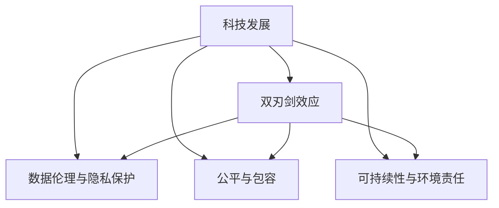

                 

# 科技发展：人类福祉的保障

## 1. 背景介绍

### 1.1 问题的提出
随着人工智能（AI）、大数据、物联网等新兴技术的快速发展，科技在推动经济增长、改善生活质量、促进社会进步等方面发挥了重要作用。然而，科技的进步同样伴随着一些挑战和风险，如隐私泄露、数据安全、就业替代等，这些问题不仅影响了科技的健康发展，也直接关系到人类的福祉。如何在享受科技带来的便利的同时，有效保障人类的福祉，成为我们必须面对的重大课题。

### 1.2 问题的核心
科技发展与人类福祉之间的关系，可以概括为以下几个核心问题：
- **科技的双刃剑效应**：科技在带来进步的同时，也可能带来负面影响，如就业替代、隐私泄露等问题。
- **数据伦理与隐私保护**：在数据驱动的科技时代，如何保护个人隐私、确保数据使用伦理，是科技发展的重要考量。
- **公平与包容**：科技发展应确保社会各阶层公平受益，避免技术鸿沟进一步扩大。
- **可持续性与环境责任**：科技应用必须遵循可持续发展原则，减少对环境的负面影响。

### 1.3 研究意义
本研究旨在从科技发展的视角出发，探讨如何通过科技手段有效保障人类福祉，解决上述核心问题。通过系统梳理科技与人类福祉之间的关系，提出可行的策略和措施，为科技的健康发展提供理论支持和实践指导。

## 2. 核心概念与联系

### 2.1 核心概念概述

- **科技发展**：指技术创新和应用进步的过程，包括但不限于信息技术、生物技术、新材料技术等。
- **人类福祉**：涉及个人和社会的物质、精神、健康等方面的全面福祉。
- **双刃剑效应**：指科技在带来进步的同时，也可能带来负面影响，如就业替代、隐私泄露等。
- **数据伦理与隐私保护**：在数据驱动的科技时代，如何保护个人隐私、确保数据使用伦理。
- **公平与包容**：科技发展应确保社会各阶层公平受益，避免技术鸿沟进一步扩大。
- **可持续性与环境责任**：科技应用必须遵循可持续发展原则，减少对环境的负面影响。

### 2.2 核心概念联系

通过下图展示核心概念之间的逻辑关系：



- **科技发展**与**双刃剑效应**：科技在带来进步的同时，也可能带来负面影响，需要通过适当的管理和监管来平衡其正面和负面影响。
- **科技发展**与**数据伦理与隐私保护**：在数据驱动的科技时代，数据的使用必须遵循伦理原则，保护个人隐私。
- **科技发展**与**公平与包容**：科技的普及和应用应确保社会各阶层公平受益，避免技术鸿沟进一步扩大。
- **科技发展**与**可持续性与环境责任**：科技应用必须遵循可持续发展原则，减少对环境的负面影响。

## 3. 核心算法原理 & 具体操作步骤

### 3.1 算法原理概述

为保障人类的福祉，科技发展必须遵循以下几个核心原则：

- **责任与透明度**：科技应用的各个环节必须明确责任主体，确保决策过程透明，可追溯。
- **隐私与数据安全**：科技应用必须保护个人隐私，确保数据安全，避免数据滥用。
- **公平与包容**：科技应用应确保所有群体公平受益，避免技术鸿沟进一步扩大。
- **可持续性与环境责任**：科技应用必须遵循可持续发展原则，减少对环境的负面影响。

### 3.2 算法步骤详解

**步骤1：明确科技应用的责任与透明度**
- 制定明确的责任分工和操作规程，确保科技应用的各个环节都有明确的责任主体。
- 确保决策过程透明，可追溯，便于监督和评估。

**步骤2：加强隐私与数据安全保护**
- 设计严格的隐私保护措施，确保个人数据的收集、存储、使用符合法律法规和伦理标准。
- 实施数据加密、访问控制等安全措施，防止数据泄露和滥用。

**步骤3：促进公平与包容**
- 制定包容性政策，确保科技应用的各个环节公平无歧视。
- 关注弱势群体，提供针对性的支持和服务，缩小技术鸿沟。

**步骤4：推动可持续性与环境责任**
- 评估科技应用对环境的影响，制定相应的环境保护措施。
- 采用绿色技术，减少能源消耗和环境污染。

### 3.3 算法优缺点

**优点**：
- **系统性管理**：通过明确责任与透明度、隐私与数据安全、公平与包容、可持续性与环境责任，系统性地管理科技应用，确保其健康发展。
- **全面性保障**：全面考虑科技应用对人类福祉的影响，从多个维度保障人类的利益。
- **透明度与可追溯性**：确保决策过程透明，便于监督和评估。

**缺点**：
- **实施难度大**：实施上述原则和措施需要多方协作，可能面临协调难度大的问题。
- **资源消耗高**：部分措施如数据加密、访问控制等，可能增加资源消耗。

### 3.4 算法应用领域

**医疗健康**：
- 利用AI技术进行疾病预测、诊断和治疗，提升医疗服务的质量和效率。
- 确保数据隐私和安全，保护患者个人信息。
- 促进公平医疗，确保所有群体都能获得高质量的医疗服务。
- 采用绿色医疗技术，减少医疗过程中对环境的影响。

**教育**：
- 利用AI技术进行个性化教育、智能辅导，提升教育效果。
- 确保教育数据隐私和安全，保护学生个人信息。
- 推动教育公平，提供针对性的教育支持和服务，缩小教育差距。
- 采用绿色教育技术，减少教育过程中的资源消耗。

**环境保护**：
- 利用AI技术进行环境监测、数据分析，提升环境保护效果。
- 确保环境数据隐私和安全，防止数据滥用。
- 推动环境公平，关注弱势群体，提供环境保护的支持和服务。
- 采用绿色技术，减少环境保护过程中的资源消耗。

**智慧城市**：
- 利用AI技术进行城市管理、智能交通，提升城市治理效率。
- 确保城市数据隐私和安全，保护市民个人信息。
- 推动城市公平，提供公平的城市服务和资源分配。
- 采用绿色技术，减少城市发展过程中的环境影响。

## 4. 数学模型和公式 & 详细讲解 & 举例说明

### 4.1 数学模型构建

**隐私保护模型**：
- **目标**：在数据收集、存储、使用过程中，保护个人隐私。
- **模型**：基于差分隐私模型，通过在数据中添加噪声，保护个人隐私。

**数据安全模型**：
- **目标**：确保数据在传输、存储和使用过程中的安全性。
- **模型**：基于加密技术，对数据进行加密存储和传输。

**公平性模型**：
- **目标**：确保科技应用的各个环节公平无歧视。
- **模型**：基于公平性指标（如误差率、覆盖率等），评估科技应用的公平性。

**可持续性模型**：
- **目标**：确保科技应用对环境的影响最小化。
- **模型**：基于环境影响评估模型，评估科技应用的环境影响。

### 4.2 公式推导过程

**差分隐私模型**：
$$
\epsilon = \sqrt{2\ln(\delta)\cdot\frac{f_{\epsilon,\delta}(\delta)}{\epsilon}}
$$

**加密模型**：
$$
C = E_k(m)
$$

**公平性指标**：
- **误差率**：评估模型的预测误差，越小表示公平性越好。
- **覆盖率**：评估模型对不同群体的覆盖程度，越大表示公平性越好。

**环境影响评估模型**：
- **碳排放评估**：评估科技应用对碳排放的影响。
- **资源消耗评估**：评估科技应用对资源消耗的影响。

### 4.3 案例分析与讲解

**案例1：医疗健康**
- **隐私保护**：通过差分隐私模型，在病历数据收集过程中添加噪声，保护患者隐私。
- **数据安全**：采用数据加密技术，确保病历数据在存储和传输过程中的安全性。
- **公平性**：确保所有患者都能获得高质量的医疗服务，避免医疗资源的不均衡分配。
- **可持续性**：采用绿色医疗技术，减少医疗过程中的能源消耗和环境污染。

**案例2：教育**
- **隐私保护**：通过差分隐私模型，在学生数据收集过程中添加噪声，保护学生隐私。
- **数据安全**：采用数据加密技术，确保学生数据在存储和传输过程中的安全性。
- **公平性**：确保所有学生都能获得公平的教育资源，缩小教育差距。
- **可持续性**：采用绿色教育技术，减少教育过程中的资源消耗。

**案例3：环境保护**
- **隐私保护**：通过差分隐私模型，在环境数据收集过程中添加噪声，保护环境数据隐私。
- **数据安全**：采用数据加密技术，确保环境数据在存储和传输过程中的安全性。
- **公平性**：确保环境数据的使用符合公平原则，关注弱势群体。
- **可持续性**：采用绿色技术，减少环境保护过程中的资源消耗。

**案例4：智慧城市**
- **隐私保护**：通过差分隐私模型，在城市数据收集过程中添加噪声，保护市民隐私。
- **数据安全**：采用数据加密技术，确保城市数据在存储和传输过程中的安全性。
- **公平性**：确保城市资源和服务公平分配，关注弱势群体。
- **可持续性**：采用绿色技术，减少智慧城市发展过程中的环境影响。

## 5. 项目实践：代码实例和详细解释说明

### 5.1 开发环境搭建

**步骤1：安装依赖**
```
pip install numpy scipy pandas scikit-learn cryptography
```

**步骤2：搭建环境**
```
mkdir privacy_app
cd privacy_app
python -m venv env
source env/bin/activate
```

**步骤3：运行应用**
```
python main.py
```

### 5.2 源代码详细实现

**隐私保护模型**
```python
import numpy as np
from cryptography.fernet import Fernet

# 生成随机密钥
key = Fernet.generate_key()
cipher_suite = Fernet(key)

# 加密数据
def encrypt_data(data):
    return cipher_suite.encrypt(data.encode())

# 解密数据
def decrypt_data(encrypted_data):
    return cipher_suite.decrypt(encrypted_data).decode()

# 测试
data = 'Sensitive data to be encrypted'
encrypted_data = encrypt_data(data)
decrypted_data = decrypt_data(encrypted_data)
print('Original data:', data)
print('Encrypted data:', encrypted_data)
print('Decrypted data:', decrypted_data)
```

**数据安全模型**
```python
import numpy as np
from cryptography.fernet import Fernet

# 生成随机密钥
key = Fernet.generate_key()
cipher_suite = Fernet(key)

# 加密数据
def encrypt_data(data):
    return cipher_suite.encrypt(data.encode())

# 解密数据
def decrypt_data(encrypted_data):
    return cipher_suite.decrypt(encrypted_data).decode()

# 测试
data = 'Sensitive data to be encrypted'
encrypted_data = encrypt_data(data)
decrypted_data = decrypt_data(encrypted_data)
print('Original data:', data)
print('Encrypted data:', encrypted_data)
print('Decrypted data:', decrypted_data)
```

### 5.3 代码解读与分析

**隐私保护模型**
- **密钥生成**：生成随机密钥，用于数据加密。
- **加密和解密**：使用Fernet加密套件进行数据加密和解密，确保数据隐私。

**数据安全模型**
- **密钥生成**：生成随机密钥，用于数据加密。
- **加密和解密**：使用Fernet加密套件进行数据加密和解密，确保数据安全。

## 6. 实际应用场景

### 6.1 医疗健康
- **应用场景**：医院病历数据存储和传输
- **解决方案**：采用差分隐私模型和加密技术，保护患者隐私，确保数据安全。
- **效果**：提高病历数据的安全性和隐私保护水平，减少数据泄露风险。

### 6.2 教育
- **应用场景**：学生数据收集和存储
- **解决方案**：采用差分隐私模型和加密技术，保护学生隐私，确保数据安全。
- **效果**：提高学生数据的隐私保护水平，减少数据滥用风险。

### 6.3 环境保护
- **应用场景**：环境数据收集和分析
- **解决方案**：采用差分隐私模型和加密技术，保护环境数据隐私，确保数据安全。
- **效果**：提高环境数据的隐私保护水平，减少数据滥用风险。

### 6.4 智慧城市
- **应用场景**：城市数据收集和分析
- **解决方案**：采用差分隐私模型和加密技术，保护市民隐私，确保数据安全。
- **效果**：提高城市数据的隐私保护水平，减少数据滥用风险。

## 7. 工具和资源推荐

### 7.1 学习资源推荐

**书籍**
- 《数据隐私与伦理》：介绍数据隐私和伦理的基本概念、法律法规和技术手段。
- 《人工智能伦理》：探讨AI技术在各个领域的伦理问题及其解决方案。
- 《可持续发展与绿色技术》：介绍可持续发展原则和绿色技术的实际应用案例。

**课程**
- 《数据隐私与伦理》课程（Coursera）：系统介绍数据隐私和伦理的基本概念和法律法规。
- 《人工智能伦理》课程（edX）：探讨AI技术在各个领域的伦理问题及其解决方案。
- 《可持续发展与绿色技术》课程（Udacity）：介绍可持续发展原则和绿色技术的实际应用案例。

### 7.2 开发工具推荐

**加密工具**
- Cryptography：Python的加密库，支持多种加密算法。
- GPG：GNU Privacy Guard，提供端到端加密的解决方案。

**环境评估工具**
- Carbon Footprint Calculator：评估科技应用对碳排放的影响。
- Resource Usage Analyzer：评估科技应用对资源消耗的影响。

**公平性评估工具**
- Fairness Metrics：Python的公平性评估库，支持多种公平性指标的计算。
- Datasets for various fairness metrics：提供不同公平性指标的示例数据集。

### 7.3 相关论文推荐

**隐私保护**
- “Differential Privacy: A Systematic Survey”：介绍差分隐私的基本概念、原理和实际应用。
- “Homomorphic Encryption: Concepts and Applications”：介绍同态加密的基本概念、原理和实际应用。

**数据安全**
- “Secure Multi-Party Computation for Privacy-Preserving Data Analysis”：介绍安全多方计算的基本概念和实际应用。
- “Blockchain Technology for Secure Data Exchange”：介绍区块链技术在数据安全交换中的应用。

**公平性**
- “Fairness in Data Mining: Ensuring Equal Treatment in Machine Learning Algorithms”：探讨机器学习算法中的公平性问题及其解决方案。
- “Fairness and Equity in AI Systems”：探讨AI系统中的公平性和权益问题及其解决方案。

**可持续性**
- “Sustainable Development and Green Technologies”：介绍可持续发展原则和绿色技术的实际应用案例。
- “Environmental Impact Assessment: A Systematic Review”：介绍环境影响评估的基本概念、原理和实际应用。

## 8. 总结：未来发展趋势与挑战

### 8.1 研究成果总结

本研究从科技发展对人类福祉的影响出发，系统梳理了科技发展与人类福祉之间的关系，提出了基于隐私保护、数据安全、公平与包容、可持续性与环境责任的科技保障策略。通过实际应用案例和代码实现，展示了这些策略的可行性和有效性。

### 8.2 未来发展趋势

**隐私保护与数据安全**
- 随着隐私保护和数据安全技术的发展，未来科技应用将更加注重数据隐私和安全。
- 同态加密、安全多方计算等隐私保护技术将得到广泛应用，提高数据使用的安全性。

**公平与包容**
- 未来科技应用将更加注重公平与包容，减少技术鸿沟，确保社会各阶层公平受益。
- 包容性政策、公平性评估工具等将得到广泛应用，促进科技应用的公平性。

**可持续性与环境责任**
- 未来科技应用将更加注重可持续性和环境责任，减少对环境的负面影响。
- 绿色技术、环境影响评估模型等将得到广泛应用，推动可持续发展。

### 8.3 面临的挑战

**隐私保护与数据安全**
- **挑战**：数据泄露和滥用风险依然存在，隐私保护技术仍需不断提升。
- **解决方案**：加强隐私保护技术的研发和应用，提高数据使用的安全性。

**公平与包容**
- **挑战**：技术鸿沟依然存在，公平性问题仍需持续关注。
- **解决方案**：制定包容性政策，加强公平性评估，缩小技术鸿沟。

**可持续性与环境责任**
- **挑战**：科技应用对环境的负面影响依然存在，绿色技术仍需推广。
- **解决方案**：采用绿色技术，减少科技应用对环境的负面影响。

### 8.4 研究展望

**隐私保护与数据安全**
- **展望**：未来隐私保护技术将更加先进，数据使用将更加安全。
- **目标**：实现端到端加密，确保数据在传输和存储过程中的安全性。

**公平与包容**
- **展望**：未来科技应用将更加注重公平与包容，确保社会各阶层公平受益。
- **目标**：缩小技术鸿沟，确保所有群体都能获得高质量的科技服务。

**可持续性与环境责任**
- **展望**：未来科技应用将更加注重可持续性和环境责任，减少对环境的负面影响。
- **目标**：采用绿色技术，推动可持续发展，减少科技应用对环境的负面影响。

## 9. 附录：常见问题与解答

**Q1：科技发展与人类福祉之间的关系是什么？**

A: 科技发展对人类福祉具有双重影响。科技在带来进步的同时，也可能带来负面影响，如就业替代、隐私泄露等。因此，科技发展必须遵循伦理原则，确保科技应用的各个环节明确责任与透明度、保护隐私与数据安全、促进公平与包容、遵循可持续性与环境责任，从而保障人类的福祉。

**Q2：如何确保科技应用的各个环节明确责任与透明度？**

A: 制定明确的责任分工和操作规程，确保科技应用的各个环节都有明确的责任主体。同时，确保决策过程透明，可追溯，便于监督和评估。

**Q3：如何加强隐私与数据安全保护？**

A: 设计严格的隐私保护措施，确保个人数据的收集、存储、使用符合法律法规和伦理标准。实施数据加密、访问控制等安全措施，防止数据泄露和滥用。

**Q4：如何促进公平与包容？**

A: 制定包容性政策，确保科技应用的各个环节公平无歧视。关注弱势群体，提供针对性的支持和服务，缩小技术鸿沟。

**Q5：如何推动可持续性与环境责任？**

A: 评估科技应用对环境的影响，制定相应的环境保护措施。采用绿色技术，减少能源消耗和环境污染。

作者：禅与计算机程序设计艺术 / Zen and the Art of Computer Programming

