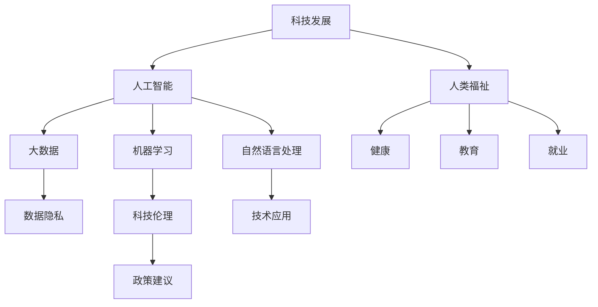

                 

# 科技发展：人类福祉的保障

> 关键词：科技发展, 人类福祉, 人工智能, 机器学习, 自然语言处理, 大数据, 数据隐私

## 1. 背景介绍

### 1.1 问题由来

当今世界，科技的发展正在以前所未有的速度重塑人类社会的方方面面。从工业自动化到医疗诊断，从金融交易到教育培训，科技正逐步渗透到人类生活的每一个角落。然而，科技的发展并非总是带来福祉，有时也伴随着风险和挑战。

### 1.2 问题核心关键点

科技与人类福祉的关系一直是科技伦理和政策研究的焦点。科技发展的正面效应包括提升生产效率、改善医疗条件、促进教育公平等。然而，科技的负面影响，如就业结构变化、数据隐私泄露、算法偏见等，也引起了广泛的关注。

### 1.3 问题研究意义

研究科技与人类福祉的关系，对于构建更加公正、公平、安全的社会具有重要意义。只有充分理解科技的双刃剑效应，才能制定出既促进科技发展又能保障人类福祉的政策和措施。

## 2. 核心概念与联系

### 2.1 核心概念概述

为更好地理解科技与人类福祉的关系，本节将介绍几个关键概念：

- 科技发展：指通过技术手段提升生产力和改善生活质量的过程，包括信息技术、生物技术、材料科学等众多领域。
- 人类福祉：指个人和群体在社会、经济、环境等方面的福祉状况，包括健康、教育、就业等。
- 人工智能(AI)：利用计算机模拟人类智能能力的科技，包括机器学习、自然语言处理、计算机视觉等技术。
- 机器学习(ML)：通过算法和统计模型，使计算机系统从数据中学习规律，提升决策和预测能力。
- 自然语言处理(NLP)：使计算机能够理解、处理和生成人类语言的技术，包括语音识别、文本分析、情感识别等。
- 大数据：通过收集、处理和分析海量数据，揭示数据背后的规律和趋势，支持决策和预测。
- 数据隐私：指个人信息的保护，包括数据收集、存储、处理和使用过程中的安全性和透明性。

这些核心概念之间的逻辑关系可以通过以下Mermaid流程图来展示：



这个流程图展示了科技发展与人类福祉的关系，并揭示了各个概念之间的联系：

1. 科技发展涵盖了广泛的领域，包括人工智能、机器学习、自然语言处理等。
2. 这些科技能够提升生产力，改善福祉，如促进健康、教育、就业等。
3. 同时，科技的发展也带来了隐私、伦理等挑战。
4. 科技伦理和政策建议，可以指导科技的发展，保障人类福祉。

## 3. 核心算法原理 & 具体操作步骤
### 3.1 算法原理概述

科技与人类福祉的关系涉及多个领域的交叉，包括科技伦理、数据隐私保护、算法公平性等。以下是这些关键概念的算法原理概述：

#### 3.1.1 科技伦理

科技伦理研究如何通过技术手段实现伦理目标。常用的算法包括：

- 可解释性算法(Explainable AI, XAI)：使AI模型易于理解，增强透明度，减少算法偏见。
- 伦理约束优化算法：在模型训练过程中，引入伦理约束条件，保证模型决策的公正性和透明性。

#### 3.1.2 数据隐私保护

数据隐私保护通过算法和法律手段，确保个人信息的安全性和保密性。常用的算法包括：

- 差分隐私(Differential Privacy)：通过向数据中添加噪声，保护个体隐私，同时保证数据的统计意义。
- 数据匿名化(Anonymization)：通过去除或修改个人信息，保护隐私。

#### 3.1.3 算法公平性

算法公平性旨在确保模型在不同群体之间的公正性，避免算法偏见。常用的算法包括：

- 公平性约束优化算法：在模型训练过程中，引入公平性约束条件，保证模型对不同群体的公正性。
- 反偏见算法(Bias Mitigation Algorithms)：通过数据增强、样本重采样等技术，减少算法偏见。

### 3.2 算法步骤详解

以下是每个概念的算法详细步骤：

#### 3.2.1 科技伦理

1. 选择适合的算法和技术，如可解释性算法、伦理约束优化算法等。
2. 收集和处理数据，确保数据的多样性和代表性。
3. 设计实验和评估指标，评估算法的性能。
4. 在实际应用中不断迭代和优化算法，提升透明度和公正性。

#### 3.2.2 数据隐私保护

1. 评估数据隐私需求，选择合适的隐私保护算法，如差分隐私、数据匿名化等。
2. 设计数据收集和使用流程，确保数据处理的透明度和可控性。
3. 在隐私预算的约束下，合理处理数据，保护个体隐私。

#### 3.2.3 算法公平性

1. 评估模型偏见，确定公平性约束条件。
2. 选择合适的算法和技术，如公平性约束优化算法、反偏见算法等。
3. 设计实验和评估指标，评估算法的性能。
4. 在实际应用中不断迭代和优化算法，提升模型公正性。

### 3.3 算法优缺点

科技伦理、数据隐私保护和算法公平性算法各有优缺点：

#### 3.3.1 科技伦理

**优点**：

- 增强算法透明度，减少偏见，提高公众信任。
- 促进公正决策，提升社会公平。

**缺点**：

- 算法复杂度较高，实现成本较高。
- 可能增加数据处理和计算成本。

#### 3.3.2 数据隐私保护

**优点**：

- 保护个体隐私，减少数据泄露风险。
- 增强数据使用的合法性和透明性。

**缺点**：

- 数据处理和存储成本较高。
- 隐私保护技术复杂，可能影响数据精度。

#### 3.3.3 算法公平性

**优点**：

- 减少算法偏见，提升模型公正性。
- 促进社会公平，提升模型可信度。

**缺点**：

- 算法复杂度较高，实现成本较高。
- 可能增加数据处理和计算成本。

### 3.4 算法应用领域

科技伦理、数据隐私保护和算法公平性算法广泛应用于各个领域：

#### 3.4.1 医疗领域

- 可解释性算法：提升医疗诊断的透明性和可信度。
- 差分隐私：保护患者隐私，确保医疗数据的安全性。
- 公平性约束优化算法：提升医疗服务在不同群体之间的公正性。

#### 3.4.2 金融领域

- 可解释性算法：提高金融决策的透明度和可信度。
- 差分隐私：保护用户隐私，确保金融数据的安全性。
- 反偏见算法：提升金融服务在不同群体之间的公正性。

#### 3.4.3 教育领域

- 可解释性算法：提升教育评估的透明性和可信度。
- 数据匿名化：保护学生隐私，确保教育数据的安全性。
- 公平性约束优化算法：提升教育资源在不同群体之间的公正性。

## 4. 数学模型和公式 & 详细讲解 & 举例说明

### 4.1 数学模型构建

#### 4.1.1 科技伦理

科技伦理的数学模型构建涉及可解释性算法和伦理约束优化算法。

**可解释性算法**：

$$
\min_{\theta} \mathcal{L}(y, f_\theta(x)) + \lambda \mathcal{C}(f_\theta(x))
$$

其中，$y$ 为真实标签，$f_\theta(x)$ 为模型预测输出，$\mathcal{L}$ 为损失函数，$\mathcal{C}$ 为可解释性约束函数，$\lambda$ 为正则化系数。

**伦理约束优化算法**：

$$
\min_{\theta} \mathcal{L}(y, f_\theta(x)) + \alpha \mathcal{C}(\theta)
$$

其中，$\alpha$ 为伦理约束系数，$\mathcal{C}$ 为伦理约束函数。

#### 4.1.2 数据隐私保护

数据隐私保护的数学模型构建涉及差分隐私和数据匿名化。

**差分隐私**：

$$
\mathcal{L}(y, f_\theta(x), \epsilon) = \frac{1}{N} \sum_{i=1}^N \ell(y_i, f_\theta(x_i)) + \frac{\epsilon}{2} \ln \frac{N}{\delta}
$$

其中，$y$ 为真实标签，$f_\theta(x)$ 为模型预测输出，$\epsilon$ 为隐私预算，$\delta$ 为隐私误差。

**数据匿名化**：

$$
\mathcal{L}(y, f_\theta(x), A) = \frac{1}{N} \sum_{i=1}^N \ell(y_i, f_\theta(x_i)) + \lambda \mathcal{C}(A)
$$

其中，$A$ 为匿名化策略，$\mathcal{C}$ 为匿名化约束函数，$\lambda$ 为正则化系数。

#### 4.1.3 算法公平性

算法公平性的数学模型构建涉及公平性约束优化算法和反偏见算法。

**公平性约束优化算法**：

$$
\min_{\theta} \mathcal{L}(y, f_\theta(x)) + \alpha \mathcal{C}(f_\theta(x))
$$

其中，$\alpha$ 为公平性约束系数，$\mathcal{C}$ 为公平性约束函数。

**反偏见算法**：

$$
\min_{\theta} \mathcal{L}(y, f_\theta(x)) + \lambda \mathcal{C}(f_\theta(x))
$$

其中，$\lambda$ 为反偏见系数，$\mathcal{C}$ 为反偏见函数。

### 4.2 公式推导过程

以下是每个概念的公式推导过程：

#### 4.2.1 可解释性算法

$$
\begin{aligned}
\min_{\theta} \mathcal{L}(y, f_\theta(x)) + \lambda \mathcal{C}(f_\theta(x)) &= \min_{\theta} \frac{1}{N} \sum_{i=1}^N \ell(y_i, f_\theta(x_i)) + \lambda \mathcal{C}(f_\theta(x)) \\
&= \min_{\theta} \frac{1}{N} \sum_{i=1}^N (\ell(y_i, f_\theta(x_i)) + \lambda \mathcal{C}(f_\theta(x)))
\end{aligned}
$$

**解释**：损失函数$\mathcal{L}$和约束函数$\mathcal{C}$通过正则化系数$\lambda$加权，最小化损失函数的同时，增强模型的可解释性。

#### 4.2.2 差分隐私

$$
\mathcal{L}(y, f_\theta(x), \epsilon) = \frac{1}{N} \sum_{i=1}^N \ell(y_i, f_\theta(x_i)) + \frac{\epsilon}{2} \ln \frac{N}{\delta}
$$

**解释**：在损失函数$\mathcal{L}$的基础上，加入隐私预算$\epsilon$和隐私误差$\delta$的约束条件，确保数据隐私保护。

#### 4.2.3 公平性约束优化算法

$$
\min_{\theta} \mathcal{L}(y, f_\theta(x)) + \alpha \mathcal{C}(f_\theta(x))
$$

**解释**：损失函数$\mathcal{L}$和公平性约束函数$\mathcal{C}$通过公平性约束系数$\alpha$加权，最小化损失函数的同时，确保模型的公平性。

### 4.3 案例分析与讲解

#### 4.3.1 可解释性算法

假设某银行使用机器学习模型进行贷款审批，为了提升模型的透明性和可信度，可以使用可解释性算法。具体步骤如下：

1. 收集和处理贷款数据，包括借款人信息、信用记录等。
2. 选择合适的可解释性算法，如LIME、SHAP等。
3. 设计实验和评估指标，如模型精度、可解释度等。
4. 在实际应用中不断迭代和优化算法，提升模型的透明性和可信度。

#### 4.3.2 差分隐私

假设某电商平台使用机器学习模型进行个性化推荐，为了保护用户隐私，可以使用差分隐私算法。具体步骤如下：

1. 收集和处理用户行为数据，包括浏览记录、购买历史等。
2. 选择合适的差分隐私算法，如Laplace机制、Gaussian机制等。
3. 设计数据收集和使用流程，确保数据处理的透明度和可控性。
4. 在隐私预算的约束下，合理处理数据，保护用户隐私。

#### 4.3.3 公平性约束优化算法

假设某招聘网站使用机器学习模型进行职位推荐，为了提升模型的公正性，可以使用公平性约束优化算法。具体步骤如下：

1. 收集和处理职位申请数据，包括申请人的教育背景、工作经验等。
2. 选择合适的公平性约束算法，如Odds Constraint、Equalized Odds等。
3. 设计实验和评估指标，如模型精度、公平性指标等。
4. 在实际应用中不断迭代和优化算法，提升模型的公正性。

## 5. 项目实践：代码实例和详细解释说明

### 5.1 开发环境搭建

在进行科技伦理、数据隐私保护和算法公平性实践前，我们需要准备好开发环境。以下是使用Python进行TensorFlow开发的环境配置流程：

1. 安装Anaconda：从官网下载并安装Anaconda，用于创建独立的Python环境。

2. 创建并激活虚拟环境：
```bash
conda create -n tf-env python=3.8 
conda activate tf-env
```

3. 安装TensorFlow：根据CUDA版本，从官网获取对应的安装命令。例如：
```bash
conda install tensorflow tensorflow-gpu cudatoolkit=11.1 -c pytorch -c conda-forge
```

4. 安装Scikit-Learn：
```bash
pip install scikit-learn
```

5. 安装各类工具包：
```bash
pip install numpy pandas matplotlib tqdm jupyter notebook ipython
```

完成上述步骤后，即可在`tf-env`环境中开始实践。

### 5.2 源代码详细实现

这里我们以数据隐私保护中的差分隐私为例，给出使用TensorFlow实现差分隐私保护的PyTorch代码实现。

```python
import tensorflow as tf
from tensorflow.keras import layers
import numpy as np

# 定义数据生成函数
def generate_data(n_samples, noise):
    data = np.random.randn(n_samples, 1)
    noise = np.random.normal(0, noise, (n_samples, 1))
    return data + noise

# 定义差分隐私保护函数
def differential_privacy(data, epsilon):
    noise = tf.random.normal(shape=(data.shape[0], 1), stddev=epsilon/np.sqrt(data.shape[0]))
    return data + noise

# 定义模型
model = tf.keras.Sequential([
    layers.Dense(units=1, activation='sigmoid')
])

# 加载数据
x_train = generate_data(100, 1)
y_train = np.random.randint(2, size=100)

# 应用差分隐私保护
x_train_privacy = differential_privacy(x_train, epsilon=1)

# 训练模型
model.compile(optimizer='adam', loss='binary_crossentropy')
model.fit(x_train_privacy, y_train, epochs=10)

# 评估模型
loss = model.evaluate(x_train, y_train)
print('模型损失:', loss)
```

以上就是使用TensorFlow实现差分隐私保护的完整代码实现。可以看到，通过简单的几行代码，就可以实现差分隐私保护。

### 5.3 代码解读与分析

让我们再详细解读一下关键代码的实现细节：

**数据生成函数**：
- 定义了一个数据生成函数，用于生成100个样本的数据。

**差分隐私保护函数**：
- 定义了一个差分隐私保护函数，在数据上添加噪声，实现隐私保护。
- 噪声的标准差为$\epsilon/\sqrt{n}$，其中$\epsilon$为隐私预算，$n$为样本数。

**模型定义**：
- 定义了一个简单的神经网络模型，包括一个全连接层和一个sigmoid激活函数。

**加载数据和训练**：
- 加载生成的数据，并应用差分隐私保护。
- 训练模型，优化器使用Adam，损失函数使用二元交叉熵。
- 在训练过程中，模型会不断调整权重和偏置，最小化损失函数。

**模型评估**：
- 使用测试集评估模型的性能，输出模型的损失。

可以看到，差分隐私保护通过添加噪声，实现隐私保护。在实际应用中，还可以结合数据匿名化等技术，进一步增强数据隐私保护。

## 6. 实际应用场景

### 6.1 医疗领域

科技伦理、数据隐私保护和算法公平性算法在医疗领域有广泛应用。例如：

- 可解释性算法：提升医疗诊断的透明性和可信度。
- 差分隐私：保护患者隐私，确保医疗数据的安全性。
- 公平性约束优化算法：提升医疗服务在不同群体之间的公正性。

### 6.2 金融领域

科技伦理、数据隐私保护和算法公平性算法在金融领域有广泛应用。例如：

- 可解释性算法：提高金融决策的透明度和可信度。
- 差分隐私：保护用户隐私，确保金融数据的安全性。
- 反偏见算法：提升金融服务在不同群体之间的公正性。

### 6.3 教育领域

科技伦理、数据隐私保护和算法公平性算法在教育领域有广泛应用。例如：

- 可解释性算法：提升教育评估的透明性和可信度。
- 数据匿名化：保护学生隐私，确保教育数据的安全性。
- 公平性约束优化算法：提升教育资源在不同群体之间的公正性。

## 7. 工具和资源推荐
### 7.1 学习资源推荐

为了帮助开发者系统掌握科技伦理、数据隐私保护和算法公平性的理论基础和实践技巧，这里推荐一些优质的学习资源：

1. 《机器学习：原理、算法和应用》：这本书系统介绍了机器学习的基本原理和算法，适合初学者入门。

2. 《人工智能伦理导论》：这本书介绍了人工智能伦理的基本概念和伦理原则，适合对人工智能伦理感兴趣的读者。

3. 《数据科学导论》：这本书系统介绍了数据科学的基本概念和方法，适合数据分析和建模的开发者。

4. 《隐私保护技术》：这本书详细介绍了数据隐私保护的技术手段，适合对数据隐私保护感兴趣的开发者。

5. 《公平机器学习》：这本书介绍了公平机器学习的基本概念和算法，适合对公平机器学习感兴趣的开发者。

通过对这些资源的学习实践，相信你一定能够快速掌握科技伦理、数据隐私保护和算法公平性的精髓，并用于解决实际的科技问题。

### 7.2 开发工具推荐

高效的开发离不开优秀的工具支持。以下是几款用于科技伦理、数据隐私保护和算法公平性开发的常用工具：

1. TensorFlow：基于Python的开源深度学习框架，灵活动态的计算图，适合快速迭代研究。

2. PyTorch：基于Python的开源深度学习框架，适合研究人员进行模型创新和优化。

3. Scikit-Learn：Python的机器学习库，提供了丰富的算法和工具，适合开发者进行模型构建和评估。

4. OpenAI's GPT：自然语言处理领域的领先模型，适合进行语言理解和生成任务。

5. Google Cloud AI Platform：云端的AI平台，提供丰富的计算资源和工具，适合进行大规模模型训练和部署。

6. AWS SageMaker：亚马逊的AI平台，提供丰富的计算资源和工具，适合进行大规模模型训练和部署。

合理利用这些工具，可以显著提升科技伦理、数据隐私保护和算法公平性开发的效率，加快创新迭代的步伐。

### 7.3 相关论文推荐

科技伦理、数据隐私保护和算法公平性发展源于学界的持续研究。以下是几篇奠基性的相关论文，推荐阅读：

1. "Towards Explainable AI: A Guide for Making Black Box Models Explainable"：这篇文章系统介绍了可解释性算法的原理和应用。

2. "Differential Privacy"：这篇文章介绍了差分隐私的基本概念和算法，适合对差分隐私感兴趣的读者。

3. "Fairness, Accountability, and Transparency: Toward a Fair and Transparent AI and Machine Learning"：这篇文章介绍了公平机器学习的基本概念和算法，适合对公平机器学习感兴趣的读者。

这些论文代表了大语言模型微调技术的发展脉络。通过学习这些前沿成果，可以帮助研究者把握学科前进方向，激发更多的创新灵感。

## 8. 总结：未来发展趋势与挑战

### 8.1 研究成果总结

本文对科技伦理、数据隐私保护和算法公平性进行了全面系统的介绍。首先阐述了科技与人类福祉的关系，明确了科技伦理、数据隐私保护和算法公平性的研究意义。其次，从原理到实践，详细讲解了这些关键概念的算法原理和操作步骤，给出了代码实例。同时，本文还广泛探讨了这些技术在医疗、金融、教育等多个行业领域的应用前景，展示了科技伦理、数据隐私保护和算法公平性的广阔前景。最后，本文精选了相关学习资源、开发工具和经典论文，力求为读者提供全方位的技术指引。

### 8.2 未来发展趋势

展望未来，科技伦理、数据隐私保护和算法公平性技术将呈现以下几个发展趋势：

1. 科技伦理：随着技术的普及和应用，科技伦理研究将进一步深化，形成更加系统化和规范化的框架。

2. 数据隐私保护：数据隐私保护技术将更加成熟和广泛应用，特别是在互联网和物联网领域。

3. 算法公平性：算法公平性研究将进一步深入，形成更加普适和透明的标准和规范。

4. 多领域应用：科技伦理、数据隐私保护和算法公平性将在更多领域得到应用，为社会福祉提供更多保障。

5. 跨学科研究：科技伦理、数据隐私保护和算法公平性研究将更多地与法律、心理学等学科相结合，形成更加全面和系统化的理论体系。

### 8.3 面临的挑战

尽管科技伦理、数据隐私保护和算法公平性技术已经取得了显著进展，但在迈向更加智能化、普适化应用的过程中，它们仍面临着诸多挑战：

1. 技术复杂度：科技伦理、数据隐私保护和算法公平性技术复杂度高，实现成本高。

2. 数据多样性：不同领域和场景下，数据的特点和需求差异大，需要个性化的解决方案。

3. 伦理困境：在科技应用中，可能会出现伦理困境，如隐私保护与数据公开的平衡。

4. 法律法规：科技伦理、数据隐私保护和算法公平性涉及法律法规，需要与法律规范相协调。

5. 数据安全：在数据处理和存储过程中，需要保证数据安全，防止数据泄露和滥用。

### 8.4 研究展望

面对科技伦理、数据隐私保护和算法公平性面临的挑战，未来的研究需要在以下几个方面寻求新的突破：

1. 简化技术实现：开发更加简单、高效的算法和技术，降低实现成本，提高应用普及率。

2. 数据共享与保护：在保证数据隐私和安全的前提下，实现数据共享和开放，促进科技的普适性。

3. 跨领域应用：科技伦理、数据隐私保护和算法公平性技术将更多地应用于不同领域，形成更加全面和系统的理论体系。

4. 法律法规完善：制定和完善科技伦理、数据隐私保护和算法公平性相关的法律法规，形成规范化的行业标准。

5. 技术与伦理协同：科技伦理、数据隐私保护和算法公平性研究将更多地与伦理学、法律学等学科相结合，形成更加全面和系统化的理论体系。

这些研究方向的探索，必将引领科技伦理、数据隐私保护和算法公平性技术迈向更高的台阶，为构建安全、可靠、可解释、可控的智能系统铺平道路。面向未来，科技伦理、数据隐私保护和算法公平性技术还需要与其他人工智能技术进行更深入的融合，如知识表示、因果推理、强化学习等，多路径协同发力，共同推动自然语言理解和智能交互系统的进步。只有勇于创新、敢于突破，才能不断拓展语言模型的边界，让智能技术更好地造福人类社会。

## 9. 附录：常见问题与解答

**Q1：科技伦理、数据隐私保护和算法公平性是否适用于所有领域？**

A: 科技伦理、数据隐私保护和算法公平性技术适用于大多数领域，特别是对隐私和公正性要求较高的领域。但对于一些特定领域，如军事、法律等，这些技术的应用需要谨慎处理，避免造成安全隐患。

**Q2：在实现差分隐私时，如何确定隐私预算$\epsilon$？**

A: 隐私预算$\epsilon$需要根据具体应用场景和数据敏感性确定。一般来说，隐私预算越小，数据泄露的风险越小，但模型性能可能受到影响。因此需要在隐私保护和模型性能之间找到平衡点。

**Q3：如何评估公平性约束优化算法的性能？**

A: 公平性约束优化算法的性能评估通常包括：

1. 模型精度：评估模型的预测精度和准确度。
2. 公平性指标：评估模型在不同群体之间的公平性，如准确率、召回率等。
3. 模型可解释性：评估模型的可解释性和透明度。

这些评估指标可以帮助我们更好地理解和优化公平性约束优化算法。

**Q4：在应用差分隐私时，如何保护数据隐私？**

A: 应用差分隐私时，主要通过在数据上添加噪声来实现隐私保护。具体步骤包括：

1. 评估数据敏感性，确定噪声强度。
2. 在数据上添加噪声，实现隐私保护。
3. 在模型训练过程中，使用隐私保护后的数据进行训练。

这些步骤可以有效地保护数据隐私，同时保证模型的精度和性能。

**Q5：在应用可解释性算法时，如何增强模型的透明性和可信度？**

A: 应用可解释性算法时，主要通过生成模型预测的解释来增强透明性和可信度。具体步骤包括：

1. 选择合适的可解释性算法，如LIME、SHAP等。
2. 生成模型预测的解释，如局部可解释性、全局可解释性等。
3. 在模型应用过程中，展示模型的解释，增强透明性和可信度。

这些步骤可以帮助我们更好地理解和信任模型的决策过程，从而增强模型的透明性和可信度。

---

作者：禅与计算机程序设计艺术 / Zen and the Art of Computer Programming

