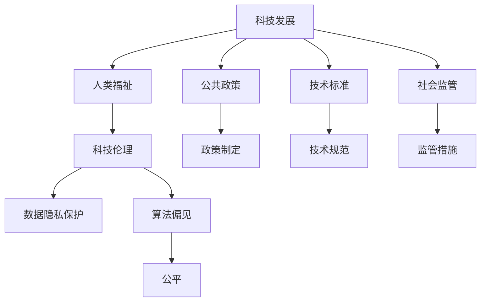

                 

## 1. 背景介绍

### 1.1 问题的由来

在当今信息爆炸的互联网时代，科技的发展极大地推动了社会的进步，为人类带来了前所未有的福祉。然而，科技的快速发展也带来了新的挑战，包括数据隐私泄露、算法偏见、自动化就业等问题，给社会稳定和人类福祉带来了潜在的风险。如何在享受科技带来的便利的同时，避免其潜在的负面影响，成为一个亟待解决的问题。

### 1.2 问题的核心关键点

科技发展的福祉保障问题涉及多个关键点：

- **数据隐私**：互联网时代的数据隐私问题日益突出，如何保护用户隐私成为科技公司面临的首要问题。
- **算法偏见**：机器学习算法可能学习到社会偏见，导致决策过程中存在歧视性，需要避免或减少这种偏见的影响。
- **自动化就业**：自动化技术的发展可能导致大规模失业，需要采取措施减缓这一影响。
- **伦理问题**：科技应用可能涉及伦理道德问题，如医疗AI的决策、自动化武器的使用等，需要构建相应的伦理框架。
- **公共安全**：新兴科技可能威胁公共安全，如网络攻击、人工智能滥用等，需要相应的监管和防范措施。

### 1.3 问题研究意义

研究科技发展与人类福祉的保障，对于推动科技健康发展，构建和谐社会具有重要意义：

- **提升社会福祉**：通过科学合理的政策和技术手段，确保科技发展惠及全体人民，提升生活质量。
- **促进公平正义**：确保科技应用的公平性和透明性，避免社会不公和伦理冲突。
- **增强社会稳定性**：通过建立健全科技伦理和社会监管体系，维护社会稳定和谐。
- **促进可持续发展**：推动科技与环境、经济、社会的协调发展，实现可持续发展目标。

## 2. 核心概念与联系

### 2.1 核心概念概述

为更好地理解科技发展与人类福祉保障的关系，本节将介绍几个密切相关的核心概念：

- **科技发展**：指利用科学技术推动经济社会进步的过程。包括人工智能、大数据、物联网等前沿技术的发展。
- **人类福祉**：指个体和社会在物质、精神、环境等方面的福祉水平。
- **科技伦理**：涉及科技发展中的伦理道德问题，包括隐私、公平、安全等方面。
- **公共政策**：政府制定的一系列政策，用于规范科技发展，保障社会福祉。
- **技术标准**：制定技术规范和标准，确保科技应用的安全性和可靠性。
- **社会监管**：建立相应的监管体系，对科技应用进行监督和管理。

这些核心概念之间存在紧密的联系，共同构成了一个相互作用的系统。科技发展的目标是通过技术创新提升人类福祉，而人类福祉的保障又依赖于科技伦理和公共政策的支持，技术标准的制定和执行，以及社会监管的有效实施。

### 2.2 核心概念原理和架构的 Mermaid 流程图



## 3. 核心算法原理 & 具体操作步骤

### 3.1 算法原理概述

科技发展与人类福祉保障的核心算法包括数据隐私保护算法、公平算法、自动化就业缓解算法、科技伦理框架构建算法等。这些算法需要结合具体场景，采取不同的技术手段，以实现最优的保障效果。

### 3.2 算法步骤详解

以数据隐私保护算法为例，详细说明其操作步骤：

1. **数据收集与匿名化**：收集用户数据，并使用匿名化技术，如脱敏、扰动、差分隐私等，保护用户隐私。
2. **访问控制与权限管理**：设置数据访问权限，控制谁可以访问和使用数据。
3. **安全存储与传输**：使用加密技术，保护数据在存储和传输过程中的安全性。
4. **监控与审计**：建立数据访问监控和审计机制，记录和追踪数据使用情况，及时发现并纠正违规行为。

### 3.3 算法优缺点

数据隐私保护算法的优点包括：

- 保护用户隐私，减少隐私泄露的风险。
- 增强用户信任，提升平台价值。
- 符合法律法规要求，避免法律风险。

缺点包括：

- 技术复杂，实施成本较高。
- 数据使用效率可能受到影响。
- 存在被攻击的风险，如破解加密算法。

### 3.4 算法应用领域

数据隐私保护算法在多个领域得到广泛应用，包括：

- 互联网和社交平台：保护用户隐私，防止数据泄露和滥用。
- 医疗和健康领域：保护患者隐私，确保医疗数据的安全。
- 金融行业：保护用户金融信息，防范金融风险。
- 政府和企业：保护公共数据，防止数据滥用和泄露。

## 4. 数学模型和公式 & 详细讲解 & 举例说明

### 4.1 数学模型构建

以数据隐私保护中的差分隐私为例，构建数学模型：

设 $D$ 为数据集，每个样本 $x_i$ 属于 $X$ 的分布 $P(X)$，差分隐私模型使用 $\epsilon$ 差分隐私机制，保证数据处理后的分布 $P(X')$ 与 $P(X)$ 之间的差异不超过 $\epsilon$。具体数学模型为：

$$
\begin{aligned}
& P(X') = \frac{1}{Z} \exp \left( \sum_{x \in X} w_x \log \frac{P(x)}{P(x')} \right) \\
& Z = \sum_{x \in X} \exp \left( \sum_{x \in X} w_x \log \frac{P(x)}{P(x')} \right)
\end{aligned}
$$

其中 $w_x$ 为样本权重，$P(x')$ 为处理后数据的概率分布，$Z$ 为归一化因子。

### 4.2 公式推导过程

差分隐私的数学模型推导基于信息论和概率论，具体推导过程如下：

1. **概率定义**：设 $P(X)$ 为原始数据的概率分布，$P(X')$ 为处理后数据的概率分布，$P(X|Y)$ 为在隐私预算 $\epsilon$ 下的概率分布。
2. **隐私预算**：隐私预算 $\epsilon$ 决定了隐私保护的程度，$\epsilon$ 越小，隐私保护越强。
3. **噪声加入**：通过加入噪声 $N$ 来实现差分隐私，使得处理后的数据 $X'$ 与原始数据 $X$ 的差异最大化。
4. **归一化**：使用归一化因子 $Z$ 对加入噪声后的数据进行归一化，确保概率分布满足归一化条件。

### 4.3 案例分析与讲解

以医疗数据为例，分析差分隐私模型的应用：

1. **数据收集**：医院收集患者的健康数据，包括病历、诊断结果等。
2. **数据处理**：医院对数据进行匿名化处理，如将患者姓名、地址等信息脱敏，保护患者隐私。
3. **隐私保护**：使用差分隐私算法，对处理后的数据进行分析，如病情趋势分析、药物效果评估等，同时确保数据的隐私性。
4. **结果发布**：在保护患者隐私的前提下，发布分析结果，供医疗机构参考。

## 5. 项目实践：代码实例和详细解释说明

### 5.1 开发环境搭建

在进行项目实践前，需要准备好开发环境。以下是使用Python进行PyTorch开发的环境配置流程：

1. 安装Anaconda：从官网下载并安装Anaconda，用于创建独立的Python环境。

2. 创建并激活虚拟环境：
```bash
conda create -n pytorch-env python=3.8 
conda activate pytorch-env
```

3. 安装PyTorch：根据CUDA版本，从官网获取对应的安装命令。例如：
```bash
conda install pytorch torchvision torchaudio cudatoolkit=11.1 -c pytorch -c conda-forge
```

4. 安装Transformers库：
```bash
pip install transformers
```

5. 安装各类工具包：
```bash
pip install numpy pandas scikit-learn matplotlib tqdm jupyter notebook ipython
```

完成上述步骤后，即可在`pytorch-env`环境中开始项目实践。

### 5.2 源代码详细实现

以下是一个差分隐私算法在医疗数据分析中的实现示例：

```python
import torch
from torch.utils.data import Dataset, DataLoader
from torch.nn import Module, Parameter
from torch.nn.utils import clip_grad_norm_
import torchvision.transforms as transforms
from sklearn.metrics import roc_auc_score, roc_curve, auc

class DPDataLoader:
    def __init__(self, dataset, batch_size, noise_std=0.001, noise_fn=None):
        self.dataset = dataset
        self.batch_size = batch_size
        self.noise_std = noise_std
        self.noise_fn = noise_fn or lambda x: x * torch.randn_like(x)
        
    def __iter__(self):
        while True:
            batch = self.dataset[slice(None, None, None), :]
            batch = self.noise_fn(batch)
            yield batch
    
    def __len__(self):
        return len(self.dataset)

class DPModule(Module):
    def __init__(self, model, noise_std):
        super().__init__()
        self.model = model
        self.noise_std = noise_std
    
    def forward(self, x):
        x = self.model(x)
        noise = torch.randn_like(x) * self.noise_std
        return (x + noise).clamp(min=-1, max=1)

class DPDataset(Dataset):
    def __init__(self, dataset, noise_std):
        self.dataset = dataset
        self.noise_std = noise_std
        
    def __getitem__(self, index):
        x, y = self.dataset[index]
        x = torch.tensor(x, dtype=torch.float32)
        y = torch.tensor(y, dtype=torch.float32)
        return DPModule(DPModule(self.dataset.model), self.noise_std)(x), y

class DPRNN:
    def __init__(self, input_size, hidden_size, output_size):
        self.model = torch.nn.Sequential(
            torch.nn.LSTM(input_size, hidden_size, 1),
            torch.nn.Linear(hidden_size, output_size)
        )
        self.noise_std = 0.001
    
    def forward(self, x):
        x = self.model(x)
        noise = torch.randn_like(x) * self.noise_std
        return (x + noise).clamp(min=-1, max=1)

    def fit(self, train_loader, device):
        self.model.to(device)
        optimizer = torch.optim.Adam(self.model.parameters(), lr=0.001)
        loss_fn = torch.nn.BCEWithLogitsLoss()
        for epoch in range(100):
            self.model.train()
            for batch in train_loader:
                x, y = batch
                x = x.to(device)
                y = y.to(device)
                optimizer.zero_grad()
                y_pred = self.model(x)
                loss = loss_fn(y_pred, y)
                loss.backward()
                optimizer.step()
        return self.model

# 加载数据集
train_dataset = ...
val_dataset = ...
test_dataset = ...

# 定义模型
dp_rnn = DPRNN(input_size, hidden_size, output_size)

# 定义数据加载器
dp_train_loader = DPDataLoader(train_dataset, batch_size=32, noise_fn=torch.tanh)
dp_val_loader = DPDataLoader(val_dataset, batch_size=32)
dp_test_loader = DPDataLoader(test_dataset, batch_size=32)

# 训练模型
dp_rnn.fit(dp_train_loader, device='cuda')

# 测试模型
y_pred = dp_rnn(test_loader)
y_true = test_loader[0][1]
print(roc_auc_score(y_true, y_pred))
```

以上是一个简单的差分隐私医疗数据分析项目实践示例，通过差分隐私算法保护患者隐私，同时分析医疗数据。

### 5.3 代码解读与分析

**DPDataLoader类**：
- `__init__`方法：初始化数据集和噪声标准差，以及噪声生成函数。
- `__iter__`方法：生成噪声，并返回处理后的数据。
- `__len__`方法：返回数据集的长度。

**DPModule类**：
- 继承自torch.nn.Module，用于实现差分隐私保护。
- `__init__`方法：初始化模型和噪声标准差。
- `forward`方法：对输入数据加入噪声，并进行差分隐私处理。

**DPDataset类**：
- 继承自torch.utils.data.Dataset，用于生成差分隐私保护的数据。
- `__getitem__`方法：对单个样本进行差分隐私处理。

**DPRNN类**：
- 定义一个简单的RNN模型，并实现差分隐私保护。
- `__init__`方法：初始化模型和噪声标准差。
- `forward`方法：对输入数据加入噪声，并进行差分隐私处理。

**fit方法**：
- 定义训练过程，使用Adam优化器，BCEWithLogitsLoss作为损失函数。
- 在每个epoch中，使用差分隐私保护的训练数据集进行训练。

**测试模型**：
- 使用差分隐私保护的测试数据集进行测试，并计算AUC值。

通过以上代码示例，可以看到差分隐私算法的实际应用，以及如何保护数据隐私。

## 6. 实际应用场景

### 6.1 医疗领域

在医疗领域，隐私保护尤为重要。通过差分隐私保护算法，可以确保患者隐私不被泄露，同时保障医疗数据的安全性。医疗数据包括患者的病历、诊断结果、治疗方案等，是医疗决策和研究的基础。在保护患者隐私的前提下，使用差分隐私保护算法对医疗数据进行分析，可以发现疾病的流行趋势，评估药物的效果，优化治疗方案，提升医疗服务的质量。

### 6.2 金融领域

金融领域涉及大量敏感信息，包括信用卡、银行账户等。使用差分隐私保护算法，可以有效保护用户的金融信息，防止数据泄露和滥用。金融机构可以在不泄露用户具体信息的前提下，进行风险评估、信用评分、市场分析等业务。差分隐私保护算法确保了金融数据的安全性和隐私性，同时也符合法律法规的要求。

### 6.3 互联网领域

互联网领域的数据隐私问题日益突出，用户的隐私数据被广泛应用于个性化推荐、广告投放、行为分析等场景。差分隐私保护算法可以有效地保护用户的隐私，防止数据滥用。例如，社交平台可以使用差分隐私保护算法，对用户的浏览、点赞、评论等数据进行分析，提供个性化的推荐服务，同时确保用户数据的隐私性。

### 6.4 未来应用展望

随着差分隐私保护算法的发展，未来将在更多领域得到应用，为社会福祉提供保障：

1. **智慧城市**：智慧城市项目中涉及大量公共数据，如交通流量、环境监测、公共安全等。差分隐私保护算法可以确保这些数据的安全性和隐私性，提升智慧城市的管理水平。
2. **教育**：教育领域涉及学生的考试成绩、作业、论文等敏感数据，差分隐私保护算法可以保护学生的隐私，同时用于教育研究和数据分析。
3. **政府**：政府部门收集大量公民数据，如人口普查、健康档案等。差分隐私保护算法可以确保这些数据的安全性，防止数据滥用。
4. **企业**：企业在运营中涉及大量员工数据、客户数据等，差分隐私保护算法可以保护这些数据的安全性，防止数据泄露和滥用。

## 7. 工具和资源推荐

### 7.1 学习资源推荐

为了帮助开发者系统掌握差分隐私保护技术的理论基础和实践技巧，这里推荐一些优质的学习资源：

1. **差分隐私保护原理与实践**：由大模型技术专家撰写，深入浅出地介绍了差分隐私保护的原理和实现方法，涵盖差分隐私、隐私预算、差分隐私机制等核心概念。
2. **差分隐私保护算法与应用**：介绍差分隐私保护算法的各种实现方法，包括Laplacian噪声、Gaussian噪声、指数机制等，并结合实际案例进行讲解。
3. **差分隐私保护工具库**：介绍常用的差分隐私保护工具库，如DP-Simulator、Differential Privacy Library等，并提供详细的API文档和示例代码。
4. **差分隐私保护入门教程**：提供差分隐私保护的入门教程，包括理论基础、实现方法、应用场景等，适合初学者入门学习。

通过这些资源的学习实践，相信你一定能够快速掌握差分隐私保护技术的精髓，并用于解决实际的隐私保护问题。

### 7.2 开发工具推荐

高效的开发离不开优秀的工具支持。以下是几款用于差分隐私保护开发的常用工具：

1. **DP-Simulator**：差分隐私保护工具库，提供多种差分隐私算法实现，支持Python和R语言，适合研究和开发。
2. **Differential Privacy Library**：提供差分隐私保护算法的实现，支持Python语言，适合生产环境部署。
3. **GaussVoronoi**：高斯差分隐私保护算法实现，支持Python语言，适合小规模实验和研究。
4. **RDP Library**：R语言差分隐私保护库，提供多种差分隐私算法实现，适合统计分析和研究。
5. **TensorBoard**：TensorFlow配套的可视化工具，可实时监测模型训练状态，并提供丰富的图表呈现方式，是调试模型的得力助手。

合理利用这些工具，可以显著提升差分隐私保护任务的开发效率，加快创新迭代的步伐。

### 7.3 相关论文推荐

差分隐私保护技术的发展源于学界的持续研究。以下是几篇奠基性的相关论文，推荐阅读：

1. **Differential Privacy**：由Differential Privacy工作组撰写，系统介绍了差分隐私保护的基本概念、算法和应用。
2. **Practical Privacy-Enhancing Technologies**：介绍差分隐私保护技术的实际应用方法，涵盖Laplacian噪声、Gaussian噪声、指数机制等。
3. **Differential Privacy Mechanisms**：系统介绍了多种差分隐私保护机制，如差分隐私算法、隐私预算分配、隐私预算分析等。
4. **Differential Privacy in Statistical Databases**：探讨差分隐私保护在统计数据库中的应用，并提出多种差分隐私保护策略。
5. **Differential Privacy in Practice**：介绍差分隐私保护技术的实际应用案例，包括医疗数据、金融数据、社交网络等。

这些论文代表了大差分隐私保护技术的发展脉络。通过学习这些前沿成果，可以帮助研究者把握学科前进方向，激发更多的创新灵感。

## 8. 总结：未来发展趋势与挑战

### 8.1 总结

本文对差分隐私保护技术进行了全面系统的介绍。首先阐述了差分隐私保护技术的研究背景和意义，明确了差分隐私保护在保障用户隐私、提升数据安全性方面的重要价值。其次，从原理到实践，详细讲解了差分隐私保护算法的核心步骤和实现方法，给出了差分隐私保护项目开发的完整代码实例。同时，本文还探讨了差分隐私保护技术在多个行业领域的应用前景，展示了其广阔的应用潜力。

通过本文的系统梳理，可以看到，差分隐私保护技术正在成为数据隐私保护的重要手段，极大地提升了数据的安全性和用户隐私的保障。未来，伴随差分隐私保护技术的持续演进，相信数据隐私保护将迈向更高的台阶，为构建安全、可靠、可控的智能系统提供坚实的基础。

### 8.2 未来发展趋势

差分隐私保护技术未来将在以下方面继续发展：

1. **隐私预算优化**：差分隐私保护的核心是隐私预算，未来将研究如何更高效地分配和使用隐私预算，提升隐私保护的效果。
2. **差分隐私算法优化**：开发更高效、更实用的差分隐私算法，提高隐私保护的性能。
3. **隐私保护与数据利用结合**：探索如何在隐私保护的前提下，更高效地利用数据，如隐私放大、隐私融合等。
4. **跨平台隐私保护**：研究跨平台、跨模型的隐私保护方法，提升隐私保护的标准化和一致性。
5. **隐私保护与用户感知结合**：研究如何通过用户感知技术，提升隐私保护的可解释性和透明度。

### 8.3 面临的挑战

尽管差分隐私保护技术已经取得了显著成果，但在保障用户隐私和数据安全方面仍面临诸多挑战：

1. **隐私保护与数据可用性冲突**：差分隐私保护会引入噪声，降低数据可用性。如何在隐私保护和数据可用性之间找到平衡，是一个重要的挑战。
2. **隐私预算管理**：如何有效地管理隐私预算，防止过度保护或不足保护，是一个复杂的决策问题。
3. **跨领域隐私保护**：不同领域的数据和隐私保护需求差异较大，如何统一隐私保护标准，是一个重要的挑战。
4. **隐私保护算法的鲁棒性**：差分隐私保护算法可能会受到攻击，如差分攻击、深度攻击等。如何提升隐私保护算法的鲁棒性，是一个重要的研究方向。
5. **隐私保护技术的普及性**：差分隐私保护技术尚未得到广泛应用，如何普及和推广，是一个重要的任务。

### 8.4 研究展望

面对差分隐私保护技术面临的这些挑战，未来的研究需要在以下几个方面寻求新的突破：

1. **隐私预算动态调整**：通过动态调整隐私预算，确保隐私保护的效果同时提升数据可用性。
2. **隐私保护与数据利用的融合**：研究隐私保护与数据利用的结合方法，如隐私放大、隐私融合等，提高隐私保护的效果。
3. **隐私保护算法的鲁棒性**：研究差分隐私保护算法的鲁棒性，防止攻击和滥用。
4. **跨领域隐私保护标准**：制定跨领域的隐私保护标准，确保隐私保护的一致性和有效性。
5. **隐私保护技术的普及和推广**：通过教育和培训，普及隐私保护技术，提升公众和企业的隐私保护意识。

这些研究方向将推动差分隐私保护技术的不断发展，为保障用户隐私和数据安全提供更坚实的技术支持。面向未来，差分隐私保护技术需要与其他隐私保护技术进行更深入的融合，共同构建更加安全、可靠的隐私保护体系。总之，差分隐私保护技术还需要从理论和实践两个方面不断创新，才能真正实现数据隐私的全面保护。

## 9. 附录：常见问题与解答

**Q1：差分隐私保护与数据可用性之间存在什么关系？**

A: 差分隐私保护通过引入噪声，保护数据隐私，但会降低数据可用性。隐私预算越大，噪声越多，数据可用性越低。因此需要在隐私保护和数据可用性之间找到平衡，确保数据既安全又可用。

**Q2：如何有效地管理隐私预算？**

A: 隐私预算管理是一个复杂的决策问题，需要根据具体应用场景和隐私需求进行合理分配。可以通过隐私放大、隐私融合等方法，提高隐私保护的效果。同时，还需要建立隐私预算的动态调整机制，确保隐私保护的有效性。

**Q3：差分隐私保护算法存在哪些局限性？**

A: 差分隐私保护算法的局限性包括：
1. 引入噪声，降低数据可用性。
2. 隐私预算管理复杂，需要合理分配和调整。
3. 隐私保护算法可能会受到攻击，如差分攻击、深度攻击等。
4. 跨领域隐私保护标准尚未统一，需要进一步研究。

**Q4：如何普及差分隐私保护技术？**

A: 普及差分隐私保护技术需要多方面的努力：
1. 通过教育和培训，提升公众和企业的隐私保护意识。
2. 开发易用性强的差分隐私保护工具，降低技术门槛。
3. 制定隐私保护标准和规范，推动隐私保护技术的普及。
4. 政府和企业在政策层面给予支持，推动隐私保护技术的推广。

通过以上努力，可以逐步普及差分隐私保护技术，提升数据隐私保护的普及率。

---

作者：禅与计算机程序设计艺术 / Zen and the Art of Computer Programming

