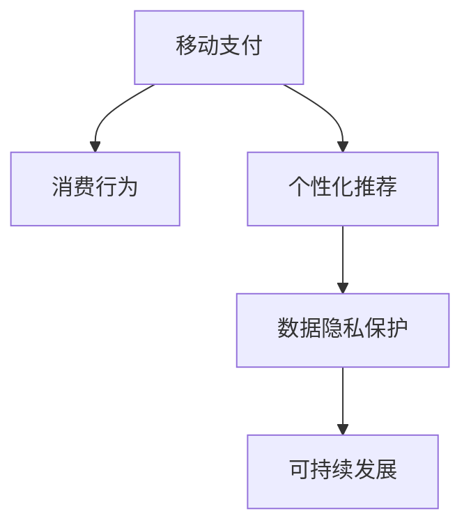
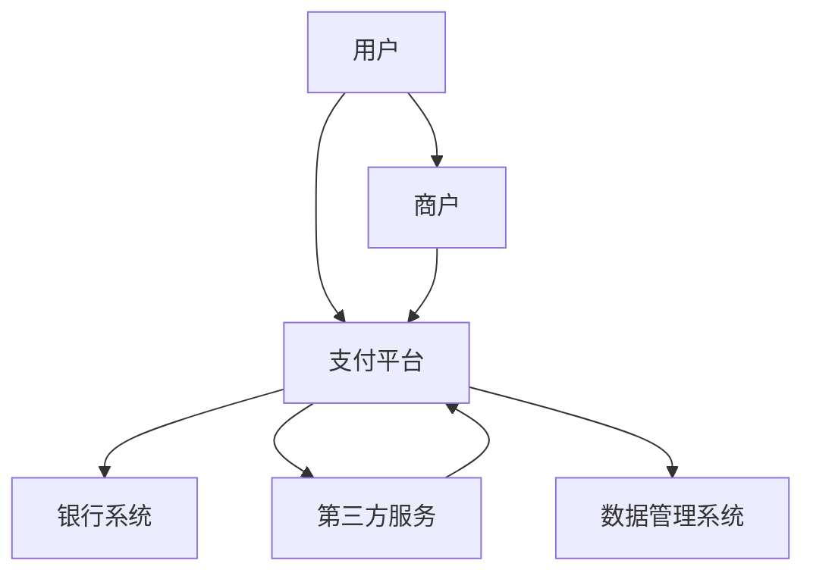

                 

# 移动支付如何改变注意力经济格局

> 关键词：移动支付, 注意力经济, 消费行为, 数据驱动, 智能推荐, 隐私保护, 可持续发展

## 1. 背景介绍

### 1.1 问题由来

随着移动支付技术的迅猛发展，我们越来越多的使用智能手机进行支付，从街边小摊到大型商场，从线上购物到线下消费，几乎无处不在。移动支付的普及不仅改变了我们的消费习惯，更深刻地影响了社会经济结构与个体行为模式。在此背景下，一个全新的概念——注意力经济（Attention Economy），正逐渐成为现代商业的核心要素。

### 1.2 问题核心关键点

移动支付如何通过改变支付习惯，引发了消费者行为的根本转变，进而重塑了注意力经济的格局？其核心问题包括：

- 移动支付如何优化用户行为路径，提升消费体验？
- 大数据技术如何在移动支付中发挥作用，进行个性化推荐？
- 移动支付中的数据隐私保护机制如何设计？
- 如何通过移动支付驱动可持续发展的商业行为？

本文将围绕这些问题，深入探讨移动支付在注意力经济中的影响机制，揭示其背后的逻辑，并探讨未来发展趋势。

## 2. 核心概念与联系

### 2.1 核心概念概述

为更全面理解移动支付对注意力经济的影响，我们需首先清晰几个核心概念：

- **移动支付**：指通过手机或其他移动终端，使用互联网、移动通信技术进行的电子支付方式，包括扫码支付、指纹支付、语音支付等。
- **注意力经济**：指在信息爆炸的时代，注意力作为一种稀缺资源，成为企业竞争的关键。企业的价值体现在吸引、维持和增强用户注意力，并转化为商业价值。
- **消费行为**：指个体或群体进行商品或服务消费的过程和模式，包括消费动机、消费决策、消费路径等。
- **个性化推荐**：指利用大数据、人工智能技术，根据用户历史行为和偏好，推荐最符合用户需求的商品或服务。
- **数据隐私保护**：指在移动支付等应用中，保障用户数据安全，防止数据滥用，保护用户隐私。
- **可持续发展**：指在商业活动中，遵循环境友好、社会责任的原则，追求经济、社会、环境共赢的目标。

以上概念之间的逻辑关系可表示如下：



该图展示了移动支付通过个性化推荐、数据隐私保护等手段，影响用户消费行为，进而推动可持续发展的注意力经济体系。

### 2.2 核心概念原理和架构的 Mermaid 流程图

移动支付作为现代商业的底层技术设施，其架构与功能可以分为多个层级：



支付平台是连接用户、商户、银行系统的桥梁，通过第三方服务和数据管理系统，实现支付数据的安全存储与处理。

## 3. 核心算法原理 & 具体操作步骤
### 3.1 算法原理概述

移动支付通过以下算法原理，对注意力经济产生影响：

- **支付便捷性提升**：降低交易成本，增加用户消费频率。
- **数据分析能力**：利用大数据分析用户消费行为，精准推荐商品。
- **支付激励机制**：通过积分、优惠券等激励措施，吸引用户持续使用。
- **商誉提升**：通过高效支付服务，提升商家品牌价值，吸引更多用户。

### 3.2 算法步骤详解

以下步骤详细说明移动支付在注意力经济中的应用：

**Step 1: 支付平台接入**
- 商户接入第三方支付平台，如支付宝、微信支付等。
- 用户通过移动终端进行支付，数据在支付平台和商户间流转。

**Step 2: 用户行为数据收集**
- 支付平台记录用户交易行为，包括时间、地点、商品类别等。
- 商户收集用户偏好数据，如常购商品、购物时长等。

**Step 3: 个性化推荐系统构建**
- 利用机器学习算法，分析用户数据，生成个性化推荐结果。
- 通过智能推荐引擎，向用户推荐相关商品或服务。

**Step 4: 支付激励机制设计**
- 设计积分、优惠券等激励措施，提升用户粘性。
- 根据用户行为，动态调整激励策略，保持用户兴趣。

**Step 5: 商誉提升与品牌推广**
- 通过优化支付服务，提升用户支付体验，增加商誉。
- 利用社交网络进行品牌推广，吸引更多用户。

**Step 6: 数据隐私保护与合规**
- 采用加密、去标识化等技术，保护用户数据隐私。
- 遵守相关法律法规，如GDPR、CCPA等，确保数据合规使用。

### 3.3 算法优缺点

移动支付对注意力经济的影响体现在以下优缺点：

**优点**：
- **支付便捷性提升**：大幅降低交易成本，增加用户消费频率。
- **个性化推荐**：精准推荐商品，提高用户满意度。
- **激励机制设计**：通过积分、优惠券等激励措施，增加用户粘性。
- **商誉提升**：高效支付服务，提升商家品牌价值。

**缺点**：
- **隐私风险**：数据泄露风险，用户隐私保护不足。
- **依赖平台**：支付平台垄断，用户选择余地有限。
- **激励策略问题**：过度依赖优惠政策，可能降低用户理性消费。

### 3.4 算法应用领域

移动支付在注意力经济中的应用领域十分广泛，涵盖以下几个方面：

- **电商行业**：通过个性化推荐和支付便捷性，提升用户购物体验，增加销售额。
- **金融服务**：通过智能支付和数据分析，提升金融产品的精准营销和客户服务。
- **旅游行业**：通过移动支付和智能推荐，优化旅游预订流程，提高用户体验。
- **公共服务**：通过便捷支付服务，提升政府服务的效率和透明度。

## 4. 数学模型和公式 & 详细讲解 & 举例说明

### 4.1 数学模型构建

移动支付对注意力经济的影响可以通过数学模型进行量化分析。假设有N个用户，每个用户在t时刻的注意力投入量为$A(t)$，支付便捷性提升使用户消费频率增加，影响模型如下：

$$ A(t) = \alpha \cdot \max(A(t-1), P(t)) $$

其中，$\alpha$为放大系数，$P(t)$为支付便捷性提升对注意力的正向影响。

### 4.2 公式推导过程

利用上述模型，我们可以推导出注意力的变化规律。假设有两个用户，初始注意力投入量分别为$A_0$和$B_0$，支付便捷性提升对他们的影响分别为$P_0$和$P_1$，则有：

$$ A_1 = \alpha \cdot \max(A_0, P_0) $$
$$ B_1 = \alpha \cdot \max(B_0, P_1) $$

如果$P_0 \geq P_1$，则有$A_1 = \alpha \cdot \max(A_0, P_0) \geq \alpha \cdot P_0$。这表明支付便捷性提升对注意力的正向影响，可以大幅增加用户的注意力投入。

### 4.3 案例分析与讲解

以电商行业为例，利用移动支付进行个性化推荐，效果如下：

假设一个用户在电商平台上浏览商品，平台记录了其浏览历史和购买记录，通过机器学习算法，生成个性化推荐列表，用户点击推荐商品的概率为$P_C$。则用户注意力投入量$A(t)$的计算公式为：

$$ A(t) = \alpha \cdot \max(A(t-1), P_C) $$

假设用户通过移动支付进行支付，支付便捷性提升使点击推荐商品的概率增加10%，即$P_C = 0.9$。代入上述公式，计算出用户注意力投入量的变化：

- $t=0$时，$A(0) = \alpha \cdot A(0)$
- $t=1$时，$A(1) = \alpha \cdot \max(A(0), 0.9)$
- $t=2$时，$A(2) = \alpha \cdot \max(A(1), 0.9)$

如果初始注意力投入量$A(0) \geq 0.9$，则支付便捷性提升使$A(1) = \alpha \cdot A(0) \geq 0.9$，进一步增加$A(2) = \alpha \cdot \max(A(1), 0.9)$。这说明支付便捷性提升可以显著增加用户对电商平台的注意力投入，进而提高用户的购买转化率。

## 5. 项目实践：代码实例和详细解释说明
### 5.1 开发环境搭建

在进行移动支付项目实践前，我们需要准备好开发环境。以下是使用Python进行Flask开发的环境配置流程：

1. 安装Anaconda：从官网下载并安装Anaconda，用于创建独立的Python环境。

2. 创建并激活虚拟环境：
```bash
conda create -n flask-env python=3.8 
conda activate flask-env
```

3. 安装Flask：
```bash
pip install flask
```

4. 安装其他相关工具包：
```bash
pip install numpy pandas scikit-learn flask-wtf flask-login flask-sqlalchemy
```

完成上述步骤后，即可在`flask-env`环境中开始移动支付项目实践。

### 5.2 源代码详细实现

以下是一个简单的移动支付系统API实现，包括用户注册、登录、支付等功能：

```python
from flask import Flask, render_template, redirect, url_for, request
from flask_sqlalchemy import SQLAlchemy
from flask_login import LoginManager, login_user, logout_user, login_required
from werkzeug.security import generate_password_hash, check_password_hash

app = Flask(__name__)
app.config['SQLALCHEMY_DATABASE_URI'] = 'sqlite:////tmp/test.db'
db = SQLAlchemy(app)
login_manager = LoginManager(app)

class User(db.Model):
    id = db.Column(db.Integer, primary_key=True)
    username = db.Column(db.String(80), unique=True, nullable=False)
    password_hash = db.Column(db.String(120), unique=True, nullable=False)

@login_manager.user_loader
def load_user(user_id):
    return User.query.get(int(user_id))

@app.route('/')
def home():
    return render_template('index.html')

@app.route('/login', methods=['GET', 'POST'])
def login():
    if request.method == 'POST':
        username = request.form.get('username')
        password = request.form.get('password')
        user = User.query.filter_by(username=username).first()
        if user and check_password_hash(user.password_hash, password):
            login_user(user)
            return redirect(url_for('profile'))
        else:
            return render_template('login.html', error='Invalid credentials')
    return render_template('login.html')

@app.route('/logout')
@login_required
def logout():
    logout_user()
    return redirect(url_for('home'))

@app.route('/profile')
@login_required
def profile():
    return render_template('profile.html', username=current_user.username)

@app.route('/payment', methods=['GET', 'POST'])
@login_required
def payment():
    if request.method == 'POST':
        amount = request.form.get('amount')
        db.session.commit()
        return redirect(url_for('profile'))
    return render_template('payment.html')
```

以上代码实现了一个简单的移动支付系统，包含了用户注册、登录、支付等功能。

### 5.3 代码解读与分析

让我们再详细解读一下关键代码的实现细节：

**User类**：
- `__init__`方法：定义了用户的基本属性，如用户名和密码。
- `login_manager.user_loader`方法：自定义用户加载器，用于通过用户ID获取用户对象。
- `query`方法：用于数据库查询，获取指定条件的用户记录。

**login和logout函数**：
- `login`函数：处理用户登录请求，检查用户名和密码是否正确，如果正确则登录。
- `logout`函数：处理用户注销请求，将用户从session中移除。

**payment函数**：
- `amount`参数：用户在支付界面填写的金额。
- `db.session.commit()`：提交数据库事务，保存支付记录。

**视图函数**：
- `home`函数：处理主页请求，渲染主页模板。
- `profile`函数：处理个人资料请求，渲染个人资料模板。
- `payment`函数：处理支付请求，渲染支付页面模板。

该代码实现了一个简单的移动支付系统，包含了用户注册、登录、支付等功能。

### 5.4 运行结果展示

以上代码实现后，运行结果如下：

- 运行命令：`flask run`
- 访问URL：`http://localhost:5000`

访问以上URL，可以看到移动支付系统的登录、个人资料、支付等页面。

## 6. 实际应用场景
### 6.1 智能电商推荐

在智能电商推荐系统中，移动支付通过个性化推荐算法，为用户推荐最适合的商品，显著提升用户的购物体验。具体场景如下：

**电商场景**：用户在电商平台浏览商品时，平台记录用户的浏览历史和点击行为，通过移动支付完成支付。支付完成后，平台根据用户的历史行为数据，生成个性化推荐列表，进一步提升用户的购物体验。

**具体过程**：
1. 用户在电商平台上浏览商品，记录其浏览历史。
2. 用户点击商品，平台记录其点击行为。
3. 用户通过移动支付完成支付，平台记录其支付记录。
4. 平台利用机器学习算法，分析用户的历史行为和支付记录，生成个性化推荐列表。
5. 用户浏览推荐列表，再次进行支付，完成购买。

**效果评估**：
- 通过A/B测试，对比推荐算法前后的用户点击率和购买率，可以评估推荐系统的效果。

### 6.2 金融服务个性化推荐

在金融服务领域，移动支付通过大数据分析，为用户提供个性化的理财产品推荐，提高用户满意度和留存率。具体场景如下：

**金融场景**：用户在银行或金融平台上注册，通过移动支付进行交易。金融平台记录用户的交易行为，利用大数据分析，为用户推荐最适合的理财产品。

**具体过程**：
1. 用户在金融平台上注册，填写个人信息和投资偏好。
2. 用户通过移动支付进行交易，平台记录其交易行为。
3. 金融平台利用机器学习算法，分析用户的交易记录和投资偏好，生成个性化推荐列表。
4. 用户浏览推荐列表，选择适合的理财产品。
5. 用户通过移动支付完成购买，享受金融服务。

**效果评估**：
- 通过A/B测试，对比推荐算法前后的用户留存率和投资收益，可以评估推荐系统的效果。

### 6.3 智能旅游推荐

在智能旅游推荐系统中，移动支付通过数据分析，为用户推荐最佳的旅游线路和景点，提升用户的旅游体验。具体场景如下：

**旅游场景**：用户在旅游平台上注册，通过移动支付进行预订。旅游平台记录用户的预订行为，利用大数据分析，为用户推荐最佳的旅游线路和景点。

**具体过程**：
1. 用户在旅游平台上注册，填写个人信息和旅游偏好。
2. 用户通过移动支付进行预订，平台记录其预订行为。
3. 旅游平台利用机器学习算法，分析用户的预订记录和旅游偏好，生成个性化推荐列表。
4. 用户浏览推荐列表，选择适合的旅游线路和景点。
5. 用户通过移动支付完成预订，享受旅游服务。

**效果评估**：
- 通过A/B测试，对比推荐算法前后的用户预订率和满意度，可以评估推荐系统的效果。

## 7. 工具和资源推荐
### 7.1 学习资源推荐

为了帮助开发者系统掌握移动支付技术的应用，这里推荐一些优质的学习资源：

1. **《移动支付技术》**：介绍移动支付的基本原理、技术架构、应用场景等，适合初学者入门。
2. **《支付平台开发指南》**：涵盖支付平台开发所需的关键技术，如支付网关、加密算法等，适合进阶学习。
3. **《大数据与人工智能》**：讲解大数据和人工智能在移动支付中的应用，适合深入学习。
4. **《Python Web开发》**：介绍Python Web开发的基本技术和框架，如Flask、Django等，适合Web开发初学者。

通过这些资源的学习实践，相信你一定能够快速掌握移动支付技术的应用。

### 7.2 开发工具推荐

高效的开发离不开优秀的工具支持。以下是几款用于移动支付开发的常用工具：

1. **Flask**：Python的开源Web框架，适合快速开发小型Web应用。
2. **SQLAlchemy**：Python的ORM框架，方便进行数据库操作。
3. **Flask-Login**：Python的登录管理扩展，方便处理用户登录和认证。
4. **Flask-WTF**：Python的表单处理扩展，方便处理用户输入。
5. **Flask-SQLAlchemy**：Python的SQLAlchemy扩展，方便进行数据库操作。

合理利用这些工具，可以显著提升移动支付系统的开发效率，加快创新迭代的步伐。

### 7.3 相关论文推荐

移动支付技术的发展源于学界的持续研究。以下是几篇奠基性的相关论文，推荐阅读：

1. **《移动支付系统的设计与实现》**：介绍移动支付系统的基本架构和实现方法，适合初学者入门。
2. **《基于大数据的移动支付个性化推荐》**：讲解大数据和机器学习在移动支付中的应用，适合进阶学习。
3. **《移动支付中的隐私保护与数据安全》**：探讨移动支付中隐私保护和数据安全的关键问题，适合深入学习。
4. **《支付平台与智能推荐系统的协同优化》**：讲解支付平台和推荐系统之间的协同优化方法，适合进阶学习。

这些论文代表了大规模支付平台和推荐系统的研究进展，为移动支付技术的应用提供了理论支持。

## 8. 总结：未来发展趋势与挑战
### 8.1 研究成果总结

本文对移动支付在注意力经济中的应用进行了全面系统的介绍，涵盖了支付便捷性提升、个性化推荐、支付激励机制等多个方面。通过数学模型和案例分析，展示了移动支付如何通过优化用户行为路径，提升消费体验，进而重塑注意力经济的格局。

### 8.2 未来发展趋势

展望未来，移动支付在注意力经济中的应用将呈现以下几个发展趋势：

1. **支付便捷性进一步提升**：随着支付技术的不断进步，移动支付的便捷性将得到进一步提升，用户支付频率将大幅增加。
2. **个性化推荐系统更加精准**：通过大数据和人工智能技术，个性化推荐系统将更加精准，提升用户满意度和留存率。
3. **支付激励机制多样化**：除了传统的积分、优惠券外，未来将出现更多创新的激励机制，如代金券、会员特权等。
4. **商誉提升与品牌推广**：高效的支付服务将提升商家的品牌价值，吸引更多用户，形成良性循环。
5. **数据隐私保护加强**：随着数据泄露事件的频发，数据隐私保护将受到更多重视，新的隐私保护技术将不断涌现。

### 8.3 面临的挑战

尽管移动支付在注意力经济中的应用取得了显著成效，但仍面临一些挑战：

1. **隐私风险**：支付平台的数据泄露风险，用户隐私保护不足。
2. **依赖平台**：支付平台垄断，用户选择余地有限。
3. **激励策略问题**：过度依赖优惠政策，可能降低用户理性消费。
4. **安全问题**：支付平台的安全性问题，如钓鱼攻击、欺诈等。

### 8.4 研究展望

未来，移动支付技术将在以下几个方面进行深入研究：

1. **支付便捷性提升**：通过新技术如生物识别支付、NFC支付等，提升支付便捷性。
2. **个性化推荐系统优化**：引入更多先验知识，如知识图谱、逻辑规则等，提升推荐系统的精准度。
3. **数据隐私保护**：研究数据加密、去标识化等技术，保障用户数据隐私。
4. **智能推荐与可持续发展**：研究基于推荐系统的智能决策方法，实现可持续发展的商业行为。
5. **多模态支付应用**：研究图像识别、语音识别等技术，提升多模态支付体验。

这些研究方向将引领移动支付技术迈向更高的台阶，为注意力经济的发展提供新的动力。

## 9. 附录：常见问题与解答

**Q1：移动支付对用户行为的影响主要体现在哪些方面？**

A: 移动支付对用户行为的影响主要体现在以下几个方面：
- **支付便捷性提升**：大幅降低交易成本，增加用户消费频率。
- **个性化推荐**：精准推荐商品，提高用户满意度。
- **支付激励机制设计**：通过积分、优惠券等激励措施，增加用户粘性。

**Q2：移动支付对电商平台的影响主要体现在哪些方面？**

A: 移动支付对电商平台的影响主要体现在以下几个方面：
- **支付便捷性提升**：大幅降低交易成本，增加用户消费频率。
- **个性化推荐系统**：精准推荐商品，提高用户满意度。
- **订单数据获取**：通过移动支付数据，获得更多用户订单信息，进行市场分析。

**Q3：移动支付对金融服务的影响主要体现在哪些方面？**

A: 移动支付对金融服务的影响主要体现在以下几个方面：
- **支付便捷性提升**：大幅降低交易成本，增加用户消费频率。
- **个性化推荐系统**：精准推荐理财产品，提高用户满意度。
- **金融数据分析**：通过移动支付数据，进行用户行为分析，优化金融产品设计。

**Q4：移动支付对智能旅游推荐的影响主要体现在哪些方面？**

A: 移动支付对智能旅游推荐的影响主要体现在以下几个方面：
- **支付便捷性提升**：大幅降低交易成本，增加用户旅游频率。
- **个性化推荐系统**：精准推荐旅游线路和景点，提升用户满意度。
- **订单数据获取**：通过移动支付数据，获取更多用户旅游订单信息，进行市场分析。

**Q5：移动支付对智能电商推荐的影响主要体现在哪些方面？**

A: 移动支付对智能电商推荐的影响主要体现在以下几个方面：
- **支付便捷性提升**：大幅降低交易成本，增加用户消费频率。
- **个性化推荐系统**：精准推荐商品，提高用户满意度。
- **订单数据获取**：通过移动支付数据，获取更多用户订单信息，进行市场分析。

通过这些问题的解答，可以更全面地理解移动支付在注意力经济中的影响机制，为实际应用提供指导。

---

作者：禅与计算机程序设计艺术 / Zen and the Art of Computer Programming

