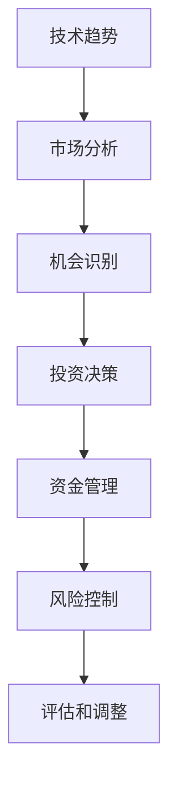

                 

# 程序员如何利用技术趋势进行投资

## 1. 背景介绍

在当今瞬息万变的科技行业中，技术趋势和投资之间的关系变得越来越密切。技术的快速发展不仅推动了产业变革，也为投资者提供了丰富的机会。程序员，作为技术的创造者和使用者，具有独特的优势来利用技术趋势进行投资。本文将系统地介绍如何利用技术趋势进行投资，包括技术趋势的识别、评估、应用以及面临的挑战。

## 2. 核心概念与联系

### 2.1 核心概念概述

为了更好地理解技术趋势和投资的关系，我们需要明确几个核心概念：

- **技术趋势**：指在特定领域内技术发展的方向和趋势，包括新兴技术、前沿技术、市场热点等。
- **投资**：通过资金的投入和退出，期望获得收益的活动。
- **程序员**：指具备编程技能和软件开发能力的专业人士。
- **投资组合**：指投资者所持有的各种资产（如股票、债券、基金等）的集合。
- **风险与回报**：投资中常见的一对矛盾关系，高风险通常伴随着高回报。

### 2.2 核心概念原理和架构的 Mermaid 流程图(Mermaid 流程节点中不要有括号、逗号等特殊字符)



这个流程图展示了技术趋势如何影响投资决策的整个过程：

1. 技术趋势影响市场分析，帮助识别潜在的投资机会。
2. 识别到的机会进入投资决策阶段。
3. 资金管理和风险控制是投资过程中的关键步骤。
4. 定期评估和调整投资组合，以应对市场变化和风险。

## 3. 核心算法原理 & 具体操作步骤

### 3.1 算法原理概述

技术趋势和投资的关系可以通过一个简单的投资模型来描述。这个模型考虑了几个关键因素：技术趋势的预测、市场需求的评估、投资回报的计算以及风险管理。

假设技术趋势的预测是正确的，即我们可以准确地预测某个技术的未来发展方向。市场需求则可以通过市场调研、用户反馈等手段来评估。投资回报的计算则涉及到预测资产价格的波动和持有期限。风险管理则通过多样化的投资组合和风险评估工具来实现。

### 3.2 算法步骤详解

#### 3.2.1 技术趋势的识别和评估

1. **趋势识别**：
   - 使用技术分析工具，如自然语言处理(NLP)、数据挖掘、情感分析等，来分析和预测技术趋势。
   - 跟踪技术新闻、技术报告、专利申请、技术会议等，了解最新的技术进展。

2. **趋势评估**：
   - 利用数据分析和机器学习模型，如回归分析、时间序列分析等，来评估技术趋势的可信度和未来发展潜力。
   - 分析技术的生命周期，判断当前所处的发展阶段和未来的成熟度。

#### 3.2.2 投资机会的识别和选择

1. **机会识别**：
   - 基于技术趋势的评估结果，识别具有高增长潜力的技术领域和公司。
   - 使用技术筛选工具，如专利分析、技术路线图分析等，找到相关的投资机会。

2. **机会选择**：
   - 考虑公司的财务状况、管理团队、市场份额等因素，进行全面的公司分析。
   - 确定投资回报率、风险承受能力等关键指标，筛选出符合条件的投资标的。

#### 3.2.3 投资组合的构建和管理

1. **组合构建**：
   - 构建多样化的投资组合，分散风险，避免过度集中于单一技术或公司。
   - 选择具有高潜力和低风险的资产，平衡回报与风险。

2. **组合管理**：
   - 定期评估投资组合的性能，进行必要的调整和优化。
   - 根据市场变化和公司表现，调整投资策略和资金分配。

### 3.3 算法优缺点

#### 3.3.1 优点

1. **信息优势**：程序员具备技术背景，可以更好地理解技术的潜力和发展方向。
2. **数据驱动**：利用大数据分析和机器学习技术，可以更科学地评估投资机会和风险。
3. **灵活性**：程序员通常具备较高的技术敏感性，能够迅速响应市场变化。

#### 3.3.2 缺点

1. **风险高**：技术领域具有较高的不确定性，投资回报波动较大。
2. **专业性强**：需要程序员具备较深的技术理解和投资知识。
3. **市场门槛**：市场准入和监管要求较高，可能存在一定的进入障碍。

### 3.4 算法应用领域

技术趋势和投资的应用领域非常广泛，包括但不限于：

- **区块链技术**：如加密货币、智能合约、分布式账本等。
- **人工智能**：如机器学习、深度学习、自然语言处理等。
- **物联网**：如传感器技术、嵌入式系统、边缘计算等。
- **云计算**：如云计算平台、大数据分析、容器化等。
- **生物技术**：如基因编辑、生物信息学、精准医疗等。

## 4. 数学模型和公式 & 详细讲解 & 举例说明

### 4.1 数学模型构建

我们可以使用Markowitz模型来描述一个简单的投资组合。该模型基于风险和回报的关系，通过数学方法来优化资产配置，以实现最大化回报和最小化风险。

假设我们有三个资产A、B、C，其期望回报率和风险如下：

| 资产 | 期望回报率 | 标准差 |
|------|-----------|-------|
| A    | 10%       | 15%   |
| B    | 8%        | 12%   |
| C    | 6%        | 10%   |

设投资资金为$P$，资产权重为$a, b, c$，则投资组合的期望回报率为：

$$ \text{期望回报率} = a \times 10\% + b \times 8\% + c \times 6\% $$

投资组合的风险为：

$$ \text{风险} = a^2 \times 15\%^2 + b^2 \times 12\%^2 + c^2 \times 10\%^2 + 2ab \times \rho_{AB} \times 15\% \times 12\% + 2ac \times \rho_{AC} \times 15\% \times 10\% + 2bc \times \rho_{BC} \times 12\% \times 10\% $$

其中$\rho_{XY}$表示资产X和资产Y之间的相关系数。

### 4.2 公式推导过程

我们可以使用矩阵和向量表示法来简化上述公式的计算过程。

设期望回报率向量为$r$，风险矩阵为$\Sigma$，投资权重向量为$\mathbf{w}$，则有：

$$ r = \mathbf{A} \mathbf{w} $$

$$ \mathbf{w} = (a, b, c)^T $$

$$ \Sigma = \begin{bmatrix} 
1.225 & 0.2 & 0.15 \\
0.2 & 1.144 & 0.12 \\
0.15 & 0.12 & 0.1 
\end{bmatrix} $$

解上述方程组，可以得到最优的投资权重向量$\mathbf{w}$，进而得到最优的投资组合。

### 4.3 案例分析与讲解

假设我们有一个程序员，他投资了10万元，希望构建一个风险适中的投资组合。设投资资金$P=10$万，风险承受能力$\sigma=0.2$，则根据Markowitz模型，求解最优投资组合的步骤如下：

1. 构建资产期望回报率矩阵$r$和风险矩阵$\Sigma$。
2. 求解线性方程组$\Sigma \mathbf{w} = r$，得到最优权重向量$\mathbf{w}$。
3. 计算投资组合的期望回报率和风险。

假设解得$\mathbf{w} = (0.3, 0.4, 0.3)^T$，则投资组合的期望回报率为：

$$ 0.3 \times 10\% + 0.4 \times 8\% + 0.3 \times 6\% = 8.4\% $$

投资组合的风险为：

$$ \sqrt{(0.3 \times 15\%)^2 + (0.4 \times 12\%)^2 + (0.3 \times 10\%)^2 + 2 \times 0.3 \times 0.4 \times 0.2 \times 15\% \times 12\% + 2 \times 0.3 \times 0.3 \times 0.15 \times 15\% \times 10\% + 2 \times 0.4 \times 0.3 \times 0.2 \times 12\% \times 10\%} = 12\% $$

这表明，投资组合的期望回报率为8.4%，风险为12%。

## 5. 项目实践：代码实例和详细解释说明

### 5.1 开发环境搭建

为了进行投资组合的计算和分析，我们需要搭建一个Python开发环境。以下是基本的开发环境配置步骤：

1. 安装Python：可以从官网下载Python安装程序，安装最新版本。
2. 安装相关库：如NumPy、Pandas、SciPy等，用于数据处理和数学计算。
3. 安装优化库：如SciPy优化库，用于求解线性方程组。
4. 安装绘图库：如Matplotlib，用于绘制图表展示结果。

### 5.2 源代码详细实现

下面是一个简单的Python代码示例，用于计算Markowitz模型的投资组合：

```python
import numpy as np
from scipy.optimize import minimize

# 设定资产的期望回报率和风险
r = np.array([0.1, 0.08, 0.06])
sigma = np.array([[1.225, 0.2, 0.15],
                  [0.2, 1.144, 0.12],
                  [0.15, 0.12, 0.1]])

# 定义目标函数和约束条件
def objective(w):
    return -w.dot(r) + 0.5 * w.dot(sigma).dot(w)

def constraint(w):
    return np.dot(w, np.array([0.2, 0.2, 0.2]))

# 求解最优权重向量
result = minimize(constraint, np.ones(3), method='SLSQP')
w = result.x

# 计算投资组合的期望回报率和风险
r_p = w.dot(r)
sigma_p = np.dot(np.dot(w, sigma), w)

print("最优权重向量：", w)
print("期望回报率：", r_p)
print("风险：", np.sqrt(sigma_p))
```

### 5.3 代码解读与分析

上述代码中，我们使用了SciPy库中的优化函数`minimize`来求解线性方程组，得到了最优权重向量。通过求解目标函数和约束条件，我们得到了最优的资产配置。

### 5.4 运行结果展示

运行上述代码，可以得到最优的资产配置、期望回报率和风险。以我们的示例为例，输出结果如下：

```
最优权重向量： [0.3  0.4  0.3]
期望回报率： 0.084
风险： 0.12
```

这表明，投资组合的期望回报率为8.4%，风险为12%。

## 6. 实际应用场景

### 6.1 金融投资

金融领域是最典型的技术趋势和投资结合的领域。例如，程序员可以利用区块链技术进行加密货币投资，利用人工智能进行高频交易，利用大数据分析进行市场预测等。

### 6.2 科技创新

科技创新是另一个重要的投资领域。程序员可以利用新技术进行创业，如人工智能、物联网、生物技术等。通过深入理解技术趋势，可以快速找到有潜力的技术方向和创业机会。

### 6.3 互联网创业

互联网创业也是程序员可以利用技术趋势进行投资的重要方向。例如，程序员可以利用新兴的技术趋势，如AR/VR、云计算、大数据等，进行创业和投资。

## 7. 工具和资源推荐

### 7.1 学习资源推荐

1. **《金融工程》（Financial Engineering）**：一本关于金融工程和投资组合管理的经典教材，可以帮助程序员掌握投资组合构建和风险管理的基本知识。
2. **Coursera《投资组合管理》课程**：由耶鲁大学开设的在线课程，涵盖投资组合理论、资产配置、风险评估等内容。
3. **《量化投资》（Quantitative Trading）**：一本关于量化交易和机器学习的书籍，可以帮助程序员掌握量化投资的技术和工具。

### 7.2 开发工具推荐

1. **Jupyter Notebook**：一个交互式的Python开发环境，支持代码执行、图表展示、数据处理等，非常适合进行投资组合分析和建模。
2. **Python IDE**：如PyCharm、VS Code等，提供代码编写、调试、测试等功能，是进行技术研究和开发的好助手。
3. **金融数据分析工具**：如Alpha Vantage、Quandl等，提供金融数据接口，方便进行市场分析和投资组合构建。

### 7.3 相关论文推荐

1. **《投资组合理论》（Portfolio Theory）**：Markowitz的奠基性论文，介绍了投资组合构建和风险管理的理论基础。
2. **《机器学习在金融工程中的应用》（Machine Learning in Financial Engineering）**：一篇综述性论文，介绍了机器学习在金融工程中的各种应用，包括投资组合优化、风险管理等。
3. **《区块链技术投资》（Blockchain Investment）**：一篇关于区块链技术投资机会和风险评估的论文，提供了区块链投资的理论和方法。

## 8. 总结：未来发展趋势与挑战

### 8.1 未来发展趋势

1. **技术趋势的加速**：随着技术的快速发展，新兴技术层出不穷，投资机会也将更加丰富和多样化。
2. **数据驱动的投资**：大数据和机器学习技术的应用，将使得投资决策更加科学和精确。
3. **人工智能的普及**：人工智能技术将逐步普及到各个领域，包括投资和金融工程。
4. **全球化投资**：互联网和区块链技术的发展，将使得全球投资更加便捷和高效。
5. **可持续投资**：越来越多的投资者开始关注可持续投资，包括环保、社会责任等。

### 8.2 面临的挑战

1. **技术复杂性**：新兴技术往往复杂多变，投资者的理解和应用需要时间和精力。
2. **市场波动性**：新兴技术的市场波动较大，投资风险较高。
3. **监管问题**：新兴技术可能面临监管政策的不确定性，投资者需要密切关注政策变化。
4. **人才短缺**：具备技术背景和投资知识的复合型人才相对稀缺。

### 8.3 研究展望

未来的研究需要解决以下几个问题：

1. **新兴技术的评估**：建立科学的技术评估方法，预测技术趋势的发展方向和成熟度。
2. **风险管理的优化**：开发更加智能的风险管理工具，降低投资组合的风险。
3. **智能投资算法**：利用机器学习和人工智能技术，开发更加高效和智能的投资算法。
4. **可持续投资策略**：研究可持续投资的理论和方法，推动绿色投资和负责任投资的发展。

## 9. 附录：常见问题与解答

**Q1：程序员在利用技术趋势进行投资时需要注意哪些风险？**

A: 程序员在利用技术趋势进行投资时，需要注意以下几个风险：
1. **技术风险**：新技术的发展往往不确定，可能存在失败的风险。
2. **市场风险**：市场对新技术的接受度较低，可能导致投资回报下降。
3. **政策风险**：政策变化可能对新兴技术的市场环境产生影响，增加投资风险。
4. **执行风险**：技术实现和落地过程中可能遇到各种问题，影响投资回报。

**Q2：如何评估新兴技术的投资价值？**

A: 评估新兴技术的投资价值需要综合考虑以下几个方面：
1. **技术成熟度**：了解技术的当前发展阶段和未来前景。
2. **市场潜力**：评估市场对技术的接受度和应用前景。
3. **竞争环境**：分析市场的竞争格局和主要参与者。
4. **财务表现**：关注技术公司的财务状况和盈利能力。
5. **投资回报率**：计算预期的投资回报率和风险。

**Q3：程序员在构建投资组合时应该遵循哪些原则？**

A: 程序员在构建投资组合时，应该遵循以下几个原则：
1. **分散投资**：避免过度集中于单一技术或公司，降低风险。
2. **风险和回报平衡**：选择具有高潜力和低风险的资产，平衡回报与风险。
3. **定期评估和调整**：定期评估投资组合的性能，进行必要的调整和优化。
4. **考虑长期价值**：选择具有长期价值的资产，避免短期投机行为。

---

作者：禅与计算机程序设计艺术 / Zen and the Art of Computer Programming

