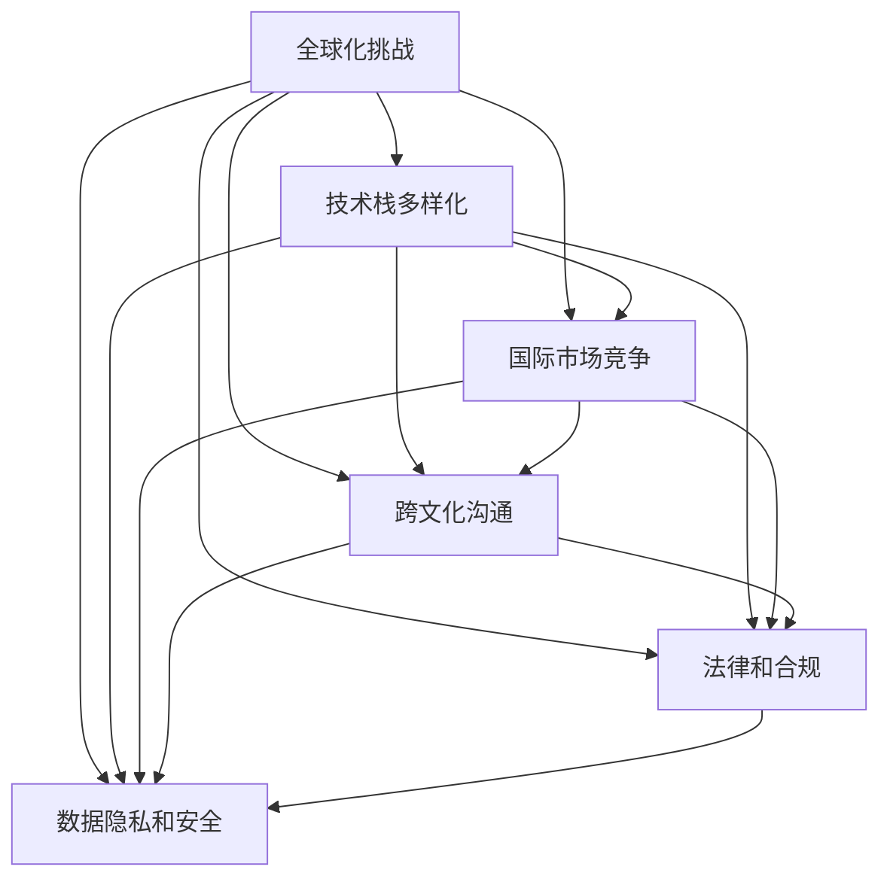

                 

## 1. 背景介绍

### 1.1 问题由来

在当今全球化加速的时代，信息技术已经成为全球经济社会发展的重要驱动力。跨国家、跨地域、跨文化的交流合作日益频繁，对计算机科学和信息技术领域提出了更高要求。随着互联网、移动互联网、物联网等技术的广泛应用，程序员需要应对复杂的全球化挑战，包括技术栈多样化、国际市场竞争、跨文化沟通等。

### 1.2 问题核心关键点

- **技术栈多样化**：不同国家和地区的技术生态体系有所差异，开发者需要掌握多种技术栈才能满足全球市场的需求。
- **国际市场竞争**：全球市场竞争激烈，开发者需要快速响应市场需求，保持技术创新，以增强企业竞争力。
- **跨文化沟通**：国际项目合作中，需要克服语言、文化和习惯的差异，以实现有效的沟通和协作。
- **法律和合规**：不同国家和地区的法律法规差异巨大，开发者需要确保其技术和服务符合当地法规要求。
- **数据隐私和安全**：全球化背景下，数据跨境传输和存储的安全问题变得更加复杂，开发者需要确保数据隐私和安全。

### 1.3 问题研究意义

理解和应对全球化挑战，对于信息技术领域来说具有重要意义：

- **提升竞争力**：掌握全球化挑战的应对策略，可以使企业在国际市场上获得优势，提升竞争力。
- **促进合作**：跨文化、跨地域的合作项目需要理解各国文化和法律，推动国际合作和技术创新。
- **保障安全**：确保技术和服务符合各国的法律法规，避免法律风险。
- **尊重用户隐私**：在全球化项目中，尊重用户隐私，增强用户信任，提升品牌形象。

## 2. 核心概念与联系

### 2.1 核心概念概述

- **全球化挑战**：指的是在全球化背景下，程序员需要面临的各类技术和市场挑战，包括技术栈多样化、国际竞争、跨文化沟通、法律合规、数据安全等。
- **技术栈多样化**：指程序员需要掌握多种编程语言、框架和工具，以满足不同项目和市场的需求。
- **国际市场竞争**：指在竞争激烈的全球市场中，程序员需要快速响应市场需求，保持技术创新。
- **跨文化沟通**：指在全球化项目中，程序员需要克服语言、文化和习惯的差异，实现有效沟通和协作。
- **法律和合规**：指开发者需要确保其技术和服务符合各国的法律法规要求，避免法律风险。
- **数据隐私和安全**：指在全球化项目中，保护用户数据隐私，确保数据安全，避免数据泄露和滥用。

这些核心概念之间的联系如下：



这个流程图展示了全球化挑战对程序员技术栈、市场竞争、跨文化沟通、法律合规和数据隐私安全的全面影响，以及它们之间的相互联系。

## 3. 核心算法原理 & 具体操作步骤

### 3.1 算法原理概述

全球化挑战的应对策略，本质上是多任务学习（Multi-task Learning, MTL）在技术和市场层面的应用。多任务学习通过在多个相关任务上同时训练一个共享模型，可以提升模型的泛化能力和资源利用效率。

在技术和市场层面，多任务学习的应用如下：

- **技术栈多样化**：通过掌握多种技术栈，实现多任务学习，提升程序员的技术能力。
- **国际市场竞争**：通过多任务学习，快速响应市场需求，保持技术创新。
- **跨文化沟通**：通过多语言和跨文化教育，提升程序员的沟通能力。
- **法律和合规**：通过多任务学习，掌握不同国家法律法规，避免法律风险。
- **数据隐私和安全**：通过多任务学习，提升数据隐私和安全意识。

### 3.2 算法步骤详解

全球化挑战的应对策略，可以分为以下几个步骤：

**Step 1: 选择合适的技术栈**

- 根据项目需求，选择合适的编程语言、框架和工具。
- 根据全球市场需求，选择多种技术栈进行学习和掌握。

**Step 2: 进行跨文化教育**

- 通过在线课程、培训等方式，提升程序员的跨文化沟通能力。
- 了解不同国家和地区的文化习俗、工作方式和法律规定。

**Step 3: 学习法律法规**

- 研究不同国家和地区的法律法规，确保技术和服务符合当地要求。
- 参加法律法规培训课程，提升合规意识。

**Step 4: 增强数据隐私和安全意识**

- 学习和掌握数据隐私和安全的基本知识和最佳实践。
- 进行定期的数据隐私和安全培训，提升安全意识。

**Step 5: 快速响应市场需求**

- 定期关注全球市场趋势，快速响应市场需求变化。
- 积极参加行业会议和技术交流，获取最新技术和市场信息。

### 3.3 算法优缺点

全球化挑战的应对策略具有以下优点：

- **提升技术能力**：通过多任务学习，程序员可以掌握多种技术栈，提升技术能力。
- **快速响应市场需求**：通过多任务学习，程序员可以快速适应市场需求变化，保持技术创新。
- **增强跨文化沟通能力**：通过跨文化教育，提升程序员的沟通能力。
- **避免法律风险**：通过学习法律法规，避免法律风险。
- **提升数据隐私和安全意识**：通过数据隐私和安全培训，提升数据隐私和安全意识。

同时，这种应对策略也存在一些缺点：

- **学习成本高**：需要投入大量时间和精力学习和掌握多种技术栈。
- **国际市场竞争激烈**：全球市场竞争激烈，需要不断提升技术和创新能力。
- **跨文化沟通复杂**：不同国家和地区的文化差异，可能导致沟通障碍。
- **法律法规复杂**：不同国家和地区的法律法规差异，可能导致合规问题。
- **数据隐私和安全风险高**：全球数据传输和存储的安全问题更加复杂。

### 3.4 算法应用领域

全球化挑战的应对策略，广泛应用于软件开发、项目管理、市场推广和技术咨询等领域。具体应用如下：

- **软件开发**：通过掌握多种技术栈，提升程序员的技术能力和项目开发效率。
- **项目管理**：通过跨文化教育和法律合规培训，提升项目管理的跨文化沟通和合规能力。
- **市场推广**：通过快速响应市场需求，提升市场推广的效率和效果。
- **技术咨询**：通过了解不同国家和地区的技术生态体系，提供全球化技术咨询服务。

## 4. 数学模型和公式 & 详细讲解 & 举例说明

### 4.1 数学模型构建

全球化挑战的应对策略，可以通过多任务学习的数学模型进行建模。设 $T$ 为不同任务的任务集，$X$ 为输入空间，$Y$ 为输出空间，$\theta$ 为模型参数，则多任务学习的目标函数为：

$$
\min_{\theta} \sum_{t \in T} \mathcal{L}_t(M_{\theta}(x_t), y_t)
$$

其中 $\mathcal{L}_t$ 为第 $t$ 个任务的损失函数。

### 4.2 公式推导过程

多任务学习的目标函数可以进一步展开为：

$$
\min_{\theta} \frac{1}{N} \sum_{t \in T} \sum_{i=1}^N \mathcal{L}_t(M_{\theta}(x_t^{(i)}), y_t^{(i)})
$$

其中 $N$ 为训练样本数，$x_t^{(i)}$ 为第 $t$ 个任务的第 $i$ 个训练样本，$y_t^{(i)}$ 为对应的标签。

多任务学习的参数更新公式为：

$$
\theta \leftarrow \theta - \eta \nabla_{\theta} \mathcal{L}_t(M_{\theta}(x_t^{(i)}), y_t^{(i)})
$$

其中 $\eta$ 为学习率，$\nabla_{\theta} \mathcal{L}_t$ 为损失函数对模型参数的梯度。

### 4.3 案例分析与讲解

以软件开发为例，多任务学习的应用如下：

- **任务集 $T$**：包括Python、Java、JavaScript等多种编程语言的开发任务。
- **输入空间 $X$**：包括代码编写、版本控制、自动化测试等输入。
- **输出空间 $Y$**：包括代码质量、功能实现、性能优化等输出。

假设有一个多任务学习模型 $M_{\theta}$，可以通过多任务学习，在Python、Java和JavaScript等多种语言上同时训练，提升编程效率和代码质量。具体步骤如下：

1. **数据集准备**：准备Python、Java和JavaScript的开发任务数据集。
2. **模型初始化**：选择多任务学习模型结构，并初始化模型参数 $\theta$。
3. **训练模型**：在多个任务上同时训练模型，优化模型参数 $\theta$。
4. **评估模型**：在各个任务上评估模型性能，选择合适的学习率和正则化参数。
5. **应用模型**：在新的开发任务上，使用训练好的模型进行编程和代码优化。

## 5. 项目实践：代码实例和详细解释说明

### 5.1 开发环境搭建

在开发环境搭建方面，需要考虑以下几点：

- **编程语言**：选择多种编程语言进行学习和掌握，如Python、Java、JavaScript等。
- **开发框架**：选择多种开发框架进行学习和掌握，如React、Vue、Angular等。
- **工具链**：选择多种开发工具进行学习和掌握，如Git、Docker、Kubernetes等。

### 5.2 源代码详细实现

以多语言编程任务为例，给出使用Python和JavaScript进行多任务学习的源代码实现：

```python
import torch
import torch.nn as nn
import torch.optim as optim

# 定义多任务学习模型
class MultiTaskModel(nn.Module):
    def __init__(self):
        super(MultiTaskModel, self).__init__()
        self.python_layer = nn.Linear(1024, 256)
        self.java_layer = nn.Linear(1024, 256)
        self.js_layer = nn.Linear(1024, 256)

    def forward(self, x):
        x_python = self.python_layer(x)
        x_java = self.java_layer(x)
        x_js = self.js_layer(x)
        return (x_python, x_java, x_js)

# 定义损失函数
def multi_task_loss(model, inputs, targets):
    x_python, x_java, x_js = model(*inputs)
    loss_python = nn.CrossEntropyLoss()(x_python, targets['python'])
    loss_java = nn.CrossEntropyLoss()(x_java, targets['java'])
    loss_js = nn.CrossEntropyLoss()(x_js, targets['js'])
    return loss_python + loss_java + loss_js

# 定义训练函数
def train(model, dataset, batch_size, epochs, learning_rate):
    optimizer = optim.Adam(model.parameters(), lr=learning_rate)
    criterion = nn.CrossEntropyLoss()
    for epoch in range(epochs):
        for i, (inputs, targets) in enumerate(dataset):
            inputs = inputs.to(device)
            targets = {k: v.to(device) for k, v in targets.items()}
            optimizer.zero_grad()
            loss = multi_task_loss(model, inputs, targets)
            loss.backward()
            optimizer.step()
            print(f"Epoch {epoch+1}, Batch {i+1}, Loss: {loss.item():.4f}")

# 定义测试函数
def test(model, dataset, batch_size):
    model.eval()
    correct = 0
    total = 0
    with torch.no_grad():
        for inputs, targets in dataset:
            inputs = inputs.to(device)
            targets = {k: v.to(device) for k, v in targets.items()}
            outputs = model(*inputs)
            _, predicted = torch.max(outputs, 1)
            total += targets['python'].size(0)
            correct += (predicted == targets['python']).sum().item()
    print(f"Test Accuracy: {(100 * correct / total):.2f}%")
```

### 5.3 代码解读与分析

上述代码实现了一个简单的多任务学习模型，用于Python、Java和JavaScript三种编程语言的开发任务。具体解析如下：

**MultiTaskModel类**：定义了一个多任务学习模型，包含三个线性层，分别用于处理Python、Java和JavaScript任务的输入。

**multi_task_loss函数**：定义了多任务学习的损失函数，计算三种任务的交叉熵损失之和。

**train函数**：定义了多任务学习的训练函数，在每个epoch中对多个任务的数据进行前向传播和反向传播，更新模型参数。

**test函数**：定义了多任务学习的测试函数，计算模型在多个任务上的测试准确率。

## 6. 实际应用场景

### 6.1 智能客服系统

智能客服系统是全球化挑战的重要应用场景之一。通过多任务学习，智能客服系统可以同时处理多种语言和多种服务的客户咨询，提升客户服务效率和质量。

具体实现步骤如下：

1. **多语言处理**：使用多语言识别和翻译技术，处理不同语言的客户咨询。
2. **多任务训练**：在多种客户服务场景上同时训练模型，提升客服系统的泛化能力。
3. **多服务集成**：将多种客户服务功能集成到系统中，提供一站式服务。

### 6.2 跨境电商

跨境电商是全球化挑战的另一个重要应用场景。通过多任务学习，跨境电商系统可以同时处理多种货币、多种语言和多种物流的订单管理，提升订单处理效率和客户满意度。

具体实现步骤如下：

1. **多货币支持**：使用多货币转换技术，处理不同货币的订单。
2. **多语言支持**：使用多语言识别和翻译技术，处理不同语言的订单。
3. **多物流管理**：使用多物流追踪技术，管理不同物流状态的订单。

### 6.3 远程办公

远程办公是全球化挑战的又一重要应用场景。通过多任务学习，远程办公系统可以同时处理多种语言、多种文化和多种时区的员工协作，提升办公效率和沟通效果。

具体实现步骤如下：

1. **多语言支持**：使用多语言识别和翻译技术，处理不同语言的文档和邮件。
2. **多文化支持**：使用跨文化沟通技术，提升跨文化团队的协作效率。
3. **多时区支持**：使用时区转换技术，处理不同时区的员工协作。

## 7. 工具和资源推荐

### 7.1 学习资源推荐

1. **《多任务学习：方法与实践》**：深入介绍多任务学习的原理、算法和应用，适合学习多任务学习的理论和实践。
2. **Coursera《深度学习》课程**：斯坦福大学开设的深度学习课程，涵盖了多任务学习等内容，适合初学者学习。
3. **Kaggle多任务学习竞赛**：参加多任务学习竞赛，实践多任务学习的应用，提升实战能力。

### 7.2 开发工具推荐

1. **PyTorch**：基于Python的开源深度学习框架，支持多任务学习模型的训练和推理。
2. **TensorFlow**：由Google主导的深度学习框架，支持多任务学习模型的训练和推理。
3. **HuggingFace Transformers库**：提供了多种预训练语言模型和工具，支持多任务学习模型的实现。

### 7.3 相关论文推荐

1. **《多任务学习综述》**：综述多任务学习的原理、算法和应用，适合了解多任务学习的最新进展。
2. **《多任务学习中的注意力机制》**：探讨多任务学习中的注意力机制，提升多任务学习的性能。
3. **《多任务学习中的模型融合》**：探讨多任务学习中的模型融合技术，提升多任务学习的鲁棒性和泛化能力。

## 8. 总结：未来发展趋势与挑战

### 8.1 研究成果总结

全球化挑战的应对策略，已经成为信息技术领域的重要研究方向。通过多任务学习，提升了程序员的技术能力、沟通能力和合规能力，提升了全球化项目的开发效率和质量。

### 8.2 未来发展趋势

未来，全球化挑战的应对策略将呈现以下几个趋势：

1. **多语言支持**：全球化项目将更加注重多语言支持，提升跨语言沟通效率。
2. **跨文化教育**：跨文化教育将成为程序员的重要培训内容，提升跨文化沟通能力。
3. **法规合规**：法规合规将更加严格，程序员需要掌握更多的法律法规知识。
4. **数据隐私和安全**：数据隐私和安全将更加重视，程序员需要提升数据保护意识。
5. **技术创新**：技术创新将成为全球化项目的主要驱动力，程序员需要不断提升技术能力。

### 8.3 面临的挑战

尽管全球化挑战的应对策略已经取得了显著进展，但仍面临一些挑战：

1. **学习成本高**：需要投入大量时间和精力学习和掌握多种技术栈和工具。
2. **法规复杂**：不同国家和地区的法律法规差异，可能导致合规问题。
3. **文化差异**：不同国家和地区的文化差异，可能导致沟通障碍。
4. **技术栈多样化**：多种技术栈的学习和掌握，需要时间和精力。
5. **数据隐私和安全**：数据跨境传输和存储的安全问题更加复杂。

### 8.4 研究展望

未来，全球化挑战的应对策略需要在以下几个方面进行研究：

1. **自动化工具**：开发自动化工具，帮助程序员快速掌握多种技术栈和工具。
2. **跨文化教育平台**：建立跨文化教育平台，提供跨文化沟通培训。
3. **法律法规库**：建立法律法规库，帮助程序员了解不同国家和地区的法律法规。
4. **数据隐私和安全技术**：开发数据隐私和安全技术，提升数据保护能力。
5. **技术创新平台**：建立技术创新平台，促进技术交流和合作。

通过在这些方面的持续研究和创新，全球化挑战的应对策略将更加高效和灵活，为全球化项目的成功实施提供有力保障。

## 9. 附录：常见问题与解答

### Q1: 多任务学习和单任务学习的区别是什么？

A: 多任务学习和单任务学习的区别在于，多任务学习在多个相关任务上同时训练一个共享模型，而单任务学习在一个任务上独立训练模型。多任务学习可以提升模型的泛化能力和资源利用效率，适用于全球化项目的多任务需求。

### Q2: 多任务学习如何解决数据不足问题？

A: 多任务学习可以通过共享特征学习来解决数据不足问题。即使某些任务的数据量较小，也可以通过共享特征提升模型的泛化能力。

### Q3: 多任务学习在实践中有哪些挑战？

A: 多任务学习在实践中也面临一些挑战，如模型复杂度增加、计算资源消耗大等。需要在模型设计、计算资源优化等方面进行深入研究。

### Q4: 多任务学习如何提高模型的泛化能力？

A: 多任务学习可以通过共享特征和共同表示来提高模型的泛化能力。在多个相关任务上同时训练模型，可以提升模型的泛化能力和资源利用效率。

### Q5: 多任务学习在实际应用中有哪些应用场景？

A: 多任务学习在实际应用中广泛应用于软件开发、智能客服、跨境电商、远程办公等领域。这些领域的多任务需求可以通过多任务学习得到满足。

通过深入研究和应用全球化挑战的应对策略，程序员可以更好地应对全球化市场的复杂需求，提升技术能力和项目效率，推动信息技术在全球范围内的应用和发展。

