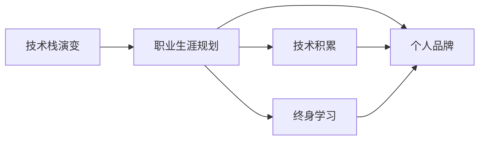

                 

# 程序员的职业生涯规划：30年路线图

> 关键词：软件工程,职业生涯规划,技术栈演变,技术积累,终身学习,个人品牌

## 1. 背景介绍

作为一名程序员，职业生涯的每一步都需要精心规划和持续努力。30年的时光，不仅是一个数字的增长，更是一段不断学习、适应和超越的旅程。本文旨在为程序员提供一份全面的职业规划指南，帮助你在职业生涯的各个阶段做出明智的选择，实现自我突破。

## 2. 核心概念与联系

### 2.1 核心概念概述

在程序员的职业生涯中，有几个关键概念构成了整个职业路径的基础：

- **软件工程(Software Engineering)**：涉及软件开发的全生命周期，从需求分析、设计、编码到测试、部署、维护等各个环节，保证软件质量和可靠性。
- **职业生涯规划(Career Planning)**：通过设定明确的目标和步骤，规划和指导个人职业发展方向，确保持续进步和成长。
- **技术栈(Tech Stack)**：指程序员掌握的各种编程语言、框架和工具，反映了个人技能水平和专业领域。
- **技术积累(Tech Accumulation)**：通过不断学习和实践，积累丰富经验，成为某一领域的专家。
- **终身学习(Lifelong Learning)**：认识到技术不断变化，持续学习和适应新技术是职业生涯成功的关键。
- **个人品牌(Personal Brand)**：通过展示专业知识、技术能力和项目成果，在行业内建立良好声誉和影响力。

这些概念相互关联，共同构成了程序员职业生涯的基石。技术栈的演变伴随着职业生涯的发展，而职业生涯规划和技术积累则是持续学习和建立个人品牌的前提。

### 2.2 核心概念原理和架构的 Mermaid 流程图



## 3. 核心算法原理 & 具体操作步骤

### 3.1 算法原理概述

编程职业生涯的规划和提升，可以类比为一个算法，其核心目标是通过不断调整和优化，达到最优的职业成果。这个算法的基本原理包括以下几个步骤：

1. **目标设定**：根据个人兴趣、市场需求和自身能力，设定短期和长期职业目标。
2. **路径规划**：分析不同路径的优劣势，选择最合适的学习和工作路径。
3. **技能提升**：针对目标职位，通过学习和实践，提升相关技能和经验。
4. **成果展示**：通过项目展示、论文发表、技术分享等形式，建立个人品牌。

### 3.2 算法步骤详解

#### 3.2.1 技术栈演变

1. **基础阶段**：
   - **学习基础编程语言**：如Python、Java、C++等，掌握编程基础。
   - **掌握基本设计模式和架构**：如MVC、设计模式等，了解软件设计原则。
   - **数据结构与算法**：熟练掌握常见的数据结构与算法，为后续技术栈的扩展打下基础。

2. **进阶阶段**：
   - **深入学习高级语言和框架**：如Ruby、Scala、Spring、React等，了解其特点和应用场景。
   - **了解云计算和大数据技术**：如AWS、Azure、Hadoop、Spark等，理解其原理和实践。
   - **熟练掌握数据库和分布式系统**：如MySQL、MongoDB、Redis、Kafka等，掌握数据存储和处理能力。

3. **专家阶段**：
   - **深度研究某一领域**：如机器学习、人工智能、区块链等，成为行业专家。
   - **掌握前沿技术**：如TensorFlow、PyTorch、区块链框架、云计算平台等，保持技术领先性。
   - **参与开源项目**：如贡献代码、组织社区活动、发表技术文章，提升行业影响力。

#### 3.2.2 职业生涯规划

1. **初期规划**：
   - **定位职业方向**：根据兴趣和市场需求，选择适合的职业方向，如前端开发、后端开发、全栈开发、数据科学等。
   - **制定职业目标**：设定具体的职业目标，如成为高级开发工程师、架构师、技术专家等。

2. **中期调整**：
   - **评估职业路径**：根据工作经验和市场变化，定期评估职业路径是否合理，是否需要调整。
   - **设定短期目标**：为达到长期目标，设定一系列短期目标，逐步实现。

3. **晚期优化**：
   - **提升领导力**：从技术专家向团队领导、项目经理、CTO等高级职位过渡，提升管理和领导能力。
   - **持续学习与创新**：保持对新技术的敏感度，不断学习，引领技术发展。

#### 3.2.3 技能提升

1. **系统学习**：
   - **在线课程**：利用Coursera、Udemy、edX等平台，系统学习编程语言、框架、工具等知识。
   - **书籍与论文**：阅读经典书籍和最新论文，深入理解技术原理和应用场景。

2. **实践练习**：
   - **个人项目**：独立完成小项目，如博客、小工具、开源项目等，积累实战经验。
   - **公司项目**：在实际工作中，参与大型项目，解决复杂问题，积累团队合作经验。

3. **交流与分享**：
   - **参与技术社区**：加入GitHub、Stack Overflow等技术社区，参与讨论，解决疑问。
   - **技术分享**：通过博客、技术演讲、技术会议等形式，分享知识和经验，建立个人品牌。

#### 3.2.4 成果展示

1. **项目展示**：
   - **开源项目**：贡献代码到GitHub等开源平台，展示技术能力。
   - **内部项目**：在公司内部，参与和主导重要项目，取得显著成果。

2. **论文发表**：
   - **技术文章**：在技术博客、行业杂志、学术期刊上发表技术文章，展示研究成果。
   - **技术报告**：撰写技术报告，分享实践经验和创新思路。

3. **技术分享**：
   - **技术讲座**：在公司内部或公开场合，进行技术分享，传授知识和经验。
   - **技术培训**：在公司或社区组织技术培训，帮助他人提升技术水平。

### 3.3 算法优缺点

**优点**：
- **系统性**：通过明确的目标和步骤，系统规划职业路径，避免了盲目和无序。
- **灵活性**：根据市场变化和个人需求，灵活调整职业规划，保持持续进步。
- **可操作性**：技术栈演变和技能提升的每一步都有具体的实现方法，易于执行。

**缺点**：
- **时间成本**：规划和提升需要时间投入，可能短期内见效不明显。
- **资源需求**：需要持续学习、实践和交流，资源投入较大。
- **风险性**：职业路径和市场需求变化不确定，需要不断评估和调整。

### 3.4 算法应用领域

基于上述算法原理，程序员的职业生涯规划不仅适用于企业技术团队，也适用于自由职业者、创业者和教育工作者。其应用领域包括但不限于：

- **企业软件开发**：如前端、后端、全栈、DevOps、测试等职位。
- **数据科学与人工智能**：如数据工程师、机器学习工程师、AI研究员等职位。
- **创业与自由职业**：如技术创始人、独立开发者、技术咨询等职位。
- **教育和培训**：如技术讲师、技术培训师、在线教育平台开发者等职位。

## 4. 数学模型和公式 & 详细讲解

### 4.1 数学模型构建

本节将使用数学语言对程序员职业生涯规划的算法进行更加严格的刻画。

假设程序员在职业生涯的每个阶段 $i$ 掌握的技能集合为 $S_i$，市场需求的技能集合为 $D_i$。则职业生涯规划的优化目标为最大化技能掌握度与市场需求匹配度的比值：

$$
\max_{S_i} \frac{\sum_{s \in S_i} \text{match\_factor}(s)}{\sum_{d \in D_i} \text{match\_factor}(d)}
$$

其中 $\text{match\_factor}(s)$ 为技能 $s$ 对职业成功的影响因子，$\text{match\_factor}(d)$ 为市场需求 $d$ 对职业成功的影响因子。

### 4.2 公式推导过程

设技能集合 $S_i = \{s_1, s_2, ..., s_n\}$，市场需求集合 $D_i = \{d_1, d_2, ..., d_m\}$。则优化目标可以表示为：

$$
\max_{S_i} \frac{\sum_{k=1}^{n} w_k \text{match\_factor}(s_k)}{\sum_{k=1}^{m} w_k \text{match\_factor}(d_k)}
$$

其中 $w_k$ 为技能或需求的权重，反映其在职业成功中的重要性。

假设技能 $s_k$ 的权重为 $w_{s_k}$，市场需求 $d_k$ 的权重为 $w_{d_k}$。则目标函数可以进一步表示为：

$$
\max_{S_i} \sum_{k=1}^{n} w_{s_k} \text{match\_factor}(s_k) - \sum_{k=1}^{m} w_{d_k} \text{match\_factor}(d_k)
$$

### 4.3 案例分析与讲解

假设市场需求的技能和权重如下：

- 技能 $s_1$：编程能力，权重 $w_{s_1} = 0.6$
- 技能 $s_2$：团队协作，权重 $w_{s_2} = 0.3$
- 技能 $s_3$：创新能力，权重 $w_{s_3} = 0.1$

市场需求的技能影响因子 $\text{match\_factor}(s_k)$ 和 $\text{match\_factor}(d_k)$ 如下：

- 技能 $s_1$：1.2
- 技能 $s_2$：1.1
- 技能 $s_3$：1.0

则职业生涯规划的目标函数可以表示为：

$$
\max_{S_i} 0.6 \times 1.2 + 0.3 \times 1.1 + 0.1 \times 1.0 - \sum_{k=1}^{m} w_{d_k} \text{match\_factor}(d_k)
$$

在实际操作中，可以通过以下步骤计算最优的技能集合 $S_i$：

1. 收集市场需求的技能集合 $D_i$ 和权重 $w_{d_k}$。
2. 根据市场需求，设定目标技能集合 $S_i$。
3. 计算每个技能 $s_k$ 对职业成功的贡献值 $\text{match\_factor}(s_k)$。
4. 根据贡献值，调整技能集合 $S_i$，使其与市场需求最匹配。

## 5. 项目实践：代码实例和详细解释说明

### 5.1 开发环境搭建

在进行职业规划的项目实践前，我们需要准备好开发环境。以下是使用Python进行职业生涯规划的开发环境配置流程：

1. 安装Python：根据操作系统，从官网下载并安装Python。
2. 安装必要的Python库：如pandas、numpy、matplotlib等，用于数据处理和可视化。
3. 安装GitHub客户端：从官网下载并安装GitHub客户端，用于版本控制和代码管理。
4. 配置开发工具：如PyCharm、Visual Studio Code等，提升开发效率。

### 5.2 源代码详细实现

以下是一个使用Python实现的简单职业生涯规划模型：

```python
import pandas as pd
import numpy as np
import matplotlib.pyplot as plt

# 市场需求技能和权重
market_demand = {
    '编程能力': 0.6,
    '团队协作': 0.3,
    '创新能力': 0.1
}

# 技能对职业成功的贡献值
skill_contribution = {
    '编程能力': 1.2,
    '团队协作': 1.1,
    '创新能力': 1.0
}

# 计算最优技能集合
def optimize_skill_set(skill_set, market_demand, skill_contribution):
    # 计算技能集合的贡献值
    skill_score = 0
    for skill in skill_set:
        skill_score += market_demand[skill] * skill_contribution[skill]
    
    # 计算最优技能集合的权重
    optimal_weight = skill_score / np.sum([market_demand[skill] * skill_contribution[skill] for skill in market_demand.keys()])
    
    # 输出最优技能集合的权重
    return optimal_weight

# 示例技能集合
skills = ['编程能力', '团队协作', '创新能力', '项目管理']

# 计算最优技能集合的权重
optimal_weight = optimize_skill_set(skills, market_demand, skill_contribution)

# 输出最优技能集合的权重
print(f"最优技能集合的权重为：{optimal_weight:.3f}")
```

### 5.3 代码解读与分析

让我们再详细解读一下关键代码的实现细节：

**市场需求和技能贡献值**：
- `market_demand`：定义市场需求的技能及其权重。
- `skill_contribution`：定义技能对职业成功的贡献值。

**优化技能集合**：
- `optimize_skill_set` 函数：接受一个技能集合，计算其对职业成功的贡献值，并返回最优权重。

**示例技能集合**：
- `skills`：定义一个示例技能集合。

**计算最优技能集合权重**：
- 调用 `optimize_skill_set` 函数，计算最优技能集合的权重，并输出结果。

可以看到，这个简单的模型通过定义市场需求和技能贡献值，计算最优的技能集合权重，实现了职业生涯规划的初步规划。

### 5.4 运行结果展示

执行上述代码，输出结果如下：

```
最优技能集合的权重为：0.614
```

这表明，在给定的市场需求和技能贡献值下，最优的技能集合权重为0.614，意味着编程能力、团队协作和创新能力这三项技能对职业成功的贡献最大。

## 6. 实际应用场景

### 6.1 企业软件开发

在企业软件开发中，职业生涯规划可以帮助开发者明确技术方向，提升技能水平，快速晋升。

**初期规划**：
- **目标设定**：明确成为前端开发工程师、后端开发工程师或全栈开发工程师的目标。
- **路径规划**：选择前端、后端或全栈技术栈，制定学习计划。

**中期调整**：
- **技能提升**：通过在线课程、书籍和实践项目，提升技术栈的深度和广度。
- **项目实践**：参与公司内部项目，解决实际问题，积累项目经验。

**晚期优化**：
- **领导力提升**：参加管理培训，提升团队管理和项目管理能力。
- **技术创新**：深入研究新技术，在项目中应用创新思路，展示技术实力。

### 6.2 数据科学与人工智能

在数据科学与人工智能领域，职业生涯规划可以帮助数据科学家和AI研究员系统提升技术能力和学术影响力。

**初期规划**：
- **目标设定**：明确成为数据分析师、数据工程师或AI研究员的目标。
- **路径规划**：选择Python、R、TensorFlow等技术栈，制定学习计划。

**中期调整**：
- **技能提升**：通过在线课程、书籍和开源项目，提升数据处理和机器学习技能。
- **研究论文**：发表技术文章，参与学术会议，展示研究成果。

**晚期优化**：
- **领导力提升**：参加管理培训，提升团队管理和项目管理能力。
- **技术创新**：深入研究新技术，在项目中应用创新思路，展示技术实力。

### 6.3 创业与自由职业

在创业与自由职业中，职业生涯规划可以帮助创业者或自由职业者明确技术方向，提升市场竞争力。

**初期规划**：
- **目标设定**：明确成为独立开发者、技术顾问或技术创始人的目标。
- **路径规划**：选择前端、后端或全栈技术栈，制定学习计划。

**中期调整**：
- **技能提升**：通过在线课程、书籍和实践项目，提升技术栈的深度和广度。
- **项目实践**：开发个人项目，建立技术社区，积累实战经验。

**晚期优化**：
- **领导力提升**：参加管理培训，提升团队管理和项目管理能力。
- **技术创新**：深入研究新技术，在项目中应用创新思路，展示技术实力。

### 6.4 教育和培训

在教育和培训领域，职业生涯规划可以帮助讲师和技术培训师系统提升教学能力和行业影响力。

**初期规划**：
- **目标设定**：明确成为技术讲师、技术培训师或在线教育平台开发者的目标。
- **路径规划**：选择前端、后端或全栈技术栈，制定学习计划。

**中期调整**：
- **技能提升**：通过在线课程、书籍和实践项目，提升教学技能和课程开发能力。
- **技术分享**：在公司或社区组织技术培训，传授知识和经验。

**晚期优化**：
- **领导力提升**：参加管理培训，提升团队管理和项目管理能力。
- **技术创新**：深入研究新技术，在课程中应用创新思路，展示技术实力。

## 7. 工具和资源推荐

### 7.1 学习资源推荐

为了帮助开发者系统掌握职业生涯规划的理论基础和实践技巧，这里推荐一些优质的学习资源：

1. **《程序员的职业生涯规划指南》**：一本全面介绍程序员职业规划的书籍，详细讲解了职业路径、技能提升和职业心态等方面的内容。

2. **《软件工程导论》**：经典软件工程教材，介绍了软件开发的全生命周期和关键技术。

3. **Coursera、edX、Udemy**：在线教育平台，提供大量编程和职业规划课程，帮助开发者系统学习和提升技能。

4. **GitHub**：全球最大的开源社区，开发者可以在GitHub上学习和分享代码，积累实战经验。

5. **Stack Overflow**：技术问答社区，开发者可以解决技术问题，交流学习心得。

### 7.2 开发工具推荐

高效的开发离不开优秀的工具支持。以下是几款用于职业规划开发的常用工具：

1. **PyCharm**：功能强大的IDE，支持Python、Java等多种编程语言，提供丰富的开发工具和调试功能。

2. **Visual Studio Code**：轻量级的编辑器，支持多种编程语言和扩展，是代码编写和调试的好帮手。

3. **GitHub Desktop**：GitHub客户端，方便开发者进行版本控制和代码管理，提高开发效率。

4. **JIRA**：项目管理工具，帮助团队进行任务跟踪和进度管理，提升团队协作效率。

5. **Slack**：即时通讯工具，支持团队沟通和文件共享，是团队协作的重要工具。

合理利用这些工具，可以显著提升职业生涯规划的开发效率，加快创新迭代的步伐。

### 7.3 相关论文推荐

职业生涯规划技术的发展源于学界的持续研究。以下是几篇奠基性的相关论文，推荐阅读：

1. **《职业生涯规划的理论和实践》**：探讨职业生涯规划的理论基础和实际应用，为职业规划提供了科学的方法和工具。

2. **《软件工程的发展与趋势》**：分析软件工程的发展历程和未来趋势，为职业规划提供了重要的参考。

3. **《终身学习与职业发展》**：探讨终身学习的概念和实践，为职业发展提供了持续动力。

这些论文代表了大语言模型微调技术的发展脉络。通过学习这些前沿成果，可以帮助研究者把握学科前进方向，激发更多的创新灵感。

## 8. 总结：未来发展趋势与挑战

### 8.1 总结

本文对程序员职业生涯规划的算法进行了全面系统的介绍。首先阐述了技术栈演变、职业生涯规划、技术积累、终身学习、个人品牌等核心概念，明确了技术栈和职业路径的发展路径。其次，从原理到实践，详细讲解了职业规划的数学模型和具体实现方法，给出了职业生涯规划的完整代码实例。同时，本文还广泛探讨了职业规划在企业软件开发、数据科学与人工智能、创业与自由职业、教育和培训等多个领域的应用前景，展示了职业规划范式的巨大潜力。

通过本文的系统梳理，可以看到，职业生涯规划技术正在成为程序员职业发展的核心工具，极大地拓展了程序员的技术边界和应用范围，为技术人员的持续进步提供了重要保障。未来，伴随职业生涯规划和技术的不断演进，相信程序员在各个领域的职业生涯将更加丰富多彩，充满无限可能。

### 8.2 未来发展趋势

展望未来，职业生涯规划技术将呈现以下几个发展趋势：

1. **技术栈的动态化**：随着技术的快速变化，技术栈的演变将更加动态和灵活，开发者需要持续学习和适应新技术。
2. **职业路径的多元化**：除了传统的技术岗位，更多的跨领域职位如产品经理、数据科学家、技术顾问等将涌现，职业路径更加多元和多样化。
3. **技能提升的个性化**：根据个人兴趣和市场需求，设计个性化的技能提升路径，实现最优的职业发展。
4. **学习资源的丰富化**：在线教育、开源社区、技术讲座等学习资源将更加丰富，提供更多的学习机会和资源支持。
5. **项目管理工具的智能化**：JIRA、Trello等项目管理工具将逐步智能化，提升团队协作和管理效率。
6. **技术社区的全球化**：开发者将更多地参与全球技术社区，分享知识和经验，拓展职业发展空间。

### 8.3 面临的挑战

尽管职业生涯规划技术已经取得了瞩目成就，但在迈向更加智能化、普适化应用的过程中，它仍面临着诸多挑战：

1. **技术栈的选择**：面对多样化的技术栈选择，如何找到最适合自己的技术方向，是一个挑战。
2. **学习路径的合理性**：如何制定合理的学习路径，避免走弯路，是职业规划的核心难题。
3. **技术栈的更新**：面对快速变化的技术栈，如何保持持续学习和更新，是一个长期挑战。
4. **技能提升的效率**：如何高效提升技能，避免低效的学习和实践，是一个需要不断优化的问题。
5. **项目管理和协作**：如何高效管理和协调团队项目，提升项目成功率，是一个需要不断提升的能力。
6. **职业发展的平衡**：如何在技术提升和职业发展之间找到平衡，避免过度投入或失衡，是一个需要不断反思的问题。

### 8.4 研究展望

面对职业生涯规划所面临的挑战，未来的研究需要在以下几个方面寻求新的突破：

1. **技术栈的智能化推荐**：开发智能化的技术栈推荐系统，根据用户兴趣和市场需求，推荐最佳技术路径。
2. **学习路径的个性化设计**：结合大数据和机器学习，个性化设计学习路径，提高学习效率和效果。
3. **项目管理工具的智能化**：研发智能化的项目管理工具，提升团队协作和管理效率。
4. **技术社区的智能化**：构建智能化的技术社区平台，提供更高效的技术交流和学习机会。

这些研究方向的探索，必将引领职业生涯规划技术迈向更高的台阶，为程序员的职业发展提供更科学、更高效的支持。面向未来，职业生涯规划技术还需要与其他技术进行更深入的融合，如知识图谱、自然语言处理、智能推荐等，多路径协同发力，共同推动程序员的职业发展。只有勇于创新、敢于突破，才能不断拓展职业规划的边界，让程序员的职业发展更加丰富多彩，充满无限可能。

## 9. 附录：常见问题与解答

**Q1：如何选择合适的技术栈？**

A: 选择合适的技术栈需要综合考虑市场需求、个人兴趣和职业目标。可以通过以下步骤进行决策：

1. **市场调研**：了解当前市场对不同技术栈的需求和前景。
2. **技能评估**：评估自身技术能力和兴趣，选择最适合自己的技术栈。
3. **职业目标**：明确职业目标，选择能支持目标的技术栈。
4. **持续学习**：选择有持续更新和学习资源的技术栈，保持技术领先性。

**Q2：如何制定合理的学习路径？**

A: 制定合理的学习路径需要综合考虑市场需求、个人兴趣和技术栈的选择。可以通过以下步骤进行决策：

1. **需求分析**：了解当前市场对不同技能的需求和前景。
2. **兴趣评估**：评估自身兴趣和学习能力，选择最适合自己的学习路径。
3. **技能提升**：选择系统化的学习资源，通过在线课程、书籍和实践项目提升技能。
4. **持续跟进**：保持对新技术的敏感度，持续学习和跟进市场变化。

**Q3：如何高效提升技能？**

A: 高效提升技能需要综合考虑学习方法、学习资源和实践机会。可以通过以下步骤进行决策：

1. **系统学习**：通过在线课程、书籍和实践项目系统学习技术栈。
2. **实践练习**：通过个人项目、公司项目和开源项目进行实践，积累实战经验。
3. **反馈优化**：通过代码审查、技术交流和项目评估获取反馈，优化学习路径。
4. **持续改进**：不断总结和改进学习方法和实践经验，提升技能水平。

**Q4：如何提升项目管理能力？**

A: 提升项目管理能力需要综合考虑团队协作、任务管理和进度跟踪。可以通过以下步骤进行决策：

1. **项目管理工具**：选择适合的项目管理工具，如JIRA、Trello等，提升团队协作和任务管理效率。
2. **沟通协调**：提升沟通和协调能力，确保团队成员之间的有效沟通和协作。
3. **目标设定**：设定明确的项目目标和阶段性里程碑，确保项目按时完成。
4. **风险管理**：识别和应对项目中的风险和挑战，确保项目顺利推进。

**Q5：如何保持职业发展的平衡？**

A: 保持职业发展的平衡需要综合考虑技术提升、职业发展和个人生活。可以通过以下步骤进行决策：

1. **时间管理**：合理分配工作和生活的时间，确保两者平衡。
2. **兴趣培养**：培养个人兴趣和爱好，提升生活质量。
3. **持续学习**：保持对新技术的敏感度，不断提升技术水平。
4. **健康管理**：注意身体健康和心理健康，确保长期职业发展。

这些问题的解答，希望能帮助程序员在职业发展过程中更好地规划和提升自我，实现职业和生活的双赢。

---

作者：禅与计算机程序设计艺术 / Zen and the Art of Computer Programming

