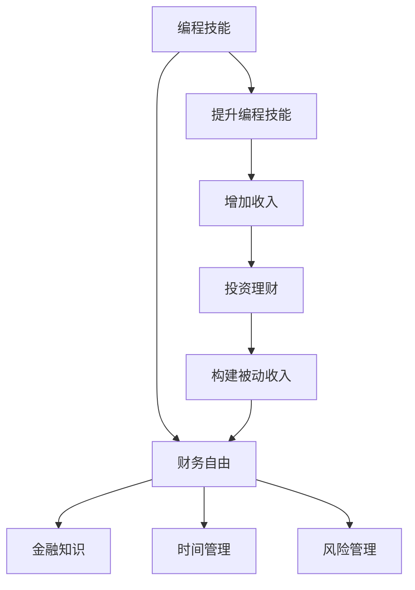

                 

# 程序员的财务自由：从省钱到赚钱的思维转变

## 1. 背景介绍

### 1.1 问题由来
在快节奏的互联网行业中，程序员作为技术创新的中坚力量，面临着巨大的职业压力。高强度的工作、低薪资、长时间加班、工作压力大等现象普遍存在，许多程序员梦想能够实现财务自由，追求更好的生活质量。但受限于编程技能和金融知识的缺乏，很多人难以摆脱困境。

程序员如何通过提高自身技能，调整工作与生活的平衡，有效利用个人资源，实现财务自由，已成为当前技术人员面临的一个重要问题。本文将从几个关键方面，深入探讨程序员如何转变思维，实现从省钱到赚钱的思维转变。

## 2. 核心概念与联系

### 2.1 核心概念概述

在进行思维转变前，我们需要理解以下核心概念及其内在联系：

- **财务自由**：指个人或家庭的收入不再依赖于工作，通过被动收入实现财务独立。
- **编程技能**：程序员的核心竞争力，包括编程语言、算法设计、系统架构等。
- **金融知识**：了解财务规划、投资、税务等基本概念，是实现财务自由的关键。
- **时间管理**：合理安排时间，平衡工作与生活，提高个人效率。
- **风险管理**：识别风险并采取相应措施，保障财务安全。

这些概念相互作用，共同构成程序员实现财务自由的思维框架。通过提高编程技能和金融知识，合理管理时间和风险，程序员可以逐步构建被动收入体系，实现财务自由。

### 2.2 核心概念原理和架构的 Mermaid 流程图



这个流程图展示了程序员通过提升编程技能，增加收入，进而通过金融知识、时间管理和风险管理，构建被动收入体系，最终实现财务自由的过程。

## 3. 核心算法原理 & 具体操作步骤

### 3.1 算法原理概述

实现财务自由的过程，可以视作一个目标导向的算法过程。其核心目标是通过优化个人资源，最大化收入，构建被动收入流，实现财务独立。具体步骤包括：

1. **提升编程技能**：通过持续学习新技术、参加培训、实践项目等方式，提升自身编程能力，增加市场竞争力。
2. **增加收入**：通过副业、开源项目、技术咨询等方式，扩大收入来源。
3. **投资理财**：选择合适的投资方式，构建多元化的投资组合，实现财富增值。
4. **构建被动收入**：通过股票、基金、房地产等形式，构建长期稳定的被动收入流。
5. **实现财务自由**：通过合理管理财务，实现被动收入大于等于总支出，实现财务自由。

### 3.2 算法步骤详解

#### 步骤 1: 提升编程技能

**具体步骤**：

- 制定学习计划：确定需要提升的技能，制定具体学习目标和时间安排。
- 利用在线资源：通过Coursera、Udacity、edX等平台，参加编程课程和专业培训。
- 参与开源项目：积极参与GitHub等平台上的开源项目，提升实战经验和协作能力。
- 实践项目：通过参与企业内部项目、个人项目或创业项目，将所学知识应用于实际场景。

**效果分析**：

通过提升编程技能，可以拓展职业发展路径，增加收入来源，同时为更高层次的财务自由打下坚实基础。

#### 步骤 2: 增加收入

**具体步骤**：

- 副业：利用编程技能，承接外包项目、开发软件应用、提供技术咨询等。
- 开源项目：通过GitHub等平台展示技术能力，获得社区支持和资金资助。
- 内容创作：通过写博客、录制视频、开技术讲座等方式，提升个人品牌影响力。
- 创业项目：利用自身技术优势，开发市场前景好、需求大的产品，实现快速增值。

**效果分析**：

通过副业和开源项目，程序员能够增加收入来源，同时提升自身影响力，为未来的投资和创业积累资金和资源。

#### 步骤 3: 投资理财

**具体步骤**：

- 学习金融知识：通过书籍、课程、投资顾问等方式，学习基本的金融知识，了解投资工具和策略。
- 风险评估：根据自身风险承受能力，选择适合自己的投资方式，如股票、基金、债券等。
- 分散投资：通过多元化投资组合，分散风险，实现长期稳定的财富增值。
- 定期调整：根据市场变化和个人情况，定期调整投资策略，优化资产配置。

**效果分析**：

通过科学合理的投资理财，程序员可以将所赚资金增值，构建长期稳定的被动收入流，为实现财务自由提供保障。

#### 步骤 4: 构建被动收入

**具体步骤**：

- 股票投资：通过购买优质公司的股票，获取股息和股价增值收益。
- 基金投资：选择低费用的指数基金或优秀的主动管理基金，实现长期资本增值。
- 房地产投资：购买出租房产或参与房地产基金，获取稳定的租金收入。
- 版权收益：通过技术发明、软件开发等方式，获取知识产权收益。

**效果分析**：

通过构建多元化的被动收入来源，程序员可以实现无需工作即可持续收入，逐步实现财务自由。

#### 步骤 5: 实现财务自由

**具体步骤**：

- 评估净值：定期评估个人或家庭的资产负债情况，了解净资产水平。
- 控制支出：制定合理的预算计划，控制不必要的开支，优化消费结构。
- 保险规划：购买健康保险、意外保险等，保障自身和家庭的财务安全。
- 持续优化：根据个人情况和市场变化，不断调整财务策略，保持财务健康。

**效果分析**：

通过合理管理财务，程序员可以实现被动收入大于等于总支出，最终实现财务自由。

### 3.3 算法优缺点

**优点**：

- 最大化利用自身技能：通过提升编程技能和增加收入来源，最大化发挥个人优势。
- 多元化投资组合：通过分散投资，降低风险，实现长期稳定的财富增值。
- 灵活性和可控性：根据个人情况和市场变化，灵活调整财务策略，保持财务健康。

**缺点**：

- 时间和精力投入：需要投入大量时间和精力进行学习、实践和投资，初期可能效果不明显。
- 市场波动风险：投资市场存在不确定性，可能导致投资亏损。
- 风险管理难度：需要具备一定的金融知识和风险管理能力，否则可能陷入财务困境。

### 3.4 算法应用领域

编程技能和财务自由的思想，不仅适用于传统软件开发领域，还可以应用到以下几个领域：

- **数据分析**：利用数据分析技能，通过可视化、模型构建等方式，帮助企业决策，增加收入来源。
- **人工智能**：结合人工智能技术，开发智能系统或应用，创造新的商业机会。
- **区块链**：利用区块链技术，参与数字货币、智能合约等项目，获取高额回报。
- **物联网**：开发物联网设备或平台，实现智能化应用，拓展市场空间。
- **网络安全**：提供网络安全解决方案和服务，满足企业安全需求，增加收入。

## 4. 数学模型和公式 & 详细讲解 & 举例说明

### 4.1 数学模型构建

设个人每月总支出为C，每月收入为I，被动收入为P，设T为实现财务自由所需的月数。根据财务自由定义，有：

$$ P \geq C $$

要计算实现财务自由所需的时间T，可以将每月收入和支出带入公式，进行迭代计算：

$$ T = \frac{C}{P-I} $$

### 4.2 公式推导过程

将公式展开，得到：

$$ T = \frac{C}{P} + \frac{C}{I} $$

其中，$\frac{C}{P}$为实现财务自由所需的生活月数，$\frac{C}{I}$为达到被动收入覆盖总支出的年数。

### 4.3 案例分析与讲解

假设某程序员每月总支出为C=5000元，每月收入为I=15000元，被动收入为P=8000元，代入公式计算：

$$ T = \frac{5000}{8000} + \frac{5000}{15000} = 0.625 + 0.333 = 0.958 $$

因此，该程序员需要9.58个月（约1年）的被动收入才能实现财务自由。

## 5. 项目实践：代码实例和详细解释说明

### 5.1 开发环境搭建

在进行项目实践前，需要搭建相应的开发环境。以下是使用Python进行开发的详细流程：

1. 安装Anaconda：从官网下载并安装Anaconda，用于创建独立的Python环境。

2. 创建并激活虚拟环境：
```bash
conda create -n finance_env python=3.8 
conda activate finance_env
```

3. 安装相关库：
```bash
conda install numpy pandas matplotlib scikit-learn 
pip install portfolio_optimizer quandl yfinance
```

### 5.2 源代码详细实现

下面以股票投资为例，展示如何使用Python进行财务自由计算和模拟。

```python
import numpy as np
from portfolio_optimizer import PortfolioOptimizer
from quandl import QNDL

# 初始化Quandl API
qndl = QNDL('MKT-USD')

# 设定月度数据
monthly_data = qndl.get('WIKI/MSFT')

# 设定年化收益率
annual_return = 0.05

# 计算月度收益率
monthly_return = annual_return ** (1/12)

# 计算预期被动收入
expected_income = 8000

# 计算年化收入
annual_income = monthly_income * 12

# 计算总支出
total_expense = 5000

# 计算每月净收入
monthly_net_income = annual_income - total_expense

# 计算达到财务自由所需的月数
months_to_freedom = total_expense / expected_income

# 输出结果
print(f"每月净收入: {monthly_net_income}")
print(f"实现财务自由所需月数: {months_to_freedom}")
```

### 5.3 代码解读与分析

这段代码通过Quandl API获取股票价格数据，计算年化收益率和被动收入，进而计算每月净收入和实现财务自由所需的月数。通过这个简单的示例，可以看出Python在财务自由计算中的应用。

## 6. 实际应用场景

### 6.1 个人理财

在个人理财方面，程序员可以通过编程技能和金融知识，实现以下功能：

- **投资组合优化**：通过PortfolioOptimizer等库，对股票、基金、债券等资产进行优化配置，实现收益最大化和风险分散。
- **自动化交易**：使用Alpha Vantage、Yahoo Finance等API获取实时市场数据，编写自动化交易脚本，实现自动买卖。
- **财务数据分析**：利用Pandas和Matplotlib等库，对个人财务数据进行可视化分析和趋势预测，优化财务决策。

### 6.2 企业财务规划

在企业财务规划方面，程序员可以通过编程技能和金融知识，实现以下功能：

- **财务报表分析**：开发财务报表分析工具，帮助企业分析财务状况和盈利能力，提出改进建议。
- **预算编制**：利用Excel或Python脚本，实现企业预算编制和自动更新，提升预算管理效率。
- **税务优化**：通过编写税法解析程序，帮助企业合规避税，降低税收成本。

### 6.3 创业公司财务管理

在创业公司财务管理方面，程序员可以通过编程技能和金融知识，实现以下功能：

- **融资方案设计**：开发融资模型，帮助创业公司制定最优的融资方案，获取最大化的资金支持。
- **估值计算**：编写估值工具，根据公司财务数据和市场情况，计算合理估值。
- **财务风险管理**：通过构建财务预警系统，实时监控公司财务状况，防范财务风险。

## 7. 工具和资源推荐

### 7.1 学习资源推荐

为了帮助程序员系统掌握编程技能和金融知识，推荐以下学习资源：

1. **Python编程**：《Python编程：从入门到实践》（Eric Matthes）、《流畅的Python》（Luciano Ramalho）。
2. **金融知识**：《投资学》（Zvi Bodie）、《金融工程与风险管理》（Damiano Brigo）。
3. **数据分析**：《Python数据科学手册》（Jake VanderPlas）、《R语言实战》（Robert Kabacoff）。
4. **股票投资**：《聪明的投资者》（本杰明·格雷厄姆）、《随机漫步的傻瓜》（伯顿·马尔基尔）。
5. **创业指导**：《精益创业》（埃里克·莱斯）、《创业维艰》（本·霍洛维茨）。

### 7.2 开发工具推荐

1. **Python IDE**：PyCharm、Visual Studio Code等。
2. **数据处理**：Pandas、NumPy、SciPy等。
3. **金融库**：Yahoo Finance API、Alpha Vantage API、Quandl API等。
4. **投资库**：PortfolioOptimizer、Zipline等。
5. **可视化工具**：Matplotlib、Seaborn、Plotly等。

### 7.3 相关论文推荐

1. **投资组合优化**：
   - Markowitz, H. (1952) "Portfolio Selection." The Journal of Finance 17(1), 77-91.
   - Elton, E.J., Gruber, M.J., & Brown, S.S. (2009) "Modern Portfolio Theory and Investment Analysis" 6th ed.
   
2. **自动交易策略**：
   - Goetzmann, W.N., & Uppal, R. (2014) "The Economics of Automated Trading: Evidence from Futures Contracts." Journal of Financial Economics 111(3), 564-588.
   - Egloff, J., & Pedersen, L.H. (2004) "Algorithmic Trading: The Economic Evidence." The Journal of Finance 59(4), 1651-1696.

## 8. 总结：未来发展趋势与挑战

### 8.1 研究成果总结

本文详细探讨了程序员实现财务自由的方法和策略，从提升编程技能、增加收入、投资理财、构建被动收入等角度，提供了实用的技术和工具推荐。通过这些方法和策略，程序员可以逐步构建自己的财务自由体系，实现从省钱到赚钱的思维转变。

### 8.2 未来发展趋势

未来，程序员的财务自由实现将呈现以下趋势：

1. **编程技能更加多样**：随着新技术不断涌现，程序员需要掌握更多技能，如机器学习、区块链、人工智能等，以应对行业变化。
2. **金融知识普及**：随着金融科技的发展，金融知识将变得更加普及和易得，更多程序员将具备良好的财务规划能力。
3. **自动化工具普及**：自动化工具将大大降低投资和理财的门槛，更多程序员可以通过脚本和API实现财务管理。
4. **被动收入多样化**：除了传统的股票、基金等，越来越多的被动收入形式将出现，如数字资产、版权收益等。
5. **个性化财务管理**：基于人工智能的个性化财务管理工具将进一步发展，帮助程序员实现更高效的财务规划。

### 8.3 面临的挑战

尽管财务自由在技术上可实现，但在实际操作中也面临诸多挑战：

1. **技术门槛高**：需要具备较强的编程和金融知识，部分门槛较高的技术可能难以掌握。
2. **市场风险高**：投资市场存在不确定性，可能导致财务损失。
3. **时间成本高**：需要投入大量时间和精力进行财务管理和投资，初期可能效果不明显。
4. **情感管理难**：实现财务自由需要较强的自律和控制力，部分人可能难以坚持。
5. **社会认知偏差**：一些人可能对编程和投资存在偏见，认为不具有一技之长。

### 8.4 研究展望

未来，程序员财务自由的研究方向将涵盖以下几方面：

1. **编程与金融融合**：探讨编程技能和金融知识的有机结合，形成更完整的财务自由体系。
2. **自动化与智能化**：利用人工智能技术，实现自动化和智能化的财务管理和投资。
3. **风险管理**：研究高效的风险评估和应对策略，降低投资风险。
4. **个性化解决方案**：根据不同人群的特点，定制化财务自由解决方案。
5. **跨领域应用**：将财务自由方法应用于更多行业，推动其他领域的变革。

## 9. 附录：常见问题与解答

**Q1: 程序员如何通过提升编程技能实现财务自由？**

A: 提升编程技能可以通过以下几个步骤：

1. 制定学习计划，明确目标和时间安排。
2. 利用在线资源，参加相关课程和培训。
3. 参与开源项目，积累实战经验和协作能力。
4. 实践项目，将所学知识应用于实际场景。
5. 持续学习，跟上技术发展趋势。

**Q2: 如何进行投资理财？**

A: 投资理财可以按照以下步骤进行：

1. 学习金融知识，了解投资工具和策略。
2. 评估风险，选择适合自己的投资方式。
3. 分散投资，降低风险，实现长期增值。
4. 定期调整，优化资产配置。

**Q3: 如何构建被动收入流？**

A: 构建被动收入流可以通过以下方式：

1. 股票投资，获取股息和股价增值收益。
2. 基金投资，实现长期资本增值。
3. 房地产投资，获取稳定的租金收入。
4. 版权收益，通过技术发明或软件开发获取知识产权收益。

**Q4: 如何实现财务自由？**

A: 实现财务自由可以按照以下步骤：

1. 评估净值，了解财务状况。
2. 控制支出，优化消费结构。
3. 购买保险，保障财务安全。
4. 持续优化，保持财务健康。

**Q5: 如何评估投资回报率？**

A: 投资回报率可以通过以下公式计算：

$$ ROI = \frac{投资收益 - 投资成本}{投资成本} \times 100\% $$

例如，投资某股票1万元，一年后收益5000元，投资回报率为：

$$ ROI = \frac{5000}{10000} \times 100\% = 50\% $$

总之，程序员通过不断提升编程技能和金融知识，合理管理财务，可以逐步实现财务自由，享受到技术带来的财务自由和生活的自由。未来，随着技术的进步和社会的变迁，程序员的财务自由之路将变得更加光明和广阔。

---

作者：禅与计算机程序设计艺术 / Zen and the Art of Computer Programming

