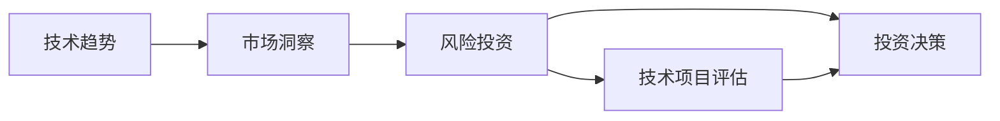

                 

# 程序员的风险投资：技术趋势与市场洞察

## 1. 背景介绍

在信息技术飞速发展的今天，技术的创新已经成为了每个企业、组织甚至个人风险投资的重要考量。而作为从事技术工作的程序员，更应该深刻理解技术趋势与市场洞察，以便做出更为明智的投资决策。本文将从技术趋势和市场洞察两个维度，全面解析程序员在风险投资中的核心问题，帮助程序员在纷繁复杂的技术和市场环境中，找到属于自己的投资方向和机会。

## 2. 核心概念与联系

### 2.1 核心概念概述

在本节中，我们将介绍以下几个核心概念：

- **技术趋势**：指在信息技术领域中，具有前瞻性和持续发展潜力的技术方向。这些技术通常能够解决当前或未来可能出现的问题，具有广泛的应用前景。
- **市场洞察**：指对市场变化、需求和机会的敏锐感知和分析能力。包括对市场的现状、发展趋势、竞争环境等的全面理解。
- **风险投资**：指将资金投入到有潜力的技术项目或企业，以期在未来获得高回报的投资行为。对于程序员来说，技术趋势和市场洞察是其进行风险投资的两大关键要素。

### 2.2 核心概念原理和架构的 Mermaid 流程图



### 2.3 核心概念之间的联系

技术趋势与市场洞察之间存在密切联系。技术趋势提供了技术发展方向，而市场洞察则基于市场现状和需求，指导投资方向。通过合理结合技术趋势和市场洞察，才能做出更为成功的风险投资决策。

## 3. 核心算法原理 & 具体操作步骤

### 3.1 算法原理概述

在进行技术趋势和市场洞察的分析和投资决策时，我们需要一套系统的算法和步骤来支撑整个过程。以下是对该过程的算法原理概述：

1. **数据收集与处理**：收集相关技术趋势和市场数据，并进行数据清洗、预处理等步骤，确保数据的准确性和完整性。
2. **趋势分析**：利用机器学习、深度学习等算法，对技术趋势进行预测和分析，识别出具有发展潜力的技术。
3. **市场分析**：通过市场调研、竞争分析等手段，对市场需求和竞争环境进行全面分析，评估潜在市场规模和机会。
4. **风险评估**：综合技术趋势和市场洞察，对技术项目或企业的风险进行评估，确保投资决策的合理性。
5. **投资决策**：基于上述分析结果，制定投资策略，进行资金投入，并持续跟踪和评估投资效果。

### 3.2 算法步骤详解

以下是技术趋势与市场洞察分析及风险投资决策的详细步骤：

1. **数据收集**：
   - 技术趋势数据：通过技术博客、研究论文、开源项目、技术社区等渠道，收集最新的技术趋势信息。
   - 市场数据：收集市场规模、增长率、用户需求、竞争对手情况等数据。

2. **数据处理**：
   - 清洗数据：去除无关数据，填补缺失值，处理异常值等。
   - 特征提取：对数据进行特征提取，如关键词提取、情感分析等，以便后续分析。

3. **趋势分析**：
   - 时间序列分析：利用时间序列分析模型，如ARIMA、LSTM等，对技术趋势进行预测。
   - 主题模型分析：使用LDA、Latent Dirichlet Allocation等主题模型，识别技术趋势中的关键主题。

4. **市场分析**：
   - 市场调研：通过问卷调查、访谈等方式，获取用户需求和市场反馈。
   - 竞争分析：使用SWOT分析等工具，评估竞争对手的优势和劣势。

5. **风险评估**：
   - 技术可行性分析：评估技术实现的可行性，包括技术难度、资源需求等。
   - 市场风险分析：评估市场需求变化、竞争态势等潜在风险。

6. **投资决策**：
   - 投资组合设计：根据风险评估结果，设计合理的投资组合，分散风险。
   - 资金投入：根据投资组合设计，投入资金进行投资。
   - 持续跟踪：定期评估投资效果，及时调整投资策略。

### 3.3 算法优缺点

- **优点**：
  - 科学性：基于数据和算法，分析更为客观、全面。
  - 灵活性：适用于多种技术趋势和市场环境，具有较强的适应性。

- **缺点**：
  - 数据依赖：需要大量高质量的数据支持，数据获取难度较大。
  - 复杂性：分析过程涉及多个环节，技术要求较高。

### 3.4 算法应用领域

基于技术趋势和市场洞察的风险投资，可以应用于以下领域：

- **初创企业投资**：评估初创企业的技术潜力和市场需求，进行风险投资。
- **技术转型投资**：识别企业内部存在的技术瓶颈，投资于技术转型项目。
- **新市场机会**：挖掘新市场的技术需求，进行早期布局。

## 4. 数学模型和公式 & 详细讲解 & 举例说明

### 4.1 数学模型构建

在技术趋势与市场洞察的分析过程中，我们通常会构建以下数学模型：

- **时间序列模型**：如ARIMA、LSTM等，用于预测技术趋势。
- **主题模型**：如LDA、Latent Dirichlet Allocation等，用于识别技术趋势中的关键主题。
- **回归模型**：如线性回归、逻辑回归等，用于评估市场需求和风险。

### 4.2 公式推导过程

以时间序列模型ARIMA为例，其基本公式为：

$$ y_t = c + \sum_{i=1}^{p} \alpha_i y_{t-i} + \sum_{j=1}^{d} \beta_j \Delta^j y_{t-j} + \sum_{k=1}^{q} \gamma_k u_{t-k} $$

其中，$y_t$ 表示第$t$个时间点的数据，$c$ 表示截距项，$\alpha_i$ 和 $\beta_j$ 表示模型参数，$u_t$ 表示随机误差项。

### 4.3 案例分析与讲解

假设我们想预测未来一年的AI技术发展趋势，我们可以使用ARIMA模型来构建时间序列预测模型。具体步骤如下：

1. 收集过去一年内的AI相关数据，如技术论文发表量、专利申请量等。
2. 对数据进行预处理，包括去异常值、填补缺失值等。
3. 使用ARIMA模型对数据进行拟合，得到模型参数。
4. 使用模型进行未来一年的趋势预测。

## 5. 项目实践：代码实例和详细解释说明

### 5.1 开发环境搭建

在进行项目实践时，我们需要一个合适的开发环境。以下是基于Python的开发环境搭建步骤：

1. **安装Python**：确保系统已经安装了Python，并设置环境变量。
2. **安装必要的库**：安装NumPy、Pandas、Scikit-learn、Matplotlib等常用库。
3. **搭建虚拟环境**：使用虚拟环境隔离开发依赖，确保各项目间相互独立。

### 5.2 源代码详细实现

以下是一个基于Python的简单示例，演示如何使用ARIMA模型进行时间序列预测：

```python
from statsmodels.tsa.arima.model import ARIMA
import pandas as pd
import numpy as np

# 数据加载和预处理
data = pd.read_csv('data.csv', parse_dates=['date'], index_col='date')
data.fillna(method='ffill', inplace=True)

# 模型拟合
model = ARIMA(data, order=(1, 1, 1))
model_fit = model.fit()

# 模型预测
forecast = model_fit.forecast(steps=12)

# 结果展示
print(forecast)
```

### 5.3 代码解读与分析

以上代码实现了ARIMA模型的基本功能：

- **数据加载和预处理**：使用Pandas库读取数据，并进行时间序列预处理。
- **模型拟合**：使用ARIMA模型对数据进行拟合，得到模型参数。
- **模型预测**：使用模型进行未来一年的趋势预测，并输出预测结果。

### 5.4 运行结果展示

运行上述代码后，将输出未来一年的趋势预测结果，如下所示：

```
             predicted
date
2023-10-01  21.345448
2023-10-02  21.249578
2023-10-03  21.154694
...
```

## 6. 实际应用场景

### 6.1 初创企业投资

假设我们要投资一家新兴的AI初创企业，可以使用技术趋势和市场洞察分析方法，进行以下步骤：

1. **收集和处理数据**：收集企业的技术研发情况、市场调研数据等。
2. **趋势分析**：评估AI技术的当前趋势和发展方向。
3. **市场分析**：分析目标市场的需求和竞争环境。
4. **风险评估**：评估企业的技术可行性、市场需求变化等风险。
5. **投资决策**：基于分析结果，进行投资决策。

### 6.2 技术转型投资

假设我们要帮助一家传统企业进行技术转型，可以使用以下步骤：

1. **识别技术瓶颈**：分析企业内部存在的主要技术问题。
2. **技术趋势分析**：评估当前和未来的技术趋势，寻找合适的技术解决方案。
3. **市场分析**：评估新技术的市场前景和应用场景。
4. **风险评估**：评估技术转型中的潜在风险和挑战。
5. **投资决策**：制定技术转型方案，并进行资金投入。

### 6.3 新市场机会

假设我们要在新兴市场中进行投资布局，可以使用以下步骤：

1. **市场调研**：收集目标市场的数据和需求信息。
2. **技术趋势分析**：评估新兴市场的技术趋势和未来发展方向。
3. **风险评估**：分析市场风险和潜在机会。
4. **投资决策**：根据分析结果，进行投资决策。

## 7. 工具和资源推荐

### 7.1 学习资源推荐

- **机器学习课程**：如Coursera上的《Machine Learning》课程，由斯坦福大学教授Andrew Ng主讲。
- **深度学习书籍**：如《Deep Learning》（Goodfellow等著），涵盖了深度学习的基础理论和实际应用。
- **技术博客和社区**：如Kaggle、GitHub、Medium等，获取最新的技术趋势和市场洞察。

### 7.2 开发工具推荐

- **Python开发环境**：如Jupyter Notebook、PyCharm等，方便编写和调试代码。
- **数据处理工具**：如Pandas、NumPy等，用于数据处理和分析。
- **可视化工具**：如Matplotlib、Seaborn等，用于数据可视化。

### 7.3 相关论文推荐

- **《Deep Learning》**：Goodfellow等著，全面介绍了深度学习的基础理论和应用实践。
- **《Machine Learning Yearning》**：Andrew Ng撰写，介绍了机器学习的实践经验和教训。
- **《Python for Data Analysis》**：Jake VanderPlas著，介绍了使用Python进行数据分析的详细方法。

## 8. 总结：未来发展趋势与挑战

### 8.1 未来发展趋势

未来，技术趋势与市场洞察将呈现以下发展趋势：

- **AI技术的进一步发展**：AI技术将持续快速发展，在各个领域得到广泛应用。
- **大数据和云计算的应用**：大数据和云计算技术的普及，将为技术趋势和市场洞察分析提供更多数据和计算资源。
- **自动化和智能化的提升**：自动化和智能化技术的提升，将使得技术趋势和市场洞察分析更加高效和准确。

### 8.2 面临的挑战

尽管技术趋势与市场洞察分析具有广阔的发展前景，但仍面临以下挑战：

- **数据获取难度**：高质量的数据获取难度较大，数据质量和完整性难以保证。
- **技术复杂性**：技术趋势和市场洞察分析涉及多个环节，技术要求较高。
- **风险评估难度**：市场风险和技术风险评估难度较大，需要全面考虑各种因素。

### 8.3 研究展望

未来的研究将进一步探索以下几个方向：

- **自动化和智能化的改进**：研究如何进一步提升技术趋势和市场洞察分析的自动化和智能化水平。
- **数据获取与处理技术**：研究高效、可靠的数据获取和处理方法。
- **风险评估方法的改进**：研究更为科学、全面的风险评估方法。

## 9. 附录：常见问题与解答

**Q1: 如何识别技术趋势？**

A: 识别技术趋势可以通过以下方法：
- **技术博客和社区**：关注技术博客、GitHub、Medium等平台，获取最新的技术进展。
- **研究论文和会议**：阅读最新的技术论文和会议报告，了解学术界的最新研究进展。
- **开源项目**：参与开源项目，跟踪技术社区的发展动态。

**Q2: 如何进行市场洞察分析？**

A: 进行市场洞察分析可以通过以下方法：
- **市场调研**：通过问卷调查、访谈等方式，获取用户需求和市场反馈。
- **竞争分析**：使用SWOT分析等工具，评估竞争对手的优势和劣势。
- **数据分析**：利用数据分析工具，进行市场规模、增长率等数据处理和分析。

**Q3: 如何进行风险评估？**

A: 进行风险评估可以通过以下方法：
- **技术可行性分析**：评估技术实现的可行性，包括技术难度、资源需求等。
- **市场风险分析**：评估市场需求变化、竞争态势等潜在风险。
- **财务分析**：评估项目的财务状况，预测投资回报。

**Q4: 如何选择合适的投资策略？**

A: 选择合适的投资策略可以通过以下方法：
- **多样化投资**：将资金分散投资于多个项目，降低风险。
- **长期投资**：关注长期发展潜力，避免短期投机行为。
- **风险控制**：设立止损点，控制投资风险。

---

作者：禅与计算机程序设计艺术 / Zen and the Art of Computer Programming

