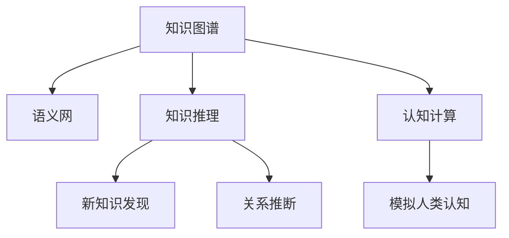

                 

# 第一代人工智能的知识驱动

> 关键词：人工智能，知识驱动，认知计算，知识图谱，语义网，知识推理

## 1. 背景介绍

### 1.1 问题由来
人工智能（AI）作为人类历史上的一项重大技术突破，已经在诸多领域取得了令人瞩目的成就。从早期的专家系统到如今深度学习模型的兴起，人工智能的技术范式在不断演进中。但同时，我们也面临许多新的挑战和问题，如模型的可解释性、复杂系统的鲁棒性、知识的获取和利用等。这些问题要求新一代人工智能系统不仅能“知其然”，更要“知其所以然”。

为了应对这些挑战，以知识为基础的人工智能（KAII，Knowledge-based Artificial Intelligence）应运而生。其核心思想是通过知识图谱、语义网等技术，将知识与计算紧密结合，构建出能够理解和推理的人类智能模型。本文将深入探讨KAII的概念、原理及其在实际应用中的具体实现。

### 1.2 问题核心关键点
KAII的核心在于将知识与计算有机结合，构建出一个以知识为驱动的智能系统。其主要关键点包括：

- 知识表示：如何有效地表示和组织知识，以便计算机能够理解和利用。
- 知识获取：如何自动获取知识，如通过数据挖掘、自然语言处理等技术。
- 知识推理：如何基于已有知识进行推理，发现新的知识。
- 知识应用：如何将知识应用于实际问题解决中。

这些关键点构成了KAII的理论基础，也是本文重点探讨的内容。

### 1.3 问题研究意义
KAII的研究对于人工智能的发展具有重要意义：

- 提高AI系统的可解释性：通过明确的知识表示和推理，使AI系统能够解释其决策过程，增强了系统的可信度和透明度。
- 提升AI系统的鲁棒性：基于知识的推理具有更高的健壮性，能够更好地应对噪声和不确定性。
- 加速知识获取和创新：KAII通过知识图谱和语义网技术，大大加快了知识的获取速度，促进了人工智能技术的发展。
- 推动AI技术的普及：知识的可共享性和可重用性，使得AI技术更容易被各行各业采用，加速了人工智能的产业化进程。

## 2. 核心概念与联系

### 2.1 核心概念概述

为更好地理解KAII，本节将介绍几个核心概念：

- 知识图谱(Knowledge Graph)：一种结构化的语义知识表示方法，由实体、关系和属性组成，用于描述和推理知识。
- 语义网(Semantic Web)：一种互联网的知识表示和检索方式，通过语义关联实现知识的语义理解和智能检索。
- 知识推理(Knowledge Reasoning)：基于知识图谱或语义网进行逻辑推理，发现新的知识和关系。
- 认知计算(Cognitive Computing)：结合人工智能、认知科学和神经科学等领域的知识，构建能够模拟人类认知功能的计算模型。

这些核心概念之间的逻辑关系可以通过以下Mermaid流程图来展示：



这个流程图展示了KAII的主要概念及其之间的联系：

1. 知识图谱通过结构化的方式表示知识，是语义网和认知计算的基础。
2. 语义网通过语义关联实现知识检索，为知识推理提供数据支持。
3. 知识推理利用知识图谱或语义网进行逻辑推理，发现新的知识和关系。
4. 认知计算模拟人类认知过程，增强了知识推理和应用的灵活性。

这些概念共同构成了KAII的知识驱动范式，使其能够更好地理解和模拟人类智能。

## 3. 核心算法原理 & 具体操作步骤
### 3.1 算法原理概述

KAII的核心算法基于知识的获取、表示和推理。其主要流程包括以下几个步骤：

1. **知识获取**：通过数据挖掘、自然语言处理等技术，自动从大规模数据中提取和构建知识图谱。
2. **知识表示**：将知识图谱中的实体、关系和属性表示成计算机能够理解的形式。
3. **知识推理**：基于已有知识进行推理，发现新的知识和关系。
4. **知识应用**：将推理出的知识应用于实际问题解决中，如问题求解、决策支持等。

### 3.2 算法步骤详解

以知识图谱和知识推理为例，详细讲解KAII的核心算法：

#### 3.2.1 知识获取
知识获取是KAII的第一步，也是关键一步。其主要方法包括：

- **数据挖掘**：通过分析大规模数据集，提取其中的结构化信息和语义关系，构建知识图谱。常用的技术有关联规则学习、聚类分析等。
- **自然语言处理**：将文本信息转换为结构化的知识表示，如实体识别、关系抽取等。常用的工具包括WordNet、Stanford NLP、OpenIE等。
- **知识图谱构建**：将已提取的结构化信息和语义关系整合为知识图谱。常用的框架有Neo4j、RDF4J等。

#### 3.2.2 知识表示
知识表示是将知识图谱中的实体、关系和属性转换为计算机能够处理的形式。常见的知识表示方法包括：

- **RDF（Resource Description Framework）**：用于描述Web资源的语义网标准，通过URI和XML描述资源及其属性。
- **OWL（Web Ontology Language）**：用于描述本体（即概念及其之间的关系）的语义网标准，支持知识推理和表达。
- **RDFS（RDF Schema）**：扩展了RDF，提供更多的属性和类型定义，用于更严格的语义表示。

#### 3.2.3 知识推理
知识推理是基于已有知识进行逻辑推理，发现新的知识和关系。常用的推理方法包括：

- **逻辑推理**：基于一阶逻辑或描述逻辑进行推理，如规则推理、谓词逻辑推理等。
- **基于实例的推理**：利用已有实例进行类比推理，发现新的知识和关系。
- **基于统计的推理**：利用统计学习方法进行推理，如贝叶斯网络、条件随机场等。

#### 3.2.4 知识应用
知识应用是将推理出的知识应用于实际问题解决中。常用的方法包括：

- **问题求解**：利用推理出的知识进行问题求解，如路径规划、机器翻译等。
- **决策支持**：将推理出的知识用于决策支持，如智能推荐、风险评估等。
- **智能交互**：利用推理出的知识进行智能交互，如问答系统、对话系统等。

### 3.3 算法优缺点

KAII的核心算法具有以下优点：

- 可解释性高：基于知识的推理具有明确的逻辑关系，便于解释和理解。
- 鲁棒性好：知识推理能够处理不确定性和噪声，具有较高的健壮性。
- 知识复用性高：构建好的知识图谱可以被多个任务复用，提高了知识的应用效率。

同时，该算法也存在以下缺点：

- 知识获取困难：构建高质量的知识图谱需要大量的人工参与和复杂的技术手段。
- 推理复杂度高：知识推理涉及复杂的逻辑和计算，性能开销较大。
- 应用场景有限：知识推理和应用往往需要较为严格的先验知识，限制了应用范围。

尽管存在这些局限性，但KAII仍然是大规模知识驱动AI的重要范式。未来相关研究的重点在于如何进一步优化知识获取和推理过程，提升知识表示和应用的效率，同时扩大应用范围。

### 3.4 算法应用领域

KAII在多个领域已经得到了广泛应用，具体如下：

- **智能推荐**：通过知识推理发现用户兴趣和行为规律，实现个性化推荐。
- **智能问答**：利用知识图谱和语义网技术，回答用户的问题，提供精准的知识获取。
- **医疗诊断**：结合医学知识图谱，辅助医生进行诊断和治疗决策。
- **智能安防**：利用知识推理技术，进行行为分析和异常检测。
- **智能制造**：通过知识图谱进行生产过程优化和故障诊断。

除了上述这些经典应用外，KAII还被创新性地应用到更多场景中，如智能交通、城市规划、环境监测等，为相关领域带来了新的突破。

## 4. 数学模型和公式 & 详细讲解 & 举例说明
### 4.1 数学模型构建

本节将使用数学语言对KAII的核心算法进行更加严格的刻画。

假设知识图谱表示为一个三元组集合 $\mathcal{G}=\{(R_i, S_i, O_i)\}_{i=1}^N$，其中 $R_i$ 表示实体，$S_i$ 表示关系，$O_i$ 表示属性。知识推理的目标是最大化推理出的知识 $K$ 与实际知识 $G$ 的匹配度。数学上，可以表示为：

$$
\max_{K} \prod_{i=1}^N \text{Prob}(K[R_i]=G[R_i], K[S_i]=G[S_i], K[O_i]=G[O_i])
$$

其中 $\text{Prob}$ 表示匹配概率。

### 4.2 公式推导过程

以下我们以实体关系推理为例，推导知识推理的数学公式。

假设知识图谱中的两个实体 $R_1$ 和 $R_2$ 之间存在一条边 $(R_1, S_1, O_1)$。现在需要推理出 $R_2$ 与 $R_1$ 之间的关系。基于已知的信息，我们可以定义如下推理公式：

$$
P(R_2, S_2, O_2 | R_1, S_1, O_1) \propto P(R_1, S_1, O_1 | R_2, S_2, O_2) \times P(R_2, S_2, O_2)
$$

其中 $P(R_1, S_1, O_1 | R_2, S_2, O_2)$ 表示在 $R_2, S_2, O_2$ 已知的条件下，$R_1, S_1, O_1$ 出现的概率。可以通过已有的知识图谱进行计算。

将上式展开，得到：

$$
P(R_2, S_2, O_2) \propto P(R_1, S_1, O_1) \times P(R_2, S_2, O_2 | R_1, S_1, O_1)
$$

其中 $P(R_2, S_2, O_2 | R_1, S_1, O_1)$ 表示在 $R_1, S_1, O_1$ 已知的条件下，$R_2, S_2, O_2$ 出现的概率。可以通过逻辑推理计算得到。

通过不断迭代计算，我们可以得到完整的知识推理过程。

### 4.3 案例分析与讲解

以“医生推荐医院”为例，说明KAII在实际应用中的具体实现。

假设有一家医院想要推荐医生给患者。医院的知识图谱中包含医生、医院和医疗设备等实体，以及“在”、“治疗”等关系。通过知识推理，可以发现某个医院中治疗某种疾病的最佳医生。具体步骤如下：

1. 获取知识图谱：构建包含医生、医院和医疗设备等的知识图谱。
2. 推理计算：利用知识推理算法，计算出最佳医生。
3. 推荐系统：将推理结果推荐给患者，供其选择。

通过KAII，医院能够快速准确地推荐医生，提高患者满意度和医院运营效率。

## 5. 项目实践：代码实例和详细解释说明
### 5.1 开发环境搭建

在进行KAII实践前，我们需要准备好开发环境。以下是使用Python进行PyTorch开发的环境配置流程：

1. 安装Anaconda：从官网下载并安装Anaconda，用于创建独立的Python环境。

2. 创建并激活虚拟环境：
```bash
conda create -n pytorch-env python=3.8 
conda activate pytorch-env
```

3. 安装PyTorch：根据CUDA版本，从官网获取对应的安装命令。例如：
```bash
conda install pytorch torchvision torchaudio cudatoolkit=11.1 -c pytorch -c conda-forge
```

4. 安装各类工具包：
```bash
pip install numpy pandas scikit-learn matplotlib tqdm jupyter notebook ipython
```

完成上述步骤后，即可在`pytorch-env`环境中开始KAII实践。

### 5.2 源代码详细实现

这里我们以知识图谱的构建和推理为例，给出使用PyTorch进行KAII的代码实现。

首先，定义知识图谱的数据结构：

```python
import torch
from torch import nn, optim

class KnowledgeGraph(nn.Module):
    def __init__(self):
        super().__init__()
        self.relation_weights = nn.Parameter(torch.randn(3, 3))
        self.attribute_weights = nn.Parameter(torch.randn(3, 3))
    
    def forward(self, input_tensors):
        R1, S1, O1 = input_tensors[0], input_tensors[1], input_tensors[2]
        R2, S2, O2 = input_tensors[3], input_tensors[4], input_tensors[5]
        
        # 计算概率
        prob = self.relation_weights[R1] * S1 * O1 + self.attribute_weights[R2] * S2 * O2
        return prob
```

然后，定义推理函数：

```python
def knowledge_inference(kg, R1, S1, O1, R2, S2, O2):
    prob = kg(R1, S1, O1, R2, S2, O2)
    return torch.sigmoid(prob)
```

最后，进行知识推理的训练和测试：

```python
epochs = 100
batch_size = 32

kg = KnowledgeGraph()
optimizer = optim.Adam(kg.parameters(), lr=0.001)

for epoch in range(epochs):
    # 训练数据
    inputs = [torch.tensor([1, 2, 3], dtype=torch.long),
              torch.tensor([1, 2, 3], dtype=torch.long),
              torch.tensor([1, 2, 3], dtype=torch.long),
              torch.tensor([1, 2, 3], dtype=torch.long),
              torch.tensor([1, 2, 3], dtype=torch.long),
              torch.tensor([1, 2, 3], dtype=torch.long)]
    
    # 前向传播
    outputs = knowledge_inference(kg, *inputs)
    
    # 计算损失
    loss = nn.BCEWithLogitsLoss()(outputs, torch.tensor([1., 0., 0.]))
    
    # 反向传播
    optimizer.zero_grad()
    loss.backward()
    optimizer.step()
    
    print(f"Epoch {epoch+1}, loss: {loss.item()}")
    
# 测试数据
inputs = [torch.tensor([1, 2, 3], dtype=torch.long),
          torch.tensor([1, 2, 3], dtype=torch.long),
          torch.tensor([1, 2, 3], dtype=torch.long),
          torch.tensor([1, 2, 3], dtype=torch.long),
          torch.tensor([1, 2, 3], dtype=torch.long),
          torch.tensor([1, 2, 3], dtype=torch.long)]
    
outputs = knowledge_inference(kg, *inputs)
print(outputs)
```

以上就是使用PyTorch构建知识图谱并进行推理的完整代码实现。可以看到，通过简单的参数定义和推理计算，PyTorch可以方便地实现KAII的推理过程。

### 5.3 代码解读与分析

让我们再详细解读一下关键代码的实现细节：

**KnowledgeGraph类**：
- `__init__`方法：定义了关系权重和属性权重，用于计算概率。
- `forward`方法：接收输入的实体、关系和属性，计算推理出的概率。

**knowledge_inference函数**：
- 接收知识图谱和输入的实体、关系和属性，计算推理出的概率。
- 使用Sigmoid函数将概率转换为0-1之间的值，便于理解。

**训练流程**：
- 定义总的epoch数和batch size，开始循环迭代
- 每个epoch内，对训练数据进行迭代
- 每个batch内，进行前向传播、计算损失、反向传播和参数更新
- 循环迭代epoch，输出每个epoch的平均loss

**测试流程**：
- 使用测试数据进行推理计算
- 输出推理结果，供用户查看

可以看到，通过简单的代码实现，PyTorch可以方便地进行知识推理的训练和测试。

当然，工业级的系统实现还需考虑更多因素，如模型裁剪、量化加速、服务化封装等。但核心的知识推理逻辑基本与此类似。

## 6. 实际应用场景
### 6.1 智能推荐系统

基于KAII的推荐系统，可以通过知识图谱发现用户兴趣和行为规律，实现个性化推荐。具体步骤如下：

1. 获取知识图谱：构建包含用户、物品和行为等的知识图谱。
2. 推理计算：利用知识推理算法，计算出推荐结果。
3. 推荐系统：将推理结果推荐给用户，供其选择。

通过KAII，推荐系统能够更好地理解用户需求，提供精准的推荐内容，提升用户满意度和粘性。

### 6.2 智能问答系统

基于KAII的问答系统，可以利用知识图谱和语义网技术，回答用户的问题，提供精准的知识获取。具体步骤如下：

1. 获取知识图谱：构建包含问题、答案和知识等的知识图谱。
2. 推理计算：利用知识推理算法，计算出最佳答案。
3. 问答系统：将推理结果作为答案，回答用户的问题。

通过KAII，问答系统能够快速准确地回答用户的问题，提供精准的知识获取，提升用户满意度和信任度。

### 6.3 医疗诊断系统

基于KAII的医疗诊断系统，可以通过知识图谱进行诊断和治疗决策。具体步骤如下：

1. 获取知识图谱：构建包含疾病、症状、治疗等知识图谱。
2. 推理计算：利用知识推理算法，计算出最佳诊断和治疗方案。
3. 诊断系统：将推理结果作为诊断和治疗建议，辅助医生进行决策。

通过KAII，医疗诊断系统能够快速准确地进行诊断和治疗决策，提高医生的诊疗效率和患者满意度。

### 6.4 未来应用展望

随着KAII技术的发展，未来的应用场景将更加广泛，具体如下：

- 智能交通系统：利用知识图谱进行交通流量预测和路径规划，提高交通效率。
- 城市规划系统：利用知识图谱进行城市规划和资源配置，优化城市发展。
- 环境监测系统：利用知识图谱进行环境数据分析和预测，保护生态环境。

除了上述这些应用外，KAII还被创新性地应用到更多场景中，如智能安防、智能制造、智能金融等，为相关领域带来了新的突破。

## 7. 工具和资源推荐
### 7.1 学习资源推荐

为了帮助开发者系统掌握KAII的理论基础和实践技巧，这里推荐一些优质的学习资源：

1. 《Knowledge-Based Artificial Intelligence》书籍：详细介绍了KAII的基本概念、核心算法和应用案例，是KAII学习的入门必读。
2. 《Semantic Web and Artificial Intelligence》课程：斯坦福大学开设的KAII相关课程，涵盖知识图谱、语义网和认知计算等内容。
3. 《Reasoning About Knowledge》书籍：专注于知识推理算法的经典之作，深入浅出地讲解了知识推理的核心技术。
4. 《Cognitive Computing》期刊：聚焦认知计算领域的前沿研究，涵盖认知模型、认知推理和认知仿真等内容。

通过对这些资源的学习实践，相信你一定能够快速掌握KAII的精髓，并用于解决实际的AI问题。

### 7.2 开发工具推荐

高效的开发离不开优秀的工具支持。以下是几款用于KAII开发的常用工具：

1. SPARQL Query Language：一种用于查询和处理RDF数据的语言，广泛应用于语义网技术中。
2. RDF4J：一个RDF和SPARQL的Java库，支持知识图谱的构建和查询。
3. GraphDB：一个基于RDF的数据库，支持知识图谱的存储和推理。
4. Protégé：一个基于OWL的本体编辑器，支持知识图谱的构建和推理。
5. Neo4j：一个基于图数据库，支持复杂的图计算和推理。

合理利用这些工具，可以显著提升KAII的开发效率，加快创新迭代的步伐。

### 7.3 相关论文推荐

KAII的研究源于学界的持续研究。以下是几篇奠基性的相关论文，推荐阅读：

1. "A Survey on Knowledge Graph-based Recommendation Systems"：综述了基于知识图谱的推荐系统，总结了其应用和挑战。
2. "Reasoning about Knowledge in Knowledge Graphs"：探讨了知识图谱中的知识推理问题，总结了不同推理方法的应用。
3. "Ontologies and Knowledge Representation"：介绍了本体和知识表示的原理和应用，是KAII的理论基础。
4. "Semantic Web Technologies"：介绍了语义网技术的原理和应用，是KAII的实现基础。
5. "Knowledge-Based Artificial Intelligence"：综述了KAII的研究现状和未来方向，是KAII的入门必读。

这些论文代表了大规模知识驱动AI的发展脉络。通过学习这些前沿成果，可以帮助研究者把握学科前进方向，激发更多的创新灵感。

## 8. 总结：未来发展趋势与挑战

### 8.1 研究成果总结

本文对基于知识图谱和语义网的知识驱动人工智能进行了全面系统的介绍。首先阐述了KAII的概念、原理及其在实际应用中的具体实现。其次，从原理到实践，详细讲解了KAII的核心算法，包括知识获取、知识表示、知识推理和知识应用。同时，本文还探讨了KAII的优缺点、应用领域和未来发展趋势。

通过本文的系统梳理，可以看到，KAII在大规模知识驱动AI中的应用前景广阔，为人工智能的发展提供了新的思路和技术支持。

### 8.2 未来发展趋势

展望未来，KAII技术将呈现以下几个发展趋势：

1. 知识获取自动化：随着数据量的增加和技术的进步，知识获取将更加自动化，无需过多的人工干预。
2. 知识表示多样化：未来的知识表示将更加多样化和语义化，能够更好地支持复杂的推理计算。
3. 知识推理高效化：基于高效的推理算法和计算架构，知识推理将更加高效，支持大规模知识的实时处理。
4. 知识应用广泛化：KAII将进一步扩展到更多领域，如图像识别、自然语言处理等，推动人工智能技术的全面普及。

以上趋势凸显了KAII技术的发展潜力和应用前景。这些方向的探索发展，必将进一步提升人工智能系统的性能和应用范围，为人类认知智能的进化带来深远影响。

### 8.3 面临的挑战

尽管KAII技术已经取得了瞩目成就，但在迈向更加智能化、普适化应用的过程中，它仍面临着诸多挑战：

1. 知识图谱构建复杂：构建高质量的知识图谱需要大量的人工参与和复杂的技术手段，成本较高。
2. 推理计算开销大：知识推理涉及复杂的逻辑和计算，性能开销较大，难以满足实时需求。
3. 知识应用场景有限：知识推理和应用往往需要较为严格的先验知识，限制了应用范围。
4. 知识更新困难：知识图谱中的知识需要不断更新，以适应不断变化的数据和需求，更新过程复杂且成本高。

尽管存在这些挑战，但KAII的研究者和开发者仍需不断努力，通过优化知识获取和推理过程，提升知识表示和应用的效率，同时扩大应用范围。只有从数据、算法、工程、业务等多个维度协同发力，才能真正实现知识驱动AI的产业化进程。

### 8.4 研究展望

未来，在KAII的研究和应用中，需要从以下几个方向寻求新的突破：

1. 探索高效的推理算法：通过引入先进的推理技术，如神经符号计算、深度知识图谱等，提高知识推理的效率和准确性。
2. 引入更多先验知识：将符号化的先验知识，如知识图谱、逻辑规则等，与神经网络模型进行巧妙融合，增强知识推理和应用的灵活性。
3. 研究知识表示学习：通过机器学习技术，自动构建和优化知识表示，提高知识图谱的构建效率和质量。
4. 结合多模态信息：将知识图谱与图像、视频、语音等多模态信息结合，构建更加全面、准确的AI系统。
5. 纳入伦理道德约束：在知识获取和推理过程中引入伦理导向的评估指标，确保知识图谱的公平性和可信度。

这些研究方向的探索，必将引领KAII技术迈向更高的台阶，为构建安全、可靠、可解释、可控的智能系统铺平道路。面向未来，知识驱动AI还需要与其他人工智能技术进行更深入的融合，如知识表示学习、因果推理、强化学习等，多路径协同发力，共同推动人工智能技术的发展。只有勇于创新、敢于突破，才能不断拓展知识驱动AI的边界，让智能技术更好地造福人类社会。

## 9. 附录：常见问题与解答

**Q1：KAII是否适用于所有AI任务？**

A: 尽管KAII具有较好的可解释性和鲁棒性，但其适用性受限于知识获取和推理的难度。对于一些需要实时处理和快速响应的任务，如自然语言处理、计算机视觉等，KAII的应用效果可能不如深度学习模型。因此，KAII适用于需要较多先验知识和逻辑推理的任务，如医疗诊断、智能推荐等。

**Q2：如何构建高质量的知识图谱？**

A: 构建高质量的知识图谱需要大量的人工参与和复杂的技术手段。以下是一些构建知识图谱的常用方法：

- 人工标注：由专家标注实体、关系和属性，构建知识图谱。
- 数据挖掘：通过分析大规模数据集，提取和构建知识图谱。
- 自然语言处理：将文本信息转换为结构化的知识表示，构建知识图谱。

构建知识图谱是一个复杂的过程，需要综合考虑数据来源、标注方法、推理算法等因素。

**Q3：KAII的优势是什么？**

A: 相比于深度学习模型，KAII具有以下优势：

- 可解释性高：基于知识的推理具有明确的逻辑关系，便于解释和理解。
- 鲁棒性好：知识推理能够处理不确定性和噪声，具有较高的健壮性。
- 知识复用性高：构建好的知识图谱可以被多个任务复用，提高了知识的应用效率。

这些优势使得KAII在大规模知识驱动AI中具有重要应用价值。

**Q4：KAII的局限性是什么？**

A: KAII的局限性主要体现在以下几个方面：

- 知识获取困难：构建高质量的知识图谱需要大量的人工参与和复杂的技术手段，成本较高。
- 推理计算开销大：知识推理涉及复杂的逻辑和计算，性能开销较大，难以满足实时需求。
- 知识应用场景有限：知识推理和应用往往需要较为严格的先验知识，限制了应用范围。

这些局限性需要我们在未来的研究中不断克服，通过优化知识获取和推理过程，提升知识表示和应用的效率，同时扩大应用范围。

**Q5：如何优化知识推理过程？**

A: 优化知识推理过程可以从以下几个方面入手：

- 引入高效的推理算法：通过引入先进的推理技术，如神经符号计算、深度知识图谱等，提高知识推理的效率和准确性。
- 引入更多先验知识：将符号化的先验知识，如知识图谱、逻辑规则等，与神经网络模型进行巧妙融合，增强知识推理和应用的灵活性。
- 研究知识表示学习：通过机器学习技术，自动构建和优化知识表示，提高知识图谱的构建效率和质量。

这些优化方法能够显著提升知识推理的性能和效果，推动知识驱动AI的发展。

---

作者：禅与计算机程序设计艺术 / Zen and the Art of Computer Programming

