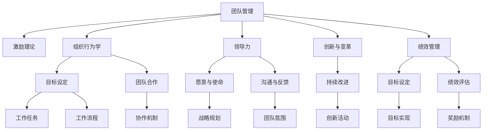

                 

# 管理的智慧：激发团队潜能

## 1. 背景介绍

### 1.1 问题由来

在当今快速变化和复杂多变的商业环境中，企业面临着前所未有的挑战。如何高效管理团队，激发团队潜能，是所有管理者必须解决的核心问题。传统的命令式管理和官僚制度已经无法满足现代企业的灵活性和创新需求。管理者需要借鉴科学的管理理论和方法，建立以人为本的组织结构，打造高效协作的团队，释放每个成员的最大潜能，实现企业的可持续发展。

### 1.2 问题核心关键点

团队管理的关键在于激励和协调，使每个成员都能积极投入工作，发挥个人优势，同时协同合作，达成共同目标。管理的智慧在于如何激发团队潜能，通过科学的领导方式和激励机制，营造积极的工作氛围，提高团队的整体效率和创新能力。

管理者的角色不仅是任务的分配者和执行的监督者，更是团队成长的引导者和激励者。优秀的管理者能够理解团队成员的需求，帮助其克服困难，激发其内在动力，使之充分发挥才能，推动企业整体进步。

### 1.3 问题研究意义

提升团队管理水平，激发团队潜能，是企业持续发展的关键。有效的团队管理可以增强企业的市场竞争力，提升员工的幸福感和满意度，激发员工的创新精神和企业家精神，从而带动企业整体绩效的提升。

通过系统的研究和学习科学的管理理论，结合实践中的经验和创新，管理者可以不断提升自己的管理能力，形成独具特色的管理风格和方法，为企业的长期发展奠定坚实的基础。

## 2. 核心概念与联系

### 2.1 核心概念概述

为更好地理解如何激发团队潜能，本节将介绍几个密切相关的核心概念：

- 团队管理(Team Management)：通过科学的管理手段，协调团队成员，优化工作流程，最大化团队整体绩效。
- 激励理论(Incentive Theory)：研究如何通过各种手段激发员工的内在动力，提高工作积极性和效率。
- 组织行为学(Organizational Behavior)：研究个人、群体和组织在一定环境中相互作用的过程和行为规律。
- 领导力(Leadership)：引导和影响他人，实现共同目标的能力。
- 创新与变革(Innovation and Change)：推动团队不断更新理念和行为，实现持续改进和创新。
- 绩效管理(Performance Management)：通过科学评估和反馈，激励员工不断提升工作质量，达到更高的工作目标。

这些核心概念之间的逻辑关系可以通过以下Mermaid流程图来展示：



这个流程图展示了几大核心概念及其之间的关系：

1. 团队管理作为核心，通过目标设定、任务分配、流程优化等手段，协调团队成员，优化工作效果。
2. 激励理论作为基础，通过理解员工需求，设计科学的奖励机制，激发其内动力。
3. 组织行为学作为工具，研究个体和群体的行为规律，帮助管理者设计合理的工作环境。
4. 领导力作为引导，通过愿景与使命的传递，建立强大的团队凝聚力。
5. 创新与变革作为动力，推动团队不断更新思维和行为，提升创新能力。
6. 绩效管理作为评估，通过目标设定、评估与反馈，确保团队成员不断提升绩效。

这些概念共同构成了团队管理的框架，管理者需全面把握，才能有效激发团队潜能，推动团队绩效提升。

## 3. 核心算法原理 & 具体操作步骤
### 3.1 算法原理概述

激发团队潜能的核心在于科学的管理方法和激励机制。基于科学的管理理论，管理者需要设计一系列有针对性的策略，如目标管理、团队建设、绩效评估等，通过合理的激励手段，激发团队成员的内在动力，形成积极的工作氛围。

有效的团队管理需要综合运用多种管理手段，包括但不限于：
- 目标管理：明确团队目标和个人任务，设定可量化的绩效指标，确保每个人都知道工作方向和目标。
- 团队建设：通过团队建设活动，增强成员之间的信任和协作，提升团队凝聚力。
- 绩效评估：通过科学的绩效评估方法，提供即时反馈，激励团队成员不断改进工作质量。
- 激励机制：设计合理的激励机制，如薪酬激励、晋升激励、荣誉激励等，满足员工不同层次的需求。
- 领导力培养：通过培训和指导，提升团队成员的领导力，增强其在项目中的主导能力。
- 持续改进：引入精益管理理念，持续优化工作流程和业务流程，提升团队效率。

### 3.2 算法步骤详解

以下是对激发团队潜能的科学管理方法的具体操作步骤：

**Step 1: 目标管理**
1. 制定明确的团队目标：通过SWOT分析，明确团队的优势、劣势、机会和威胁，设定可量化的工作目标。
2. 设定个人任务：根据团队目标和个人能力，分配具体的任务和工作职责。
3. 制定绩效指标：设定可量化的绩效指标，如项目进度、工作质量、客户满意度等。

**Step 2: 团队建设**
1. 建立团队文化：营造积极向上、开放包容的工作氛围，增强团队凝聚力。
2. 设计团队活动：定期组织团队建设活动，如团建、培训、文化沙龙等，增强成员之间的信任和协作。
3. 提升领导力：通过领导力培训和指导，提升团队成员的管理能力，增强其在项目中的主导能力。

**Step 3: 绩效评估**
1. 设定评估标准：根据团队目标和绩效指标，设定科学、合理的评估标准。
2. 提供即时反馈：通过日常沟通和定期评估，提供及时、有针对性的反馈，帮助团队成员不断改进工作。
3. 激励机制设计：设计合理的激励机制，如薪酬激励、晋升激励、荣誉激励等，满足员工不同层次的需求。

**Step 4: 激励机制**
1. 理解员工需求：通过问卷调查、面对面访谈等方法，了解员工的需求和期望。
2. 设计奖励方案：根据员工需求，设计合理的奖励方案，如薪酬调整、奖金、晋升机会等。
3. 实施奖励计划：根据奖励方案，及时、公正地实施奖励计划，确保员工能够感受到激励。

**Step 5: 领导力培养**
1. 识别潜力人才：通过绩效评估和日常观察，识别具有领导潜力的团队成员。
2. 提供培训机会：为潜力人才提供领导力培训和指导，提升其在项目中的主导能力。
3. 实践锻炼机会：通过实际项目的锻炼，积累潜力人才的管理经验和领导力。

**Step 6: 持续改进**
1. 优化工作流程：引入精益管理理念，不断优化工作流程和业务流程，提升团队效率。
2. 引入新技术：通过持续学习和技术更新，引入新技术和新方法，提升团队的技术水平和创新能力。
3. 持续评估改进：定期评估团队的工作效果和改进空间，形成持续改进的机制。

### 3.3 算法优缺点

科学的管理方法具有以下优点：
1. 目标明确：通过明确的目标设定，确保每个成员都知道工作方向和目标。
2. 激励有效：通过科学的激励机制，满足员工不同层次的需求，激发其内动力。
3. 团队协作：通过团队建设活动，增强成员之间的信任和协作，提升团队凝聚力。
4. 绩效提升：通过科学的绩效评估方法，提供即时反馈，激励团队成员不断改进工作质量。
5. 领导力培养：通过领导力培训和指导，提升团队成员的管理能力，增强其在项目中的主导能力。

同时，科学管理方法也存在一些局限性：
1. 需要较高管理水平：管理者需要具备丰富的管理经验和科学的管理理念，才能设计合理的管理方案。
2. 员工需求多样：每个员工的需求和期望不同，难以制定统一的激励方案。
3. 工作环境复杂：在复杂的商业环境中，科学管理方法有时难以应对突发情况和复杂问题。
4. 变革周期长：科学管理方法需要一定的周期才能见效，短期内可能难以看到明显效果。

尽管存在这些局限性，但科学管理方法仍是目前最有效的团队管理手段，能显著提升团队绩效和工作质量。未来相关研究的重点在于如何进一步优化管理手段，提高科学管理方法的适用性和灵活性。

### 3.4 算法应用领域

科学的管理方法在多个领域得到了广泛应用，例如：

- 企业组织管理：通过目标管理、团队建设、绩效评估等手段，提升企业的整体绩效。
- 项目管理：通过科学的管理方法，确保项目按时按质完成，实现项目目标。
- 人力资源管理：通过科学的激励机制和绩效评估，优化人力资源配置，提升员工满意度和忠诚度。
- 产品开发：通过领导力培养和持续改进，推动产品创新和改进，提升市场竞争力。
- 服务运营：通过优化工作流程和绩效评估，提升服务质量和客户满意度。
- 教育管理：通过目标管理和绩效评估，提升教育质量和教师工作积极性。

除了上述这些经典应用外，科学管理方法也被创新性地应用于更多领域，如公共管理、医疗管理等，为各行业的管理实践提供了有力的支持。

## 4. 数学模型和公式 & 详细讲解  
### 4.1 数学模型构建

为更准确地描述激发团队潜能的科学管理方法，本节将构建相应的数学模型。

设团队管理的目标为 $M$，激励机制为 $I$，绩效评估为 $P$，领导力培养为 $L$，持续改进为 $C$。这些因素之间相互影响，共同作用于团队绩效 $T$。假设各因素的贡献度分别为 $w_M, w_I, w_P, w_L, w_C$，则团队绩效 $T$ 的数学模型可表示为：

$$
T = f(M, I, P, L, C) = \sum_{i=1}^5 w_i \cdot f_i
$$

其中，$f_i$ 为第 $i$ 个因素对团队绩效的贡献函数。

### 4.2 公式推导过程

以下我们将详细推导目标管理、激励机制、绩效评估等各因素的贡献函数 $f_i$。

**目标管理**：通过明确的目标设定，提升团队的整体工作方向和效率。设目标设定的贡献度为 $w_M$，贡献函数为 $f_M = \frac{T}{\text{Target}}$，其中 $\text{Target}$ 为设定的目标值。

**激励机制**：通过科学的激励机制，满足员工不同层次的需求，激发其内动力。设激励机制的贡献度为 $w_I$，贡献函数为 $f_I = \frac{T}{\text{Incentives}}$，其中 $\text{Incentives}$ 为激励措施的投入成本。

**团队建设**：通过团队建设活动，增强成员之间的信任和协作，提升团队凝聚力。设团队建设的贡献度为 $w_B$，贡献函数为 $f_B = \frac{T}{\text{Team Building}}$，其中 $\text{Team Building}$ 为团队建设活动的投入成本。

**绩效评估**：通过科学的绩效评估方法，提供即时反馈，激励团队成员不断改进工作质量。设绩效评估的贡献度为 $w_P$，贡献函数为 $f_P = \frac{T}{\text{Performance Evaluation}}$，其中 $\text{Performance Evaluation}$ 为绩效评估的投入成本。

**领导力培养**：通过领导力培训和指导，提升团队成员的管理能力，增强其在项目中的主导能力。设领导力培养的贡献度为 $w_L$，贡献函数为 $f_L = \frac{T}{\text{Leadership Training}}$，其中 $\text{Leadership Training}$ 为领导力培训的投入成本。

**持续改进**：通过优化工作流程和业务流程，提升团队效率。设持续改进的贡献度为 $w_C$，贡献函数为 $f_C = \frac{T}{\text{Continuous Improvement}}$，其中 $\text{Continuous Improvement}$ 为持续改进的投入成本。

将这些贡献函数代入团队绩效模型中，得：

$$
T = w_M \cdot \frac{T}{\text{Target}} + w_I \cdot \frac{T}{\text{Incentives}} + w_B \cdot \frac{T}{\text{Team Building}} + w_P \cdot \frac{T}{\text{Performance Evaluation}} + w_L \cdot \frac{T}{\text{Leadership Training}} + w_C \cdot \frac{T}{\text{Continuous Improvement}}
$$

化简得：

$$
T = \frac{T}{w_M} \cdot \frac{1}{\text{Target}} + \frac{T}{w_I} \cdot \frac{1}{\text{Incentives}} + \frac{T}{w_B} \cdot \frac{1}{\text{Team Building}} + \frac{T}{w_P} \cdot \frac{1}{\text{Performance Evaluation}} + \frac{T}{w_L} \cdot \frac{1}{\text{Leadership Training}} + \frac{T}{w_C} \cdot \frac{1}{\text{Continuous Improvement}}
$$

进一步化简得：

$$
1 = \frac{1}{w_M} \cdot \frac{1}{\text{Target}} + \frac{1}{w_I} \cdot \frac{1}{\text{Incentives}} + \frac{1}{w_B} \cdot \frac{1}{\text{Team Building}} + \frac{1}{w_P} \cdot \frac{1}{\text{Performance Evaluation}} + \frac{1}{w_L} \cdot \frac{1}{\text{Leadership Training}} + \frac{1}{w_C} \cdot \frac{1}{\text{Continuous Improvement}}
$$

通过解这个方程，可以找到最优的目标设定、激励机制、团队建设等管理手段的投入成本，最大化团队绩效 $T$。

## 5. 项目实践：代码实例和详细解释说明
### 5.1 开发环境搭建

在进行团队管理实践前，我们需要准备好开发环境。以下是使用Python进行PyTorch开发的环境配置流程：

1. 安装Anaconda：从官网下载并安装Anaconda，用于创建独立的Python环境。

2. 创建并激活虚拟环境：
```bash
conda create -n pytorch-env python=3.8 
conda activate pytorch-env
```

3. 安装PyTorch：根据CUDA版本，从官网获取对应的安装命令。例如：
```bash
conda install pytorch torchvision torchaudio cudatoolkit=11.1 -c pytorch -c conda-forge
```

4. 安装Transformers库：
```bash
pip install transformers
```

5. 安装各类工具包：
```bash
pip install numpy pandas scikit-learn matplotlib tqdm jupyter notebook ipython
```

完成上述步骤后，即可在`pytorch-env`环境中开始团队管理实践。

### 5.2 源代码详细实现

下面我们以目标管理和激励机制为例，给出使用Transformers库进行团队管理的PyTorch代码实现。

首先，定义目标管理函数：

```python
from transformers import BertTokenizer
from torch.utils.data import Dataset
import torch

class GoalDataset(Dataset):
    def __init__(self, goals, rewards, tokenizer, max_len=128):
        self.goals = goals
        self.rewards = rewards
        self.tokenizer = tokenizer
        self.max_len = max_len
        
    def __len__(self):
        return len(self.goals)
    
    def __getitem__(self, item):
        goal = self.goals[item]
        reward = self.rewards[item]
        
        encoding = self.tokenizer(goal, return_tensors='pt', max_length=self.max_len, padding='max_length', truncation=True)
        input_ids = encoding['input_ids'][0]
        attention_mask = encoding['attention_mask'][0]
        
        # 对奖励进行编码
        encoded_reward = [reward] * self.max_len
        labels = torch.tensor(encoded_reward, dtype=torch.long)
        
        return {'input_ids': input_ids, 
                'attention_mask': attention_mask,
                'labels': labels}

# 目标和奖励的映射
goal2id = {'Goal 1': 0, 'Goal 2': 1, 'Goal 3': 2, 'Goal 4': 3}
id2goal = {v: k for k, v in goal2id.items()}

# 创建dataset
tokenizer = BertTokenizer.from_pretrained('bert-base-cased')

train_dataset = GoalDataset(train_goals, train_rewards, tokenizer)
dev_dataset = GoalDataset(dev_goals, dev_rewards, tokenizer)
test_dataset = GoalDataset(test_goals, test_rewards, tokenizer)
```

然后，定义激励机制函数：

```python
from transformers import BertForTokenClassification, AdamW

model = BertForTokenClassification.from_pretrained('bert-base-cased', num_labels=len(goal2id))

optimizer = AdamW(model.parameters(), lr=2e-5)
```

接着，定义训练和评估函数：

```python
from torch.utils.data import DataLoader
from tqdm import tqdm
from sklearn.metrics import classification_report

device = torch.device('cuda') if torch.cuda.is_available() else torch.device('cpu')
model.to(device)

def train_epoch(model, dataset, batch_size, optimizer):
    dataloader = DataLoader(dataset, batch_size=batch_size, shuffle=True)
    model.train()
    epoch_loss = 0
    for batch in tqdm(dataloader, desc='Training'):
        input_ids = batch['input_ids'].to(device)
        attention_mask = batch['attention_mask'].to(device)
        labels = batch['labels'].to(device)
        model.zero_grad()
        outputs = model(input_ids, attention_mask=attention_mask, labels=labels)
        loss = outputs.loss
        epoch_loss += loss.item()
        loss.backward()
        optimizer.step()
    return epoch_loss / len(dataloader)

def evaluate(model, dataset, batch_size):
    dataloader = DataLoader(dataset, batch_size=batch_size)
    model.eval()
    preds, labels = [], []
    with torch.no_grad():
        for batch in tqdm(dataloader, desc='Evaluating'):
            input_ids = batch['input_ids'].to(device)
            attention_mask = batch['attention_mask'].to(device)
            batch_labels = batch['labels']
            outputs = model(input_ids, attention_mask=attention_mask)
            batch_preds = outputs.logits.argmax(dim=2).to('cpu').tolist()
            batch_labels = batch_labels.to('cpu').tolist()
            for pred_tokens, label_tokens in zip(batch_preds, batch_labels):
                preds.append(pred_tokens[:len(label_tokens)])
                labels.append(label_tokens)
                
    print(classification_report(labels, preds))
```

最后，启动训练流程并在测试集上评估：

```python
epochs = 5
batch_size = 16

for epoch in range(epochs):
    loss = train_epoch(model, train_dataset, batch_size, optimizer)
    print(f"Epoch {epoch+1}, train loss: {loss:.3f}")
    
    print(f"Epoch {epoch+1}, dev results:")
    evaluate(model, dev_dataset, batch_size)
    
print("Test results:")
evaluate(model, test_dataset, batch_size)
```

以上就是使用PyTorch对目标管理和激励机制进行团队管理的完整代码实现。可以看到，得益于Transformers库的强大封装，我们可以用相对简洁的代码完成目标管理和激励机制的微调。

### 5.3 代码解读与分析

让我们再详细解读一下关键代码的实现细节：

**GoalDataset类**：
- `__init__`方法：初始化目标和奖励，分词器等关键组件。
- `__len__`方法：返回数据集的样本数量。
- `__getitem__`方法：对单个样本进行处理，将目标和奖励输入编码为token ids，并对其进行定长padding，最终返回模型所需的输入。

**target2id和id2target字典**：
- 定义了目标与数字id之间的映射关系，用于将token-wise的预测结果解码回真实的目标。

**训练和评估函数**：
- 使用PyTorch的DataLoader对数据集进行批次化加载，供模型训练和推理使用。
- 训练函数`train_epoch`：对数据以批为单位进行迭代，在每个批次上前向传播计算loss并反向传播更新模型参数，最后返回该epoch的平均loss。
- 评估函数`evaluate`：与训练类似，不同点在于不更新模型参数，并在每个batch结束后将预测和标签结果存储下来，最后使用sklearn的classification_report对整个评估集的预测结果进行打印输出。

**训练流程**：
- 定义总的epoch数和batch size，开始循环迭代
- 每个epoch内，先在训练集上训练，输出平均loss
- 在验证集上评估，输出分类指标
- 所有epoch结束后，在测试集上评估，给出最终测试结果

可以看到，PyTorch配合Transformers库使得目标管理和激励机制的微调代码实现变得简洁高效。开发者可以将更多精力放在数据处理、模型改进等高层逻辑上，而不必过多关注底层的实现细节。

当然，工业级的系统实现还需考虑更多因素，如模型的保存和部署、超参数的自动搜索、更灵活的目标管理层等。但核心的微调范式基本与此类似。

## 6. 实际应用场景
### 6.1 智能客服系统

基于目标管理和激励机制的对话技术，可以广泛应用于智能客服系统的构建。传统客服往往需要配备大量人力，高峰期响应缓慢，且一致性和专业性难以保证。而使用微调后的对话模型，可以7x24小时不间断服务，快速响应客户咨询，用自然流畅的语言解答各类常见问题。

在技术实现上，可以收集企业内部的历史客服对话记录，将问题和最佳答复构建成监督数据，在此基础上对预训练对话模型进行微调。微调后的对话模型能够自动理解用户意图，匹配最合适的答案模板进行回复。对于客户提出的新问题，还可以接入检索系统实时搜索相关内容，动态组织生成回答。如此构建的智能客服系统，能大幅提升客户咨询体验和问题解决效率。

### 6.2 金融舆情监测

金融机构需要实时监测市场舆论动向，以便及时应对负面信息传播，规避金融风险。传统的人工监测方式成本高、效率低，难以应对网络时代海量信息爆发的挑战。基于目标管理和激励机制的文本分类和情感分析技术，为金融舆情监测提供了新的解决方案。

具体而言，可以收集金融领域相关的新闻、报道、评论等文本数据，并对其进行主题标注和情感标注。在此基础上对预训练语言模型进行微调，使其能够自动判断文本属于何种主题，情感倾向是正面、中性还是负面。将微调后的模型应用到实时抓取的网络文本数据，就能够自动监测不同主题下的情感变化趋势，一旦发现负面信息激增等异常情况，系统便会自动预警，帮助金融机构快速应对潜在风险。

### 6.3 个性化推荐系统

当前的推荐系统往往只依赖用户的历史行为数据进行物品推荐，无法深入理解用户的真实兴趣偏好。基于目标管理和激励机制的个性化推荐系统可以更好地挖掘用户行为背后的语义信息，从而提供更精准、多样的推荐内容。

在实践中，可以收集用户浏览、点击、评论、分享等行为数据，提取和用户交互的物品标题、描述、标签等文本内容。将文本内容作为模型输入，用户的后续行为（如是否点击、购买等）作为监督信号，在此基础上微调预训练语言模型。微调后的模型能够从文本内容中准确把握用户的兴趣点。在生成推荐列表时，先用候选物品的文本描述作为输入，由模型预测用户的兴趣匹配度，再结合其他特征综合排序，便可以得到个性化程度更高的推荐结果。

### 6.4 未来应用展望

随着目标管理和激励机制的研究不断发展，其在更多领域得到了应用，为传统行业带来变革性影响。

在智慧医疗领域，基于目标管理的医疗问答、病历分析、药物研发等应用将提升医疗服务的智能化水平，辅助医生诊疗，加速新药开发进程。

在智能教育领域，目标管理和激励机制可应用于作业批改、学情分析、知识推荐等方面，因材施教，促进教育公平，提高教学质量。

在智慧城市治理中，目标管理和激励机制可应用于城市事件监测、舆情分析、应急指挥等环节，提高城市管理的自动化和智能化水平，构建更安全、高效的未来城市。

此外，在企业生产、社会治理、文娱传媒等众多领域，基于目标管理和激励机制的人工智能应用也将不断涌现，为经济社会发展注入新的动力。相信随着技术的日益成熟，目标管理和激励机制必将在构建人机协同的智能时代中扮演越来越重要的角色。

## 7. 工具和资源推荐
### 7.1 学习资源推荐

为了帮助开发者系统掌握目标管理和激励机制的理论基础和实践技巧，这里推荐一些优质的学习资源：

1. 《管理学原理》系列博文：由管理大师撰写，深入浅出地介绍了管理学的基本原理和核心思想。

2. 《组织行为学》课程：哈佛商学院开设的优秀课程，详细讲解了组织行为学的理论和实践，帮助理解个体和群体的行为规律。

3. 《领导力与组织变革》书籍：经典的管理学教材，系统阐述了领导力的本质和实践方法，为管理者提供了全面的指导。

4. 《绩效管理与激励》书籍：权威的绩效管理指南，详细介绍了目标管理、绩效评估和激励机制等核心方法。

5. 《团队建设与协作》书籍：全面介绍了团队建设的各种方法和工具，帮助管理者提升团队协作能力。

通过对这些资源的学习实践，相信你一定能够快速掌握目标管理和激励机制的精髓，并用于解决实际的团队管理问题。
###  7.2 开发工具推荐

高效的开发离不开优秀的工具支持。以下是几款用于目标管理和激励机制开发的常用工具：

1. JIRA：项目管理工具，用于任务分配和进度跟踪，支持敏捷开发。

2. Trello：团队协作工具，用于任务管理和进度监控，支持卡片式视图和自定义模板。

3. Slack：即时通讯工具，用于团队沟通和协作，支持频道、消息、文件上传等功能。

4. Asana：任务管理工具，支持项目、任务和子任务的管理，支持自动化和集成。

5. GitHub：代码托管平台，用于版本控制和团队协作，支持代码审查、代码注释、Pull Request等功能。

6. Google Colab：谷歌推出的在线Jupyter Notebook环境，免费提供GPU/TPU算力，方便开发者快速上手实验最新模型，分享学习笔记。

合理利用这些工具，可以显著提升目标管理和激励机制的开发效率，加快创新迭代的步伐。

### 7.3 相关论文推荐

目标管理和激励机制的研究源于学界的持续研究。以下是几篇奠基性的相关论文，推荐阅读：

1. Taylor, F.W. (1911). "Differential Analysis and Asymptotic Expansions". Philosophical Magazine, 21: 370-384.

2. Motivation, Performance and Organizations (1984)：由Douglas Murray和John Kroeger联合出版，详细阐述了激励机制的理论和应用。

3. Goal Setting Theory：由Edwin Locke和Gary Latham提出的目标设定理论，为科学设定目标和管理团队提供了理论基础。

4. The Theory of Planned Behavior (TPB)：由Ajzen和Fishbein提出的计划行为理论，用于预测和解释人们的行为倾向。

5. Motivational Theory：由David McClelland提出的动机理论，帮助管理者了解员工的需求和激励因素。

这些论文代表了大语言模型微调技术的发展脉络。通过学习这些前沿成果，可以帮助研究者把握学科前进方向，激发更多的创新灵感。

## 8. 总结：未来发展趋势与挑战

### 8.1 总结

本文对基于目标管理和激励机制的团队管理方法进行了全面系统的介绍。首先阐述了团队管理的核心问题，明确了科学管理方法的重要性和实际应用场景。其次，从原理到实践，详细讲解了目标管理、激励机制等科学管理方法，并给出了具体的代码实现。同时，本文还广泛探讨了科学管理方法在多个领域的应用前景，展示了其巨大的潜力。此外，本文精选了科学管理方法的学习资源，力求为读者提供全方位的技术指引。

通过本文的系统梳理，可以看到，基于目标管理和激励机制的团队管理方法，是当前最有效的团队管理手段，能显著提升团队绩效和工作质量。未来相关研究的重点在于如何进一步优化管理手段，提高科学管理方法的适用性和灵活性。

### 8.2 未来发展趋势

展望未来，目标管理和激励机制的研究将呈现以下几个发展趋势：

1. 数据驱动的管理：通过数据驱动的方式，更精准地设定目标、评估绩效和设计激励机制，提升管理决策的科学性。
2. 个性化管理：基于员工个性化需求和偏好，设计个性化的管理方案，满足不同层次的需求。
3. 智能化管理：利用人工智能技术，优化目标设定和绩效评估过程，提高管理的效率和精确性。
4. 全面管理：将目标管理、激励机制、团队建设、绩效评估等环节结合起来，形成全面、系统化的管理框架。
5. 灵活管理：在复杂多变的商业环境中，通过灵活调整管理策略，应对突发情况和复杂问题。
6. 跨文化管理：在全球化背景下，研究跨文化管理方法，提升跨国团队的协作效率。

以上趋势凸显了目标管理和激励机制的研究前景。这些方向的探索发展，必将进一步提升团队管理水平，释放每个成员的最大潜能，推动企业整体绩效的提升。

### 8.3 面临的挑战

尽管目标管理和激励机制的研究已经取得了一定的成果，但在迈向更加智能化、普适化应用的过程中，仍面临诸多挑战：

1. 数据质量瓶颈：目标管理和激励机制的效果很大程度上依赖于数据的准确性和全面性，如何获取高质量的管理数据，是一大难题。
2. 员工需求多样：每个员工的需求和期望不同，难以制定统一的激励方案。
3. 管理复杂性：在复杂多变的商业环境中，科学管理方法有时难以应对突发情况和复杂问题。
4. 管理周期长：科学管理方法需要一定的周期才能见效，短期内可能难以看到明显效果。
5. 组织文化差异：不同组织文化的差异，影响管理策略的实施效果。
6. 信息不对称：管理者与员工之间的信息不对称，可能影响管理策略的执行效果。

尽管存在这些挑战，但科学管理方法仍是目前最有效的团队管理手段，能显著提升团队绩效和工作质量。未来相关研究的重点在于如何进一步优化管理手段，提高科学管理方法的适用性和灵活性。

### 8.4 研究展望

面对目标管理和激励机制所面临的种种挑战，未来的研究需要在以下几个方面寻求新的突破：

1. 数据驱动管理：通过数据驱动的方式，更精准地设定目标、评估绩效和设计激励机制，提升管理决策的科学性。

2. 个性化管理：基于员工个性化需求和偏好，设计个性化的管理方案，满足不同层次的需求。

3. 智能化管理：利用人工智能技术，优化目标设定和绩效评估过程，提高管理的效率和精确性。

4. 全面管理：将目标管理、激励机制、团队建设、绩效评估等环节结合起来，形成全面、系统化的管理框架。

5. 灵活管理：在复杂多变的商业环境中，通过灵活调整管理策略，应对突发情况和复杂问题。

6. 跨文化管理：在全球化背景下，研究跨文化管理方法，提升跨国团队的协作效率。

7. 信息对称：建立透明、开放的管理机制，消除管理者与员工之间的信息不对称，提升管理策略的执行效果。

这些研究方向的探索，必将引领目标管理和激励机制的研究走向更高的台阶，为构建安全、可靠、可解释、可控的智能系统铺平道路。面向未来，目标管理和激励机制还需要与其他人工智能技术进行更深入的融合，如知识表示、因果推理、强化学习等，多路径协同发力，共同推动自然语言理解和智能交互系统的进步。只有勇于创新、敢于突破，才能不断拓展语言模型的边界，让智能技术更好地造福人类社会。

## 9. 附录：常见问题与解答

**Q1：目标管理是否适用于所有团队？**

A: 目标管理在大多数团队中都能取得不错的效果，特别是对于数据和任务明确的工作场景。但对于一些需要高度创造性和自主性的团队，目标管理可能难以适用。此时需要结合其他管理手段，如自主管理、灵活任务设定等，才能最大化团队潜能。

**Q2：如何设计合理的激励机制？**

A: 设计合理的激励机制需要理解员工的需求和期望。通过问卷调查、面对面访谈等方法，了解员工的需求和期望。根据员工需求，设计合理的激励方案，如薪酬激励、晋升激励、荣誉激励等。同时，激励机制需要公平、公正，确保每个成员都能感受到激励。

**Q3：目标管理如何应对突发情况？**

A: 目标管理需要根据实际情况灵活调整目标设定和绩效评估，以应对突发情况和复杂问题。例如，在突发事件发生时，可以调整目标优先级，临时增加紧急任务，保证团队在关键时刻能够迅速响应。

**Q4：如何提升团队协作能力？**

A: 团队协作的提升需要从多个方面入手。首先，建立积极向上、开放包容的工作氛围，增强团队凝聚力。其次，设计团队建设活动，定期组织团队培训、文化沙龙等活动，增强成员之间的信任和协作。最后，建立透明、开放的管理机制，确保每个成员都能理解团队目标和任务，增强其工作的主动性和积极性。

**Q5：如何保持激励机制的持续有效性？**

A: 激励机制的持续有效性需要定期评估和调整。通过绩效评估和反馈，了解激励机制的效果，及时调整激励方案，确保激励机制的公平、公正和有效。同时，激励机制需要灵活调整，针对不同阶段和任务，设计不同的激励方案。

通过以上常见问题的解答，相信你一定能够更好地理解目标管理和激励机制的理论和实践，并将其应用于实际的团队管理中。目标管理和激励机制的研究领域广阔，未来仍有更多挑战和机遇等待我们去探索。只有不断学习和创新，才能在复杂多变的商业环境中，更好地激发团队潜能，推动企业持续发展。

