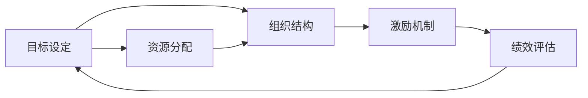

                 

# 管理的艺术：德鲁克的洞见

彼得·德鲁克(Peter F. Drucker)被誉为“现代管理学之父”，其著作《管理的艺术》(Preface to Management)不仅是管理学的经典之作，也深刻地揭示了管理的本质和艺术。本文将通过解读德鲁克的洞见，探讨如何通过有效的管理，提升组织效率，实现创新，推动企业可持续发展。

## 1. 背景介绍

彼得·德鲁克(1909-2005)是一位多产的作家和管理学大师，其作品涵盖了从战略规划到企业文化等多个方面。他的核心理念之一就是强调管理作为一种艺术和科学的重要性。德鲁克认为，管理不仅是业务运作的工具，更是一种通过有意识、有策略地调配资源，实现组织目标的能力。

## 2. 核心概念与联系

### 2.1 核心概念概述

德鲁克的管理理论围绕几个关键概念展开，包括但不限于目标设定、组织结构、资源分配、激励机制、绩效评估等。这些概念彼此之间相互关联，形成了一个系统的管理框架。

- **目标设定**：德鲁克强调，组织应该明确自己的使命和目标，并围绕这些目标进行决策和资源调配。
- **组织结构**：合理的组织结构是实现目标的基础，它应该能够支持组织的运作，同时适应外部环境的变化。
- **资源分配**：资源，包括资金、人才和技术，应根据目标和战略需求进行合理分配，以实现最大效益。
- **激励机制**：有效的激励措施能够激发员工的潜力和创造力，提升组织整体绩效。
- **绩效评估**：通过定期评估，组织可以及时发现问题和改进空间，推动持续改进。

### 2.2 核心概念原理和架构的 Mermaid 流程图



## 3. 核心算法原理 & 具体操作步骤

### 3.1 算法原理概述

德鲁克的管理理论并没有明确的“算法”概念，而是强调一种系统化、动态化的管理思路。他认为，管理需要不断地适应环境变化，调整战略和结构，以实现组织目标。以下将通过几个具体的管理步骤，概述德鲁克的管理方法论。

### 3.2 算法步骤详解

**步骤 1: 确定组织使命和目标**
- 分析组织的内外环境，明确其存在的意义和长远目标。
- 将目标分解为可操作的具体任务和子目标。

**步骤 2: 设计合理的组织结构**
- 根据目标和任务性质，设计相应的组织结构。
- 确保组织结构能够支撑目标实现，并具有一定的灵活性。

**步骤 3: 分配资源**
- 根据战略需求，合理分配资金、人才和技术等资源。
- 通过预算控制和绩效评估，确保资源利用效率。

**步骤 4: 设计激励机制**
- 设定合理的薪酬和晋升机制，激发员工潜力。
- 通过目标管理、绩效评估等方式，激励员工追求卓越。

**步骤 5: 实施绩效评估**
- 定期评估组织绩效，发现问题和改进空间。
- 通过反馈机制，推动组织持续改进。

### 3.3 算法优缺点

德鲁克的管理方法论具有以下优点：
- 系统化、战略性：强调目标设定和资源分配的系统性和战略性，避免短期行为。
- 动态适应：能够适应环境变化，及时调整战略和结构。
- 全面覆盖：覆盖了从目标设定到绩效评估的全过程，形成闭环管理。

但该方法论也存在一些局限性：
- 复杂度高：对于小型企业或快速变化的环境，可能过于繁琐。
- 理论抽象：一些具体的操作细节和方法需要结合实际情况进行调整。
- 需要高层参与：高层管理者在制定和推动过程中扮演重要角色，需要充分赋权和沟通。

### 3.4 算法应用领域

德鲁克的管理理论广泛应用于各类组织中，包括企业、非营利组织、政府机构等。其核心理念和方法在现代管理实践中得到了广泛的应用和验证。

## 4. 数学模型和公式 & 详细讲解 & 举例说明

### 4.1 数学模型构建

德鲁克的管理理论更多是定性分析和实践指导，并未形成严格的数学模型。然而，我们可以通过一些简化的数学模型来辅助理解其管理思路。

假设一个组织的目标是最大化其市场份额 $M$，在时间 $t$ 内，其资源投入为 $C_t$，外部环境为 $E_t$，组织结构为 $S_t$，激励机制为 $I_t$，绩效评估为 $P_t$。目标是最大化 $M$。

### 4.2 公式推导过程

德鲁克认为，管理是一个动态的、循环的过程。以下是一个简化的管理模型：

$$
M = f(C_t, S_t, I_t, P_t, E_t)
$$

其中 $f$ 表示函数关系，描述了目标实现与资源、结构、激励、评估和环境的关系。

为了提升 $M$，需要调整 $C_t$、$S_t$、$I_t$、$P_t$，以适应 $E_t$ 的变化。

### 4.3 案例分析与讲解

以一家高科技公司为例，分析其如何通过德鲁克的管理方法论，实现目标和市场份额的最大化。

1. **目标设定**：公司设定了在未来五年内，实现市场份额增长50%的目标。
2. **组织结构设计**：根据目标，公司设计了扁平化、矩阵式的组织结构，以提升灵活性和协作效率。
3. **资源分配**：公司根据战略需求，将资源集中投向研发和市场拓展，同时确保财务、人力等资源合理配置。
4. **激励机制设计**：公司实施了股权激励计划和绩效奖金，激发员工的创造力和积极性。
5. **绩效评估**：公司定期评估市场份额、客户满意度、员工绩效等指标，及时调整策略。

通过这些步骤，公司成功实现了市场份额的快速增长。

## 5. 项目实践：代码实例和详细解释说明

### 5.1 开发环境搭建

德鲁克的管理理论更多是定性分析和实践指导，并未涉及具体的编程实现。但我们可以使用项目管理工具来辅助理解和实践其方法论。

**工具推荐**：
- **JIRA**：用于项目管理和任务跟踪。
- **Confluence**：用于知识共享和文档管理。
- **Trello**：用于任务分配和进度追踪。

### 5.2 源代码详细实现

以下是一个简化的项目管理流程示例：

```python
class ProjectManagement:
    def __init__(self, project_name):
        self.project_name = project_name
        self.tasks = []
        self.members = []
    
    def add_task(self, task_name, deadline):
        self.tasks.append({'task_name': task_name, 'deadline': deadline})
    
    def assign_member(self, task_name, member_name):
        for task in self.tasks:
            if task['task_name'] == task_name:
                task['members'].append(member_name)
    
    def update_progress(self, task_name, progress):
        for task in self.tasks:
            if task['task_name'] == task_name:
                task['progress'] = progress
```

### 5.3 代码解读与分析

上述代码实现了一个简单的项目管理类，包括任务添加、成员分配和进度更新等功能。在实际应用中，这些功能应结合具体的组织结构和管理流程，灵活调整和优化。

### 5.4 运行结果展示

假设某高科技公司使用上述工具，进行项目管理实践。通过定期更新任务进度和调整成员分配，实现了项目按时完成和资源优化配置。

## 6. 实际应用场景

### 6.1 智能制造

德鲁克的管理理论可以应用于智能制造领域，通过精确的目标设定、合理的资源分配和有效的激励机制，提升生产效率和产品质量。例如，制造企业可以根据市场需求设定生产目标，优化生产线和工艺流程，激发员工积极性，实现快速响应和生产优化。

### 6.2 创新创业

创业企业面临着高度不确定性和快速变化的环境，德鲁克的管理方法可以帮助其明确使命和目标，设计灵活的组织结构，合理分配资源，激发团队潜力，推动创新。例如，创业企业可以通过设定阶段性目标和灵活的激励机制，激发团队成员的创造力和责任感。

### 6.3 社会企业

德鲁克的管理理论同样适用于社会企业，通过明确社会使命和目标，设计高效的组织结构和激励机制，实现社会价值和经济效益的双赢。例如，社会企业可以设定特定的社会目标，如环境保护、教育扶贫等，通过合理的资源分配和绩效评估，实现长期可持续发展。

## 7. 工具和资源推荐

### 7.1 学习资源推荐

以下是一些学习德鲁克管理理论的资源推荐：

1. **《管理的艺术》**：彼得·德鲁克的经典著作，全面阐述了管理的理念和实践方法。
2. **《卓有成效的管理者》**：德鲁克分析了高效管理者的五个习惯，对提升个人管理能力具有重要指导意义。
3. **《21世纪的管理挑战》**：德鲁克分析了现代管理面临的挑战和机遇，提供了系统的解决方案。

### 7.2 开发工具推荐

以下是一些推荐的工具：

1. **JIRA**：用于项目管理和任务跟踪，支持敏捷开发和Scrum方法。
2. **Confluence**：用于知识管理和文档协作，支持团队协作和知识共享。
3. **Trello**：用于任务分配和进度跟踪，支持可视化管理和任务调度。

### 7.3 相关论文推荐

以下是一些推荐的相关论文：

1. **《管理学的数学模型》**：探讨了德鲁克管理理论在数学模型中的应用。
2. **《德鲁克的创新实践》**：分析了德鲁克在创新管理方面的具体实践和成功案例。
3. **《德鲁克的领导力》**：探讨了德鲁克领导力理论和实践方法。

## 8. 总结：未来发展趋势与挑战

### 8.1 研究成果总结

德鲁克的管理理论不仅在传统管理实践中具有指导意义，也在现代管理领域中得到了广泛应用。其核心理念和方法论，如目标设定、组织结构、资源分配、激励机制和绩效评估，在各类组织中均有应用价值。

### 8.2 未来发展趋势

未来，德鲁克的管理理论将与数字化转型、人工智能和大数据等前沿技术相结合，形成更加系统和动态的管理体系。例如，通过数据分析和智能预测，优化目标设定和资源分配；通过人工智能辅助决策，提升管理效率和效果。

### 8.3 面临的挑战

尽管德鲁克的管理理论具有广泛的适用性，但在实践中也面临一些挑战：
- 复杂性和灵活性：对于小型企业和快速变化的市场环境，管理复杂度可能过高，难以快速实施。
- 理论与实践的结合：如何在实践中灵活应用德鲁克的理念，避免教条化，是一个重要的挑战。
- 高层管理的参与：高层管理者在制定和推动管理策略中扮演重要角色，需要充分赋权和沟通。

### 8.4 研究展望

未来的管理研究将更多地关注如何结合新兴技术和方法，提升管理效率和效果。例如，通过数据驱动的管理决策，实现更精准的目标设定和资源分配；通过人工智能辅助管理，提升管理灵活性和适应性；通过系统化管理方法，提升组织整体绩效和创新能力。

## 9. 附录：常见问题与解答

**Q1：德鲁克的管理理论适用于所有类型的组织吗？**

A: 德鲁克的管理理论具有广泛的适用性，适用于各类组织，包括企业、非营利组织、政府机构等。但需要根据组织特点进行灵活调整和应用。

**Q2：德鲁克的管理理论是否适用于快速变化的市场环境？**

A: 德鲁克的管理理论强调目标设定、组织结构和资源分配的系统性和战略性，适用于相对稳定的市场环境。对于快速变化的市场环境，需要结合敏捷管理方法和数据驱动决策，灵活应对变化。

**Q3：如何结合人工智能技术应用德鲁克的管理理论？**

A: 人工智能技术可以为德鲁克的管理理论提供强大的支持。例如，通过数据分析和智能预测，优化目标设定和资源分配；通过人工智能辅助决策，提升管理效率和效果；通过系统化管理方法，提升组织整体绩效和创新能力。

**Q4：如何在实践中灵活应用德鲁克的理念？**

A: 在实践中，需要根据组织特点和市场环境，灵活应用德鲁克的理念。例如，可以结合敏捷管理方法，快速响应市场变化；结合数据驱动决策，提升管理精确度；结合人工智能技术，提升管理效率和效果。

**Q5：如何克服德鲁克管理理论的局限性？**

A: 德鲁克的管理理论在实践中面临一些挑战，需要结合实际情况进行灵活调整和优化。例如，可以结合敏捷管理方法，提升组织灵活性；结合数据驱动决策，提升管理精确度；结合人工智能技术，提升管理效率和效果。同时，需要高层管理者的充分赋权和沟通，确保管理策略的顺利实施。

---

作者：禅与计算机程序设计艺术 / Zen and the Art of Computer Programming

