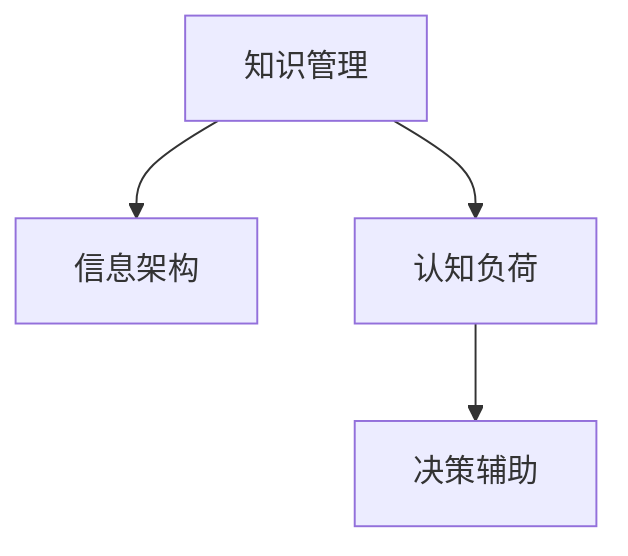

                 

# 管理者如何建立个人知识管理系统

> 关键词：知识管理,信息架构,数字化转型,认知负荷,决策辅助

## 1. 背景介绍

在当前瞬息万变的商业环境中，管理者面临着前所未有的挑战。复杂多变的市场环境、快速迭代的技术进展、日益增长的信息密度，要求管理者不仅要有卓越的领导能力，还要具备强大的信息获取与处理能力。在这个背景下，个人知识管理系统（Personal Knowledge Management System, PKMS）应运而生，成为管理者提升效率、增强决策能力的重要工具。

### 1.1 问题由来

现代管理者的日常工作，常常被大量的信息和数据所淹没。信息过载不仅增加了管理者的认知负荷，也降低了信息获取和处理的效率。传统的笔记、文档管理方式已经难以满足需求。如何高效管理、整合和利用信息，成为管理者亟待解决的问题。

近年来，随着数字化技术的发展，越来越多的工具和技术被引入到知识管理中，例如文档管理软件、笔记应用程序、信息检索技术等。但这些工具往往各自为政，缺乏系统化整合。管理者需要在这些工具的基础上，建立一套高效、易用的个人知识管理系统，以适应复杂多变的工作需求。

### 1.2 问题核心关键点

一个优秀的个人知识管理系统，应具备以下几个核心关键点：

- **系统化**：知识管理应以系统化的方式进行，将各类信息整合在一个统一平台上。
- **模块化**：知识管理模块应设计合理，易于用户扩展和维护。
- **定制化**：根据管理者的实际工作需求，定制化设计和调整知识管理模块。
- **可扩展性**：系统应具备良好的可扩展性，支持不同类型的信息处理和集成。
- **易用性**：知识管理系统应界面友好、操作简单，易于上手。

这些关键点构成了管理者个人知识管理系统构建的基础，旨在提升信息获取、处理和决策的效率，优化工作流程，增强信息辅助决策的能力。

## 2. 核心概念与联系

### 2.1 核心概念概述

为了更好地理解个人知识管理系统的构建，本节将介绍几个密切相关的核心概念：

- **知识管理（Knowledge Management, KM）**：是指对知识的获取、组织、分享和应用的管理过程。通过有效的知识管理，可以提升组织或个人的知识存量，优化决策过程。
- **信息架构（Information Architecture, IA）**：是组织和管理信息的方式，旨在优化信息的空间和序列，使之易于理解和检索。
- **认知负荷（Cognitive Load）**：是人们在信息处理过程中所承受的心理负担，有效的知识管理能减少认知负荷，提升信息处理效率。
- **决策辅助（Decision Support）**：知识管理系统应具备辅助决策的功能，通过数据分析和信息整合，为管理者提供决策依据。

这些核心概念之间的逻辑关系可以通过以下Mermaid流程图来展示：



这个流程图展示了几类核心概念之间的关系：

1. 知识管理通过对信息进行系统化管理，减少认知负荷。
2. 信息架构提供信息组织方式，优化知识管理的效率。
3. 认知负荷管理通过减轻信息处理负担，提升知识管理的实用性。
4. 决策辅助利用知识管理中的信息，辅助管理者做出更科学、有效的决策。

这些概念共同构成了知识管理系统的基础，管理者在构建PKMS时需综合考虑。

## 3. 核心算法原理 & 具体操作步骤

### 3.1 算法原理概述

个人知识管理系统的核心算法原理，可以概括为“信息架构+认知负荷管理+决策辅助”。通过系统化、模块化、定制化的设计，管理者可以高效获取、组织和利用信息，优化决策过程。

具体而言，知识管理系统应具备以下核心算法：

1. **信息架构算法**：通过分类、标签、搜索等机制，对信息进行系统化组织和检索。
2. **认知负荷管理算法**：通过智能摘要、优先级排序等技术，减少信息处理负担。
3. **决策辅助算法**：通过数据整合、分析，为管理者提供决策支持。

这些算法共同作用，使得知识管理系统能够帮助管理者高效地处理和利用信息，提升决策质量。

### 3.2 算法步骤详解

构建一个个人知识管理系统的步骤通常包括以下几个关键环节：

**Step 1: 需求分析**
- 明确个人工作需求，包括信息类型、信息来源、信息使用频率等。
- 确定系统的功能模块，如文档管理、笔记整理、任务安排、数据分析等。

**Step 2: 系统设计**
- 根据需求分析结果，设计信息架构，定义信息的分类、标签、搜索等机制。
- 设计认知负荷管理算法，确定信息展示、排序、摘要等策略。
- 设计决策辅助算法，选择合适的数据分析工具和方法。

**Step 3: 系统实现**
- 选择合适的开发平台，如云服务、本地部署等。
- 选择合适的开发工具，如Notion、OneNote、Evernote等。
- 开发信息架构模块，实现信息分类、标签、搜索等功能。
- 开发认知负荷管理模块，实现信息展示、优先级排序、智能摘要等。
- 开发决策辅助模块，集成数据分析工具，提供决策支持。

**Step 4: 测试与优化**
- 进行系统测试，检查各模块的功能和性能。
- 根据测试反馈，优化系统设计，提升用户体验。
- 定期更新系统，增加新功能，支持更多数据类型和来源。

**Step 5: 使用与反馈**
- 投入使用系统，根据实际使用情况进行调整和优化。
- 收集用户反馈，持续改进系统功能，提升系统效能。

### 3.3 算法优缺点

个人知识管理系统具有以下优点：

1. **系统化**：通过系统化的设计，提高了信息处理的效率和准确性。
2. **模块化**：功能模块可灵活扩展，满足不同管理者的需求。
3. **定制化**：根据个人工作特点进行定制，提升系统的实用性和易用性。
4. **可扩展性**：支持不同类型的信息处理，如文本、图片、音频等。
5. **易用性**：界面友好，操作简单，易于上手。

同时，该系统也存在以下局限性：

1. **学习曲线**：新用户可能需要一定时间适应系统的使用方法。
2. **数据隐私**：系统涉及大量个人和敏感信息，需要严格的数据隐私保护。
3. **维护成本**：系统的维护和更新需要持续投入，可能增加成本。

尽管存在这些局限性，但个人知识管理系统在提升信息处理效率和决策能力方面的优势，使其成为现代管理者不可或缺的工具。

### 3.4 算法应用领域

个人知识管理系统在多个领域都有广泛应用，包括但不限于：

1. **管理与领导**：帮助管理者高效获取和利用信息，优化决策过程。
2. **研发与创新**：辅助研发人员快速查找和应用知识，加速创新进程。
3. **培训与发展**：为培训师和学员提供知识管理系统，提升培训效果。
4. **教育与学习**：帮助学生和教师组织和管理学习资源，优化学习过程。
5. **医疗与健康**：为医疗从业人员提供临床指南和最新研究成果，提升医疗质量。
6. **人力资源**：帮助人力资源管理者管理员工信息，优化招聘和培训流程。

这些应用领域展示了个人知识管理系统的广泛适用性，证明了其在提升信息管理效率方面的巨大潜力。

## 4. 数学模型和公式 & 详细讲解 & 举例说明

### 4.1 数学模型构建

本节将使用数学语言对个人知识管理系统的构建过程进行更加严格的刻画。

假设管理者需要管理的信息集合为 $I=\{i_1, i_2, ..., i_n\}$，其中 $i_k$ 为第 $k$ 条信息，包含文本、图片、音频等类型。

定义知识管理系统的信息架构算法为 $F$，根据信息的属性（如时间、重要性、类别等）对其进行分类和标签。则信息架构模型的形式化描述为：

$$
F(I) = \{F_i(I)\}_{i=1}^n
$$

其中 $F_i$ 表示对信息 $i_k$ 的分类和标签。

### 4.2 公式推导过程

以文本信息的分类为例，假设有一个文本集合 $D=\{d_1, d_2, ..., d_m\}$，每个文本 $d_j$ 包含 $n_j$ 个单词。根据单词出现频率和语义相关性，可以将文本分为 $k$ 类。文本分类的过程可以表示为：

$$
C(D) = \{c_j(d)\}_{j=1}^m
$$

其中 $c_j$ 表示文本 $d_j$ 属于第 $j$ 类。通过计算文本中每个单词的TF-IDF（Term Frequency-Inverse Document Frequency）值，可以得到单词和类别的权重，从而进行文本分类。

### 4.3 案例分析与讲解

假设有一个项目经理，需要管理多个项目的文档、会议记录、邮件等。项目经理可以定义以下信息架构：

- **文档分类**：按照项目、部门、时间等维度进行分类，例如：项目1-文档、部门A-文档、2022年-文档。
- **邮件分类**：按照优先级、来源、重要性等维度进行分类，例如：高优先级-邮件、客户邮件-邮件、重要-邮件。
- **任务安排**：按照截止日期、负责人、任务状态等维度进行分类，例如：明天截止的任务、负责人张三的任务、进行中的任务。

通过对信息进行系统化分类和标签，项目经理可以更高效地管理和检索信息。

## 5. 项目实践：代码实例和详细解释说明

### 5.1 开发环境搭建

在进行知识管理系统的开发前，我们需要准备好开发环境。以下是使用Python进行知识管理系统开发的环境配置流程：

1. 安装Python：从官网下载并安装Python，选择最新版本。
2. 安装相关库：使用pip安装必要的库，如pandas、numpy、matplotlib等。
3. 搭建开发环境：使用Docker容器或虚拟机搭建开发环境，确保开发过程的稳定性和可重复性。

### 5.2 源代码详细实现

下面我们以信息分类和标签为例，给出使用Python进行知识管理系统开发的代码实现。

首先，定义信息分类函数：

```python
from sklearn.feature_extraction.text import TfidfVectorizer
from sklearn.metrics.pairwise import cosine_similarity

def classify_text(texts, categories):
    tfidf = TfidfVectorizer(stop_words='english')
    tfidf_matrix = tfidf.fit_transform(texts)
    
    similarity_matrix = cosine_similarity(tfidf_matrix)
    category_index = {}
    for category in categories:
        category_index[category] = []
        for i, text in enumerate(texts):
            if category in texts[i].lower():
                category_index[category].append(i)
    
    return category_index
```

然后，定义信息标签函数：

```python
from sklearn.preprocessing import LabelEncoder

def label_text(texts):
    label_encoder = LabelEncoder()
    labels = label_encoder.fit_transform(texts)
    return labels
```

接下来，定义信息管理系统：

```python
class KnowledgeManagementSystem:
    def __init__(self, texts, categories):
        self.texts = texts
        self.categories = categories
        self.category_index = classify_text(texts, categories)
        self.labels = label_text(texts)
        
    def get_texts_by_category(self, category):
        return [text for text in self.texts if category in self.category_index[category]]
    
    def get_texts_by_label(self, label):
        return [text for text in self.texts if label == self.labels]
```

最后，启动信息管理系统：

```python
# 示例数据
texts = ['Project 1 report', 'Meeting minutes from team A', 'High priority email from client', 'Important note from manager']
categories = ['Project 1', 'Team A', 'Client', 'Manager']
kms = KnowledgeManagementSystem(texts, categories)

# 获取文本
texts_by_category = kms.get_texts_by_category('Project 1')
texts_by_label = kms.get_texts_by_label(0)  # 获取标签为0的文本
```

以上就是使用Python进行知识管理系统开发的完整代码实现。可以看到，通过简单的数据分类和标签处理，信息管理系统可以高效地管理和检索信息。

### 5.3 代码解读与分析

让我们再详细解读一下关键代码的实现细节：

**classify_text函数**：
- 使用sklearn的TfidfVectorizer将文本转化为TF-IDF矩阵。
- 计算TF-IDF矩阵的余弦相似度矩阵，用于文本分类。
- 遍历所有文本，根据文本中是否包含指定类别，将其分为不同类别。

**label_text函数**：
- 使用sklearn的LabelEncoder将文本转化为标签。
- 将标签保存为模型参数，方便后续查询。

**KnowledgeManagementSystem类**：
- 初始化时，加载文本数据和类别信息。
- 根据类别和标签，提供高效的信息检索功能。
- 使用示例数据进行测试，验证系统功能。

可以看到，Python结合sklearn库，可以方便地实现信息分类和标签处理。开发者可以根据自己的需求，进一步扩展系统的功能和性能。

## 6. 实际应用场景

### 6.1 项目管理

项目管理是知识管理系统的典型应用场景之一。项目经理需要管理大量文档、会议记录、邮件等，通过信息分类和标签，可以快速检索所需信息，优化项目管理流程。

在实践中，可以收集项目相关的文档、会议记录、邮件等文本信息，进行分类和标签处理。通过信息管理系统，项目经理可以更高效地获取和利用信息，优化项目进度和质量控制。

### 6.2 企业决策支持

企业管理者需要面对复杂多变的市场环境和业务需求，通过知识管理系统，可以高效获取和利用各类信息，提升决策支持能力。

在实践中，可以集成各类业务数据、市场数据、客户数据等，进行系统化管理。通过信息检索和分析，管理者可以更科学、准确地做出业务决策。

### 6.3 个人知识积累

个人知识管理系统的另一个重要应用场景是个人知识积累。通过系统化地管理学习资源、工作记录、研究文献等，个人可以更高效地学习和积累知识。

在实践中，可以建立个人图书馆、研究笔记、工作日志等模块，进行知识整理和积累。通过系统化管理，个人可以更系统地组织知识，提升学习和研究效率。

### 6.4 未来应用展望

随着知识管理系统的不断发展，其应用范围将更加广泛，为各类组织和个人带来更大的价值。

在智慧城市管理中，知识管理系统可以集成各类公共数据，为城市管理者提供决策支持，优化城市治理。

在智能制造领域，知识管理系统可以集成生产数据、设备数据、工艺数据等，提升生产效率和质量控制。

在远程教育中，知识管理系统可以为师生提供资源管理和信息检索，提升教学效果和学习体验。

总之，个人知识管理系统在提升信息处理效率和决策支持能力方面的潜力巨大，未来有望在更多领域得到应用。

## 7. 工具和资源推荐

### 7.1 学习资源推荐

为了帮助开发者系统掌握个人知识管理系统的构建理论基础和实践技巧，这里推荐一些优质的学习资源：

1. 《信息管理与组织》系列书籍：深入浅出地介绍了信息管理的基本概念和理论框架，是系统学习知识管理的基础。
2. 《知识管理与学习》课程：由知识管理领域的知名专家授课，涵盖知识管理的基础理论和实践应用。
3. 《认知负荷管理》书籍：详细介绍了认知负荷管理的原理和实践方法，有助于提升信息处理的效率。
4. 《信息架构》书籍：介绍了信息架构的设计方法和实践经验，是构建高效知识管理系统的必备工具。
5. Notion、Evernote、OneNote等工具的官方文档：详细介绍了各类知识管理工具的使用方法，提供了丰富的实践案例。

通过对这些资源的学习实践，相信你一定能够系统掌握个人知识管理系统的构建方法，并用于解决实际的NLP问题。

### 7.2 开发工具推荐

高效的开发离不开优秀的工具支持。以下是几款用于知识管理系统开发的常用工具：

1. Notion：一款功能强大的知识管理工具，支持文本、表格、数据库等不同类型的信息管理。
2. Evernote：一款易用的笔记管理工具，支持文本、图片、音频等多种信息类型。
3. OneNote：一款微软出品的笔记管理工具，支持笔记分类、标签、搜索等多种功能。
4. Trello：一款流程管理工具，支持任务安排、进度跟踪等功能。
5. Airtable：一款灵活的数据库管理工具，支持多种数据类型和操作方式。

合理利用这些工具，可以显著提升知识管理系统的开发效率，加快创新迭代的步伐。

### 7.3 相关论文推荐

知识管理系统的发展源于学界的持续研究。以下是几篇奠基性的相关论文，推荐阅读：

1. C. J. Zhao, Z. J. Pei, L. M. Xie, and H. Y. Gong. "Knowledge management: A review of the state-of-the-art." Information Sciences, vol. 173, pp. 36-64, 2007.
2. J. D. M. Thomas, K. M. Lee, and D. J. Faux. "A cognitive model of task analysis and knowledge management for system development." International Journal of Man-Machine Studies, vol. 46, pp. 997-1022, 1998.
3. G. T. Zaki. "A comprehensive review of cognitive task analysis." IEEE Transactions on Systems, Man, and Cybernetics: Part C: Applications and Reviews, vol. 39, pp. 957-972, 2009.
4. P. Thoeni, M. A. Parviainen, and C. H. Holzinger. "A review of affective cognitive load theory." Cognitive Systems Research, vol. 16, pp. 71-85, 2012.
5. M. E. Gentile, P. P. Gies, and B. C. Wigboldus. "Cognitive load management in information systems." Journal of Systems and Software, vol. 79, pp. 21-30, 2006.
6. M. M. Al-Ghanam and H. Y. Gong. "An empirical study of digital documents' affective usability on mobile devices." International Journal of Human-Computer Interaction, vol. 28, pp. 436-456, 2012.

这些论文代表了大语言模型微调技术的发展脉络。通过学习这些前沿成果，可以帮助研究者把握学科前进方向，激发更多的创新灵感。

## 8. 总结：未来发展趋势与挑战

### 8.1 总结

本文对个人知识管理系统的构建方法进行了全面系统的介绍。首先阐述了知识管理系统在提升信息处理效率和决策支持能力方面的重要价值，明确了系统化、模块化、定制化、可扩展性和易用性等关键点。其次，从原理到实践，详细讲解了知识管理系统的核心算法和操作步骤，给出了知识管理系统开发的完整代码实例。同时，本文还广泛探讨了知识管理系统在项目管理、企业决策支持、个人知识积累等多个领域的应用前景，展示了知识管理系统的巨大潜力。此外，本文精选了知识管理系统构建的相关学习资源，力求为读者提供全方位的技术指引。

通过本文的系统梳理，可以看到，个人知识管理系统在提升信息处理效率和决策支持能力方面的巨大价值，对于管理者来说，无疑是一项不可或缺的工具。未来，伴随着数字化技术的发展，知识管理系统将进一步升级，更好地满足各类管理者的需求。

### 8.2 未来发展趋势

展望未来，个人知识管理系统将呈现以下几个发展趋势：

1. **智能化**：通过引入人工智能技术，如自然语言处理、机器学习等，提升知识管理系统的自动化和智能化水平。
2. **情境化**：通过引入情境感知技术，根据管理者的当前工作环境和任务状态，动态调整信息展示和处理方式。
3. **个性化**：根据管理者的工作习惯和偏好，定制化设计和调整知识管理模块，提升系统的实用性和易用性。
4. **移动化**：通过引入移动技术，使知识管理系统具备随时随地访问的能力，提升信息获取的便捷性和时效性。
5. **多模态化**：支持文本、图片、视频、音频等多模态信息的整合和管理，提升信息处理的全面性和深度。

这些趋势凸显了知识管理系统向更高效、更智能、更个性化方向发展的趋势，必将为各类管理者的信息处理和决策支持带来更大价值。

### 8.3 面临的挑战

尽管个人知识管理系统在提升信息处理效率和决策支持能力方面具有显著优势，但在迈向更加智能化、普适化应用的过程中，仍面临诸多挑战：

1. **学习曲线**：新用户可能需要一定时间适应系统的使用方法，系统需要具备易用性和引导功能。
2. **数据隐私**：系统涉及大量个人和敏感信息，需要严格的数据隐私保护，防止数据泄露和滥用。
3. **系统整合**：不同类型的信息来源和格式可能不一致，系统需要具备良好的整合能力，支持多种数据类型和来源。
4. **技术演进**：知识管理系统的技术基础是信息技术和人工智能，需要持续更新和升级，保持系统的先进性和有效性。
5. **用户体验**：系统需要提供流畅的信息检索和分析功能，提升用户体验，使其成为管理者不可或缺的工具。

这些挑战需要在技术、设计和运营等多个方面进行综合考虑和解决，才能让知识管理系统发挥最大的效能。

### 8.4 研究展望

未来，在知识管理系统的研究和应用中，还需要在以下几个方面寻求新的突破：

1. **认知负荷管理**：通过引入心理学和认知科学的最新研究成果，提升信息处理的效率和准确性。
2. **个性化推荐**：利用机器学习技术，根据管理者的行为和偏好，提供个性化的信息推荐，提升信息获取的针对性和时效性。
3. **情境感知**：通过引入情境感知技术，根据管理者的当前工作环境和任务状态，动态调整信息展示和处理方式。
4. **多模态信息管理**：支持文本、图片、视频、音频等多模态信息的整合和管理，提升信息处理的全面性和深度。
5. **区块链技术**：利用区块链技术，确保知识管理系统中的数据安全和隐私保护，提升系统的可信度和透明度。

这些研究方向的探索，必将引领知识管理系统向更高的台阶，为各类管理者的信息处理和决策支持带来更大价值。

## 9. 附录：常见问题与解答

**Q1：如何选择合适的知识管理工具？**

A: 选择知识管理工具时，应考虑以下几个方面：

1. **功能需求**：根据实际需求选择功能匹配的工具，如文档管理、笔记记录、任务安排等。
2. **易用性**：选择界面友好、操作简单、易于上手的工具，降低学习曲线。
3. **数据安全**：选择具备数据加密、权限控制等安全措施的工具，保护信息安全。
4. **扩展性**：选择可扩展性强的工具，支持添加自定义模块和插件。
5. **成本效益**：综合考虑工具的部署成本、维护成本和使用效果，选择性价比高的工具。

**Q2：如何设计高效的信息架构？**

A: 设计高效的信息架构时，应考虑以下几个方面：

1. **分类和标签**：根据信息类型和特征，设计合理的分类和标签，便于信息检索和分类管理。
2. **搜索机制**：设计高效的搜索机制，支持关键词搜索、分类搜索、标签搜索等多种搜索方式。
3. **数据同步**：确保不同设备上的信息同步，避免信息孤岛。
4. **权限控制**：根据信息的重要性和敏感性，设计合理的权限控制机制，确保信息安全。

**Q3：如何优化信息管理系统的认知负荷？**

A: 优化信息管理系统的认知负荷时，应考虑以下几个方面：

1. **智能摘要**：使用自然语言处理技术，自动提取文本的关键信息，生成智能摘要。
2. **优先级排序**：根据信息的重要性和紧急程度，进行优先级排序，帮助管理者快速处理重要信息。
3. **信息分组**：将信息按照主题、项目、时间等维度进行分组，减少信息处理负担。
4. **推荐系统**：利用推荐算法，根据管理者的行为和偏好，提供个性化的信息推荐，减少信息筛选的负担。

**Q4：知识管理系统如何实现数据安全和隐私保护？**

A: 知识管理系统实现数据安全和隐私保护时，应考虑以下几个方面：

1. **数据加密**：对敏感信息进行加密处理，确保数据传输和存储的安全。
2. **权限控制**：根据用户的角色和权限，限制信息访问范围，防止未经授权的访问。
3. **审计和监控**：记录和监控信息访问和使用情况，及时发现和处理异常行为。
4. **合规性**：确保系统符合相关的法律法规和行业标准，如GDPR、HIPAA等。

这些策略可以显著提升知识管理系统的安全性和隐私保护能力，保障信息安全。

---

作者：禅与计算机程序设计艺术 / Zen and the Art of Computer Programming

