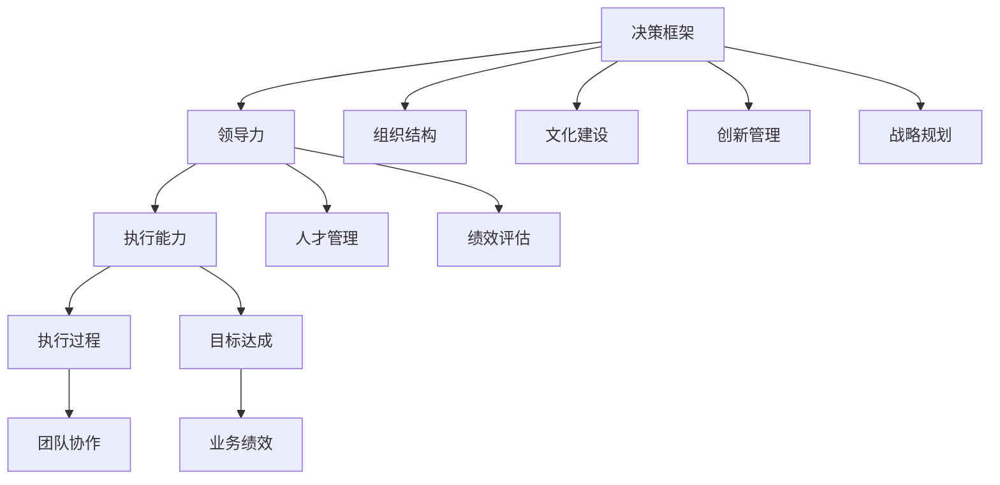

                 

# 管理者如何形成自己的方法论

> 关键词：管理者,方法论,决策,领导力,组织结构,文化,创新,战略,执行,人才管理,绩效评估

## 1. 背景介绍

管理者，作为企业或组织的核心决策者和执行者，其工作质量直接影响到企业的战略执行和业务绩效。但事实上，很多管理者在实际工作中常常感到力不从心，无法有效应对复杂多变的环境挑战。究其原因，在于缺乏一套系统的、科学的方法论，导致决策和执行过程中出现偏差和失误。

为了帮助管理者形成自己的方法论，本文将从决策框架、领导力构建、组织管理、人才管理和绩效评估等几个关键维度，系统阐述管理者应如何运用科学的方法论，提升其决策和执行能力，实现企业的高效运营和长期发展。

## 2. 核心概念与联系

### 2.1 核心概念概述

为更好地理解管理者如何形成自己的方法论，本节将介绍几个关键核心概念：

- **决策框架**：管理者在面对复杂问题时，应有一套系统化的决策框架，确保决策的科学性和合理性。决策框架包括信息收集、数据分析、备选方案评估、决策执行等步骤。

- **领导力**：领导力是管理者最重要的素质之一，涵盖战略思考、团队激励、沟通协调等方面。优秀的领导力能够引领团队达成共同目标。

- **组织结构**：合理的组织结构能够提高企业运营效率，确保决策执行顺畅。组织结构设计要考虑不同职能和层级的关系、信息的流动方式等。

- **文化建设**：企业文化是企业价值观和行为准则的集中体现，影响员工的工作态度和团队氛围。文化建设需要管理者在价值观、行为规范、沟通机制等方面进行长期培育。

- **创新管理**：创新是企业保持竞争力的关键，管理者应建立持续创新的机制和环境，激发员工的创新激情。

- **战略规划**：战略规划决定企业的发展方向和目标，管理者需根据市场环境和自身资源，制定和调整企业战略。

- **执行能力**：管理者不仅需要制定战略，还需具备执行能力，将战略落地为具体的行动计划和实施步骤。

- **人才管理**：人才是企业最重要的资产，管理者需关注人才的招募、培养、激励和留任，构建高绩效团队。

- **绩效评估**：绩效评估是衡量员工工作成果和团队绩效的重要手段，管理者需建立公平、透明的绩效评估体系。

这些核心概念之间的逻辑关系可以通过以下Mermaid流程图来展示：



这个流程图展示了一系列关键管理活动的相互关系和作用机制：

1. 决策框架为其他管理活动提供基础。
2. 领导力贯穿于所有管理活动的始终。
3. 组织结构、文化建设、创新管理和战略规划为决策框架的执行提供保障。
4. 执行能力和人才管理确保决策执行到位，绩效评估衡量执行效果。

## 3. 核心算法原理 & 具体操作步骤
### 3.1 算法原理概述

管理者形成自己的方法论，本质上是将一系列管理原则和工具系统化、结构化，形成一套适用于不同情境的决策框架。其核心思想是：基于数据驱动、系统思考和持续改进的思路，构建科学合理的方法论，用以指导日常管理实践。

### 3.2 算法步骤详解

管理者形成自己的方法论，一般包括以下几个关键步骤：

**Step 1: 明确管理目标和战略**
- 管理者应明确企业或团队的目标和战略，确保管理活动围绕这些核心目标展开。

**Step 2: 建立决策框架**
- 设计一套系统化的决策框架，包括信息收集、数据分析、备选方案评估和决策执行等步骤。

**Step 3: 收集和分析数据**
- 根据决策框架，收集相关数据和信息，使用数据分析工具进行统计和挖掘。

**Step 4: 制定和评估备选方案**
- 提出多个备选方案，并根据数据分析结果进行评估和选择。

**Step 5: 实施和监控**
- 执行决策并监控其效果，根据实际情况进行调整和优化。

**Step 6: 持续改进**
- 定期回顾管理活动，总结经验和教训，持续改进方法论。

### 3.3 算法优缺点

基于数据驱动的方法论具有以下优点：
1. 科学性高。基于数据和分析的决策，减少了主观偏见，提高决策的准确性和合理性。
2. 适应性强。系统化的决策框架能够应对各种复杂情境，提高决策的灵活性和可靠性。
3. 可操作性强。方法论的具体步骤明确，易于执行和落地。

同时，该方法论也存在一定的局限性：
1. 数据获取难度大。高质量的数据获取需要投入大量资源，可能面临成本高、时效性差等问题。
2. 复杂度较高。方法论的设计和实施需要高水平的管理能力和技术支持。
3. 依赖外部工具。数据分析和评估需要借助外部工具，可能影响决策的及时性和准确性。

尽管存在这些局限性，但就目前而言，基于数据驱动的方法论仍然是管理决策的黄金标准，广泛应用于各类企业和组织。未来相关研究的重点在于如何进一步降低数据获取成本，提高方法论的易用性和可操作性，同时兼顾决策的及时性和准确性。

### 3.4 算法应用领域

基于数据驱动的管理者方法论，在企业战略规划、组织管理、人才管理、绩效评估等多个领域都有广泛应用，例如：

- 企业战略规划：通过数据分析和市场研究，制定科学合理的企业战略。
- 组织管理：设计合理的组织结构，明确不同层级和职能的关系，提高运营效率。
- 人才管理：通过数据驱动的人才评估和激励机制，构建高效团队。
- 绩效评估：建立科学的绩效评估体系，确保评估结果的公正性和有效性。
- 创新管理：通过数据分析和市场研究，识别创新机会，推动技术创新和产品迭代。

## 4. 数学模型和公式 & 详细讲解  
### 4.1 数学模型构建

本节将使用数学语言对管理者形成自己的方法论过程进行更加严格的刻画。

假设企业面临一个复杂决策问题，记决策变量为 $x_i$，约束条件为 $c_j(x)$，目标函数为 $f(x)$。管理者的决策目标为：

$$
\min_{x} f(x) \text{ 或 } \max_{x} f(x)
$$

其中，$f(x)$ 为目标函数，$c_j(x)$ 为约束条件。

通过线性规划等优化算法，求解上述目标，得到最优决策方案 $x^*$：

$$
x^* = \mathop{\arg\min}_{x} f(x) \text{ 或 } \max_{x} f(x)
$$

在实践中，由于决策问题的复杂性，可能无法通过简单的线性规划求解。此时，需要采用更复杂的算法，如混合整数规划、动态规划等。

### 4.2 公式推导过程

以下我们以线性规划为例，推导求解线性规划的数学模型及其求解方法。

假设目标函数为：

$$
f(x) = c^Tx
$$

其中 $c^T$ 为向量，$x$ 为向量。

假设约束条件为：

$$
c_j(x) \leq b_j, \quad j=1,2,\cdots,m
$$

其中 $c_j(x)$ 为线性表达式，$b_j$ 为常数向量。

则线性规划问题可以表示为：

$$
\min_{x} c^Tx \text{ 或 } \max_{x} c^Tx
$$

其中 $x$ 需满足：

$$
c_j(x) \leq b_j, \quad j=1,2,\cdots,m
$$

该问题的标准型表示为：

$$
\min_{x} c^Tx \text{ 或 } \max_{x} c^Tx \text{ 受限于 } c_j(x) \leq b_j, \quad j=1,2,\cdots,m
$$

通过单纯形法、内点法等求解器，求解该优化问题，得到最优解 $x^*$。

### 4.3 案例分析与讲解

假设某公司在市场拓展方面面临以下决策问题：

目标函数：

$$
f(x) = R - C
$$

其中 $R$ 为收入，$C$ 为成本。

约束条件：

$$
c_1(x) = R - M \leq 0
$$

$$
c_2(x) = R - T \leq 0
$$

其中 $M$ 为最小销售额，$T$ 为平均利润率。

根据上述目标和约束，可建立线性规划模型，求解最优市场拓展策略。

## 5. 项目实践：代码实例和详细解释说明
### 5.1 开发环境搭建

在进行管理决策优化实践前，我们需要准备好开发环境。以下是使用Python进行PuLP优化的环境配置流程：

1. 安装PuLP库：从官网下载并安装PuLP库，用于线性规划等优化问题的求解。
```bash
pip install pulp
```

2. 创建并激活虚拟环境：
```bash
conda create -n optimization_env python=3.8 
conda activate optimization_env
```

3. 编写优化模型代码，并使用PuLP进行求解：
```python
from pulp import *

# 定义模型
model = LpProblem("Market Expansion Optimization", LpMaximize)

# 定义决策变量
x = LpVariable("Sales", lowBound=0, cat='Integer')

# 定义目标函数
model += x

# 定义约束条件
model += LpConstraint(x >= 100, "Minimum Sales")
model += LpConstraint(x <= 200, "Average Profit Rate")

# 求解模型
model.solve()

# 输出结果
print("决策变量：", x.value())
print("目标函数值：", value(model.objective))
```

完成上述步骤后，即可在`optimization_env`环境中开始决策优化实践。

### 5.2 源代码详细实现

这里我们以某公司的资源分配问题为例，给出使用PuLP进行资源优化分配的Python代码实现。

首先，定义问题数据：

```python
# 任务数据
tasks = [
    {"name": "A", "required_resources": [1, 2, 3], "priority": 5},
    {"name": "B", "required_resources": [2, 3, 4], "priority": 3},
    {"name": "C", "required_resources": [1, 2, 4], "priority": 4},
    {"name": "D", "required_resources": [1, 3, 5], "priority": 2},
]

# 可用资源
available_resources = {
    "CPU": 10,
    "RAM": 20,
    "Disk": 5,
}

# 目标函数
target = LpMaximize(0)

# 定义决策变量
tasks_vars = LpVariable.dicts("Task", tasks, lowBound=0, cat='Integer')
```

然后，定义资源约束条件：

```python
# 定义资源约束
for task in tasks:
    for resource in task["required_resources"]:
        model += tasks_vars[task["name"]] >= available_resources[resource], f"{task['name']}资源消耗"

# 定义任务优先级约束
for task in tasks:
    model += tasks_vars[task["name"]] <= task["priority"], f"{task['name']}优先级"
```

最后，求解模型并输出结果：

```python
# 求解模型
model.solve()

# 输出结果
print("最优解：", tasks_vars)
print("目标函数值：", value(model.objective))
```

以上就是使用PuLP进行资源优化分配的完整代码实现。可以看到，PuLP库提供了简洁的API接口，使得优化模型的构建和求解变得简单高效。

### 5.3 代码解读与分析

让我们再详细解读一下关键代码的实现细节：

**优化模型代码**：
- 定义优化模型，并设置目标函数为最大化。
- 定义决策变量 $x_i$，表示任务 $i$ 的执行情况。
- 定义约束条件，包括资源消耗约束和任务优先级约束。

**目标函数代码**：
- 目标函数为最大化 $x_1+x_2+x_3+x_4$，表示最大化任务的执行数量。

**资源约束代码**：
- 循环遍历任务数据，为每个任务设置资源消耗约束。
- 定义资源约束函数，确保任务消耗的资源不超过可用资源。

**任务优先级约束代码**：
- 循环遍历任务数据，为每个任务设置优先级约束。
- 定义优先级约束函数，确保任务按照优先级顺序执行。

**求解模型代码**：
- 调用求解器求解模型，得到最优解。
- 输出最优解和目标函数值。

可以看到，PuLP库的优化模型实现非常简单，易于理解和调试。但工业级的系统实现还需考虑更多因素，如模型的保存和部署、超参数的自动搜索、更灵活的目标函数设计等。但核心的决策优化思想基本与此类似。

## 6. 实际应用场景
### 6.1 项目资源管理

基于数据驱动的优化方法，可以广泛应用于项目资源管理。传统项目管理往往采用经验判断和手动调整的方式，效率低且难以优化。通过线性规划等优化算法，可以合理分配项目资源，提高项目执行效率。

在技术实现上，可以构建资源分配和任务优先级矩阵，使用线性规划求解最优资源分配方案。同时，实时监控项目进度和资源使用情况，根据实际反馈调整资源分配策略，确保项目按期完成。

### 6.2 供应链管理

供应链管理涉及多节点、多任务的协调优化，数据量大、关系复杂。通过优化算法，可以提升供应链的整体效率和响应速度。

具体而言，可以构建供应链网络图，考虑订单需求、生产能力、物流成本等因素，设计多目标优化模型。使用线性规划或混合整数规划求解最优供应链策略，实时调整生产计划和物流安排，提升供应链的灵活性和可靠性。

### 6.3 人力资源管理

人力资源管理涉及员工分配、绩效评估、薪酬激励等复杂问题。通过数据驱动的管理方法，可以优化人力资源配置，提升员工绩效和满意度。

在实践中，可以建立员工技能矩阵和任务需求矩阵，设计多目标优化模型。使用线性规划或整数规划求解最优员工分配方案，根据员工绩效调整薪酬激励机制，提升整体团队效能。

### 6.4 未来应用展望

随着优化算法和数据技术的不断发展，基于数据驱动的管理方法将在更多领域得到应用，为各类组织提供科学决策的依据。

在智慧城市治理中，优化算法可以应用于交通流量优化、能源调度、公共服务分配等环节，提高城市管理的自动化和智能化水平。

在教育领域，优化方法可以用于课程设置、教师资源分配、学生学业辅导等，提升教育公平性和教学质量。

在金融领域，优化算法可以应用于风险管理、资产配置、客户服务优化等，提升金融机构的运营效率和客户满意度。

此外，在制造业、农业、公共安全等众多领域，基于数据驱动的优化方法也将不断涌现，为经济社会发展注入新的动力。相信随着技术的日益成熟，数据驱动的管理方法必将成为管理决策的重要范式，推动组织运营向更加智能化、高效化方向发展。

## 7. 工具和资源推荐
### 7.1 学习资源推荐

为了帮助管理者系统掌握数据驱动的管理方法，这里推荐一些优质的学习资源：

1. 《数据驱动的管理决策》系列博文：由数据科学家撰写，深入浅出地介绍了数据驱动决策的原理、方法及应用案例。

2. 《运营管理》课程：哈佛商学院开设的管理学经典课程，涵盖生产管理、供应链管理等多个方向，提供系统的理论基础和案例分析。

3. 《运筹学》书籍：经典的运筹学教材，全面介绍了线性规划、整数规划、混合整数规划等优化算法及其应用。

4. PuLP官方文档：PuLP库的官方文档，提供了大量优化的样例代码，是进行优化算法实践的必备资料。

5. CPLEX官方文档：IBM开发的优化求解器，支持多种优化算法，是进行复杂优化问题求解的强大工具。

通过对这些资源的学习实践，相信你一定能够快速掌握数据驱动的管理决策技术，并用于解决实际的管理问题。

### 7.2 开发工具推荐

高效的开发离不开优秀的工具支持。以下是几款用于数据驱动管理决策优化的常用工具：

1. PuLP：Python编写的线性规划和混合整数规划求解器，易于学习和使用。

2. CPLEX：IBM开发的高级优化求解器，支持多种优化算法，适用于复杂问题的求解。

3. Gurobi：数学建模语言Gurobi Model的优化求解器，支持各种优化算法，并提供了丰富的数据分析功能。

4. Python：Python语言作为优化问题的通用语言，提供了丰富的优化库和数据分析库，易于学习和使用。

5. Jupyter Notebook：交互式的数据分析平台，支持Python、R等多种语言，是进行优化问题实践的好工具。

合理利用这些工具，可以显著提升数据驱动的管理决策优化任务的开发效率，加快创新迭代的步伐。

### 7.3 相关论文推荐

数据驱动的管理决策优化源于学界的持续研究。以下是几篇奠基性的相关论文，推荐阅读：

1. "Linear Programming and Network Flows"：Gary Charles Sorkin的经典著作，全面介绍了线性规划及其应用。

2. "An Introduction to Linear Programming"：Dantzig等人的经典著作，提供了线性规划的数学基础和应用案例。

3. "Integer Programming"：Ling等人的经典著作，详细介绍了整数规划及其优化方法。

4. "The Management of Uncertainty: Dynamics, Economics, and Industrial Organization"：Dixit等人的经典著作，探讨了不确定性下的管理优化问题。

5. "A Survey of Mixed Integer Programming"：Bixby等人的综述性论文，介绍了混合整数规划的应用及优化算法。

这些论文代表了大数据驱动的管理决策优化的发展脉络。通过学习这些前沿成果，可以帮助管理者把握学科前进方向，激发更多的创新灵感。

## 8. 总结：未来发展趋势与挑战

### 8.1 总结

本文对数据驱动的管理者方法论进行了全面系统的介绍。首先阐述了管理者在实际工作中面临的挑战，明确了数据驱动方法论的重要性，以及如何运用科学的方法论，提升决策和执行能力。其次，从决策框架、领导力构建、组织管理、人才管理和绩效评估等几个关键维度，详细讲解了管理者的决策过程，并给出了具体的优化算法和实施步骤。

通过本文的系统梳理，可以看到，数据驱动的管理者方法论是管理者决策和执行的重要工具，能够帮助其科学、合理地处理各种复杂问题，提高决策的科学性和执行的效率性。未来，伴随数据技术的不断进步和应用领域的不断拓展，数据驱动的管理方法必将在更多行业得到广泛应用，提升组织管理效率，推动经济社会发展。

### 8.2 未来发展趋势

展望未来，数据驱动的管理者方法论将呈现以下几个发展趋势：

1. 数据获取和处理技术将更加成熟。随着大数据技术和数据存储技术的不断进步，获取和处理数据的能力将进一步提升，支持更加复杂的管理决策。

2. 决策算法将更加智能和高效。未来的优化算法将结合人工智能技术，如深度学习、强化学习等，实现更加智能化的决策。

3. 数据驱动的管理方法将更加普及。数据驱动的管理方法将在更多行业得到应用，提升各行业的管理效率和竞争能力。

4. 管理者将更加注重数据安全和隐私保护。随着数据驱动管理方法的应用，如何保护数据安全和隐私，将成为重要的课题。

5. 管理者将更加注重数据分析的易用性和可操作性。数据驱动的管理方法将更加简单直观，便于管理者理解和操作。

6. 数据驱动的管理方法将更加人性化。未来的管理方法将更加注重员工的感受和体验，提升员工的工作满意度和组织凝聚力。

以上趋势凸显了数据驱动的管理者方法论的广阔前景。这些方向的探索发展，必将进一步提升管理者决策和执行的科学性和高效性，实现管理活动的目标和价值。

### 8.3 面临的挑战

尽管数据驱动的管理者方法论已经取得了一定的进展，但在实际应用中仍面临诸多挑战：

1. 数据获取和处理成本高。高质量的数据获取和处理需要投入大量资源，可能面临成本高、时效性差等问题。

2. 数据质量和噪声问题。数据驱动的管理方法依赖于高质量的数据，但实际应用中往往存在数据不完整、噪声等问题，影响决策的准确性。

3. 算法复杂度大。复杂的优化算法需要高水平的管理能力和技术支持，可能面临计算复杂度高、求解时间长等问题。

4. 决策数据与执行数据的分离。数据驱动的管理方法往往需要分别建模和管理决策数据和执行数据，可能出现数据不一致等问题。

5. 数据安全和隐私保护问题。在管理决策过程中，如何保护数据安全和隐私，是一个重要挑战。

6. 管理者和决策者的认知偏差。数据驱动的管理方法依赖于数据和算法，但实际应用中管理者和决策者的认知偏差也可能影响决策结果。

面对这些挑战，未来的研究需要在以下几个方面寻求新的突破：

1. 降低数据获取和处理成本，提升数据获取和处理的效率和质量。

2. 提高数据驱动的管理方法的易用性和可操作性，降低算法复杂度。

3. 结合数据驱动和人工直觉，构建更加科学合理的管理决策方法。

4. 加强数据安全和隐私保护，构建安全可靠的管理决策系统。

5. 提升管理者和决策者的认知能力，减少决策偏差和失误。

这些研究方向的探索，将有助于解决数据驱动管理方法应用中的问题，进一步提升管理决策的科学性和有效性。

### 8.4 研究展望

面向未来，数据驱动的管理者方法论需要在以下几个方面进行进一步的研究和探索：

1. 结合人工智能技术，开发更加智能化的管理决策方法，如深度学习、强化学习等。

2. 结合大数据技术，开发更加高效的管理决策算法，如分布式优化、流数据处理等。

3. 结合组织文化和员工行为，开发更加人性化的管理决策方法，如员工行为分析、心理激励等。

4. 结合业务场景，开发更加定制化的管理决策工具，如供应链优化、人力资源管理等。

5. 结合多学科知识，开发更加全面综合的管理决策方法，如数据科学、心理学、经济学等。

这些研究方向的研究，将有助于推动数据驱动管理方法在更多领域的深入应用，提升各行业的管理效率和竞争能力，为经济社会发展注入新的动力。

## 9. 附录：常见问题与解答

**Q1: 数据驱动的管理方法如何应对不确定性？**

A: 数据驱动的管理方法可以通过引入不确定性模型和鲁棒优化技术，应对不确定性带来的影响。例如，使用蒙特卡罗模拟、鲁棒优化等方法，在模型中引入不确定性变量，构建不确定性下的优化模型，提升决策的鲁棒性和稳健性。

**Q2: 数据驱动的管理方法如何降低计算成本？**

A: 数据驱动的管理方法可以通过模型压缩、并行计算、分布式优化等技术，降低计算成本。例如，使用深度学习模型压缩技术，将大模型转换为小模型，减少计算资源消耗；使用分布式优化算法，将计算任务分布到多台机器上，并行计算，提升计算效率。

**Q3: 数据驱动的管理方法如何应对数据噪声？**

A: 数据驱动的管理方法可以通过数据清洗、噪声过滤、异常检测等技术，应对数据噪声。例如，使用数据清洗技术，去除不完整、不准确的数据；使用噪声过滤技术，去除数据中的噪声；使用异常检测技术，识别和处理异常数据。

**Q4: 数据驱动的管理方法如何提升决策透明度？**

A: 数据驱动的管理方法可以通过透明的数据模型、可解释的算法和自动化的决策过程，提升决策透明度。例如，使用透明的数据模型，展示数据和算法的计算过程；使用可解释的算法，展示模型决策的逻辑和依据；使用自动化的决策过程，记录和管理决策路径，便于追踪和审核。

**Q5: 数据驱动的管理方法如何提升决策的个性化？**

A: 数据驱动的管理方法可以通过定制化数据模型、个性化算法和个性化激励机制，提升决策的个性化。例如，根据不同业务场景，构建定制化的数据模型和算法；根据员工需求和偏好，设计个性化的激励机制；根据客户需求和市场变化，调整决策策略。

这些研究方向的研究，将有助于解决数据驱动管理方法应用中的问题，进一步提升管理决策的科学性和有效性，推动经济社会发展。

---

作者：禅与计算机程序设计艺术 / Zen and the Art of Computer Programming

