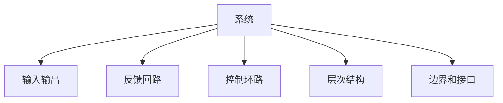

                 

## 1. 背景介绍

系统思考（Systems Thinking）是一种通过观察系统间相互作用和关系来理解问题的思维方式。系统思考强调从整体角度出发，观察系统如何运作和相互关联，而非孤立地看待各个部分。在快速变化和复杂多变的现代社会，系统思考训练变得尤为重要，能够帮助我们更好地理解和解决复杂问题。

## 2. 核心概念与联系

### 2.1 核心概念概述

系统思考涉及到多个关键概念，包括系统、输入输出、反馈回路、控制环路、层次结构、边界和接口等。这些概念紧密联系，共同构成了一个系统的完整运行图景。

- **系统**：由多个相互关联的元素组成，这些元素在系统中具有明确的输入输出关系。系统可以是企业、城市、生态系统等。
- **输入输出**：系统与其他系统之间通过输入输出流进行交互，输入影响输出，输出影响其他系统。
- **反馈回路**：系统内部或系统间的输入和输出之间的循环连接，形成正反馈或负反馈。
- **控制环路**：通过调整输入，以实现对输出的控制。控制环路可以通过手动调节或自动化系统实现。
- **层次结构**：系统可以由多个层次组成，每个层次代表系统不同方面的细节。
- **边界和接口**：系统与其他系统之间存在边界，通过接口进行信息交换。边界和接口决定了系统的开放性。

这些概念之间的逻辑关系可以通过以下Mermaid流程图来展示：



### 2.2 核心概念原理和架构

系统思考的核心在于理解系统各个元素之间的相互作用和影响。系统思考的原理基于以下几个关键点：

- **整体观**：系统由多个部分组成，部分之间相互依赖和影响，不能孤立看待。
- **因果关系**：系统的输入会影响输出，同时输出也会影响输入，形成动态的因果关系。
- **层次性**：系统可以由多个层次组成，每个层次都有其独特的行为和特征。
- **边界和接口**：系统与其他系统之间存在边界和接口，决定了系统的开放性。
- **反馈回路**：系统内部的反馈回路可以对输出进行调节，从而维持系统稳定性。

系统思考的架构包括：

- **系统边界**：系统与其他系统之间存在边界，决定了系统的开放性和封闭性。
- **系统控制**：通过调整输入，实现对输出的控制，维持系统运行。
- **系统反馈**：系统内部的反馈回路可以调整输入，保持系统稳定。
- **系统层次**：系统由多个层次组成，每个层次代表系统不同方面的细节。

这些概念和原理共同构成了一个系统的全貌，帮助人们从整体角度出发，理解和解决复杂问题。

## 3. 核心算法原理 & 具体操作步骤

### 3.1 算法原理概述

系统思考训练的算法原理主要是基于系统动力学模型（System Dynamics Modeling），通过对系统的动力学关系进行建模，理解系统的运行机制和变化规律。系统动力学模型通过建立系统各个元素之间的因果关系，分析系统的行为和稳定性，预测系统的未来趋势。

### 3.2 算法步骤详解

系统思考训练的算法步骤包括以下几个关键步骤：

1. **系统建模**：建立系统的动力学模型，描述系统各个元素之间的因果关系。
2. **系统仿真**：通过仿真软件或编程实现，模拟系统的运行过程，观察系统的行为和趋势。
3. **系统分析**：通过分析仿真结果，理解系统的运行机制和影响因素。
4. **系统优化**：通过调整系统的输入和控制环路，优化系统的运行性能。

### 3.3 算法优缺点

系统思考训练的算法优点包括：

- **整体观**：能够从整体角度出发，理解系统的运行机制和影响因素。
- **动态性**：能够动态模拟系统的运行过程，观察系统的行为和趋势。
- **预测性**：能够通过仿真预测系统的未来趋势，为决策提供支持。

系统思考训练的算法缺点包括：

- **复杂性**：系统动力学模型较为复杂，需要较高的建模和仿真技能。
- **假设性**：系统模型基于假设和简化，可能与实际系统存在差异。
- **不确定性**：系统模型的结果可能存在不确定性，需要结合其他方法进行验证。

### 3.4 算法应用领域

系统思考训练的算法广泛应用于以下几个领域：

1. **企业管理**：通过系统思考，理解企业的运营机制和影响因素，优化企业管理决策。
2. **城市规划**：通过系统思考，理解城市的运行机制和影响因素，优化城市规划和管理。
3. **生态系统管理**：通过系统思考，理解生态系统的运行机制和影响因素，优化生态系统管理。
4. **社会系统研究**：通过系统思考，理解社会系统的运行机制和影响因素，优化社会治理和管理。

## 4. 数学模型和公式 & 详细讲解

### 4.1 数学模型构建

系统思考的数学模型主要基于系统动力学模型，通过建立系统的动力学方程，描述系统各个元素之间的因果关系。

假设系统由 $n$ 个元素组成，每个元素 $i$ 的输入为 $x_i$，输出为 $y_i$，系统内部的反馈回路为 $f_i$，控制环路为 $g_i$。系统动力学模型可以表示为：

$$
\dot{x}_i = f_i(x_1, x_2, \ldots, x_n, y_1, y_2, \ldots, y_n) + g_i(x_i, y_i)
$$

其中 $\dot{x}_i$ 为元素 $i$ 的状态变化率，$f_i$ 和 $g_i$ 分别为系统的内部反馈回路和控制环路函数。

### 4.2 公式推导过程

系统动力学模型的推导过程包括以下几个关键步骤：

1. **建立因果关系**：确定系统各个元素之间的因果关系，描述输入和输出之间的关系。
2. **建立状态方程**：根据因果关系，建立系统的状态方程，描述系统的状态变化。
3. **建立控制方程**：根据控制目标，建立系统的控制方程，描述控制变量对状态的影响。
4. **建立仿真模型**：通过编程或软件实现，建立系统的仿真模型，进行动态模拟。

### 4.3 案例分析与讲解

以一个简单的企业管理系统为例，分析系统思考训练的应用。

假设一个企业有员工、资源和产出三个主要元素。员工通过资源进行生产，产出影响员工满意度和企业的市场竞争力。系统动力学模型可以表示为：

$$
\dot{x} = f(x, y, z) + g(x, y, z)
$$

其中 $x$ 为员工满意度，$y$ 为市场竞争力，$z$ 为资源，$f$ 和 $g$ 分别为员工满意度和市场竞争力的内部反馈回路。

通过建立系统的动力学模型，并进行仿真，可以观察系统的运行过程和趋势，优化系统的管理决策。

## 5. 项目实践：代码实例和详细解释说明

### 5.1 开发环境搭建

系统思考训练的开发环境通常包括以下几个关键组件：

1. **Python**：系统思考训练通常使用Python进行编程实现。
2. **Simulink**：系统动力学模型可以使用Simulink进行建模和仿真。
3. **Sympy**：用于数学符号计算，推导系统动力学方程。
4. **Jupyter Notebook**：用于编写和运行Python代码，进行仿真和分析。

### 5.2 源代码详细实现

以下是一个简单的系统动力学模型实现示例：

```python
import numpy as np
from sympy import symbols, Eq, solve, integrate

# 定义符号变量
x, y, z, t = symbols('x y z t')

# 定义状态方程
dx_dt = 0.01 * z - 0.05 * x
dy_dt = 0.1 * x - 0.05 * y
dz_dt = -0.1 * x - 0.2 * z

# 初始条件
x0, y0, z0 = 0.5, 0.5, 1

# 求解系统动力学方程
x_val, y_val, z_val = solve((Eq(dx_dt, x0), Eq(dy_dt, y0), Eq(dz_dt, z0)), (x, y, z))

# 输出结果
print(x_val, y_val, z_val)
```

### 5.3 代码解读与分析

该代码实现了一个简单的系统动力学模型，描述了员工、市场竞争力和资源的动态变化。通过求解状态方程，得到了系统的运行轨迹。代码中使用了Sympy库进行符号计算，能够方便地推导和求解系统动力学方程。

## 6. 实际应用场景

### 6.1 企业管理

系统思考训练在企业管理中的应用非常广泛。通过系统思考，企业可以更好地理解运营机制和影响因素，优化管理决策。

例如，在供应链管理中，企业可以建立供应链系统的动力学模型，通过仿真和分析，优化供应链的运行效率和稳定性。在人力资源管理中，企业可以建立员工满意度和市场竞争力的动力学模型，通过优化控制变量，提高员工满意度和市场竞争力。

### 6.2 城市规划

系统思考训练在城市规划中的应用也非常广泛。通过系统思考，城市规划者可以更好地理解城市的运行机制和影响因素，优化城市规划和管理。

例如，在交通系统规划中，城市规划者可以建立交通系统的动力学模型，通过仿真和分析，优化交通流和路网结构。在城市能源管理中，城市规划者可以建立能源供需系统的动力学模型，通过优化控制变量，提高能源利用效率和稳定性。

### 6.3 生态系统管理

系统思考训练在生态系统管理中的应用也非常广泛。通过系统思考，生态系统管理者可以更好地理解生态系统的运行机制和影响因素，优化生态系统管理。

例如，在森林管理中，生态系统管理者可以建立森林生长和砍伐的动力学模型，通过仿真和分析，优化森林资源的利用和保护。在水资源管理中，生态系统管理者可以建立水循环和污染的动力学模型，通过优化控制变量，提高水资源的利用效率和水质。

## 7. 工具和资源推荐

### 7.1 学习资源推荐

为了帮助开发者系统掌握系统思考训练的理论基础和实践技巧，这里推荐一些优质的学习资源：

1. **《系统思考:探索复杂世界》**：一本系统思考的经典书籍，详细介绍了系统思考的理论基础和应用案例。
2. **系统动力学课程**：Coursera等在线教育平台提供系统动力学相关课程，涵盖系统动力学模型、仿真和分析等内容。
3. **Simulink教程**：Simulink是系统动力学模型的主流工具，官方提供的教程和文档非常详细，适合新手学习。
4. **Jupyter Notebook教程**：Jupyter Notebook是常用的编程工具，官方提供的教程和文档非常详细，适合新手学习。

通过对这些资源的学习实践，相信你一定能够快速掌握系统思考训练的精髓，并用于解决实际的复杂问题。

### 7.2 开发工具推荐

系统思考训练的开发工具包括：

1. **Python**：系统思考训练通常使用Python进行编程实现，简单易用，生态丰富。
2. **Simulink**：系统动力学模型可以使用Simulink进行建模和仿真，功能强大，易于使用。
3. **Jupyter Notebook**：用于编写和运行Python代码，进行仿真和分析，方便调试和展示。

### 7.3 相关论文推荐

系统思考训练的研究源于学界的持续研究。以下是几篇奠基性的相关论文，推荐阅读：

1. **《系统思考的原理与实践》**：介绍系统思考的基本原理和应用方法，适合初学者入门。
2. **《系统动力学模型与应用》**：详细介绍系统动力学模型的构建和仿真，适合研究人员深入研究。
3. **《复杂系统管理:系统思考与实践》**：介绍系统思考在企业管理和城市规划中的应用，适合实践者参考。

这些论文代表了大系统思考训练的发展脉络。通过学习这些前沿成果，可以帮助研究者把握学科前进方向，激发更多的创新灵感。

## 8. 总结：未来发展趋势与挑战

### 8.1 研究成果总结

系统思考训练的研究在大企业管理、城市规划、生态系统管理等领域取得了显著成果。系统思考训练的方法论和技术手段，已经广泛应用于企业运营、城市治理和生态保护等多个领域，为解决复杂问题提供了有力的工具。

### 8.2 未来发展趋势

展望未来，系统思考训练将呈现以下几个发展趋势：

1. **人工智能的应用**：随着人工智能技术的发展，系统思考训练将更多地应用到AI系统建模和优化中，如智能控制系统、智能城市等。
2. **复杂系统的研究**：系统思考训练将更多地应用于复杂系统的研究中，如气候变化、全球健康等，为解决全球性问题提供支持。
3. **跨学科的融合**：系统思考训练将更多地与其他学科进行融合，如社会学、经济学等，形成跨学科的系统思考方法论。
4. **开源社区的推动**：开源社区的发展将进一步推动系统思考训练的应用普及和技术进步。

### 8.3 面临的挑战

尽管系统思考训练已经取得了显著成果，但在应用推广和优化改进过程中，仍面临诸多挑战：

1. **模型的准确性**：系统思考训练的模型构建和仿真需要高精度的数据和数学模型，模型的准确性直接影响决策的有效性。
2. **复杂性的处理**：系统思考训练通常涉及多个层次、多种因素的交互，模型的复杂性较高，需要较高的建模和分析技能。
3. **现实应用中的问题**：系统思考训练的模型和仿真结果可能与实际应用存在差异，需要结合实际应用情况进行调整和优化。
4. **技术普及和应用**：系统思考训练的技术手段和方法论需要进一步普及和推广，以便更多企业和机构应用。

### 8.4 研究展望

未来的研究需要在以下几个方面寻求新的突破：

1. **模型的自动化**：研究如何自动化系统思考训练的建模和仿真，提高效率和精度。
2. **跨学科融合**：研究如何将系统思考训练与其他学科进行融合，形成更全面的系统思考方法论。
3. **开源社区的发展**：推动系统思考训练技术的开源社区发展，促进技术交流和应用普及。
4. **新技术的融合**：研究如何将人工智能、大数据等新技术融入系统思考训练中，提升模型的预测和优化能力。

通过这些研究方向的探索，相信系统思考训练将在未来发展中取得更大的突破，为解决复杂问题提供更强大、更高效的工具。

## 9. 附录：常见问题与解答

**Q1：系统思考训练和传统分析方法的区别是什么？**

A: 系统思考训练和传统分析方法的主要区别在于整体观和动态性。传统分析方法通常孤立地看待各个部分，而系统思考训练则强调各个部分之间的相互作用和影响，从整体角度出发进行分析和优化。传统分析方法通常是静态的，而系统思考训练则动态地模拟系统的运行过程，观察系统的行为和趋势。

**Q2：如何理解系统思考训练中的因果关系？**

A: 系统思考训练中的因果关系是通过建立系统的状态方程来描述的。每个元素的状态变化率由自身的输出和其他元素的输入决定。理解因果关系需要从整体角度出发，观察元素之间的相互作用和影响，进行推导和建模。

**Q3：系统思考训练中的控制环路和反馈回路有什么区别？**

A: 系统思考训练中的控制环路和反馈回路是两个重要的概念。控制环路是指通过调整输入，实现对输出的控制。反馈回路是指系统内部的输入和输出之间的循环连接，形成动态的因果关系。控制环路主要用于优化系统的运行性能，而反馈回路主要用于保持系统的稳定性和自我调节。

**Q4：系统思考训练的建模和仿真需要哪些技能？**

A: 系统思考训练的建模和仿真需要以下技能：

1. **数学建模**：掌握数学建模的基本方法和工具，如线性代数、微积分、概率论等。
2. **仿真软件使用**：熟练使用系统动力学建模软件，如Simulink、AnyLogic等。
3. **编程能力**：具备编程能力，能够编写和调试仿真代码。
4. **系统思考方法论**：掌握系统思考的基本方法论，能够从整体角度出发，进行系统的分析和优化。

**Q5：系统思考训练在企业管理中的应用有哪些？**

A: 系统思考训练在企业管理中的应用包括：

1. **供应链管理**：建立供应链系统的动力学模型，优化供应链的运行效率和稳定性。
2. **人力资源管理**：建立员工满意度和市场竞争力的动力学模型，优化员工的满意度和市场竞争力。
3. **企业战略规划**：通过系统思考训练，分析企业内部和外部的影响因素，制定战略规划和决策。

---

作者：禅与计算机程序设计艺术 / Zen and the Art of Computer Programming

