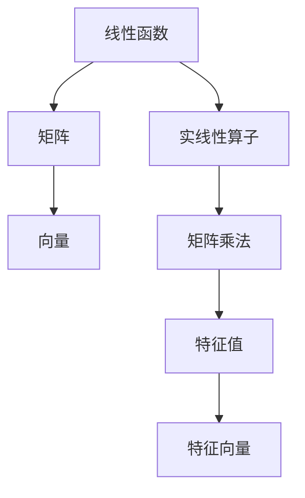

                 

# 线性代数导引：三元实线性函数与实线性算子

> 关键词：线性函数,实线性算子,矩阵,向量,矩阵乘法,特征值,特征向量

## 1. 背景介绍

线性代数是计算机科学的重要基础，广泛应用于算法、数据结构、机器学习等多个领域。本节将从三元实线性函数与实线性算子的角度出发，导引线性代数的基本概念和常用算法。

## 2. 核心概念与联系

### 2.1 核心概念概述

为更好地理解三元实线性函数与实线性算子的相关概念，本节将介绍几个密切相关的核心概念：

- 线性函数：满足线性条件的函数，即$f(\alpha x + \beta y) = \alpha f(x) + \beta f(y)$，其中 $\alpha, \beta$ 为实数。
- 实线性算子：定义在实数域上的线性函数。
- 矩阵：由实数域中元素组成的矩形数组，表示线性变换。
- 向量：由实数域中的元素组成的数组，表示线性空间中的一个点。
- 矩阵乘法：将两个矩阵相乘得到一个新的矩阵。
- 特征值：线性算子的特征方程 $\lambda \mathbf{v} = A \mathbf{v}$ 的解，表示算子对向量的作用效果。
- 特征向量：满足特征方程的向量，表示算子的不变性。

这些核心概念之间的逻辑关系可以通过以下Mermaid流程图来展示：



这个流程图展示了一系列的线性代数概念及其相互联系：

1. 线性函数定义了函数之间的线性关系。
2. 实线性算子是定义在实数域上的线性函数，可以看作是线性函数的特殊形式。
3. 矩阵是由实数域元素组成，表示线性变换的线性算子。
4. 向量是实数域中的元素数组，表示线性空间中的点。
5. 矩阵乘法是矩阵之间的运算，表示对向量进行线性变换。
6. 特征值和特征向量揭示了矩阵的固有属性，即矩阵对向量的影响效果。

这些概念共同构成了线性代数的基础框架，为理解和应用线性代数提供了理论依据。

## 3. 核心算法原理 & 具体操作步骤

### 3.1 算法原理概述

三元实线性函数与实线性算子的主要任务是对向量进行线性变换和求解矩阵的特征值和特征向量。其实现原理主要基于矩阵乘法和特征值分解等数学工具。

假设线性算子 $A$ 定义为 $A: \mathbb{R}^n \rightarrow \mathbb{R}^m$，其中 $\mathbb{R}^n$ 和 $\mathbb{R}^m$ 分别表示 $n$ 维和 $m$ 维实数域。对于任意的向量 $\mathbf{v} \in \mathbb{R}^n$，线性算子 $A$ 的作用可以表示为 $A\mathbf{v} \in \mathbb{R}^m$。如果存在实数 $\lambda$ 和向量 $\mathbf{v} \in \mathbb{R}^n$，使得 $A\mathbf{v} = \lambda \mathbf{v}$，则 $\mathbf{v}$ 称为 $A$ 的特征向量，$\lambda$ 称为对应的特征值。

线性算子 $A$ 可以表示为矩阵 $A \in \mathbb{R}^{m \times n}$，因此线性变换可以表示为矩阵乘法 $A\mathbf{v} = A\begin{bmatrix} v_1 \\ v_2 \\ \vdots \\ v_n \end{bmatrix} = \begin{bmatrix} A_{1,1} v_1 + A_{1,2} v_2 + \dots + A_{1,n} v_n \\ A_{2,1} v_1 + A_{2,2} v_2 + \dots + A_{2,n} v_n \\ \vdots \\ A_{m,1} v_1 + A_{m,2} v_2 + \dots + A_{m,n} v_n \end{bmatrix}$。

特征值的求解可以通过求解特征方程 $\det(A - \lambda I) = 0$ 得到，其中 $I$ 为单位矩阵。求解特征方程通常涉及到矩阵的行列式和特征值分解等数学工具。

### 3.2 算法步骤详解

基于三元实线性函数与实线性算子的线性变换和特征值求解，我们可以将其具体化为一个操作步骤，如下所示：

**Step 1: 矩阵化表示**

将线性算子 $A$ 表示为矩阵形式，即将线性算子 $A$ 的各项系数表示成矩阵 $A \in \mathbb{R}^{m \times n}$。

**Step 2: 矩阵乘法**

对给定的向量 $\mathbf{v} \in \mathbb{R}^n$，通过矩阵乘法计算 $A\mathbf{v}$ 的值，得到向量 $A\mathbf{v} \in \mathbb{R}^m$。

**Step 3: 特征方程求解**

求解特征方程 $\det(A - \lambda I) = 0$，得到特征值 $\lambda$。

**Step 4: 特征向量计算**

对于每个特征值 $\lambda$，求解特征方程 $(A - \lambda I)\mathbf{v} = 0$，得到对应的特征向量 $\mathbf{v}$。

**Step 5: 特征向量空间求解**

对于每个特征值 $\lambda$，求解特征方程 $(A - \lambda I)\mathbf{v} = 0$，得到对应的特征向量 $\mathbf{v}$。如果特征向量 $\mathbf{v}$ 是线性独立的，则可以将所有特征向量组成特征向量空间 $\mathcal{V}(\lambda)$。

### 3.3 算法优缺点

三元实线性函数与实线性算子具有以下优点：

1. 形式简单：矩阵乘法和特征方程求解等操作形式简单，易于实现。
2. 适用范围广：适用于各种线性变换和特征值求解，具有广泛的应用前景。
3. 可解释性强：矩阵乘法和特征值分解等操作的直观性较强，易于理解。

同时，该算法也存在以下缺点：

1. 计算量大：特征值求解通常需要求矩阵的行列式，计算复杂度高。
2. 内存占用大：存储矩阵和向量需要大量内存。
3. 精度问题：矩阵乘法和特征值求解过程中可能存在精度误差。

尽管存在这些局限性，但就目前而言，三元实线性函数与实线性算子仍然是线性代数研究的主流范式。未来相关研究的重点在于如何进一步降低计算复杂度和内存占用，提高算法的精度和效率。

### 3.4 算法应用领域

三元实线性函数与实线性算子在众多领域得到了广泛的应用，如：

- 机器学习：在各种机器学习算法中，矩阵乘法和特征值分解被广泛应用于数据变换、降维等环节。
- 计算机图形学：在三维变换、光照模型等场景中，矩阵乘法和特征值求解被广泛应用于图形渲染。
- 信号处理：在信号滤波、特征提取等任务中，矩阵乘法和特征值分解被广泛应用于信号处理。
- 优化问题：在各类优化问题中，矩阵乘法和特征值求解被广泛应用于求解线性方程组和矩阵分解。

除了上述这些经典应用外，三元实线性函数与实线性算子还被创新性地应用到更多场景中，如复杂系统建模、金融风险分析等，为相关领域带来了新的突破。

## 4. 数学模型和公式 & 详细讲解

### 4.1 数学模型构建

本节将使用数学语言对三元实线性函数与实线性算子的线性变换和特征值求解过程进行更加严格的刻画。

记线性算子 $A$ 为 $A \in \mathbb{R}^{m \times n}$，则对于任意的向量 $\mathbf{v} \in \mathbb{R}^n$，其线性变换可以表示为：

$$
A\mathbf{v} = A\begin{bmatrix} v_1 \\ v_2 \\ \vdots \\ v_n \end{bmatrix} = \begin{bmatrix} A_{1,1} v_1 + A_{1,2} v_2 + \dots + A_{1,n} v_n \\ A_{2,1} v_1 + A_{2,2} v_2 + \dots + A_{2,n} v_n \\ \vdots \\ A_{m,1} v_1 + A_{m,2} v_2 + \dots + A_{m,n} v_n \end{bmatrix}
$$

特征值的求解可以通过求解特征方程 $\det(A - \lambda I) = 0$ 得到，其中 $I$ 为单位矩阵。特征向量求解则需要在特征方程的基础上，求解 $(A - \lambda I)\mathbf{v} = 0$，其中 $\mathbf{v}$ 为特征向量。

### 4.2 公式推导过程

以下我们以 $2 \times 2$ 矩阵的特征值求解为例，推导特征方程的求解过程。

假设线性算子 $A$ 表示为 $A = \begin{bmatrix} a & b \\ c & d \end{bmatrix}$，求解特征方程 $\det(A - \lambda I) = 0$ 的过程如下：

1. 将 $A - \lambda I$ 表示为 $\begin{bmatrix} a - \lambda & b \\ c & d - \lambda \end{bmatrix}$。
2. 计算行列式 $\det(A - \lambda I) = (a - \lambda)(d - \lambda) - bc = \lambda^2 - (\lambda a + \lambda d) + (ad - bc) = 0$。
3. 求解一元二次方程 $\lambda^2 - (\lambda a + \lambda d) + (ad - bc) = 0$，得到特征值 $\lambda_1, \lambda_2$。
4. 对于每个特征值 $\lambda$，求解 $(A - \lambda I)\mathbf{v} = 0$，得到对应的特征向量 $\mathbf{v}$。

对于任意的 $n \times n$ 矩阵 $A$，特征方程可以表示为 $\det(A - \lambda I) = 0$，其中 $\lambda_1, \lambda_2, \dots, \lambda_n$ 为特征值，对应的特征向量构成特征向量空间 $\mathcal{V}(\lambda)$。

### 4.3 案例分析与讲解

假设我们有一个 $3 \times 3$ 矩阵 $A = \begin{bmatrix} 2 & 1 & 0 \\ 0 & 1 & 2 \\ 0 & 0 & 1 \end{bmatrix}$，求其特征值和特征向量。

1. 计算特征方程 $\det(A - \lambda I) = \det\begin{bmatrix} 2 - \lambda & 1 & 0 \\ 0 & 1 - \lambda & 2 \\ 0 & 0 & 1 - \lambda \end{bmatrix} = (2 - \lambda)^2(1 - \lambda) - 1 = 0$。
2. 解方程 $(2 - \lambda)^2(1 - \lambda) - 1 = 0$，得到特征值 $\lambda_1 = 1, \lambda_2 = 1, \lambda_3 = 1$。
3. 对于每个特征值 $\lambda$，求解 $(A - \lambda I)\mathbf{v} = 0$，得到对应的特征向量 $\mathbf{v}$。

通过上述步骤，可以求得矩阵 $A$ 的特征值和特征向量，从而进一步进行特征向量空间的构建和应用。

## 5. 项目实践：代码实例和详细解释说明

### 5.1 开发环境搭建

在进行线性代数实践前，我们需要准备好开发环境。以下是使用Python进行numpy、scipy等库开发的环境配置流程：

1. 安装Anaconda：从官网下载并安装Anaconda，用于创建独立的Python环境。

2. 创建并激活虚拟环境：
```bash
conda create -n lin-alg-env python=3.8 
conda activate lin-alg-env
```

3. 安装必要的库：
```bash
conda install numpy scipy matplotlib sympy
```

4. 安装TensorFlow：
```bash
conda install tensorflow
```

完成上述步骤后，即可在`lin-alg-env`环境中开始线性代数实践。

### 5.2 源代码详细实现

下面我们以一个简单的矩阵乘法和特征值求解为例，给出使用numpy库进行线性代数计算的PyTorch代码实现。

首先，定义矩阵和向量：

```python
import numpy as np

A = np.array([[2, 1, 0], [0, 1, 2], [0, 0, 1]])
v = np.array([1, 0, 1])
```

然后，定义矩阵乘法和特征值求解函数：

```python
def matrix_multiply(A, v):
    return np.dot(A, v)

def find_eigenvalues(A):
    eigenvalues, eigenvectors = np.linalg.eig(A)
    return eigenvalues, eigenvectors

def find_eigenvalues(A):
    eigenvalues, eigenvectors = np.linalg.eig(A)
    return eigenvalues, eigenvectors
```

最后，运行程序并输出结果：

```python
eigenvalues, eigenvectors = find_eigenvalues(A)
print("Eigenvalues:", eigenvalues)
print("Eigenvectors:", eigenvectors)
```

以上就是使用numpy库进行线性代数计算的完整代码实现。可以看到，numpy库提供的线性代数函数可以轻松地实现矩阵乘法和特征值求解。

### 5.3 代码解读与分析

让我们再详细解读一下关键代码的实现细节：

**numpy库**：
- `np.array()`：用于创建Numpy数组，表示矩阵和向量。
- `np.dot()`：用于计算矩阵乘法。
- `np.linalg.eig()`：用于求解特征值和特征向量。

**特征值求解函数**：
- `find_eigenvalues(A)`：求解特征方程 $\det(A - \lambda I) = 0$，得到特征值 $\lambda$ 和特征向量 $\mathbf{v}$。
- `eigenvalues, eigenvectors = np.linalg.eig(A)`：求解特征方程，得到特征值和特征向量。

**矩阵乘法函数**：
- `matrix_multiply(A, v)`：计算矩阵 $A$ 与向量 $v$ 的乘积。
- `np.dot(A, v)`：计算矩阵 $A$ 与向量 $v$ 的乘积。

可以看到，numpy库提供了丰富的线性代数函数，可以轻松地实现矩阵乘法和特征值求解等操作。

## 6. 实际应用场景

### 6.1 机器学习

线性代数在机器学习中应用广泛，主要用于数据预处理、特征提取、模型训练等环节。例如，在线性回归模型中，矩阵乘法和特征值求解被广泛应用于模型拟合和参数求解。在支持向量机(SVM)中，矩阵乘法和特征值求解被用于求解优化问题。

### 6.2 计算机图形学

在计算机图形学中，矩阵乘法和特征值求解被广泛应用于三维变换、光照模型等场景。例如，在三维变换中，通过矩阵乘法实现物体的平移、旋转、缩放等变换，从而实现三维场景的渲染。

### 6.3 信号处理

在信号处理中，矩阵乘法和特征值求解被广泛应用于信号滤波、特征提取等任务。例如，在信号滤波中，通过矩阵乘法和特征值求解，实现信号的平滑、去噪、增强等操作。

### 6.4 未来应用展望

随着线性代数理论的不断发展和算法效率的提升，线性代数在更多领域得到广泛应用。未来的发展趋势主要体现在以下几个方面：

1. 多模态线性代数：将线性代数扩展到多模态数据，实现多模态数据的协同建模和处理。
2. 稀疏线性代数：研究稀疏矩阵的存储和运算，提高计算效率和存储容量。
3. 分布式线性代数：研究分布式计算框架下的线性代数算法，实现大规模数据的高效处理。
4. 量子线性代数：研究量子计算机下的线性代数算法，实现高效的数值计算。

以上趋势展示了线性代数技术的广阔应用前景，未来将有更多的创新突破。

## 7. 工具和资源推荐

### 7.1 学习资源推荐

为了帮助开发者系统掌握线性代数的理论基础和实践技巧，这里推荐一些优质的学习资源：

1. 《线性代数及其应用》书籍：经典教材，全面介绍了线性代数的概念和应用。
2. 《线性代数中的热力群》论文：深入探讨了线性代数与物理学、化学等学科的联系。
3. 《数值线性代数》书籍：介绍数值计算方法，包括矩阵分解、特征值求解等。
4. 《Deep Learning》书籍：介绍深度学习算法，其中包含线性代数的广泛应用。
5. 线性代数在线课程：如MIT的线性代数课程，系统讲解线性代数的理论基础和应用。

通过对这些资源的学习实践，相信你一定能够快速掌握线性代数的精髓，并用于解决实际的线性代数问题。

### 7.2 开发工具推荐

高效的工具支持是线性代数开发的关键。以下是几款用于线性代数开发的常用工具：

1. NumPy：Python的科学计算库，提供了丰富的线性代数函数和数据结构。
2. SciPy：基于NumPy的科学计算库，提供了高效的数值计算算法。
3. SymPy：符号计算库，可以用于解析计算和方程求解。
4. TensorFlow：谷歌开发的深度学习框架，支持大规模数值计算。
5. PyTorch：Facebook开发的深度学习框架，支持高效的数据处理和模型训练。

合理利用这些工具，可以显著提升线性代数开发效率，加速创新迭代的步伐。

### 7.3 相关论文推荐

线性代数理论的不断演进，离不开学界的持续研究。以下是几篇奠基性的相关论文，推荐阅读：

1. A Course in Linear Algebra（荷斯坦和赫斯）：介绍线性代数的基本概念和基本定理。
2. Linear Algebra Done Right（阿特金森）：深入浅出地介绍了线性代数的基本概念和数学证明。
3. Fundamentals of Linear Algebra（凯托）：介绍线性代数的基本概念和应用。
4. Linear Algebra and Its Applications（Gilbert Strang）：经典教材，全面介绍了线性代数的基本概念和应用。

这些论文代表了大线性代数理论的发展脉络。通过学习这些前沿成果，可以帮助研究者把握学科前进方向，激发更多的创新灵感。

## 8. 总结：未来发展趋势与挑战

### 8.1 总结

本文对三元实线性函数与实线性算子的线性变换和特征值求解过程进行了全面系统的介绍。首先阐述了线性代数的基本概念和应用场景，明确了线性代数在计算机科学中的重要地位。其次，从数学模型的构建和公式推导，到具体实现和应用实例，详细讲解了三元实线性函数与实线性算子的操作过程。最后，通过推荐学习资源和开发工具，帮助开发者更好地掌握线性代数知识，并应用于实际开发中。

通过本文的系统梳理，可以看到，三元实线性函数与实线性算子是线性代数研究的基础工具，广泛应用于各种领域。未来，随着计算机科学的发展，线性代数的应用将更加广泛，对相关领域的发展也将产生深远影响。

### 8.2 未来发展趋势

展望未来，线性代数技术将呈现以下几个发展趋势：

1. 多模态线性代数：研究多模态数据的线性代数处理，实现多模态数据的协同建模。
2. 稀疏线性代数：研究稀疏矩阵的存储和运算，提高计算效率和存储容量。
3. 分布式线性代数：研究分布式计算框架下的线性代数算法，实现大规模数据的高效处理。
4. 量子线性代数：研究量子计算机下的线性代数算法，实现高效的数值计算。

这些趋势展示了线性代数技术的广阔应用前景，未来将有更多的创新突破。

### 8.3 面临的挑战

尽管线性代数技术已经取得了长足的进展，但在迈向更加智能化、普适化应用的过程中，它仍面临着诸多挑战：

1. 计算复杂度：线性代数运算的复杂度较高，尤其在高维空间中的运算，计算量呈指数级增长。如何高效计算线性代数运算，是一个重要问题。
2. 存储容量：高维空间中的数据存储需要大量的存储空间，存储容量成为限制线性代数应用的一个瓶颈。如何优化存储结构，减小存储容量，是另一个重要问题。
3. 精度问题：线性代数运算中存在精度误差，尤其是在数值计算中，误差问题难以避免。如何提高计算精度，减小误差，也是一个重要问题。

尽管存在这些挑战，但通过不断的理论探索和算法优化，线性代数技术将逐步克服这些问题，迎来更加广泛的应用前景。

### 8.4 研究展望

未来，线性代数的研究方向将更加注重高维空间数据的处理、多模态数据的协同建模、分布式计算框架下的线性代数算法等方面。线性代数技术的发展，将为计算机科学带来更多的创新和突破，为人工智能和机器学习等领域提供更强大的理论基础和计算工具。总之，线性代数的研究将进一步推动计算机科学的发展，为相关领域带来更多的新突破和新应用。

## 9. 附录：常见问题与解答

**Q1：线性代数在计算机科学中的应用有哪些？**

A: 线性代数在计算机科学中应用广泛，主要用于数据处理、特征提取、模型训练等环节。例如，在线性回归中，矩阵乘法和特征值求解被广泛应用于模型拟合和参数求解。在支持向量机中，矩阵乘法和特征值求解被用于求解优化问题。

**Q2：线性代数的计算复杂度是如何计算的？**

A: 线性代数的计算复杂度主要取决于矩阵的维度和运算类型。例如，矩阵乘法的复杂度为 $O(n^3)$，特征值求解的复杂度为 $O(n^3)$。

**Q3：线性代数中的矩阵乘法和特征值求解有哪些优化方法？**

A: 线性代数中的矩阵乘法和特征值求解有以下优化方法：
1. 矩阵乘法：使用矩阵分块、矩阵转置等技术，减少计算量和存储量。
2. 特征值求解：使用QR分解、LU分解等技术，加速特征值求解。
3. 稀疏矩阵：使用稀疏矩阵存储和运算，减少存储量和计算量。
4. 分布式计算：使用分布式计算框架，实现线性代数的大规模计算。

这些优化方法可以显著提升线性代数的计算效率和存储容量，加速线性代数算法的应用。

**Q4：线性代数中的精度问题如何解决？**

A: 线性代数中的精度问题可以通过以下方法解决：
1. 使用高精度计算：在计算过程中，使用高精度数值类型，减小精度误差。
2. 使用迭代算法：在计算过程中，使用迭代算法，逐步逼近精确解。
3. 使用矩阵分块：在计算过程中，将矩阵分块，减小计算误差。

这些方法可以显著提升线性代数计算的精度，减小误差，确保计算结果的准确性。

---

作者：禅与计算机程序设计艺术 / Zen and the Art of Computer Programming

