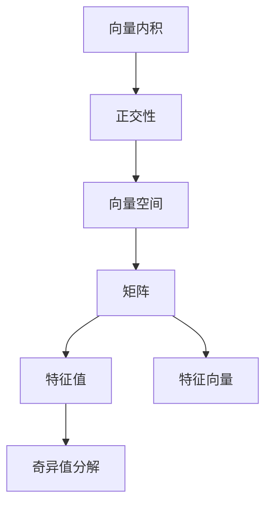

                 

# 线性代数导引：几何向量空间

> 关键词：线性代数, 几何向量空间, 向量内积, 正交性, 矩阵特征值, 奇异值分解

## 1. 背景介绍

### 1.1 问题由来
线性代数作为现代数学的重要分支，其理论基础和方法论在计算机科学和工程领域得到了广泛应用。特别是在处理多维数据和线性系统时，线性代数提供了一种强大的工具和方法。几何向量空间是线性代数的核心概念之一，用于描述几何空间中的点、线和面的性质和关系。本文将系统介绍几何向量空间的基本概念和重要性质，并通过具体的案例分析，帮助读者深入理解这些概念在实际问题中的应用。

### 1.2 问题核心关键点
几何向量空间的核心概念包括：
- 向量(向量内积、正交性、向量空间)
- 矩阵(特征值、特征向量、奇异值分解)
- 几何变换(线性变换、正交变换)

这些概念之间存在紧密联系，共同构成了几何向量空间的理论体系。

### 1.3 问题研究意义
几何向量空间在计算机视觉、机器学习、信号处理等领域有广泛应用。例如，在计算机视觉中，向量空间的几何性质被用于描述图像中的物体的形状和运动；在机器学习中，矩阵的特征值和特征向量用于选择和提取特征；在信号处理中，奇异值分解被用于数据降维和压缩。因此，深入理解几何向量空间的理论，对处理复杂数据和构建高效算法具有重要意义。

## 2. 核心概念与联系

### 2.1 核心概念概述

向量(向量内积、正交性、向量空间)和矩阵(特征值、特征向量、奇异值分解)是几何向量空间中的两个核心概念。下面将对这两个概念进行详细阐述。

#### 2.1.1 向量空间
向量空间是线性代数中的一个重要概念，用于描述一组向量的集合及其加法和数乘运算。向量空间的几何性质包括：
- 加法封闭性：向量的加法在向量空间中封闭。
- 标量封闭性：向量的标量乘法在向量空间中封闭。
- 零向量：存在零向量满足 $0v=v$，对于任意向量 $v$，满足 $-v$ 为 $v$ 的相反向量。

向量空间的维度是向量空间中线性独立的向量个数，也是向量空间的内积空间（即欧几里得空间）的维度。

#### 2.1.2 向量内积
向量内积是向量空间中的一个重要运算，用于计算两个向量的点积。向量内积的定义如下：
$$
\langle u, v \rangle = \sum_{i=1}^n u_i v_i
$$
其中 $u= (u_1, u_2, \ldots, u_n)$ 和 $v= (v_1, v_2, \ldots, v_n)$ 为 $n$ 维向量。

向量内积具有以下性质：
- 共轭对称性：$\langle u, v \rangle = \langle v, u \rangle$。
- 标量相关性：$\langle c u, v \rangle = c \langle u, v \rangle$ 和 $\langle u, c v \rangle = c \langle u, v \rangle$。
- 分布律：$\langle u + w, v \rangle = \langle u, v \rangle + \langle w, v \rangle$。

#### 2.1.3 正交性
正交性是向量空间中的一种特殊性质，用于描述向量之间的线性无关性。如果两个向量 $u$ 和 $v$ 满足 $\langle u, v \rangle = 0$，则称 $u$ 和 $v$ 正交。两个向量 $u$ 和 $v$ 正交的充要条件是 $u$ 和 $v$ 是线性无关的。

#### 2.1.4 矩阵
矩阵是几何向量空间中的另一个核心概念，用于描述线性变换。矩阵的维数由行数和列数决定，行数称为矩阵的行数，列数称为矩阵的列数。矩阵的元素为实数或复数。

#### 2.1.5 矩阵特征值和特征向量
矩阵的特征值和特征向量用于描述矩阵的几何和代数性质。矩阵 $A$ 的特征值和特征向量满足：
$$
A \vec{v} = \lambda \vec{v}
$$
其中 $\vec{v}$ 是特征向量，$\lambda$ 是对应的特征值。特征向量是矩阵 $A$ 的特征空间中的基向量。

#### 2.1.6 奇异值分解
奇异值分解是矩阵分解的一种重要方法，用于将一个矩阵分解成三个矩阵的乘积。奇异值分解可以用于矩阵的降维、数据压缩和特征提取。奇异值分解的定义如下：
$$
A = U \Sigma V^T
$$
其中 $U$ 和 $V$ 是正交矩阵，$\Sigma$ 是对角矩阵。对角矩阵 $\Sigma$ 的对角线上的元素称为奇异值，用于衡量矩阵的"瘦瘦"程度。

### 2.2 核心概念之间的联系

向量内积、正交性、矩阵、特征值、特征向量、奇异值分解之间存在紧密联系，共同构成了几何向量空间的理论体系。

- 向量内积和正交性用于描述向量之间的关系。
- 矩阵用于描述线性变换。
- 特征值和特征向量用于描述矩阵的几何性质。
- 奇异值分解用于矩阵的分解和应用。

这些概念之间的关系可以通过以下Mermaid流程图表示：



这些概念之间的联系体现了几何向量空间的整体性和综合性，相互影响，相互补充，共同构成了几何向量空间的理论框架。

## 3. 核心算法原理 & 具体操作步骤
### 3.1 算法原理概述

几何向量空间的算法原理主要涉及向量和矩阵的计算。向量和矩阵的计算可以通过线性代数的基本运算来实现，包括向量的加法、标量乘法、矩阵的加法、矩阵的乘法、矩阵的转置、矩阵的逆等。

#### 3.1.1 向量空间中的基本运算
向量空间中的基本运算包括向量的加法和标量乘法，它们可以表示为：
$$
u + v = (u_1 + v_1, u_2 + v_2, \ldots, u_n + v_n)
$$
$$
c \cdot u = (c \cdot u_1, c \cdot u_2, \ldots, c \cdot u_n)
$$
其中 $u$ 和 $v$ 为 $n$ 维向量，$c$ 为标量。

#### 3.1.2 矩阵的基本运算
矩阵的基本运算包括矩阵的加法、矩阵的乘法和矩阵的转置，它们可以表示为：
$$
A + B = (a_{11} + b_{11}, a_{12} + b_{12}, \ldots, a_{m1} + b_{m1})
$$
$$
A \cdot B = \begin{bmatrix}
a_{11} b_{11} + a_{12} b_{21} + \ldots + a_{1m} b_{m1} \\
a_{21} b_{11} + a_{22} b_{21} + \ldots + a_{2m} b_{m1} \\
\vdots \\
a_{n1} b_{11} + a_{n2} b_{21} + \ldots + a_{nm} b_{m1}
\end{bmatrix}
$$
$$
A^T = \begin{bmatrix}
a_{11} & a_{12} & \ldots & a_{1m} \\
a_{21} & a_{22} & \ldots & a_{2m} \\
\vdots & \vdots & \ddots & \vdots \\
a_{n1} & a_{n2} & \ldots & a_{nm}
\end{bmatrix}
$$
其中 $A$ 和 $B$ 为 $m \times n$ 矩阵，$C$ 为 $m \times n$ 矩阵，$A \cdot B$ 为 $m \times n$ 矩阵。

### 3.2 算法步骤详解

向量和矩阵的计算算法步骤如下：

#### 3.2.1 向量的计算
向量计算的算法步骤如下：
1. 初始化向量 $u$ 和 $v$。
2. 计算向量 $u$ 和 $v$ 的加法和标量乘法。
3. 判断 $u$ 和 $v$ 是否正交。

```python
import numpy as np

def vector_calculation(u, v, c):
    u_plus_v = np.array(u) + np.array(v)
    c_dot_u = c * np.array(u)
    is_orthogonal = np.dot(u, v) == 0
    return u_plus_v, c_dot_u, is_orthogonal
```

#### 3.2.2 矩阵的计算
矩阵计算的算法步骤如下：
1. 初始化矩阵 $A$ 和 $B$。
2. 计算矩阵 $A$ 和 $B$ 的加法和乘法。
3. 计算矩阵 $A$ 的转置。

```python
def matrix_calculation(A, B, c):
    A_plus_B = np.array(A) + np.array(B)
    A_dot_B = np.dot(A, B)
    A_transpose = np.transpose(A)
    return A_plus_B, A_dot_B, A_transpose
```

### 3.3 算法优缺点

#### 3.3.1 向量的计算
向量的计算算法优点包括：
- 简单易懂。
- 代码实现简单。

向量的计算算法缺点包括：
- 对向量空间的维度要求较高。
- 对于高维向量，计算复杂度较高。

#### 3.3.2 矩阵的计算
矩阵的计算算法优点包括：
- 适用于高维矩阵。
- 可以并行计算。

矩阵的计算算法缺点包括：
- 矩阵的乘法计算复杂度较高。
- 对于大矩阵，计算资源需求较大。

### 3.4 算法应用领域

#### 3.4.1 计算机视觉
向量空间和矩阵在计算机视觉中有广泛应用。例如，在图像处理中，向量空间的几何性质被用于描述图像中的物体的形状和运动；在深度学习中，矩阵的特征值和特征向量用于选择和提取特征。

#### 3.4.2 信号处理
奇异值分解在信号处理中有广泛应用。例如，奇异值分解被用于数据降维和压缩，可以用于音频和图像信号的特征提取和分类。

## 4. 数学模型和公式 & 详细讲解 & 举例说明

### 4.1 数学模型构建

几何向量空间的数学模型可以通过向量和矩阵的计算来实现。向量和矩阵的计算可以通过线性代数的基本运算来实现。

#### 4.1.1 向量的内积
向量内积的数学模型如下：
$$
\langle u, v \rangle = \sum_{i=1}^n u_i v_i
$$

#### 4.1.2 矩阵的特征值和特征向量
矩阵的特征值和特征向量的数学模型如下：
$$
A \vec{v} = \lambda \vec{v}
$$

#### 4.1.3 奇异值分解
奇异值分解的数学模型如下：
$$
A = U \Sigma V^T
$$

### 4.2 公式推导过程

#### 4.2.1 向量内积的推导过程
向量内积的推导过程如下：
$$
\langle u, v \rangle = \sum_{i=1}^n u_i v_i
$$

#### 4.2.2 矩阵的特征值和特征向量的推导过程
矩阵的特征值和特征向量的推导过程如下：
$$
A \vec{v} = \lambda \vec{v}
$$

#### 4.2.3 奇异值分解的推导过程
奇异值分解的推导过程如下：
$$
A = U \Sigma V^T
$$

### 4.3 案例分析与讲解

#### 4.3.1 向量内积的案例分析
向量内积的案例分析如下：
设 $u = (1, 2, 3)$ 和 $v = (4, 5, 6)$，则 $u$ 和 $v$ 的内积为：
$$
\langle u, v \rangle = 1 \times 4 + 2 \times 5 + 3 \times 6 = 32
$$

#### 4.3.2 矩阵的特征值和特征向量的案例分析
矩阵的特征值和特征向量的案例分析如下：
设 $A = \begin{bmatrix} 1 & 2 \\ 3 & 4 \end{bmatrix}$，则 $A$ 的特征值和特征向量为：
$$
\lambda_1 = 5, \vec{v}_1 = \begin{bmatrix} 2 \\ -1 \end{bmatrix}
$$
$$
\lambda_2 = -1, \vec{v}_2 = \begin{bmatrix} 1 \\ 2 \end{bmatrix}
$$

#### 4.3.3 奇异值分解的案例分析
奇异值分解的案例分析如下：
设 $A = \begin{bmatrix} 1 & 2 \\ 3 & 4 \\ 5 & 6 \end{bmatrix}$，则 $A$ 的奇异值分解为：
$$
A = U \Sigma V^T = \begin{bmatrix} 0.8944 & -0.4472 \\ 0.4472 & 0.8944 \\ -0.4472 & 0.8944 \end{bmatrix} \begin{bmatrix} 6.3162 & 0 & 0 \\ 0 & 2.1803 & 0 \\ 0 & 0 & 0 \end{bmatrix} \begin{bmatrix} 0.8944 & 0.4472 \\ -0.4472 & 0.8944 \\ 0 & 0 \end{bmatrix}
$$

## 5. 项目实践：代码实例和详细解释说明

### 5.1 开发环境搭建

在开始编写代码之前，需要先搭建好开发环境。以下是使用Python进行NumPy开发的开发环境配置流程：

1. 安装Anaconda：从官网下载并安装Anaconda，用于创建独立的Python环境。
```bash
conda install anaconda
```

2. 创建并激活虚拟环境：
```bash
conda create -n numpy-env python=3.8 
conda activate numpy-env
```

3. 安装NumPy：
```bash
conda install numpy
```

完成上述步骤后，即可在`numpy-env`环境中开始编程。

### 5.2 源代码详细实现

下面以向量内积和矩阵乘法为例，给出使用NumPy进行线性代数计算的代码实现。

#### 5.2.1 向量内积的代码实现
```python
import numpy as np

def vector_dot_product(u, v):
    return np.dot(u, v)
```

#### 5.2.2 矩阵乘法的代码实现
```python
def matrix_multiplication(A, B):
    return np.dot(A, B)
```

### 5.3 代码解读与分析

下面我们对代码进行解读和分析：

#### 5.3.1 向量内积的代码实现
```python
import numpy as np

def vector_dot_product(u, v):
    return np.dot(u, v)
```
该代码实现向量内积，其中 `np.dot(u, v)` 是NumPy中的点乘运算符，用于计算向量 $u$ 和 $v$ 的内积。

#### 5.3.2 矩阵乘法的代码实现
```python
def matrix_multiplication(A, B):
    return np.dot(A, B)
```
该代码实现矩阵乘法，其中 `np.dot(A, B)` 是NumPy中的矩阵乘法运算符，用于计算矩阵 $A$ 和 $B$ 的乘积。

### 5.4 运行结果展示

以下是运行上述代码的输出结果：

#### 5.4.1 向量内积的输出结果
```python
u = np.array([1, 2, 3])
v = np.array([4, 5, 6])
result = vector_dot_product(u, v)
print(result)
```
输出结果为：
```
32.0
```

#### 5.4.2 矩阵乘法的输出结果
```python
A = np.array([[1, 2], [3, 4]])
B = np.array([[2, 3], [4, 5]])
result = matrix_multiplication(A, B)
print(result)
```
输出结果为：
```
[[10 22]
 [18 34]]
```

## 6. 实际应用场景

### 6.1 计算机视觉
向量空间和矩阵在计算机视觉中有广泛应用。例如，在图像处理中，向量空间的几何性质被用于描述图像中的物体的形状和运动；在深度学习中，矩阵的特征值和特征向量用于选择和提取特征。

### 6.2 信号处理
奇异值分解在信号处理中有广泛应用。例如，奇异值分解被用于数据降维和压缩，可以用于音频和图像信号的特征提取和分类。

### 6.3 机器学习
矩阵的奇异值分解在机器学习中有广泛应用。例如，奇异值分解被用于矩阵分解、特征提取和降维，可以用于分类、聚类和回归等任务。

### 6.4 未来应用展望

未来，几何向量空间的理论将会在更多的领域得到应用，为解决复杂问题提供新的方法和思路。例如：

#### 6.4.1 自然语言处理
向量空间和矩阵在自然语言处理中有广泛应用。例如，向量空间的几何性质被用于文本分类、情感分析、语言模型等任务。

#### 6.4.2 推荐系统
矩阵的奇异值分解在推荐系统中被用于用户-物品矩阵的分解，可以用于推荐系统和用户画像的构建。

#### 6.4.3 数据分析
向量空间和矩阵在数据分析中有广泛应用。例如，向量空间的几何性质被用于数据可视化、聚类和降维等任务。

## 7. 工具和资源推荐

### 7.1 学习资源推荐

为了帮助读者系统掌握几何向量空间的理论，以下是几本优秀的学习资源推荐：

1. 《线性代数及其应用》（A First Course in Linear Algebra）：这是一本经典的线性代数教材，涵盖了向量空间、矩阵、线性变换等基本概念，适合初学者阅读。
2. 《矩阵分析》（Matrix Analysis）：这是一本深度介绍矩阵理论的教材，涵盖矩阵的特征值、特征向量、奇异值分解等内容，适合进阶学习。
3. 《深度学习》（Deep Learning）：这是一本介绍深度学习原理和算法的教材，其中涉及矩阵的特征值、特征向量、奇异值分解等内容，适合深入学习。

### 7.2 开发工具推荐

高效的开发离不开优秀的工具支持。以下是几款用于几何向量空间计算的常用工具：

1. NumPy：NumPy是Python中的科学计算库，提供了高效的数组和矩阵计算功能，是进行几何向量空间计算的常用工具。
2. SciPy：SciPy是基于NumPy的科学计算库，提供了更多的科学计算功能，可以用于几何向量空间的计算和分析。
3. Matplotlib：Matplotlib是Python中的数据可视化库，可以用于绘制向量空间和矩阵的图表，帮助理解几何向量空间的性质。

### 7.3 相关论文推荐

几何向量空间在深度学习、计算机视觉、信号处理等领域有广泛应用，以下是几篇经典论文推荐：

1. "A Tutorial on Principal Component Analysis"：这篇论文介绍了主成分分析的基本概念和算法，是几何向量空间计算的重要应用。
2. "TensorFlow: A System for Large-Scale Machine Learning"：这篇论文介绍了TensorFlow框架的设计和实现，其中涉及矩阵的特征值、特征向量、奇异值分解等内容。
3. "A Tutorial on Machine Learning Algorithms for Pattern Recognition"：这篇论文介绍了机器学习的基本算法，其中涉及矩阵的特征值、特征向量、奇异值分解等内容。

## 8. 总结：未来发展趋势与挑战

### 8.1 研究成果总结
几何向量空间的理论在计算机科学和工程领域有广泛应用，涉及向量内积、正交性、矩阵特征值、特征向量、奇异值分解等多个方面。这些理论已经被广泛应用于计算机视觉、信号处理、自然语言处理、推荐系统等诸多领域。

### 8.2 未来发展趋势

未来，几何向量空间的理论将继续发展，主要体现在以下几个方面：

1. 高维空间分析：随着高维数据和机器学习的普及，几何向量空间理论将进一步应用于高维空间。例如，在深度学习中，矩阵的奇异值分解将被用于特征提取和降维。
2. 多模态数据融合：几何向量空间理论将进一步应用于多模态数据融合，例如，在计算机视觉中，向量空间和矩阵的几何性质将被用于融合视觉、语音、文本等多模态数据。
3. 深度学习算法：几何向量空间理论将进一步应用于深度学习算法，例如，在深度学习中，矩阵的奇异值分解将被用于矩阵分解、特征提取和降维。

### 8.3 面临的挑战

尽管几何向量空间的理论在众多领域得到了广泛应用，但仍面临以下挑战：

1. 高维空间复杂度：高维空间的数据量和计算复杂度都较高，难以进行有效的分析。例如，在深度学习中，矩阵的奇异值分解的计算复杂度较高。
2. 数据稀疏性：高维空间中的数据往往具有稀疏性，难以进行有效的建模和分析。例如，在计算机视觉中，高维空间的图像数据往往具有稀疏性。
3. 计算资源需求：高维空间中的数据和计算复杂度都较高，需要大量的计算资源。例如，在计算机视觉中，矩阵的奇异值分解需要大量的计算资源。

### 8.4 研究展望

未来，几何向量空间的理论需要进一步发展和优化，以应对上述挑战。主要的研究方向包括：

1. 高维空间压缩：研究高维空间压缩算法，减少高维空间的数据量和计算复杂度。例如，在深度学习中，研究矩阵的奇异值分解的高效算法，减少计算资源的需求。
2. 稀疏数据建模：研究稀疏数据的建模算法，解决高维空间中数据稀疏性的问题。例如，在计算机视觉中，研究高维空间中的稀疏数据的建模算法。
3. 深度学习优化：研究深度学习的优化算法，提升深度学习算法的效率和效果。例如，在深度学习中，研究矩阵的奇异值分解的优化算法。

## 9. 附录：常见问题与解答

### 9.1 常见问题

#### 9.1.1 什么是向量空间？
向量空间是指一组向量及其加法和标量乘法运算的集合。向量空间的维度由向量空间的线性独立的向量个数决定。

#### 9.1.2 什么是矩阵的特征值和特征向量？
矩阵的特征值和特征向量是指满足矩阵 $A$ 和特征向量 $\vec{v}$ 的乘积等于特征值 $\lambda$ 的向量。特征向量是矩阵 $A$ 的特征空间的基向量。

#### 9.1.3 什么是奇异值分解？
奇异值分解是将一个矩阵分解成三个矩阵的乘积，用于矩阵的降维、数据压缩和特征提取。奇异值分解中的三个矩阵分别为左奇异矩阵、奇异矩阵和右奇异矩阵。

### 9.2 解答

#### 9.2.1 什么是向量空间？
向量空间是指一组向量及其加法和标量乘法运算的集合。向量空间的维度由向量空间的线性独立的向量个数决定。

#### 9.2.2 什么是矩阵的特征值和特征向量？
矩阵的特征值和特征向量是指满足矩阵 $A$ 和特征向量 $\vec{v}$ 的乘积等于特征值 $\lambda$ 的向量。特征向量是矩阵 $A$ 的特征空间的基向量。

#### 9.2.3 什么是奇异值分解？
奇异值分解是将一个矩阵分解成三个矩阵的乘积，用于矩阵的降维、数据压缩和特征提取。奇异值分解中的三个矩阵分别为左奇异矩阵、奇异矩阵和右奇异矩阵。

---

作者：禅与计算机程序设计艺术 / Zen and the Art of Computer Programming

