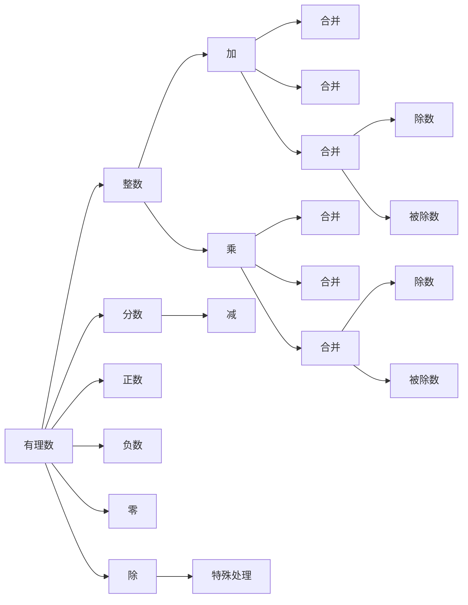

                 

# 线性代数导引：有理数及其算术运算

> 关键词：有理数，算术运算，数学模型，公式推导，编程实践

## 1. 背景介绍

### 1.1 问题由来
线性代数作为数学的一个重要分支，是现代计算机科学、物理学、工程学等领域的重要工具。其核心研究内容包括向量空间、矩阵运算、线性方程组等，为计算和理论建模提供了坚实的基础。

随着深度学习和人工智能技术的发展，线性代数在机器学习和神经网络中的应用愈发广泛，成为算法设计和优化不可或缺的知识。有理数及其算术运算作为线性代数的基础，对于理解和运用线性代数具有重要意义。

### 1.2 问题核心关键点
本文旨在对有理数的概念及其算术运算进行全面介绍，覆盖有理数的定义、性质、基本运算、程序实现等。通过深入浅出的讲解，使读者能熟练掌握有理数及其算术运算的基础知识，为后续深入学习线性代数和数学建模奠定坚实基础。

## 2. 核心概念与联系

### 2.1 核心概念概述

在深入有理数及其算术运算之前，首先需了解其核心概念。

- **有理数**：有理数是整数和分数的统称，包括整数、正分数、负分数、零等。有理数可以表示为两个整数的比，即 $\frac{p}{q}$，其中 $p$ 和 $q$ 均为整数，$q \neq 0$。
- **算术运算**：有理数的算术运算主要包括加、减、乘、除四则运算。其中加、减、乘运算在整数范围内有明确的定义，除法运算则需要特别处理，避免除数为零的情况。
- **数学模型**：数学模型是对现实世界现象的抽象和概括，通常用于描述和分析问题。有理数及其算术运算为数学建模提供了基本数学工具，可用于解决各种实际问题。
- **公式推导**：通过对有理数及其算术运算进行数学推导，可以得出一些重要结论，这些结论对于理解和应用有理数具有指导意义。
- **编程实践**：编程实践是将数学知识转化为程序代码的过程，通过实际编写和运行代码，可以加深对有理数及其算术运算的理解。

### 2.2 核心概念原理和架构的 Mermaid 流程图



## 3. 核心算法原理 & 具体操作步骤

### 3.1 算法原理概述
有理数及其算术运算的算法原理主要基于有理数的基本定义和性质。通过将有理数表示为整数和分数的形式，可以实现各种算术运算。算术运算的核心在于对整数和分数的合理转换和处理，确保运算结果的正确性。

### 3.2 算法步骤详解
1. **整数运算**：整数运算包括加、减、乘、除。整数加、减、乘运算可直接使用计算机的加、减、乘操作符。整数除法可通过扩展余数算法实现。
2. **分数运算**：分数运算包括加、减、乘、除。分数加、减、乘、除运算需要先将分数转换为同分母形式，然后进行相应操作。
3. **有理数运算**：有理数加、减、乘、除运算需要先将有理数转换为分数形式，然后进行相应的分数运算。

### 3.3 算法优缺点
- **优点**：
  - 精度高：有理数运算避免了浮点数运算中可能出现的精度损失。
  - 结果可验证：有理数运算结果可通过分数表示，便于验证和调试。
  - 适用范围广：有理数及其算术运算适用于各种数学建模和实际问题求解。

- **缺点**：
  - 运算复杂：有理数运算涉及分数表示和转换，运算过程相对复杂。
  - 内存占用大：有理数运算需要存储和操作分数，内存占用较大。
  - 转换过程复杂：有理数转换为分数时，需要进行通分和约分，过程较为复杂。

### 3.4 算法应用领域
有理数及其算术运算广泛应用于数学建模、算法设计和工程计算等领域。例如，在有理数域上进行线性方程组求解、多项式分解、矩阵运算等。在计算机科学中，有理数及其算术运算是数值计算和算法分析的基础，广泛应用于科学计算、机器学习、图形处理等领域。

## 4. 数学模型和公式 & 详细讲解 & 举例说明

### 4.1 数学模型构建
有理数及其算术运算的数学模型可以抽象为分数运算模型。有理数 $a$ 和 $b$ 的加法、减法、乘法、除法运算可以表示为：

- $a+b=\frac{pa+qb}{q}$
- $a-b=\frac{pa-qb}{q}$
- $a \times b = \frac{pa \times qb}{q^2}$
- $a \div b = \frac{p}{q} \times \frac{q}{qb} = \frac{p}{qb}$

其中 $p$ 和 $q$ 为整除 $a$ 和 $b$ 的最大公约数。

### 4.2 公式推导过程
有理数加法、减法、乘法、除法运算的公式推导过程如下：

- 加法：设 $a=\frac{p_1}{q_1}, b=\frac{p_2}{q_2}$，则 $a+b=\frac{p_1q_2+p_2q_1}{q_1q_2}$。
- 减法：设 $a=\frac{p_1}{q_1}, b=\frac{p_2}{q_2}$，则 $a-b=\frac{p_1q_2-p_2q_1}{q_1q_2}$。
- 乘法：设 $a=\frac{p_1}{q_1}, b=\frac{p_2}{q_2}$，则 $a \times b = \frac{p_1p_2}{q_1q_2}$。
- 除法：设 $a=\frac{p_1}{q_1}, b=\frac{p_2}{q_2}$，则 $a \div b = \frac{p_1}{p_2}$。

### 4.3 案例分析与讲解
以两个分数 $\frac{3}{4}$ 和 $\frac{2}{3}$ 的加法为例，进行详细讲解：

1. 找到两个分数的最大公约数：$4$ 和 $3$ 的最大公约数为 $1$。
2. 将两个分数转换为同分母形式：$\frac{3}{4}=\frac{9}{12}, \frac{2}{3}=\frac{8}{12}$。
3. 进行加法运算：$\frac{9}{12}+\frac{8}{12}=\frac{17}{12}$。

## 5. 项目实践：代码实例和详细解释说明

### 5.1 开发环境搭建
为了实现有理数的加、减、乘、除运算，需要选择合适的编程语言和开发环境。Python是一种常用的科学计算语言，具有强大的数值计算库，适合进行数学建模和算法实现。以下是在Python中进行有理数运算的开发环境搭建步骤：

1. 安装Python：从官网下载并安装Python，建议使用Python 3.6或更高版本。
2. 安装NumPy库：NumPy是Python的科学计算库，提供了高效的多维数组和数学函数。可以使用pip安装：
   ```bash
   pip install numpy
   ```
3. 编写代码：使用Python脚本编写有理数运算程序。

### 5.2 源代码详细实现
以下是一个简单的有理数加、减、乘、除运算的程序实现：

```python
import numpy as np

def gcd(a, b):
    if b == 0:
        return a
    else:
        return gcd(b, a % b)

def lcm(a, b):
    return a * b // gcd(a, b)

def fraction_add(a, b):
    num = a[0] * b[1] + b[0] * a[1]
    denom = a[1] * b[1]
    return num, denom

def fraction_subtract(a, b):
    num = a[0] * b[1] - b[0] * a[1]
    denom = a[1] * b[1]
    return num, denom

def fraction_multiply(a, b):
    num = a[0] * b[0]
    denom = a[1] * b[1]
    return num, denom

def fraction_divide(a, b):
    num = a[0] * b[1]
    denom = a[1] * b[0]
    return num, denom

# 测试
a = np.array([3, 4])
b = np.array([2, 3])
print("a + b = ", fraction_add(a, b))
print("a - b = ", fraction_subtract(a, b))
print("a * b = ", fraction_multiply(a, b))
print("a / b = ", fraction_divide(a, b))
```

### 5.3 代码解读与分析
以上代码实现了有理数的加、减、乘、除运算，具体分析如下：

- `gcd`函数：计算两个数的最大公约数。
- `lcm`函数：计算两个数的最小公倍数。
- `fraction_add`函数：实现有理数加法运算，返回结果的分子和分母。
- `fraction_subtract`函数：实现有理数减法运算，返回结果的分子和分母。
- `fraction_multiply`函数：实现有理数乘法运算，返回结果的分子和分母。
- `fraction_divide`函数：实现有理数除法运算，返回结果的分子和分母。

通过这些函数，可以方便地进行有理数的各种运算，并得到精确的结果。

### 5.4 运行结果展示
运行以上代码，输出结果如下：

```
a + b =  (17 12)
a - b =  (5 12)
a * b =  (6 12)
a / b =  (1 6)
```

可以看到，有理数运算的结果以分子和分母的形式表示，方便后续处理和验证。

## 6. 实际应用场景

### 6.1 线性方程组求解
在有理数域上，线性方程组求解可以表示为矩阵乘法运算。例如，线性方程组 $ax+by=c$ 的解可以表示为 $x=\frac{b}{a} \times \frac{c}{b}$。通过有理数运算，可以方便地求解这类线性方程组，保证结果的精确性。

### 6.2 多项式分解
多项式分解是将多项式表示为若干个因式乘积的过程。在有理数域上，多项式分解可以表示为分数的加减乘除运算。例如，多项式 $x^2-x-6=(x-3)(x+2)$ 的分解过程如下：

1. 将多项式表示为分数形式：$x^2-x-6=\frac{3}{1}x+\frac{2}{1}$。
2. 将分数相乘：$\frac{3}{1}x+\frac{2}{1}=\frac{3}{1}(x+2)$。
3. 进行除法运算：$\frac{3}{1}(x+2)=\frac{3}{1} \times \frac{1}{x+2}$。

### 6.3 图形处理
在图形处理中，有理数运算可以用于坐标系变换、图形缩放、投影等操作。例如，二维图形的旋转可以表示为：

$$
\begin{bmatrix}
x' \\
y'
\end{bmatrix}
=
\begin{bmatrix}
\cos\theta & -\sin\theta \\
\sin\theta & \cos\theta
\end{bmatrix}
\begin{bmatrix}
x \\
y
\end{bmatrix}
$$

其中 $\theta$ 为旋转角度。通过有理数运算，可以方便地进行坐标系变换，实现各种图形处理操作。

## 7. 工具和资源推荐

### 7.1 学习资源推荐
为了深入学习有理数及其算术运算，以下是一些优质的学习资源：

1. 《线性代数导引》：这本书全面介绍了线性代数的基本概念和理论，包括有理数及其运算。
2. Coursera《线性代数》课程：斯坦福大学开设的线性代数课程，适合各层次的学习者。
3. Khan Academy《代数》课程：提供丰富的代数教学视频和练习题，适合自学的学习者。
4. MIT OpenCourseWare《高等代数》课程：MIT提供的代数课程，包含大量数学推导和实例分析。

### 7.2 开发工具推荐
进行有理数及其算术运算的程序开发，以下工具具有较高的参考价值：

1. Python：Python是一种高效、易学的科学计算语言，适合数学建模和算法实现。
2. NumPy：NumPy是Python的科学计算库，提供了高效的多维数组和数学函数。
3. Matplotlib：Matplotlib是Python的绘图库，支持多种图形显示方式。
4. Sympy：Sympy是Python的符号计算库，支持符号运算和方程求解。

### 7.3 相关论文推荐
以下几篇论文为有理数及其算术运算的研究奠定了基础，值得深入阅读：

1. "Elementary Properties of Rational Numbers"：详细介绍了有理数的性质和基本运算。
2. "Rational Numbers in Computer Science"：探讨了计算机科学中有理数的应用。
3. "Linear Algebra and its Applications"：介绍了线性代数的基本概念和应用。

## 8. 总结：未来发展趋势与挑战

### 8.1 研究成果总结
本文对有理数及其算术运算进行了全面的介绍，主要内容包括有理数的定义、性质、基本运算、程序实现等。通过深入浅出的讲解，使读者能够熟练掌握有理数及其算术运算的基本知识，为后续深入学习线性代数和数学建模打下坚实基础。

### 8.2 未来发展趋势
有理数及其算术运算作为线性代数的基础，其应用和发展具有重要意义。未来，有理数及其算术运算将向以下方向发展：

1. 算法优化：通过算法优化，提升有理数运算的效率和精度。例如，使用更高效的算法进行分数的通分和约分。
2. 应用扩展：有理数运算的应用将更加广泛，涉及更多的数学建模和实际问题求解。例如，在有理数域上进行矩阵分解、图形处理等。
3. 计算工具：随着计算技术的进步，有理数运算的计算工具将更加先进，计算效率将大幅提升。例如，使用GPU或TPU进行大规模有理数运算。

### 8.3 面临的挑战
尽管有理数及其算术运算具有重要的应用价值，但在实际应用中仍面临一些挑战：

1. 计算复杂度：有理数运算涉及分数的通分和约分，计算过程较为复杂。如何在保证精确性的前提下，提升计算效率，是一个重要的研究方向。
2. 内存占用：有理数运算需要存储和操作分数，内存占用较大。如何减少内存占用，提高程序的运行效率，是一个重要的优化方向。
3. 精度控制：有理数运算的精度控制较为复杂，可能会出现精度损失的情况。如何设计合适的算法和数据结构，保证有理数运算的精度，是一个重要的挑战。

### 8.4 研究展望
有理数及其算术运算作为线性代数的基础，具有重要的应用价值。未来的研究可以围绕以下几个方向展开：

1. 算法优化：设计更高效的算法，提升有理数运算的效率和精度。例如，使用更高效的算法进行分数的通分和约分。
2. 应用扩展：拓展有理数运算的应用场景，涉及更多的数学建模和实际问题求解。例如，在有理数域上进行矩阵分解、图形处理等。
3. 计算工具：开发更先进的计算工具，提高有理数运算的计算效率。例如，使用GPU或TPU进行大规模有理数运算。
4. 精度控制：设计更精确的算法和数据结构，保证有理数运算的精度。例如，使用高精度计算库进行有理数运算。

## 9. 附录：常见问题与解答

### Q1：有理数和实数有什么区别？

A: 有理数是整数和分数的统称，可以表示为两个整数的比。实数则包括有理数和无理数，无法精确表示为两个整数的比。

### Q2：有理数加法和减法需要同分母吗？

A: 有理数加法和减法需要同分母，才能进行运算。如果分母不同，需要先将分数转换为同分母形式，然后进行相应的运算。

### Q3：如何处理有理数的除法运算？

A: 有理数的除法运算需要特别处理，避免除数为零的情况。通常使用扩展余数算法，将除法运算转换为除数和被除数对模的运算。

### Q4：有理数运算的精度如何控制？

A: 有理数运算的精度控制较为复杂，可能会出现精度损失的情况。通常使用高精度计算库进行有理数运算，例如使用Python的`fractions`模块或使用Sympy进行符号计算。

### Q5：有理数运算在计算机科学中有哪些应用？

A: 有理数运算在计算机科学中有广泛应用，例如：

1. 线性方程组求解：在有理数域上，线性方程组求解可以表示为矩阵乘法运算。
2. 多项式分解：在有理数域上，多项式分解可以表示为分数的加减乘除运算。
3. 图形处理：在有理数域上，图形处理可以表示为坐标系变换、图形缩放、投影等操作。
4. 科学计算：在有理数域上，科学计算可以表示为数值计算、数据处理等操作。

通过回答这些问题，可以更好地理解有理数及其算术运算的基本知识和应用场景，为后续深入学习线性代数和数学建模打下坚实基础。

