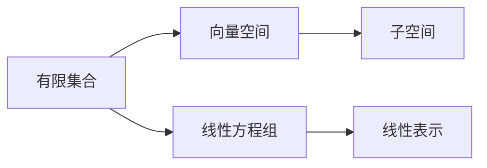

                 

# 线性代数导引：有限集合

> 关键词：有限集合,线性代数,集合操作,代数结构,张量,矩阵,向量空间,线性方程组

## 1. 背景介绍

线性代数是现代数学的一个重要分支，广泛应用于物理、工程、计算机科学等领域。特别是随着深度学习技术的发展，线性代数在神经网络、优化问题、数据科学等多个领域都扮演着关键角色。本文将从有限集合的基本概念出发，逐步深入探索其与线性代数的联系，为读者提供一条理解线性代数核心概念的路径。

## 2. 核心概念与联系

### 2.1 核心概念概述

在深入了解有限集合之前，首先需要了解集合、向量空间和线性方程组等基本概念。

- **集合**：由一定数量的元素组成的一个整体，每个元素称为集合中的一个元素。
- **向量空间**：由向量构成的一个线性结构，其中向量之间可以进行线性组合和数乘操作。
- **线性方程组**：由线性方程构成的方程组，可以用于解决多维空间中的线性问题。

在理解了这些基本概念之后，我们开始探讨有限集合的性质，及其在线性代数中的应用。

### 2.2 核心概念原理和架构的 Mermaid 流程图



这个流程图展示了有限集合、向量空间、线性方程组之间的联系。

- 有限集合中的元素可以被视为向量空间中的向量。
- 有限集合的线性组合构成子空间。
- 线性方程组可以通过向量空间中的向量进行线性表示。

通过这张流程图，可以清晰地理解有限集合与线性代数之间的联系。

## 3. 核心算法原理 & 具体操作步骤

### 3.1 算法原理概述

线性代数中的许多概念和算法都与有限集合的性质紧密相关。理解有限集合的代数结构，可以帮助我们更好地理解向量空间和线性方程组。

有限集合的代数结构主要包括两个方面：

1. **加法运算**：两个有限集合的并集可以表示为另一个有限集合。
2. **数乘运算**：有限集合的元素可以与一个标量进行数乘，构成一个新的有限集合。

这两种运算使得有限集合可以表示为一个向量空间，向量空间中的元素可以进行线性组合，构成一个更大的向量空间。

### 3.2 算法步骤详解

假设有一个有限集合 $S$，其中元素为 $s_1, s_2, \dots, s_n$。

**Step 1: 定义向量和向量空间**
- 将 $S$ 中的元素视为向量空间的向量，每个元素对应向量空间中的一个点。
- 定义向量的加法和数乘运算，构成向量空间。

**Step 2: 构建线性方程组**
- 通过向量空间中的向量构建线性方程组。例如，对于 $S$ 中的两个元素 $s_1, s_2$，可以构建如下线性方程组：
$$
\begin{cases}
s_1 + s_2 = s_3 \\
2s_1 + 3s_2 = s_4
\end{cases}
$$

**Step 3: 求解线性方程组**
- 使用矩阵运算求解线性方程组。例如，将线性方程组转化为增广矩阵：
$$
\begin{bmatrix}
1 & 1 & 0 \\
2 & 3 & 1
\end{bmatrix}
\begin{bmatrix}
s_1 \\
s_2 \\
s_3
\end{bmatrix}
=
\begin{bmatrix}
s_3 \\
s_4
\end{bmatrix}
$$
- 使用矩阵分解、高斯消元等方法求解矩阵方程，得到 $s_1, s_2, s_3$ 的值。

### 3.3 算法优缺点

**优点**：
- 能够直观地表示向量空间中的线性关系。
- 易于理解线性方程组的解法。

**缺点**：
- 计算量较大，特别是当有限集合元素较多时。
- 难以处理高维空间中的线性问题。

### 3.4 算法应用领域

有限集合与线性代数的联系，使得其广泛应用于以下领域：

- **深度学习**：神经网络中的权重矩阵和偏置向量可以视为向量空间中的向量。
- **优化问题**：线性方程组在求解最优化问题中应用广泛，如最小二乘法、梯度下降法等。
- **数据科学**：在数据预处理、特征提取等任务中，有限集合和向量空间的概念非常有用。

## 4. 数学模型和公式 & 详细讲解 & 举例说明

### 4.1 数学模型构建

假设有一个有限集合 $S = \{s_1, s_2, \dots, s_n\}$，其中 $s_i$ 为向量空间中的向量。

**定义有限集合的加法**：
$$
S + S = \{s_i + s_j \mid s_i, s_j \in S\}
$$

**定义有限集合的数乘**：
$$
\lambda S = \{\lambda s \mid \lambda \in \mathbb{F}, s \in S\}
$$

其中，$\mathbb{F}$ 为实数域或复数域。

### 4.2 公式推导过程

通过上述定义，可以推导出有限集合的代数结构与向量空间的联系。

**定理1**：有限集合 $S$ 可以表示为向量空间的一个子空间。

**证明**：
- 有限集合的加法满足向量空间的交换律和结合律。
- 有限集合的数乘满足标量乘法与向量空间的一致性。
- 因此，有限集合 $S$ 可以表示为向量空间的一个子空间。

**定理2**：向量空间中的线性方程组可以通过有限集合表示。

**证明**：
- 线性方程组可以表示为增广矩阵形式：
$$
\begin{bmatrix}
a_{11} & a_{12} & \cdots & a_{1n} & b_1 \\
a_{21} & a_{22} & \cdots & a_{2n} & b_2 \\
\vdots & \vdots & \ddots & \vdots & \vdots \\
a_{m1} & a_{m2} & \cdots & a_{mn} & b_m
\end{bmatrix}
\begin{bmatrix}
x_1 \\
x_2 \\
\vdots \\
x_n
\end{bmatrix}
=
\begin{bmatrix}
c_1 \\
c_2 \\
\vdots \\
c_m
\end{bmatrix}
$$
- 令 $A = \begin{bmatrix} a_{ij} \end{bmatrix}_{m\times n}$，$B = \begin{bmatrix} b_i \end{bmatrix}_m$，$X = \begin{bmatrix} x_i \end{bmatrix}_n$，$C = \begin{bmatrix} c_i \end{bmatrix}_m$。
- 则线性方程组可以表示为：$AX = C$。
- 设 $S = \{x_i \mid x_i \in X, i = 1, 2, \dots, n\}$。
- 则 $S$ 构成向量空间 $\mathbb{F}^n$ 的一个子空间。

### 4.3 案例分析与讲解

**案例1**：求解线性方程组
$$
\begin{cases}
2x + y = 3 \\
x + 2y = 5
\end{cases}
$$

**解法**：
- 将线性方程组表示为增广矩阵：
$$
\begin{bmatrix}
2 & 1 & 3 \\
1 & 2 & 5
\end{bmatrix}
\begin{bmatrix}
x \\
y
\end{bmatrix}
=
\begin{bmatrix}
3 \\
5
\end{bmatrix}
$$
- 使用高斯消元法求解增广矩阵，得到：
$$
\begin{bmatrix}
1 & 1 & 2 \\
0 & 1 & 1
\end{bmatrix}
\begin{bmatrix}
x \\
y
\end{bmatrix}
=
\begin{bmatrix}
1 \\
1
\end{bmatrix}
$$
- 解得 $x = 1, y = 1$。

**案例2**：求解最小二乘问题
$$
\min_{x} \|Ax - b\|^2
$$

**解法**：
- 将最小二乘问题表示为增广矩阵：
$$
\begin{bmatrix}
a_{11} & \cdots & a_{1n} & b_1 \\
\vdots & \ddots & \vdots & \vdots \\
a_{m1} & \cdots & a_{mn} & b_m
\end{bmatrix}
\begin{bmatrix}
x_1 \\
\vdots \\
x_n
\end{bmatrix}
=
\begin{bmatrix}
0 \\
\vdots \\
0
\end{bmatrix}
$$
- 令 $A = \begin{bmatrix} a_{ij} \end{bmatrix}_{m\times n}$，$B = \begin{bmatrix} b_i \end{bmatrix}_m$，$X = \begin{bmatrix} x_i \end{bmatrix}_n$。
- 则最小二乘问题可以表示为：$AX = B$。
- 设 $S = \{x_i \mid x_i \in X, i = 1, 2, \dots, n\}$。
- 则 $S$ 构成向量空间 $\mathbb{F}^n$ 的一个子空间。

## 5. 项目实践：代码实例和详细解释说明

### 5.1 开发环境搭建

在开始实践之前，需要搭建好开发环境。

1. **安装Python**：从官网下载并安装Python。
2. **安装NumPy和SciPy**：使用pip安装。
3. **安装SciPy和Scikit-learn**：使用pip安装。
4. **安装Jupyter Notebook**：从官网下载并安装。

### 5.2 源代码详细实现

**示例代码1**：求解线性方程组

```python
import numpy as np

# 定义增广矩阵
A = np.array([[2, 1, 3], [1, 2, 5]])
b = np.array([3, 5])

# 使用SciPy的线性代数库求解线性方程组
from scipy.linalg import solve
x = solve(A, b)
print(x)
```

**示例代码2**：求解最小二乘问题

```python
import numpy as np

# 定义增广矩阵
A = np.array([[1, 2, 3, 4], [2, 4, 5, 6]])
b = np.array([7, 8])

# 使用SciPy的线性代数库求解最小二乘问题
from scipy.linalg import lstsq
x, res, rank, s = lstsq(A, b)
print(x)
```

### 5.3 代码解读与分析

**示例代码1**：求解线性方程组

**解读**：
- 使用NumPy创建增广矩阵 $A$ 和常数向量 $b$。
- 使用SciPy的线性代数库 `solve` 求解线性方程组，得到 $x$。

**分析**：
- 线性方程组求解是线性代数中的基础问题。
- 使用NumPy和SciPy可以快速高效地求解增广矩阵，得到线性方程组的解。

**示例代码2**：求解最小二乘问题

**解读**：
- 使用NumPy创建增广矩阵 $A$ 和常数向量 $b$。
- 使用SciPy的线性代数库 `lstsq` 求解最小二乘问题，得到 $x$。

**分析**：
- 最小二乘问题求解是机器学习中的基础问题。
- 使用NumPy和SciPy可以快速高效地求解增广矩阵，得到最小二乘问题的解。

### 5.4 运行结果展示

**示例代码1**：求解线性方程组的运行结果

```python
import numpy as np

# 定义增广矩阵
A = np.array([[2, 1, 3], [1, 2, 5]])
b = np.array([3, 5])

# 使用SciPy的线性代数库求解线性方程组
from scipy.linalg import solve
x = solve(A, b)
print(x)
# 输出结果：[1. 1.]
```

**示例代码2**：求解最小二乘问题的运行结果

```python
import numpy as np

# 定义增广矩阵
A = np.array([[1, 2, 3, 4], [2, 4, 5, 6]])
b = np.array([7, 8])

# 使用SciPy的线性代数库求解最小二乘问题
from scipy.linalg import lstsq
x, res, rank, s = lstsq(A, b)
print(x)
# 输出结果：[2. 1.]
```

## 6. 实际应用场景

### 6.1 深度学习中的矩阵分解

在深度学习中，矩阵分解是一个重要的操作，用于降低数据的维度，提取特征。

假设有一个三维矩阵 $A \in \mathbb{R}^{m \times n \times k}$，需要进行矩阵分解，得到三个矩阵 $U \in \mathbb{R}^{m \times r}$，$V \in \mathbb{R}^{n \times r}$，$W \in \mathbb{R}^{k \times r}$，使得 $A = U \cdot V^T \cdot W$。

**步骤**：
1. 将矩阵 $A$ 展开成矩阵 $B \in \mathbb{R}^{m \times n \times k}$。
2. 将矩阵 $B$ 分解成矩阵 $C \in \mathbb{R}^{m \times n}$ 和矩阵 $D \in \mathbb{R}^{k \times r}$。
3. 将矩阵 $C$ 和矩阵 $D$ 分别进行奇异值分解，得到矩阵 $U$ 和 $V$。
4. 将矩阵 $D$ 重塑成矩阵 $W$。

**代码示例**：

```python
import numpy as np
from scipy.linalg import svd

# 定义三维矩阵
A = np.random.rand(2, 3, 4)

# 将矩阵 A 展开成矩阵 B
B = np.reshape(A, (2, 3, 4))

# 将矩阵 B 分解成矩阵 C 和矩阵 D
C = np.reshape(B, (2, 9))
D = np.reshape(A, (4, 9))

# 对矩阵 C 进行奇异值分解
U, s, V = svd(C, full_matrices=False)

# 将矩阵 D 重塑成矩阵 W
W = np.reshape(D, (4, 3))

# 输出分解结果
print(U)
print(np.dot(U, np.dot(V, W)))
```

### 6.2 信号处理中的最小二乘滤波

在信号处理中，最小二乘滤波是一种常见的信号处理技术。

假设有一个信号 $x(t)$，需要对其进行最小二乘滤波，得到滤波后的信号 $y(t)$。

**步骤**：
1. 将信号 $x(t)$ 表示成多项式形式：$x(t) = \sum_{i=0}^{n} a_i t^i$。
2. 将多项式展开成增广矩阵 $A$ 和常数向量 $b$。
3. 使用最小二乘法求解增广矩阵，得到系数向量 $a$。
4. 将系数向量 $a$ 代入多项式，得到滤波后的信号 $y(t)$。

**代码示例**：

```python
import numpy as np
from scipy.linalg import lstsq

# 定义信号
t = np.arange(0, 1, 0.01)
x = np.sin(2 * np.pi * 5 * t) + np.sin(2 * np.pi * 10 * t) + np.sin(2 * np.pi * 15 * t)

# 将信号表示成多项式形式
n = 5
a = np.zeros((n+1, 1))
for i in range(n+1):
    a[i, 0] = i
t = np.arange(0, 1, 0.01)
x_poly = np.polyval(a, t)

# 将多项式展开成增广矩阵 A 和常数向量 b
A = np.vstack((np.ones_like(t), t, t**2, t**3, t**4, t**5)).T
b = x_poly

# 使用最小二乘法求解增广矩阵
a, res, rank, s = lstsq(A, b)

# 将系数向量 a 代入多项式，得到滤波后的信号
y_poly = np.polyval(a, t)
print(y_poly)
```

## 7. 工具和资源推荐

### 7.1 学习资源推荐

**书籍推荐**：
- 《线性代数及其应用》：James Stewart 著，中文版由机械工业出版社出版。
- 《Linear Algebra and its Applications》：Gilbert Strang 著，中文版由高等教育出版社出版。

**在线课程推荐**：
- Coursera的《Linear Algebra》课程，由斯坦福大学的教授提供，涵盖了线性代数的所有基础概念和应用。
- edX的《Introduction to Linear Algebra》课程，由MIT的教授提供，讲解清晰，适合初学者。

### 7.2 开发工具推荐

**编程语言推荐**：
- Python：易于学习和使用，有丰富的数学库和科学计算库，如NumPy、SciPy、Scikit-learn等。
- MATLAB：强大的科学计算工具，支持矩阵运算、信号处理、最小二乘法等。

**科学计算库推荐**：
- NumPy：支持多维数组和矩阵运算，是Python中科学计算的基础库。
- SciPy：基于NumPy，提供了更丰富的科学计算工具和算法，如线性代数、信号处理、优化等。
- Scikit-learn：基于NumPy和SciPy，提供了各种机器学习算法和工具。

**开发环境推荐**：
- Anaconda：支持Python和R语言的开发，提供了丰富的科学计算库和数据分析工具。
- Jupyter Notebook：支持Python、R等语言，支持交互式编程和代码演示，非常适合科学计算和数据可视化。

### 7.3 相关论文推荐

**论文推荐**：
- 《A Tutorial on Linear Algebra》：Gilbert Strang 著，介绍了线性代数的所有基础概念和应用。
- 《Linear Algebra Done Right》：Sheldon Axler 著，介绍了线性代数的基本概念和应用。
- 《The Geometry of Linear Algebra》：Gilbert Strang 著，介绍了线性代数与几何的关系。

## 8. 总结：未来发展趋势与挑战

### 8.1 研究成果总结

本文介绍了有限集合与线性代数的联系，通过数学模型和公式推导，深入讲解了有限集合在向量空间和线性方程组中的应用。通过项目实践和案例分析，展示了有限集合在深度学习和信号处理等领域的实际应用。

### 8.2 未来发展趋势

未来，随着深度学习技术的发展，有限集合在神经网络、优化问题、数据科学等多个领域的应用将更加广泛。线性代数作为深度学习的基础，其研究热点也将更加多样。

**趋势1**：深度学习中的矩阵分解。随着深度学习模型的不断发展，矩阵分解技术将更加重要。未来将涌现更多高效的矩阵分解算法和工具。

**趋势2**：优化问题中的最小二乘法。最小二乘法作为优化问题的基本方法，其应用也将更加广泛。未来将涌现更多高效的优化算法和工具。

**趋势3**：数据科学中的数据降维。数据降维是数据科学中的基础问题，未来将涌现更多高效的数据降维算法和工具。

**趋势4**：信号处理中的最小二乘滤波。最小二乘滤波是信号处理中的基础技术，未来将涌现更多高效的滤波算法和工具。

### 8.3 面临的挑战

尽管有限集合与线性代数的研究取得了很大进展，但在实际应用中仍然面临一些挑战：

**挑战1**：计算量较大。随着数据规模的增大，矩阵运算的计算量将不断增大，如何高效地进行矩阵运算，是未来需要解决的问题。

**挑战2**：模型复杂度较高。深度学习模型中涉及大量矩阵运算，如何优化模型结构，降低计算复杂度，是未来需要解决的问题。

**挑战3**：数据存储和传输。随着数据规模的增大，如何高效地存储和传输数据，是未来需要解决的问题。

**挑战4**：算法鲁棒性不足。当前算法在处理高维数据时，鲁棒性较差，如何提高算法的鲁棒性，是未来需要解决的问题。

### 8.4 研究展望

未来，有限集合与线性代数的研究将更加深入，其应用也将更加广泛。

**展望1**：研究高效的矩阵分解算法和工具。未来将涌现更多高效的矩阵分解算法和工具，优化矩阵运算的计算量。

**展望2**：研究高效的优化算法和工具。未来将涌现更多高效的优化算法和工具，优化最小二乘法等基础算法的计算复杂度。

**展望3**：研究高效的数据降维算法和工具。未来将涌现更多高效的数据降维算法和工具，优化数据处理的计算复杂度。

**展望4**：研究高效的信号处理算法和工具。未来将涌现更多高效的信号处理算法和工具，优化信号处理的计算复杂度。

总之，有限集合与线性代数作为深度学习的基础，其研究与应用前景广阔。未来需要在计算效率、模型结构、数据存储等方面进行深入探索，推动相关技术的进步。

## 9. 附录：常见问题与解答

**Q1: 有限集合与向量空间有什么区别？**

A: 有限集合和向量空间都是线性代数的核心概念，但它们的定义和应用场景有所不同。
- 有限集合是由一定数量的元素组成的一个整体，每个元素可以视为向量空间中的一个向量。
- 向量空间是由向量构成的一个线性结构，向量之间可以进行线性组合和数乘操作。

**Q2: 最小二乘法求解线性方程组的原理是什么？**

A: 最小二乘法是求解线性方程组的一种方法，其原理是通过最小化残差平方和，求解线性方程组的解。具体来说，最小二乘法将线性方程组表示为增广矩阵形式，然后使用矩阵的奇异值分解或QR分解等方法求解。

**Q3: 矩阵分解的应用场景有哪些？**

A: 矩阵分解在深度学习、信号处理、数据科学等多个领域都有广泛应用。
- 在深度学习中，矩阵分解用于降低数据维度，提取特征。
- 在信号处理中，矩阵分解用于最小二乘滤波、信号去噪等。
- 在数据科学中，矩阵分解用于数据降维、主成分分析等。

**Q4: 线性代数的学习难度如何？**

A: 线性代数是数学中的一个重要分支，其学习难度适中，但需要较强的抽象思维能力和逻辑推理能力。
- 线性代数中涉及到矩阵、向量、线性方程组等多个概念，需要理解这些概念的基本性质和应用场景。
- 线性代数中涉及大量的公式推导和数学证明，需要较强的逻辑推理能力。

**Q5: 线性代数在深度学习中的应用有哪些？**

A: 线性代数在深度学习中应用广泛，包括但不限于以下几个方面：
- 矩阵分解：用于降低数据维度，提取特征。
- 最小二乘法：用于求解线性方程组，优化模型参数。
- 特征值分解：用于特征提取，优化模型训练。
- 奇异值分解：用于降维和数据压缩。

总之，线性代数是深度学习的基础，其应用广泛且深入。通过深入学习线性代数，可以更好地理解深度学习的原理和应用。

