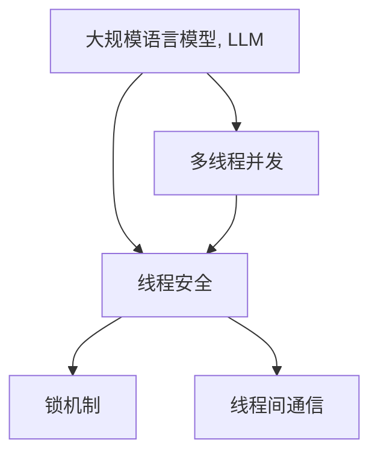

                 

## 1. 背景介绍

### 1.1 问题由来

人工智能(AI)和自然语言处理(NLP)近年来取得了飞速进展，尤其是大规模语言模型(LLM)在自然语言理解和生成方面的突破，极大地提升了NLP技术的应用深度和广度。然而，尽管LLM在处理语言数据方面展现出强大的能力，其内部逻辑和决策过程仍然相对黑箱化，这在涉及隐私、安全等重要领域时，尤其显得不合时宜。

### 1.2 问题核心关键点

如何构建安全可信的AI应用，尤其是在LLM上，是当前NLP研究的重要课题。而实现线程安全，确保AI应用在不同用户、不同场景下的一致性和可解释性，是构建可信AI的关键一步。

在实际应用中，AI系统通常依赖多线程并发处理数据和任务，而LLM作为底层核心引擎，其内部状态和运算需要严格控制，以避免数据竞争和运行时错误。线程安全的设计，确保了LLM在不同线程下独立且正确地运行，从而保证了AI系统的整体稳定性和可靠性。

### 1.3 问题研究意义

实现线程安全的AI应用，对于提升NLP技术的普及度和可信度具有重要意义：

1. **降低风险**：线程安全设计可以防止因数据竞争导致的系统崩溃，确保AI应用在各种复杂环境中的稳定运行。
2. **增强透明度**：可解释的AI系统更易于监管和审核，提升用户信任度，降低误用风险。
3. **提高效率**：合理的线程调度和管理，可以显著提升AI系统的处理效率，降低运行成本。
4. **促进创新**：线程安全的AI应用可以更好地适配各种新场景、新需求，推动技术创新和应用迭代。

## 2. 核心概念与联系

### 2.1 核心概念概述

为更好地理解线程安全AI的实现原理和设计架构，本节将介绍几个密切相关的核心概念：

- **大规模语言模型(LLM)**：以Transformer为代表的预训练语言模型，具有强大的语言理解与生成能力，但内部状态和运算机制复杂。
- **多线程并发**：在多核CPU或GPU等硬件设施下，将数据处理任务拆分成多个独立线程，并行执行，以提升系统处理速度。
- **线程安全**：指在多线程环境下，多个线程能够正确共享资源，互不影响，确保系统的稳定性和一致性。
- **锁机制**：通过锁(如互斥锁、读写锁等)来协调多个线程对共享资源的访问，避免竞争条件。
- **线程间通信(Inter-Thread Communication)**：在多线程环境下，不同线程间交换信息、共享数据的过程。

这些核心概念之间的逻辑关系可以通过以下Mermaid流程图来展示：



这个流程图展示了大规模语言模型在多线程环境下的核心概念及其之间的联系：

1. 大规模语言模型在多线程环境下执行任务。
2. 线程安全设计确保多个线程独立、正确地共享资源。
3. 锁机制协调不同线程对共享资源的访问，避免数据竞争。
4. 线程间通信用于不同线程间的数据交换和信息传递。

这些概念共同构成了线程安全AI的设计框架，使得AI系统能够在不同线程下安全、高效地运行。

## 3. 核心算法原理 & 具体操作步骤
### 3.1 算法原理概述

实现线程安全的AI应用，本质上是一个协调多线程执行、避免数据竞争和运行时错误的过程。其核心思想是：通过合理设计锁机制和线程间通信策略，确保多个线程能够互不影响地访问共享资源，避免冲突和数据不一致。

形式化地，假设存在一个大规模语言模型 $M_{\theta}$，其中 $\theta$ 为模型参数。在多线程并发处理任务 $T$ 时，假设 $\theta$ 是共享资源，需要进行同步管理。假设锁机制为 $\mu$，线程间通信协议为 $P$。那么，线程安全的设计目标是最小化锁的使用次数，同时保证系统正确性，即：

$$
\min_{\mu} \left(\sum_{i=1}^n \mu_i\right), \text{其中} \mu_i \text{为第}i\text{个线程持有的锁}
$$

使得 $M_{\theta}$ 在 $P$ 下的每个线程 $T_i$ 均能正确执行任务，即：

$$
\forall T_i \in T, M_{\theta} \text{在} P \text{下} \text{的} T_i \text{正确性} \text{满足} \varphi_i
$$

### 3.2 算法步骤详解

实现线程安全的AI应用一般包括以下几个关键步骤：

**Step 1: 设计锁机制**

- 选择合适的锁机制，如互斥锁(Mutex Lock)、读写锁(Read-Write Lock)等，根据实际情况合理分配锁粒度。
- 确定锁的使用时机，如进入/退出某个线程时是否需要加锁。

**Step 2: 实现线程间通信**

- 设计线程间通信协议，如消息队列(Message Queue)、共享内存(Shared Memory)、互斥变量(Mutex Variable)等，确保不同线程间的数据交换和状态同步。
- 使用锁机制保护共享数据的读写操作，避免多个线程同时修改导致数据不一致。

**Step 3: 编写多线程代码**

- 将任务 $T$ 拆分为多个子任务 $T_i$，每个子任务在独立线程 $T_i$ 中执行。
- 在代码中合理应用锁机制和线程间通信协议，确保线程之间的互斥和同步。

**Step 4: 测试和优化**

- 对多线程代码进行单元测试和压力测试，验证线程安全性和性能。
- 根据测试结果调整锁机制和线程间通信策略，优化系统性能。

### 3.3 算法优缺点

线程安全AI的实现具有以下优点：

1. **提高系统稳定性**：通过合理设计锁机制和线程间通信，有效避免数据竞争和运行时错误，确保系统在各种复杂环境下的稳定运行。
2. **增强可解释性**：线程安全设计使得不同线程间的行为可控、可解释，便于审计和调试。
3. **提升处理效率**：通过多线程并发处理，可以显著提升AI系统的处理速度，降低运行成本。

然而，该方法也存在一定的局限性：

1. **设计复杂**：锁机制和线程间通信的设计和调试较为复杂，需要深入理解并发编程的原理。
2. **性能开销**：锁的使用和线程间通信的频繁操作可能导致系统性能的下降。
3. **死锁风险**：不合理的设计可能导致死锁问题，系统进入无法继续执行的状态。

尽管存在这些局限性，但就目前而言，线程安全设计是大规模语言模型在多线程环境下运行的重要保障，也是构建可信AI应用的基础。

### 3.4 算法应用领域

线程安全AI的应用范围非常广泛，涵盖了各种高并发、高可靠性的场景，例如：

- **自然语言处理**：在多线程环境下进行语言理解和生成任务，如智能客服、机器翻译、文本摘要等。
- **智能推荐系统**：处理大规模数据和实时请求，推荐个性化内容。
- **金融交易系统**：处理海量交易数据和实时报价，确保交易系统的公平和稳定。
- **医疗诊断系统**：处理和分析患者数据，提供精准的诊断和治疗方案。
- **智慧城市**：处理和整合城市各类数据，提供实时智能服务。

以上领域对AI系统的实时性、准确性和可靠性都有很高要求，线程安全设计能够确保系统在高并发、高负载环境下稳定运行，提升用户体验和服务质量。

## 4. 数学模型和公式 & 详细讲解 & 举例说明
### 4.1 数学模型构建

本节将使用数学语言对线程安全AI的实现原理进行更加严格的刻画。

假设存在一个大规模语言模型 $M_{\theta}$，在多线程并发处理任务 $T$ 时，每个线程 $T_i$ 对模型进行局部操作，导致模型参数 $\theta$ 发生更改。假设 $L_i(\theta)$ 为第 $i$ 个线程对模型参数的局部操作函数，则模型参数的整体变化量为：

$$
\Delta\theta = \sum_{i=1}^n L_i(\theta)
$$

为了确保线程安全，需要对 $L_i(\theta)$ 进行同步管理，避免数据竞争和运行时错误。常见的方法包括：

- 互斥锁：对模型参数进行互斥访问，保证同一时刻只有一个线程能修改参数。
- 读写锁：对模型参数进行读写分离，允许多个线程同时读取参数，但只允许一个线程写入参数。

数学形式化地，假设互斥锁 $\mu$ 用于保护模型参数 $\theta$ 的访问，则每个线程 $T_i$ 访问模型参数的规则可以描述为：

$$
\begin{aligned}
    \mu(\theta) &= \text{locked}\\
    L_i(\theta) &= \begin{cases}
        \text{do some local computation} & \text{if} \mu(\theta) = \text{locked}\\
        \text{error} & \text{if} \mu(\theta) \neq \text{locked}
    \end{cases}\\
    \Delta\theta &= \sum_{i=1}^n L_i(\theta)
\end{aligned}
$$

### 4.2 公式推导过程

以下我们以多线程环境下的智能推荐系统为例，推导如何设计锁机制和线程间通信以确保线程安全。

假设推荐系统需要同时处理 $n$ 个用户的查询请求，每个查询请求在独立线程 $T_i$ 中处理。推荐模型 $M_{\theta}$ 作为共享资源，每个线程 $T_i$ 需要对模型进行局部操作。

假设 $L_i(\theta)$ 为第 $i$ 个线程对模型参数的局部操作函数，假设使用互斥锁 $\mu$ 保护模型参数的访问，则每个线程访问模型参数的规则可以描述为：

$$
\begin{aligned}
    \mu(\theta) &= \text{locked}\\
    L_i(\theta) &= \begin{cases}
        \text{do some local computation} & \text{if} \mu(\theta) = \text{locked}\\
        \text{error} & \text{if} \mu(\theta) \neq \text{locked}
    \end{cases}\\
    \Delta\theta &= \sum_{i=1}^n L_i(\theta)
\end{aligned}
$$

为了确保线程安全，需要在每个线程开始对模型进行局部操作时，先获取锁 $\mu$，操作完成后释放锁 $\mu$。这样，同一时刻只有一个线程能访问模型参数，避免了数据竞争和运行时错误。

### 4.3 案例分析与讲解

下面以推荐系统为例，分析锁机制和线程间通信的具体应用：

假设推荐系统需要同时处理 $n$ 个用户的查询请求，每个查询请求在独立线程 $T_i$ 中处理。推荐模型 $M_{\theta}$ 作为共享资源，每个线程 $T_i$ 需要对模型进行局部操作。

假设使用互斥锁 $\mu$ 保护模型参数的访问，则每个线程访问模型参数的规则可以描述为：

$$
\begin{aligned}
    \mu(\theta) &= \text{locked}\\
    L_i(\theta) &= \begin{cases}
        \text{do some local computation} & \text{if} \mu(\theta) = \text{locked}\\
        \text{error} & \text{if} \mu(\theta) \neq \text{locked}
    \end{cases}\\
    \Delta\theta &= \sum_{i=1}^n L_i(\theta)
\end{aligned}
$$

为了确保线程安全，需要在每个线程开始对模型进行局部操作时，先获取锁 $\mu$，操作完成后释放锁 $\mu$。这样，同一时刻只有一个线程能访问模型参数，避免了数据竞争和运行时错误。

例如，在线程 $T_i$ 中，访问模型参数的代码可以描述为：

```python
import threading

lock = threading.Lock()
theta = ...

def thread_function():
    with lock:
        L_i(theta)  # 对模型进行局部操作
```

在多线程环境下，每个线程 $T_i$ 通过获取锁 $\mu$，保证了对模型参数 $\theta$ 的互斥访问。当锁 $\mu$ 被其他线程占用时，线程 $T_i$ 会被阻塞，等待锁释放后再进行访问。

这种锁机制的设计，确保了多个线程对共享资源的正确访问，避免了数据竞争和运行时错误，提高了系统的稳定性和可靠性。

## 5. 项目实践：代码实例和详细解释说明
### 5.1 开发环境搭建

在进行线程安全AI应用开发前，我们需要准备好开发环境。以下是使用Python进行线程安全AI开发的开发环境配置流程：

1. 安装Anaconda：从官网下载并安装Anaconda，用于创建独立的Python环境。

2. 创建并激活虚拟环境：
```bash
conda create -n thread_safety_env python=3.8 
conda activate thread_safety_env
```

3. 安装必要的Python包：
```bash
pip install torch torchvision torchaudio pandas numpy sklearn
```

4. 安装线程库：
```bash
pip install threading
```

完成上述步骤后，即可在`thread_safety_env`环境中开始开发实践。

### 5.2 源代码详细实现

下面我以多线程环境下的智能推荐系统为例，给出使用Python实现线程安全AI的代码实现。

首先，定义线程安全锁和模型参数：

```python
import threading

lock = threading.Lock()
theta = ...
```

然后，定义线程函数：

```python
def thread_function():
    with lock:
        L_i(theta)  # 对模型进行局部操作
```

接下来，启动多个线程并行处理任务：

```python
import threading
import time

def thread_function():
    with lock:
        L_i(theta)  # 对模型进行局部操作

def main():
    threads = []
    for i in range(10):
        t = threading.Thread(target=thread_function)
        threads.append(t)
        t.start()

    for t in threads:
        t.join()

if __name__ == '__main__':
    main()
```

最后，启动线程安全AI应用：

```python
import threading
import time

def thread_function():
    with lock:
        L_i(theta)  # 对模型进行局部操作

def main():
    threads = []
    for i in range(10):
        t = threading.Thread(target=thread_function)
        threads.append(t)
        t.start()

    for t in threads:
        t.join()

if __name__ == '__main__':
    main()
```

在上述代码中，我们通过Python的线程库实现了多线程并发处理任务的过程。每个线程 $T_i$ 在开始对模型进行局部操作时，先获取锁 $\mu$，操作完成后释放锁 $\mu$，确保了对共享资源的互斥访问。

### 5.3 代码解读与分析

让我们再详细解读一下关键代码的实现细节：

**线程安全锁和模型参数定义**：
- `threading.Lock()`：创建互斥锁，用于保护模型参数 $\theta$ 的访问。
- `theta = ...`：定义模型参数，通常为大规模语言模型的权重向量。

**线程函数定义**：
- `thread_function`：定义线程函数，在函数中对模型进行局部操作 $L_i(\theta)$，并使用 `with lock` 语句获取锁 $\mu$。

**启动多个线程并行处理任务**：
- `main` 函数：循环创建多个线程，并启动它们。
- `join` 方法：等待所有线程完成执行，确保所有线程的局部操作都完成后，再释放锁 $\mu$。

**启动线程安全AI应用**：
- 与上一步基本相同，但增加了具体的数据处理和模型操作。

可以看到，通过合理设计锁机制和线程间通信，可以有效地实现多线程并发处理任务，确保线程安全，提升系统的稳定性和可靠性。

## 6. 实际应用场景
### 6.1 智能推荐系统

线程安全AI在智能推荐系统中有着广泛的应用。推荐系统需要同时处理大量的用户查询请求，并行计算推荐结果，确保推荐结果的准确性和实时性。

在线程安全AI的应用下，推荐系统可以同时处理多个用户的查询请求，每个查询请求在独立线程中执行。通过合理设计锁机制和线程间通信，确保不同线程对共享资源的互斥访问，避免了数据竞争和运行时错误。最终，推荐系统能够快速、准确地为用户生成个性化推荐结果。

### 6.2 金融交易系统

金融交易系统需要处理海量交易数据和实时报价，确保交易系统的公平和稳定。

在线程安全AI的应用下，金融交易系统可以同时处理多个交易请求，每个交易请求在独立线程中执行。通过合理设计锁机制和线程间通信，确保不同线程对共享资源的互斥访问，避免了数据竞争和运行时错误。最终，金融交易系统能够快速、准确地处理交易请求，确保交易系统的公平和稳定。

### 6.3 智慧城市

智慧城市需要对城市各类数据进行实时分析和处理，提供智能服务。

在线程安全AI的应用下，智慧城市可以同时处理多个数据请求，每个数据请求在独立线程中执行。通过合理设计锁机制和线程间通信，确保不同线程对共享资源的互斥访问，避免了数据竞争和运行时错误。最终，智慧城市能够快速、准确地处理数据请求，提供实时智能服务。

### 6.4 未来应用展望

随着线程安全AI技术的不断进步，其在更多领域的应用前景将进一步拓展。未来，线程安全AI将在智能客服、医疗诊断、智慧交通等更多场景中得到应用，为各行各业带来新的变革。

## 7. 工具和资源推荐
### 7.1 学习资源推荐

为了帮助开发者系统掌握线程安全AI的理论基础和实践技巧，这里推荐一些优质的学习资源：

1. 《Python并发编程实战》：深入浅出地介绍了多线程、多进程、并发编程等核心概念，提供了丰富的代码实例。
2. 《线程安全编程指南》：详细介绍了线程安全设计的原理和实践，包括锁机制、同步机制、死锁等问题。
3. 《Java并发编程的艺术》：面向Java程序员，深入讲解了Java中的线程安全和并发编程技巧，适合Java开发者参考。
4. Coursera《并发编程》课程：由斯坦福大学提供，介绍了多线程、锁机制、并发算法等核心概念，并提供了实际项目的编程练习。
5. Udemy《Python多线程编程》课程：面向Python开发者，详细讲解了Python中的线程安全设计和并发编程技巧。

通过这些资源的学习，相信你一定能够全面掌握线程安全AI的理论和实践方法，并在实际项目中灵活应用。

### 7.2 开发工具推荐

高效的开发离不开优秀的工具支持。以下是几款用于线程安全AI开发的常用工具：

1. Python：面向数据科学和机器学习的通用编程语言，提供了丰富的并发编程库和工具。
2. Java：面向大型企业级应用的编程语言，提供了强大的多线程支持和并发编程工具。
3. C++：面向高性能计算和实时系统的编程语言，提供了底层的并发编程接口和工具。
4. ThreadPoolExecutor：Python的线程池工具，提供了高性能的线程管理和任务调度。
5. ConcurrentHashMap：Java的线程安全Map实现，提供了高效的并发访问和数据操作。
6. std::thread：C++11引入的线程库，提供了底层的线程管理和调度接口。

合理利用这些工具，可以显著提升线程安全AI应用的开发效率，加快创新迭代的步伐。

### 7.3 相关论文推荐

线程安全AI的研究源于学界的持续研究。以下是几篇奠基性的相关论文，推荐阅读：

1. 《The Concurrent Behavior of Parallel Programs》：经典并发编程教材，介绍了多线程和并发编程的核心概念和问题。
2. 《Programming Parallel Programs》：详细介绍了多线程和并行编程的原理和实践，包括锁机制、同步机制、死锁等问题。
3. 《Practical Concurrent Programming》：面向Java开发者的并发编程指南，提供了丰富的代码实例和实践经验。
4. 《High Performance Concurrent Computations》：介绍了高性能并发编程的原理和实践，适合需要高性能计算的开发者。
5. 《Java Concurrency in Practice》：面向Java开发者的并发编程指南，提供了丰富的代码实例和实践经验。

这些论文代表了大规模语言模型线程安全设计的理论基础，是学习线程安全AI的宝贵资源。

## 8. 总结：未来发展趋势与挑战
### 8.1 总结

本文对线程安全AI的实现原理和设计架构进行了全面系统的介绍。首先阐述了线程安全AI的研究背景和意义，明确了线程安全在大规模语言模型中的应用价值。其次，从原理到实践，详细讲解了线程安全AI的设计思想和关键步骤，给出了线程安全AI任务开发的完整代码实例。同时，本文还广泛探讨了线程安全AI在智能推荐、金融交易、智慧城市等诸多领域的应用前景，展示了线程安全AI的巨大潜力。此外，本文精选了线程安全AI的各类学习资源，力求为读者提供全方位的技术指引。

通过本文的系统梳理，可以看到，线程安全AI设计在大规模语言模型中的应用，对于提升AI系统的稳定性、效率和可解释性具有重要意义。未来，随着人工智能技术的不断演进，线程安全AI设计将在更多场景中得到应用，推动人工智能技术的创新和发展。

### 8.2 未来发展趋势

展望未来，线程安全AI的发展趋势将呈现以下几个方向：

1. **自动化设计**：随着自动化设计和测试技术的发展，未来的线程安全AI系统将能够自动生成最优的锁机制和线程间通信策略，降低设计复杂度，提升系统性能。
2. **分布式设计**：随着分布式计算和存储技术的发展，未来的线程安全AI系统将能够在分布式环境下高效处理海量数据和任务。
3. **动态调整**：未来的线程安全AI系统将能够动态调整锁机制和线程间通信策略，根据数据量、任务复杂度等因素自动优化系统性能。
4. **跨平台设计**：未来的线程安全AI系统将能够在不同操作系统和硬件平台上高效运行，提升系统的可移植性和兼容性。
5. **融合边缘计算**：未来的线程安全AI系统将能够与边缘计算技术结合，在本地设备上高效处理数据和任务，降低网络延迟和带宽占用。

以上趋势凸显了线程安全AI设计的广阔前景。这些方向的探索发展，必将进一步提升AI系统的稳定性和性能，推动人工智能技术的全面应用。

### 8.3 面临的挑战

尽管线程安全AI技术已经取得了显著进展，但在实现高并发、高可靠性应用的过程中，仍然面临诸多挑战：

1. **设计复杂度**：线程安全AI设计复杂，需要深入理解并发编程的原理和实践，设计不当可能导致系统崩溃和数据竞争。
2. **性能开销**：锁的使用和线程间通信的频繁操作可能导致系统性能的下降，需要在性能和安全性之间找到平衡。
3. **死锁风险**：不合理的设计可能导致死锁问题，系统进入无法继续执行的状态，需要合理的锁机制和通信策略避免死锁。
4. **资源竞争**：多线程环境下，共享资源的竞争可能导致资源浪费和性能瓶颈，需要合理的资源分配和调度策略。
5. **可解释性不足**：线程安全AI系统的行为相对黑箱化，难以解释其内部工作机制和决策逻辑，需要更好的解释工具和方法。

这些挑战需要我们在设计和实现线程安全AI系统时予以充分考虑，采取有效的措施解决这些问题。

### 8.4 研究展望

面对线程安全AI所面临的挑战，未来的研究需要在以下几个方面寻求新的突破：

1. **自动化设计工具**：开发更加智能化的工具，自动生成线程安全AI系统的设计方案，降低人工设计的工作量和复杂度。
2. **性能优化算法**：开发高效的并发算法，优化锁机制和线程间通信策略，提升系统的并发处理能力和性能。
3. **死锁避免技术**：研究新的死锁避免技术，确保线程安全AI系统在各种复杂场景下能够高效稳定地运行。
4. **资源优化策略**：开发更好的资源调度算法，合理分配和利用共享资源，提升系统的处理能力和资源利用率。
5. **系统可解释性**：研究更好的可解释工具和方法，提升线程安全AI系统的透明度和可解释性，便于审计和调试。

这些研究方向的探索，必将引领线程安全AI设计技术迈向更高的台阶，为构建安全、可靠、高效的AI系统铺平道路。面向未来，线程安全AI设计还需要与其他人工智能技术进行更深入的融合，如因果推理、强化学习等，多路径协同发力，共同推动人工智能技术的进步。只有勇于创新、敢于突破，才能不断拓展人工智能技术的边界，让AI技术更好地造福人类社会。

## 9. 附录：常见问题与解答
### 9.1 Q1: 线程安全AI的实现难点是什么？

**A**: 线程安全AI的实现难点主要包括以下几点：
1. **锁粒度设计**：锁的粒度设计直接影响系统的性能和安全性。锁粒度过大可能导致资源浪费和竞争，锁粒度过小可能导致锁的使用频率增加，影响系统性能。
2. **死锁避免**：锁机制的设计不当可能导致死锁问题，系统进入无法继续执行的状态。需要合理设计锁机制和通信策略避免死锁。
3. **锁使用时机**：锁的使用时机需要精心设计，过早获取锁可能导致资源浪费，过晚获取锁可能导致数据竞争。
4. **资源竞争**：多线程环境下，共享资源的竞争可能导致资源浪费和性能瓶颈，需要合理的资源分配和调度策略。
5. **可解释性不足**：线程安全AI系统的行为相对黑箱化，难以解释其内部工作机制和决策逻辑，需要更好的解释工具和方法。

### 9.2 Q2: 如何在多线程环境下优化线程安全AI系统的性能？

**A**: 在多线程环境下优化线程安全AI系统的性能，主要需要考虑以下几个方面：
1. **锁粒度优化**：合理设计锁的粒度，减少锁的使用频率，提升系统的并发处理能力。
2. **线程间通信优化**：减少线程间通信的频率和开销，提升系统的处理速度。
3. **资源优化策略**：合理分配和利用共享资源，提升系统的处理能力和资源利用率。
4. **锁使用时机优化**：合理设计锁的使用时机，避免过早或过晚获取锁，提升系统的性能。
5. **并发算法优化**：开发高效的并发算法，优化锁机制和线程间通信策略，提升系统的并发处理能力和性能。

### 9.3 Q3: 如何保证线程安全AI系统的稳定性和可靠性？

**A**: 保证线程安全AI系统的稳定性和可靠性，主要需要考虑以下几个方面：
1. **锁机制设计**：合理设计锁机制，确保多个线程能够互不影响地访问共享资源。
2. **死锁避免**：合理设计锁机制和通信策略，避免死锁问题，确保系统能够高效稳定地运行。
3. **资源优化策略**：合理分配和利用共享资源，提升系统的处理能力和资源利用率。
4. **性能优化算法**：开发高效的并发算法，优化锁机制和线程间通信策略，提升系统的并发处理能力和性能。
5. **可解释性工具**：研究更好的可解释工具和方法，提升线程安全AI系统的透明度和可解释性，便于审计和调试。

通过以上措施，可以最大限度地提升线程安全AI系统的稳定性和可靠性，确保其在各种复杂环境下的正常运行。

### 9.4 Q4: 线程安全AI在智能推荐系统中的应用场景有哪些？

**A**: 线程安全AI在智能推荐系统中的应用场景主要包括以下几点：
1. **大规模数据处理**：智能推荐系统需要处理海量用户数据和商品数据，线程安全AI可以同时处理多个查询请求，提升系统的处理能力和效率。
2. **实时性要求高**：智能推荐系统需要实时响应用户查询，线程安全AI可以并行处理多个请求，确保系统的实时性和响应速度。
3. **并发性高**：智能推荐系统需要同时处理多个用户请求，线程安全AI可以高效管理多线程并发，提升系统的处理能力和资源利用率。
4. **系统稳定性要求高**：智能推荐系统需要稳定运行，线程安全AI可以避免数据竞争和运行时错误，确保系统的稳定性和可靠性。

通过线程安全AI的设计，智能推荐系统可以在高并发、高负载环境下稳定运行，提升用户体验和服务质量。

### 9.5 Q5: 线程安全AI在金融交易系统中的应用场景有哪些？

**A**: 线程安全AI在金融交易系统中的应用场景主要包括以下几点：
1. **海量交易数据处理**：金融交易系统需要处理海量交易数据，线程安全AI可以同时处理多个交易请求，提升系统的处理能力和效率。
2. **实时性要求高**：金融交易系统需要实时响应用户交易请求，线程安全AI可以并行处理多个请求，确保系统的实时性和响应速度。
3. **并发性高**：金融交易系统需要同时处理多个交易请求，线程安全AI可以高效管理多线程并发，提升系统的处理能力和资源利用率。
4. **系统稳定性要求高**：金融交易系统需要稳定运行，线程安全AI可以避免数据竞争和运行时错误，确保系统的稳定性和可靠性。

通过线程安全AI的设计，金融交易系统可以在高并发、高负载环境下稳定运行，提升交易系统的处理能力和服务质量。

### 9.6 Q6: 线程安全AI在智慧城市中的应用场景有哪些？

**A**: 线程安全AI在智慧城市中的应用场景主要包括以下几点：
1. **海量数据处理**：智慧城市需要对各类数据进行实时分析和处理，线程安全AI可以同时处理多个数据请求，提升系统的处理能力和效率。
2. **实时性要求高**：智慧城市需要实时响应用户请求，线程安全AI可以并行处理多个请求，确保系统的实时性和响应速度。
3. **并发性高**：智慧城市需要同时处理多个数据请求，线程安全AI可以高效管理多线程并发，提升系统的处理能力和资源利用率。
4. **系统稳定性要求高**：智慧城市需要稳定运行，线程安全AI可以避免数据竞争和运行时错误，确保系统的稳定性和可靠性。

通过线程安全AI的设计，智慧城市可以在高并发、高负载环境下稳定运行，提升系统的处理能力和服务质量。

---

作者：禅与计算机程序设计艺术 / Zen and the Art of Computer Programming

