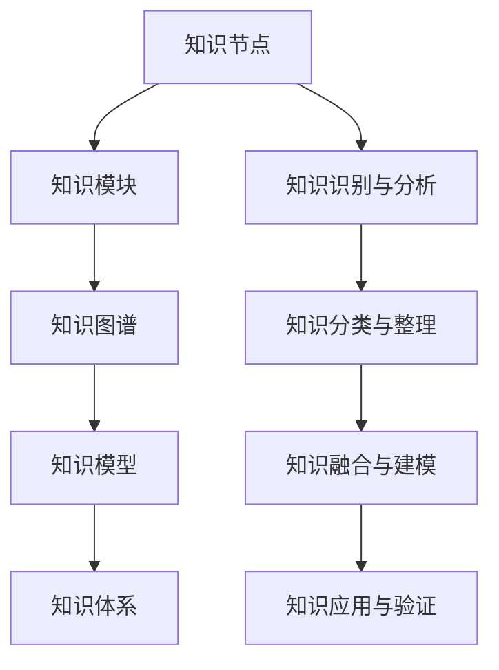

                 

# 经典著作:管理者构筑知识体系

## 1. 背景介绍

### 1.1 问题由来

在当前知识密集型的商业环境中，企业管理者面临的挑战日益复杂化。一方面，技术的发展不断刷新着企业的运营模式，要求管理者具备更为敏捷、灵活的应对能力；另一方面，企业组织结构和运作机制的不断进化，也对管理者的知识体系提出了更高的要求。管理者需要不断学习和适应新的管理理论、方法论和工具，方能在竞争激烈的市场中保持优势。

然而，传统的管理知识体系往往过于理论化、抽象化，难以转化为实际操作中的有效指导。同时，散落在各处、难以系统化的管理实践经验，也未能得到充分的整理和利用。因此，管理者迫切需要一种能够整合理论知识与实践经验，形成系统化、实战化的知识体系，以提升自身的管理水平和能力。

### 1.2 问题核心关键点

为解决这一问题，本博文将介绍一种结合理论与实践，形成系统化、实战化管理知识体系的构建方法。该方法通过以下步骤，帮助管理者将分散的知识和经验整合成统一的知识体系，进而提升管理能力：

1. **知识识别与分析**：识别并分析管理实践中的关键知识和经验。
2. **知识分类与整理**：根据知识的重要性和应用场景，进行分类和整理。
3. **知识融合与建模**：将理论知识与实践经验进行融合，形成系统化的模型和框架。
4. **知识应用与验证**：将知识体系应用于实际管理中，并不断进行验证和迭代。

通过本博文，读者将了解如何构建和管理者的知识体系，提升管理决策能力和实践水平。

## 2. 核心概念与联系

### 2.1 核心概念概述

在构建管理者知识体系的过程中，涉及多个核心概念，包括：

- **知识体系（Knowledge System）**：由多个知识点有机结合形成的整体，具备逻辑性和系统性。
- **知识模块（Knowledge Module）**：根据不同管理领域和职能划分的基本知识单元。
- **知识节点（Knowledge Node）**：具体知识点的描述和应用场景。
- **知识图谱（Knowledge Graph）**：将知识点、关系和应用场景映射到图中的图形表示，用于知识管理。
- **知识模型（Knowledge Model）**：根据理论知识与实践经验，形成的系统化模型和框架。

### 2.2 核心概念原理和架构的 Mermaid 流程图



这个流程图展示了知识体系构建的核心步骤，从知识点到知识模块，再到知识图谱和知识模型，最终形成完整的知识体系。

## 3. 核心算法原理 & 具体操作步骤

### 3.1 算法原理概述

构建管理者知识体系，本质上是一个知识整合与创新的过程。其核心思想是通过识别、分类、融合和应用，将分散的实践经验和理论知识，转化为系统化的知识体系。

形式化地，假设存在一组管理实践中的知识点集合 $K=\{k_i\}_{i=1}^N$，其中 $k_i$ 代表具体的知识点。构建知识体系的过程可以表示为：

1. **识别与分析**：通过问卷调查、访谈等方式，识别出管理实践中的关键知识点 $K_{识别} \subseteq K$。
2. **分类与整理**：对识别出的知识点 $K_{识别}$ 进行分类和整理，得到若干知识模块 $M=\{M_j\}_{j=1}^M$。
3. **融合与建模**：将知识模块 $M$ 与理论知识 $T$ 融合，形成知识模型 $M \cup T$。
4. **应用与验证**：将知识模型 $M \cup T$ 应用于实际管理场景 $S$，并通过验证和迭代不断优化。

### 3.2 算法步骤详解

构建管理者知识体系的主要步骤包括：

**Step 1: 知识识别与分析**
- 设计问卷或访谈提纲，覆盖企业管理中的关键领域，如战略规划、组织架构、人力资源、运营管理等。
- 通过问卷调查或访谈，收集一线管理者的实践经验和意见。
- 对收集到的数据进行分析，识别出关键知识点和核心经验。

**Step 2: 知识分类与整理**
- 将识别出的知识点根据管理领域和职能，进行分类和整理。
- 对每个知识点进行详细描述，包括定义、应用场景、案例分析等。
- 形成若干知识模块，每个模块涵盖特定的管理领域或职能。

**Step 3: 知识融合与建模**
- 根据理论知识库，对知识模块进行补充和完善，形成完整知识模型。
- 使用知识图谱工具，将知识点、关系和应用场景映射到图形中，方便管理和查询。
- 构建知识体系框架，如按管理职能划分，或按管理阶段划分等。

**Step 4: 知识应用与验证**
- 将知识体系应用于实际管理中，作为指导和管理决策的依据。
- 通过项目管理、绩效评估等方式，验证知识体系的实用性和有效性。
- 根据实际效果和反馈，进行知识体系的迭代和优化。

### 3.3 算法优缺点

构建管理者知识体系的方法，具有以下优点：
1. 系统化整合知识：将分散的实践经验和理论知识整合成统一的知识体系，提升知识管理的效率和效果。
2. 实战化应用：通过实际管理案例验证知识体系的实用性，确保其能够指导具体实践。
3. 便于查询和应用：使用知识图谱工具，方便知识点的查询和应用，提升工作效率。
4. 可扩展性：可以根据实际需求，动态添加或修改知识点，持续优化知识体系。

但该方法也存在以下缺点：
1. 时间和资源投入较大：从知识识别到分类、整理、融合，再到应用和验证，需要大量的时间和资源。
2. 依赖专家经验：知识识别的准确性和全面性依赖于专家的经验，可能存在遗漏或偏差。
3. 模型复杂度高：构建知识模型和知识图谱，需要复杂的数据结构和算法支持，实施难度较大。

### 3.4 算法应用领域

构建管理者知识体系的方法，广泛应用于企业的人力资源管理、项目管理、绩效管理等多个领域。例如：

- **人力资源管理**：将招聘、培训、绩效管理等知识模块整合，形成系统化的人力资源知识体系。
- **项目管理**：将项目规划、执行、监控等知识模块整合，形成系统化的项目管理知识体系。
- **绩效管理**：将关键绩效指标(KPI)、绩效评估方法、激励机制等知识模块整合，形成系统化的绩效管理知识体系。
- **客户关系管理**：将客户开发、维护、反馈等知识模块整合，形成系统化的客户关系管理知识体系。

这些领域的管理实践经验丰富、多样，通过构建知识体系，可以更好地实现理论知识与实践经验的融合，提升管理决策的科学性和系统性。

## 4. 数学模型和公式 & 详细讲解 & 举例说明

### 4.1 数学模型构建

构建管理者知识体系的过程，可以抽象为如下数学模型：

设 $K=\{k_i\}_{i=1}^N$ 为管理实践中的知识点集合，$M=\{M_j\}_{j=1}^M$ 为知识模块集合，$T$ 为理论知识集合。知识体系的构建可以表示为：

$$
K_{融合} = \bigcup_{j=1}^M (M_j \cup T_j)
$$

其中 $T_j$ 为知识模块 $M_j$ 对应的理论知识部分。

### 4.2 公式推导过程

以人力资源管理中的招聘知识模块为例，推导知识融合的过程。

设 $M_{招聘}$ 为人力资源管理中的招聘知识模块，包含若干知识点 $k_i$，如职位描述、招聘渠道、面试技巧等。对应的理论知识 $T_{招聘}$ 可能包括招聘心理学、人力资源管理理论等。知识融合的过程可以表示为：

$$
M_{招聘} = \{k_{职位描述}, k_{招聘渠道}, k_{面试技巧}\} \cup \{T_{招聘心理学}, T_{人力资源管理理论}\}
$$

### 4.3 案例分析与讲解

以某制造企业的项目管理知识体系为例，具体分析知识融合和建模的过程。

首先，通过问卷调查和访谈，识别出项目管理中的关键知识点，如项目规划、资源分配、进度监控等。然后将这些知识点按照管理职能划分，形成若干知识模块。最后，将每个模块与项目管理理论进行融合，构建知识模型。例如，项目规划模块可能包含以下知识点：

- **项目目标设定**：定义项目目标、项目周期、项目里程碑等。
- **项目范围定义**：明确项目的范围、边界、可交付成果等。
- **项目资源规划**：确定项目所需的人力、设备、资金等资源。

对应的理论知识可能包括项目管理的定义、项目生命周期理论、项目成本控制等。知识融合后的知识模型可以表示为：

$$
M_{项目规划} = \{k_{项目目标设定}, k_{项目范围定义}, k_{项目资源规划}\} \cup \{T_{项目管理定义}, T_{项目生命周期理论}, T_{项目成本控制}\}
$$

## 5. 项目实践：代码实例和详细解释说明

### 5.1 开发环境搭建

构建管理者知识体系的过程中，涉及多个工具和框架，主要包括以下几类：

1. **数据采集与分析工具**：如问卷调查工具SurveyMonkey、访谈工具Maxcause等。
2. **知识图谱工具**：如Neo4j、YAGO等。
3. **知识管理工具**：如SharePoint、Confluence等。
4. **项目管理工具**：如JIRA、Trello等。

### 5.2 源代码详细实现

以下是一个简单的Python代码示例，展示如何使用知识图谱工具构建知识体系框架：

```python
from neo4j import GraphDatabase

# 创建知识图谱
def create_knowledge_graph():
    # 连接到Neo4j数据库
    driver = GraphDatabase.driver("bolt://localhost:7687", auth=("neo4j", "password"))

    # 创建节点和关系
    with driver.session() as session:
        session.run("CREATE (n:KnowledgeNode {name: '项目规划'})")
        session.run("CREATE (n:KnowledgeNode {name: '项目目标设定'})")
        session.run("CREATE (n:KnowledgeNode {name: '项目范围定义'})")
        session.run("CREATE (n:KnowledgeNode {name: '项目资源规划'})")

        session.run("MATCH (n:KnowledgeNode) RETURN n")
        nodes = session.run("MATCH (n:KnowledgeNode) RETURN n")
        for node in nodes:
            session.run("CREATE (m:KnowledgeModule {name: node.name})-[:CONTAINS]->(n)")

    driver.close()

# 查询知识图谱
def query_knowledge_graph():
    # 连接到Neo4j数据库
    driver = GraphDatabase.driver("bolt://localhost:7687", auth=("neo4j", "password"))

    # 查询知识模块和知识点
    with driver.session() as session:
        result = session.run("MATCH (m:KnowledgeModule)-[:CONTAINS]->(n:KnowledgeNode) RETURN m.name, n.name")
        for record in result:
            print(record.m.name, record.n.name)

    driver.close()

# 创建知识图谱
create_knowledge_graph()

# 查询知识图谱
query_knowledge_graph()
```

### 5.3 代码解读与分析

上述代码示例中，使用Neo4j创建了一个简单的知识图谱，将项目规划模块中的知识点作为节点，通过`CONTAINS`关系连接到一个知识模块节点。这样可以方便地进行知识模块的查询和展示。

### 5.4 运行结果展示

执行上述代码后，可以生成一个包含知识节点和知识模块的知识图谱。例如，运行结果可能显示：

```
项目规划
项目目标设定
项目范围定义
项目资源规划
```

## 6. 实际应用场景

### 6.1 智能客服系统

基于知识体系的管理者决策支持系统，可以广泛应用于智能客服系统中。传统客服系统依赖人工服务，高峰期响应慢，质量难以保障。而基于知识体系的智能客服系统，能够根据客户的历史记录和常见问题，快速提供准确、一致的回答，提升客户满意度。

例如，智能客服系统可以通过查询知识图谱，找到客户的历史询问和对应的最佳回复，生成回答。对于客户的新问题，系统可以实时检索相关知识，动态生成回答。

### 6.2 金融舆情监测

金融机构需要实时监测市场舆情，防范金融风险。基于知识体系的舆情监测系统，可以系统化地整合市场舆情信息，自动分析舆情走向，提供预警和应对建议。

例如，系统可以构建舆情分析的知识图谱，包括舆情分类、舆情来源、舆情趋势等知识点。根据实际舆情数据，系统可以自动更新知识图谱，并触发舆情预警。

### 6.3 人力资源管理

人力资源管理是企业管理的核心之一。基于知识体系的人力资源管理系统，能够系统化地管理招聘、培训、绩效等模块，提升人力资源管理水平。

例如，系统可以构建招聘知识图谱，包括招聘渠道、职位描述、面试技巧等知识点。通过查询知识图谱，系统可以自动匹配候选人，生成面试流程，提高招聘效率和质量。

### 6.4 未来应用展望

随着知识体系构建技术的不断进步，其应用范围将进一步拓展，带来更多的管理创新和优化。

- **AI辅助决策**：结合人工智能技术，构建知识体系，提升决策的智能化水平。
- **跨领域知识融合**：整合多领域知识，形成跨领域的知识图谱，提升知识管理的综合性。
- **实时动态更新**：根据实际管理情况，动态更新知识图谱，保持知识体系的及时性和有效性。

## 7. 工具和资源推荐

### 7.1 学习资源推荐

为了帮助管理者系统掌握知识体系构建的方法，以下是一些推荐的学习资源：

1. **《管理学》**：经典的管理学教材，涵盖管理学的基本理论和实践经验。
2. **《知识管理》**：介绍知识管理的理论和方法，帮助管理者构建和管理知识体系。
3. **《项目管理》**：讲解项目管理的核心概念和实践经验，提供系统化的项目管理知识体系。
4. **《人力资源管理》**：涵盖人力资源管理的核心领域和实践经验，构建系统化的人力资源知识体系。

### 7.2 开发工具推荐

构建知识体系的过程中，涉及多个工具和框架，主要包括以下几类：

1. **数据采集与分析工具**：如问卷调查工具SurveyMonkey、访谈工具Maxcause等。
2. **知识图谱工具**：如Neo4j、YAGO等。
3. **知识管理工具**：如SharePoint、Confluence等。
4. **项目管理工具**：如JIRA、Trello等。

### 7.3 相关论文推荐

构建知识体系的方法涉及多个领域的理论和技术，以下是一些推荐的相关论文：

1. **《构建知识体系的方法和工具》**：介绍了知识体系构建的基本方法和工具，如知识图谱、知识管理工具等。
2. **《基于知识图谱的管理决策支持系统》**：探讨了知识图谱在管理决策中的应用，展示了基于知识图谱的决策支持系统。
3. **《知识体系构建的模型与方法》**：详细介绍了知识体系构建的模型和方法，提供了系统的知识体系构建框架。

## 8. 总结：未来发展趋势与挑战

### 8.1 研究成果总结

本文系统介绍了构建管理者知识体系的方法，通过知识识别、分类、融合和应用，将管理实践中的知识整合形成系统化的知识体系。该方法能够提升管理决策的科学性和系统性，帮助管理者更好地应对复杂多变的管理环境。

### 8.2 未来发展趋势

未来，知识体系构建技术将呈现以下发展趋势：

1. **智能化管理**：结合人工智能技术，提升知识体系构建的智能化水平，提供更精准、更实时的管理决策支持。
2. **跨领域融合**：整合多领域知识，构建跨领域的知识图谱，提升知识管理的综合性。
3. **实时动态更新**：根据实际管理情况，动态更新知识图谱，保持知识体系的及时性和有效性。
4. **用户友好性**：开发用户友好的知识管理工具，提升知识获取和应用的便捷性。

### 8.3 面临的挑战

知识体系构建技术在发展过程中，仍面临诸多挑战：

1. **知识获取难度**：知识获取需要大量的时间和人力的投入，获取质量高的知识存在较大困难。
2. **知识融合复杂性**：知识融合过程涉及多方面的复杂关系，需要先进的数据结构和算法支持。
3. **应用效果评估**：知识体系的效果评估存在较大难度，如何系统地评估和管理知识体系的效果，仍需进一步研究。
4. **跨领域融合挑战**：跨领域知识的融合存在较大难度，需要设计合理的知识映射和转换方法。

### 8.4 研究展望

为应对这些挑战，未来的研究方向包括：

1. **知识获取自动化**：开发自动化知识采集工具，提升知识获取的效率和质量。
2. **知识融合优化**：优化知识融合算法，提升知识融合的效果和效率。
3. **知识管理平台**：开发智能化的知识管理平台，提升知识管理的便捷性和效果。
4. **知识体系评估**：设计科学的知识体系评估方法，提供有效的知识体系效果反馈。

## 9. 附录：常见问题与解答

**Q1：构建知识体系是否适用于所有企业？**

A: 构建知识体系的方法适用于各种规模和类型的企业，尤其是管理复杂度高的企业。对于管理简单的小企业，知识体系构建的收益可能相对较小。

**Q2：知识体系构建需要多少时间和资源？**

A: 知识体系构建的时间和资源投入较大，需要系统化的方法和工具支持。具体投入取决于企业规模和管理复杂度，一般需要数月到数年的时间。

**Q3：如何确保知识体系的实用性？**

A: 知识体系的实用性需要结合实际管理情况进行验证和优化。通过项目管理、绩效评估等方式，不断迭代和优化知识体系，确保其能够指导具体实践。

**Q4：知识图谱如何构建和管理？**

A: 知识图谱的构建和管理需要先进的数据结构和算法支持。可以使用专业的知识图谱工具，如Neo4j、YAGO等，方便知识点的查询和展示。

**Q5：如何提高知识体系的用户友好性？**

A: 开发用户友好的知识管理工具，如智能化的知识图谱查询界面、自动化的知识推荐系统等，提升知识获取和应用的便捷性。

---

作者：禅与计算机程序设计艺术 / Zen and the Art of Computer Programming

