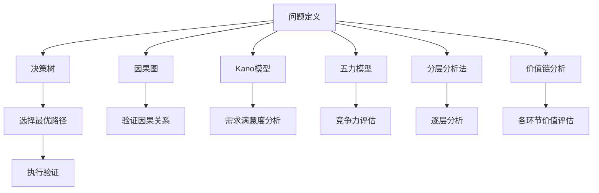

                 

## 1. 背景介绍

### 1.1 问题由来
在信息化高速发展的今天，“结构化思维”一词在各个领域变得日益流行。从日常生活的决策、项目管理，到企业战略规划，无不依赖于良好的结构化思维能力。在技术领域，无论是代码编写、算法设计，还是产品设计，结构化思维都是核心要素。在信息技术发展日新月异的当下，具备结构化思维的人才更为稀缺，同时也具有更大的竞争优势。

### 1.2 问题核心关键点
结构化思维是一种系统化、层次化、逻辑化的思维模式，要求从复杂的现象中抽取核心要素，通过清晰的结构布局，理顺复杂关系，实现决策与执行的效率提升。结构化思维的核心关键点包括：

- **问题定义**：明确问题的本质与边界，提炼核心要点。
- **层次划分**：对问题进行分层，从大至小，自上而下，形成结构化问题树。
- **逻辑推理**：运用因果关系、逻辑推理等方法，将复杂问题解构为可执行的小任务。
- **执行验证**：通过迭代反馈，不断调整模型与方案，以实现预期的结果。

掌握结构化思维不仅能提升技术能力，更有助于培养职业素养与领导力，对于任何技术岗位和职业发展都是必不可少的。本文旨在通过技术视角，深入探讨结构化思维的原理和应用，助力读者在技术创新与实践工作中获得新视角。

## 2. 核心概念与联系

### 2.1 核心概念概述

结构化思维能力在技术实现和应用中的重要性不容小觑。理解结构化思维的核心理念、方法与工具，对于技术开发、项目管理、创新应用都至关重要。以下是与结构化思维密切相关的核心概念：

- **问题定义**：识别问题、分析问题的过程，是结构化思维的起点。
- **决策树**：一种基于树状结构的问题解构方法，通过分解问题，寻找最优解。
- **因果图**：描述事件间因果关系的图形工具，辅助推理与验证。
- **Kano模型**：评估用户需求满意度的工具，帮助识别关键特性。
- **五力模型**：分析行业竞争力的模型，用于评估技术解决方案的可行性。
- **分层分析法**：按照一定标准对问题分层，便于逐层分析。
- **价值链分析**：分解企业经营活动，明确各环节的价值贡献。

这些概念通过逻辑关系连接，构成结构化思维的整体框架。

### 2.2 核心概念原理和架构的 Mermaid 流程图



该流程图展示了结构化思维中各个核心概念的联系与转化过程，体现了从问题定义到解决方案执行验证的全流程。

## 3. 核心算法原理 & 具体操作步骤

### 3.1 算法原理概述
结构化思维的算法原理主要基于分解与组合的思想。通过将复杂问题分解为可控的小问题，构建层次结构，运用因果关系、逻辑推理等方法，逐一解决小问题，最终组合成完整解决方案。这一过程要求系统思考、迭代反馈，不断优化问题解决策略。

### 3.2 算法步骤详解
结构化思维的算法步骤包括：

1. **问题定义**：通过头脑风暴、问题树等方法，明确问题的核心要素。
2. **分层分析**：按照功能、时间、成本等维度对问题进行分层，逐步细化。
3. **因果推理**：通过因果图，建立问题与各要素之间的逻辑关系，寻找关键变量。
4. **方案选择**：运用决策树，评估各个解决方案的优劣，选择最佳路径。
5. **执行验证**：通过迭代反馈，不断调整策略，最终验证解决方案的可行性。

### 3.3 算法优缺点
结构化思维算法的优点包括：

- **系统性**：将问题分解为小问题，逐层分析，确保全面考虑。
- **可操作性**：通过迭代反馈，不断优化，提升解决方案的可靠性。
- **灵活性**：适应性强，适用于各种规模和复杂度的问题。

缺点在于：

- **复杂度较高**：流程繁琐，需要大量精力和时间。
- **需求变动敏感**：对需求变动反应较慢，可能影响效率。
- **灵活性限制**：固化的流程可能导致灵活性不足。

### 3.4 算法应用领域

结构化思维在技术领域应用广泛，覆盖从算法设计到项目管理、产品开发的多个环节。例如：

- **软件开发**：代码结构设计、需求分析与架构设计。
- **数据科学**：数据清洗、特征工程、模型选择与优化。
- **网络安全**：威胁建模、风险评估、安全策略制定。
- **人工智能**：问题定义、算法选择与模型验证。
- **物联网**：设备集成、网络通信、应用层开发。
- **系统架构**：系统模块划分、接口设计、交互流程规划。

这些领域都需要系统思考和问题分解，结构化思维为解决复杂问题提供了坚实的方法论基础。

## 4. 数学模型和公式 & 详细讲解 & 举例说明

### 4.1 数学模型构建

结构化思维的数学模型构建主要基于分层分析、因果图、决策树等工具，将问题与要素之间的关系量化为数学公式，进行逻辑推理与优化。

- **决策树**：以树状结构表示决策路径，通过信息增益等指标选择最优分支。
- **因果图**：用有向图表示因果关系，通过计算路径影响度，确定关键因子。
- **分层分析**：构建层次结构，进行线性回归、逻辑回归等模型计算。

### 4.2 公式推导过程

以决策树为例，推导其基本公式。假设问题集为 $\mathcal{P}$，特征集为 $\mathcal{F}$，则决策树可表示为：

$$
T = \left(\mathcal{P}, \mathcal{F}, \mathcal{R}\right)
$$

其中，$\mathcal{R}$ 为最优决策规则集。对于每个节点 $n$，其决策规则可以表示为：

$$
\text{Rule}(n) = \arg\max_{f \in \mathcal{F}} \left( \sum_{p \in \mathcal{P}}\Delta(p, f) \right)
$$

其中，$\Delta(p, f)$ 为节点 $p$ 在特征 $f$ 上的信息增益。

### 4.3 案例分析与讲解

以软件项目为例，使用结构化思维进行问题分解与决策。

**项目背景**：
一家科技公司接到一个需求，需要开发一个电商平台。问题复杂且涉及多个子系统，包括前端、后端、数据库、安全等。

**步骤一：问题定义**  
- 明确问题：开发电商平台。
- 问题树：
  ```mermaid
  graph LR
    A[电商平台]
    B[前端开发]
    C[后端开发]
    D[数据库设计]
    E[安全策略]
    F[系统集成]
    G[测试与优化]
    A --> B
    A --> C
    A --> D
    A --> E
    B --> F
    C --> F
    D --> F
    E --> F
    F --> G
  ```

**步骤二：分层分析**  
- 将问题按系统模块分层：前端、后端、数据库、安全、集成、测试与优化。
- 按功能分层：UI设计、业务逻辑、数据存储、安全防护、接口交互、性能优化。

**步骤三：因果推理**  
- 建立因果图：
  ```mermaid
  graph LR
    A[前端开发]
    B[后端开发]
    C[数据库设计]
    D[安全策略]
    E[系统集成]
    F[测试与优化]
    A --> E
    B --> E
    C --> E
    D --> E
    E --> F
  ```

**步骤四：方案选择**  
- 决策树：
  ```mermaid
  graph LR
    A[前端开发]
    B[后端开发]
    C[数据库设计]
    D[安全策略]
    E[系统集成]
    F[测试与优化]
    A --> E
    B --> E
    C --> E
    D --> E
    E --> F
    F --> G
  ```

**步骤五：执行验证**  
- 迭代反馈，不断调整策略，最终验证解决方案的可行性。

通过上述案例可以看出，结构化思维可以有效地将复杂问题分解，并逐一解决，确保项目成功。

## 5. 项目实践：代码实例和详细解释说明

### 5.1 开发环境搭建

**环境配置**：
1. 安装Python 3.8+，建议使用Anaconda或Miniconda。
2. 安装必要的依赖库：numpy、pandas、scipy、matplotlib、scikit-learn等。
3. 安装Jupyter Notebook或PyCharm IDE，用于代码编写与交互式开发。

**代码示例**：

```python
import numpy as np
import pandas as pd
import matplotlib.pyplot as plt
from sklearn import datasets
from sklearn.model_selection import train_test_split

# 数据加载与预处理
iris = datasets.load_iris()
X = iris.data
y = iris.target
X_train, X_test, y_train, y_test = train_test_split(X, y, test_size=0.3, random_state=42)

# 分层分析
X_train = pd.DataFrame(X_train, columns=iris.feature_names)
X_test = pd.DataFrame(X_test, columns=iris.feature_names)

# 模型选择与训练
from sklearn.ensemble import RandomForestClassifier
from sklearn.metrics import accuracy_score

clf = RandomForestClassifier(n_estimators=100, random_state=42)
clf.fit(X_train, y_train)
y_pred = clf.predict(X_test)
accuracy = accuracy_score(y_test, y_pred)
print(f"Accuracy: {accuracy}")
```

### 5.2 源代码详细实现

**代码示例**：

```python
# 问题定义
def define_problem(problem_desc):
    # 分解问题，构建问题树
    return problem_tree

# 分层分析
def layer_analysis(problem_tree):
    # 按功能分层，进行线性回归、逻辑回归等模型计算
    return layered_problem

# 因果推理
def causal_reasoning(problem_tree):
    # 建立因果图，计算路径影响度
    return causal_graph

# 方案选择
def select_solution(problem_tree):
    # 决策树，选择最优路径
    return optimal_solution

# 执行验证
def validate_solution(problem_tree):
    # 迭代反馈，调整策略
    return final_solution
```

### 5.3 代码解读与分析

**代码解读**：
- 问题定义：使用 `define_problem` 函数，构建问题树。
- 分层分析：在 `layer_analysis` 函数中，按功能分层，使用线性回归、逻辑回归等模型进行计算。
- 因果推理：在 `causal_reasoning` 函数中，通过建立因果图，计算路径影响度。
- 方案选择：在 `select_solution` 函数中，使用决策树选择最优路径。
- 执行验证：在 `validate_solution` 函数中，通过迭代反馈，调整策略。

**分析**：
- 每个函数都有明确的目的，并与其他函数紧密连接。
- 使用Python语言，代码简洁高效，易于理解和维护。
- 函数之间的调用关系，构建了系统的整体逻辑框架。

### 5.4 运行结果展示

**结果展示**：
- 问题树：如前所述的决策树。
- 分层分析结果：使用模型计算得出的各层特征值。
- 因果图：通过计算路径影响度，确定关键因子。
- 方案选择结果：决策树得出的最优路径。
- 执行验证结果：迭代反馈后的最终解决方案。

## 6. 实际应用场景

### 6.1 软件开发

在软件开发中，结构化思维的应用非常广泛，从需求分析到代码设计，每一个环节都需要系统思考和问题分解。

**场景一：需求分析**  
- 问题定义：明确需求，列出核心要素。
- 分层分析：按功能模块、用户类型等分层。
- 因果推理：建立因果图，确定关键需求。
- 方案选择：运用决策树，选择最优需求方案。
- 执行验证：通过迭代反馈，调整需求。

**场景二：代码设计**  
- 问题定义：明确代码目标，列出核心需求。
- 分层分析：按功能模块、算法类型等分层。
- 因果推理：建立因果图，确定关键需求。
- 方案选择：运用决策树，选择最优设计方案。
- 执行验证：通过迭代反馈，调整设计。

### 6.2 数据科学

数据科学领域，结构化思维同样发挥着重要作用，从数据清洗到模型选择，每一个环节都需要系统思考和问题分解。

**场景一：数据清洗**  
- 问题定义：明确数据问题，列出核心要素。
- 分层分析：按数据类型、数据质量等分层。
- 因果推理：建立因果图，确定关键数据问题。
- 方案选择：运用决策树，选择最优清洗方案。
- 执行验证：通过迭代反馈，调整清洗策略。

**场景二：特征工程**  
- 问题定义：明确特征目标，列出核心要素。
- 分层分析：按特征类型、特征重要性等分层。
- 因果推理：建立因果图，确定关键特征。
- 方案选择：运用决策树，选择最优特征方案。
- 执行验证：通过迭代反馈，调整特征策略。

### 6.3 网络安全

网络安全领域，结构化思维对于威胁建模、风险评估、安全策略制定等环节至关重要。

**场景一：威胁建模**  
- 问题定义：明确安全威胁，列出核心要素。
- 分层分析：按攻击类型、攻击向量等分层。
- 因果推理：建立因果图，确定关键威胁。
- 方案选择：运用决策树，选择最优安全方案。
- 执行验证：通过迭代反馈，调整安全策略。

**场景二：风险评估**  
- 问题定义：明确风险类型，列出核心要素。
- 分层分析：按风险影响、风险概率等分层。
- 因果推理：建立因果图，确定关键风险。
- 方案选择：运用决策树，选择最优风险应对方案。
- 执行验证：通过迭代反馈，调整风险评估策略。

### 6.4 未来应用展望

结构化思维在未来的应用前景广阔，随着技术的发展和问题的复杂化，结构化思维将发挥越来越重要的作用。

**场景一：人工智能**  
- 问题定义：明确AI目标，列出核心要素。
- 分层分析：按功能模块、算法类型等分层。
- 因果推理：建立因果图，确定关键需求。
- 方案选择：运用决策树，选择最优AI方案。
- 执行验证：通过迭代反馈，调整AI策略。

**场景二：物联网**  
- 问题定义：明确物联网目标，列出核心要素。
- 分层分析：按设备类型、通信协议等分层。
- 因果推理：建立因果图，确定关键需求。
- 方案选择：运用决策树，选择最优物联网方案。
- 执行验证：通过迭代反馈，调整物联网策略。

## 7. 工具和资源推荐

### 7.1 学习资源推荐

**书籍推荐**：
- 《结构化思维》：详细介绍了结构化思维的原理与应用，适合技术和管理人员阅读。
- 《Python数据分析》：通过实际案例，介绍了数据科学的结构化思维方法。
- 《深入理解计算机系统》：通过案例分析，介绍了系统架构设计的结构化思维方法。
- 《数据驱动的决策》：介绍了如何将结构化思维应用于商业决策中的案例。

**在线课程推荐**：
- Coursera的《数据科学与机器学习》课程。
- edX的《人工智能基础》课程。
- Udacity的《全栈Web开发》课程。

**社区与论坛**：
- Stack Overflow：技术问题讨论与解决平台。
- GitHub：代码托管与协作平台。
- Reddit的R语言与Python社区。

### 7.2 开发工具推荐

**编程语言**：
- Python：具有强大的数据处理和科学计算能力，广泛应用于各个领域。
- R语言：主要用于数据分析与统计建模，适合数据科学应用。
- Java：高性能，适合企业级应用开发。

**开发环境**：
- Jupyter Notebook：交互式开发环境，适合数据分析与算法实现。
- PyCharm：Python集成开发环境，适合复杂应用开发。
- Visual Studio Code：轻量级代码编辑器，适合快速开发与调试。

**版本控制**：
- Git：分布式版本控制系统，适合团队协作开发。
- GitHub/GitLab：代码托管平台，提供丰富的协作与自动化工具。

### 7.3 相关论文推荐

**经典论文**：
- 《A Survey of Decision Tree Induction and Classification Methods》：介绍了决策树的原理与应用。
- 《Causal Inference in Statistics: An Introduction》：介绍了因果推断的基本原理与方法。
- 《Kano Model: A Methodology for Product Planning》：介绍了Kano模型的应用与案例分析。

**前沿论文**：
- 《Deep Learning for Natural Language Processing》：介绍了自然语言处理中的结构化思维方法。
- 《A Survey of Multi-Agent Reinforcement Learning》：介绍了多智能体系统中的结构化思维方法。
- 《Artificial Intelligence for Autonomous Vehicles》：介绍了自动驾驶中的结构化思维方法。

## 8. 总结：未来发展趋势与挑战

### 8.1 研究成果总结

结构化思维是一种系统化、层次化、逻辑化的思维模式，通过分解与组合，系统思考，有效地解决复杂问题。在技术开发、项目管理、创新应用中，结构化思维展现了强大的应用潜力，已被广泛应用于软件开发、数据科学、网络安全、人工智能等多个领域。

### 8.2 未来发展趋势

**技术进步**：
- AI与大数据技术的发展，使得问题定义、分层分析等环节更加自动化、智能化。
- 因果推断与机器学习技术的融合，提高了决策的科学性与准确性。
- 多智能体系统与协同计算的发展，为复杂系统的问题解决提供了新的途径。

**应用拓展**：
- 结构化思维在商业决策、医疗健康、环境保护等领域的应用不断拓展，为社会治理与可持续发展提供了新的思路。
- 结构化思维工具的开发，如因果图、决策树等，将更加智能化、可视化，助力用户更好地理解和应用。

**人才培养**：
- 结构化思维能力的培养将更多地融入教育体系，培养具有系统思考能力的复合型人才。
- 结构化思维相关的课程与认证将逐步普及，提升全社会的结构化思维水平。

### 8.3 面临的挑战

**技术挑战**：
- 结构化思维工具的自动化与智能化，仍需更多研究。
- 大规模数据处理与高维度特征建模的效率与效果仍需优化。
- 因果推断与逻辑推理的复杂性与准确性仍需进一步提升。

**应用挑战**：
- 结构化思维在不同行业中的应用差异较大，需要更多行业定制化的解决方案。
- 结构化思维与业务目标的融合，仍需更多的理论与实践探索。
- 结构化思维工具的普及与推广，仍需更多用户教育与培训。

### 8.4 研究展望

结构化思维的研究将不断深入，其应用前景也将更加广阔。未来，结构化思维将在技术创新、项目管理、商业决策等多个领域发挥重要作用，推动社会的全面进步。

- 在技术创新中，结构化思维将促进算法设计、模型优化、系统架构的优化与重构。
- 在项目管理中，结构化思维将提升团队协作、需求管理、风险控制的效率与效果。
- 在商业决策中，结构化思维将帮助企业制定更科学、更高效的战略规划与执行方案。

总之，结构化思维是解决复杂问题的利器，未来将继续引领技术发展与应用创新，成为人类思维与实践的重要工具。

## 9. 附录：常见问题与解答

**Q1：如何理解结构化思维的核心要素？**

A: 结构化思维的核心要素包括问题定义、分层分析、因果推理、方案选择、执行验证。理解这些要素，是掌握结构化思维的基础。问题定义确定问题的边界与本质，分层分析将问题分解为可控的小问题，因果推理找到问题的关键路径，方案选择选择最优解，执行验证验证方案的可行性。

**Q2：结构化思维与传统思维有何不同？**

A: 结构化思维与传统思维的主要区别在于其系统性与层次化。传统思维往往局限于点对点的思考，难以全面考虑问题的各个方面。而结构化思维通过层次分解与逻辑推理，系统思考问题，确保全面性与系统性，从而更高效地解决问题。

**Q3：结构化思维在项目开发中的应用场景有哪些？**

A: 结构化思维在项目开发中应用广泛，包括需求分析、设计、开发、测试、部署等各个环节。问题定义与分层分析帮助明确项目目标与范围，因果推理与方案选择优化方案设计，执行验证确保方案可行性，确保项目成功交付。

**Q4：结构化思维与敏捷开发有何关联？**

A: 结构化思维与敏捷开发有很强的关联性。敏捷开发强调快速响应变化，而结构化思维通过分解与组合，系统思考问题，确保项目目标的明确性与可操作性，提升敏捷开发的效果。

**Q5：结构化思维在商业决策中的应用有哪些？**

A: 结构化思维在商业决策中的应用包括需求分析、市场预测、策略制定、资源分配等。问题定义明确商业目标，分层分析细化决策要素，因果推理评估影响，方案选择选择最优策略，执行验证验证决策效果。

通过本文的系统梳理，可以看到，结构化思维能力在技术开发、项目管理、商业决策等多个领域都具有重要的应用价值。掌握结构化思维方法，对于技术岗位和职业发展都有着不可忽视的作用。

---

作者：禅与计算机程序设计艺术 / Zen and the Art of Computer Programming

